# 等你要开始赚钱了-就会知道我们往往不是人---P1---赏味不足---BV1kJ4m1P7Nn_no

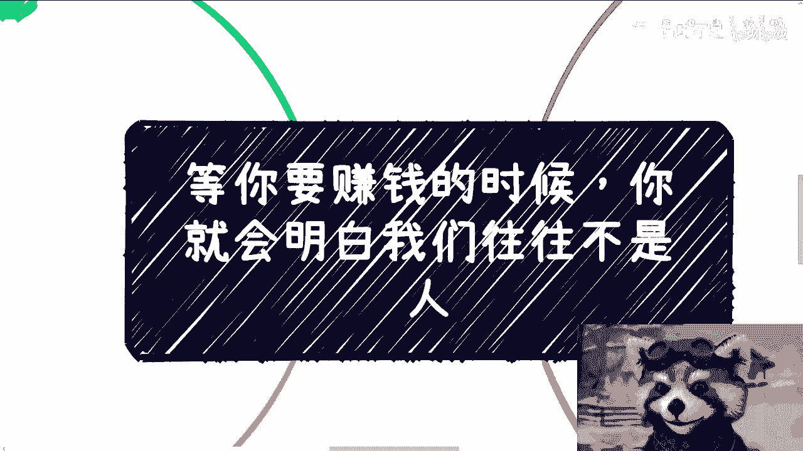

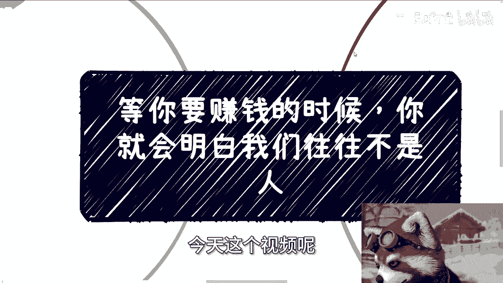

在本节课中，我们将探讨一个在商业和赚钱过程中至关重要的认知转变：为什么在追求财富的道路上，我们和他人都常常不被视为传统意义上的“人”。我们将通过具体案例和逻辑分析，帮助你理解商业世界的底层规则，并学会用更理性的视角看待合作、竞争与自我成长。

---

## 课程导入：从“北京户口”案例说起

在深入核心主题前，我们先看一个现实案例。一位咨询者计划与伴侣留在北京，希望通过数年辛苦工作，为孩子获得一个北京户口，认为这是“不让孩子输在起跑线上”。

从这个案例中，我们可以发现两个关键问题：
1.  将“户口”等同于“起跑线”过于简化。真正的起跑线是综合资源，而非单一身份。
2.  以他们预期的收入水平，在北京维持家庭并偿还贷款将非常拮据。这看似是为孩子牺牲，实则可能让整个家庭陷入困境，并将压力转嫁给下一代。

这个案例引出了我们今天要讨论的核心：在涉及重大利益（如赚钱、资源争夺）的决策中，过于“人性化”的、感性的思考方式，往往会导致判断失误和实际利益的损失。

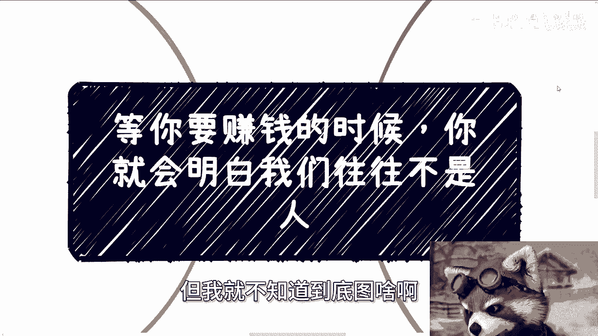

---

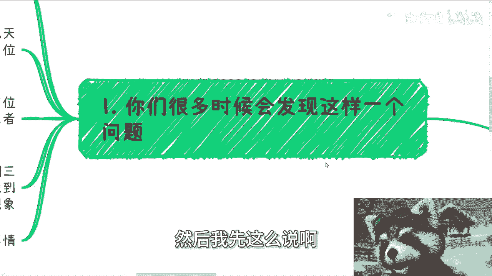

## 核心认知：商业世界中的“非人化”现象

上一节我们通过一个生活案例看到了感性规划的潜在问题。本节中，我们来看看在纯粹的商业领域，这种现象如何更加赤裸和普遍。

很多人会发现，许多事情在临门一脚时出问题。过程顺利，但最终赚不到钱，落得一地鸡毛。原因在于，商业逻辑常常与日常的人际情感逻辑相悖。

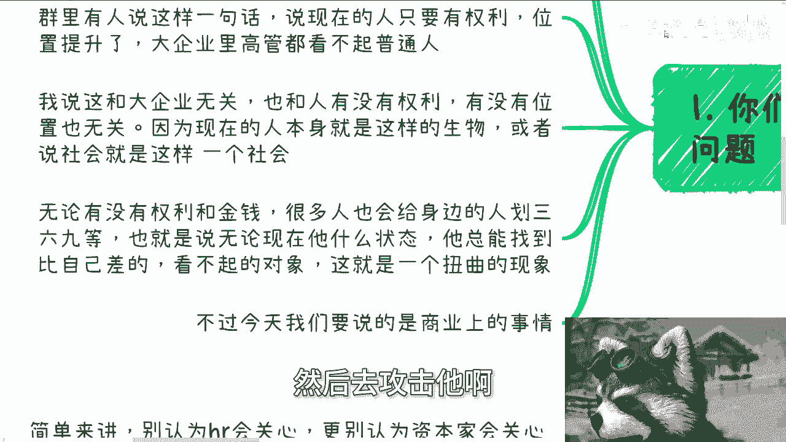

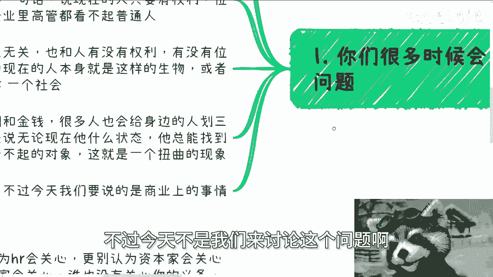

### 现象一：合作中的价值掠夺

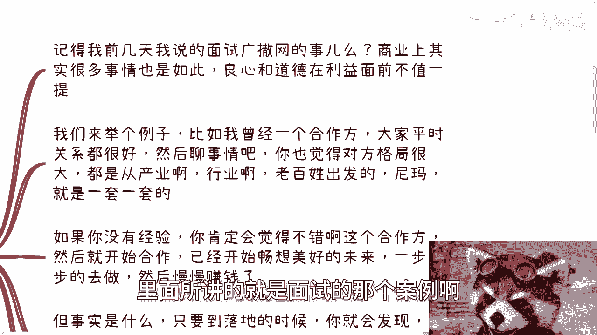

以下是商业合作中一种常见模式：

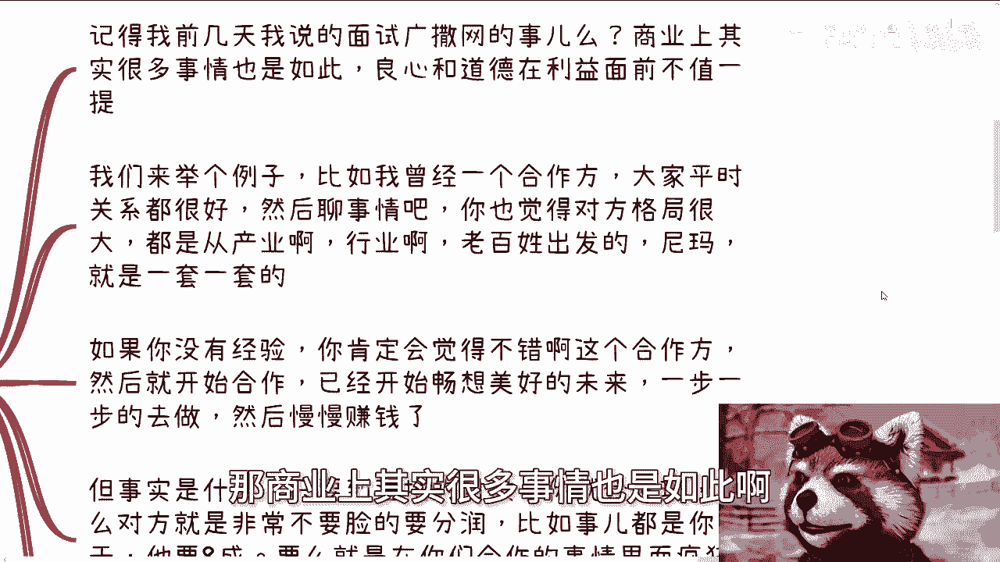

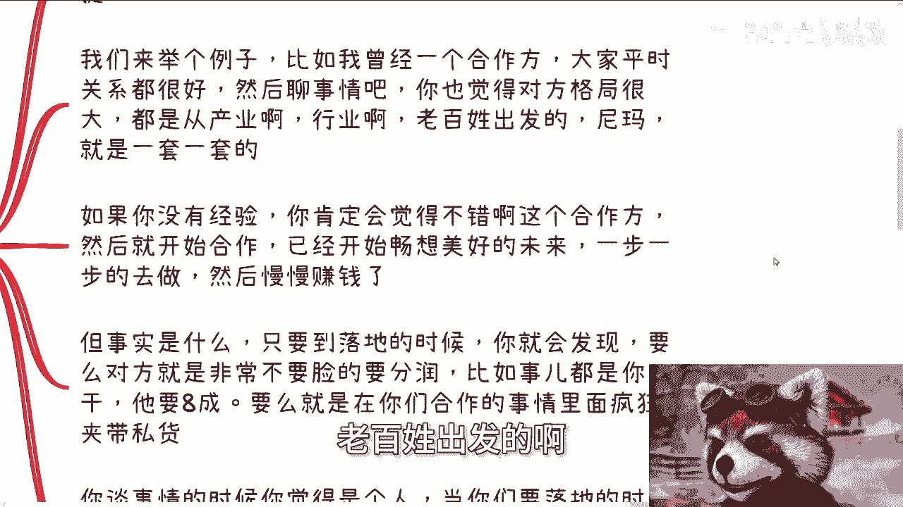

1.  **初期接触**：对方表现得格局宏大，从行业、用户角度侃侃而谈，给人感觉是理想的合作伙伴。
2.  **合作推进**：对方开始以合作为名，要求你不断输出方案、文档、PPT等具体成果，进行“白嫖”。
3.  **利益分配**：当涉及核心利益分成时，对方可能在未付出对等劳动的情况下，提出极其不公平的比例（例如对方要求占八成）。
4.  **夹带私货**：在合作中，对方可能暗中推进自己的私人利益，且不与你沟通。

**核心公式**：`感性信任 + 无保留付出 = 被价值掠夺的风险`

在这个过程中，谈判时双方看似平等，但落地执行时，对方从未将你视为平等的“人”来尊重，而是视为可榨取价值的“工具”。你可以从道德上谴责，但事实是对方通过这种方式赚到了钱。

### 现象二：“站着赚钱”还是“跪着赚钱”？

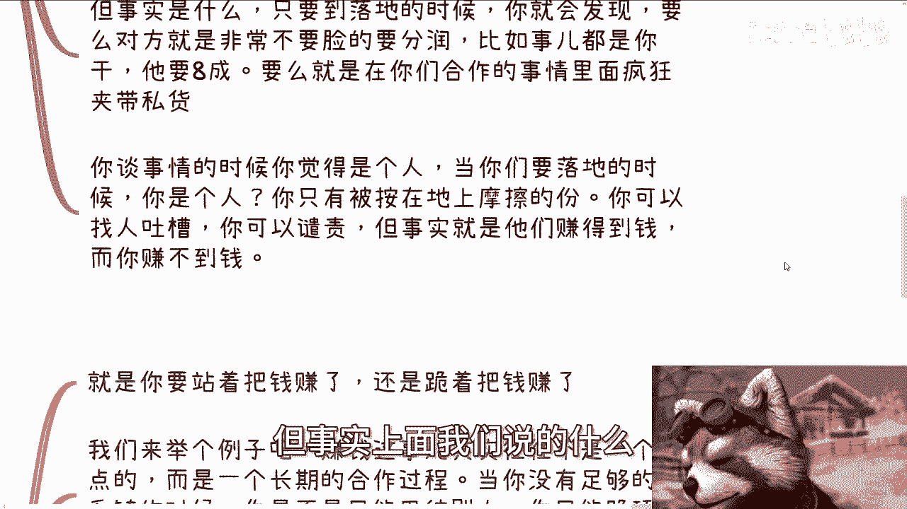

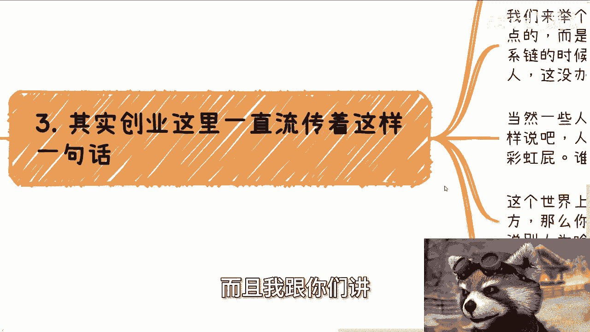

创业圈有一句话：你要么站着挣钱，要么跪着挣钱。赚钱是一个长期过程，而非单次交易。

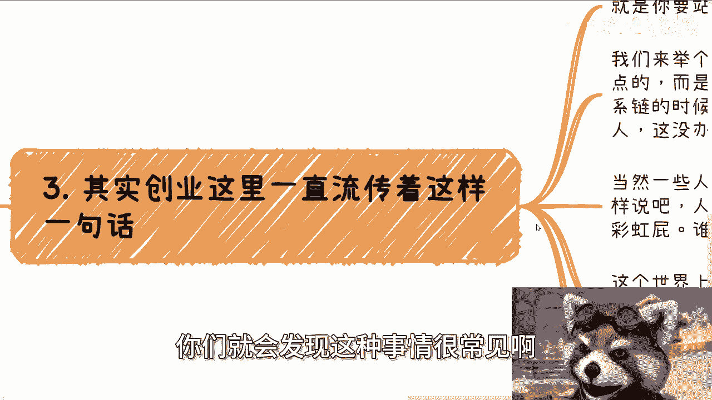

当你资源有限、关系链薄弱时，作为普通人，往往需要先放低姿态。世界上有无数供应商和乙方，你的“靠谱”与否永远是比较出来的。如果别人都愿意提供额外情绪价值或更灵活的条件（半蹲或跪着），而你坚持“站着”，别人为什么选择你？

**正确路径**：`跪着积累 -> 半蹲发展 -> 站着共赢`

正确的逻辑是先强大自身，赚到第一桶金，建立立足之本，然后才有资本逐步调整姿态，从“跪着”到“站着”。一开始就妄想以“圣母”心态站着把钱赚了，通常是不切实际的。

---

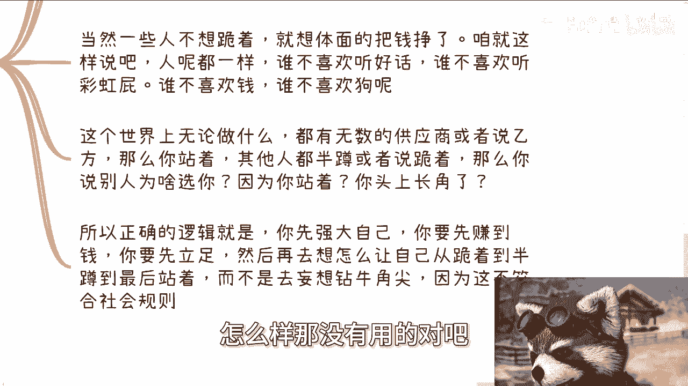

## 行动指南：如何运用“非人化”思维

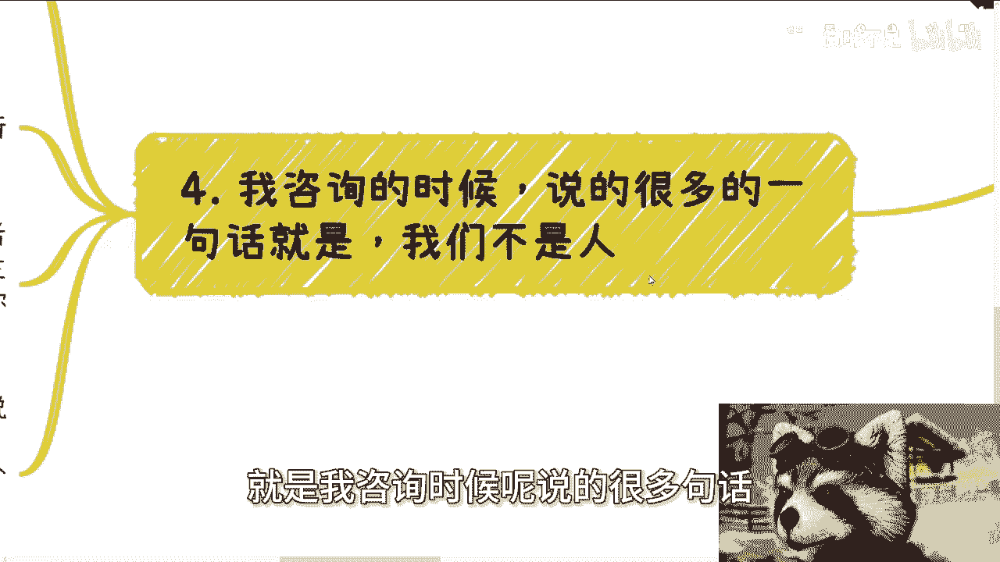

理解了商业世界的残酷性，我们该如何行动？本节将提供具体的思维转换方法。

在社会的各个环节，你需要明白：HR的核心任务是筛选合适成本的人力，资本家的核心诉求是利润和产出，国家的管理对象是宏观秩序。没有人有义务关心作为个体的“你”。商业世界只关心**成本**与**产出**。

以下是三个关键的思维转换建议：

1.  **摒弃感性判断**：尽量不用道德、良心等感性标准做商业决策。感性判断掺杂主观意愿，容易陷入“公说公有理，婆说婆有理”的困境，且通常无法带来实际收益和成长。
2.  **聚焦核心目标**：将所有行为视为实现核心目标的步骤。如果你的目标是赚钱或获得权势，那么一切行动都应围绕此展开。犹豫和纠结说明你对目标不够渴望。用理性思维替代人性纠结，直接评估：`行动 -> 是否有利于目标 -> 是/否`。
3.  **理解资源联动性**：钱、权、圈子、地位是相辅相成的系统。你很难在毫无资本的情况下空手套得权柄和高端人脉。反之亦然。对于普通人而言，**赚钱是撬动其他资源最可行的初始杠杆**。优先解决经济基础，很多上层建筑问题会随之出现解决方案。

---

## 课程总结

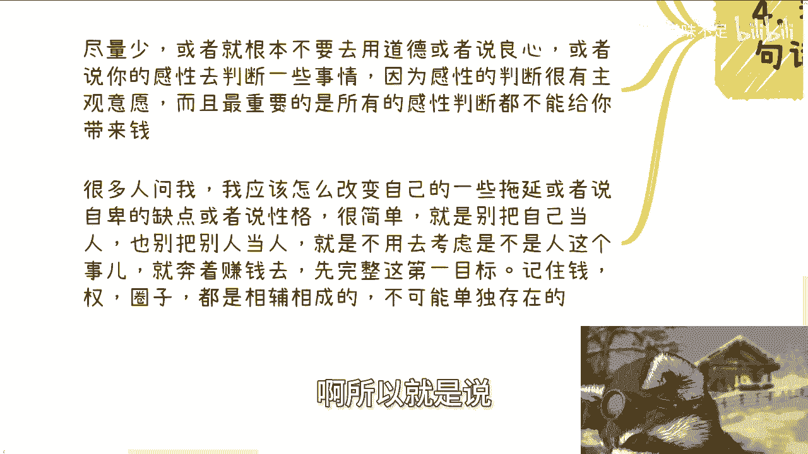

本节课我们一起学习了商业世界中一个反直觉但至关重要的认知：在赚钱和利益交换的场景中，过度强调“人性”和感性，往往会成为阻碍。

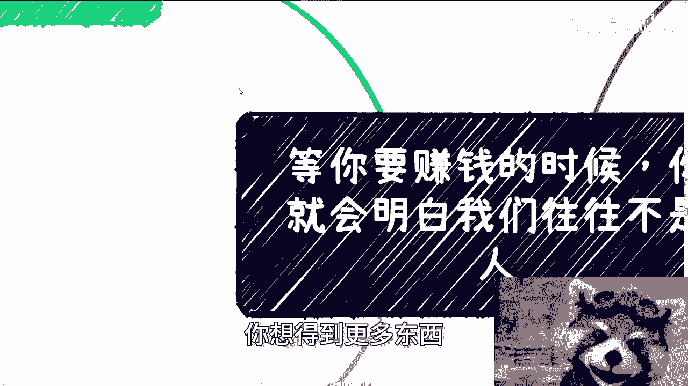

我们首先通过一个关于户口与起跑线的案例，指出了感性长远规划的缺陷。接着，深入分析了商业合作中常见的价值掠夺模式，以及“站着赚钱”理想背后的现实路径。最后，我们给出了具体的行动指南，包括摒弃感性判断、聚焦核心目标和理解资源联动性。

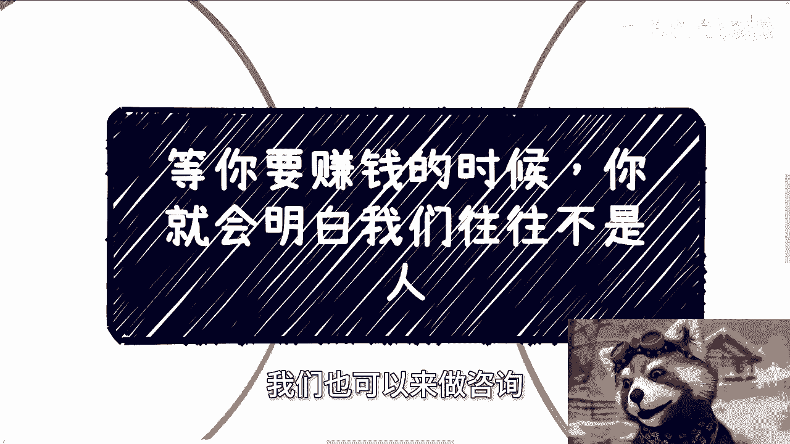

记住，这种“非人化”思维并非提倡做冷血的恶人，而是倡导一种**极致的理性**：认清各方（包括自己）的本质诉求都是利益，并以系统化的方式去管理和实现这些诉求，避免被情感和表象误导，从而在商业世界中更有效地保护自己、达成目标。