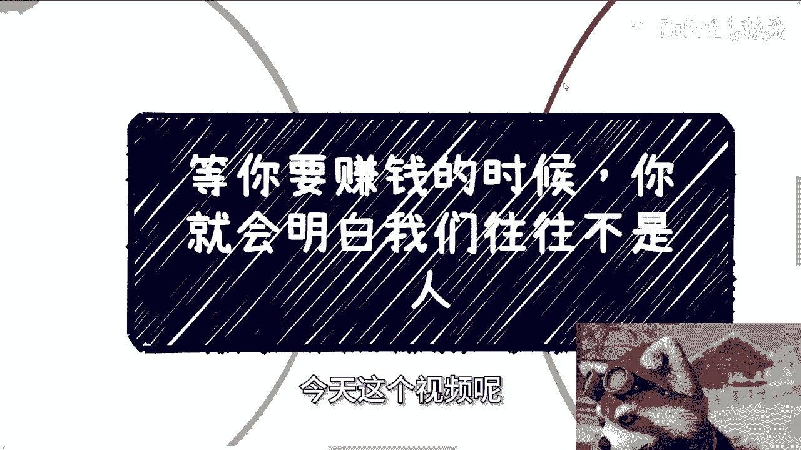
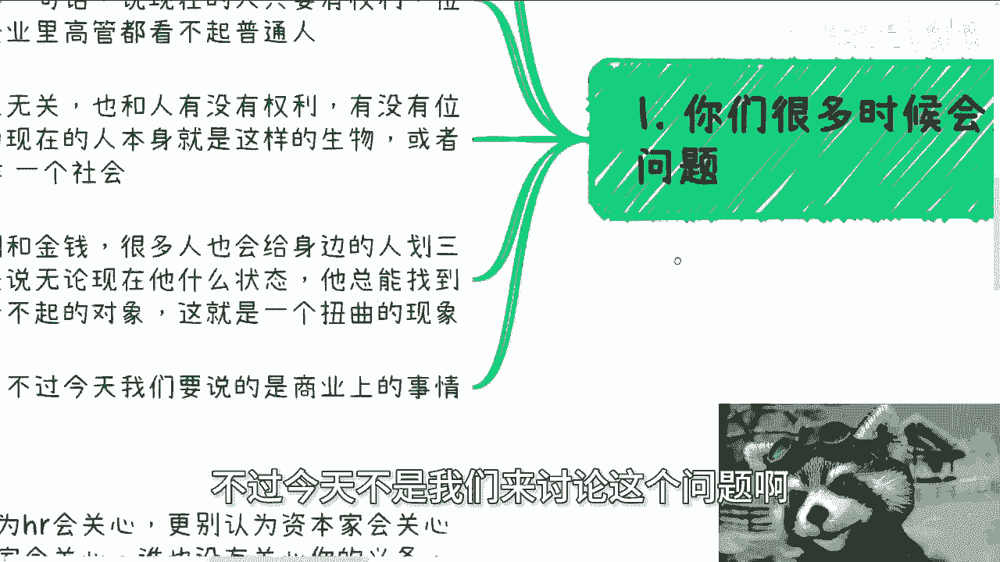
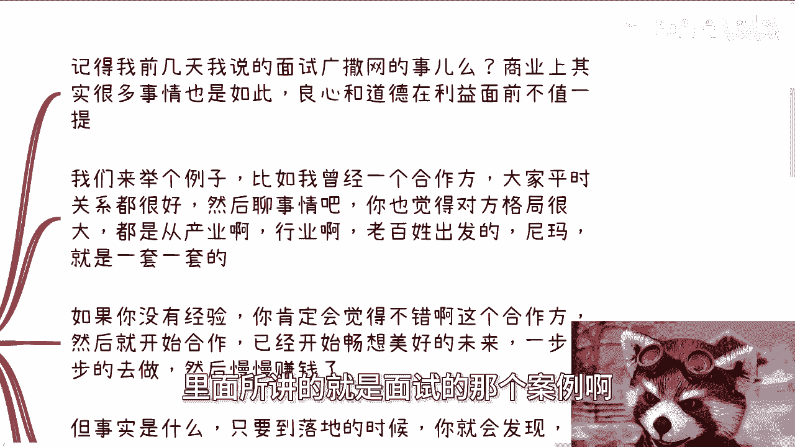
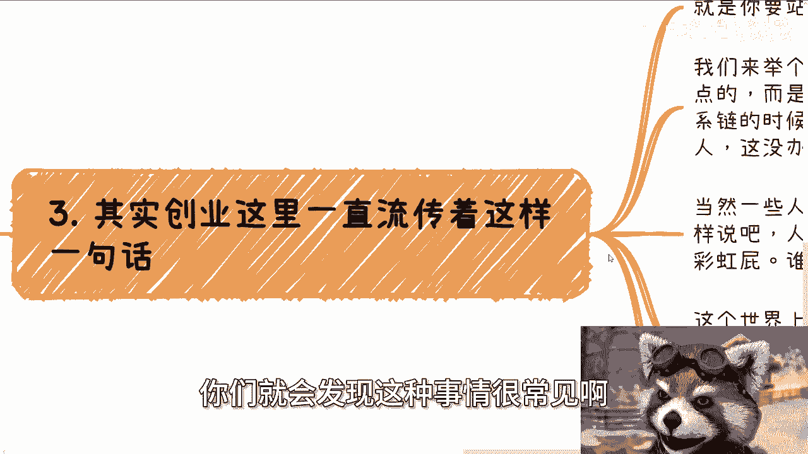
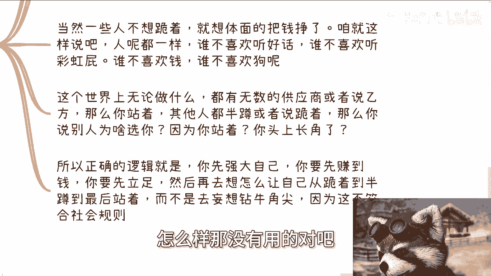
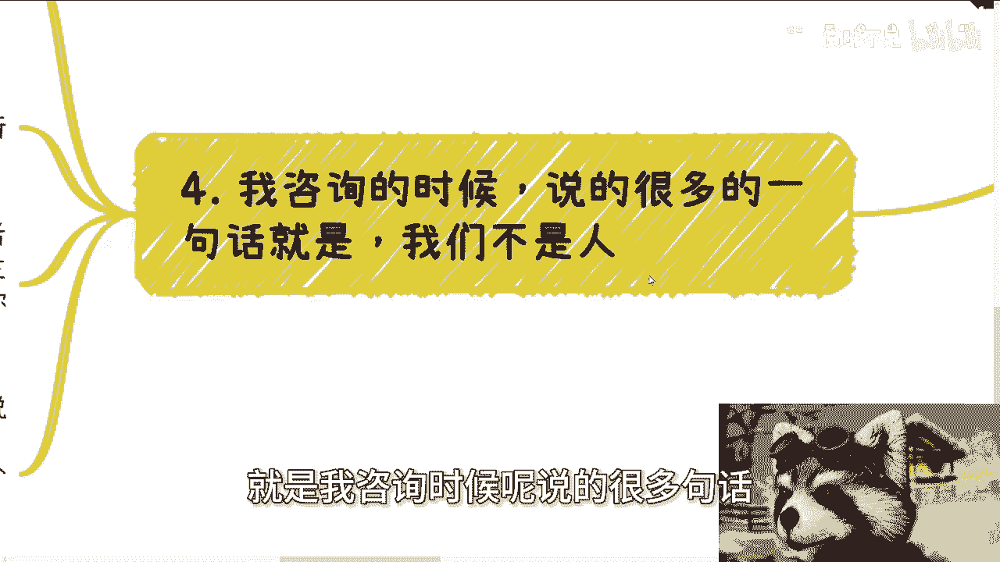
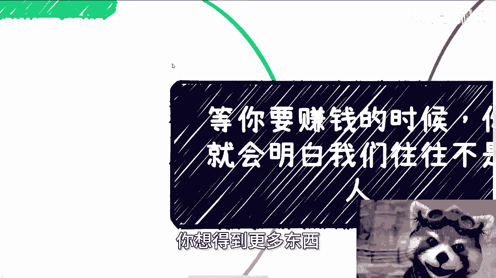
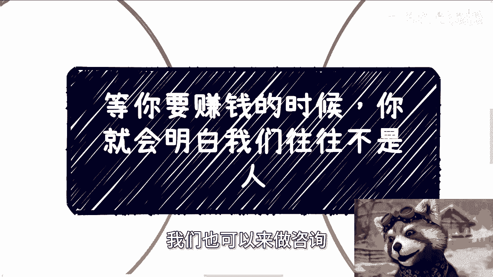

# 等你要开始赚钱了，就会知道我们往往不是人 - P1 - 赏味不足 - BV1kJ4m1P7Nn

嗯好大家好，今天这个视频呢也是在白天录的。

晚上待会要出去应酬一下啊，讲这个主题之前呢，今天我们讲的这个主题啊，是等你赚钱的时候，你会明白我们往往不是人啊，嗯讲这个主题之前呢，我想先我突然想到一个事儿啊，我也顺便提一下，因为之前的话呢。

呃首先啊这两天这个网络上有个瓜对吧，是跟北京户口有关的，那如果你们没吃，你们可以去吃一下啊，然后呢就说到北京户口呢，我也想到了一个事儿，就是之前呢有个咨询的小伙伴，当时说要在北京这个留下来啊。

然后按照他的说法呢，他说他嗯就是说年薪其实也不是特别高嘛，然后想着就是说呃给他呢，还有他呃老婆对吧，就就是就马上就得结婚了，然后结婚了就要生孩子啊，然后按照他的说法呢，他说他这个再辛苦个几年啊。

为了呢就是说啊给孩子弄个户口对吧，怎么样子嗯按照我的观点啊，嗯那我先说按照他的想法吧，按照他的想法呢，他可能会觉得就是说呃，给孩子带来一个起跑线啊，带来一个基础的一个一个基本的东西，然后比如说从一个呃。

因为他老家可能在别的地方嘛对吧，从一个其他地方到了北京啊，然后怎么样怎么样，然后按照他的说法呢，就是说能够让孩子不输在起跑线上面，嗯那其实你从我的角度来讲，我觉得这个当中有两个问题。

第一个问题是我觉得他那就太把他当成一个人，为什么呢，因为你不是说就一个户口的事，就那个在一个起跑线了对吧，你要是说单纯一个户口的时候，就在一个起跑线，那也太容易了一点对吧，首先首先这是第一点。

第二点是我觉得以他跟他老婆当时的薪资啊，就是就算未来56年能够涨的话，在北京也很难，也不是很难吧，就是会过得很拮据，那其实在我看来，我就会觉得，就是说这不是说给孩子一个户口的问题。

就是这明显就是所谓的乡人，相信后人智慧，就是说你觉得是给他带来一个起跑线，但是他会这么觉得吗，对吧，也就是说所以我当时跟他是这么想的，当然我个人是觉得，他最后应该没有接受我的这种想法。

就是我跟他是这么说的，我说你要真的这个在北京对吧，你就创造一个好一点的条件，你不要就是那种上不上下不下的对吧，就是就是钱嘛也赚不了多少，然后呢又贷款，然后好好像看似孩子有个户口对吧。

但其实他妈的过得过得跟乞丐一样的，那那图啥呢，那就不明白呀，我是真不明白对吧，那当然就是就是，我不知道是是不是有很多人就这么想了，但是在我看来就是说就这不是一种负责任的，负责任的这种这种感。

就就就这种计划或者这种这种这种意识对吧，就是你要觉得你给他带来的东西，那你就带来足够的东西，我不说什么财务自由对吧，但至少得过得好吧，你别你别就说哦，好像就是说我给你一个户口了，然后呢。

我们然后又过得很拮据，但我就不知道到底图啥嗯。

好先先说这么个事儿吧，然后我先这么说啊。

你们很多时候会发现了这么一个问题，就是呃很多事情呢都是临门一脚，就是貌临门一脚的时候呢，貌似出了问题，也就是说你过程当中呢你都觉得很顺啊，然后呢呃你觉得省啊，然后就赚不到钱，一地鸡毛。

我跟你讲这事其实很简单，因为人呢他就这么个生物啊，前几天我一个群里面有人说这么一句话，他说现在的人只要有权利啊，位置提升了，大企业里面的高管呢，像这种中高层管理都看不起普通普通人啊。

我说这个跟大企业其实没什么关系，呃这跟人有没有权利，有没有位置，有没有地位，甚至都没有关系，因为现在的这个社会的人呢，他很多人啊，他就是这么一种生物，或者说社会就是这么一种社会，就是你会发现很多人啊。

他没有没有权利，有没有金钱，有没有地位无所谓，他依然会给他身边的人画369等，因为无论他现在怎么样的状态，他总能找到比自己差的啊，当然了，就是他认为比自己差的，是不是真的比他差，咱也不知道对吧。

他总能去看，找到比那个他看不起的对象，然后去攻击他啊。

然后那怎么办呢，这就是现在人的这种扭曲的现象，不过今天我们不是我们来讨论这个问题啊。

今天我们来讨论是商业上的事情，那很多人跟我说啊，有些事情呢没有道德，没有良心，我跟你这么讲啊，记得我前两天那个视频里面所讲的，就是面试的那个案例啊。

就是广撒网的这个事情对吧，那商业上其实很多事情也是如此啊。

我给你们举个例子，就比如说我以前曾经一个合作方啊，就是我跟他们聊呢啊，聊的都很好啊，就大家聊的都很开心啊，呃你也会觉得对方格局很大啊，而且呢它会让你感觉到他是从产业行业啊，老百姓出发的。

反正就是他妈的一套一套的啊，那我就这么说啊，如果你没有经验啊，你肯定会觉得嗯这是个不错的合作方，然后就开始合作啊，然后呢开始一边合作的时候呢，一边畅想美好的未来啊，然后就想着一步一步做，踏踏实实做。

然后慢慢赚钱对吧，但事实是什么呢，事实是在落地过程当中，你就会发现对方不但不停的白嫖你，比如说啊让你出方案啊，让你出什么啊，这个word那个PDF，这个PPT啊，反正就让你出。

然后呢当真正要谈分论的时候呢，你就会发现对方非常不要脸的，并且可能什么事情都没有做的情况下，他要八成啊，然后就是呃要么就是说是在你们合作室里面，事情里面疯狂夹带私货，而夹带私货，同时呢他也不跟你讲啊。

那么你就会发现啊，你就会发现就是说谈事情的时候呢，你都觉得对方也是个人，你也是个人，当你们落地的时候呢，你就会发现根本就不是人啊，或者对方从来就没把你当过世人啊，那么你只有被按在地上摩擦粉。

那同样的就这种事情呢，你可以找人吐槽，你也可以谴责他，你也可以从道德层面去去说他对吧，怎么怎么样啊，但事实上面我们说的什么。

说的就是他赚到钱，而你赚不到，对吧啊，那这个是一个，而且我跟你们讲。

你们但凡去社交了，去赚钱了，你们就会发现这种事情很常见啊。

那么第二点呢，就是说创业里面一直流传着这么一句话，叫做你要么站着把钱赚了，要么就是跪着跪着把钱赚了，对我们来举个例子，赚钱这个事其实往往不是一个节点，而是一个长期的合作过程。

就当你没有足够的关系链的时候，你你做个普通人，我们就说啊，你作为一个大部分情况的普通人，你只能巴结别人，你只能跪舔别人，这没有办法的，那当然有一些人啊，我身边也有一些人，他他不想归真啊。

他他就说他按照他们的说法呢，他说我想体面的把钱挣了，我给你直接这么说啊，咱就这么来讲，人呢谁都喜欢听好话啊，谁都喜欢听彩虹屁，谁都喜欢钱对吧，而且谁都喜欢狗，什么意思呢。

意思就是说这个世界上无论你做什么，无论呃呃无论你做什么，你都有无数的供应商和乙方，就是说你跟很多人的思想当中的观念，它是一个相对相对论，就是比如说我觉得打个比方，比如说我觉得你是靠不靠谱的。

那你觉得我觉得你靠不靠谱，一定是有一个参照物，我觉得你靠不靠谱对吧，那如果全世界你说啊，只有我跟你两个人家当夏娃对吧，你说我判断你靠不靠谱，我，我怎么判断呢，对不对，就是它都是有个参照物的。

那么这个时候你就会发现，如果你站着，其他人都是半蹲或者跪着，那么你说别人为啥选你呢啊为啥选你呢，因为你站着吗，因为你头上长角吗，那肯定不是啊对吧，所以正确的逻辑是什么呢，就是你只能是我们先从目标来讲。

你只能先强大你自己，你要赚到钱，而而且你要在这个社会上有立足之本对吧，然后你再去想着让自己从跪着到半蹲，最后站着对吧，而不是说一开始你就说我的，我就是个圣母啊，我就是妄想钻牛角尖啊，然后我就要站着。

他妈的他妈跪着都的吧，怎么样。

那没有用的对吧，没有用的，这就是你的妄想啊，那么最后一点呢，就是我咨询的时候呢。

说的很多一句话，就是我们其实不是人，那简单来讲就是说很简单，就是你只要进入社会，你在各个环节当中你一定要明白，比如说你不要认为hr是真的会来关心你，你也不要认为资本家真的会来关心你。

更不要认为国家真的会来关心你，因为你是个nobody，我也是个nobody，谁有关心你的义务呢对吧，无论你过得好好和不好，没有人会来关心你，除了你爸妈，没有人会把你当个人，当然很有可能有当下这个社会。

有些爸妈都他妈不把你们当个人，对吧啊，首先这第一个，第二个呢就是说商业上我跟你讲就更是了，就如我说的商业上，它只关心成本，只关心产出，没有了，他为什么要关心人这种东西呢，你们仔细想想看。

为什么要关心人呢，对吧，就做都做商业了，为的就是赚钱，我还要关心人，我他妈脑子有毛病啊对啊，然后第三点呢就是说你要尽量少，或者说根本就不要用道德，或者说那个说良心。

或者说就是说你不要用感性去判断一些事情，因为感性的判断，永远都是有主观意愿在这里面的，你说不清楚的，你一旦有了感情，就是公说公有理，婆说婆有理啊，而且最重要的你知道是什么呢，就是你所有时候回过头去看。

发现感情判断他不能给你带来钱，也不能给你带来成长，没卵用啊，那包括很多人问我，他说我应该怎么改变自己的一些拖延，或者自卑的一些缺点，或者说不不不怎么开朗的性格啊，我跟你讲很简单，就是你别把自己当人。

也别把别人当人，就是所有的事情就是理性去考虑，不用去考虑是不是人这个事，你甚至这个事你都不用去考虑，你就是奔着你的目标，你说我的目标就是要去当当，当一个有权有势的一个一个一个政治家，那你就去对吧。

你说我的目标就是去赚钱，那你就去，就是你你所有的行为都是为了完成这一季，就就就就这第一目标就结束了，有什么好想的呢，你但凡想，那就说明你对这个目标不是那么的渴望对吧，所以说你记住啊，钱权还有圈子啊。

还有你所谓的地位，这些东西都是相辅相成的，你不可能说当下你赚不到钱，然后你说我有了权，我有了圈子不可能的，同样的你有了权，有了圈子，你也一定会拥有赚钱的机会，这种东西都是相辅相成的，你不要来去妄想说哦。

我今天也什么都没有对吧，我今天这个也没有那个没有，然后我就我就奔着一个目标，你说啊我就是就说去了对吧，你说我也不是很想赚钱，也不可能这三个东西都是相辅相成的啊。

所以就是说你从我为什么一直说赚钱，就是因为你从老百姓角度来讲，你想得到更多的东西。

你就是先赚钱啊，你你别的有啥好想的，没啥好想的，你但凡想就会让我觉得，你根本就就就就不缺钱啊，行啊，就这么着吧，然后那个呃武汉这边的活动好吧，报名继续报，然后就是啊职业规划，商业规划啊，股权分红丰润啊。

商业计划书啊，然后你们呃在职业上面，商业上面你们自己有什么牌，或者你们觉得需要，我这边通过一些更多的一些视角，能够给你们带来一些这个规划的啊，你们整理好问题。

