# 课程名称：Meta全面投入元宇宙的深层逻辑分析 - P1 🧠💻

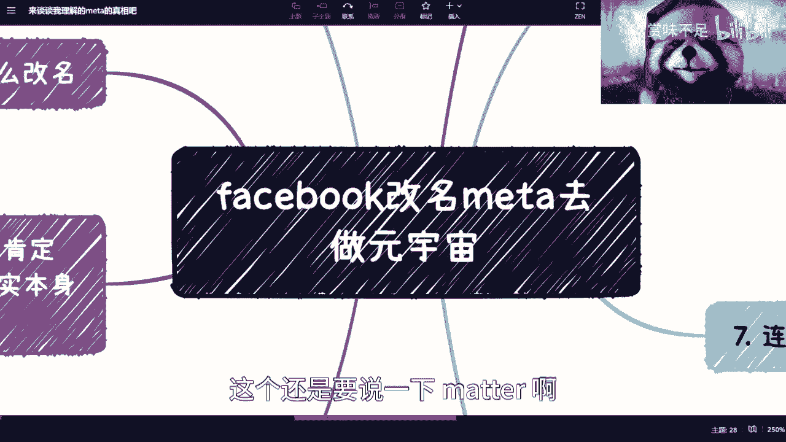

## 概述


在本节课中，我们将深入探讨Facebook（现Meta）公司全面转向元宇宙战略背后的原因。我们将从公司改名、稳定币项目Libra的尝试、面临的监管挑战以及最终的元宇宙布局等多个维度进行分析，旨在理解其核心的商业逻辑与战略意图。

---

## 公司改名与表面原因


上一节我们概述了课程内容，本节中我们来看看Meta改名的直接动因。


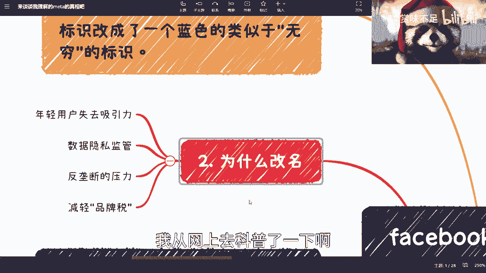

Facebook集团宣布更名为Meta，并将沿用已久的点赞标识改为类似于无穷符号的蓝色标识。


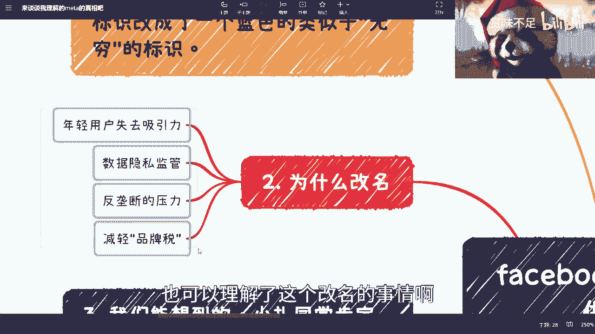

关于改名的原因，网络上存在多种分析。以下是常见的几种解释：

*   **重塑品牌形象**：Facebook此前面临诸多问题，如对年轻人吸引力下降、数据隐私争议和反垄断压力。通过改名，公司可能希望减轻“品牌税”，规避一些历史包袱。
*   **战略转型信号**：更名为Meta，明确地向公众和资本市场传达了公司未来将专注于构建元宇宙（Metaverse）新业务的决心。
*   **商业惯例**：美国商业史上存在通过改名来应对危机或开启新篇章的先例。


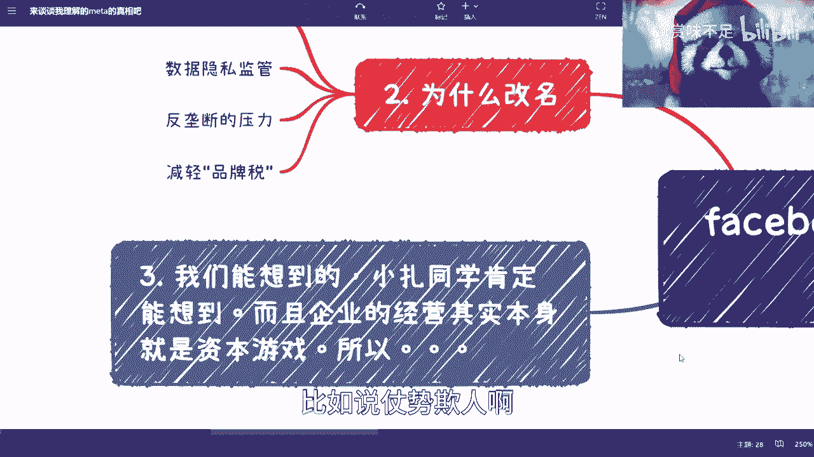

可以理解，改名是Meta进行战略调整和品牌重塑的一个关键步骤。

---

## 深层动因：Libra稳定币计划

上一节我们讨论了改名的表面原因，本节中我们来看看驱动Meta战略转型的一个更深层、更核心的动因——**Libra（后更名为Diem）稳定币项目**。

我认为，Meta战略最大的切入点其实在于其稳定币项目Libra。


当时，Facebook为Libra项目拉拢了非常强有力的合作伙伴进行背书。

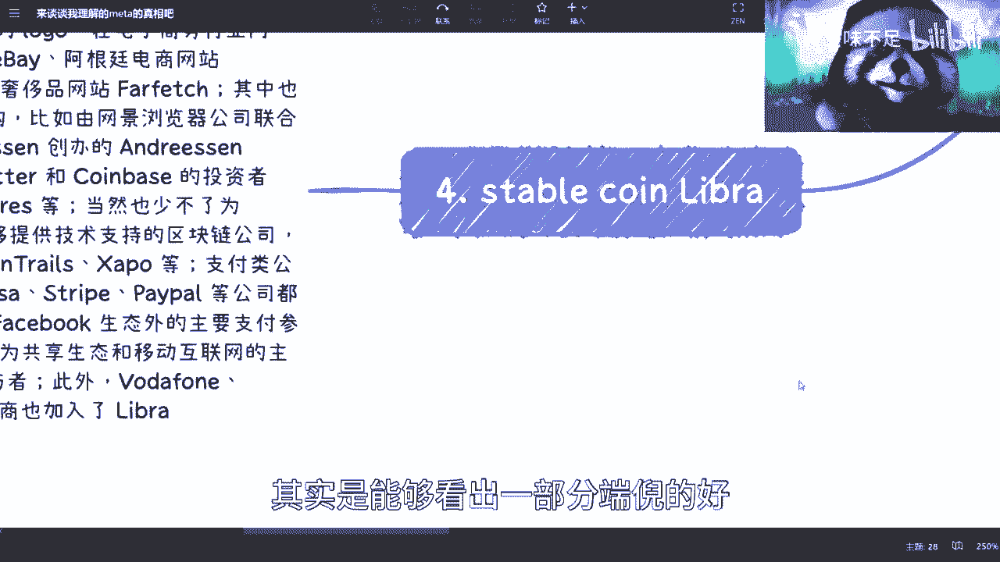


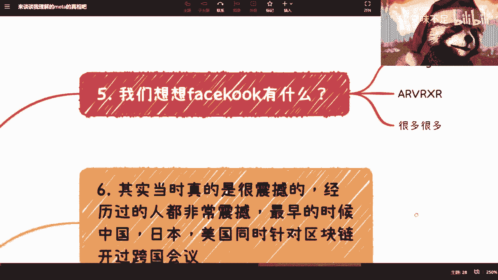

以下是Libra初始的一些合作伙伴：

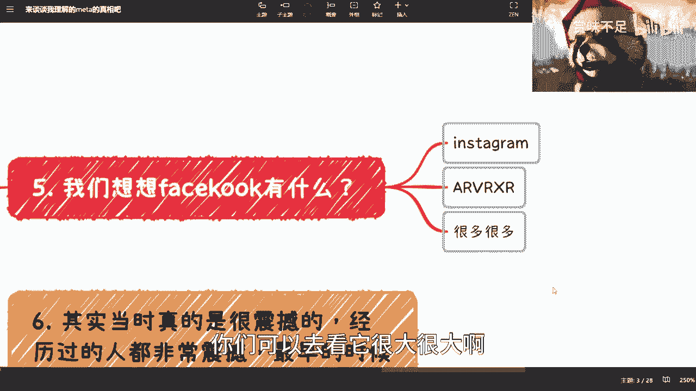

*   **支付公司**：Visa, Mastercard, PayPal
*   **交易平台**：eBay
*   **出行服务**：Uber
*   **投资机构**：Andreessen Horowitz

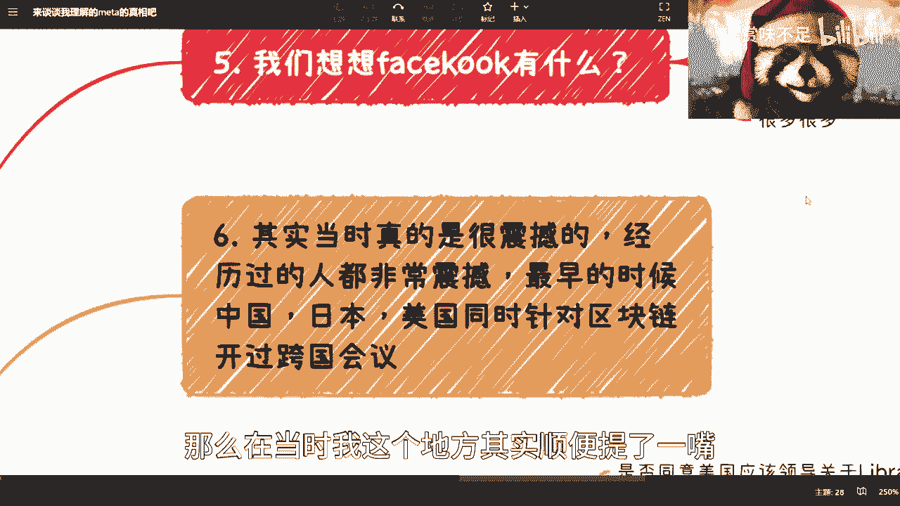

这些合作伙伴覆盖了互联网支付、电商、社交、通信等多个关键生态场景。这并非简单的“发币”，而是有其宏大的战略构想。

Libra最初的设计是锚定一篮子法定货币的稳定币。其运作逻辑类似于：


```
用户存入1美元 -> 系统铸造并发放1个Libra代币
用户归还1个Libra代币 -> 系统赎回并返还1美元（或等值货币）
```


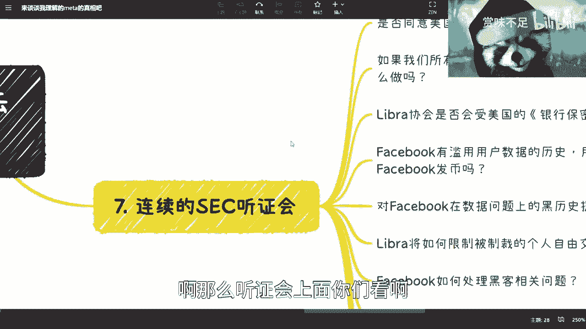

这个机制旨在创造一个**与法币价值挂钩的数字货币**。通过拉拢这些生态合作方，Meta的意图已经可见一斑：构建一个横跨其庞大生态体系（包括Facebook、Instagram、WhatsApp等）乃至外部互联网的**原生数字支付与金融系统**。

---

## 监管挑战与项目搁浅

上一节我们看到了Libra的宏伟蓝图，本节中我们来看看它遭遇的现实阻力。


Libra项目公布后，立即面临了巨大的监管压力。


美国证券交易委员会（SEC）等监管机构举行了多次听证会。核心质疑点集中在以下两个方面：

1.  **监管合规问题**：Libra是否应受美国银行保密法等金融法规约束？如何对这样一个全球性的数字货币进行有效监管？
2.  **信任与权力问题**：Facebook有滥用用户数据的前科，用户如何信任其发行的货币？一个私营企业发行锚定多国法币的货币，是否挑战了国家货币主权？


面对持续的监管审查，Libra项目虽然推出了2.0版本（更名Diem，并调整设计以更符合监管要求），但实质上进展缓慢，等于被搁浅。

---

## 战略转向：从Libra到元宇宙

上一节我们了解了Libra遭遇的挫折，本节中我们来看看Meta如何将战略重心转向元宇宙。

金融支付（Libra）的路径受阻，但Meta手上的牌远不止这一张。它拥有庞大的社交生态和早已布局的AR/VR（XR）技术公司。


对于Meta而言，其最终目标很可能是构建一个完整的数字世界生态。这个生态需要三大支柱：

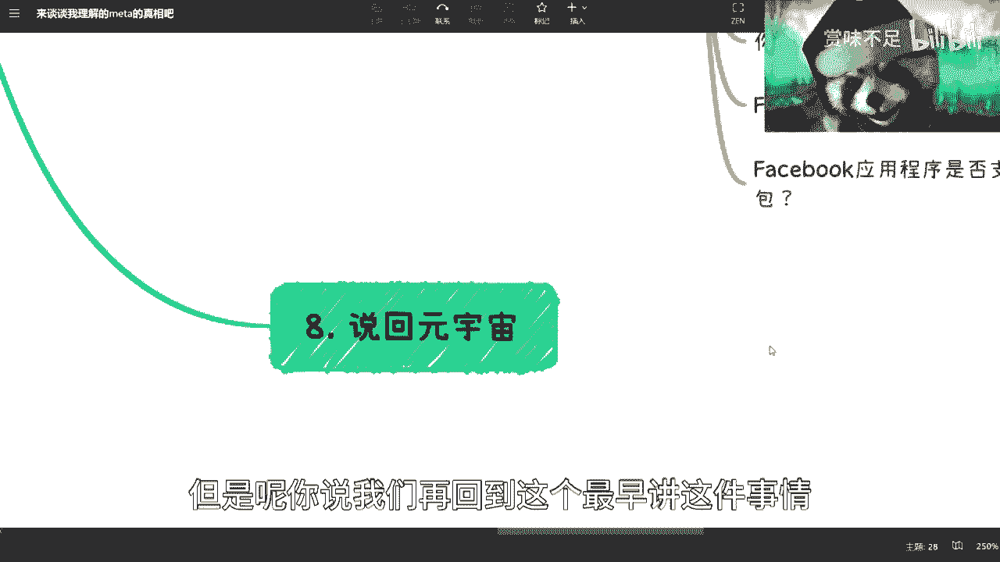

1.  **内容与体验（元宇宙）**：提供沉浸式的社交、娱乐、工作空间。这需要VR/AR硬件和丰富的虚拟内容。
2.  **创作工具（AIGC）**：利用人工智能生成内容（AIGC）技术，降低高质量虚拟内容的创作门槛，快速填充生态。
3.  **经济系统（数字货币）**：一个流畅、低成本的支付和价值交换系统，让生态内的经济活动得以运转。**这就是Libra原本要扮演的角色**。

**逻辑链条如下：**
`发展元宇宙生态` -> `产生虚拟资产与服务需求` -> `需要原生数字货币进行交易` -> `Libra（或类似物）提供支付解决方案` -> `Meta掌控整个数字世界的经济闭环`。

因此，Meta全面投入元宇宙，并非放弃金融野心，而是换了一种战术顺序。既然直接推出数字货币阻力太大，那就先全力搭建生态（元宇宙）和提升生态生产力（AI）。当生态足够繁荣，对原生货币的需求成为必然时，金融解决方案的推出将水到渠成，也更有谈判筹码。


Meta肯定也清楚，以目前的技术，完全体的元宇宙尚需时日。股价下跌也在预期之中。但这是一场关乎未来的战略卡位战，早布局比晚布局更有优势。所谓的“All in AI”与“All in 元宇宙”并不矛盾，它们是服务于同一战略目标的不同技术路径。

---

## 总结

本节课中我们一起学习了Meta全面投入元宇宙背后的深层逻辑。


我们梳理了其发展脉络：从试图通过**Libra稳定币**构建数字金融基础设施遭遇监管重挫，到顺势更名为**Meta**，将战略焦点转向构建**元宇宙**生态。这一系列动作的核心目的，始终是围绕建立一个由自己主导的、包含**体验（元宇宙）、创作（AI）和经济（金融）** 三大支柱的下一代数字世界。


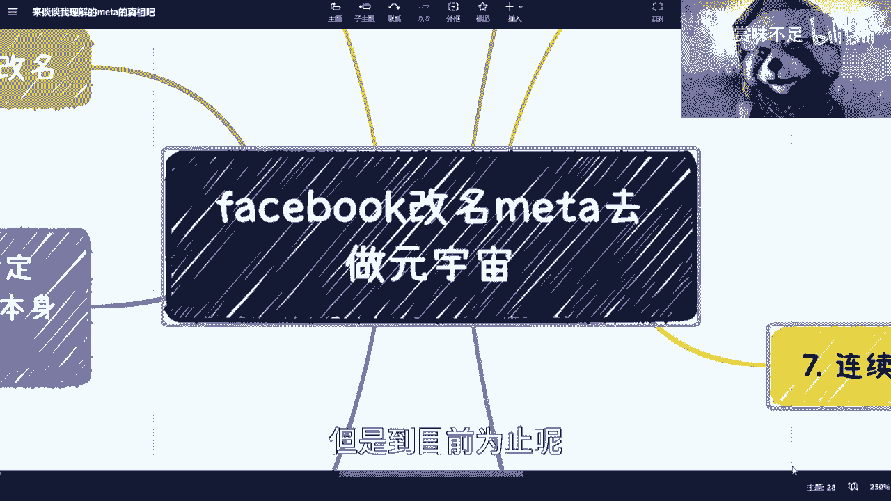

其故事本质是：当直接实现终极金融目标的路径受阻时，便转向先夯实生态基础，等待时机成熟再完成闭环。当前的股价波动和外界质疑，可能都在其长远战略的预料之内。对于Meta而言，元宇宙是其生态的“面子”，而数字金融与经济体系才是其长期增长的“里子”。

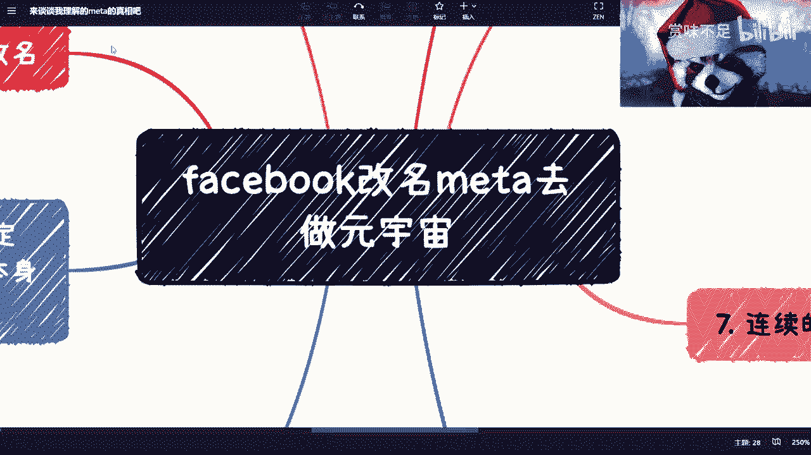

