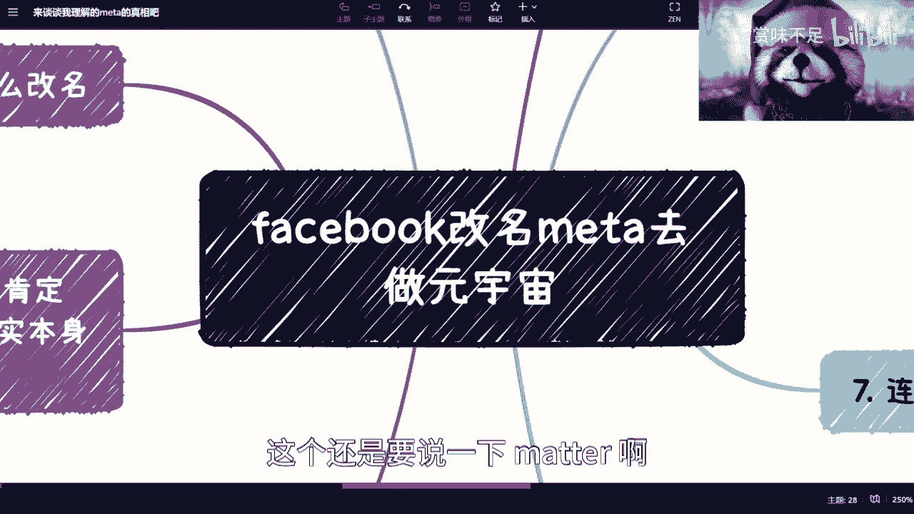
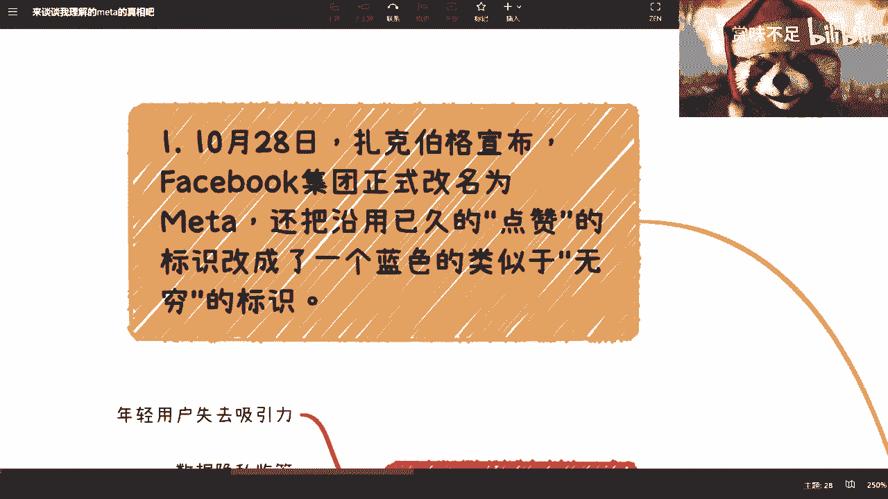
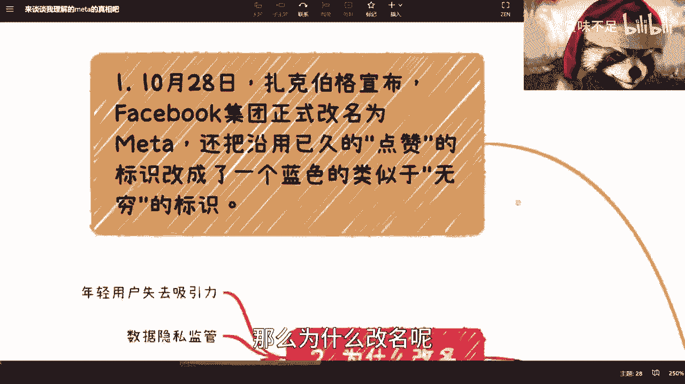
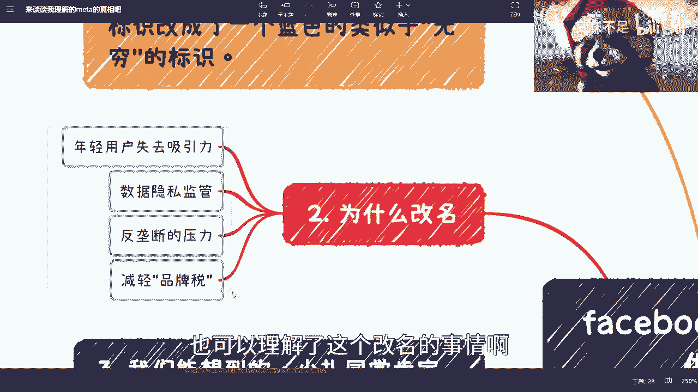
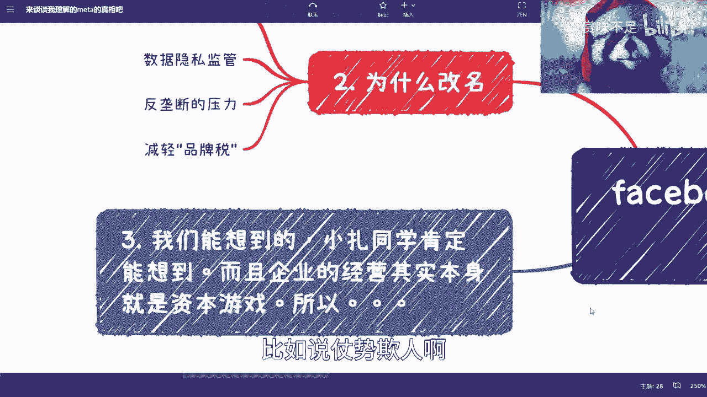
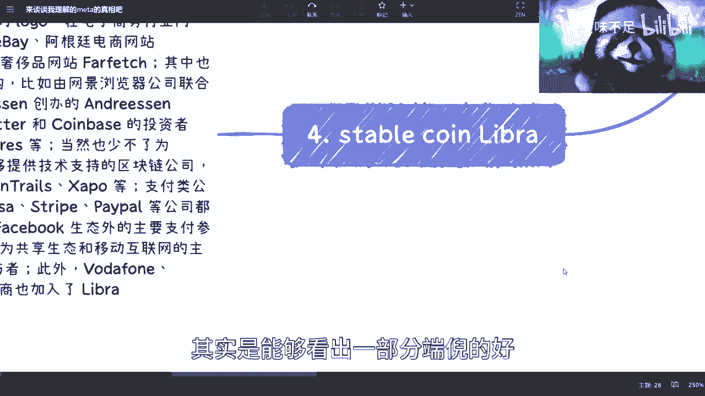
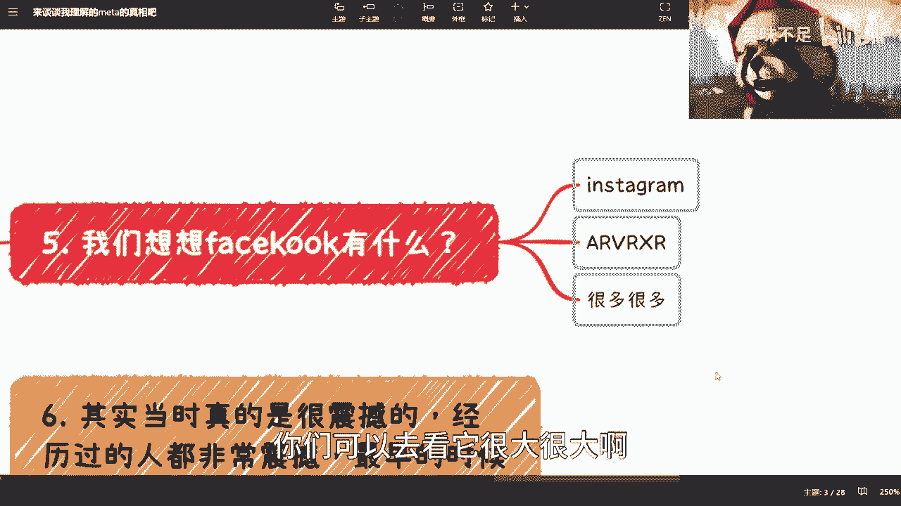
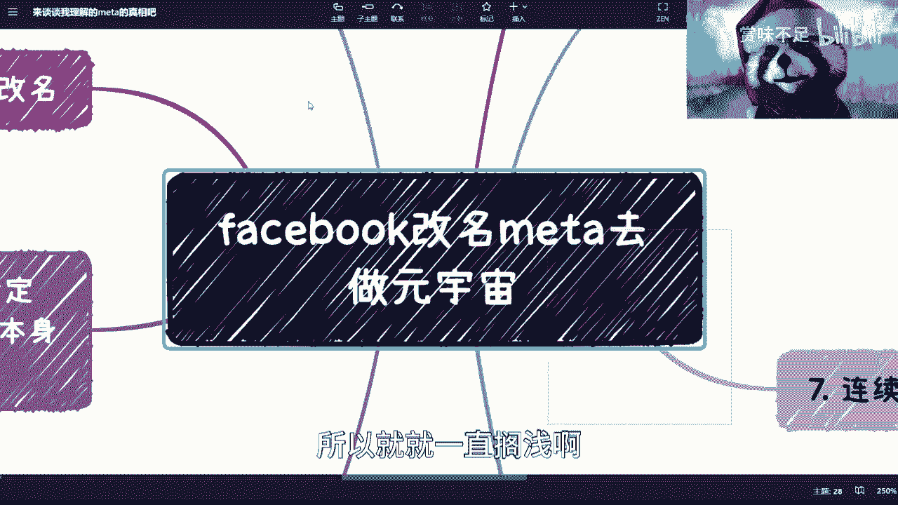
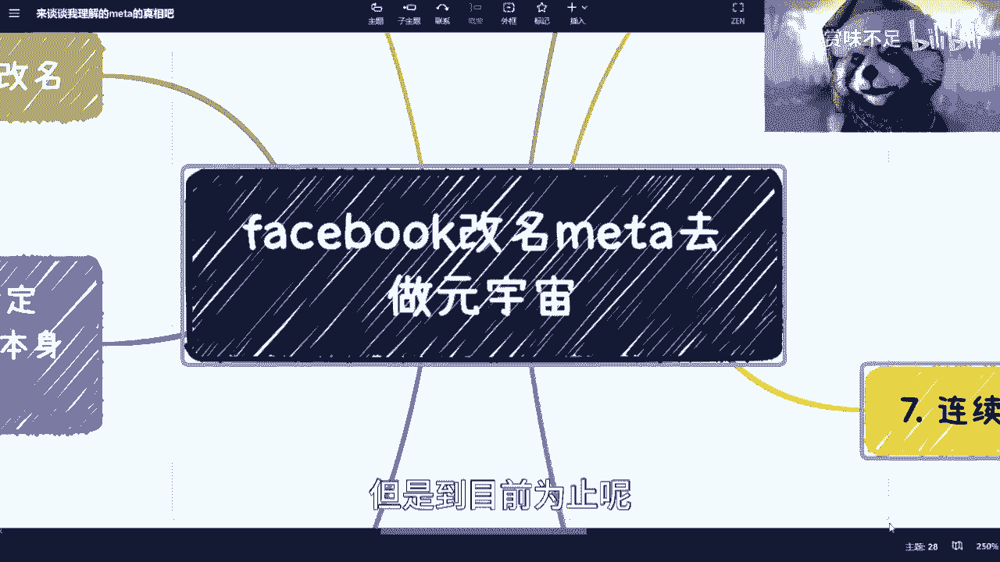

# 答应大家的，聊聊Meta all in元宇宙这事儿 - P1 - 赏味不足 - BV1r24y1j7Tu

好啊，按照那天那天我讲什么来着的，meta我说什么来着哦，说元宇宙对，说元宇宙不是蹭热点哦，我想起来了嗯，然后呢就是这个还是要说一下meta啊。

然后首先是这样子的啊，这是FACEBOOK这件事情呢，这是我觉得呢，可能很多人讲得可能还是不太一样的啊，然后我说一下我的理解啊，但不一定对啊，我只能说不一定对，大家可以姑且听之，当故事听好吧。

嗯说哎靠我的小浣熊小浣熊小浣熊对上啊，哎我我跟你们说啊，那个评论区有小伙伴很搞笑的，他说他说我一直觉得，右上角那个是up主的这个宠物啊，我我我我说我是想养个小浣熊，谁给我养一下，养不起啊。

我们看啊是这样子的，就是首先呢就是说FACEBOOK改成meter对吧，然后到从他改meta啊，新闻就不断，然后呢一直到现在的这是啊，这个被人嘲笑是吧，然后到股价大跌是吧，到各种各样的啊。

呃我说实话我其实都不是太关心啊，就是说这个股价啊，包括其他东西，因为说实话啊，他爹呢也在你预料之中，他可不可能不跌啊，然后我觉得小张同学呢，就是嗯就如果我理解的对的话啊，我是觉得这可能也在他的怎么说呢。

就是意料之内啊，当然你说跌多少，咱不敢说啊，但我觉得但我觉得其实可以预见的到呃，首先我们看啊，10月18号呃，几几年我忘了19年吧，可能差不多啊，这个小乔同学宣布说FACEBOOK集团正式改名为奥。

不是不是不是改名没有，1919年发LIBRA，改名好像是稍微后面一点的啊，然后把沿用已久的点赞标识改成蓝色，类似于这个无穷的这个标识，对吧好，然后他发了这个改名之后呢对吧，这是中国又是啊。

就国内全部又又新闻走了一遍嘛。

那么为什么改名呢，其实这个事情说实话我的确不太懂啊，我的确不太懂。

我从网上去科普了一下啊，嗯我看了一下，基本上什么意思呢，就是说FACEBOOK以前有蛮多的这些问题，那当然每家大公司其实都有嘛，然后呢其实呃就是以前是有些前车之鉴的啊，就是说唉可以通过改名啊。

来把某些事情规避掉啊，或者说做一些改变啊，那么在这个上面呢，我们能看到比如说这个年轻人诶，对年轻人失去吸引力啊对吧，数据隐私监管啊，反垄断的压力啊对吧，减轻品牌税呀对吧，这些其实都有这个前车之鉴啊。

至少在这个美国是这样子的对吧，那我觉得这个倒是OK了。

也可以理解了这个改名的事情，第三呢我觉得就是说呃，我觉得所有的面上的事情啊，就比如说你们现在google啊，百度啊能搜得到的啊，这是我们能想到的啊，我们认为小张同学或者来说你说马爸爸对吧。

或者其他的人呃，我们能想到的，他们肯定都能想到啊，而且按照我这两天所说的啊，所有企业的经营其实本身都是资本有限对吧，这是嗯这是我今天还在跟我朋友说嘛，就说你自从经营企业开始。

其实就是一个啊身不由己的一个过程，因为不是说你做企业就一定要去压榨别人，而是说你做了企业之后，你就相当于是整个一个大机器里面的一个齿轮，你是跟着别的齿轮一起滚的，那当别的齿轮带着你滚的时候呢。

他在压榨你，那你为了生存下去，你就不得不压榨别人，你知道吗，其实本质上是这么一个逻辑，所以说倒并不是说啊这个企业越做越大，就越来越，比如说仗势欺人啊。

或者怎么样，其实也不是啊，也不是，就很多时候可能身不由己，但你说有坏人吗，肯定有啊，这是咱们也对吧，我觉得meta啊，facebook meta这件事情呢，其实它是有个这是前因后果的。

嗯他最大的其实我认为啊他不一定对啊，就我认为它最大的缺入点，其实还是在于它的这个稳定币，就stable coin叫LIBRA对吧，那liberal这边我们能够看到你。

比如说在这个当时FACEBOOK发布了一个，这是LIBRA的合作伙伴啊，我们有看到有UBER对吧，这个这个这个这是EBAY对吧，PAYPAL对吧，这是对应的，然后还有visa啊等等等等等啊。

那嗯其实你会发现呢，就是说首先那个FACEBOOK当时发了stable coin，LIBRA的时候呢，他是拉了就非常强有力的，这是合作伙伴和背书来给他做的啊，大家就是可以看，包括网上反正也有啊。

那其实大而另外一方面呢就是大家也可以看到，其实他拉的呢是什么呢，这是既是给他做背书和合作伙伴又是什么呢，就是说是很多生态的这个合作方，你会发现啊，你会发现比如说这个这个应用层的对吧。

这是叫做互联网应用场景的，互联网支付场景的对吧，互联网社交场景的对吧，互联网这个这个叫什么，这是通信对吧，相关的那在这个上面啊，其实我们都觉得就是说呃，他有他的一个自己的想法。

并不是说啊这个当时国内有非常多的人数啊，他说啊，你看啊这个FACEBOOK小张同学要发稳定币了对吧，怎么样怎么样怎么样，其实他有他的想法，这是他的想法是这样子的，首先最早的时候这是LIBRA的。

这是coin呢，这是一比一锚定美元的啊，锚定美元呢，而且他的逻辑呢其实呃比有点像什么呢，就有点像，就是说啊你要铸造，就比如说你现在铸造一个LIBRA对吧，那你就必须来抵押一美元啊。

或者说来购买就通过一美元来购买，这是一比一的，这种叫做法币稳定，但是呢这是这是LIBRA，后来这是做了个基金会啊，然后发出来的信息呢，他是怎么说的呢，他是这么说的，他说我不但锚定的美元。

我其实锚定的是一揽子货币，老婆第一货币，那可能比如说我呃瑞瑞瑞瑞士啊对吧，这个这个这是中国当然没有啊，这是美国啊对吧，法国啊好像有好多好多，反正啊具体我们仔细看呃，但是呢在这件事情里面。

我们其实从他发布syl coin啊，然后再加上他拉的这些呢，其实是能够看出一部分端倪的好。

那么我们再来看这里。

呃那这是我们发现，其实FACEBOOK除了拉着这些合作方以外呢，它其实还有它庞大的生态，对不对，你比如说最最大家最熟知的是什么呢，就是INSTAGRAM对吧，然后以及他收购的那个ARVR。

XR的一些企业，对不对，那其实还有很多很多我就不列了，因为FACEBOOK整个的版图是很大很大的对吧。

你们可以去看它很大很大啊，那么。

那么在当时我这个地方其实顺便提了一嘴，就当时区块链啊，其实呃或者说web3啊，这是区块链，Web3，或者说最早的比特币啊，就当时其实还是比较震撼的，因为嗯经历过的我觉得大家都都都记得，这是很早的时候呢。

就是当时开过那个呃跨国会议的啊，这是我记得很清楚，这是中国日本美国当时开过会的，这是不是针对区块链，我忘了，反正是针对区块链，有可能是比特币，也有可能是区块链啊，这个针对的这是跨国会议。

然后这个事情还是蛮震撼的啊，那么从这个上面呢，其实我们说为什么当时会有这么多些事情呢，其实本质上还是跟监管有关对吧，你不能说美国没有监管，那肯定是对吧。

这是不科学的啊，那么我们往下来看啊。

这是啊，我们来看到，这是这是小张发布了这个LIBRA之后呢，这是啊就会有连续的，这是SEC的这个听证会啊。

那么听证会上面你们看啊，你们看啊，这是发的，这是什么什么问题呢，你比如说啊，是否同意美国应该领导，关于LIBRA的这个监管规定啊，如果我们所有人都觉得LIBRA是个那个bad idea对吧。

你还会这么做吗对吧，然后LIBRA是否会受到美国银行保密法约束，好FACEBOOK有滥用用户数据的历史，用户还会相信FACEBOOK的这个发币啊，对于这个数据上的黑历史提出质疑啊，巴拉巴拉巴拉。

反正这是一大堆，就反正其实本质上呢这是SEC，其实很简单，就是sec告诉FACEBOOK，其实就是说两两个，这是两个巨大的问题，第一个问题就是说你对吧，是有黑历史的啊，但是呢这个我觉得不是最大问题。

最大问题是LIBRA本身是不是要接受监管，同时我们应该怎么监管对吧，或者说你有没有什么id对吧，那我觉得这是第一点，第二点是什么呢，就是你要锚定别的国家美元，我也就忍了对吧。

你锚定美元这件事情你又不是政府，是不是，那你虽然说这个叫什么自由国是吧，但是这个你也不能说罚就罚啊，那么。

那么这个事情呢这是整体来讲呢，我们就说啊在CC的这个连续听证会呢，反正后面就是说啊，这是项目还在做啊，LIBRA后面给出了2。0，其实项目还在做，但是这件事情基本上就等于搁浅啊。

就等于stable qu，这是就等于刻晴了，而且呢其实也有非常多的人当时在说嘛，就说啊，这个国内因为看到了小张同学要发LIBRA了啊，我也我也来说一下吧，我也来说一下，到时候我可以单独开一期。

但我不知道B站让不让我过，其实呃这个做做什么做数字人民币对吧，数字民币的项目立项很早很早，2014年就立项了啊，你说这是当时国这是国内有非常多的人说啊，因为小张同学要发LIBRA了啊，这是坐不住了对吧。

央妈要要要要开干了是吧，那那你除非跟我说14年他就能预料得到对吧，小扎在很久很久以后要发LIBRA对吧，否则这个谁信啊是吧啊，那我觉得这个啊，呀啊这边我没写啊啊无所谓，我来讲吧好吧，那最终收获元宇宙啊。

我觉得元宇宙这边呢它其实是这样子的啊，首先呢就是说呃我们刚刚把他的生态啊，就是包括他的合作方，这边其实大家也都，这是我给大家也都列了一下对吧，其实呃小张同学，我觉得他最最想做的就当时最最大的初衷。

初心你知道是什么呢，其实呃你做一件事情，他不是做，这是从企业来讲，它不是做慈善的对吧，所以说呢不管表面上是做什么，它的核心其实还应该是金融，这是毫无疑问，毫无疑问，这个就像为什么滴滴啊，就很多平台啊。

到后面就就开始做放贷，你知道吗，那那其实就是金融问题吗，对吧，那么其实那个LIBRA这件事情我觉得也是一样的，他要打通的是什么呢，这是他的，比如说娱乐的呃应用对吧。

或者说呃这个这个不仅仅是FACEBOOK的生态，因为他一开始可能先从FACEBOOK生态去切入嘛对吧，后面的话可以这是那个那个扩展到line呀，啊，扩展到这个这个叫什么，这是twitter啊。

或者其他地方其实都是可以的，因为它本质上我们简单来讲，它本质上其实要的是整个生态的一个生态，支付啊，但是生态支付的话，你想嘛就如果来说通过它发行的那个稳定币啊，这是我们说的。

就就可以认认为数字世界的这个数字货币对吧，而他又能够锚定各国家的这个不同的法币，那么这个时候就变成什么，这是不单你是可以在FACEBOOK原有的生态里面，甚至生态Y去直接的进行支付。

还能够非常快捷的甚至汇率低的去做换汇对吧，那么这件事情本质上对FACEBOOK来讲，你就会发现，就是说，就是说他完完全全是从一个纯互联网公司，马上一下子就跃迁到了一个互联网加金融的。

一个一个一个一个巨头，或者说一个单纯就很难撼动的这么一个地位，你知道吧，所以说呢就是说呃那那这是很多人也会问他说，那跟元宇宙有什么关系对吧，其实我觉得可能FACEBOOK当时是这么想的。

就是说LIBRA呢他本来就是肯定要做的啊，而且LIBRA作为数字货币，它其实最终的应用场景就是整个数字世界，那我觉得啊小张最早的时候肯定也想到了，就是说他一定要给这个生态要有这么一个，这是怎么说呢。

一个一个名字吧，或者一个一个一个title，你知道吧，但是呢就是说嗯也许他一开始也没想清楚啊，就只是说有这么个设想，但是没有想过啊，我要为这个生态对吧，为为什么一个东西去命名，你知道吗。

那可能当时web3整个在全球火，对于这个meta火了之后呢，其实我觉得可能得到了一部分灵感，或者来说啊或者说FACEBOOK数了一下手上的牌啊，觉得手上的牌呢也是适合这个。

这是往那个那个meta就元宇宙去打的对吧，因为嗯说白了LIBRA他并没有胎死腹中对吧，他只不过就是说缓缓啊，但是未来你说他是不是还会出来继续做，我觉得还是会还是会继续做的，只不过要插整个一个时机对吧。

因为你现在CC不同意，不代表未来CC不同意对吧，这是第一点，第二点，就是说那个那个你是先发展你的这个金融体系，还是先发展你的生态体系，我觉得对于FACEBOOK来讲没有什么区别对吧。

因为你你LIBRA就算你不允许啊，那没问题，那我先发展生态嘛对吧，那么我改名叫meta对吧，我先发展我们的生态，其实我觉得大概率呢可能是这么个故事啊，但是呢你说我们再回到这个最早讲这件事情。

就是我为什么会说小张，或者这是FACEBOOK会预料的到，其实未来的呃，这是后来的，这是股价的跌啊，或者怎么样呢，其实我觉得也正常，因为什么呢，因为就你想嘛对吧，大家到这个网上去网上去看一下。

这是这是那个meta，就FACEBOOK其实做了很多关于meta verse的视频，你们可以去看啊，你说你看完啊，我就说啊，这是但凡我觉得这是个正常人，看完他都明白现有的科技这个技术对吧。

你点的那个科技树对吧，就像你是帝国时代对吧，然后打着打着打到星技术了对吧，然后诶还有什么来着哦，对打着打着打到魔兽去了对吧，打打着打打到星技术了对吧，你也知道就当下的科技树是不支持。

或者说没有这么成熟去支持meta的对吧，这是所有的普通人，我相信看完那个视频都会觉得嗯，好像离现在有点差距，我所以我话说回来没，这是这是我们能看明白的东西，他们一定会看明白对吧，不存在说啊。

我们看的明白啊，小张看不明白，我不相信他对吧，所以说呢就是他肯定也知道对吧，这个事情离现在就是有一定的差距的，但是呢就是要去做对吧，要去做，要去先占坑，要去发展对吧，因为从大方向大战略来讲。

这是你早晚都要做的，你跟早做晚做有什么区别呢，没有区别的对吧好那那当然我说到这，最近有人又要说了，他说哎嗯这个我又听说好像meta meta要all in AI了啊，all in gt了对吧。

all in这是AIGC了对吧，哎呀我跟你们讲有什么all in不all in的都一样，你知道吗，这是你你就像我说的，这是网络上的信息呢，都是这种对吧，添油加醋过的，这是这是你想吧。

对于FACEBOOK的生态来讲啊，我还是喜欢叫他FACEBOOK，对于FACEBOOK的生态来讲，我是金融货币对我重要呢，还是说是生态对我重要呢，还是这个叫什么，这是AIGC对我重要呢。

你你会发现这三者是相辅相成的呀，对不是AITC是通过AI更快的产出内容，更快的产出精细化的内容对吧，然后那个叫什么叫什么元宇宙对，不是为了有一个完整的，这是生态，不是我给他套概念也好。

还是未来数字化世界也好对吧，然后这个这个数字货币是为了整个交易，包括最终最终最大的盈利盈利点对吧，那我干嘛不做呢是吧，小张又不缺这点钱是吧，所以呢我觉得这是整体来讲，我觉得这个故事是这么个故事啊。

没有说这个好像阿姨一会蹭热点了，一会蹭热点了，我觉得也没有，可能就是有些灵感啊，然后呢正好你说蹭嘛，就像我说的蹭吗，能蹭就蹭，干嘛不蹭呢，你说是吧啊。

所以我觉得大概率这是本质上的，这是别的都都还是面上的啊，核心还是金融游戏，但这个金融呢可能就是说这是SEC，讲得比较严格啊，所以就就一直搁浅啊。

但是到目前为止呢，这是LIBRA2。0，还是一直在发展好吧。

OK那那这个就说这么多吧，啊我后面会再讲那个数字货币啊，呸讲那个数字人民币吧好吧。

希望B站给我通过。