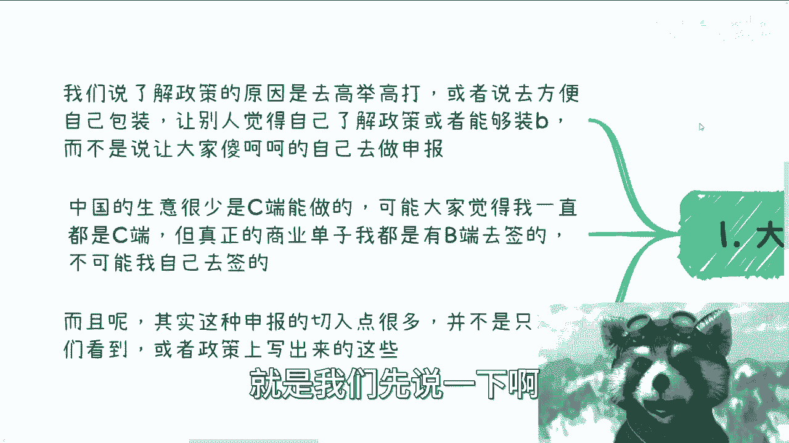
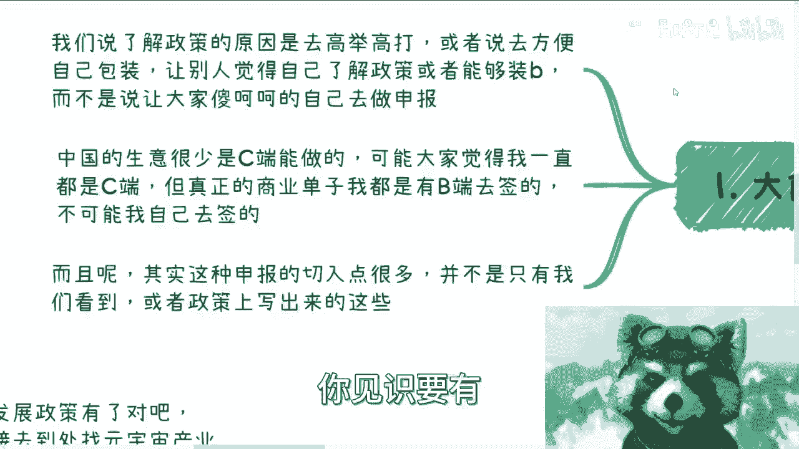
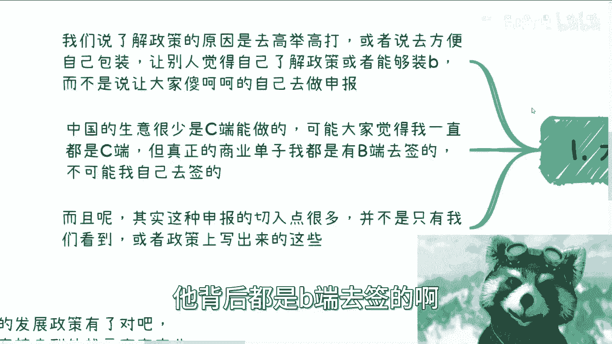
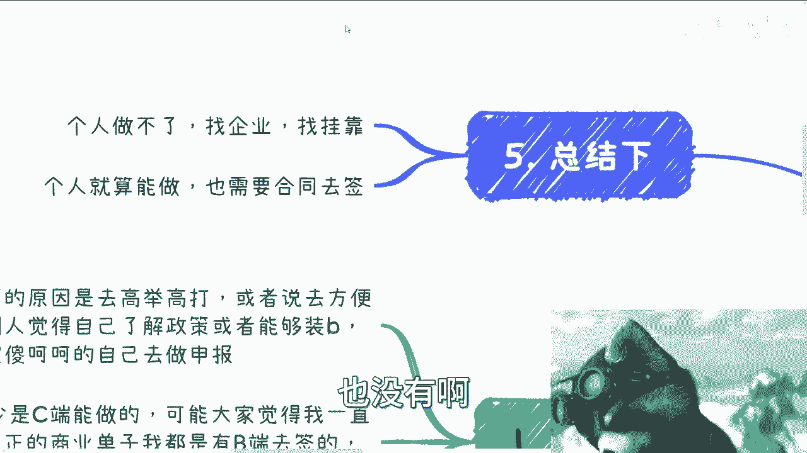
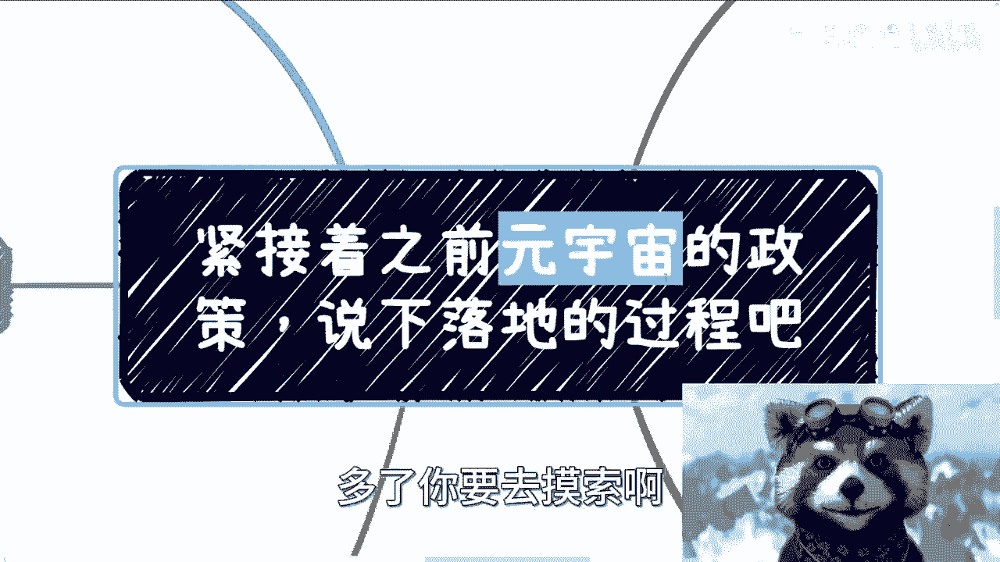

# 元宇宙政策落地指南 P1 🚀

在本节课中，我们将学习如何将宏观的元宇宙政策转化为具体的商业机会和落地流程。我们将探讨政策落地的核心逻辑、不同切入点以及实际操作中的关键注意事项。

上一节我们介绍了元宇宙的宏观政策背景，本节中我们来看看这些政策如何具体落地。

## 政策落地的核心逻辑

了解政策的目的，并非为了个人直接申报。核心在于利用政策进行“高举高打”，或用于包装自身，让他人认为你了解政策、具备行业视野。这比实际申报更为重要。

中国的商业活动，尤其是大额订单，很少由个人（C端）直接完成。真正的商业合同通常由企业（B端）签署。个人可以作为销售或商务去洽谈，但最终签约方必须是企业实体。

## 政策落地的四个切入点

以下是政策落地的四个主要方向。

### 1. 政策背书
借助政策来证明个人或企业所做的事情符合国家战略大方向。这能提升个人或项目的可信度与高度。

### 2. 知识变现
整理并讲解相关政策，分析其中的切入点与发展前景。这可以作为个人知识付费或咨询业务，本质是利用政策信息为自己做背书。

### 3. 政策申报服务
这是一个成熟的产业。流程是：找到特定政策（资金出口）→ 找到符合资质要求的企业 → 帮助企业进行项目申报。
*   **公开渠道**：通过政府网站等公开入口申报。你可以为企业提供材料包装服务。
*   **关系渠道**：找到政策对应的负责人或经办人，了解内部信息后，再寻找符合要求的企业。这种方式能提供更具垄断性的服务，也是目前线下主流且盈利较多的方式。

**核心公式**：`落地服务 = 找到政策 + 匹配企业 + 协助申报`

### 4. 政策衍生服务
不直接做政策文件上写明的事，而是做其衍生产业。例如，围绕元宇宙政策，寻找与之配套的**人才补贴、产业园补贴、证书补贴**等。

落地流程是：找到对应衍生政策的资质方（如产业园）→ 根据其具体要求准备材料和文件 → 走后续流程。

**核心逻辑**：`衍生机会 = 主政策 → 配套子政策 → 服务子政策资质方`

## 关键操作要点

上一节我们介绍了四个切入点，本节中我们来看看实际操作中的关键要点。

### 企业主体是关键
个人无法作为签约主体。必须通过自己的公司、合作方的公司或挂靠的公司来签署合同。新注册的“壳”公司很难通过审核，因为缺乏历史流水和业务支撑。

### 个人角色的灵活性
个人在前期沟通、社交、寻找资源时完全可以主动出击。关键在于要向对方展示你的**见识广度**和**资源网络**，让对方明白你虽然是一个人，但背后有丰富的合作方和资源背书。

### 寻找对接部门
元宇宙是宏观政策，落地时会具体到行业和地方。你需要根据自身业务方向，寻找对应的对接部门。
*   **例如**：文旅业务找文旅厅，金融业务找金融局，也可以具体到地方的产业园、协会或科技园区。

**操作指引**：`不要问“元宇宙找谁对接”，要问“做XX行业的元宇宙应用，在XX地区，可能找哪个部门对接”。`

## 总结

本节课中我们一起学习了元宇宙政策的落地路径。核心在于理解政策是工具而非目的，落地必须依托企业主体，并可以从政策背书、知识变现、申报服务、衍生服务等多个角度切入。关键在于保持灵活，广泛获取信息，并建立有效的资源网络。

---

**请注意**：本教程仅基于提供的视频内容进行信息整理与转述，不构成任何投资或操作建议。任何商业活动均需遵守法律法规，评估相关风险。