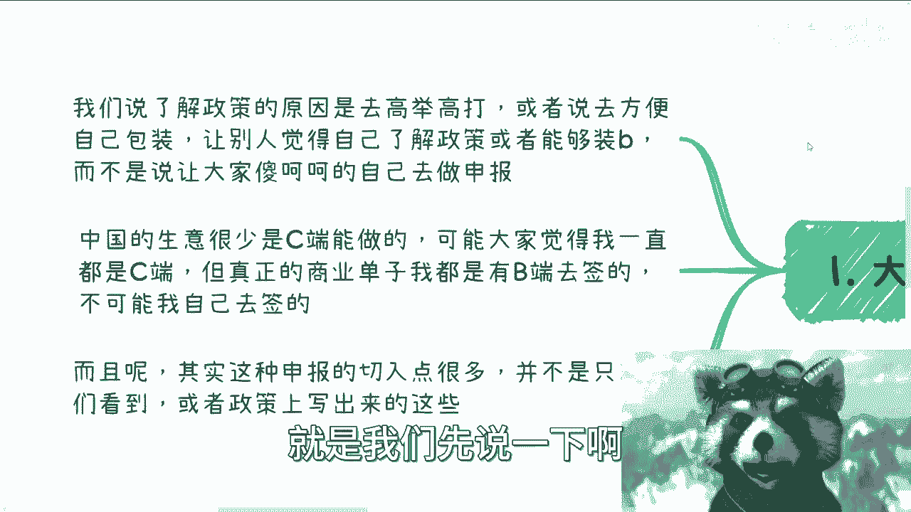
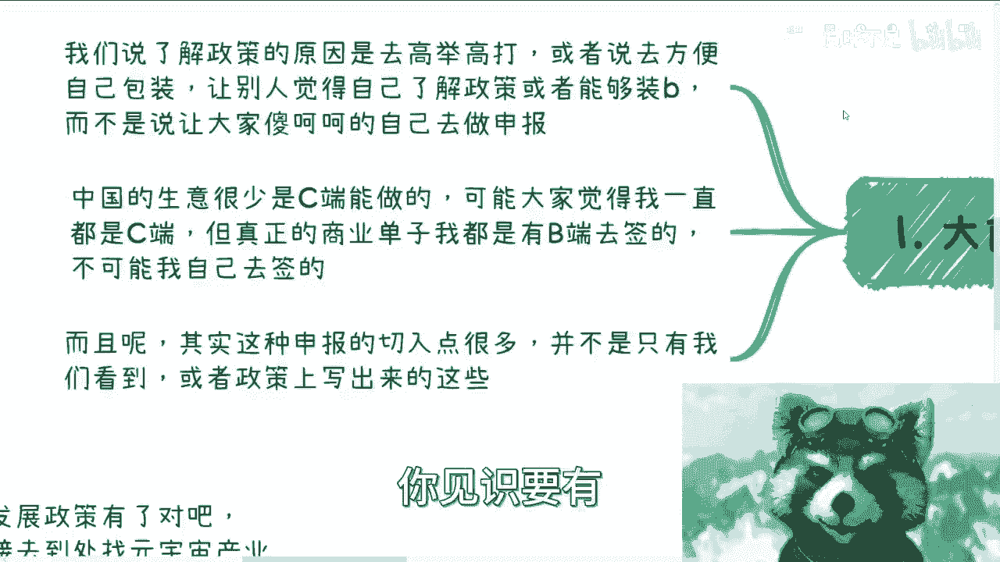
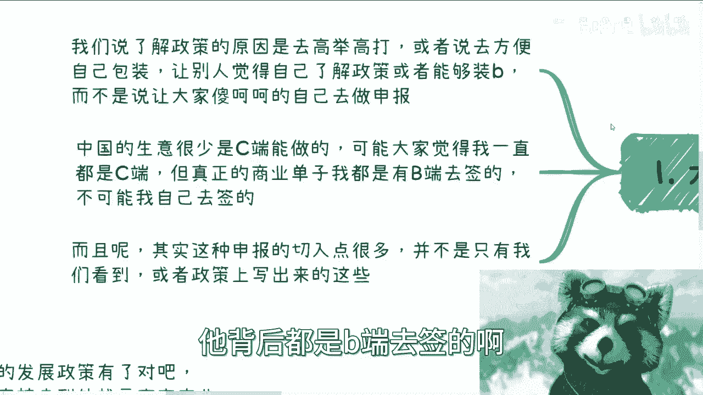
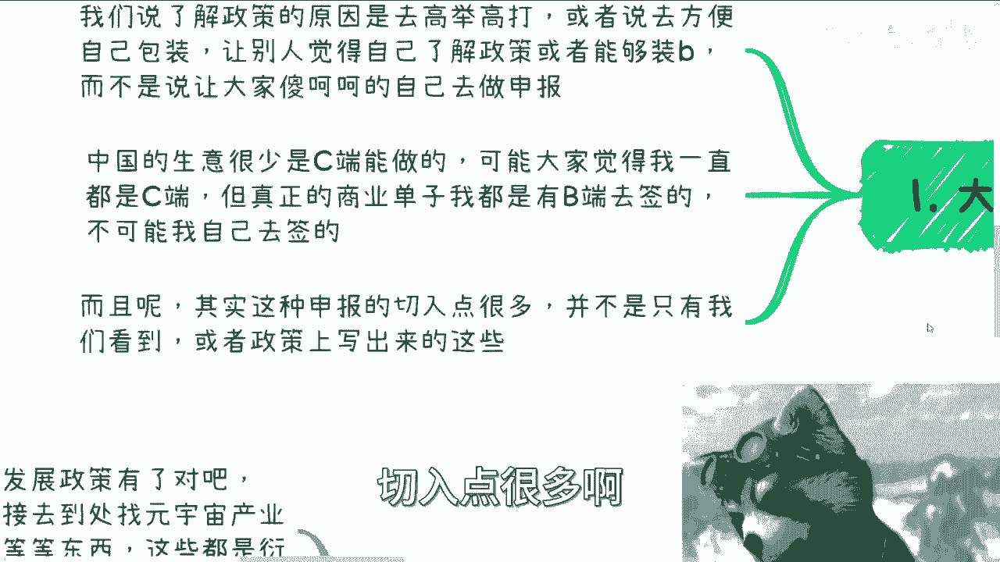
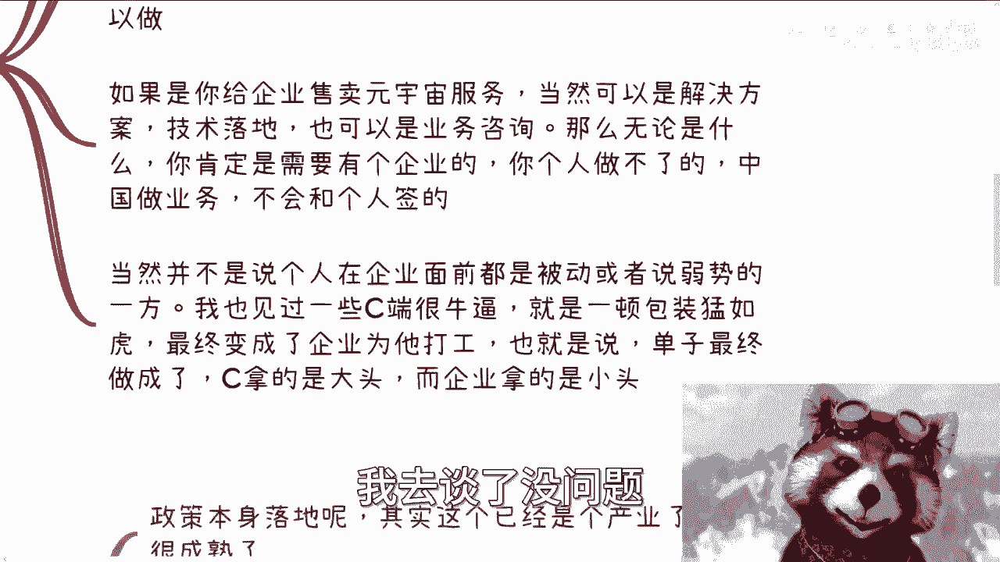
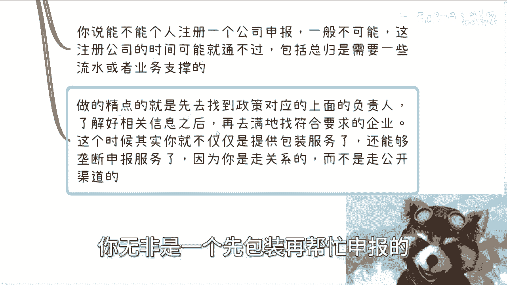
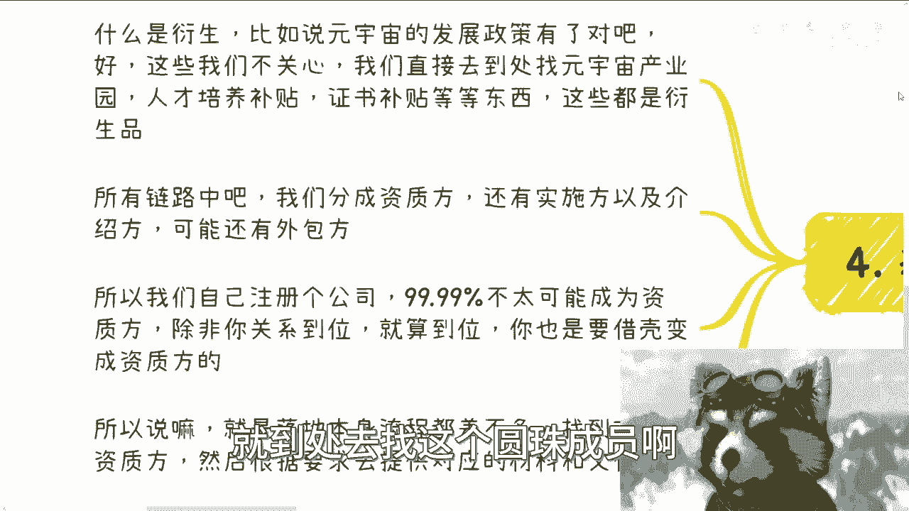
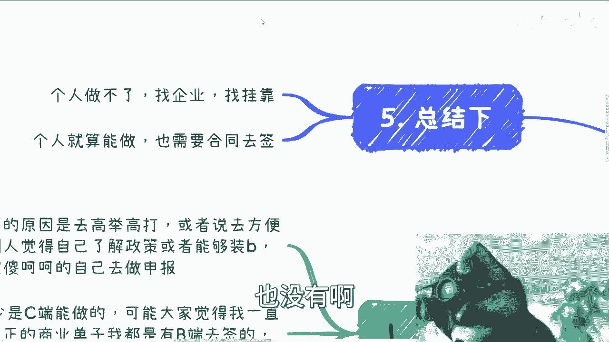
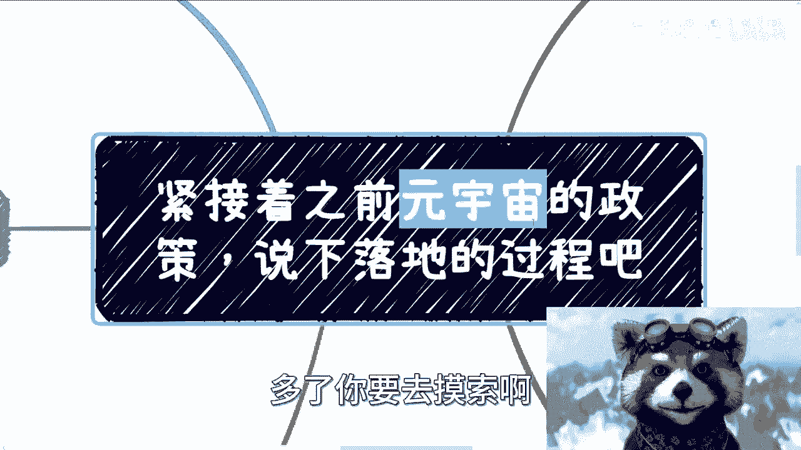

# 紧接着之前元宇宙的政策，说下落地的过程和方向 - P1 - 赏味不足 - BV1He41197rh

哦大家好，我是我刚刚发现了一个不得了的特效，我等会再那个下一个视频吧。

弄一下，那特效太他妈赛博朋克了，嗯嗯我那天跟大家说的啊，就是之前两期这个元宇宙的政策啊，啊我发现了这个话，还得说明天怎么不说，明年好像很多人的确有点误解啊。

我说一下这个落地过程啊，是这样子的，首先有个大前提啊，呃我们先说一下啊，了解这个政策的原因呢，不是说我这个对吗，对呀，不动呀，哎这个好了，就是我们先说一下这个政策。

了解原因呢，不是说大家自己说啊，我要去申报了或者怎么样了啊，呃我们政策原因呢是要去高举高举高打，或者说去方便自己包装，让别人觉得呢自己了解政策或者能够装逼啊，而不是说让大家傻呵呵的就自己去做申报啊。

我觉得嗯因为昨天我看一个电视剧啊，那里面其实我说的我觉得他说的蛮对的，就是什么呢，就是说呃我们可以不精啊，我们可以就自己没做过，但是你不能不博，你知道吗，就是你不能没有这个见识啊，你见识要有。

你得博，你得广啊，那么中国的生意呢有一点啊，你们要明白，就很少是C端去做的，那可能就是说大家会觉得，我一直是C端去做对吧，但其实真正的商业单子，包括比如说我这次来北京，他背后都是B端去签的啊。

就是说我要么就是拿我自己的公司去签对吧，要么就是说我有合作方去签，不太可能是我自己去签，我自己去签，这就不符合这个商业的逻辑啊，啊而且啊其实这种申报呢其实有点很多啊。

并不是说只有我们看到的，或者政策上写出来的啊，这个东西我来给你们一个个列啊。

呃首先第一种呢是政策背书落地的可能性啊，什么叫政策背书呢，就比如说顾名思义啊，我们每个人或者企业那个借助一些政策，政策来表达自己做的，或者企业做的一些符合战略的大方针，哎我没写完，这地方无所谓啊。

啊那么第二个呢就是说你要么就是做知识变现，你说好，我要开始装逼了啊，大家不要想静静看我装逼啊，那么呃但是你装逼那没问题，那你就整整整理好相关的策略对吧，相关的政策告诉大家有什么样的切入点。

告诉大家都没有前景，那这个东西你个人可以做，但这个政策给你有什么用，他无非也是给你装逼，给你背书用的嘛，对不对，那这是第一个啊，第二个，那如果说你给企业去售卖元宇宙的服务，当然也可以是原宇宙解决方案。

或者说技术落地啊，也可以是业务咨询都可以，但是无论是什么，你肯定是需要有个企业的对吧，你你个人跑过去，你说我作为一个销售，作为一个商务，我去谈了没问题。

你总归得有个企业去签啊，中国做业务他不会跟个人签的，你跑过去，不管是小微企业还是国企，央企还是协会商会，你跑过去来，我个人跟你签，我，你是谁啊，这个人跟你签对不对啊，那当然并不是说，而且我跟你们讲。

这个当中有一个点，并不是说个人在企业面前都是被动或者弱势啊，我也见过一些很牛逼的C端，就是他一顿包装猛如虎啊，最终呢就是说企业为他打工，你懂吗，有的这种人不少的哦，就是他自己虽然是个C端啊。

你要说他要有什么，他也没什么，但是他最终整个商业逻辑呢，就是说是他隔绝了双方的信息差对吧，然后呢就是说他拿了大单，而企业是他的外包，也就是说C端拿了大头，企业拿的是小偷，这种人我看到也不少的，你知道吧。

最重要的是看大家业务怎么做，不是说啊这个好像企业一定牛逼对吧，个人跟企业比一定是，就我发现很多人他其实有个误解，就觉得C端好像相对B端就比较弱势，这件事情没有错，但是他不是一个定式啊。

然后第二个切入点呢就是政策本身啊。

落地的可能性，你看啊政策本身落地，你们结合我前两次的那个充电视频的政策，对吧啊，你看啊政策本身落地，其实它已经是个产业了，而且是个很成熟的产业，这个产业本身也就是说先要找到对应的政策。

也就是所谓的找到这个钱的出口嘛对吧，然后呢找到对应的企业，也就是他要的对应有资质，有门槛的那些企业，然后我们就要帮助企业去做申报项目，然后帮忙去申报就好了，这个东西是就是长久以来很多人在做的东西啊。

这已经是个产业了啊，那么虽然说起来很容易啊，但是做起来门槛还是有的，你可以通过公开的渠道申报，这也叫申报对吧，比如说政府网站网站入口啊啊企业本呃，就是当然啊这种公开的入口，不要说你能申报。

企业也可以申报，对不对，你可以提供帮助企业做包装的服务啊，那很简单啊，你说你今天做元宇宙的申报对吧，那可能比如说有家医疗企业，有家制造业，他也想做，但是他是也可以申报，但是他不知道这材料怎么做啊对吧。

那你可以support去他做这个材料，但同样的你的合作还是要企业去，企业这个东西我以后不再强调了啊，不要再去想着说啊，什么呃，那个个人去做，也不可能，你懂吗，就是就没有商业生生意是这么做的啊。

只有某些咨询培训，像我这种业务可能会有的，但是你们但凡是做to b的服务也还不可能的啊，那么你说能不能个人注册，由公司申报，我跟你讲可以，逻辑上是可以的，但是不可能申报成功，为什么。

因为你新注册公司这个时间就通不过他妈，人家一看，我的，你上个月注册公司啊，海申报他妈不就是过来薅羊毛薅羊毛的吗，对吧啊，包括呢可能就是说在流程当中，因为每一个那个省市区政府要求不一样啊。

那么你比如说总归有些这个需要，有些可能会有流水啊，也可能有业务支撑啊，你一个那个壳子公司你要做不可能啊，那么做的精一点精一点的呢，就是说先去找政策上，就是政策对应的这上面的负责人，你可以找到负责人。

你也可以找到申报的这个小喽啰啊，都可以，无所谓的，只要是这根线上的啊，那么了解好相关信息呢，你再可以满地的去找符合要求的企业啊，这个时候呢我跟你讲啊，你就不仅仅是提供包装服务了。

还能够提供垄断式的申报服务，为什么，因为这个时候你是走关系的，你不是说走公开渠道的，你明白吗，而且现在整个线下真的做的比较多的，赚钱比较多的也是这一类啊，嗯好那么可能有些小伙伴又要再想了啊。

这是什么风险啊，什么东西，我跟你讲，你自己想想看，就这玩意儿你无非是一个新包装在帮忙申报的。

有个有个屁风险啊，啊我操这他妈都有风险，那大家事别办了。

对吧好，然后第四个就是叫做基于这个呃进政策的衍生。

落地的可能性啊，这个事情是什么意思啊，什么叫衍生，就比如说啊元宇宙发展政策是有了对吧，我们前两天做的那个视频是有了啊，好这些东西我们不关心啊，我们直接去找，就到处去找这个圆周成员啊。

比如说人才产业园的补贴啊，人才培养的补贴，证书补贴等等东西，这些都是衍生品对吧，所有的链路中，我们分成有资质房，还有实施房以及介绍房啊，可能还有外包房等等等，当然也不止这些，还有很多啊，但是啊你看啊。

我们自己注册公司，99。99%不太可能成为自治方，因为你不可能有资质，你以为成为资质这么容易吗，对不对啊，那么有还有0。01%是什么可能性呢，就除非你关系到位啊，但是话又说回来，你就算到位。

你也要借壳变成资方，什么意思啊，就是你就算到位，你要成为自治方，你不可能把你注册一家阿猫阿狗的，新的皮包公司，直接是公式变成资质房，你肯定是借一个对吧，有这种资质的，但是呢他这个资质房就变成一个。

可真正受益的是你自己注册的公司，一般都是这么注册的啊，一般都是这么操作的啊，所以说就是落地本身流程呢，其实差不多找到对应的自制方，然后根据要求去提供对应的材料和文件，这句话的意思就是说我们可以去不做啊。

这个政策文件上的东西，但是我们可以去做它的衍生品对吧，那衍生品就说产业园我们要找到产业园的，比如说商务对外商务人才培养补贴，我们也可以找到对应的这个政策啊，包括证书补贴也会有对应的政策。

我们要去找对应的政策里面的这个对应的资方，因为它每一个东西下面的资方都不一样啊，然后我们去对应根就根据这个资方的要求，因为所有东西这个都有规定，都有对应的条例，都有对应的章程对吧。

我们根据对应的东西去准备材料和文件。

然后继续往下走流程啊，所以总结一下什么意思呢，就是说个人做不了，找企业找挂靠啊，这个事情很简单，你别别想着，因为我看到有些小伙伴说啊，这个东西个人做不了，他妈屁话，个人是做不了啊对吧。

那也没说让你们个人做啊，这是第一个，第二个就是个人就算要做啊，他也是需要合同去签的，什么意思呢，就是说你个人是可以做，但是你你要去签合同，你要么就是自己的合作方的公司去签合同。

要么就是你的皮包公司去签合同，你总得有一个公司去签合同，但是这件事情做对吧，你说啊我要去社交了，我要去交流了，我要去找对应的资质方了，我要去找对应的接口人呢，你个人做没问题没问题啊。

不是说你每次都要带个队对吧，你说啊好，我他妈这个公司这个股东全部出动也没有啊。

你懂吗，就是就是啊，就是说做事情咱们得稍微懂得变通啊。

不要太死板哦，那你你你要明白。

就是说还是那句话，你懂不懂，对方是不知道的，但是你要让对方明白，你有见识啊，另外一方面就是说你要让对方明白，也许你是一个人，但是你的合作方很多是吧，你你就拿我来讲一个道理啊。

那为什么政府高校企业部分地方要找我合作，如果我就是一个人，一个个体，他找我合作干嘛呢，我觉得他有什么价值啊，对不对，没有用的呀，就是我也要让他明白我的合作方很多，我的背书很多对吧，我的我的这个深度合作。

或者我手上资源很多，这是你要让别人明白的呀，啊不是说就是就是一定要，就是说我们只有两个极端对吧，你说啊要么我一个人啊，要么我就一个公司，一个一个一个一个非常牛逼的东西，不一定的好吧。

就我们做事情灵活一点啊。

好吧，就是过程我跟你们说了已经很清楚了啊。

就是你们看到政策，这就是大的战略方向，战术上就是找到对应的部门，当然这个对应部门在什么地方，我可以告诉你，各个地方都有对应的部门，因为你元宇宙这种政策，他就是个宏观政策，你今天是做。

比如说你今天做文旅的，有啊，找文旅厅啊对吧，你就金融的找金融厅啊对吧，你你当然这个也是很宏观的，你再往下各个地方也有啊对吧，你找产业园找协会对吧，找找找那种什么园区，你在上海这边。

张江他就他他张江就有对应的对吧，嘉定那边的这种产业也有对应的，每个地方都有的，你不要就是问一个，就是你不要去傻呵呵的问一个很宏观的问题，说哎刘老师，那元宇宙这种政策我们找哪个对接，做什么业务的。

你去找哪边对接啊，多啦你要去摸索啊。

你知道吗，就每个地方都会有的，只不过就是说你知道和不知道啊，啊但是它不可能是一个非常宏观的，它落到地方，落到行业一定是一个非常细节的东西哦，那么你就要去找了，你知道吧，所以是这么个流程啊。

哎呀这个东西赚钱不少的，我跟你们讲啊，真的你要是很多东西你能够走量，也不叫，也不用太大量吧，比如说11年做个两三个，我已经很爽了啊，行吧，就这么着吧，大家有什么细节问题有什么嗯，就是商业上对吧。

赚钱上面或者其他的对吧，有什么要合作的啊，有什么需要我帮大家review一下的，反正你们整理好问题啊。

