# 纯白矩阵区块链直播--央行数字人民币功能解读---P1-20210729-203045339---赏

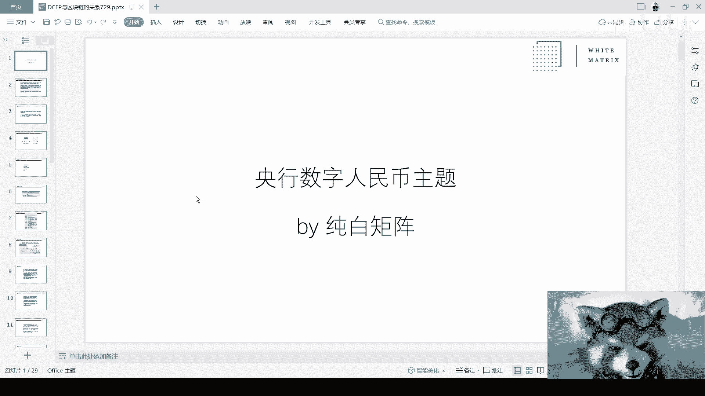

在本节课中，我们将以《中国数字人民币的研发进展白皮书》为切入点，系统性地探讨数字人民币（e-CNY，原称DCEP）的核心概念、技术架构、特点及其重要意义。我们将通过对比分析、概念拆解和场景探讨，帮助初学者建立对数字人民币的直观理解。

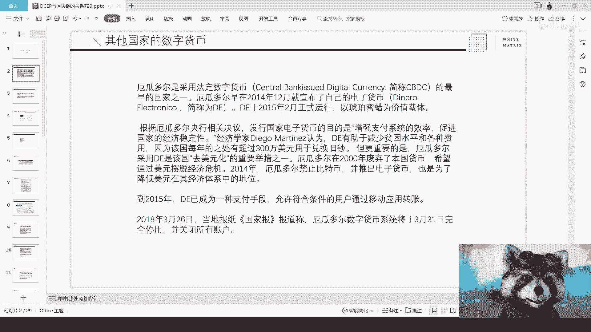

---

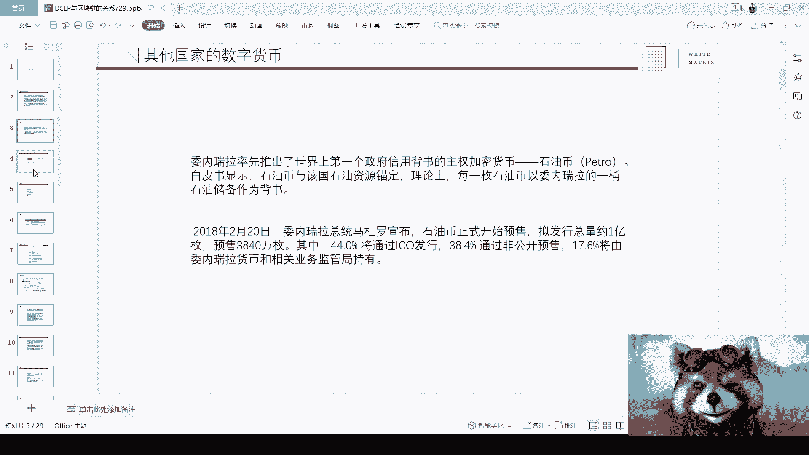

## 课程概述

数字人民币是中国人民银行发行的数字形式的法定货币。本节课程将首先回顾全球其他国家数字货币的实践案例，然后深入解析数字人民币的双层运营架构、技术特点、与现有支付工具的关系，并探讨其未来可能带来的影响。

---

## 一、 全球数字货币实践案例 🌍

在深入探讨数字人民币之前，我们先了解一下其他国家在法定数字货币（CBDC）领域的探索。以下是几个具有代表性的案例：

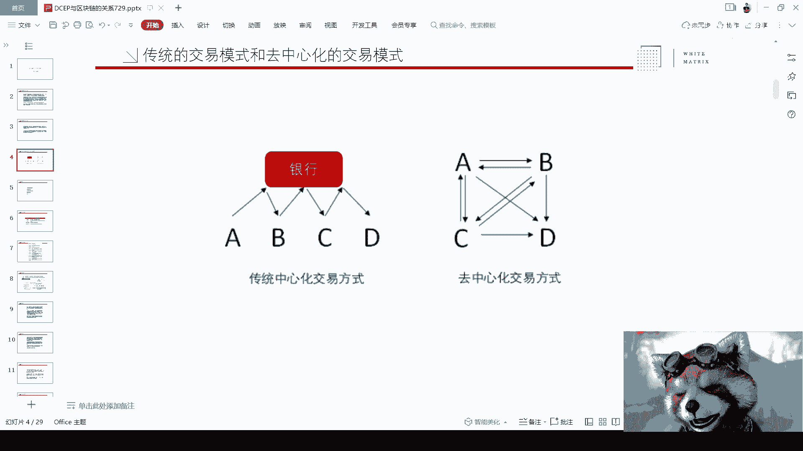

*   **厄瓜多尔**：该国在2014年推出了全球最早的CBDC之一，旨在“去美元化”。然而，其数字货币系统于2018年3月31日完全停用并关闭所有账户。这一案例表明，若缺乏清晰的长期应用场景和战略规划，CBDC项目可能难以持续。
*   **委内瑞拉**：该国推出了全球首个以政府信用背书、并以国家资源（石油）锚定的主权加密货币“石油币”。这是一种独特的模式，其数字货币并非直接锚定本国法币，而是锚定实物资产。

这些早期实践为后来者提供了宝贵的经验与教训。

---

## 二、 交易模式：中心化 vs. 去中心化 🔄

上一节我们看到了不同国家的实践，本节我们来看看支撑这些数字货币的底层交易模式有何不同。理解交易模式是理解数字货币价值的基础。

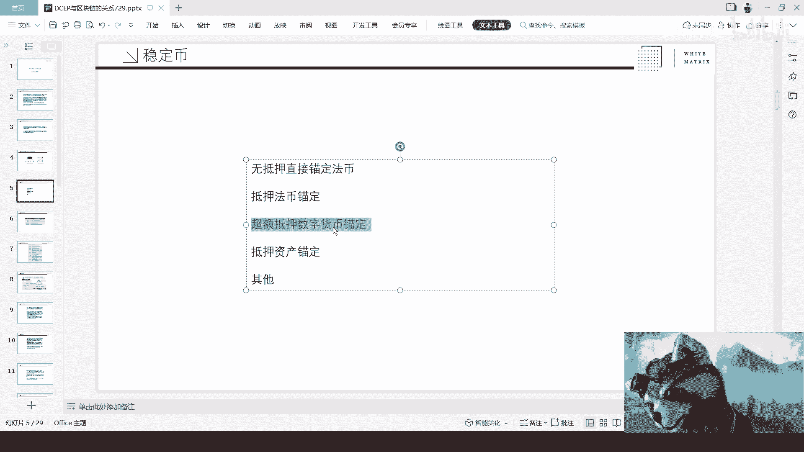

区块链技术带来的交易模式与传统模式有本质区别。

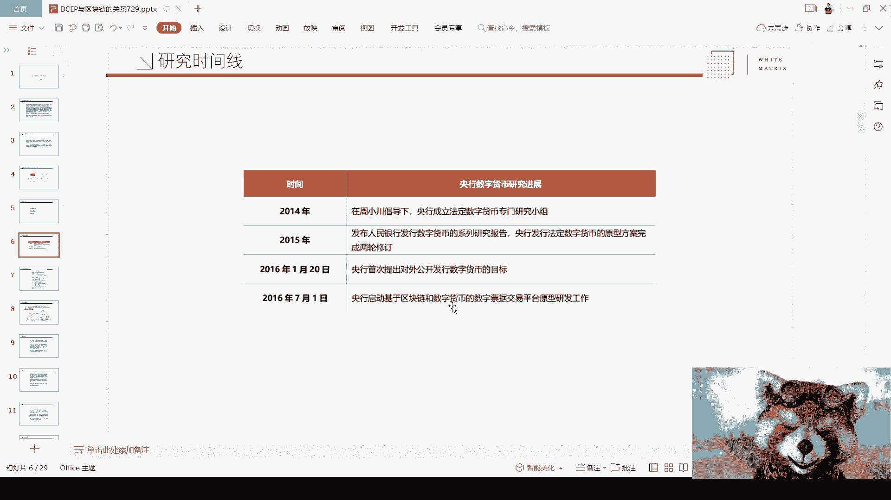

以下是两种主要模式的对比：

*   **传统中心化交易模式**：
    *   **模式描述**：所有交易需通过中心化机构（如银行）进行清算和结算。例如，个人A向个人B转账，需先通知银行A的账户扣款，再由银行通知B的账户收款。
    *   **特点**：效率受中心机构处理能力限制，流程环节多，可能存在延迟。在供应链金融等B端场景中，多层级的支付结算效率问题尤为突出。

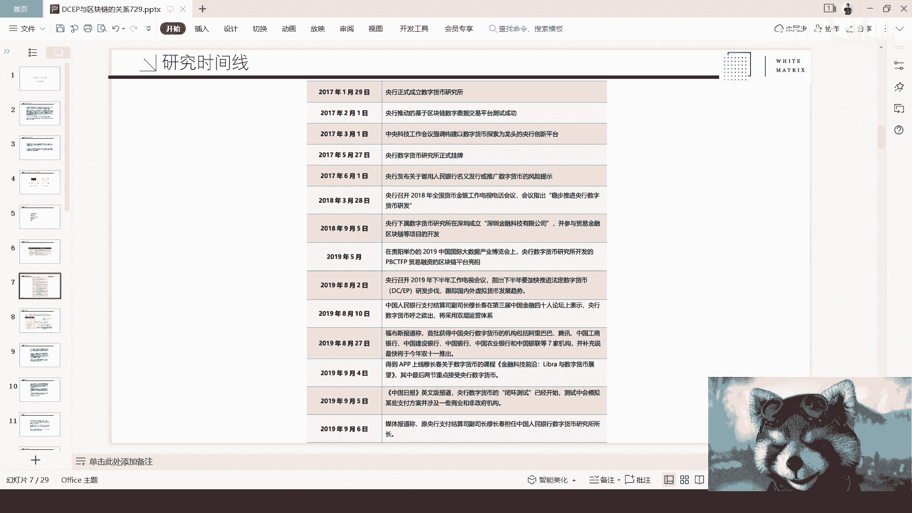

*   **去中心化交易模式**：
    *   **模式描述**：交易双方可直接进行点对点（P2P）的价值转移，无需依赖中心机构。区块链网络中的节点共同维护一个公开账本，确保交易的真实性与不可篡改性。
    *   **相关概念**：
        *   **公链**：节点无需许可即可自由加入或退出，完全去中心化，如比特币、以太坊网络。
        *   **联盟链**：节点需经过许可才能加入，存在一定的准入门槛，适用于多机构协作场景。中国“新基建”所指的区块链主要是联盟链。
        *   **闪电网络**：一种建立在区块链之上的二层支付协议，允许用户之间建立支付通道，实现高频、小额、即时的链下交易，最终结果再同步至主链。

目前，公链因其数据的不可控性（如无法按要求删除或屏蔽信息），与主权国家对于数据可监管、可备份的法律要求存在冲突。因此，数字人民币的底层技术更可能采用可控性更强的联盟链架构。

---

## 三、 稳定币的分类与原理 💎

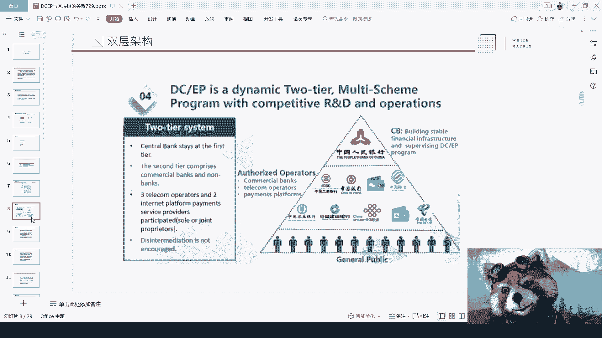

在讨论由国家背书的数字人民币之前，有必要先了解市场上已有的各类“稳定币”。稳定币是价值相对稳定的数字货币，数字人民币本质上是一种由国家主权背书的特殊稳定币。

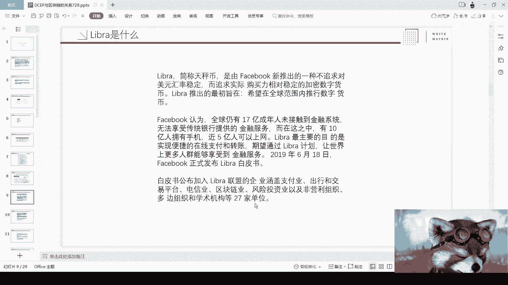

以下是稳定币的主要分类：

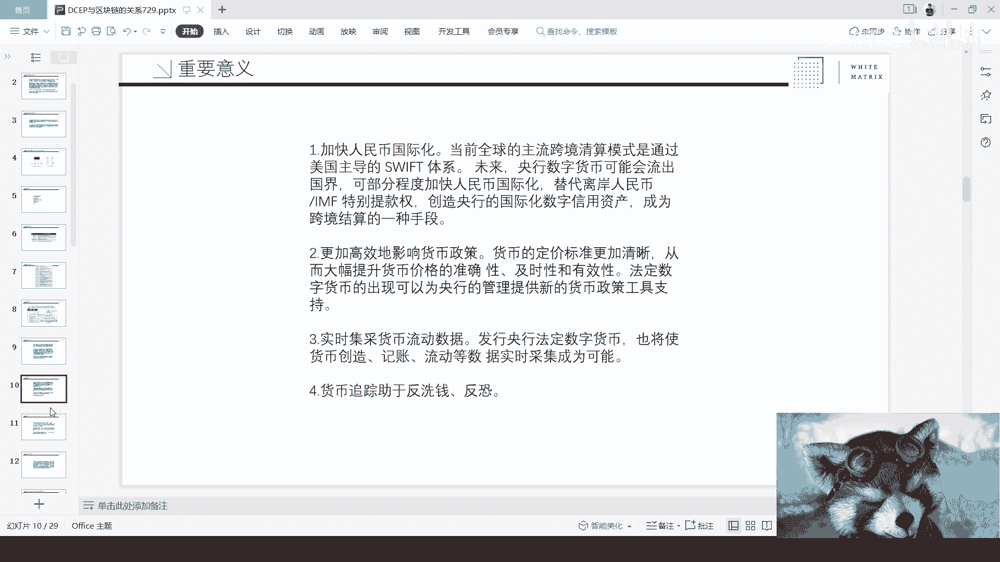

*   **无抵押直接锚定型**：
    *   **原理**：发行方凭借自身信用承诺其数字代币与法币（如1:1兑换美元）挂钩，但无实际资产抵押。其稳定性完全依赖发行方的信誉。
    *   **公式**：`1 Token = 1 USD（承诺）`

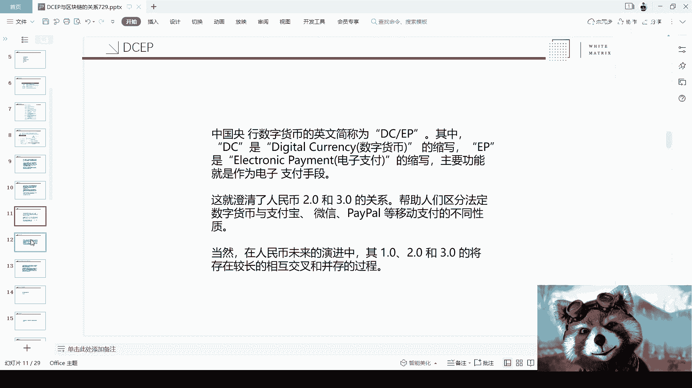

*   **抵押法币锚定型**：
    *   **原理**：发行方每发行1个数字代币，都在银行存入1单位的对应法币作为100%储备金。这是目前最常见的模式。
    *   **代表**：USDT（企业背书）、数字人民币（国家主权背书）。
    *   **公式**：`发行 1 Token → 抵押 1 USD（或等值人民币）`

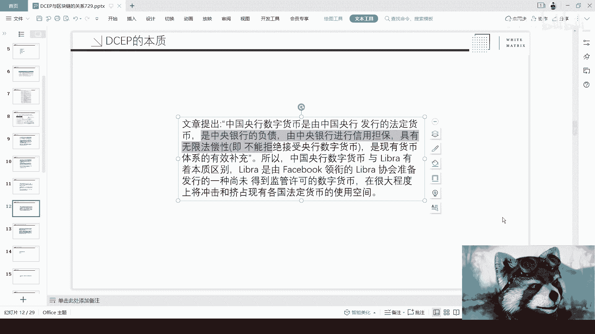

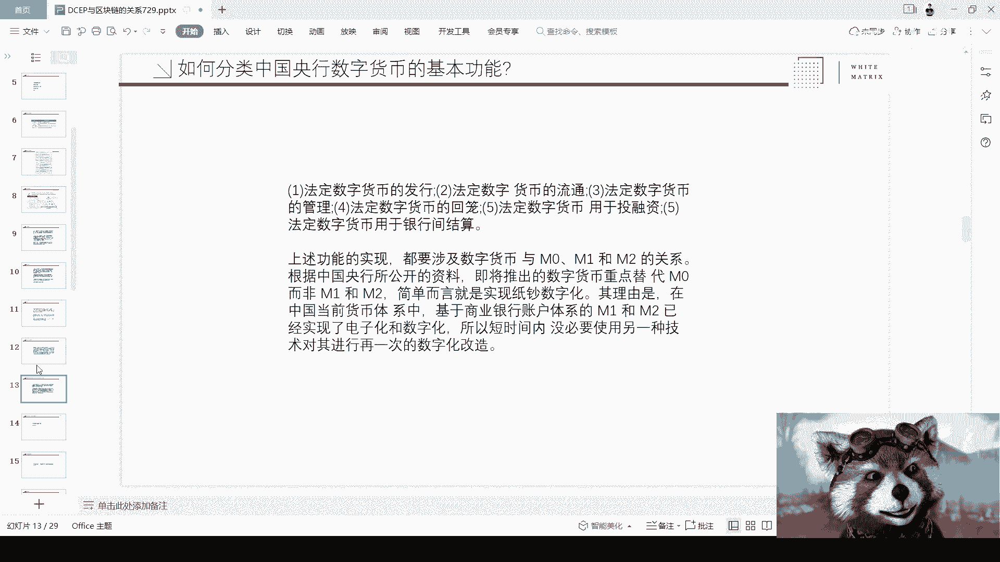

*   **超额抵押数字资产锚定型（算法稳定）**：
    *   **原理**：用户将波动性较大的数字资产（如比特币、以太坊）超额抵押（例如150%）存入智能合约，从而生成稳定币。当抵押资产价值下跌至平仓线时，需要补足抵押物或面临自动清算。
    *   **动机**：将波动资产转换为稳定资产以对冲风险，或通过“抵押-借贷-再投资”循环进行杠杆操作。
    *   **公式**：`抵押 $150 BTC → 生成 $100 稳定币`

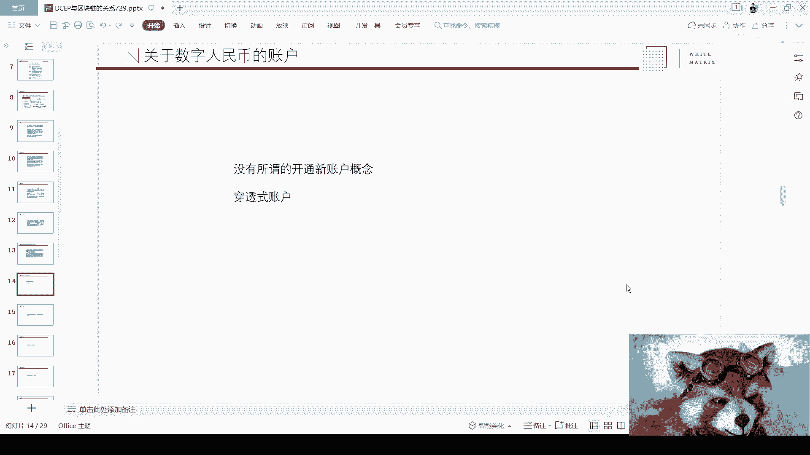

此外，还有资产抵押型、混合抵押型等模式。目前主流是抵押法币锚定和超额抵押数字资产锚定这两类。

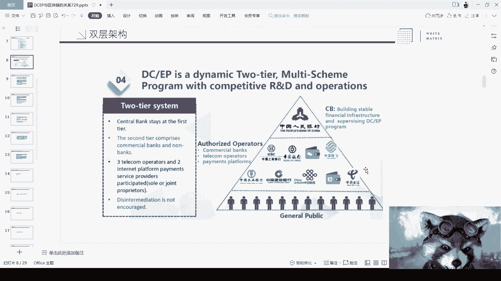

---

## 四、 数字人民币的研发背景与动因 📜

很多人认为数字人民币的推出是对Facebook（现Meta）发布Libra（天秤币）的回应，但事实并非如此。Libra是由企业背书、锚定一篮子货币的稳定币项目。

从时间线来看，中国的数字人民币研发规划远早于此：
*   **2014年**：中国人民银行成立法定数字货币研究小组。
*   **2016年**：启动基于区块链的数字票据交易平台原型研发。
*   **2017年**：中国人民银行数字货币研究所正式成立。

数字人民币的推出是基于中国国情的综合考量：
1.  **人口大国**：面临极高的并发交易、系统安全等独特挑战，是检验数字货币系统能力的绝佳试验场。
2.  **移动支付领先**：中国用户已广泛接受并习惯移动支付，为数字货币的推广奠定了良好的用户基础和场景基础。
3.  **技术储备成熟**：经过多年研发，相关技术已具备落地条件。

因此，数字人民币的推出是技术演进与市场需求共同作用的水到渠成之举。

---

## 五、 双层运营架构：角色与关系 🏗️

数字人民币采用“中央银行-商业银行/运营机构”的双层运营架构。这一设计清晰地定义了数字人民币与支付宝、微信支付等现有支付工具的关系。

以下是该架构的运作示意图与角色解析：

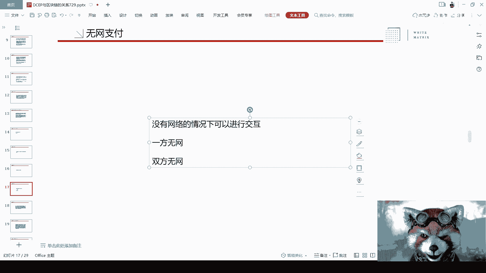

```
        中国人民银行（发行层）
                |
                | （100%准备金兑换）
                |
    ————————————————————————
    |           |           |
商业银行A   商业银行B   运营机构（如支付宝、微信支付）
    |           |           |
    ————————————————————————
                |
                | （面向公众和商户）
                |
            公众与商户
```

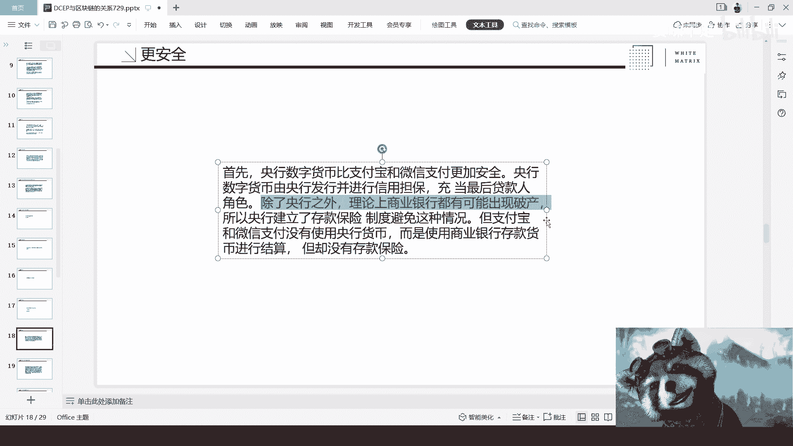

*   **发行层（中国人民银行）**：负责数字人民币的发行、注销和跨机构清算。这是唯一的发行中心。
*   **运营层（商业银行/运营机构）**：承担数字人民币的兑换、流通和回笼服务。它们需要向人民银行缴纳100%准备金来获取数字人民币额度，再分发给公众。
*   **与支付宝/微信支付的关系**：
    *   **不是替代，而是合作**：支付宝和微信支付可以作为运营机构之一，在其现有支付生态中接入数字人民币钱包功能。
    *   **用户无感切换**：用户在使用支付宝或微信支付时，支付选项可能增加“数字人民币”，体验流畅。现有商业习惯和支付场景得以保留。
    *   **发挥各自优势**：央行确保货币的稳定与安全，运营机构则利用其市场触达和运营能力（如红包、消费券、积分活动）丰富应用场景，提升用户体验。

这种架构既保持了中央银行的中心化管理地位，又充分利用了市场机构的资源与创新能力。

---

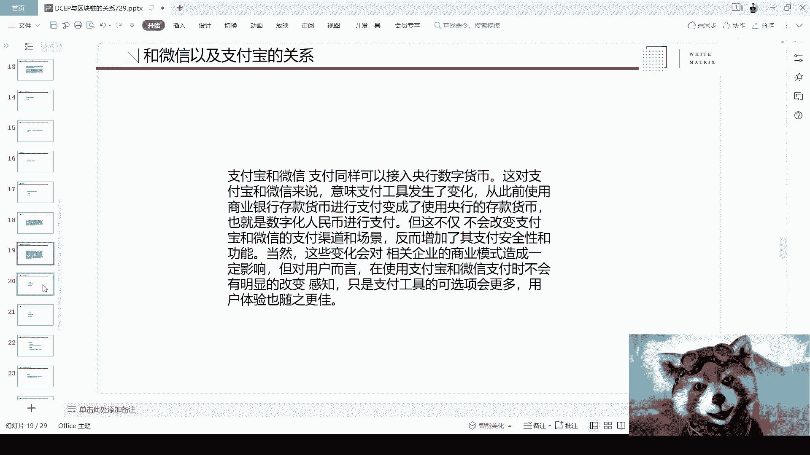

## 六、 数字人民币的核心特点 🔑

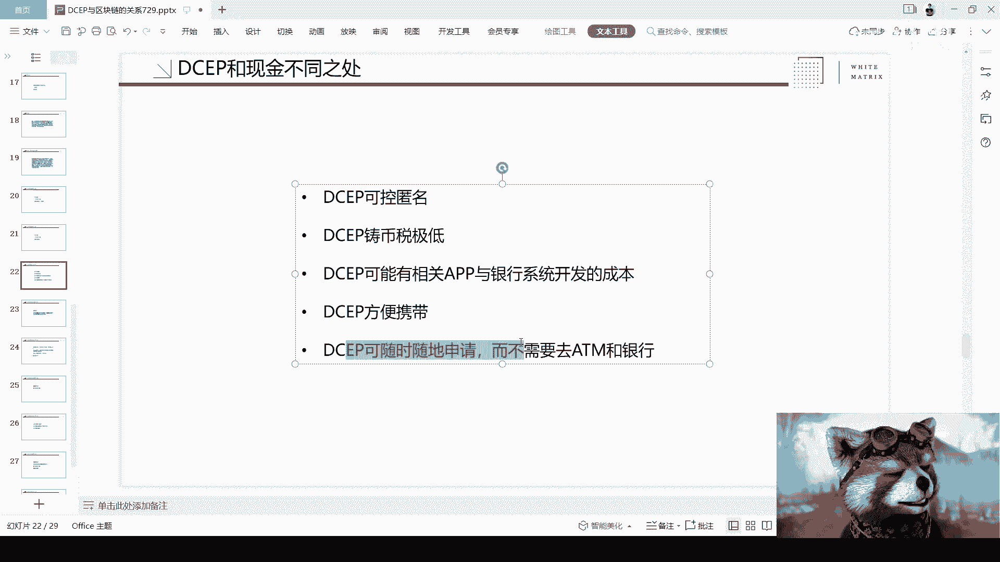

数字人民币具备一系列独特的设计特点，这些特点共同构成了其核心竞争力。

以下是其核心特点的详细说明：

*   **无限法偿性**：数字人民币是中国的法定货币。在中国境内，任何单位和个人在具备接收条件的情况下，不得拒收数字人民币。这与现金的法律地位相同。
*   **可控匿名（小额匿名，大额可溯）**：
    *   **匿名性**：与现金类似，交易双方的个人信息不会直接暴露给对手方。例如，超市收到你的数字人民币，并不知道付款人是谁。
    *   **可追溯性**：与现金不同，数字人民币的流通过程在央行层面是全程可追溯的。这有助于打击洗钱、恐怖融资等违法犯罪活动。同时，遵循“大额追溯”原则，大额交易会执行与现行金融管理相同的实名报告制度。
*   **双离线支付**：这是数字人民币的一大技术亮点，指在交易双方都处于离线（无网络）状态时，依然可以完成支付。
    *   **技术猜想**：可能通过NFC（近场通信）等技术实现设备间的近场数据同步，记录交易信息。待任何一方设备联网后，再将多笔离线交易批量同步至央行系统进行最终清算，并通过技术手段防止“双花”（同一笔钱被重复支付）。
*   **安全性更高**：数字人民币由中国人民银行直接负债并信用担保，具有无限法偿性。而商业银行存款、第三方支付余额的信用背书主体是相应机构，存在机构破产的理论风险。数字人民币从法律层面提供了更高等级的安全保障。

---

## 七、 与其他货币形式的对比 ⚖️

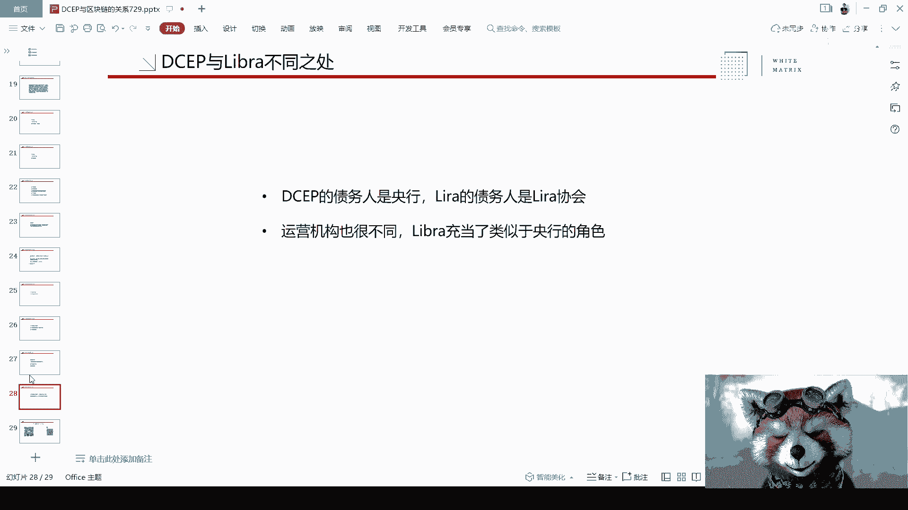

为了更好地定位数字人民币，我们将其与现金、银行存款、加密货币（如比特币）和Libra进行对比。

以下是详细的对比分析：

| 对比项 | 数字人民币 (e-CNY) | 现金 | 银行存款 | 加密货币 (如BTC) | Libra (天秤币) |
| :--- | :--- | :--- | :--- | :--- | :--- |
| **发行主体** | 中国人民银行（国家） | 中国人民银行（国家） | 商业银行（企业） | 社区/算法（无主体） | Facebook联盟（企业） |
| **债务关系** | 央行负债，国家信用担保 | 央行负债，国家信用担保 | 银行负债，银行信用担保 | 无债务人 | 发行联盟负债 |
| **匿名性** | **可控匿名**（交易匿名，流向可溯） | 完全匿名 | 实名制，账户透明 | 伪匿名（地址公开，身份隐藏） | 可控匿名（遵循合规） |
| **付息** | 不计付利息 | 不计付利息 | 计付利息 | 不计付利息 | 不计付利息 |
| **运营架构** | **双层运营** | 无 | 单层（银行直接面对用户） | 去中心化网络 | 可能为多层或联盟治理 |
| **技术本质** | 中心化或可控联盟链 | 物理实体 | 中心化数据库 | 去中心化区块链 | 许可型区块链 |
| **价值锚定** | 人民币法币（1:1） | 人民币法币 | 人民币法币 | 市场共识（无锚定） | 一篮子货币（1:1） |

**核心结论**：数字人民币是**中心化**的、由国家主权背书的法定数字货币。它可能运用了区块链的某些技术（如智能合约），但其根本属性是中心化管理的货币工具，目标是服务实体经济，保障金融稳定。

---

## 八、 未来展望与潜在影响 🚀

数字人民币的普及将是一个长达10-15年的渐进过程，与现有支付方式长期共存。其影响将是深远且多层次的：

1.  **催生新产业与商机**：数字人民币的推广将带动ATM机改造、新型POS机、安全芯片、钱包应用、商户系统升级等一系列硬件、软件和服务需求，创造大量创业和投资机会。
2.  **赋能智能合约与自动化结算**：白皮书明确数字人民币支持智能合约。这意味着未来可编程货币将成为现实，能够自动执行复杂的支付条件（如供应链金融的自动付款、政府补贴的精准发放），极大提升资金流转效率。
3.  **助力人民币国际化**：数字人民币若能与**资产通证化**结合，即代表实体资产（如债券、股权、大宗商品）的数字凭证在合规框架下与数字人民币挂钩流通，将为其在国际贸易和投资中提供更丰富的应用场景和吸引力。
4.  **推动金融创新**：在监管框架下，基于数字人民币和联盟链（新基建）的金融创新应用（如DeFi、NFT的合规版本）可能获得发展，构建更安全、高效的金融生态。

---

## 课程总结

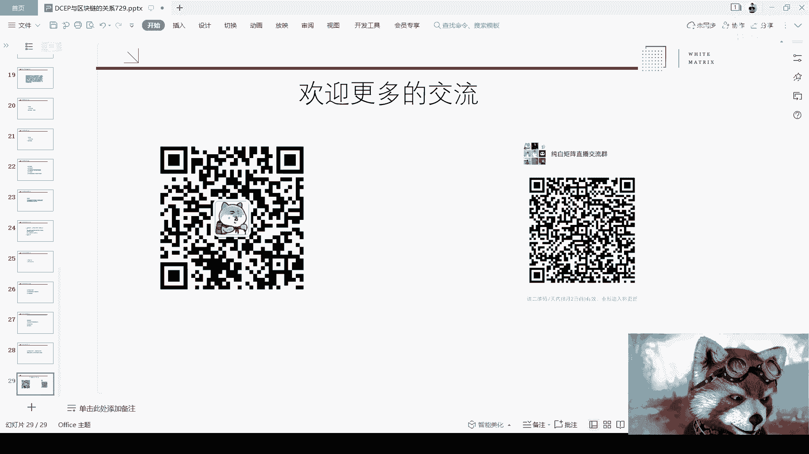

本节课我们一起学习了数字人民币的全面图景。我们从全球案例入手，理解了其推出的深层背景；通过分析双层运营架构，厘清了它与现有支付工具的关系；深入剖析了其“可控匿名”、“双离线支付”等核心特点；并通过对比，明确了其作为**中心化主权数字货币**的本质。最后，我们展望了数字人民币在推动智能合约应用、催生产业机会以及未来可能赋能资产数字化和人民币国际化方面的巨大潜力。数字人民币不仅是支付工具的升级，更是未来数字经济基础设施的重要一环。