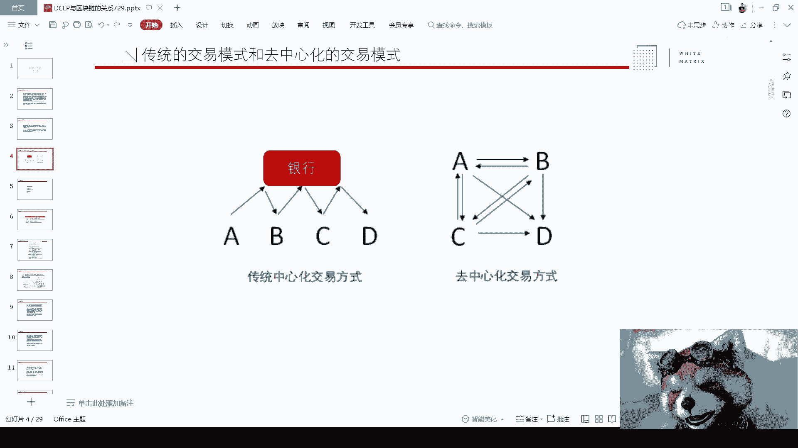
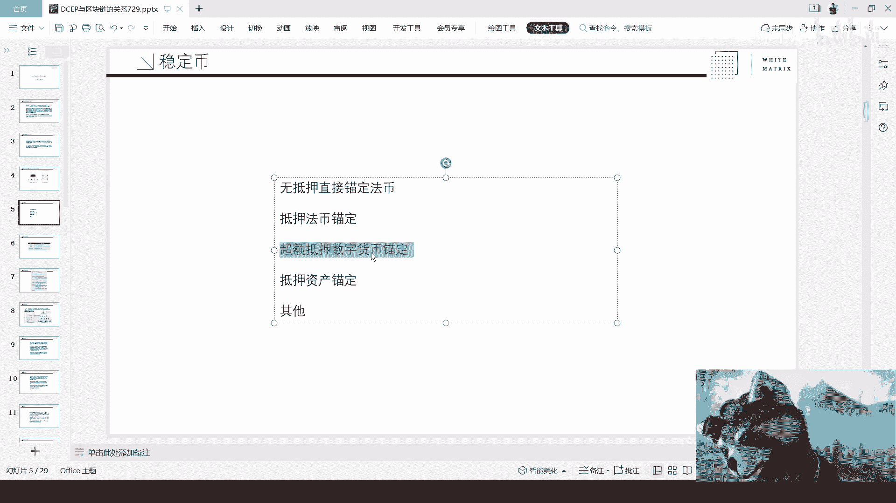
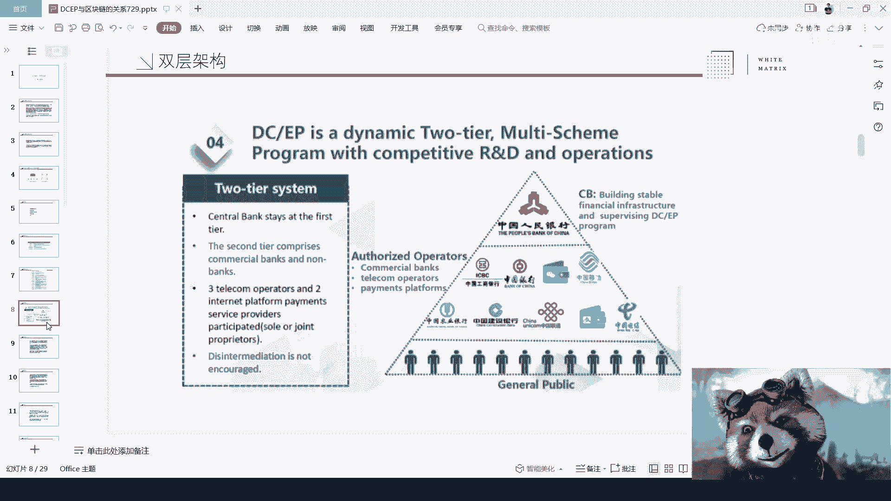
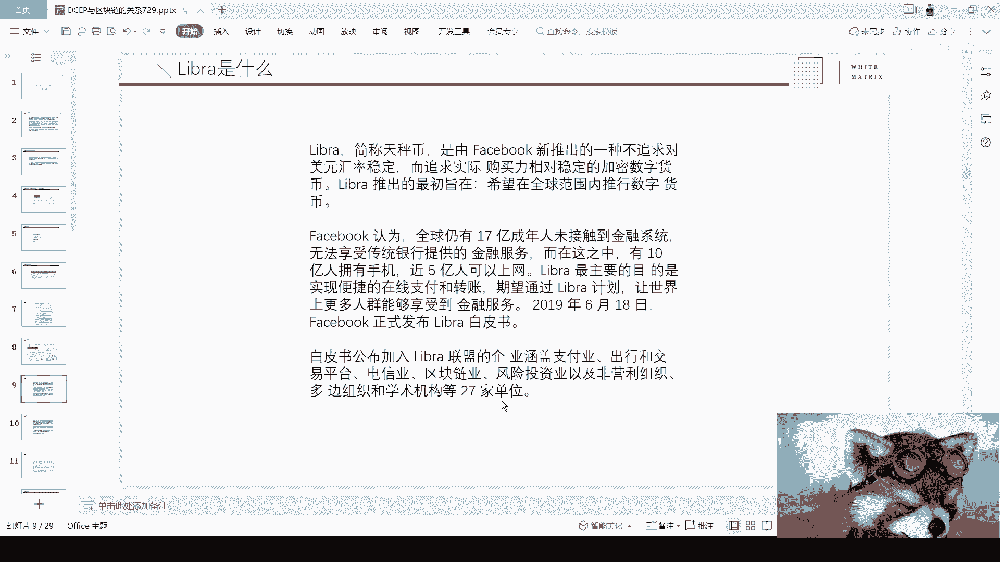
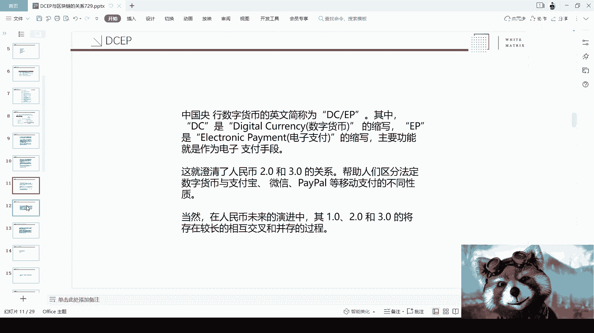
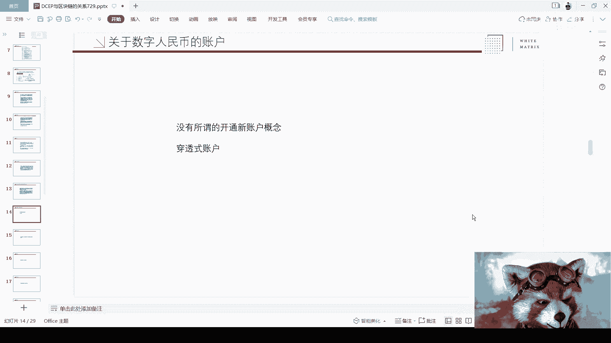
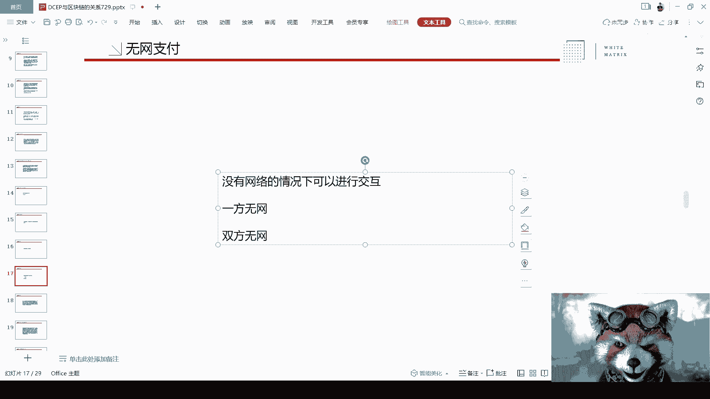
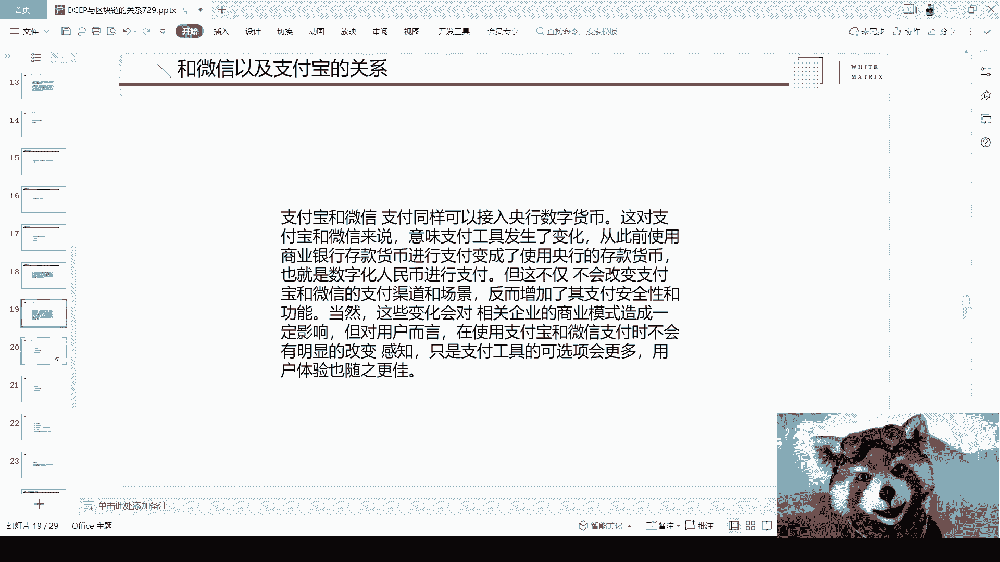

# 纯白矩阵区块链直播——央行数字人民币功能解读 - P1：20210729-203045339 - 赏味不足 - BV1uh411z7fs

呃本期的话呢最主要是这样子的，因为在前两天就7月16号呢，其实嗯前两天7月16号呢，然后这个白皮书呢，也是获得了很多人的一个关注啊，然后就是本期呢其实主要是想这个呃，以这个白皮书为切入点吧。

就是给大家跟大家一起来聊一下，数字人民币啊，就之前是叫DCP嘛，现在已经呃正式改名了，叫electric的这个呃人民币啊，就是我们就是群里面有这么一个缩写啊，然后呃在我们就是结束的时候哦。

也会给大家一个二维码就回头，大家可以加到我们的一个直播群里面啊，有任何的问题，可以打在这么一个呃弹幕互动区里面，同时呢就是大家如果对于未来的呃这个主题，有人有哪些这个想法也可以打在里面好吗。

我们有哦可以回看的啊，我们有这个呃同事会帮我们记录下来，后面我们会安排新的主题好吗，安排新的主题好，那么我直接就开始了啊，是这样子的，就是呃白皮书呢其实啊大家都网上可以看到啊，都可以看到啊。

数字人民币目前所披露的一些信息，给大家做了一些整理，同时呢也是能够希望，人民币能有一个直观的一个了解，好然后啊因为方便看这个评论区啊，所以我可能呃这个屏幕上共享会，就是先按照这么一个共享的方式啊。

好啊，我们首先先来讲一下，就是其他国家的一些数字货币，就这里的话我也给大家列了一下啊，就是像这里所提到的呃，厄瓜多尔啊，这边的呢大家也能看到，就厄瓜多尔在很早很早的时候。

就已经宣布了自己的这么一个电子货币，那么我们也看到它采用的是这个CBDC，就是法定的这个数字货币的一个方式，然后他是最早的一个一个制定方，然后在这个地方呢我们也能够看到啊，就是在2014年啊。

他禁止了比特币，并推出了自己的电子货币，那为什么在这个地方会提到他呢，是因为呃他也有个就是它的特点非常突出，就是它既是最早的CBDC，来做这么一个数字货币的，又是呃就是他已经完整的走完了一个周期。

就是在18年的3月26号，然后呃呃就是那个3月31号，然后完全的去停用了并关闭所有的账户对吧，那么其实我觉得在这个里面呢，呃从单纯从这个事实来看啊，我觉得他的目标，他的目的可能呃很多。

就是这个国家CBDC都是这个目的，就是说我希望能够去美元化对吧，我希望能够绕过美元啊，我希望自己的这个这个这个呃，法定货币能够升值对吧，但是他最终呃在18年3月31号的时候，就已经完全停用了。

其实也就证明了什么呢，其实呃我是觉得也就证明了这个国家，他对于比如说呃数字货币啊，啊包括整个的一个一个运用啊，包括他接下来整个的一个就为什么要去用，其实没有想到说非常清楚。

那我觉得首先是第一个啊，然后大家可以了解一下，然后我们往下第二个是委内瑞拉，这个呢在之前就是可能在区块链行业里面，也是有比较大的一个呃轰动性吧，因为当时这个消息出来也是，大家都是刷朋友圈的啊。

然后当时是什么呢，就是说推出了世界第一个以政府信用背书的，一个呃加权呃主权的加密货币，但是呢它的整个加密货币呢，是不是并不是用法币，就并不是以现在这个国家的法币来做支撑的，而是用他的资产来做自称的啊。

所以在这个地方，我们能看到他是用他的石油资源来做锚定啊，同时呢就推出了这么一个token啊，那么这个呢就是也也也算是一个特色吧，啊到目前为止，好像应该也没有其他的这个人有过类似的啊。

有国家有过类似的这么一个情况，那么这个是第二个啊，这个是第二个，我们再往下看啊。

好那么在这个地方呢主要是列了这么几个啊，呃OK那么我们正式来开始啊，来看就是说呃区块链啊，它与传统的这个交易模式和，趋势文化的整个交易模式有什么区别，在这个地方其实写的很清楚，就是传统的交易模式。

就是我们不管我们是个人，还是说是这个商业化机构啊，还是说是这个呃叫做商业银行，个人或者说一些商户需要去跟银行做结算，那么在这个里面其实我们会看到它的整个啊，这个中心化的交易模式。

就是左边这张图所展现出来的对吧，就是A需要跟银行去操作，然后到BB跟银行每一个接口，都要去跟银行做对接，那么呃这个里面呢其实感受最深的是什么呢，感受最深的就是我们之前有做就19年吧，做区块链链改的时候。

有和很多的供应链啊相关的，就供应链相关的那些产业有聊过，然后他们在就说嘛，就说哎自己的供应链很长啊，然后呢在整个供应链的运作过程当中，很大的一个弊端是什么呢，就是供应链上面每一个环节。

他们的支付款都是需要和银行去打交道啊，当然你说这个是不是B端，这个是一个必须的流程，它不是B端，但对于供应链本身来讲的话呢，他就会觉得哎我每次跟银行打交道，其实它的这个效率很低啊，效率很低。

然后速度很慢啊，然后在这当中就会出现很多的一些，比如说什么什么拖欠尾款啦，然后尾款呃就是尾款没有办法及时到账了，就各种各样的问题，那么这个是我们说的传统中心化的，这么一个交易方式。

那么第二个呢是去中心化交易方式，其实去中文化交易方式，右边这张图呢，就呃就是他这张图所表现的方式是什么呢，就是我没有中心啊，就是我我可以直接跟你交易，我也可以就是说通过我跟你的交易，跟别人去交易。

在区块链里面我们知道啊，就是有这么几个概念，第一个概念叫做驱逐优化对吧，就是呃比如说在列里面我们叫做公链啊，说的新基建，那么新基建指的是什么，指的是联盟链啊，指的联盟领号。

那么呃在区块链里面还有个很重要的概念是什，么叫闪电网络啊，闪电网络好，那么在这个地方呢，我跟大家先简单的说一下，因为我不清楚今天来的人，是不是都对这块比较了解啊，我先简单介绍一下，首先我们先说公链。

公链的逻辑很简单，就是我今天运行这套这个网络，就整个区块链，比如说这个网络啊，这个程序运行这个程序是全球所有的人啊，我做这个我们称之为节点吗，运行这些程序的那个机构或个人，我们称之为节点啊。

这些节点无准入准出标准，就是谁都可以进来，谁也都可以出去啊，谁都可以来做，这个叫做公链，那么正因为所有的人谁想进就进，想出就出，那么所以它称之为完完全全的去中心化啊，那么就叫做公链。

而中国现在所定义的新基建指的是联盟链，而联盟链的意思是什么呢，就是节点就运行这些程序的节点呢，它是呃有一定的准入准出门槛哦，也就是说我今天就打个比方，我今天想做一个微博啊，我说哎我拉了十个企业一起来做。

那么在做这个程序时候，我一定是需要我的这个合伙方，我的联盟方一起进来，那么做这些链上的节点的这个机构和人，他就有一定的权限，而不是说所有所有人都会进来对吧，那么这个就指的是联盟年。

而刚刚所说的闪电网络呢，它的一个概念其实简单来讲是这样子的，就是我们拿右边现在这张图我们会看到，比如说呃我们说A和B是经常交易的，A和C也是经常交易的，对吧好，那这个时候其实你会发发现啊。

A和B可能是朋友，A和C这是不是朋友，我们不管，反正他们肯定认识的对吧好，那么这个时候我们说B和C要交易了，怎么办呢，那么闪电网络它有一个很就是很好的一个逻辑，就是说哎我通过这种。

就是经常有这种小额交易的这个人，相互之间这种关系，我能够直接去让比如说B和C去交易啊，而不需要通过比如说更复杂的一些信任啊，或者签名啊，或者其他各种各样的一些流程啊。

那么他能够在练下很快的去做到这些这个行为，能快速达到交易，那么这个是我们称之为一种，比如说比较近便捷的一种支付方式啊，那么我们说啊在目前来讲就是呃公链在国内啊，其实目前呃所处的一个状态。

或者说国内到目前为止，其实政策上面还没有说完全支持的，一个主要原因是什么呢，其实主要原因很简单，就是呃我们说在呃，我觉得在任何一个主权国家啊，他的信息上面其实都是会有一定的这个备案啊。

我们称之为备份也好，备案也好，那么其实公链上面最大的现在一个问题就在于，它的信息是没有办法做空置的啊，因为像我国的法律规定，所有的这个互联网上的这个数据，是需要在服务器呃上面备份，起码六个月。

就大于等于六个月的时间，同时它的数据是可进行控制的，所有可信性控制，就是说我今天如果出现一个问题，他说哎你这个信息需要屏蔽掉，或者这个信息需要删除掉，你是有能力去把它删除掉的，而目前来讲。

公链上面其实是没有这么一个呃，这种这种这种方式的啊，所以说我觉得，我觉得这个是那目前的一个问题啊。

好那么我们往下，我们一定会提到稳定币，因为稳定币这边呢，只不过呢就是说它是一个国家主权背书的，一个稳定币啊，好那么呃在讲这之前，我们可以把稳定币的整个的一个分类给大家，先简单介绍一下，我这边列了几个啊。

呃稳定币在数字货币这个行业，或者在区块链行业大家都知道，比如说像USDT对吧，这个就是稳定币啊，然后像make到的die对吧，就是d AI die，他也是个稳定比对吧，好那么在这里面呢有那么几类。

第一类叫做什么呢，叫做呃无抵押的直接锚定，那无抵押直接锚定是什么呢，就是说我今天发了一个数字货币，比如说我通过区块链发了数字货币，我跟大家说这个数字货币一枚就等于一块钱的，就比如说一枚就等于一块人民币。

一枚就等于一美金，那么叫做无抵押直接锚定，那你你可能会问你说啊，那我为什么要相信你呢，那目前为止啊，就是你想想看全世界这么多人对吧，就是你只要有一定的信用背书，打个比方说。

比如说你是一家这个很牛逼的企业对吧，或者你是一个这个大V对吧，然后你说哎我发了一个币啊，我就告诉你这个B现在就是有价值的，比如说一个币就是一美金，一个币就是一个人民币，总有人会相信的哈，总有人会相信的。

这个叫做无抵押的这个啊，这个人民币啊，无无抵押的这个锚定锚定的这个数字货币啊，那这是一类，第二类呢叫做抵押法币的锚定，抵押法币的锚定呢，其实就跟啊我们说的USDT，就是这个DCP是一样的。

但是呢这个当中也有些区别，首先呢就是DCP现在不DCP现在的逻辑是，我如果有100块钱的DCP，我一定会有100块钱的法币这个现金做抵押啊，这个是他的逻辑，USDT呢也是一样的。

就是我有100美金的USDT发出来，那么我就用100美金的这个法币做抵押，但是这两者巨大的区别在哪里呢，就是USDT它的背书是企业，就我们知道它的发行方式，国外的一家公司叫ta对ta它是一个企业背书。

那么DCP作为中国的政府，那么这两者是有天差地别啊，但是不管怎么样，我们从本质上来讲，这两个都是抵押法币的锚定数字货币啊，这是第二类，第三类呢叫做超额抵押的数字货币的锚定，那么我们可以怎么称。

我们在行业当中也可以称之为叫做算法呃，叫做呃算法稳定啊，算法稳定，那么它的逻辑是什么呢，很简单，比如说啊大家可能都知道比特币对吧，大家可能也都知道以太坊好，然后呢这个时候是什么意思呢。

就是我抵押150块钱的比特币，来，通过智能合约生成100块钱的人民币，或100块钱的美金啊，也就是说我抵押起码150%，抵押就是就是这个比例的数字货币进去，然后来产出对应的问题货币好。

那么这个时候就有人会问了两个问题，第一个问题是你怎么保证它稳定对吧，你怎么保证它稳定啊，第一个问题，第二个问题是呃，就是我为什么比如说我手上有150，价值150块钱的这个反那个比特币。

我为什么要把比特币去抵押进去，然后来生成100块钱的这个这个稳定比，我是不是脑抽了对吧，那当然这两个问题很简单，第一个问题是呃，每一个稳定币的背后逻辑都很复杂，这个回头我们可以单独再来开课。

但是呢我们简单说一下它的逻辑，简单的逻辑就是说，今天你有100 150%的一个呃，抵押价值抵押在这里面，如果这个数字货币本身升值了，那自然没有什么问题，但如果它贬值了啊，贬值了。

它一旦低于某一个抵押率的时候，那么你就需要去不足你的抵押的资产啊，才能稳定，才能这个保持整个这个稳定币的一个稳定，那也有人会说，那我就不去补充啊对吧，我就没有足够的抵押资金了。

那OK整个智能合约和整个那个稳定货币这边，那我们简单粗俗一点，略磨呀，基于这个平仓到底是通过拍卖的方式平仓，还是通过比如说自动交易的方式平仓，这个可能是各显神通了啊，但不管怎么样。

他一定会保证他的这个这个叫做呃，整个资产的一个平衡，否则的话呢这个稳定币就不稳定了对吧，那就肯定就亏了嘛对吧，那这个是一方面，第二方面是我为什么拥有足够的这个资金，比如说150块钱的价格啊。

呃150块钱的价值，我为什么要去抵押生成100块钱呢，这个当中也有两个原因，第一个原因是我为了稳定啊对吧，因为我手上的是波动的资产，抵押进去，我生成的是稳定资产，那么这个稳定资产对我来讲是有一定的。

这个这个这个避风险性的对吧，这是第一点，第二点是我通过稳定资产，在二级市场上再可以购买我的波动资产，然后再去抵押生成稳定资产，然后循环去做这个操作，他就能做一个杠杆对吧，那么这个也是国内外。

就是全球现在这个呃，把数字货币去抵押成稳定货币，这个最大的啊最大的这么一个动机之一啊，好那么OK大家啊，我顺便提一下，但呃就是大家有任何的问题，可以在评论区打出来啊，好然后最后一个就是其他其他的话。

其实现在嗯其实啊就是大家了解的话，其实会发现也有什么的，也有比如说呃资产稳定的啊，也有就是混合类稳定的，就比如说我既是呃一部分法定抵押，我有一部分这个合约，就是一部分的这个叫做超额抵押。

然后也有部分资产抵押，也有混合式抵押的啊，这种也有大家也可以了解一下，但是不管怎么样，主流的现在来看呢，无非就两个，一个是叫做第二类，就是抵押法币的这个锚定啊，还有一个就是第三类叫做通过智能合约。

来超额抵押的这个稳定啊。

目前来讲主流是这两类啊，主流是这两类好，那么我们往下啊，就DCB当时刚披露的时候呢，其实有非常多的人会说什么呢，他会说说诶，是不是因为FACEBOOK发了LIBRA啊，好那这个地方顺便提一句。

LIBRA是什么呢，是我们这个翻译过来，我们叫做天秤币对吧，天秤比，这个是FACEBOOK当时以公司的名义要去发布的一个呃，锚定法币的啊，这个数字资产就是数字货币啊，那么我们在这当中有两个核心的关键点。

第一个关键点是它不是由政府主那个背书的，它是由FACEBOOK这个公司背书的，这是第一点，第二点是他发布的LIBRA，它是一个锚定一揽资国家货币的，它并不是锚定一个国家的货币啊。

股毛定了一揽子的国家货币，那么这两点，那么我们从整个DCP的这个时间线上面来看，我们能发现，其实呃它并不是并不是像带很多人觉得啊，因为FACEBOOK发了LIBRA对吧，这个啊国家有了危机感啊。

然后说我们这个强行推出了DCEP对吧，肯定不是这样子的，我们从时间线上面就能看到吗，就是14年的时候啊，就已经成立了，这个数字货币专门的这个研究小组啊，然后在那个16年的时候。

就已经启动了基于区块链和数字货币的。

这个数字票据交易平台的这个原型研发对吧，然后你像那个17年基本上就已经奠定了，就是说正式成立了数字货币的研究所，然后把娃娃再往下对吧，一长串对吧，那么所以说在这个里面其实我们能够看到啊。

其实也写的很清楚，就是为什么呃国家会去呃做这么一个数字货币，或者会做这么一个叫做数字人民币，其实本质上是一个很综合的原因，其最大的一个原因是什么呢，其实最大的原因是，因为整个的中国目前的国情非常符合哦。

就是国家去发行这个数字人民币，为什么呢，因为本身中国啊我们说有几个很大的特点，第一个特点是人口众多对吧，那人口众多意味着什么呢，会拥有着前所未有其他国家碰不到的那些挑战，包括并发对吧，包括这个安全对吧。

包括就是里面的各种各样的问题对吧，首先是第一点，第二点是中国在移动支付上面，也是一个就是全球可以领先的，比如前五甚至前三的这么一个国家，那也就意味着什么，也就意味着中国的这个老百姓。

在整个的这个呃使用习惯上面，包括整个国情上面，他大部分的人和大部分的机构，他已经习惯了移动支付，那么我们就会发现，无论是在我们的这个技术成熟度上面，还是在我们的整个场景情成熟度上面，都已经呃拥有了。

叫做呃去铺设或者去发展，数字人民币的这么一个呃，非常好的这么一个条件，会比其他的任何国家就来的好啊，那么自然而然也就顺理成章的去给出了，其实是这么一个流程好，我们在后面其实也会提到啊。

就是有相关的一些内容，然后我们继续往下嗯，我们在这个地方可以看到啊，就在公开场合下面分享的一个PPT啊，呃在这个里面呢，其实最主要告诉大家的是，在本期白皮书里面也披露过，人民币有双拥有的双层架构啊。

双层架构呃，在这个里面呢是这样子的，我们说整个的数字化那个呃，这个这个人民币也好，法币也好，数字化的这个货币里面，它主要有两层架构，第一层叫做单层啊，第一类叫做单层，第二类叫做双层啊。

我们在这个地方可以看到它完全用呃，使用的是一个双层架构，那么在这个里面也就阐述了，很多人在当时刚看到DCP的时候有一个疑问嘛，就说那你说推广数字人民币好，没问题。

那这个数字人民币和我微信支付和支付宝支付，到底处于什么关系好，那么在这里的双层架构就是这张图，非常清楚地告诉大家它处于什么一个关系对吧，那他的关系很简单，就是首先所有的DCP的发行。

它全部都是由人行来做发行的，这个是统一发行，然后呢所谓双层是指什么意思呢，就是下面的我们会看到爱存不存啊对吧，就是ICBC啊对吧，中国银行啊，中国移动啊啊，然后什么支付宝啊，电信啊，其他的各种各样。

因为在这个地方其实定义了什么呢，就是它可以是银行，商业银行，它也可以是第三方支付机构啊，都可以，它甚至可以是一些运营方，其实都可以，然后在这个里面呢，它主要做的就是一个呃我们如果粗俗点来讲啊。

他就是个分销的角色啊，他就是分销角色，当然我们在真正双层架构这个理解上，我们不能这么理解啊，但是我们这个粗俗点理解可以这么理解，那么它的流程是什么呢，流程就是说，比如说我今天支付宝要去发行DCP了。

百分之百的储备金，然后由银行给他做，他在发行，他在下发给下面的这个呃general public啊，就是这样子的，那么我们说呃单层和双层有什么好处啊，是这样子的，单呃单层的话呢。

它的优势或者它的特点是在于所有的这个呃，我们就相当于是没有第二层嘛对吧，那所有的这个对接，所有的这个呃清算直接房就是人行，我不管今天我是个人也好，还是机构也好，我所有的清算方都是人行对吧。

包括我的对接方都是人哈，这个是单层，那么双层这边呢，它最主要的优势呢，其实也是符合目前中国的一个这个国情的，很好，是什么呢，就是我们说呃中国现在比如说什么，每次过年有集五福对吧，有这个发红包。

当时就说过这么一句一个案例，就是说呃我们说我们现在发红包对吧，你说我们发红包，现在都是由那个人那个支付宝跟微信来发的，那这个发我们说我们可以玩出花来，比如说集五福就是玩出花来对吧。

比如说那个那个微信现在发红包，还有那个红包封面，这些都是我出发的，但是你说这些花你让银行去做可不可能，首先无论从那个，当然你从并发角度是完全可以的，技术上肯定都是支持的，但你说有这么多。

这个叫做运营上面的这种活动也好，东西也好，不是去做这些花里胡哨的东西，但是这些东西你说对老百姓有没有吸引力，肯定有吸引力对吧，做双11也好，做活动有没有用，肯定有用，不会做，那么怎么办呢，交给二层对吧。

所以说他有这个双层架构是非常好的啊，非常好的，那么在这个里面就像我们刚刚提到的，那你说会对支付宝跟微信有权有影响吗，没有影响，有什么影响呢对吧，就是我该怎么用支付宝还是用什么支付，用支付宝，我有感知吗。

我甚至没有感知对吧，所以对于这个大部分老百姓来讲，你说呃他可以比如说在现阶段，他说我去尝个鲜，没问题的，但是时间长了，他还是用该用支付宝，用支付宝，该用微信，用微信，为什么呢，这是因为大部分的商业行为。

他还是就是习惯对接了这个微信跟支付宝，就像你今天去吃个饭，你先去买个衣服，你今天报个培训班都是这样子的，时间长了，你他就跟你这个目前所用的法，那个人民币的法币是一样的，你今天不你不可能说啊，我今天来。

我用支付宝支付一个这个这个这个买买个饭啊，来吃个饭，然后呢我掏出支付宝的同时，我还要再掏出口袋里的十块钱来让我查个账户，看看我账户里面有没有十块钱啊，有的好，我来支付一下，不会的对吧。

你就很自然的就去支付了，所以说其实这种就是整个DCP跟法币，就相对来讲都比较无感的这么一个点啊。

OK然后我们往下看下有没有什么问题好OK啊，大家有什么问题可以都发在评论区，然后呃LIBRA就刚刚我也提到了LIBRA，简称天称帝啊，然后是由FACEBOOK所推出的一种这个呃这个稳定币。

而且是一揽子的啊，就一揽子的呃，说到这个我可能得提一下吧，就是这个我觉得大家如果感兴趣的话，可以回头去看一下，就是呃当时FACEBOOK小佳同学刚发了这个DCP的时候，就是sec就那个呃对啊。

那个那个SEC整个开的那个会，大家可以去了解一下，就当时sec那个听证会应该听证有两三次啊，然后就感兴趣的可以去了解一下，这样的话也能看一下，就是美国对吧，到底对。

比如说哦那个企业所发出的这个数字法币对吧。

有哪些这个担忧的点，其实这也是个很好的一个学习的一个方向啊，然后我们往下来看啊，就是整个DCP的这个重要意义，首先加快人民币的国际化，我觉得这个是毫无疑问的对吧，因为啊当然这个我们后面再来讲。

为什么它能加速这个国际化啊，这个我觉得是一个呃，就是虽然目前来讲没有定论，但是从我个人角度，我我我还是有些想法的啊，这个待会再来跟大家讲，这是第一个，第二个呢，就是更快的这个呃高效的影响货币政策。

这个毫无疑问嘛，因为你一旦就是相当于数字化，因为我们现在会发现大部分的这个呃，传统企业和那个互联网企业都在做，叫做数字化转型对吧，那么你一旦做了数字化转型，其实你能够更快的在这个那个数字化层面。

去做一些这个那个那个那个啊革新啊，或者一些变革对吧，那这个就是很好的，那么第三点呢就是说啊啊第三点，第三点可能又是很多人关心的点，就是什么呢，就是呃我们说呃人民币现在是匿名的对吧。

那你说我们数字人民币是不是匿名的哈，这个我们在后面特点里面会写啊，然后第四个就是那个有助于反洗钱啊，不是有助于追踪注于这个反洗钱和反恐啊。

好然后我们往下啊，DCP现在这个是简称啊，全称是在这个地方我就不去说了啊，简称，然后我们在这个地方说一个时间轴，就是DCP，整个普及的时间肯定是大于等于10年的啊，然后从目前的正常情况来讲。

应该是在15年左右，为什么呢，因为呃人民币每一次的革新换代，最少都是10年啊，也就是说我们之前应该经历过，起码比如说第五代和第六代的这个，人民币的更新啊，就比如说什么50块钱了，20块钱了。

十块钱了对吧，都有更新，每一次的法币的更新起码都是10年啊，至少在中国这个国家，那么从这个上面我们来推演出来，你之前只是法币的更新，而你这次是法币的数字化更新对吧。

那我们认为你法币的数字化更新怎么地对吧，就都得都得个大于10年吧，而且这个15年我觉得也也算少的吧，可能对吧。

这是一个情况啊，然后再往下就是DCP这边的本质呢，其实是这样子的，就是这个地方最主要的一个点呢是呃，我这边标出来就是是由中呃，这个人民银行来负债，然后由人民银行进行信用担保，具有无限法偿性。

那么在这个里面呢，最主要提到的一点也是呃，这个各个比如说我们如果去看各个文献啊，各个这个参考资料都能够看到，里面非常强调的一点是什么呢，就是商业银行都是有可能破产的啊，就是我们从可能性上面来讲。

都是有可能破产的，而且商业银行是没有，就是在法律定义层面，它是不会进行呃强制担保的啊，强制担保是不会的，但是只有人民银行，它是在法律上面是拥有强制担保的啊，发行的这个DCP他有这么一个呃。

就是别的那些商业银行或者别的机构所发行的，所有的那个数字货币也好，数字法币也好，没有的这么一个特性啊。

所以说这个是非常重要的好，那么我们来看一下啊。

就是往下这个M0M1我就不去说了，那么我们来说这个这个账户啊，账户这个地方呢是这样子的嗯，我们知道就是大部分人知道的是唉，我通过这个招行的那个那个手机app对吧，或者农行的手机app。

我先通过app是可以直接开通我的这个账户的，它是没有所谓开通账户这个概念的，什么意思呢，它的整个的一个这个框架上面定义的时候，它定义的是无感式的账户，什么叫无感式的账户。

我们在区块链里面其实有个概念叫KYC啊，所谓KYC就是实名认证啊，就实名认证，那么所谓没有所呃，那个开通新账户的概念是什么意思呢，就是所有你已经实名认证过的东西，都可以无感的成为你的账户。

OK我们举个例子呃，很简单，就是我们说呃现在大家在那个停去停车，停车场其实都是那个支付完了，你你怕照一下，照一下之后你就可以出去进入了嘛对吧，那未来只要是你跟你个人的。

这个实名绑定的东西都可以成为你的账户，比如说你的汽车车牌啊，比如说你的这个呃，某一些可以证明你是你的这么一些东西，都可以成为你的这个账户啊，我们或者称之为子账户，那么你未来的汽车车牌就可以直接扣款啊。

这个就是他所谓的其实没有开通新账户，这么一个概念的一个一个一个切入点啊，首先是第一点，第二个点点呢叫做穿透式的账户，穿透是账户是什么意思呢，就是说因为我们看啊。

刚刚我们提到的二层架构在这个地方，因为我们现在的未来，如果DCP普及之后，我们所有的清算其实就不会说经过银行，我们基本上就是全部是点对点的，和人民银行去清算对吧。

因为是你你你下面其实只是一个下发方嘛对吧，下方方嘛，你最终清算都只是和人民银行做清算嘛，那么这个时候呢你会发现，你会发现他的账户是穿透式的，所谓穿透式的，就是说我今天呃每一个人在未来的某一个时间。

我的账户是会被统一化的，那么统一化的意思就是说，我虽然今天我可能，比如说支付宝里面是有DCP的，或者说比如说我的车牌里面是有DCP的，或者说我有其他地方有DC p，但是呢我这个人我的最终统一账户。

只有我就是我一个人只对应的一个账户啊，这个账户就是我所有资产的总额啊，就是我所有资产总额，那么这个时候你就会发现。

这个账户是一个穿透式的一个账户啊，而且这个账户会对，未来我们说通过智能合约来做这个呃，那个那个DCP的这个结算有非常大的帮助哦，非常大的一个帮助好，那么我们接下来讲它的几个特点，这几个特点里面呢。

其实呃有几个还是比较重要的啊，有几个还是比较重要的，我们一个个来讲啊，一揽子就是一箩筐，对对对对，这个是因为他白皮书上字怎么写的，我也就这么读了，呃是这样子的啊，我们来说一个特点。

第一个特点叫无限法偿性，无限法偿性的意思就是说呃在中国任何地方，只要是有呃指的不是说只要有电子支付啊，只要它的硬件可以支持，只要他的客观条件允许啊，那么他就不能拒绝去使用DCP啊，这就好像今天打个比方。

它有一个硬件扫码的工具啊，他明明可以扫DC p，但是呢他跟你说，哎我不能不能用啊，我只能用支付宝行不行不行啊，你只要客观的条件下允许，你就不能拒绝啊，这个叫做无限法偿性啊，当然你说有的人拒绝怎么办。

唉这就好像什么，这就好像你现在到一个餐馆去吃饭对吧，然后呢啊你就跟他说，来我这个身上有100块钱现金，然后对方说我我不说的，我这边只能扫支付宝，只能扫二维码，你就可以直接直接打110，我跟你说。

因为什么，因为他不能去收人民币啊，这个就是无限法偿性啊，好那么首先是第一点，第二点呢就是我们关心的叫做匿名性啊，好那么DCP和央呃，和那个目前我们手上的法币，它的匿名性其实是一致的，我们举个例子来讲。

今天张三跟李四，张三跟李四做了一笔交易，张三把十块钱给了李四，这个时候李四又用十块钱到超市买了一瓶，买了一瓶可乐，对吧好，那么未来如果我们要去查账啊，比如说这个超市的员工啊，这个职员说哎我有手上十块钱。

那你去问他，你知道这十块钱是属于张三的，还是属于李四的，他知不知道不知道，因为这个十块钱上面不会去写名字是吧，或者来说这十块钱上面就算写的名字，我我写张三，难道就处于张三吗，那不可能嘛，对不对。

所以说这个呢就是他的这个匿名信啊，匿名信，但是呢DCP跟他的匿名性又有一定的区别，在DCP本期7月16号所披露的白皮书里面，写的很清楚，叫做什么呢，叫做小额匿名大额追溯，什么意思呢。

就是说我小无论是今天小额大额，你的整个这几这笔钱是谁的，他是匿名的，这没有错啊，他的确没有错，但是所谓可溯源是什么意思呢，可追溯的意思是，我可以非常清楚的去知道这笔钱的流动，就他的这个流通呃。

它的整个这个路径流通路径是怎么样子的，就很简单，就今天好像哎这笔钱是谁的，我不知道，但我知道这笔钱经过了张三，经过了李四，经过了全家对吧，经过了这个这个便利风啊，又经过了某一个洗黑钱的地方。

这我是知道的啊，那么这个就是他所谓的可追溯啊，同样的他在白皮书里面写的很清楚，所谓大额追溯，另外一个点就是呃，它既然是一个国家发行的主权货币，那么它就会和现在的人民币，在很多的地方保持一致。

因为现阶段你去存个一两万块钱，我觉得是没有问题的，但是如果如果你去银行存个大额的，银行，依然会让你填各种信息来保证你的实名制，对吧好，那么如果未来在你用了数字人民币对吧。

那么你如果要做大额转账或者做大额的存款，其实也会是一样的啊，没有任何区别的，所以呢我们说它的匿名性，更多的是保护了我们就是个人也好，老百姓的这个隐私，但是并不代表他的整个那个流通路径，是就完全匿名。

你说完全去中心化，那是不可能啊，所以这个是那个不同的地方好，那么接下来就到了最复杂的一个地方，叫做无妄之父，啊OK啊，在这个地方我们看到评论区有同学说啊，就是关于账户的问题，我们回到账户啊。

就是账户是这样子的啊，他并不是没有账户，而是说他将所有已经实名制的东西，都会默认地开成账户啊，这就好像我们刚刚说的，你今天的网银，你今天的支付宝其实已经实名认证了，那么你在对于DCP来讲，你在网银也好。

在支付宝也好，微信也好，在你的车牌也好，只要你已经实名认证的，在这个国家的法律框架下面实名认证了，那么他就默认已经会有子账户存在，只不过说白了你最终去是不是把它授权，把它使用，只是这个区别。

所以说呢他会告诉你，其实是没有所谓的开通账户的概念，而是所有的实名制东西都等同于你的账户啊，是这个概念，OK然后我们往下就是，OK然后就提到最复杂的叫做无网支付啊，好那么无网支付我们在这个地方。

我们可以打一下无网支付哈，无网支付有那么几个概念，第一个呢叫做嗯一方有网对吧，叫做哦，我这么说吧，一方无网，对吧好，那么第一种叫做一方网，一方网其实很简单嘛，这就好像今天打个比方啊，你去超市了啊。

超市这个信号特别差，你说我没有网，可不可以，没问题啊，因为超市的那个营业呃，扫码枪它是联网的，你去扫二维码，依然可以去对接支付宝或对接微信，或对接网银都是可以的啊，对接银联对吧，都是可以的。

这个没有问题的，这一方往这个一点问题都没有，其实现在最大的问题，最大的疑点是在于双方无网，哎我这个输入法简直是垃圾，双方无网，对不对好，那么双方无网呢在本期的披露的白皮书里面，其实写的很清楚。

一定是支持两方都无网的情况下进行无网支付，但是他并没有详细的说明，我无网到底是怎么支付的啊，好那么在这个地方，通过各个地方的这个信息的披露，我们做了以下几类猜测啊，第一类猜测是呃双方都无网的情况。

下面第一类猜测是什么呢，叫做呃那个钱包就就是双方的这个应用，只要是用了DCP，他每一方都有一个账本的记录，也就是说我今天比如说啊，他们他们在一个小黑屋里面进行了交易，对吧好。

这个时候呢我们说有这种可能性，第一种可能性是，如果他们仅仅是两方做了交易，同时这笔钱不再对外流通，那么OK是不是有网，是不是无网，一点问题都没有，为什么，是因为我们同呃同样的举个例子。

你今天张三跟李四就算拿人民币做支付，今天张三说我有张纸币，我有十块钱，我给李四了，但是呢李四拿着这张纸币之后再也没有，就比如说既没有流通过，也没有交易过，也没有存过银行，那是不是。

这笔交易只发生在他们两个之间，对于整个全网的账本是一点影响都没有的，对吧好，那么DCP也是一样的，如果双方发生了交易，并且他们这笔钱没有在对外有任何的这个流通，或者对外有任何交易。

那么这笔钱只存在于他们两者之间，一点问题都没有啊，我觉得很多人他会觉得诶，这个不同步全网账账本有没有什么问题，其实一点问题都没有啊，首先是第一点，第二点是正常的情况下，这笔钱一定会被用对吧好。

那么第二种情况是，如果双方都没有网，那么在双方任何一方联网之后，会同步给全网的，或者同步给支付宝的系统，会那个同步给全网的这个这个这个支付系统，但是呢这个时候也有个问题，这个问题就是说。

哎你说张三跟李四在这里面交易完了，他会不会动过手脚，虽然交易了十块钱，但修改成20块钱对吧，然后把它上传给全部网络，因为这个时候你们两个是在黑盒里面，就在没网的情况下支付的吗。

那那万一他改完再同步给全网呢，对这个就是一个问题，所以呃在这个情况下面，应该还有别的技术会做支撑，这个技术呢我们目前猜测就是NFC，NFC是什么呢，我们叫做进场支付。

因为现在大部分的人其实比如说你坐公交卡啊，你做那个那个公交卡的绑定啊，地铁卡的绑定啊，都是用NFC嘛来扫的嘛，对不对，那么NFC进场支付，除了你能够去通过手机NFC的功能去刷卡以外。

它还有一个功能是什么呢，叫做进场的这个数据同步啊，我们知道那个任天堂有一个任天堂，以前一直做游戏机嘛对吧，就以前做的那个NDS，现在有3D，现在还有NS对吧，然后其实用过任天堂游戏机的同学。

其实都会知道，就是任天堂在早年游戏机里面就已经用了，进场NFC的这么一个这个这个这个技术，这个技术有什么用呢，就是我们都知道我们这个游戏里面有账户，对账户都有添加好友啊，然后它的作用是什么呢。

就是哎我们今天只要在一定范围内，你也带了游戏机，我也带了游戏机，我们只要擦身而过，诶，我这里面就会有你的这个账户记录，然后我回去呢他就会问我诶，你要不要添加这个人为好友啊对吧，怎么样怎么样。

那么这个就叫做进场数据的同步，那么我们认为，就是如果在双方都没有网的情况下面，他一定是会通过NFC的这种这种技术，或者类NNFCC技术把账本期做同步出去，这样的话能保证没有这个，这个支付上的这个错误。

或者我们称之为双花的，就叫做一笔账图重复支付的这种风险啊，这个在金融里面是非常重要的对吧，那么这个是第二类，那么最后一种可能性呢，我觉得有点异想天开啊，但是也可以跟大家分享一下，最后一种可能性是什么呢。

就是我们呃还有一种可能性是，它本身会去连成一个互联网，也就意味着什么呢，意味着就是说今天你可以无网支付没有错，但是呢你在无网支付的时候，虽然只有你和他两个人，但是由于与它的普及量足够大啊。

你们在一定的范围内，可能这些呃我们称之为钱包也好，或者账户也好，或者来说应用也好，这不重要啊，可能支持DCP的应用，它默认会去那个，比如说至少有八个节点或者十个节点，去组成一个局域网哦，组成一个局域网。

那么在这个局域网里面，你去做相互的支付，它已经会同步给这个局网里面所有的应用，把这个账本同步给他们，从而来保证你们这笔交易的一个真实性啊，然后最终这局域网里面任何一个节点，再去同步给整个网络啊。

那么这个概念就有点区块链的概念了啊，就有点累区块链的想法了，或者有点累公链的想法啊，但是它依然还是一个就是说可控的，一个一个一个一个idea啊，但是不管怎么样，就说这个我觉得可能有点异想天开吧。

但是也不排除啊，也不排除这个说不准，OK然后我看了一下评论区啊，有朋友说会生成地址吗，呃肯定会生成地址，只不过这个地址要看是呃是怎么样子的，就是比如说可不不见得，像现在我们看到区块链上的这种地址。

那肯定是一个，肯定是这样子的。

然后最后一点就是关于这个更安全更安全，在这个地方也提到了，就是呃，理论上所有的商业银行都是可能面临破产的，对吧，那么所以说所以说在这个地方就是呃，嗯客观点来讲，咱们不是说贬低这个某些商业银行。

也不是贬低支付宝跟微信对吧，就是客观点来说，今天如果某一个第三方支付机构破产了，那么他对你的资产是不会负责的，就很简单，你说我在里面存了一个亿，OK啊，那我还是不会不会不会不会来这个担保。

他是会做这么一个担保的哦，如果来说你说啊我存了钱在里面，我的钱出现了问题，或者说你破产了或者怎么样，那你一定是要赔这个赔付的对吧，一定是这个样子的啊。

呃然后的话是这样子的啊，就是呃关于跟支付宝跟微信关系，刚刚有一个刚刚我们已经阐述了，首先它是双层架构呃，另外一方面呢就是说在这个里面，支付宝跟微信，更多的会承担一个运营商的这么一个角色啊，也就是说呃。

更多的是要让这个这个这个这个DCP，能够在不同的场景里面更用户体验，更好的去使用对吧，这个就是运营商的一个角色，包括我们刚刚说的发红包玩出花来啊，或者其他的这些都属于这个范围里面啊。

所以说呢是这样子的啊，我之前在上海那个人社部那边给大家做呃，数字人民币的分享出来，有人提出过这个问题啊，他当时提这个这个问题的时候，我还是这个一下子没反应过来，我还是愣了好几分钟，就他是这么稳。

他说呃陈老师，我有个问题，他说你这个数字货币还有钱包都是依赖电的，对吧好，那如果哪一天我们停电了对吧，就这个电力已经不行了啊，那他说这个东西怎么办，我当时是真的愣了很长时间，然后我发现好像不太对。

被他带入坑里面，为什么呢，是因为本质上来讲是这样子的，如果你说以我们国家整个的电路已经不通了，同时它是不可恢复的，那几乎约等于你不要说数字货币了对吧，你不要说数字人民币了，你哪怕是现阶段。

你说我们今天全部停电了，而且同时是一个不可恢复的状态，那你整个经济经整个经济模型，经济系统，经济的整个内循环会全部打破掉，包括你的什么制造业啊，什么东西全部会没有对吧，这个不是说你这个数字人民币的问题。

你这不是说你今天停电了，只有数字人民币崩崩掉了对吧，你什么东西都崩掉了对吧，所以就是这种问题，我觉得我当时就被他绕进去了，所以我觉得这种这个问题我们就不予回答，因为这类问题类似于他就好像来问我说。

地球明天毁灭了，你说我们怎么办，我也没办法对吧，这个不可抗力啊，不可抗力好，然后呃关于这个呃支付宝和微信的关系呢，在这地方还要提一句，因为呃由于这种关系，其实我们会知道呃会有非常多的，说白了啊。

就是我们随便粗想一下，比如说ATM机，比如说拉卡拉，比如说那个这个这个这个扫码枪对吧，比如说目前的那些硬件软件，比如说像银行的U盾对吧，Anyway，就是所有的东西。

其实你会发现它都是需要革新更新换代的，那是毫无疑问的，对不对好，那么在这里面其实我们就也就意味着，随着DCP的普及，其实会有越来越多的就是周边的东西会去产出，而在产出这些周边的东西里面。

一定会出现很多新的创业公司，而正因为有这些新的周边出现，也就孕育着非常多的新的商机在这里面哦，所以其实那个昨天我们群里面啊，他说我想投资对吧好，那我们在这里面分开来说，如果你想在二级市场投资。

那我觉得还是比较困难的对吧，因为它毕竟它是个稳定比，同时它又是个主权货币，它不具有炒作性质，对不对，但是你说我想要投资这件事情行不行行啊，甚至你说我想要去创业行不行行对吧，因为很简单啊。

你说我今天去创造一个新的ATM机，做一个新的扫码枪，甚至你说哎我发现这家公司做的不错，我去买他的股票，或者我去早期投资餐，那也算投资啊，对不对，所以我觉得这个里面商机会非常多啊。

这个也是在就是DCP整个目前这么一个情况，就是往后来讲，一定会运输出非常多的这种企业啊，来做这些事情好。

那么往下我们来看啊，这边就是呃列举了几个相同点和不同点，就DCP和现金啊，就目前相同之处，不像持有人付息都具有匿名性，那括号啊，括号这个地方就是那个呃可控匿名好可控，里面就这个地方有有，我刚才已经说了。

有那么一点点不一样对吧，这第一个那么哎重复了好，那么那个DCP和现金不同之处对吧好，那这个地方写了哈，第一可供匿名，第二铸币税极低对吧，那那这个地方啊，铸币税这个东西啊。

在本期7月16号所披露的白皮书里面，也写的很清楚，就是国家现在在整个现金层面，你要去铸币啊，你要去那个销毁，你要去集清算，你要去做，就是在整个这个流程里面，花费了大量的精力和人力啊，包括物理。

所以说其实一旦迪CP普及之后，它能够把整个这个成本降到很低很低啊，这个也是非常大的一个，因为毕竟我刚刚说了嘛，就是这个中国毕竟人口大国嘛，并且整个支付产业啊，叫做叫做这个这个业务逻辑极其复杂啊。

没有哪个国家这么复杂过啊，所以说就是这个就是目前来讲，是个很大的一个好处，第三个呢就是DCP可能会有相关的app，当然啊这个地方就是我们所谓的成本，这句话是什么意思呢，这句话的意思就是说。

我今天如果只要发呃这个现金，那我只要去住B我不用什么管什么app，对不对，但是呢我如果做DCP，那我相对于现金来讲，我一定是会有额外的这种软件层面的，这种成本啊，那么这个是这个这个第三句话的意思。

那么第四个呢就是方便携带啊，就很呃呃很容易理解，第五个就是可随地随地申请对吧。

这也毫无疑问啊，毫无疑问，那么同样的呃DCP与银行存款这个地方相同，指数第一都是货币，因为你存进去还是钱嘛对吧，这毫无疑问啊，第二个呢，禁售向用户发放对吧，这毫无疑问，那么不一样的是什么呢。

就是我们刚刚说了，就是说他的这个呃一个是可担保，一个是啊就一个可赔付，一个一个是不会赔付的对吧，这是第一点，第二点呢就准备金率的不同对吧，就是说他如果来说呃需要需要向用户提供DCP。

那这第二点第三点呢就是这个利息回报，就DTP是不付息的，但是我们现在存款肯定是要付息的嘛对吧，然后匿名匿名程度不一样哦，然后数字货币哎呀数字货币，数字货币呢其实我们现在通俗点来讲。

还是指的是那个那个区块链的这个这个，这个生态里面的数字货币啊，那么这个呢就是第一呢就叫都称之为数字资产，对吧，都不像持有人付息，哎呀哎呀点了啊，这个无所谓啊，呃这个这个我觉得很好理解。

但是呢它与数字货币不同的地方是什么呢，就是DCP是有债务人的对吧，DCP是有债务人的，那么第二点呢就是DCP是双层运营，那么输出货币这个没没有架构对吧，数字货币现在是去中心化的对吧，是没有架构的。

第三点呢就是集DCP是可控匿名，当然数字货币是这个这个全全部匿名的，当然啊呃这个地方也得提一句，就是说我们所谓的数字货币不是双层架构，同时我们所谓的数字货币完全匿名的，它都是通俗意义上来讲啊。

并不是说所有的数字货币都是匿名的，也不是说所有的货币，数字货币都是呃这个这个没有架构主体的啊，这个得要具体看他的项目怎么做，具体看它的共识是什么，具体看它的整个的这个这个叫做呃。

这个这个业务逻辑怎么设计的啊，这个就是我们只是通俗点来讲啊，然后呢就是关于LIBRA，LIBRA这边是这样子的，就我们刚才也说了，LIBRA也是稳定币嘛，对吧好，那么呃同样的第一呢它都是都是数字资产。

第二呢他也都是需要准备，准备金率是百分之百的啊，呃第三呢就是也不像持有人付息，第四呢可控匿名对吧，这这毫无疑问啊，但是不一样的地方在哪里呢，就是还是回到它的主体上面，就是因为呃我们说啊。

就是企业发行的稳定币和社区发行的稳定币，以及一个主权化国家政府发行的稳定币，那这三个东西它在本身的基础属性上面，就很不相同啊，很不相同，所以说呃我们会发现所有的很多的不同之处。

它都是在于它的主主要的运营机构，它的不同之处，很多地方其实也没有什么很大的区别啊，但是呢还是那句话，就是正因为你是一个国家的主权化货币，那么最重要的关键点是安全啊，安全，而这个安全是双向的。

一个呢是老百姓的钱不会变少，第二个呢是老百姓的钱不会被，比如说容易容易的被人家去贪污，或者说去黑客攻击或者去洗钱对吧，这种安全是双向的，但这两个东西是非常重要的啊，所以这也就是为什么。

就是说呃我们说从这个稳定币的使用，从整个普及面来讲，肯定是主权化的数字货币，它的那个普及呃率会很高，同时它的普及速度也会很快，因为这毫无疑问嘛对吧，就就就就就如果他普及不了，你说别的东西。

他有什么立足点普及呢，没有办法普及，然后在这个地方啊，我看到那个那个评论区朋友有这么几个问题，第一个问题是DCP是不是中心化的，首先很确定的说一句，DCP一定是中心化的，哎我现在做了一个笑点。

是不是能看到对吧，就D七B1定是中心化的呃，首先是第一点，第二点是啊，我们说DCEP它运用的是不是区块链技术，说实话区块链技术它只是一个技术哦，就是用的话，它一定是个链式结构或者一个存储的结果。

我觉得这毫无疑问啊，甚至你说他有共有共识吗，可能也有共识，他是不是支持智能合约，在本期7月16号所披露的白皮书里面，就写的很清楚，它是知识智能合约的，但是并不代表用了区块链，恰就一定是去中心化的。

也并不代表他用了区块链，就一定是我们现在看到的区块链的样子，因为区块链它只是个技术，它并没有任何一个标准，说你用了这个东西就一定是什么样子对吧，所以说我觉得首先答案就是它一定是中心化的。

这个就就包括白皮书，然后第二点是不是用了他的技术来，说实话我觉得用肯定是用了，但就看怎么用啊，就看怎么用，然后还有朋友说有小额不用KYC的钱包嘛，我觉得是这样子的啊，我不知道你是不是说了DCP啊。

就我们在我们这个课题里面，我们先不去说这个公链的东西啊，就是DCP层面里面呃，应该是不存在没有KYC的东西的，就是我们刚才已经说了，DCP里面所有的子账户或者说默认的账户，他一定是跟你的KYC绑定的哦。

一定是跟你的实名制，所有的东西绑定的啊，不存在不实名制的东西，OKOK然后OK然后我这边关于DCP。

今天的这么一个内容差不多啊，就是呃大家接下来这样子就是呃有任何问题的，可以打在评论区里面，然后呃这个也可以关注我们的这个群啊，如果进不去了，可以关注我们的这个小助手，然后就是我们以后所有的直播。

都会在这个群里面给大家做预告啊，然后我们每天也都会就是有任何问题，大家群里面也可以交流嘛对吧，然后OK啊，现在就是大家关于比如说呃这个DCP啊，这个有什么问题的，可以在评论区里面打出来哦。

说实话啊说实话就是评论区有朋友是这么说的，他说呃那是不是说个人资产全部都门清了，首先我觉得啊呃从一个主权化国家来讲，你的个人资产门清，那不是应该的吗，哈是不是，就是我觉得我觉得好像这个是一个对吧。

基础的一个逻辑嘛，啊这是第一个啊，第二个，有朋友说，DC e p智能合约会有什么样的技术路线是吧，呃说实话啊，这个我不知道啊，这个我不知道呃，因为什么，因为DCP在本期7月16号的白皮书里面。

第一次所披露的说自己是支持合约的啊，之前我不知道有没有披露过，但是之前肯定是啊，就呃我不知道之前有没有说支不支持啊，但之前肯定是没有披露过的，首先这第一点，第二点呢。

我觉得7月16号所披露的里面有智能合约，他我觉得是非常好的一个信号，为什么呢，这也就意味着我们对DCP的猜想是正确的，因为DCP它一定会拥有一个智能合约，去做自动解算的怎么一个功能，否则的话就是DCP。

真正的只是一个现金的一个数字化映射，这件事情我觉得是意义不是非常大的啊，这就好像今天我们说哎老百姓用现金不方便啊，我来帮你做一个数字化映射，而且如果单纯这么做的话。

我觉得啊这不是一个就是拥有14亿人口国家，所以说呃他披露了能支持智能合约，非常的好哦，非常的好，那么也就意味着未来的自动化的结算，未来的智能合约的这个业务上链是非常非常，就是已经已经是一个可行性。

就已经具有可行性方案了啊，所以说至于技术的话啊，对你说技术我顺便提一句这点吧，能对接DCP的，是所有的这个基础架构都是可以对接DCP的，什么意思呢，就是说你可以是传统的中心化的逻辑，来通过API来对接。

你也可以自己拥有这个区块链呃，自己拥有区块链新基建来做对接，整个的一个对接是非常自由的，所以我估计啊，DCP未来的一个这个智能合约的技术，应该是一个多语言的，肯定是多语言的。

就他不可能说我我来指定你说啊，我用Rest，用java，用Python，不可能，它应该是一个这个这个这个多语言兼容的，这么一个，至少比如说我觉得像Python这个move。

甚至move solidity啊，go啊，Node js，我觉得它可以是一个多语言兼容的，当然这个东西只是猜测，现在没有对外披露过信息，呃就就这样子啊，就是我看到评论区有朋友说啊。

这个所以DCP导致币价上涨，纯属币圈自嗨，没有啊，我觉得不是的，因为为什么呢，是这样子的，有一个很大的猜想，但这个猜想呢我我嗯没有得到过验证，但我可以跟大家分享一下，这个猜想很简单。

就是呃我觉得DCP未来过不了多久，他一定是会和所谓的资产挂钩的啊，而这个资产一定是会通证化，我们叫做token alization，Token alization，证监会这些这些这个一定的规范里面。

我们叫做监管，下面他去做organization，那organization之后，那你势必一定会和DCP挂钩，那你跟什么挂钩呢，你总不可能说跟USDT挂钩嘛，对不对，那你一旦跟DCP挂钩。

它未来就一定会有升值的空间啊，所以我觉得是这样子的，就是呃DCP导致币价上涨这件事情我不确定，但是DCP一定会导致未来的资产化的那些，token上涨，那是肯定的啊，所以说我觉得这件事情。

我们未来是有很大的一个这个期望空间的，而且甚至我是认为从目前开始，有很多的企业如果要去做准备，他说哎我现在就开始那个做我的token alization，我只要不物资其实就是不犯法的。

我只要这个在我自己的生态内去做，他只要逻辑做得足够好，它只要业务做得足够好，他能他就可以吃第一波的红利，甚至把前面几波红利都吃掉，这是我认为一个非常好的一个，一个可期望的未来。

而不是说我们只把木木眼光放在现在的币圈，因为对吧，就这个我就不多说了啊，然后这个我看到啊，就是还有朋友圈朋友哦，评论区评论说呃，人民币和DCP共存的支付手段呃，是这样子的呃，DCP在很长一段时间。

DCP在未来非常长的一段时间里面，都会与我们现在现有的现金，支付宝，微信NFC啊，然后什么银联等等等，所有的支付系统都会供并存，这是肯定的，但是呢他没有说的，我们的猜想是什么呢。

就是呃他未来一定是会把现金全部替换的啊，这是毫无疑问的，只不过到底是10年还是15年，这个不知道啊，不知道，但是他未来一定是这个，这个这个会把现金全部替换掉啊，当然你说是不是会和现有的支付共存。

那我觉得一定会和现有的支付方式共存，它不会把现有支付方式干掉呢，因为它是双层加工对吧，双子加工好，然后这个是这个问题啊，然后呃还有看到朋友圈啊，评论区朋友说有可能在DCEP上面架过哦。

好这个问题朋友你的格局大啊，你的格局无限大，啊牛皮就是是这样子的啊，呃首先这个问题是这样子的，我认为DEFI是个非常好的应用前景，NFT也是非常好的应用前景，但是DEFI和NFTT在去中心化的产品上呃。

在去中心化的环境上面其实是很难发展壮大的，为什么，很简单，是因为去中化在整个环境里面，不具有任何的监管，那么不就任何监管，它就不具备安全性，一旦有任何资产的泄露或黑客的攻击。

或者说有一些我们叫做链下资产和链上资产，资产的不同步，那么这个人拥有资产的个人，可能就没有办法去追溯了，没有办法去，就我找谁去呢，难道我找法院吗，法院不会管你的，放心吧啊好，但是呢我觉得是这样子的呃。

这两个方向是很好的，也就意味着我认为未来很大的可能性是，我们会在比较完善的联盟链上面去构建，联盟链的define和NFT，而这件事情才是真正有可能壮大和往下去走的。

而我们来说他未来有了DEFI和FTT之后，那么很简单啊，他要流通吧，对不对，它的流通中媒介是什么，就是DCP号，那就回到你的问题上面，有没有可能DCP上面构建DEFI，当然有可能。

只不过它这个底层我认为是新基建，而不是攻略啊，这就是就是我我觉得是一个非常重要的一个点，而且DEFI未来在新在新基建上面，它的一个这个这个报就是我们叫做呃k caroline app。

就是他的杀手级应用，往往可能是会像以前的余额宝这种应用一样啊，但是我觉得公链上面那是不可能的，因为毕竟就是公链的这个受众，目前来讲，就我觉得不是目前就整个去中化的生态来讲，它是不是方向是。

但是它的受众会比较小众啊，它不会让整个这个这个这个老百姓去接受的，所以我这边补充一句，就是呃我接下来说一下我的猜想啊，就是这个这个我不负责任啊，我也没有说这个代表纯白的这个，这个这个这个观点啊。

我个人猜想啊，就是我个人猜想是这样觉得的，就是说呃，新基建其实是铺那个区块链的一个步骤，然后铺完新基建，其实打个比方啊，比如说中国的大部分企业，都已经把新基建作为了自己的，就把区块链联盟链。

新基建作为了自己的这个底层建筑啊，底层的这个基础建设，然后呢我觉得首先有一点，我觉得不管大家认不认同呃，有一点是共识，就是人性是经不起考验的，所以说我觉得当新基建铺完之后，下一步不管。

就我认为不管法律框架下面允不允许，其实下一步终究会有非常多的企业和人，会去做这个呃资产通证化，这是毫无疑问的，因为就这是个必然的结果啊对吧，这就是个必然结果，这就好像那个我们刚刚说的那个呃。

委内瑞拉发那个石油币是一样的，就是一个这是个必然的结果对吧，那么你这个资产通证化，当然你说能不能发呃可以，但是呢，我相信他未来一定是在监管的框架下面去发展，那你发了之后，他就一定会和DCP挂钩啊。

所以我们刚刚才说为什么呃，这个叫做嗯那个那个那个DCP数字化之后，它能够呃在有助于人民币在国际上的一个流通，那是因为只有当他和资产挂钩之后，他才可能去流通啊对吧，你说我今天单纯的把法币变成DCP。

就是我今天把手上的这个人民币，啪变成了数字化，他就能够走向走出中国，走向国际可能吗，那不可能嘛，对不对哈，你就没有任何概率了，所以所以说就是如果它有助于国际化的话，我认为只有一种可能性。

就是它必须和资产挂钩，从而去真正的流通流向第三世界国家，呃呃呃，真正的符合目前的这个，一带一路的这么一个方针，OK有评论区的朋友说，资产东西化是不是就是发币呃，是这样子的呃，就是发币啊。

我觉得通俗点来讲就是发币，但我觉得发病没有问题，首先是这样子的，国家在呃框架上面写的很清楚，那到目前为止啊，我觉得很多人有误会啊，就是国家并没有不允许发币，发币谁都可以发啊。

指国家不允许的是发币之后去募资啊，或者通俗点来讲就是国家不允许的，是你今天发了个积分，然后通过这个积分跟人民币挂钩，那就是不允许的啊，你说是不是通过区块链法，或者你通过QQ发积分。

这完全一点关系都没有的，你不能去募资，你不能跟人民币挂钩，至于你说你今天想发什么玩意儿都可以啊，这个是不违法的啊，所以说呃通资产的通证化就是发B发token，去和我们的资产做挂钩。

而token这个东西呢它是一个呃就是其实是很勇，怎么说呢，就是嗯它是一个很有深深度的东西，也是一个很有就是呃这个研究性的一个东西，并不是大家现在所了解到啊，发完币啊，就是二级市场，然后割韭菜对吧。

这不是那么简单的啊，就是区块链离开token，他是没有办法很大这个方向去发展的，这就好像或者我们换句话来讲，这句话像DCP也是token啊，DCP也是B啊对吧，一点用都没有的对吧。

所以就是这两者是相辅相成的，只不过就是看用的人怎么去用，嗯大家还有什么问题吗，我们就时间按一个小时算吧，其实差也差不多，我们到9。40结束吧，好吧，我们到9。40结束，大家还有什么问题。

还有4分钟没有的话，我40：40分我就我就关直播室，啊对然后大家是这样子的，大家进群之后呢，可以把大家关心的这个主题，就大家可以把它的关键主题发到群里面好吧，然后就是我们同事会收集单。

然后我们后面就是呃后面几期的直播，我们会把大家这个关心的主题把它呃，就是就是会开直播，这样，诶我的小浣熊怎么对不准我呢，哦好了，又对准我了，OK行那要不我们今天就到这里，感觉大家还是问了蛮多问题的好吧。

那么OK那我们就谢谢大家好吧，我们以后就是每周四，纯白这边都会开这么一个直播，大家可以把这个想要了解信息发到群里，或者或者发给我好吧，反正我也在群里，OK那我们谢谢大家，今天就到这，非常感谢大家。

