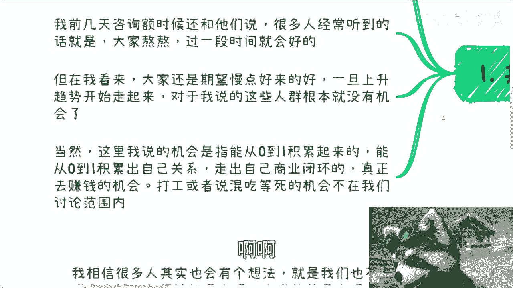
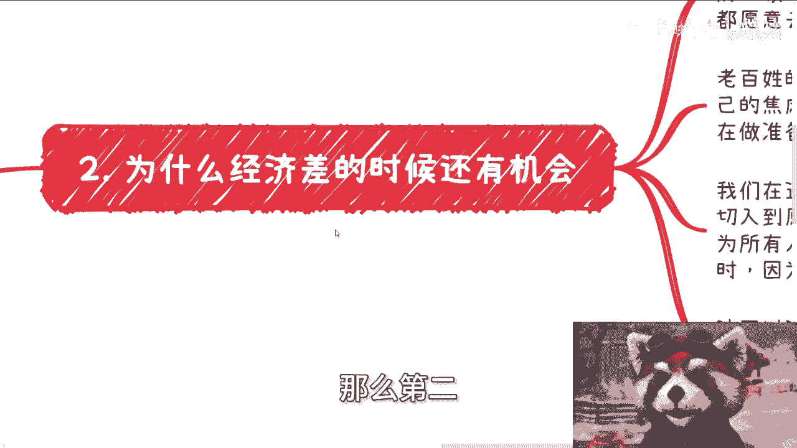
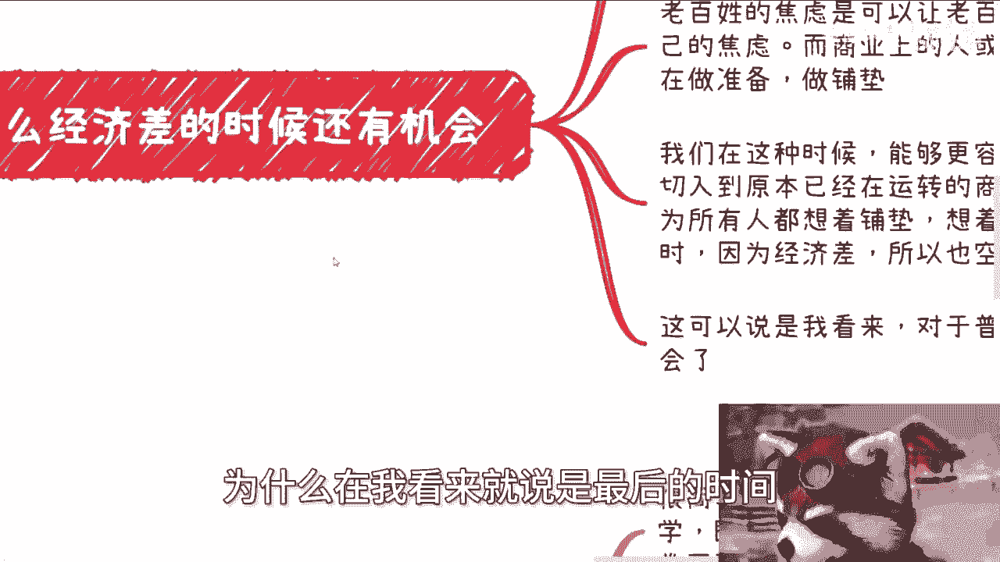
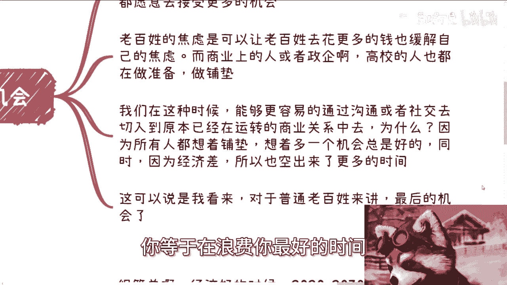
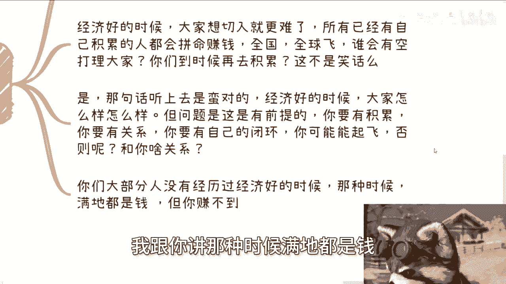
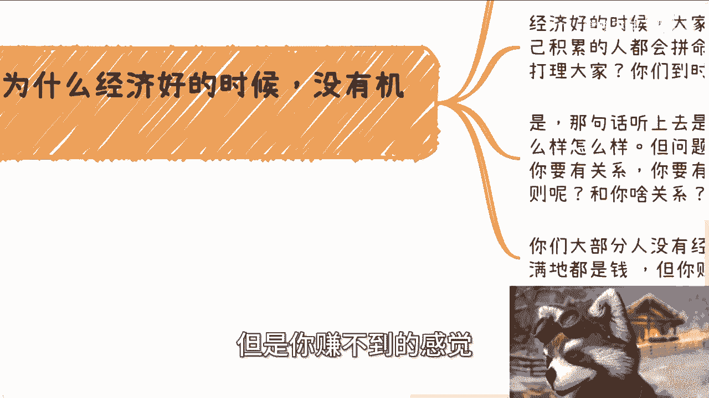
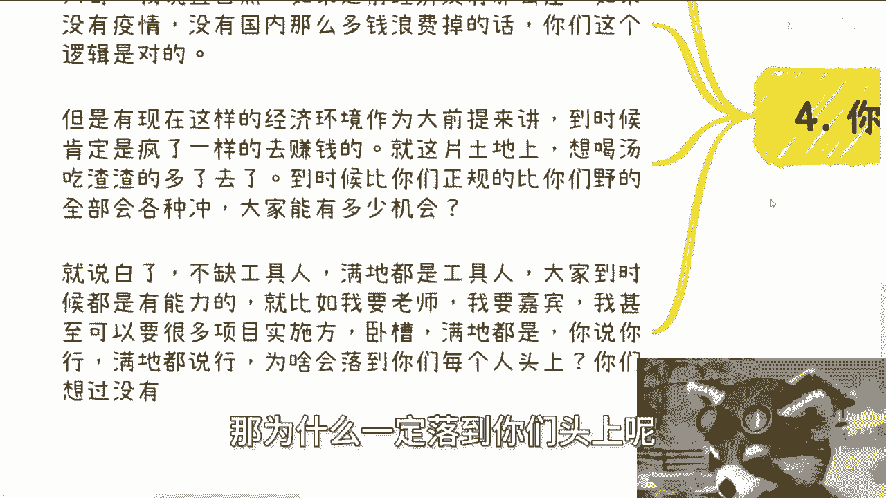

# 课程一：经济周期中的个人机遇 🎯


在本节课中，我们将探讨一个核心观点：**经济下行期对缺乏积累的个人而言，可能是建立自身商业闭环的最后窗口期；而经济一旦进入上升通道，这类人的机会将急剧减少**。我们将拆解其背后的逻辑，并提供清晰的行动思路。

---

## 概述：核心观点与目标人群

首先需要明确，这句话主要针对的是**没有积累、没有强关系、没有自身商业闭环**的群体。广义上，我认为从2020年至2030年毕业的许多人，都可能面临成为“消失的十年”中的炮灰的风险。

很多人常听到的安慰是“熬过去就会好”。但需要清醒认识到：即使经济整体向好，这种“好”也未必与你有关。对于上述群体，经济一旦确立上升趋势，反而可能意味着**丧失从零到一积累资本、关系和商业模式的最后机会**。

> 注：这里讨论的“机会”特指**创造财富和建立事业的机会**，不包括普通的打工或维持生计。



---



## 第一部分：为何经济差的时候还有机会？🤔

上一节我们界定了讨论的范围，本节中我们来看看，为什么经济不景气时反而存在机遇。

核心原因在于，经济下行期改变了社会各阶层的心态和行为模式，为新人切入创造了缝隙。

以下是几个关键点：




*   **时间充裕与心态开放**：经济差时，无论是普通民众、企业还是机构，赚钱的机会变少，因此大家普遍拥有更多空闲时间。同时，人们的心态不再那么激进和高傲，更愿意接触和尝试新的机会，为沟通与合作提供了可能。
*   **焦虑催生消费与需求**：老百姓的焦虑情绪会促使他们花钱寻求解决方案（如知识付费、技能提升、副业咨询等），这便创造了新的盈利点。企业和机构也会为未来做准备，有更多时间接收外部信息，寻求新的合作与铺垫。
*   **切入现有商业链条的窗口**：此时，通过社交、沟通或提供价值（哪怕是“画饼”），你更有可能切入那些原本稳固的商业关系中。因为所有人都想着“多一个机会总是好的”，戒备心降低，时间成本也变低。

**公式化总结**：
`个人机遇 ≈ (社会总焦虑 × 他人空闲时间) / 行业壁垒`
在经济下行期，分子增大而分母相对稳定或降低，因此机遇值上升。



---


## 第二部分：为何经济好的时候反而没机会？🚫

理解了经济差时的机遇逻辑后，我们再来分析其反面：为什么经济繁荣时，缺乏积累的群体机会渺茫。

原因很简单：上升期是存量竞争者的狂欢，而非新入场者的盛宴。

以下是具体分析：

1.  **竞争力断层**：以2020-2030年毕业的人群为例。在经济上行期，你们向上竞争不过有多年积累、手握资源和关系的前辈；向下则拼不过体力更充沛、起薪要求更低、更熟悉新时代玩法的年轻人。陷入“上下夹击”的困境。
2.  **注意力稀缺**：经济好时，遍地是赚钱的机会，所有人（尤其是已有积累者）都在全力狂奔，争夺红利。没有人会停下来，也没有人有耐心去帮助一个从零开始的陌生人。你想积累？会发现连门都找不到。
3.  **“喝汤”逻辑的破产**：许多人抱有幻想：“我不求大富大贵，经济好了跟着喝点汤就行”。但现实是，由于前些年资源的巨大消耗和疫情催化，下一个经济上升期，竞争会空前惨烈。无数人盯着那点“汤渣”，其中不乏技术更强、更肯拼命、甚至愿意短期免费干活以换取入场券的人。作为普通工具人，你凭什么认为机会会轮到你？



**核心结论**：经济上行是**兑现存量**的阶段，而非**创造增量**（对新人而言）的阶段。没有前置的积累，繁荣与你无关。



---


## 第三部分：给当代年轻人的行动启示 ⚡️


基于以上分析，我们可以得出对当前阶段（经济下行或震荡期）的行动指导。

最大的误区在于，许多人将这段宝贵的、竞争压力相对较小的“窗口期”，浪费在了错误的事情上。

以下是必须避免的陷阱和应该采取的行动：

*   **避免的陷阱**：将黄金时间全部投入“考公、考编、实习、常规工作”中，并美其名曰“先铺垫几年”。在经济差时做这些事，本质是在用你最宝贵的时间换取一份脆弱的稳定性，而完全放弃了构建自身商业闭环和关系网络的机遇。
*   **正确的行动**：应该利用当前人们时间多、心态开放的特点，全力进行**社交连接、价值展示、小规模商业试错**。目标是在这几年内，完成个人从0到1的原始积累，建立初步的商业认知和关系网络。




**代码式比喻**：
```python
if economic_cycle == "downturn":
    focus = "build_network() + test_business_model() + accumulate_capital()"
    # 核心是创建资产和连接
else: # 经济上行期
    focus = "leverage_assets() + scale_business()"
    # 核心是放大现有资产
# 如果你在 downturn 阶段没有执行 build 操作，那么在 upturn 阶段你将无资产可 leverage。
```

---


## 总结与服务信息

本节课我们一起学习了经济周期与个人机遇的深刻关系。**关键结论**是：对于缺乏积累的个体，经济下行期是构建自身根基的“战略窗口期”，应主动出击，积累资本与关系；而经济上行期则是已有玩家的收获季，新人若没有准备，将难有立足之地。

请用你的理性思考判断这个逻辑：在经济好时，一个既无资本、无关系、无独特闭环的个体，凭什么在激烈的存量竞争中分一杯羹？答案显然是否定的。因此，**当下的重点不是等待，而是创造**。


> **服务信息**：杭州线下活动已定于本周六（25号）在杭州东站附近举行。如需进行职业规划、商业规划、合同设计、商业计划书梳理，或希望借助外部视野厘清自身资源与方向，可通过私信报名咨询。