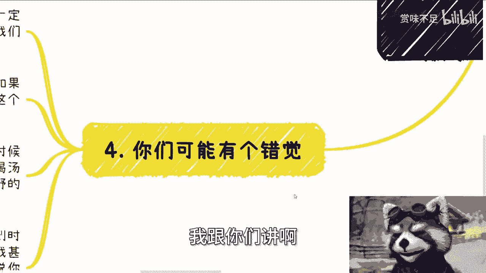

# 经济差的时候，大家还有机会。反之，可能毫无机会 - P1 - 赏味不足 - BV1Gi421Q7dM

好大家好啊，额首先啊今天这个主题啊叫做经济差的时候，大家还有机会啊，一旦上升毫无机会呃，我说实话我可能这是我的问题啊，我一直觉得这个事情大家其实都懂的，但我好像发现其实大家好像很多人都不懂啊。

就是很多人还是会觉得啊，这个经济上上升了对吧。

我们才有机会对吧呵，就真的哎反正你们听我说吧好吧，然后杭州活动已经定了好吧，本周六二十五号在杭州杭州站附近啊，详细内容报名，你们可以私信我，然后跟大家说个事啊，刚刚微信跟B站呢我同步拉黑了一个人啊。

蛮好玩的，就找我咨询啊，一开始就不付钱啊，我也没说啥啊，那因为他也有，我也跟他说了，我说微信跟支付宝都可以嘛，然后时间呢也还有几天，我想想也没啥事啊，然后到了时间呢跟我说换时间啊。

然后到了最后后面换的时间呢跟我说取消啊，我跟你们讲啊，技术这种人见一个拉黑一个，不要与人和废话一句，逼逼的都不要逼逼啊，别指望你们跟这种人能有合作，也不要指望赚这种人的钱，我跟你们讲。

这种人让他们全部去死啊，让他们全部去就滚滚开，从你们的生活当中全部离开掉去去，就不会影响你们任何赚钱的方式的啊，记住一点好，那么第一啊，其实这句话很好理解啊，什么意思。

首先这句话针对的用户群体是没有积累，没有关系，没有自己商业闭环的人，当然广义上来讲，我认为啊，至少我个人认为啊，2020年毕业到2030年毕业的，这段时间的人都是炮灰啊，也都是符合我们说的。

今天这个主题的这些人啊，会是消失的，这10年啊，我前几天咨询的时候，还和他们说，很多人经常听到的话是什么呢，大家熬啊，过段时间就会好的，我跟你讲好不好，也是大家好，也是别人好，跟你们没关系啊。

但在我看来啊，大家还是期望慢慢好起来的啊，一旦有上升趋势走起来呃，对于我说的这群人呢，其实根本就就丧失了最后的机会，当然啊，这里我说的最后机会是指能从0~1积累起来，能从0~1积累出自己的关系。

能从0~1走出自己的商业闭环，真正的去积累出赚钱的机会的这些人啊，啊这些机会啊。

那么打工或者说混吃等死的机会，不在我们讨论范围内啊，那么第二为什么说经济差的时候还有机会啊。

因为你们记住经济差的时候，老百姓都是焦虑的，所有的政企，所有的领导也都是焦虑的，然后大家其实相对来讲也没有这么激进啊，同时所有的人你不管他是谁，他都拥有更多的时间，为什么。

因为他没有这么多机会给他去赚钱，你明白吗啊，然后对于很多人来讲，他们相对也不会那么的高傲，也都会愿意去接受更多的机会啊，不管这个机会来自于谁啊，那么第二点，老百姓的焦虑呢。

是可以让老百姓花更多的钱去缓解焦虑，那么你们从而也更能从老百姓身上赚到钱，而商业上的人或者那些政企高校的人，也都会做准备，做铺垫，他们也都会有更多的时间，来接受外界的一些信息啊。

那么我们在这种时候能够更容易地通过沟通，通过社交，通过画饼，通过anyway，你们通过任何一种方式，能够有可能性，切到原本已经在运转的商业关系当中去，为什么，因为所有人都想铺垫，想着多一个机会总是好的。

同时因为经济差了，所以他也能空出来更多的时间。

什么意思，这也可以说在我看来啊，就是就为什么在我看来就说是最后的时间。

因为现在经济还在下降啊，你说是不是到底咱不知道，但他也不可能很快走一个上升趋势啊，那么这也就是一个当下最好的一个积累机会，如果啊你们把当下这种机会都放在什么考公啊，考编啊，实习啊，工作啊对吧。

包括有很多人跟我说什么爱称老师，我我先工作几年对吧，先熟悉熟悉铺垫铺垫再去怎么样，你想想看在铺垫个屁呀啊铺垫个屁啊，你等于在浪费你最好的时间再放在了工作上面。

真他妈就搞笑啊，真的叫搞笑啊。

然后第三为什么经济好的时候没有机会，很简单，因为经济好的时候，2020年到2030年，这10年的同学既积卷不过年纪大，有关系的，有商业积累的，又卷不过到时候的年轻的那一代，有用不啦，没有用的。

你们记你们，你你们想想看你们卷的过谁，对不对，就是朝下既拼不过体力，朝上也拼不过关系，就这么简单，就是消失的一带对吧，这已经板上钉钉的事情了对吧，然后经济好的时候，你们还想切入更难，为什么。

因为你后面会发，还发现满地的人都在那边拼命赚钱，不管是正规渠道还是不规不正规渠道，满地都是牛鬼蛇神，满地都在赚钱，全国全球的肥，谁他妈有空来搭理你们啊，你们到时候再去积累，这他妈不是笑话吗。

啊你们你们想想看，你们你们用你们的本书不得脑子想想看，是不是啊，另外啊，这句话听上去还有还有啊，就是很多人说这个经济好的时候对吧等等等，过两年经济好了，大家都会怎么样怎么样，这句话听上去是蛮对的。

但经济好的时候大家怎么样怎么样，但这个有个前提啊，就是你得有积累，你得有关系，你得有自己的闭环，你可能能起飞啊，否则呢那他妈他妈好不好，跟你有什么关系啊，啊你不要跟我说好不好，就是跟你有关系的是哦。

我我因为不好，我打工就是一年能赚个10万，我因为好了，一年能赚个20万，那你去吧，别别我们不要交流哦，你对我没有价值好吗，你你对我这辈子都没价值，你明白吗，你对你自己都没价值。

因为你就这点追求有什么价值呢，锁你就像一块木板在海洋里面，当大风大浪大浪来的时候，你就是任其拍打，你，你跟我说有什么价值，对不对，你们大部分人没有经历过经济好的时候，我跟你讲。

那种时候满地都是钱，但是就会有那种满地虽然都是钱，但是你赚不到的感觉。

你想想为什么对吧，第四啊，我跟你们讲啊。

你们可能有个错觉，我相信很多人其实会有个想法，就是我们一不一定一定要赚多大的钱哦，我们赚点小钱就可以了，经济好的时候，上升的趋势之后，我们能够吃点喝点汤。

吃点渣渣，我跟你讲啊，大哥大哥大姐啊，爷爷奶奶啊，我说直白一点啊，如果之前经济没有这么差，如果没有疫情，如果没有国内这么长时间浪费钱的话，你们这个逻辑是对的，没有错，但是我告诉你们。

现在正因为国内浪费了太多的钱，又由疫情作为一个催化剂，又由整个经济环境作为一个大前提来讲，到时候我跟你讲，所有TMD这些人，这些所谓有关系或者拼了命的人，都是疯了一样去赚钱的，就这片土地上，我跟你讲。

你想喝汤吃渣渣的人多了去了，轮得到你们吗，你们凭你们扪心自问一下，有多少人能拼技术拼得过你们，能有多少人也演得过你们这种人多了去了啊，大家作为一个普罗大众，你们觉得能有多大多少机会对吧。

就说白了中国满地都不缺工具人，满地都是工具人，大家到时候都是有能力的对啊，有能力的人多了去了，他甚至他妈可以可以可以就是说免费来打工，打白工，为什么，因为他知道有机会对吧，你就比如说我到时候要要老师。

要嘉宾，我甚至可以要很多项目实施方，几10万几10万，几百万的项目，我跟你讲，满地都是实实方啊，为什么，因为大家都想赚钱对吧，你说你行，满地都说行，那为什么一定要落到你们头上呢。

你们想过没有，就是唉。

就是就是你们想过没有，就是鸡汤可以听没有问题，而且你们大家现在过得苦也是苦的，所有人都很苦对吧，你像我们疫情几年基本上就没赚过钱，都是倒贴的，没有错呀，但是问题是问题是这鸡汤你不能喝啊。

就是你就是你喝没问题，你不能当真啊，你用你的本硕博的脑子思考一下，这逻辑通不通啊，不通啊对吧，就是如果对那些30多岁的没有积累的人，可能还好说一些，但对你们这一代年轻人来讲，你们是最苦的。

因为你们这在你们的黄金学习的时间，在你们黄金需要去积累的时间好啦，就不停的在工作公司里面打工，不停的在里面打工，就当工具人，然后还不在还不能还还还在外面，就说社交啊，各个方面积累还特别慢。

然后还被别人忽悠，就说啊，你们等等等几年经济好了，经济好了，跟你们他妈更没关系，懂吗能明白吗啊OK好吧，那个杭州报名的继续报名，然后呃职业规划，商业规划啊，合同分红分润啊，商业计划书啊。

包括你们手上有什么牌，你们手上没有什么牌或者什么牌都没有啊，你们希望通过跟我交流啊，通过我的视野，通过我的一些认知，能够给你们带来一些更好的未来，在方向上的规划也好，或者在未来做准备的一些规划也好。

