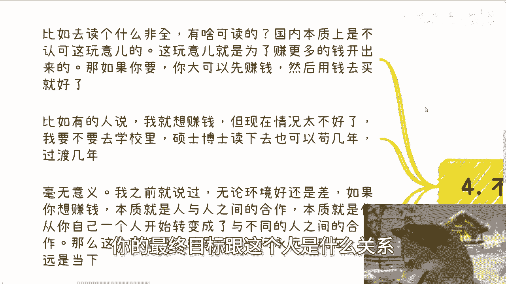

# 课程 P1：结合趋势，选择最适合自己的路径 🧭

在本节课中，我们将探讨如何结合当下的大环境，为自己做出最合适的选择。我们将分析几种常见的路径，并强调不存在“十全十美”的通用方案。核心在于理解自身情况，做出果断决策，并避免无意义的行动。

---

## 一、 不存在完美的通用选择

上一节我们明确了课程主题，本节中我们来看看一个核心前提：不存在一个对所有人都完美的选择。

当前存在多种常见的路径选择，例如：
*   全日制读硕/读博
*   非全日制读硕/读博
*   考公务员
*   本科毕业直接工作
*   专升本或专升硕

无论舆论如何鼓吹某种选择（如“所有人都该考公”或“必须读研”），其本质都是不成立的。原因在于：**没有一个选择能适配所有人的个人情况，并保证在未来任何环境下都表现良好**。决策公式可以概括为：
**有效决策 = 评估大环境 + 分析个人情况**
如果存在一个对所有人都“很好”的通用选择，这本身就不符合逻辑。

---

## 二、 “按部就班”路径的局限性

理解了选择的个性化本质后，一个常见的问题是：是否存在一套详细的、按步骤执行的行动指南？

答案是：可能有，但往往无效。假设存在一套人人照做就能赚钱的步骤，那么只可能对应两种情况：
1.  **风险极高**：可能涉及不合规操作，一旦出现问题后果严重。
2.  **收益极低**：例如一些无脑的重复性劳动（如数据标注、简单翻译），报酬微薄。

如果存在一种**低风险、高收益且可复制的“步骤”**，那么理论上所有人都能借此实现财务自由，这显然不现实。此外，任何有效的操作路径，在不同时代、不同性格的人身上都会产生“变种”。盲目追求“死执行”步骤，本身就违背了寻求进步和突破的初衷。

---

## 三、 如何根据自身情况做判断

既然没有通用指南，我们该如何判断？如果觉得第一节中列出的路径难以抉择，通常是因为被外界信息影响太久，或自身信息不透明。判断的关键在于评估自己的**执行力**。

以下是基于执行力强弱的路径分析：

### 如果你的执行力不强
对于执行力不强、判断力不足的人，尤其是在2024-2028年这个阶段，盲目折腾的风险很高，可能浪费时间甚至被骗。此时，**考公务员或攻读全日制学历**或许是更稳妥的“退而求其次”的选择。这并非最优解，但对部分人而言是可行的解法。

尤其对于既无应试天赋、执行力又弱的人，容易陷入“执行力弱 -> 信息差 -> 焦虑内耗”的恶性循环。宏观上只有两条路：
*   **彻底躺平**：停止内耗，接受现状。
*   **果断向外冲**：接受任何结果，停止纠结。

最糟糕的状态就是持续纠结却不行动。

### 如果你的执行力强
对于执行力强的人，核心是快速验证。你需要设定一个极短的周期（**半个月到两个月，最长不超过两个月**）去落地一件事。这件事可以基于你的资源、性格、兴趣。**关键是要看到有现金流进入的结果**，这是唯一的验证手段。

在当下环境想获得更高收益，必须**苛刻、果断、激进**。执行力强的人完全有能力同时推进多个方向（如边工作边学习），因此无需局限于单一选择。

---

## 四、 避免无意义的行动

在做任何决策前，必须反复问自己一个核心问题：**我做这件事到底能得到什么？** 你需要清楚这个“所得”与你的最终目标有何逻辑关联。

以“攻读非全日制学历”为例：
*   问：你读非全是为了什么？答：要一个证书/学历。
*   再问：这个证书/学历与你的最终目标（如赚钱、转行）有什么具体关系？逻辑能讲通吗？

如果讲不通，甚至不知道最终目标是什么，那这件事就不值得做。这就好比投资：你不会把钱投给一个连预期收益率都说不清的项目。那么，你为何要将时间和精力投入到一个结果不明的行动中呢？

---

## 课程总结

本节课中我们一起学习了如何在大趋势下做出个人选择。核心要点包括：
1.  不存在适合所有人的“完美”路径，决策需结合大环境与个人情况。
2.  迷信“按部就班”的教程往往无效，有效路径因人因时而异。
3.  根据自身**执行力**强弱选择路径：执行力弱可求稳，执行力强须快速验证并追求结果。
4.  行动前务必明确其与最终目标的逻辑关系，避免做无意义的事情。

希望本课能帮助你更清晰地思考自己的道路。对于职业规划、商业合作或相关法律问题（如合同、股权），建议整理好个人背景与具体问题后再进行深入探讨。