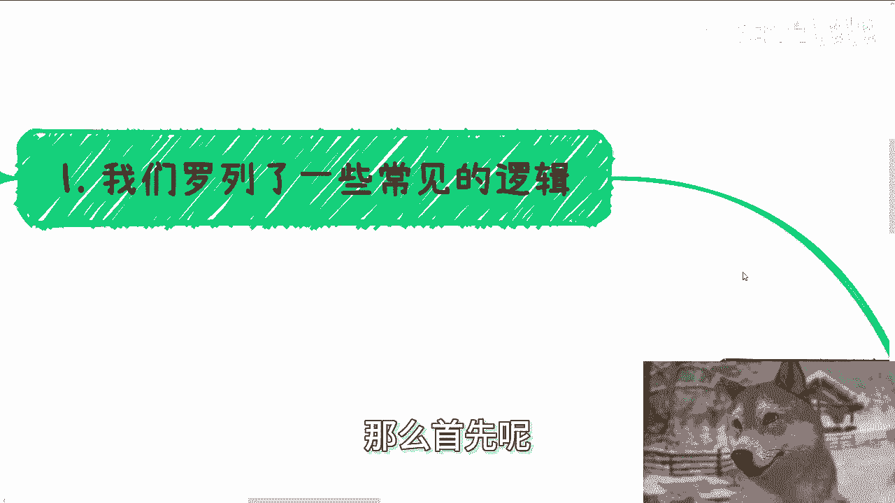
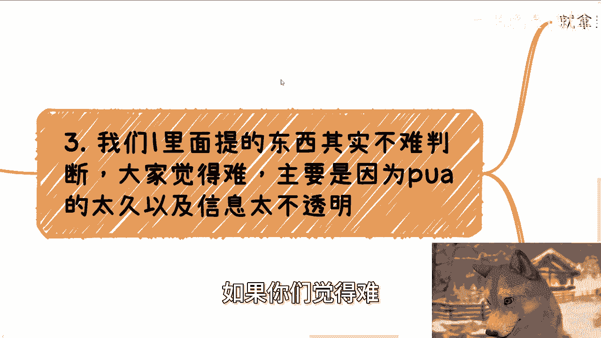

# 结合当下大趋势，选择最适合自己的，但肯定不是十全十美的 - P1 - 赏味不足 - BV1z2pnerEyc

啊大家好呃，今天我们来讲的这个主题啊，叫做结合当下的这个大局势啊，选择最适合自己的一种方式啊。

但是呢绝对不可能有那种十全十美的啊，那么首先呢我们罗列了一些常见的逻辑啊。

你这个常见逻辑可能也是啊，怎么说呢，就是就你们身边肯定会有啊，而且肯定很普遍对吧，比如说全日制的读硕读博啊，比如说非全日制的读硕读博对吧，比如说公务员啊，比如说现在本科毕业就去工作啊。

然后呢并行做学一个非全日制，比如说现在可能学历还低于本科的啊，那么可能会去呃专升本或者专升硕对吧，那么比如说家庭情况呢也不太好啊，现在呢很缺钱啊，尽快的呢想去做点赚钱的事情啊等等等等等。

这一切啊我们先客观的说啊，呃首先有一点以上这些以及啊，包括我没有提到过的啊，那么无论大面积舆论导向说哪个好哪个不好，本质都是不可能的对吧，就像大家说啊，我们现在都要去考公对吧，比如说大家都要去读硕读博。

原因是什么呢，说当下环境不好对吧，那么啊大面积的舆论都在导向说啊，这个好这个好，这个好啊，那么本质是不可能的，为什么，因为没有一个东西是针对所有的人的情况，以及在这种大环境下面说啊。

我们能够保证未来都好的对吧，那么因为本质上你做一个选择，一定是当下的大环境，结合你们每个人情况啊，你说今天他妈的有一个通用的一个很好的选择。

这他妈怎么可能呢，对不对啊，首先这第一个第二今天有个问题很有趣啊。

有人问我，他说创始有没有那种细节的啊，或者说这种建议和规划啊，就是说一步一步啊，就说一这这这这这就根据这个步骤，一步步去走的啊，我说有啊，肯定有啊啊我说我也可以跟你讲啊。

但是呢你从我内心来讲，我不想讲，为什么，主要是讲了没有用，因为我们假设啊，你们你们想想看，我们假设一步一步是有用的，那么按照我说的啊，或者你们按照别人说的，按照这个一步一步去走，真的能赚到钱。

那么这种情况只有两种可能性对吧，一种就是风险性极高，一种就是收益特别低对吧，因为你你你你要这么想啊，世界上任何一件事情他要有合理性啊，你你不能在在那边就天马行空啊，对不对，那么你比如说风险性极高的。

那么就是那种啊可能不太合规的啊，或者说呃这个这个风险性很高对吧，万一万一一旦被举报或者怎么样，你肯定得得进去牢底蹲，牢底坐穿对吧，或者呢就是那种完全无脑的，就跟你说啊，你比如说这边做做数据标注。

那边做做翻译对吧，以前有的你们有，我估计你们不知道，就是比如说10年前15年前有很多这种啊，就是什么呃，就是你就无脑做翻译啊，无脑就说整理文档对吧，干嘛的，反正有的就给你什么十几块钱，几十块钱的。

那如果啊不是我上面说的这些，那么中国的老百姓啊，就或者这么说，如果不是我上面说的这种样子啊，那么也就意味着，真的有那种一步一步能够赚到钱的，而且这钱还不少的，那今天中国老百姓早就财务自由了，对不对。

可能吗啦，那不可能啊，啊那么另外呢这种一步一步的操作呢，往往在每个人身上，每个不同的时代都会有不同的变种对吧，你就说今天的确有这么一个操作啊，打个比方的的确有这么一个十步或15部对吧，哎他的确能赚到钱。

他也的确能能能能拓展出来一些东西对吧，但是你比如说在不同的年代，在不同的这种叫什么，就是人身上不同的性格身上，他肯定会有不同的变化啊，而不是说你就说大家每个人啊，那这个不管性别不管啊，性格也不管时间。

对吧啊，你说完全的去死操作，死直死死执行，那这不本身就失去了我们在讨论。

在思考这个问题的一个一个初衷了吗，还有什么意义呢对吧，因为你之所以你从我来讲，你之所以会问我这个问题，是代表着你其实是想进步的对吧，你想赚钱的，你想有所突破的，但是你问出来这个问题本身。

又与你的这个初衷是相悖的，对不对啊，那么第三我们在一里面，就是我们刚刚这个地方写的什么专升本啊，吧叭叭叭的一堆啊，我们在一里面提的东西呢，其实本身并不难判断，如果你们觉得难。

主要就是因为被PUA的太久以及信息不太透明，你你为什么啊，你就拿当下来讲，你如果执行力不强哦，那么全日制考公必然就是最好的选择，因为你没别的选了，你能怎么办呢，嗯当然啊，你说实话是我家庭情况不好啊。

自己现在也没钱对吧，在我看来不好意思，那没办法，因为你真的出去折腾，你，执行力如果不强，判断力如果不行，当下这个时间阶段啊，额或者这么说吧，就24年到27年，28年这种时间阶段浪费时间倒是其次。

你能不出去不被人骗人，你能不被骗钱，我他妈已经谢天谢地了对吧，有的人要说了，他说陈老师你从来不支持考公对吧，包括全日制去卷学历或者怎么样子，是我是不支持，那怎么办呢对吧。

那人活着并不是任何事情都有解法的，那很多人都是无解呀，那你无解，你总不能不就不解吧对吧，那我只能退而求其次啊，那当然你可能会觉得哎这类人当中呢，可能也有非常大一大的一部分的比例的人。

他是没有那种应试教育的天赋，或者就是我们说没有那种呃这个读书的天赋的，对啊，就如我说的，我考不上清华，是我不想考吗，当然不是对吧，所以说尤其是这类人，就是如果你们读书也没有天赋，执行力也不强。

那我就跟你这么说，这么说啊，执行力不强会让你很难一步一个脚印往前去走，信息差会让你从开始从你走的那一步开始，就落后于别人，甚至就是说方向就不对，而综合以上我们说的这一切，又会让你很焦虑和内耗。

这三者就是个恶性循环，永远会会在你身上不停的出现，这种因果交替的一个关系，所以说本质上来讲啊，就是如果你的执行力不强，你的这个叫什么，就是学历又不高，那么在我看来，你就就是宏观来讲就两条路。

要么你就完全躺平，什么都别想你，你甚至不要内耗，就不想带，就就就就不要内耗对吧，你要么就索性就是往外冲啊，好结果坏结果，OK我们成年人我们都可以接受对吧，你最怕就是说啊，我执行力也不强啊。

我呢这个学历不高，然后在这边开始纠结啊，好纠结半天，哎你活一辈子有什么好纠结的呢，对不对啊，那么如果你实力强啊，那么我们就在这个地方说啊，按照半个月一个月最多不能超过两个月的时间。

你需要去落地落地什么都行，随便你啊，按照你身边的资源，按照你的性格，按照你的情况，按照你的兴趣都行，那为什么我们这我这个地方强调半个月，一个月不最多不能超过两个月，是因为你一定要看到结果。

你看不到结果就是浪费时间，这个结果就是要有现金流进来的，这就有现金流进来就是好的结果，这也是唯一的验证手段啊，那么每次我跟他们讲到这个东西时候，就有的人就会在那边说，他说啊，陈老师是不是时间太短了。

是不是太苛刻了，我说大哥2024年你要在社会上赚到钱，或者我们就这么说，你想成为一个拥有高性价比赚钱的，或者说就是就就相比你现在来讲呃，也能有更多财富的这么一个人的话，你不苛刻行吗对吧，你不果断行吗。

你不激进行吗，你有看到过哪个不激进，不果断，不苛刻的人，赚到过钱的，没有的，对吧，那有的人要问了，他说哎，但是陈老师执行执行力强，难道就非要做这些吗，难道不能去那个上去卷，你上面说的学历跟考公吗，对吧。

也不见得一定要卷赚钱啊，哎我跟你讲这句话是对的，但是为什么我不提，是因为真的执行力强的人，他他完完全全可以两边一起做啊，但两者不冲突啊，对不对，而且我相信执行力强的人，你不要说两个方向了。

他他妈四五个方向可以跟你一起做，所以我就我我都去说他干嘛呢对吧，第四不要去做一些无意义的事情，就是你比如说读个什么非全，你自欺欺人干嘛呢，有什么好读的啊，国内本质上其实就是不认可这玩意的。

这玩意的出现就是为了赚更多的钱对吧，那如果来说你非要要，那你大可以先赚钱，然后用钱去买嘛，对不对，你为什么一定要花个3年去赌呢，你妈吃饱了撑的对吧，那比如有的人要说了，他说我就想赚钱。

但是现在情况不太好，我要不要在学校里面，比如说读个硕士，读个博士，读下去可以苟个几年，过渡几年对吧，就就读几年对吧，毫无意义，为什么，因为我之前就说过，无论环境好还是环境差，如果你想赚钱。

它本质就是一个人与人之间的合作，本质就是你从自己一个人开始，转变成你与不同的人之间的合作，那么这个事情如果要开始，你如果已经确定了赚钱是你的目标，那么你最好开始的时间永远就是现在，永远就是当下。

你往后熬，有什么好熬，熬鹰啊啊有啥好熬的，没有意义的，你但凡这么个想法，在我看来你就不想赚钱对吧，那么做任何个事情，最后还有一点啊，就是做任何一个事情，你一定要问自己，多问自己几遍。

就是我做这件事情到底能得到什么，你如果不清楚，那你就去搞清楚，就是你得到的东西跟你的最终目标有什么关系，对吧，而不是说什么都不知道就去做，这个就是当下普罗大众最大的一个问题，你就拿我这边说的非全来讲。

你问他你读非全干嘛呢啊，我要个证书，我要学历好，那这个证书跟学历，跟你的最终目标有什么关系呢，你逻辑能讲得明白吗，我不说赚不赚钱啊，你逻辑能不能讲明白，能不能讲得通，如果你讲不通，那这个事情你就别做。

如果你甚至都不知道你的最终目标，跟这个东西是什么关系。

那你为什么还要做呢，对不对，啊我最近一直给他们举个例子啊，就是哎呀，回头我反正再再到时候再开个这个视频，给你们讲详细的吧，反正我最近都跟他们举个例子，就是我说我说嗯这个跟他们这么讲啊，他们都会跟我说。

我走一步看一步，那我说我说那那这样吧，你给我100万，你就当投资哦，我说你给我100万投资的时候，你是不是一定会问我，陈老师，你你每年的大概这个收益率多少，那我就我就回答你啊，不知道啊，对不对。

因为你们现在做事情就这个样子，我问你们，我说你读这东西干嘛，你不知道，那我也回答你不知道，那我就问你，当我回答你不知道的时候，你会投吗，不会那我就请问了你，那你既然不会投，你是个正常人。

那你为什么会去做那些你不知道结果的事情呢，哎奇了怪了，对不对啊行吧，那就这个内容反正就讲到这，你们可以在怎么说呢，我抛砖引玉嘛对吧，你们就仔细再想想看好吧，然后就是额职业规划啊，就是工作上面。

然后商业规划啊，包括你们做副业啊，跟别人合作啊对吧，在这上面在这上面啊，有任何问题或者有任何的，比如合同啊，股份啊，股权啊，期权啊，有任何的问题，你们啊可以整理好对应的个人问题和个人背景，好吧。

