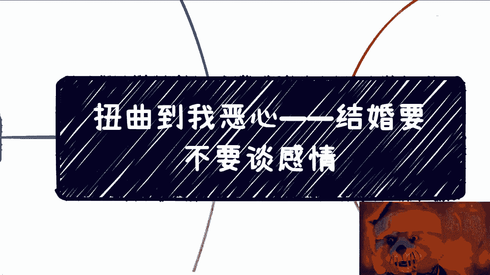
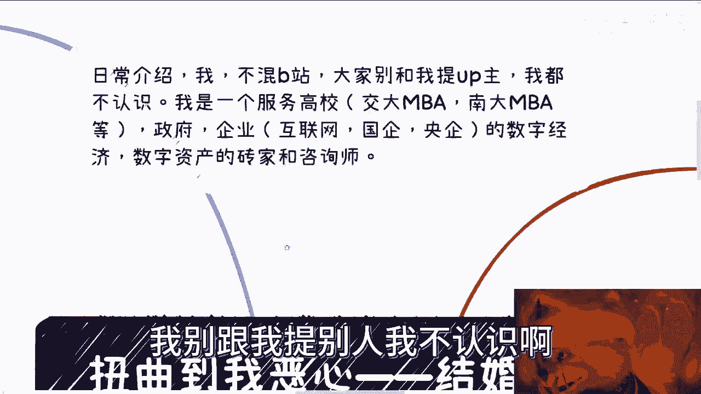
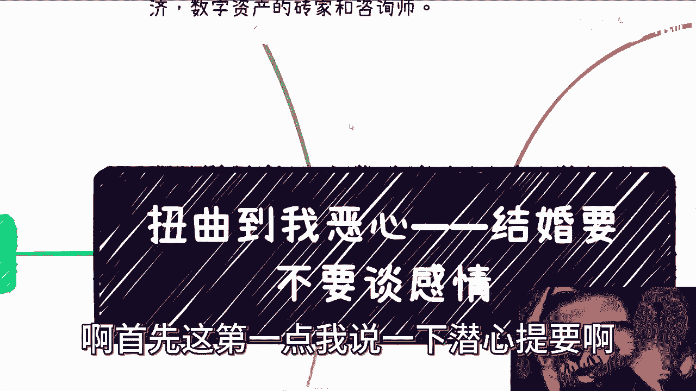
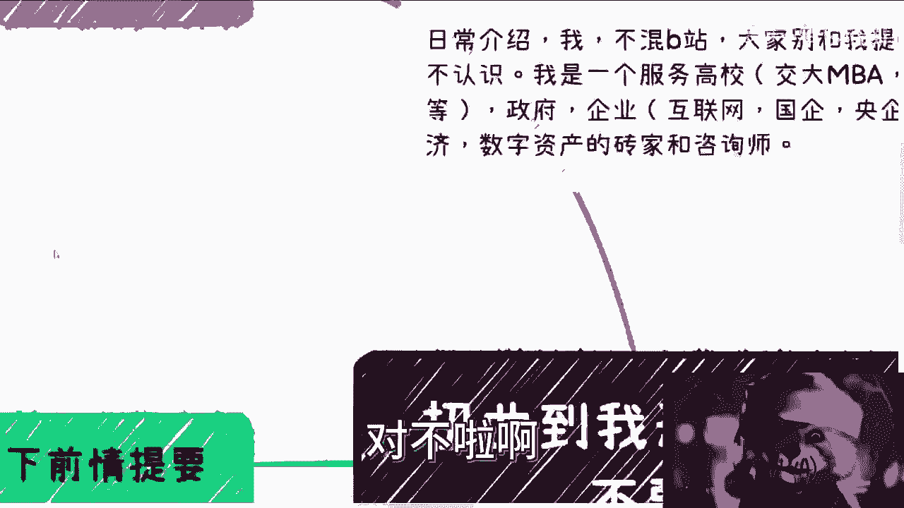
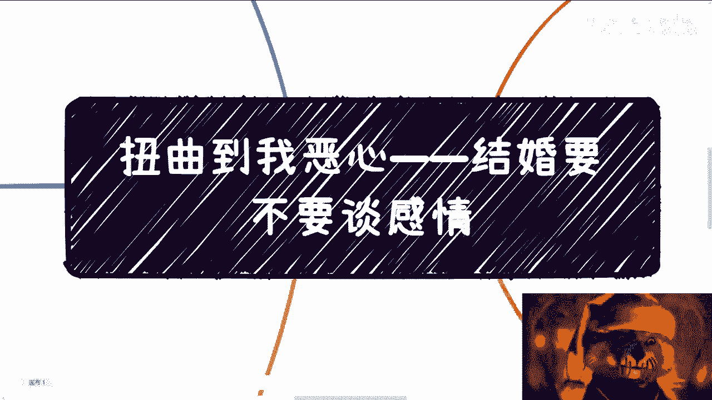

# 结婚到底是谈感情还是一场交易 - P1 - 赏味不足 - BV1gh411T7td

好大家好啊对吧，今天这个恶心到我了是吧，呃所以我就再来说一下这个问题啊。

正好接着我今天看到这个问题，首先我要强调一下啊。

就是说首先呢我不混b站，我也不混任何的别的地方，大家不用来跟我提，谁谁谁哪个up主我一个都不认识好吧，反正跟我也没什么关系啊，这个我表示呢我是一个服务高校对吧，不包括各个nba，然后政府省省厅局。

大数据局啊，什么版权局等各个地方啊，然后企业的话就互联网国企央企对吧，专门给他们做数字经济和数字资产单对吧，这个搬砖的专家跟咨询师啊，我别跟我提别人。

我不认识啊，也别在评论区刷别人，我不是很喜欢啊，首先这第一点我说一下前情提要啊。

前情提要呢很有可能是因为前两天呢，我做了一个结婚的视频啊，b站给我首页，今天早上推了一个啊某个大大大大up对吧，对于这个结婚的看法，卧槽一共就十分钟，看到我三观就碎了一地，你知道吗，就简直绝了。

你知道吗，就是从头到尾啊，各种各样一顿输出猛如虎啊，然后反正就是要说结婚一定就是一个交易啊，然后通过各种的例子啊，然后跟大家说啊，这个结婚是不谈感情的啊，各种各样的，就是我看下来我就感觉是什么呢。

就是说他讲了非常多的，这个世界上已经有的一些案例，三观还有舆论所产生出来的一些道理啊，然后呢他想告诉大家的啊，包括就是说我倒不是说他了，就是我觉得b站上，包括这个世界上很多人都是他输出的。

所有道理都好像要告诉别人对吧，整个世界从古至今给我们传输灌输的东西，就一定是对的，这莫名其妙吧，凭什么啊，凭什么就是对的啊，啊这这么个说法呢，结婚就是就是交易啊，就是大家是这个除了感情什么都谈。

那他妈他妈扯淡嘛，这不是在对啊，我说结婚不谈感情，你谈啥呢对吧，我跟你说，你谈啥，你谈男女对立吗对吧，还是说谈男性应该干什么，女性应该干什么，大家是不是先分好工对吧，谁做饭谁洗衣服，谁谁这我写的啥呀。

真的是哈哈哈哈对吧，谁谁管理谁保管对保管对吧，嗯谁保管对吧，谁这个管理这么一个钱财啊，再结婚是吗，你们是这样子的吗，啊对吧，这是第一种，还是说你谈家族产业，你有吗，谈家族产业啊。

还是说你结婚之前谈谈以后离婚了，财产怎么分，我跟你们讲啊，我之前还真有啊，还真有我朋友这个呃恋爱的对象啊，然后他们要谈婚论嫁了啊，然后那个男的呢就跟他说，他说这个他唉其实在我看来就是个妈宝男嘛。

啊就是个妈宝男，然后就在那边就说什么呢，就说他他妈不同意啊，他爸也不同意啊，反正就是搞得就是很不开心，那么啊不同意怎么办呢，对吧呃那要解也可以啊对吧，那就是要一开始签一个什么协议啊。

保保那个说了半天对吧，这个协议其实就是为了保证婚后财产，是自己的啊，不不被我朋友所有，我说那他妈的脑子有毛病嘛啊，想结就结不结鬼，对不对，有什么好弄的了，搞得家有几个钱一样的，怎么了呢。

有几个钱他妈了不起啊，果然这莫名其妙，真的是哎呀，我跟你们讲，骂他这种人多的是，是吧啊，然后我觉得这是一个，然后还有我跟你讲奇了怪了对吧，就是这个世界扭曲的越来越扭曲对吧，然后扭曲的呢还有非常多的歪理。

哎呦真的是，而且关键是什么，就是非常多的人呢还被这些外力pua了啊，那他还真觉得哎这个我谈恋爱可以对吧，我出去浪啊，没问题，但我我谈恋爱谈感情对吧，我结婚就不谈感情，牛逼对吧，我跟你们讲啊。

这个世界扭曲的地方多了去了，怎么了对吧，难道我们要把这些都当成一个default，就是一个默认的规则来看吧，肯定不是啊对吧，你比如说对吧，很多企业，很多市场对于大龄单身女性的歧视对吧。

现在他妈的到个27八三十，就他妈算大龄了对吧，单身女性其实怎么了呢，那很多女性你说我们就应该自卑吗对吗，难道应该接受这种歧视吗，能够默认再找工作或者写简历的时候，考虑进去吗，难道说低人一等吗。

当然不是啦对吧，那当然也有很多人，他说那他没办法对吧，市场就是这样子的，我们作为个体，我们是没有办法去去抗衡的，我们也没有办法去反驳对吧，是的，没毛病对吧，这就好像今天这个大的up主在那边说。

卧槽他妈的感情不用啊，结婚你们就谈交易对吧，你们双方把交易谈好，你们未来就很好过一样的，那怎么了呢，你要怎么过，你去过呀，跟我有什么关系呢，我们为什么要接受他这种思想，和他这种莫名其妙的价值观呢，对吧。

你你你说这种歧视女性前列年龄的也可以啊，对不对，我们不用抗争，我们也不要去反驳他，你爱歧视歧视你，你歧视你，你滚吧，对不对，我不找你，我他妈的别人公司不能找吗，世界这么大，怎么了，找不到了吗对吧。

我做什么不能做啊，有手有脚怎么了呢，还养不活自己了吗，对吧，我跟你们说，真的很多人会因为这种东西，不管是找工作还是谈恋爱，都会有那种自卑或者有那种低人一等的感觉，没有必要啊，是不是我跟你们讲。

这就像很多人，你知道吗，就是跟我说什么，他说陈老师我出去这个啊，这个认识人，他说我不知道怎么跟人家开口对吧，人家会不会看不起我或者怎么样，我跟你们说，这对面就算是马化腾，就算是这个叫比尔盖茨。

你们是个人，对方也是个人，怎么了呢，大家都是个人啊，他又不比你多条腿，你也不比他少条少个胳膊，怎么了呢，就正常沟通呀，我跟你们说，其实整个过程当中，不管你结婚也好，做别的事情好。

其实就是在寻找跟你价值观一样，或者能够认同你的，而不是说我们去跪舔别人啊，对不了，跪舔别人没有用的呀，你跪舔了人家不叼你的呀，是不是还有你，比如说社会对于35岁人群很不友好对吧，我今天刚发了一个微博。

说这个天通苑招聘对吧，写是写了就小于等于35岁，那怎么了呢啊我们就知道这个事情，我们就自暴自弃了啊，我们就不挣扎了啊，我们就认命了，可能了不可能的呀，对不了，那照这么个说法，如果我们我们叫什么。

就是遵循这么一个规则，那好了，35岁之后大家就会退休嘛，算了呀，那做什么工作了，是不是我跟你们讲，真的，现在就是这种网络状态，这种环境，就他妈的，一天到晚在传输一些莫名其妙的价值观，对吧，还有个什么。

就我以前在互联网的时候也是的，好多小姑娘对吧，开场就说哎呀，我是女孩子嘛对吧，所以我不适合做什么什么什么，我只适合做什么什么什么对吧，就真的就不知道到底是老师pv呢，还是家长pv还是怎么样。

我也不知道这些东西哪来的规定，都莫名其妙，你知道吗，对吧对吧，还有就是比如说什么护工啊，说只有女孩子合适啦，男孩子不合适啦，还有嘛就很多家庭没觉得什么孩子做计算机，就是在玩电脑，不无正业了。

就我我跟你们说啊，就是整个过程当中，不管你们现在多大，也不管你们父母多大，整个过程当中本来世界变化就很快，中国变化又很快对吧，你别说你们父母跟不上这个时代，我们自己都跟不上这个时代。

那他们的很多理念我们为什么要去follow他，为什么要去认可他呢，没有必要呀，对不对，当然我们也可以避免跟父母，或者跟其他人的一些一些什么冲突啊，但是你没有必要为这件事情去烦恼啊，去那个号啊，对不对啊。

还有我跟你们讲，还有很搞笑的对吧，我身边也有的什么，从小就要接受精英教育对吧，不能输在起跑线上，我跟你们讲啊，我身边有这种人的啊，从小就是什么私立学校对吧，然后要什么名牌对吧，穿名牌必须怎么样。

他妈高人一等对吧，全部体现在物质上，所谓的高人一等有卵用啊啊有卵用啊，我跟你们说，到现在后面年纪大了啊，后面就成人了，18岁20多岁，30多岁对吧，整个世界观，整个的个人判断，他妈像屎一样。

like 对吧，就你你跟我说他妈的精英教育有什么用，而且很多人他没有，你没有这个能力，就别去精英教育对吧，很多人是什么非要借钱对吧，非要非要就是说骗家里的钱，卖家里的房子，去做这种莫名其妙的经营教育。

你没有这种能力，你还去搞干嘛呢啊，就为了打肿脸充胖子，就为了这个扭曲的世界里面的这部分价值观，就为了让别人羡慕自己吗，有什么用了，没有用的呀，就这就跟我跟你们讲。

就是说很多人拿一个package拿了几百万，你就是图一时之快有什么用呢，对吧，我觉得啊我觉得啊，当代这个年轻人应该做的是什么呢，第一六亲不认对吧，什么父母亲戚，兄弟姐妹，他妈天王老子来了。

也他妈给我讲道理对吧，讲价值观至少来说跟我的跟正确的，我觉得一个正确的，一个正常人的价值观是同频的对吧，然后金钱商你要明算明算账，来p u a我来灌输，有的没的想法，别跟我说，你是我父母，你是我亲戚。

你是我兄弟姐妹对吧，多数都是来借钱的对吧，就是应该给的钱，给应该要的钱，要应该尽的需要进剩下的对吧，做到我们觉得应该做到的更多的，我觉得就不用做了对吧，就不要在自己感动自己了，更不要自己pua自己对吧。

这就好像很多人说哎呀，我父母希望我留在本地，哎我父母希望我去当个公务员，我父母希望我马上去去娶个媳，娶个媳妇对吧，然后呢，你就是为了满足你父母，然后很多东西你自己都还没明白，还没想清楚，还没怎么样呢。

就去干了，有用吗，没有用的呀，你可能会觉得卧槽他妈的老子老孝顺了对吧，老子他妈的哎老牛逼了，我自我感动一下，但是你开心吗，你不开心，对不了，你最终还是在那边内耗没有意义的呀，为什么就活不明白呢。

对不对对吧，我觉得作为一个2023年的新一代的年轻人，难道就非要一直走老路吗，没有必要呀，第二个就是思想独立对吧，你要为自己活着，别去为父母，别去为另外一半，别去为了除了自己以外的人活着。

没有意义的对吧，这句话怎么理解，不是说你们别人什么都不管，而是说你要去跟着你自己的心去做，你觉得哪些事情做的开心，你去做对吧，你觉得你愿意为你父母付出一点东西呢，给钱的你去给，对不对。

你为了你愿意为另外一半去做一些事情，付出时间的，你去付，对不对，你为了为别人活着，你去活没有问题的，但是你别不开心，你别内耗，你别双标对吧，就这么简单，你别又要既要对吧，到最后就抱怨抱怨天抱怨地对吧。

抱抱怨所有的东西没有意思的呀，对吧啊这个这个对吧，还有什么，还有就是我们可以接受舆论，我们也可以接受别人的观点，但是我们需要质疑一切，你知道吗，你要用自己的判断去思考，你自己觉得怎么样。

而不是永远是舆论，今天怎么说，然后别人怎么说，你突然就是哎呀随风摆啊，今天这样说好，他说的对，明天那样说好，他说的对，又用不了，没有用的呀对吧，然后我觉得当代年轻人还有一点是什么，就是断舍离啊。

不要过于纠结，没什么好纠结的啊，所有的事情啊，或者说我们不能一刀切嘛，大部分的事情都是早处理，找找好的，否则你就是在内耗，没有意义的，浪费的都是自己的时间，对吧好，那我们还是要总结一下。

总结就是这个结婚的问题对吧，你结婚肯定是要优先级，第一优先级是谈感情的，别的有什么好谈的，你没有感情，别的有什么好谈的啊，你要跟我说，你今天假结婚对吧，你为了做些什么事情，那是另外一回事，对不对啊。

这第一点第二点是很多人说，很多人在评论区也跟我讲，他说时间长了感情就淡了，我跟你讲这件事情没有毛病，你是个人，你时间长了，你感情都会淡的，但是你敢你淡的其实不是感情，是你的激情跟一部分热情。

但是你要明白，你沉淀下来的是一种真正亲人才有的感，情和爱情对吧，所以说你但不但重不重要，本质上不重要，重要的是，你们双方能够非常的就是说，不用一直质疑来质疑去，不用一直像敌人一样。

不用一直吵来吵去的那种信任和价值观相符的，才是最重要的对吧，那当然这两天评论区还有人跟我说，哎呀，现在找一个成那个那个正常人已经不容易了，对吧，你还要求这么高，唉我就觉得吧你就活一次。

你管现在正常人多不多，你管现在不正常，人多不多呢，找不到就不结嘛，怎么了，那一定要结吗，唉真是奇了怪了，真的是对吧，那你要将你要说现在正常人少了，你就随便找个人将就过，那是你的事情对吧。

但是我认为这种价值观是不可取的，就这么回事对吧，我还是那句话，你当下觉得都ok对吧，等你到了中年，等你老老了，你到时候看看o不ok是不是我跟你们说，这当中矛盾有的多了啊，真的有的多了。

任何鸡毛蒜皮的事情都能让你们吵，都能让你们闹，我就告诉我，就问你，一辈子有多长时间能让你来来折腾啊啊，你开开心心活着不好吗是吧，当然在对方还要提一点啊，就是说感情是第一位的，没毛病。

但是呢你为人三观等各种各样事情的为人处事，你也要去看的啊，也就是说你喜欢一个人。

你看明白这个人了，你再去谈结婚，否则你没有必要结干嘛，一定要结，对不对啊。

对吧，所以我觉得这个事情就是这样子的，就是现在现在啊，不管是短视频也好，还是各个平台，就他妈的说出各种神奇价值观，莫名其妙对吧，反正就是永远就是男权女权，然后男女对立对吧，反正就是他妈的不对立。

没有流量了啊，必须对立，你妈必须马哼对吧，你说我觉得啊是这样子的，如果你们现在还没有结婚，那我觉得我我希望你们能够自己明白，自己要什么，自己能够明白，就自己要有一个独立的价值观，如果你们已经为人父母了。

我也希望说你，你们不要让自己的孩子就活在这种短视频，活在这种莫名其妙的价值观的扭曲的世界当中，就这么简单，对不对，哪他妈那么多道理啊，哪哪他妈那么多那么多，应该干嘛应该干嘛，没有的，啊我就真的。

我有时候觉得觉得很多人都不像一个，2023年年轻人是吧，我我我反而像一个他妈的204几年，2059年穿越回来的，真的要有这种质疑一切的精神好吧，ok，行吧就这样吧，反正其他的啊其他的工作啊。

职业规划对未来的发展对吧，或者来说其他的什么赚钱对吧，各个方面啊，你们有自己想法的没有有，我不管你们有没有想法的啊，有想法没有想法的都整理好，你们可以找时间咨询我好吧，就这么回事，就这么简单。

