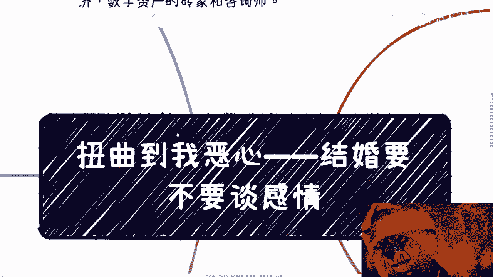

# 课程01：婚姻的本质探讨 - 感情与交易之争 🧠💍

在本节课中，我们将探讨一个备受争议的话题：婚姻的本质究竟是感情还是交易。我们将分析当前网络环境中流行的观点，并引导大家建立独立的思考方式。

## 概述

最近，网络上出现了一种观点，认为婚姻本质上是一场交易，感情在其中并不重要。这种观点通过列举大量社会案例和舆论现象，试图证明婚姻应优先考虑利益交换。本节课将对此进行深入剖析，并阐述为什么感情应是婚姻的首要基础。

## 个人立场声明

首先需要明确，我不参与任何网络社区或关注特定博主。我的工作主要服务于高校、政府机构及大型企业，专注于数字经济与数字资产领域的咨询工作。因此，我所表达的观点仅基于个人专业背景与价值观，与其他网络意见无关。

## 对流行观点的质疑

上一节我们明确了讨论的背景，本节中我们来看看引发争议的核心观点。该观点认为婚姻应完全排除感情，仅作为一场交易进行。这种论述引用了许多现有社会现象和普遍认知作为论据。

然而，这引发了一个根本性质疑：凭什么自古流传或普遍存在的观念就一定是正确的？婚姻若完全不谈感情，那应该谈论什么？

以下是几种常见的、被该观点纳入“交易”范畴的讨论方向：

*   **家庭分工谈判**：例如，谁负责做饭、洗衣、管理财务。
*   **财产与利益结合**：例如，谈论家族产业合并或联姻带来的利益。
*   **离婚预案**：例如，婚前协议完全侧重于离婚时的财产分割。

我曾亲眼见过朋友谈婚论嫁时，对方家庭因担心财产问题而要求签署婚前协议，其核心目的是确保婚后财产完全独立。这本质上是将婚姻关系预先置于防范和算计之中。

## 扭曲的价值观与个体选择

当前网络环境充斥着各种扭曲的价值观，许多人甚至被这些观点说服，认为“恋爱可以谈感情，但结婚必须谈交易”。这就像社会中对大龄单身女性或35岁以上求职者的歧视一样普遍。

面对这种环境，个体有两种选择：

1.  **被动接受**：认为市场规则或个人无法改变现状，从而接受这些价值观，并可能因此产生自卑感。
2.  **主动拒绝**：认识到这些是扭曲的规则，选择不与之对抗，但坚决不接纳，并转向寻找认同自己价值观的环境。

例如，面对就业年龄歧视，我们可以选择不认同这种规则，并相信世界广阔，总有地方重视能力而非年龄。人际交往也是如此，无论对方地位如何，平等沟通的基础在于彼此都是独立的个体。婚姻更是如此，其核心是寻找价值观契合、彼此认同的伴侣，而非单方面的妥协或“跪舔”。

## 建立独立人格与批判性思维

要抵御扭曲价值观的影响，关键在于培养独立的人格和批判性思维。我们生活在一个飞速变化的时代，上一代甚至我们自身的某些观念都可能迅速过时。

以下是几种需要警惕的、被普遍灌输却未必正确的观念：

*   **性别角色固化**：例如，“女孩不适合学理工科”、“男孩不该做护理工作”。
*   **盲目追求“精英教育”**：超出自身经济能力，为面子或虚荣心进行过度投资。
*   **为满足他人而活**：例如，因父母期望而选择不喜欢的职业、城市或婚姻。

作为当代年轻人，我们应该做到以下几点：

1.  **理性看待关系**：与家人亲友相处时，坚持基于道理和健康价值观的沟通。涉及金钱时界限分明，拒绝情感绑架或PUA。
2.  **思想独立，为自己而活**：行动的驱动力应是自己的内心意愿。愿意为父母、伴侣付出是基于爱，而非被迫或为了自我感动。避免陷入“既要…又要…”的抱怨循环。
3.  **质疑与批判**：可以倾听舆论和他人观点，但必须经过自己的独立思考与判断，不人云亦云。
4.  **果断断舍离**：对于消耗自身的大部分事情，尽早处理比纠结内耗更有价值。

## 回归婚姻的本质

现在，让我们回到最初的问题：婚姻到底是什么？

**总结来说，婚姻必须优先谈感情。** 没有感情作为基础，其他一切都无从谈起。当然，这里指的是以建立家庭为目的的婚姻，特殊情况（如策略性婚姻）除外。

针对“时间长了感情会变淡”的常见说法，需要厘清：随时间流逝而减淡的往往是**激情**，但沉淀下来的应是更为深厚的**亲情**与**爱情**。长期关系的关键在于**信任**和**价值观的持续契合**，而非始终保持热恋状态。

另外，有人认为“现在找到一个正常人都不容易，要求不能太高”。对此，需要明白：人生只有一次，找不到合适的人，**不结婚也是一种选择**。为了结婚而将就，未来很可能在无数琐事中消耗彼此，得不偿失。

最后必须强调，感情是第一位的，但**了解对方的为人、三观和处理事情的方式同样至关重要**。在看清一个人的本质之后，再决定是否与其共度一生，这才是负责任的态度。

## 总结

本节课我们一起探讨了婚姻中感情与交易的关系。我们剖析了将婚姻纯粹视为交易的流行观点，并指出其背后可能存在的价值观扭曲。我们强调了在信息爆炸的时代，保持独立思考、质疑精神以及为自己建立健康价值观的重要性。

对于婚姻，我们的结论是：**感情是基石，真诚的了解是前提，个人的独立判断是保障**。无论是面对婚姻还是生活中的其他选择，我们都应避免被扭曲的舆论所左右，勇敢地追寻自己内心认同的幸福之路。

---
**（注：本教程根据提供的视频内容整理，旨在提炼核心观点并进行结构化表述，保留了原话的核心含义，但删除了口语化语气词和重复表达，并按照要求进行了格式与逻辑优化。）**