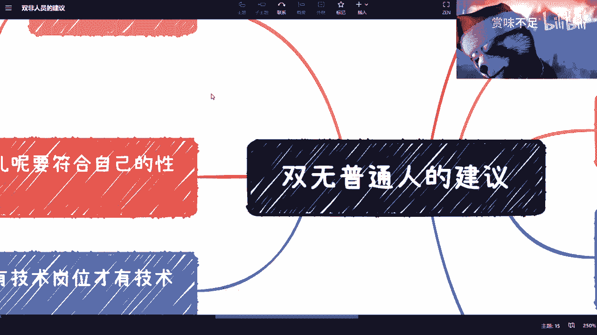
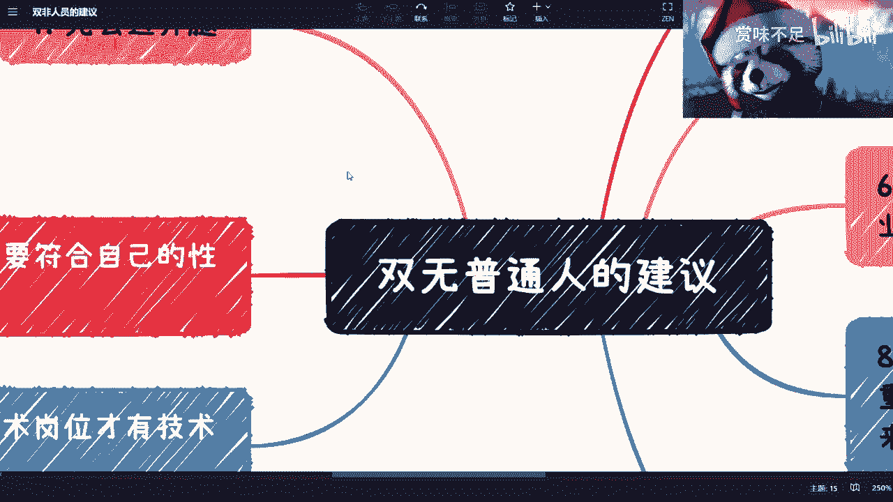
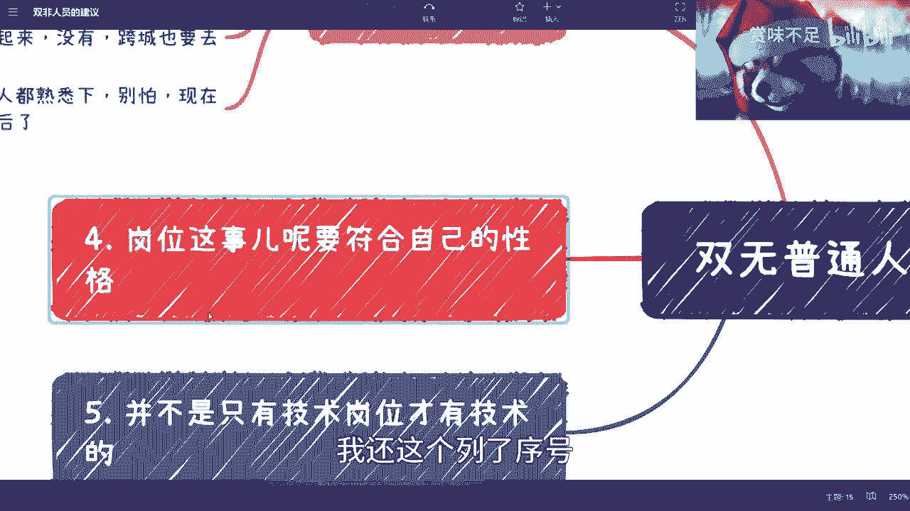
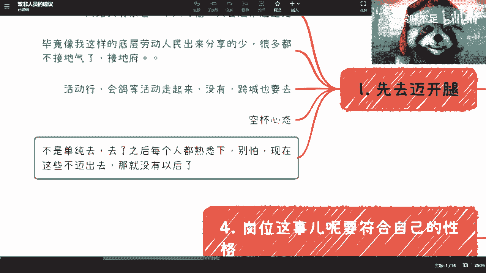
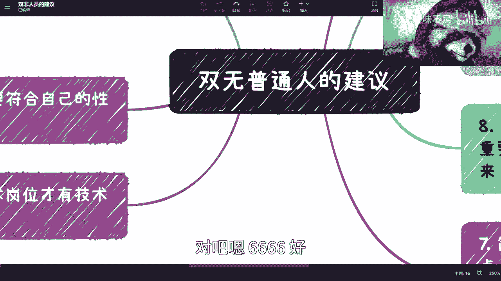
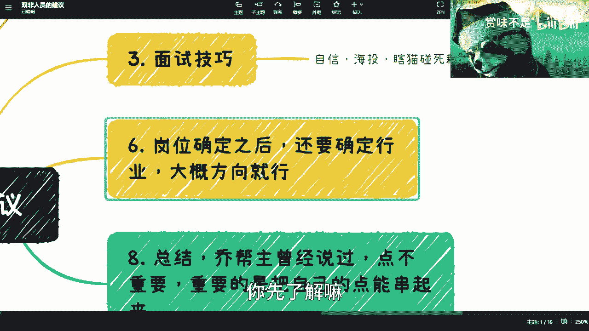
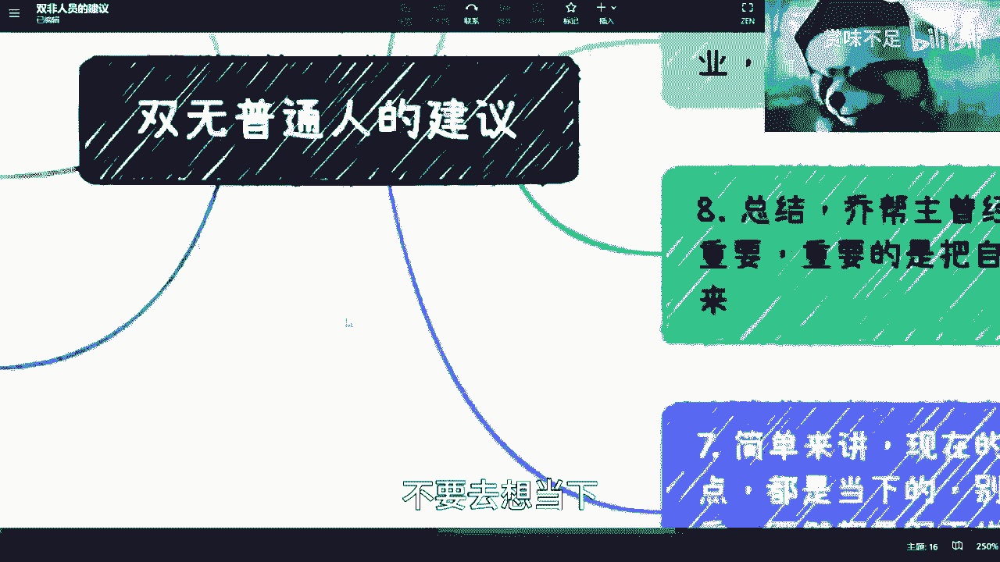

# 给没有高学历没有工作经验的小伙伴的手把手建议 - P1 - 赏味不足 - BV1ik4y187VJ

就刚刚啊刚刚我看了一下评论区。

或者说那个其实那个私信呢，其实蛮多人是说了这么一个点，他说三无对吧，他说双无就是什么呢，就是我可能就没有什么很好学习啊，也没有这个工作经验对吧，那怎么办啊，我想了一下也对啊也对，然后我就单独再说一下啊。

说一下就把这个建议我给大家总结说一下啊，就是这种前提是什么呢，前期就是说他觉得呢我可能去网上考呢，当下也不太合适对吧，因为花的时间比较长呃，你说我积累经验吧。

那可能也不一定马上找到工作对吧，就面临这种两难的情况啊。

我这边给大家列了一下啊，你看我为了方便啊，我还列了序号。

免得我说起来那个差点，我觉得第一个就是你先迈开腿啊，我包括我私信我回家也是这么说的，就是什么呢，就是呃你们单纯的去想这个东西是没有用的，因为你就会发现你越想这个东西，它就是条死路对吧，就你面前啊。

这左边就是我一直说的，就是你左手也没有，右手也没有对吧，那你那你怎么办呢对吧，那我觉得第一个呢，就是说你们不能不能完全去看，就网上的东西对吧，因为所有东西就是他们所有说的东西。

包括那个所有的那些产出内容，我不是说不对啊，但是所有人去讲一个东西，它都有前提的对吧，他都是有上下文的，但是呢你们是看这些内容的时候，就是你们是不知道上下文的，而且他们也不见得会跟你们讲。

那么这个时候呢就是你们所得到的这种信息呢，就比较的就是杂对吧，对你们来讲就是看上去稍等啊对吧，就看上去有有帮助，但其实没什么很大帮助对吧，这是第一个，第二个呢，就是毕竟像我这样这个劳动底层人民出来。

分享的还是少是吧，就是嗯很多都不接地气，接地府是吧，所以我觉得呢，就是就是听上去很多内容都很有道理，但是你得有实操的可能性是吧，然后呢我说这个迈开腿呢，就是说那个活动就我这边列了一下活动行啊，会哥啊。

这种平台很多很多，当然有还有很多我可能不知道啊，大家可以自己去查对吧，你要跟我说，你在一个县城里面实在没有呢，我是觉得就是所有的东西都是要有投入，才有产出的对吧，你也不能说我完全白嫖是吧。

那毕竟像我这种在网上被白嫖的也比较少是吧，那我说你实在没有，那就跨城对吧，你你不要这个在乎那几几张火车票的钱对吧，这个你先去啊，不会没有收获的对吧，因为你啊就是哎我觉得这个地方我还得提一点，就是什么呢。

你得你得那个你得有一个空杯心态对吧，就我跟你讲，你不管是谁诶，为什么我这边的颜色都不一样啊，啊就是就是不管是谁啊，你得抱有这种心态，你不要就是说啊就是就是可能自我嘲讽一下，说哎我可能这高不成低不就的吧。

或者眼高手低对吧，这种话没有用的好吧，就是你就把保持好这个平常的心态对吧，然后去接受所有东西，还有呢就是你去了之后呢，你不能单纯的去对吧，去了之后每个人都要熟悉，然后你每个人都要都要就说去交流啊。

去了解你，尽可能就问我跟你讲，你不用去担心，你现在这些如果都卖不出去，我跟你说，你以后真的就就就就这个，我真的就觉得就就以后就别谈了，你知道吧啊这是第一个第二个A2呢。

二对二是这样子的啊，就是说啊在这个上面呢，我得跟你们讲啊，就是增加自己的这个价值呢，并不是只有学历和这个呃工作经验的啊，就是什么意思呢，我给你们举个例子啊，就比如说就比如说你们今天啊。

我给你们举一些实际例子，就比如说你们今天这个跟某某某对吧，一起合出了一本书，啊对吧，然后有人又要跟我说了，他说普通人怎么出啊，哎呀我跟你们讲出没有什么难度好吗，你这你们只不过就是找一些高大上的这种。

这个出版社出难出啊，你找一些野鸡出版社有什么难处的，对不对，那这是第一个，第二个是什么呢，你比如说哎你自己举办了一些活动对吧，哎呀举办活动也没什么难度的，互联网现在这么发达，对不来了，你随便弄一些对吧。

你哪怕我跟你们这么说，我毕业的时候对吧，我什么都不懂，那我就自己去搞些活动，然后呢我就跟大家说对吧，我说不是我来给大家分享的，我说我就是组个局对吧，大家相互交流一下，有什么不行呢对吧，那第三是什么呢。

就是你也可以做一些，就是这种就像我现在做的这种，就是你你可以做一些分享，那说的对不对，没关系啊对吧，那大家喷你也没关系啊，你你也是这种学习嘛对吧，就是你会发现啊，就是本质上你就要告诉对方。

你的价值在什么地方，但你的价值是什么呢，是你到底做过哪些事情，对不对，那又不是说哦，我我难道啊我没有学历啊，我也没有工作经验啊，我就没价值了，那不是啊是吧，所以说你们可以要从这个上面去思考。

就是你去面试或者去跟别人沟通的时候，你一定要跟别人阐述的是，你的价值在什么地方对吧，当然你不能一开始就觉得啊我不行对吧，我这个阿姨既没有又没有，那不行对吧。

你要你要还是要有一定自信的啊，第三点呢就是这个面试技巧。

哎当然啊这个二我再补充一下啊，我只是举个例子啊，就不要到时候就是跟又跟我说什么，哎呀书啊对吧，这个这个什么活动啊，这种我只是举个例子啊，能在增加你们价值多了对吧，你比如说开发去写，去去弄个开源代码对吧。

自己跑跑也是有价值的对吧，你你你你做设计的，你随便做两个两个产品对吧啊做做两个设计，然后你往上到处发发对吧，然后看看大家给你反馈，那也是有价值的，对不对，你简历总要包装的嘛，是不是啊。

然后这个是第二个，第三个呢就是你面试还是要有技巧的，你不要盲目的去，就觉得哎我面不上对吧，或者说我没有工作经验，我我我还没面呢，我已经处于一个这个气场弱势了对吧，我觉得没必要，就面试还是有技巧的。

你首先要自信对吧，然后海投对吧，然后你要坚信这个瞎猫碰到死耗子对吧，这个哎呀，我跟你讲，这种东西就是个就是哎这种东西就是个什么，就是一个就是运气再加概率问题对吧，你今天面一家那个面不上你。

你就你一个月面个五六十家对吧，投个五六，投个五六百加那10%的比例去那个对不对，那当然我觉得有很多人又要说了，他说哎我没有，我投过去都是石沉大海，我跟你们说石沉大海主要是什么，主要是别人人都还没看到。

你们就石沉大海，那说明你们简历写的不行对吧，那你说没什么可以写，那我告诉你们没有什么东西不能没有什么东西，是不是没有什么可写的，而是你们就是包装的不行，你知道吧，哎呀就是就是怎么说呢，就是说。

就是你们得要虚实结合对吧，五五开目标是先有机会面试人去了再说对吧，你说你现在我不是教教大家不好，就是你简历就踏踏实实写，写了呢，又没有人找你。

那我说难听点，这简历写的有什么用啊，对吧啊，然后四呢啊四，然后呢，你再接下来就是就是关于这个选岗位的事啊，岗位这个事呢你一定要符合符合自己性格对吧，还是本科强，就是思维啊是左脑发达，右脑发达对吧。

你觉得就是说找，那就就一开始你总归得找一个符合自己性格的，你是开朗开朗的还是内向的，还是喜欢打交道，不喜欢打交道的，你先从这方面去想对吧，你你想这个事情的时候呢，而且就是说千万不要去想当下。

你想就是说啊我要做这个事儿对吧，我我比如说做个5年十年，我愿不愿意对你去想想看啊，当然这个事情也不是今天晚上你在那边打坐。

就能想出来的，你可以结合我刚刚说的，你一边迈开腿对吧，一一边去思考这个问题对吧。

然后第五个呢就是说一定要明白这件事情，就是什么叫技术啊，什么叫技术，你们想想看啊，并不是只有所谓的开发岗和技术岗，才叫技术对吧，那那我那你们自己想想看嘛，就是现在做直播的对吧，做做抖音的。

做做这种跨境电商的，做很多商业模式的对吧，那那那你们想啊，所有的那种这个这个叫什么商业闭环赚钱的，盈利的模式对吧，产品模式，那那些难道不是技术吗，哦只有开发这种才叫技术吗对吧。

就是千万不要去觉得比如说市场啊，运营啊，销售啊对吧，包括就是说呃可能呃做一些什么咨询啊对吧，research啊啊，然后嗯做那种报告的等等等都没有技术含量，我给你们讲所有点都有技术含量。

而且真正所谓有技术的，我跟你们说，在市场上面，我之前其实呃诶哪一期视频啊，就是我记得我之前讲过的，其实本质上所谓技术是什么，就是要让对方觉得你能给他赚到钱，我不管是直接赚到还是间接赚到。

你就是有技术的对吧。

你还开发不开发，千万别拘泥于这件事情。

对吧嗯6666好，那你岗位确定之后呢，你就要你还要去想什么，就是行业，你知道吧，岗位是没有用的，因为你今天跟我说，你要做销售，那按这个东西太广了对吧，你跟我说你要做互联网不靠，那也太广了，没有意义。

你知道吗，你还是要去确定大概方向，所谓大概方向是什么呢，就比如说你是打比方，你是要去做呃，社交软件了，还是金融行业呢，还是游戏行业呢，还有医疗行业呢，还是教育行业呢对吧，还有什么行业。

那每个行业里面你要去想的，我我我我这个这个客户对吧，就是你要赚钱呢，对吧，你要赚钱吗，那给你付钱的那些人为什么要付，付钱的人是谁，他们是这个这个普罗大众呢，还是说是政府呢，还是说是企业呢对吧。

你得去把这些东西想清楚，当然你说我不懂对吧，我一开始想不清楚，那你想不清楚，你可以先去了解对吧，因为你想不清楚的原因是因为你不了解，你先去了解对吧，然后你想想你再去思考说啊。

我到底是比如说做这种私域流量比较在行对吧，还是说我就是就觉得哎，企业这种合作模式比较合适，我对吧，我也有那个不错的小伙伴，也能够帮我把把控这个方向对吧啊，然后呢你比如说你说这些我都够不上，那怎么办呢。

那你们到那个各个城市各行各业，因为每个城市各行各业都有协会商会对吧，协会商会其实是一个承上启下的这么一个组织，去没关系，去抱大腿啊对吧，那这些又不是什么什么什么叫什么，就是就大家都是中国人是吧。

都在一片土地上面，你你去寻求帮助，别人不会拒绝你的对吧，最多就是说最后这个合作不合作对吧，大家可能觉得你那个赚不到钱不合作，那无所谓，但是人家在就是大家这种一开始寻求合作啊。

也不是寻求合作学习所了解的时候，不会拒绝你的，我我在上海这边很多协会，我每次去都是满地都是咨询的人啊，就是我不是说去做咨询的，就是过来寻求帮助的，关系不大大啊。

你先了解嘛，对不对，那这是六七呢啊七就是简单来讲对吧。

现在我跟你们说啊，所有的东西你们去思考这个问题的时候呢。

不要去想当下，你想当下是没有用的，你知道吗，因为当下就是你手上已经是这个牌了，那你再去想有什么用呢，对吧你你不要去看这么重，因为你从未来比如说5年后回过头看今天，这种都是不值一提的，你知道吗。

但是没没什么这个大不了的啊，所以说呢就是说我跟你们说总结啊，总结就是老乔啊对吧，这个乔布斯以前曾经说过啊，就是他在MIT那个那个那个那个叫什么，毕业典礼上面吧，其实说过就是说我跟你们说啊。

点这个点时间是不重要的，什么意思呢，就比如说我举个例子，比如说你今天对吧，做的是设计啊，明天去买茶叶蛋对吧，后天去做什么什么社交对吧，呃比如说大后天做游戏啊，我跟你讲这些都不是问题。

你可能在当时每个点的时候，你都会啊自自我这个这个叫什么，就是这个悲观对吧，或者说是自我指责对吧，我要这个这个这个这个感觉没有希望了对吧，或者怎么样啊，因为为什么，因为你总感觉你没有积累。

你总感觉你在换行业，你总感觉你可能不稳定，你知道吗，但是问题在哪里，问题是在当下整个的这个大环境里面，稳定本来就是一个奢望，你先不要用一个完全不切实际的一个东西，套到一个我们这种普通人身上，对不对。

首先是底一年，所以你就不要就是说，因为一种不切实际的东西去悲伤，其实没有意义的对吧，这是第一点，第二点是这些点不重要，重要的是如果你未来比如说5年后，10年后，你有某一天你有本事把你卖茶叶蛋对吧。

做设计对吧，做游戏对吧，做社交这四件事情是串起来，我不管你是怎么串的对吧，你有本事把你的东西能串起来，那你就是最牛逼的，你知道吧，那当然啊就是这件事情的点，我我重申一下，这件事情的点。

并不是因为说希望大家在现在就是比如说啊，这个你你东东晃西晃对吧，无所谓啊，未来你要把它串起来，并不是它的重要的这个point是什么，重要的这个切入点是说你现在做的所有事情，你一定要去想好。

你一开始就得思考好，就是说我在未来这件事情取其精华，去其糟粕，可能哪些方面是我未来用得到的对吧，你不要说我现在什么思考都没有对吧，我就去看着眼前啊，我就这一份工作先做了啊。

这这里有份有个有个有个有个研究生，我就先读了对吧，那么你现在不去思考你未来的这些东西，如果串不起来，那其实是没有用的，对吧啊，所以就是说所有的东西，你一定要一开始就去想啊，当然我最后再提一点啊。

就是你会觉得你老师就是我让你们去想，你们想不出来，想不出来的原因就是不够了解，不够了解的原因就是因为你们没有迈开腿，你知道吗，就回到一，你知道吗，就是别老师在网上去看来看去没啥用的啊，没啥用的好吧。

行就这么着呗。

