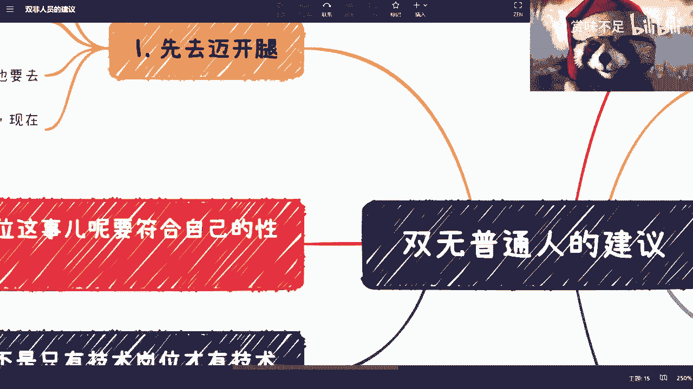

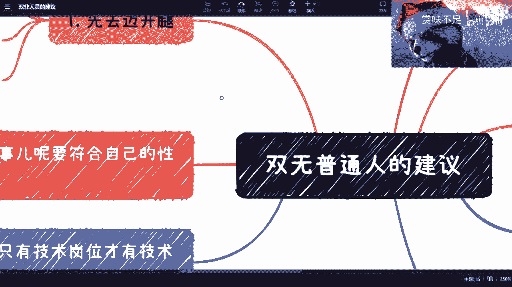

# 职业起步指南：给“双无”伙伴的七点建议 🚀

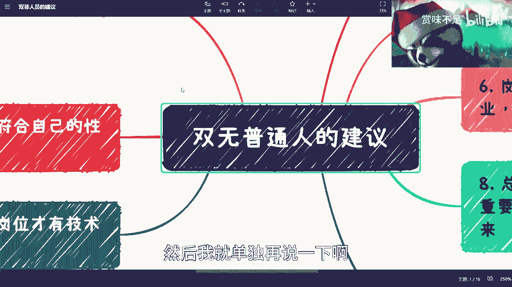

在本节课中，我们将为那些没有高学历和正式工作经验的“双无”伙伴，提供一套清晰、可操作的职业起步建议。课程将围绕七个核心步骤展开，帮助你打破僵局，找到属于自己的发展路径。

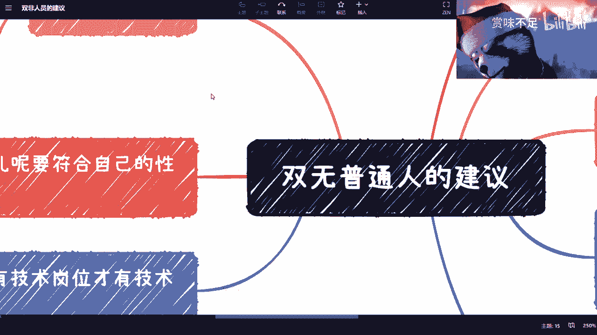

---

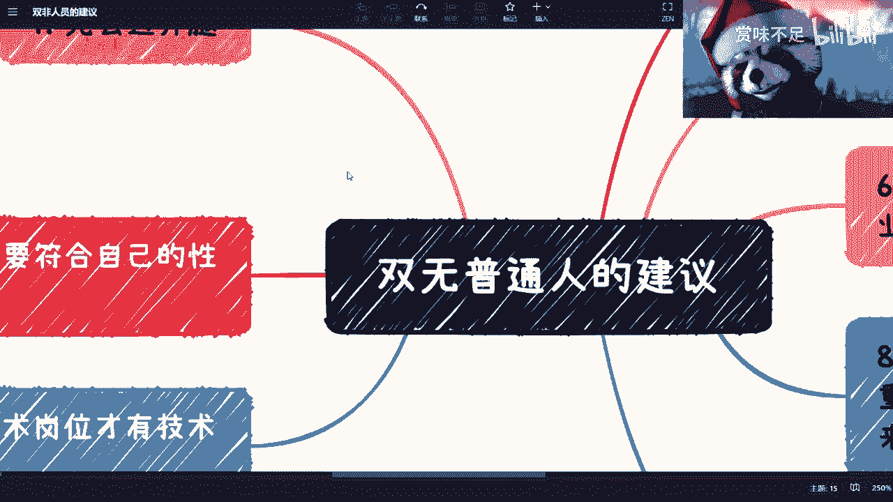

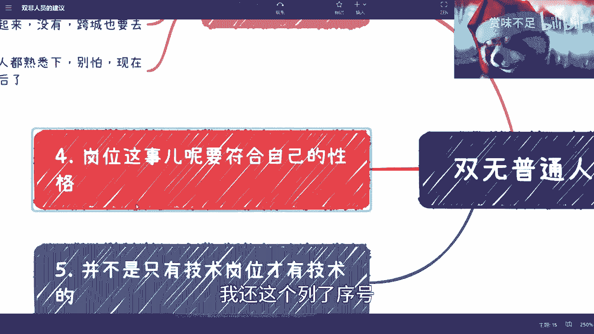

## 第一步：迈开腿，走出信息茧房 🚶‍♂️

上一节我们介绍了课程的整体框架，本节中我们来看看如何迈出第一步。单纯空想无法解决问题，反而容易陷入死胡同。网络信息虽然丰富，但大多缺乏具体上下文，对“双无”状态的你而言，可能显得杂乱且不接地气。

以下是行动建议：

*   **参与线下活动**：主动参加“活动行”、“会鸽”等平台组织的行业交流、沙龙或分享会。
*   **跨城交流**：如果本地资源匮乏，不要吝啬交通成本，尝试前往邻近的大城市参与活动。
*   **保持空杯心态**：放下“高不成低不就”或“眼高手低”的自我设限，以开放、平常的心态去接触新事物、认识新朋友。
*   **积极交流**：在活动中主动与人沟通、了解行业信息。如果连这一步都难以迈出，后续发展将更加困难。

---

## 第二步：重新定义并展示你的价值 💎

上一节我们强调了行动的重要性，本节中我们来看看如何构建自己的价值。个人价值并不仅限于学历和工作经验。关键在于，你能否向他人（如面试官）清晰阐述你**做过什么**以及**能带来什么价值**。

以下是一些增加个人价值的途径举例：

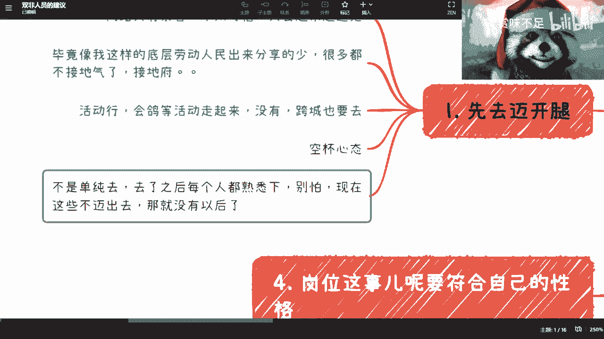

*   **合作出书**：寻找合适的出版社（不一定是顶级出版社），参与合著书籍。
*   **组织活动**：利用互联网发起并组织小型交流活动，扮演组织者和连接者的角色。
*   **进行分享**：像本课程一样，尝试在公开平台分享你的见解，在交流中学习和成长。
*   **积累作品**：开发者可以贡献开源代码，设计师可以发布设计作品集，运营者可以分析案例。核心是**包装你的经历**，虚实结合，目标是获得面试机会。

**核心公式**：`个人价值 = 可展示的成果 + 清晰的阐述能力`

---

## 第三步：掌握面试技巧，主动出击 🎯

上一节我们讨论了如何构建价值，本节中我们来看看如何将价值“卖”出去。面试需要技巧和策略，不要因自身背景而预先处于气场弱势。

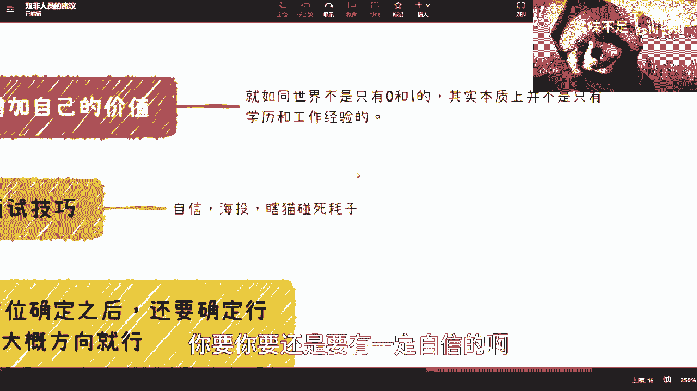

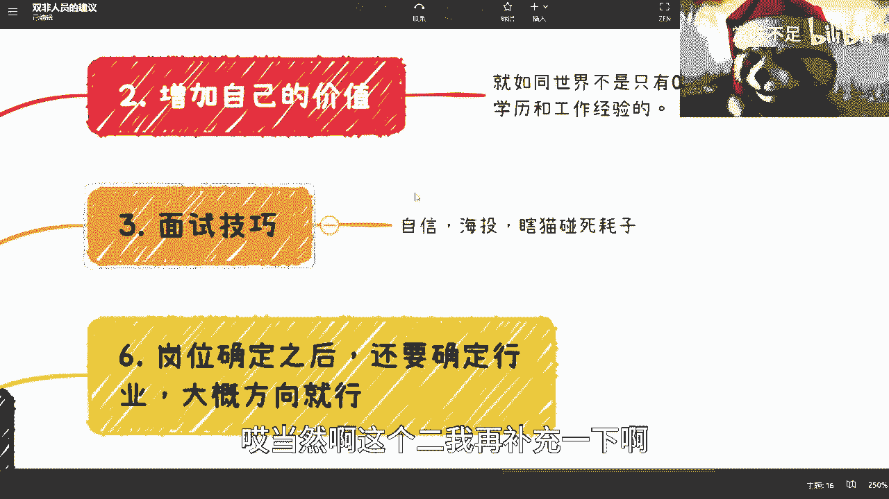

以下是面试关键点：

*   **建立自信**：相信自己的潜在价值。
*   **海量投递**：增加基数以提高成功率。`面试机会 ≈ 投递数量 × 简历匹配度`。
*   **优化简历**：如果投递后石沉大海，问题往往出在简历无法吸引HR。务必对经历进行有效包装，目标是获得面试机会。
*   **目标导向**：先争取到面对面交流的机会，再充分展示自己。

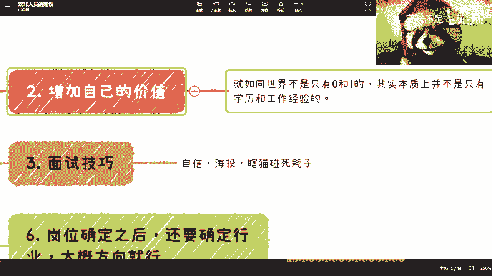

---

## 第四步：根据性格选择起步岗位 🧩

上一节我们谈了如何获得面试机会，本节中我们来看看如何选择起点。选择岗位时，应优先考虑与自身性格特质的匹配度。

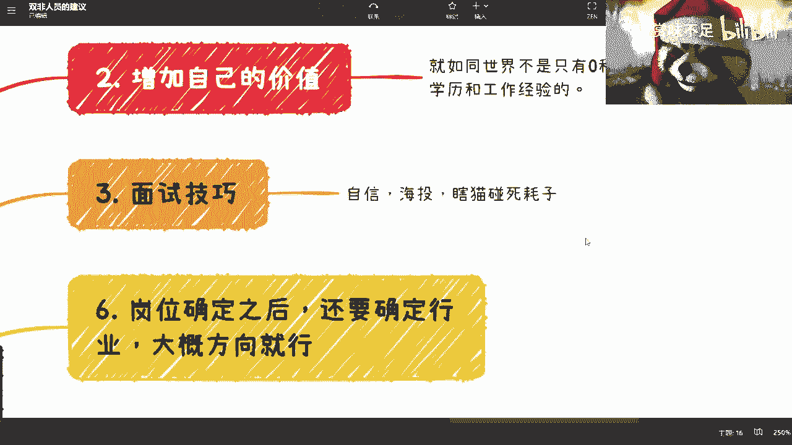

以下是选择思路：

*   **自我评估**：你是开朗外向还是沉稳内向？喜欢与人打交道还是专注于事务？逻辑思维强还是创意丰富？
*   **长期视角**：思考这个岗位方向你是否愿意持续做5年或10年。这个思考需要结合实际行动（第一步）逐步清晰，而非空想。

---

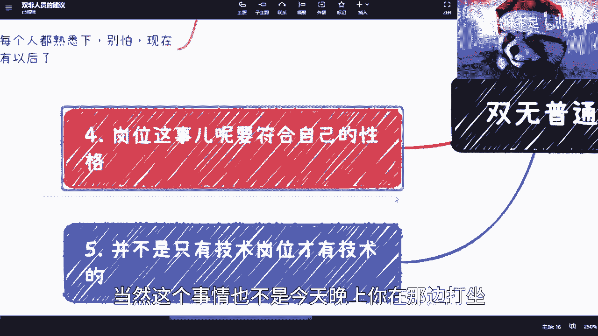

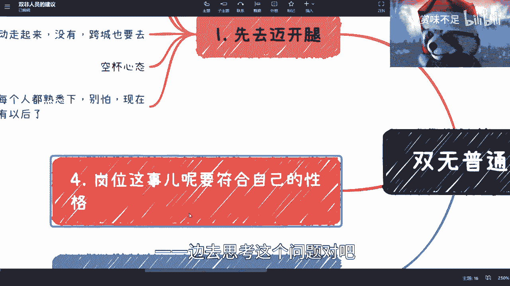

## 第五步：拓宽对“技术”的认知 🔧

上一节我们探讨了岗位选择，本节中我们来看看如何理解岗位的“技术”含量。切勿狭隘地认为只有编程、开发等岗位才具备技术。

**核心概念**：**技术**的本质是**能为对方创造价值（直接或间接赚钱）的能力**。

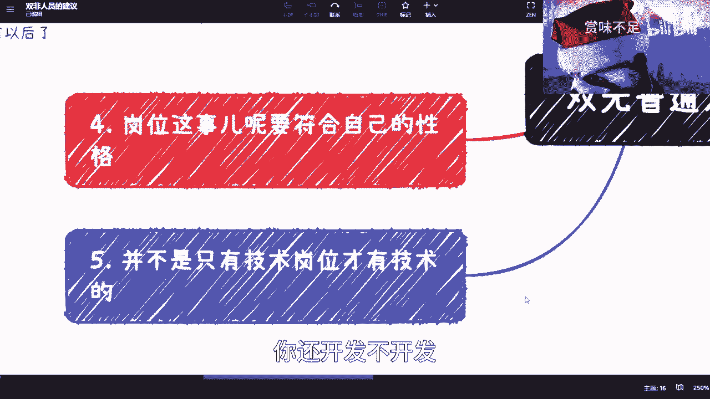

*   市场运营、销售、咨询、研究分析等岗位同样需要深厚的技术（如市场洞察、用户心理、销售策略、分析模型）。
*   直播、短视频、跨境电商等商业模式中，盈利闭环的设计与执行本身就是高级技术。
*   关键在于掌握所在领域的核心盈利逻辑和专业技能。

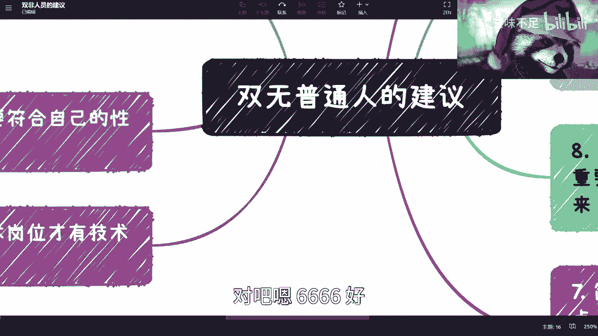

---

## 第六步：确定行业方向，主动链接资源 🌐

上一节我们重新认识了“技术”，本节中我们来看看如何选择行业。仅有岗位方向不够，必须结合具体的行业。

以下是确定行业方向的步骤：

*   **圈定范围**：思考你对社交、金融、游戏、医疗、教育等哪个行业更感兴趣或有感知。
*   **分析客户**：思考这个行业中，最终为你付费的客户是谁（普通消费者、企业、政府）？为什么付费？
*   **主动了解**：如果不了解，就去学习。参加行业展会、阅读行业报告。
*   **链接协会**：每个城市和行业都有协会、商会。主动前往，抱大腿、寻求交流和学习机会。大多数人不会拒绝一个真诚的请教者。

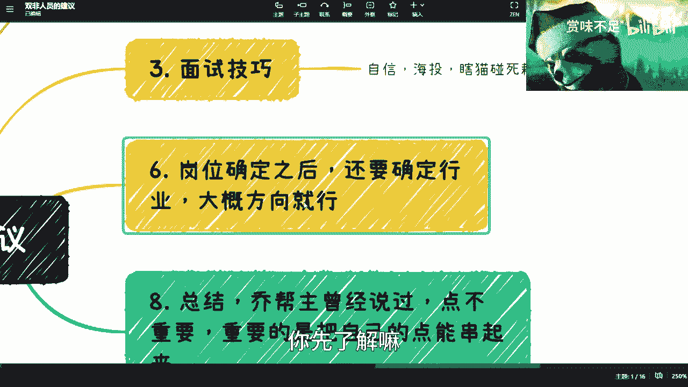

---

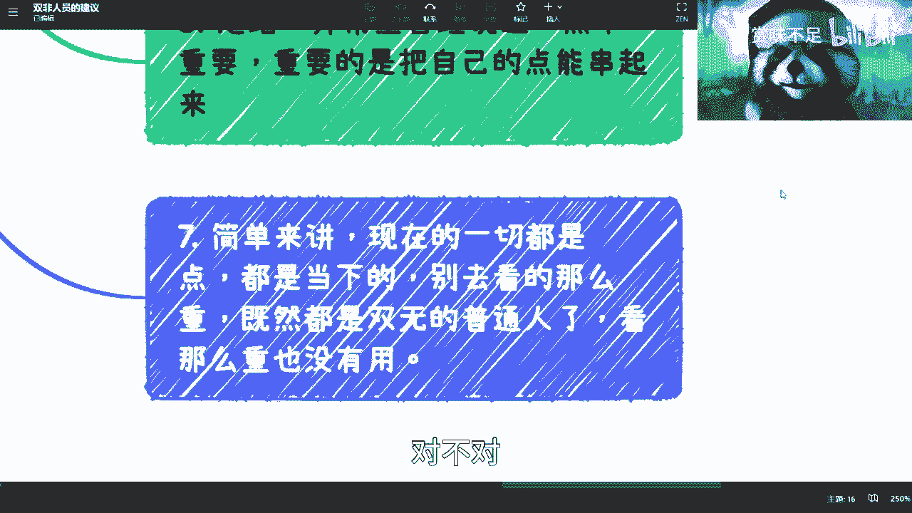

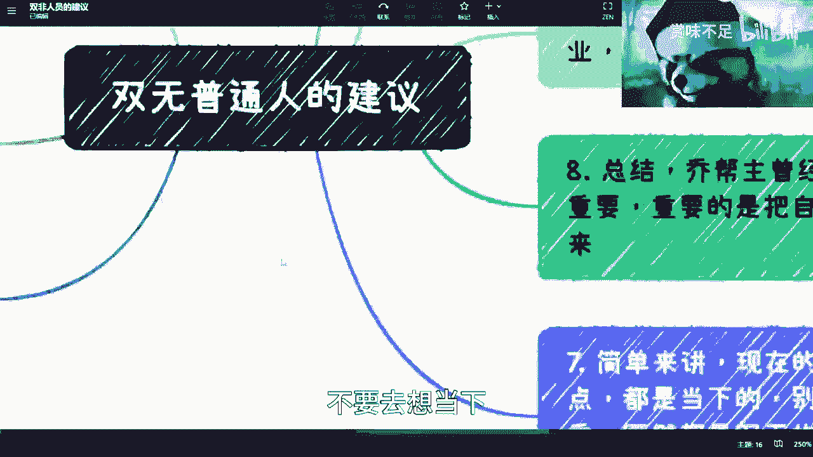

## 第七步：用“连线思维”规划职业路径 🧵

上一节我们明确了行业选择的方法，本节是最后一节，我们将学习如何用长远的眼光看待职业发展。不要过度纠结于当下的“牌面”，因为从未来5年或10年后回看，许多当下的困难都不值一提。

**核心思维模式：连线思维**

*   **点不重要，线重要**：你过去做设计、卖茶叶蛋、做社交、开发游戏……这些看似不相关的“点”本身不是问题。
*   **未来连线**：关键在于，未来某一天，你是否有能力将这些分散的经验、技能和洞察“串联”起来，形成你独特的竞争优势和事业版图。`独特竞争力 = ∑(离散经验点 × 串联洞察力)`
*   **前瞻性思考**：因此，在做每一份工作、每一次尝试时，都要有意识地去思考：**这件事中，哪些“精华”可能为我未来所用？** 避免毫无思考地机械执行。
*   **行动闭环**：如果觉得想不清楚未来，根本原因通常是了解不够，而这又回到了第一步——**必须迈开腿去行动和体验**。

---

## 总结 📝

本节课中我们一起学习了为“双无”伙伴量身定制的七步职业起步法：

1.  **立即行动**，走出信息茧房，参与线下交流。
2.  **重新定义价值**，通过具体成果和经历包装自己。
3.  **掌握面试技巧**，自信海投，优化简历获取机会。
4.  **根据性格**选择匹配的起步岗位。
5.  **拓宽“技术”认知**，理解一切创造价值的技能都是技术。
6.  **确定行业方向**，并主动链接行业资源（如协会）进行了解。
7.  **用“连线思维”规划长远路径**，为未来串联经验点埋下伏笔。

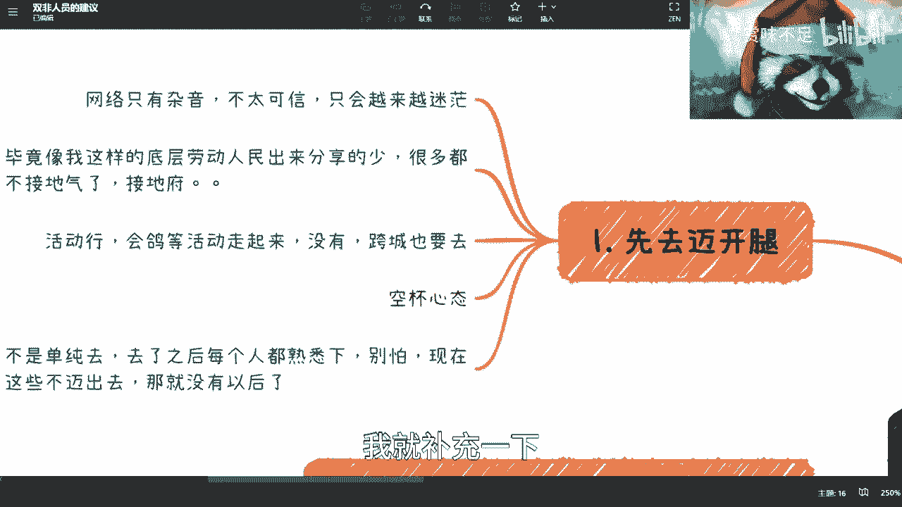

记住，起点不能定义终点。破解困境的关键在于**停止空想，开始行动**，并在行动中不断思考、学习和连接。你的价值，由你创造和定义。