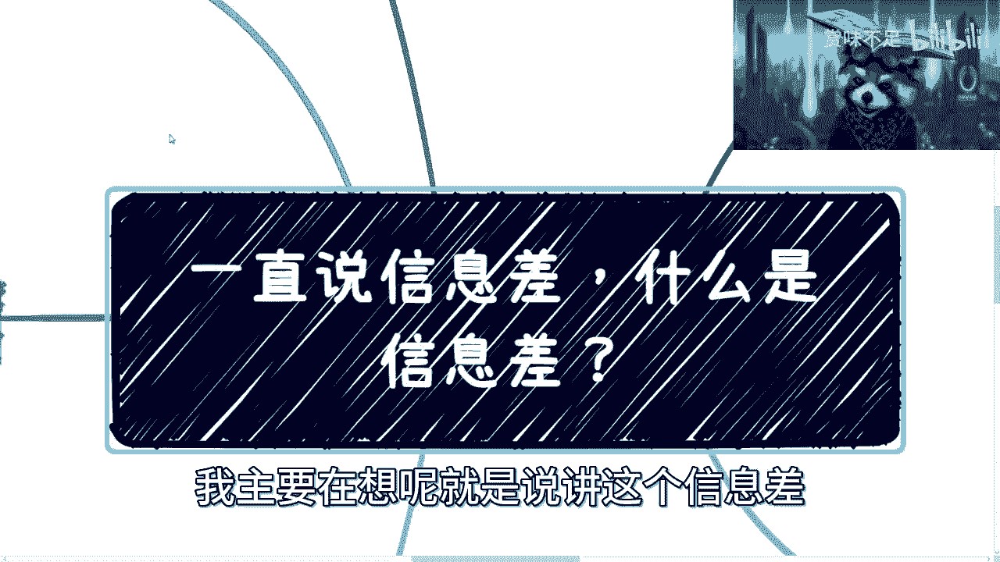
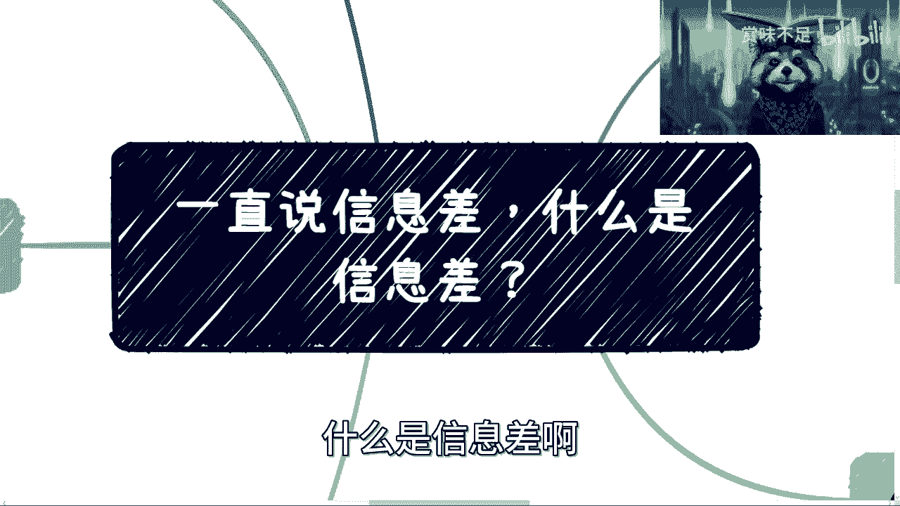
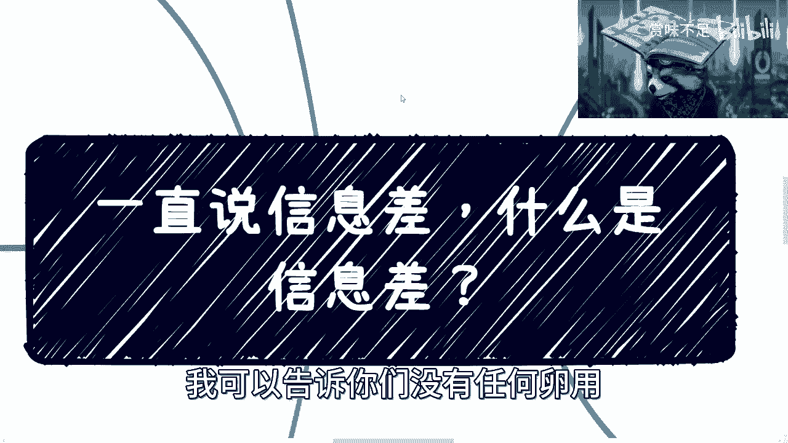
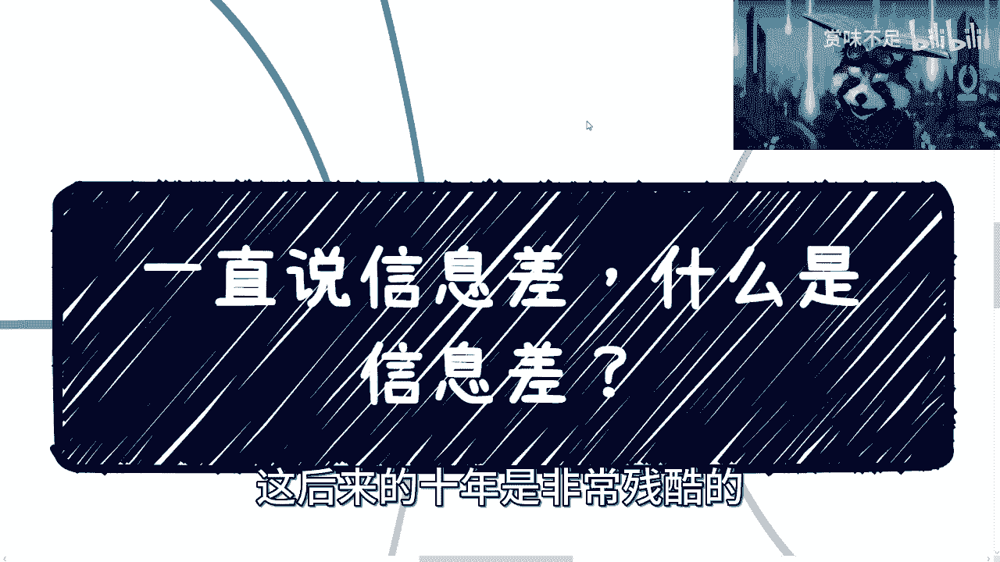

# 缩小信息差，识别信息差是唯一的出路 - P1 - 赏味不足 - BV1fs4y197Ay

好啊，大家礼拜几礼拜三礼拜三早上好是吧。

这个有小伙伴最近跟我讲什么事呢，你跟我说，他说为什么我录这个XMIND的时候好像很严肃，然后评论区的时候又很逗逼对吧，那是因为你们没看到我是吧，就但凡现场我到高校和政府讲课都很逗比啊，给给给政府讲。

稍微还收敛一点对吧，你要但凡我到高校或者线下活动，那这个不得了啊是吧，那现场就差蹦起来了，哼然后还有人问我。

他说为什么你头上顶本书是吧，这是因为显得我有有点支持是吧，那怎么办呢啊嗯然后数字经济跟区块链那边呢，我觉得我想想吧好吧，我看看从哪些方面讲，因为有很多东西其实很多人都懂，而且我觉得讲的没啥用。

唉我回头想想吧，好吧呃那么这一期呢我主要在想呢。

就是说讲这个信息差。

你们看啊啊，我这个练了老多老多了是吧。

啊一直说这个信息差对吧，什么是信息差啊。

我来给你们总结一下啊，首先对吧，网络营销对吧，这个属于后这个这个在我看来了，属于后天PUA啊，P后天PUA，第二个固有认知，这个属于什么呢，先天PUA啊，那很简单是吧，新作者偏差，这个哎呀怎么讲呢。

我觉得可能跟这个认知有点关系，为什么这个小浣熊吗嘴又歪了呢，阿哥我已经看出来了，唉算了，不管他这个第四个呢固步自封对吧，这个我觉得就真的是跟个人有关的啊，我也就救不了了是吧，最后一个呢。

就我说对于整个世界运作逻辑的不了解对吧，那我会把它展展开来说一下啊，首先网络营销是吧，网络营销呢就我说的这种后天PUA，后天PUA呢其实很简单，因为我们之前也说过对吧。

网上所有的信息它其实都是有它的源头的对吧，这就好像哎怎么说呢对吧，就比如说我们讲讲，就是大家都说都知道那是笑话对吧，宇宙的尽头是带货，为什么这么说呢，是因为你会发现你网上所有的信息，不管他怎么说。

你他可能讲两个小时，到最后两分之后，你说哎我们这边有个有个课啊啊，卖什么东西啊对吧，怎么样怎么样对吧，那其实你说啊吕老师，你是不是我是啊，我承认啊对吧，那你看我视频最后不都说嘛，这个咨询嘛对吧。

但我觉得不一样在哪里呢，就是说沟通所有的东西，他得量身定制，他得有这个针对性对吧，你今天去买了，比如说花2万块钱买个课，这个课对你有帮助吗，其实没有帮助对吧，然后前两天还有人跟我说啊，就是那个培训啊。

说要培训包就业啊，怎么个套路，哎呀我我我我跟你讲，待会下面呢我会讲到这件事啊，我顺便提一嘴啊，那个免得我在路上被人家用砖拍死是吧，首先是这样子，所有的网络信息，他我不管它背后是资本还是舆论啊。

还是各个方面，他反正是有一定的道理的啊，不会是空穴来风的对吧，注意首先这是第一点，第二点是这种现象呢，就像我说的，它更像一种后天PUA，就是说你去什么样的平台，你铺天盖地就给你看啊。

就你一开始哪怕觉得这个信息是假的，或者这个信息是有点问题的，那铺天盖地每天给你讲一遍来了，每时每刻刷都给你讲一遍，哎慢慢慢慢，你你知道吗，就是人嘛对吧，五五开嘛对吧，八二开嘛对吧。

总有一部分人是被洗脑的是吧，那么形成了一种刻板印象，嗯听懂诶，就有很多人在说呃，这个什么什么套路，我给你们讲，跟你讲什么套路啊，套路我也懂的呀，大家听懂鼓掌是吧，这个这谁不会啊是吧，呀不动了啊。

这第二点对吧，第三点呢就这个举个例子啊，比如说啊，现在这最近一段时间铺天盖地都说创业好是吧，首页全部给你省，做什么怎么做什么，年薪几10万几百万啊，然后呢在B站这边呢也给你推对吧，什么什么做什么。

税后年入多少多少对吧，我跟你讲，你们看的时候，我还是那句话，你们也觉得这不太靠谱，但是你们还是会点进去，为什么呢，因为因为你们觉得对吧，有看白不看看了，有可能赚得到，不看我肯定赚不到，不就这种心理吗。

是不是，那说白了还是被PUA，你知道吗，所以说你时间长了，你就会你就是很有可能，比如说你一旦看到这种东西多了对吧，你你你过的一段时间跟你朋友聊天的时候，你甚至会跟他讲，哎你知道吗，那个什么什么什么啊。

你每天做对吧，什么翻译书啊对吧，什么翻译音频啊对吧，年收入多少多少，你也会讲，对吧，然后后面呢其实你看啊，这种信息差呢是由于整个互联网发达之后啊，这个主观可就是有人或者有机构，这种有意的去造成的对吧。

那当然这种信息差，其实在我看来是最垃圾的一种信息差，为什么呢，因为这种信息差虽然我们称之为信息差，但是这种信息差对于你来讲没有任何的用处，一点帮助都没有对吧，我不管这个信息，你说真的假的也好。

是你早知道晚知道也好，有任何卵用吗，没有对吧，这这这真的我跟你讲一塌糊涂是吧，固有认知啊，固有认知呢在我看来是先天脾胃啊，天天PUA这个东西呢，没有办法啊，他跟就我之前也跟你们说过，他跟你们的家庭。

跟你们的学校啊，跟你们身边的朋友有很大的关系，因为嗯人的价值观嘛，人的很多认知嘛，它是随着年龄增长会颠覆的嘛对吧，你就像我初中啊，高中啊对吧，然后我第一份第二份工作的同事认识，我跟现在再来看我。

他就觉得这不是一个人，你知道吗，就我以前玩跟现在是两个极端啊，他们完全就不觉得啊，我现在是这是这个样子的是吧，所以说这个事情没有办法，就是有很多时候你是受，就是每个人都会受周边的影响。

只不过就是说看你有没有这个这个觉醒的，觉醒的时间吧对吧，就是你要是觉得哎我就是就为自己活着的，就只顾自己的，别人别的我不管了，我有自己判断力的，那你可能越觉醒的早，那么你你你能够积累东西也就越快对吧。

因为你没有杂音啊是吧，那那我们举个例子啊，比如说互联网岗位很赚钱对吧，就有很多人说啊，为什么我要去做开发，为什么我要去做互联网，为什么要去干嘛，薪资高啊是吧，谁他妈告诉你的啊，我就问谁他妈告诉你的。

我就问你是不是去问过1万个人，2万个人，互联网在中国有多少创业人员，你是去看过平均数呢，还是加权平均数呢，还是说是中位数呢对吧还是怎么样呢对吧，你是给出怎么样的一个逻辑，得出了。

说H互联网这个这个薪资高的这件事情是吧，你最多也就是说呢这边我下面写了，我下面写什么啊，后面写的就是什么呢，就我有个朋友系列对吧，那这谁不会啊是吗，那我觉得你还是被PUA了是吧，那这是第一个。

第二个是什么呢，就是叉叉叉工作是铁饭碗，有意义吗，没有意义啊，因为你你但凡有点判断力对吧，首先你对于这种叉叉叉工作你肯定也不了解，你也就是听你父母或者听谁这么一说对吧，那是不是铁饭碗，那更没无无无足。

那个无地考证了，你说是吧啊，你是每个人去问呢，还是说是这些人，从从他们一工作都已经做到退休了，有几个人你认识的，我就问没有啊，都道听途说的，这种就是固有思维，你知道吗啊，还有还有那种你知道吧。

还有那种就是哎呀做什么工，那个行业好啊，医疗金融啊，金融有钱啊，金融他妈的挖金子的对吧，你这不知道哪来的谣言，你知道吗啊，对吧，就这个就好像什么，这就好像回头有人有人就说哎，吕老师说的头上顶本书对吧。

显得有知识是吧，哎呦我真的也是绝了，你知道吗，就就就这种事情来了，在很小时候，或者也就是潜移默化给你灌输的时候呢，你就不会觉得有什么问题，但是等到你长大了对吧，你有你在没。

就是如果你没有独立的这个价值观，三观之前的，你可能也不会去质疑它对吧，甚至你还会觉得他是对的啊，那么还有呢你比如说啊一定要找本地对象对吧，要找当地的，不能找外地的对吧，这这这这不知道哪来的。

就是这种这种三观，你知道吗，这种如此扭曲的三观，完全不理解，你知道吗，就人家找对象都是看喜欢不喜欢的，都是看就是就看感情的啊，你变成了什么，我给你框框啊，框住啊，这莫名其妙嘛，你你知道吗啊。

然后这还有还有像什么，还有就像你去面试，人家问你诶，你能不能加班啊，我能不能加班跟你有什么关系啊，对不对哦，我是来找工作的，我又不是来加班的，你管我能不能加班，加班给钱啊，不给钱我就不能啊，对不对。

我跟你讲，这就是前两天你知道吗，有评论区在有人问我，他说吕老师，你有没有空啊，我说我有没有空，取决于你给我多少钱对吧，你今天跟我谈个单子，100万，我没我没空啊，没空，我把事情全部全部退掉，我也有空的。

对不对，这这这无所谓的呀，是不是啊，然后呢，你看啊还有什么呢啊，就你们高校老师跟你们说啊，你们都能找工作的啊，你们这个读研读个研都能找工作啊，就业率95。4%是吧，哼啊我就不说了对吧。

这个我也不好意思讲啊，一塌糊涂是吧，还有什么，还有就是一定要结婚啊，哪怕结婚了，哪怕你结婚离了婚也是正常人，反正你不结婚，你就不正常，莫名其妙我怎么了，我非要结婚呢，啊谁他妈跟你讲，谁。

谁他妈跟你说的是吧，然后还有我知道还有很多小伙伴他是这么想的，哎呀我没办法啊对吧，我这么尽孝是吧，为我父母是吧，哼为你父母，那为你父母，你忍一辈子，你找个你不喜欢的，你结个婚，你为你父母，你为呗。

我看你唯唯几年是不是哎呦，我跟你讲啊，哟就是一时冲动的事，你知道吗，真的你回头还是要后悔啊，呃还有什么哎呀，我到了几年就要谈恋爱对吧，到了几岁都要结婚对吧，到了几岁可能不适合结婚了，到了几岁。

那咱们就这么说，到了几岁就谈恋爱，什么结婚不是结婚这种都他妈是谣言，都他妈道听途说，你知道吗，那我刚刚是想说，到了几岁的时候不适合生育对吧，或者说生育风险大，这个人家是有科学依据的，你说是吧。

那前面这些是个什么玩意儿啊，是吧好然后还有什么，我为什么一直要说空杯心态，我一直跟你们在提这个空杯心态，为什么，因为我不因为每个人的过去，每个人的情况其实都是不一样的对吧。

包括每个人的承受能力都是不一样的是吧，但是你要你我们要保证的是什么呢，就是说尽量做到是你你要摒弃也不叫摒弃吧，就是你保持对于以前所有东西的一种态度，但是呢我也要去接受各种各样新的信息。

我不能我不能今天啊，就是就是就是哪有拿拿着我这个固有信息，然后去挑战别人说的东西，然后说别人说的东西都不对对吧，那没有意义啊对吧，然后就说你需要不停的去认识到，什么是应该有的观点。

而不是说一直111直变成一个一成不变的，就这么一个腐朽的这么一个人是吧，那最后还有什么啊，这个我跟你讲，跟家庭跟我们过往经历也是有很大关系的，但是呢但是呢我其实因为我聊过太多的人。

就很多的人都是沉浸在过去，然后觉得以前怎么样怎么样怎么样，但这个不重要，你知道吗，无所谓啊，就还是那句话嘛，你你找我也好，找工作也好，找对象也好，你未来比如说更要网上走，去跟跟跟政府啊。

跟其他的国际上的一些这个活动啊，或者国际上的大佬沟通也好，who care你的过去是吧，我就这么说，在你足够有钱，在你足够知名之前，没有人关心，但你足够知名，足够有钱之后，你不向别人关心。

也会来关心的对吧，但是你一直沉浸在你的过去，然后由于你的过去来说，束缚住你的发展，那没有意义，对不对啊，这个是三哎呀，四这个就无敌了，我跟你讲四这个是真的无敌了，你比如说啊我跟你看，我开头就写了。

这可多了去了是吧，创业暴富是吧，哎呦必须创业，不创业赚不到钱是吧，真他妈不知道谁讲出来的鬼鬼鬼点子是吧啊，创业暴富，创业暴富，这他妈就叫幸存者偏差啊，还有就是呢我有个朋友的故事，就是我有个我跟你讲。

我有个朋友的故事是所有故事的开头啊，我不算暴富，哎呀我跟你讲牛逼了，就是你们是不知道啊，对关于区块链啊，我这个地方我是要说，我回头那是会出一期我看到的市场，但是我真不清楚能不能发出来。

因为实在过于敏感啊，这里面他妈的每一个字都他妈是敏感字，我可以明确跟你们讲啊，嗯这么说吧，黄赌毒一个不落啊，一个不辣，好那个，第三啊，就是这个互联网高薪高薪资，各种package对吧。

哎呦这package就牛逼了，这package就是什么，哎我有个朋友对吧，派克去200万啊，我有个朋友朋友去300万对吧，都是我有个朋友系列，然后就就就因为这种话，就会觉得A互联网高高兴。

自然你们也不去看看对吧，大部分大部分就还是平均的，那当然了，你要跟土木跟别的比，那当然是高的对吧，但也不是说高出离谱嘛是吧，那你高是高啊，你加班也多啊，你也卷了是吧，那说到这还有什么某某某培训对吧。

就业率很高，哎我跟你讲，我给你们举个例子吧，好吧，你比如说培训公司股东是我陪就业，公司股东是我叔叔，怎么滴了，你知道吗，你也不知道，你管我对不了啊，然后有很多人说了，那怎么的呢，我也包就业了呀。

是包就业了呀，就他只告诉你就业率，他们有告诉你失业率啦，有的啦，你就业三个月，然后跟你说来项目不错的，滚吧，你关心吗，你也不关心啊，他会跟你说嘛，他更不会跟你讲啊，唉真他妈绝了，我跟你讲，我跟你说啊。

很多时候套路都很简单啊，怪那怪什么呢，怪韭菜实在是认知不够啊，还有什么呢，比如说跟着谁买对吧，买股票对吧，买什么就能赚钱对吧，这个就更扯淡了是吧，回家啊，还有那个最近网上一直让回老家摆摊对吧。

躺赚躺着赚屁呀啊什么回老家，什么年薪90万也不知道怎么来的是吧啊，这种是什么呢，就是不是没有问题啊，不是说这条路不能走，那这条路几万个出一个，几10万个出一个啊，那剩下都是死啊是吧，对吧都一样的。

就是就是你看啊，包括就是最近找我聊的对吧，包括你们公开问我的，我也跟你们讲，如果你们要走我这条路对吧，也不是不能走，但我这条路也是一样的对吧，这当中得要多少天时地利人和他才能走到现在。

这很多也是个死啊是吧，一样的道理呀，OK那第五个对吧，你比如说固步自封啊，固步自封牛逼了，二极管对吧，上来就跟你说，非黑即白，非零即一对吧，就所有东西只有两个极端，哎呀牛真的是牛逼，就是我跟他说。

我说哎你这个不适合考研对吧，你他就跟我说哦，那我不是考研，那我摆地摊对吧，我就跟他说，我说我说你这个主业肯定是不太靠谱的啊，那我现在就辞职对吧，就，就你现在看不到我，我的这个表情，你要看得到。

我就就就地铁老人看手机，你知道吗，就是吧啊拉黑算了，我都懒得沟通，你知道，还有是什么呢，就是不愿意接受新的事物啊，尤其是这种主动造成的，就就这个是什么呢，这个就是说是主动造成信息差啊。

你也别别怪这个说别人没有给你信息对吧。

给了你你也不要，是吧，所以说呢我们先总结前面五个啊。

你会发现啊，就是比如说啊网络营销啊，固有认知，幸存者偏差，固步自封这四个你所造成的信息差，你会发现本质上啊你要说说得轻一点，我觉得呢就是给你三观，给你的认知造成了很大的混乱，好混乱，这个叫说得轻一点。

我觉得说的重点是什么，就他妈的完全扰乱了你们的人生规划，和人生的发展方向，也许你们本来就发展得很好的，但是现在他妈的对吧。

那么第六第六个，其实这个也是最重要的。

就是我们说的整个世界的规则对吧，我们举个例子啊，从赚钱角度来讲，我们每个人都在寻找所有的那个投入，产出比高的，也就是我们说的IOI，高的赚钱方式对吧，那我在这个地方再重申一遍。

我就怕之前有很多小伙伴没有看到对吧，再重申一遍，什么叫IOIO的赚钱方式，是指你再算下来之后，你的时薪，你的月薪，你的年薪，你的周薪是远远高于记住，远远高于你打工的实心周星，年轻的啊，你别来跟我说。

你现在打工多少多少钱，比如说派克就60万100万，我不关心的，我只关心说你现在如果要去做个副业，做个创业，你的OI是不是高啊，你别来跟我讲说啊，我今天做了一个创业创业个业对吧。

这个这个流水是2000多万，3000多万一个亿的不重要啊，我关你流水多少事情啊，我关心的是说你真的算下来你能够盈利多少钱，同时你又付出多少时间对吧，你跟我说你一个亿的流水对吧，利润10%啊。

打个比方10%，然后你还他妈的卷成狗对吧，一一呃，这个24小时扣，那我觉得你还不如打工，何必呢，是不是，那么呃我们来说啊，就说你比如说什么叫ROI的啊，什么叫性性价比最高的赚钱方式。

那当然是你不干什么活，又能够赚很多钱，对不对，钱多活少，离家近是吧啊，那比如说各地方的财政补贴有很多，你们知道吗，你们不知道，你们知道怎么申请吗，你们也不知道，但是申请门槛高吗。

你们的固有思维告诉你们门槛很高，跟我们没有关系，但事实上呢无所谓啊，都有关系啊，你们只要想做，有什么不能做，我随便举个例子，疫情对吧，失业对吧，企业的这种教育培训很多了都能做啊，有什么不能做呢。

只是你们不知道怎么做啊，而且这里面你要说有门槛吧，没有关系啊，门槛这件事情有很多企业都帮你们趟平了，我们要做的是什么，我们就去做工具人，你去做工具人的投入产出比都比你打工来的高。

我这点很明可以很明确跟你讲，比如说招投标一样的呀，这招投标里面我跟你讲学问也多了，我跟你这么说吧，以前招投标我不知道，现在啊以前招投标是有很多包装的啊，我们先不说这个招投标里面那些猫腻，我先不去说它啊。

这招投标单纯的包装你就能赚很多钱对吧，那问题在哪呢，问题是在于你得知道怎么包，你得知道怎么帮人家找投币，你得知道怎么去，就是这个招投标的这个这个信息，或者各个方面对吧。

那这个不就是现在我们需要去积累的东西吗，是不是，然后第三个比如说直播以及各平台的MCN机构，它的运作模式对吧，我跟你说MCN已经爆了，已经每就是就是你你十个人拉出来，他妈七八个人都是MC对吧。

为但是你们有没有想过为什么这么多人去做，就是因为赚钱不赚钱，有人会去做吗，啊谁他妈关心啊是吧，但是你们要去罗那个那个叫什么，你们要去了解的，就是说它背后的运作逻辑，有些我跟你说，真的就是纯拉皮条。

就他们就是躺赚，连活都不干的，你知道吗，就真的就是躺赚钱，就是资源去换啊，比如说你现在有很多主播，对方要问你要没关系啊，我包月你随便挑对吧，包月是吧，行不行也行啊，你说他费力吧，也不费力啊。

躺赚了是吧啊，那比如说教育培训津贴，教育培训津贴多了去了，我跟你说企业的教育培训，个人教育培训，各地方的这种教育培训人数的指标，然后再给补贴多了去了，有的是按kiss的，kiss by kiss的。

有是按年的，有的按季度的，什么没有啊对吧，有门槛吗，没有门槛的，而且我说不好听点，就算有门槛，怎么低了呢，你们有门槛，不是你们要去填这个门槛，你们找别人找我啊，找其他人啊，我帮你们填了，填完之后。

你分个20%，50%不香吗，啊那我不明白了，你说是吧对吧，最后你比如说各种扶持基金也有，我跟你们这么说，所有的国有基金资本啊，啊国有基金，国有国有的那个叫叫叫叫储备virtual北京啊。

就是呃扶持基金对吧，然后还有一些这个企业的这种培训费，所有这些东西它都是按年算的，什么意思呢，就是过了今年他就清零了，什么意思呢，就是说它必须在今年用完，想办法用，那就很简单啊对吧。

你既然他们既然要用完，这是他们的KPI，那你想办法把它用了是吧，哎哎呦，你你不要再来问我，刘老师怎么帮他用哥找项目啊，没有包项目，包装总会吧，这就真的就像昨天那个有维私信小伙伴问我。

他说我今天要去参会了对吧，然后他说人家根本不，我这个大学生，我说哥你能不能包装，我说了这么半天包装会吗，包装啊，别这么老实好吗，唉呀这真的是吃亏，吃的不够多，你知道吗。

嗯嗯OK回过来了。

所以说呢本质上来讲啊，我觉得啊所有的东西不管是你们的主业也好。

副业也好啊，还是说这个未来的这个成长也好，我觉得都是归咎于信息差，所以说呢再回到根本问题上面，就是为什么我们说要去这个不停的认识人，不停的去沟通，不停的去了解，就是你哪怕一开始。

那认识的都是些这个垃圾对吧，认识的都是对你没有帮助的，没有关系的，你必须要从量开始走，然后才有质变对吧，那为什么要去做这件事情，就是为了让我们的信息差越来越小，让我们的信息差。

就是就是从很很多错误的信息，慢慢慢慢扭转到一个正确信息，你知道吗，就单纯的靠我的视频，你们也只能了解到冰山一角，但是你们有很多固有思维，很多时候是不一，就就是都是错误的啊，那么这些错误的方向。

就是像我们像我们一开始说的，就是你们在战略上就错误了，那战术上再辛苦再去加班，再去付出努力，再去付出时间，我可以告诉你们没有任何卵用啊。

没有办法啊，真没有办法好吧嗯，我最后再提一点啊，最后10年哦，不是最后10年，这后来的10年是非常残酷的。

而且是非常的困难的啊，我相信你们大部分人没有认知的。