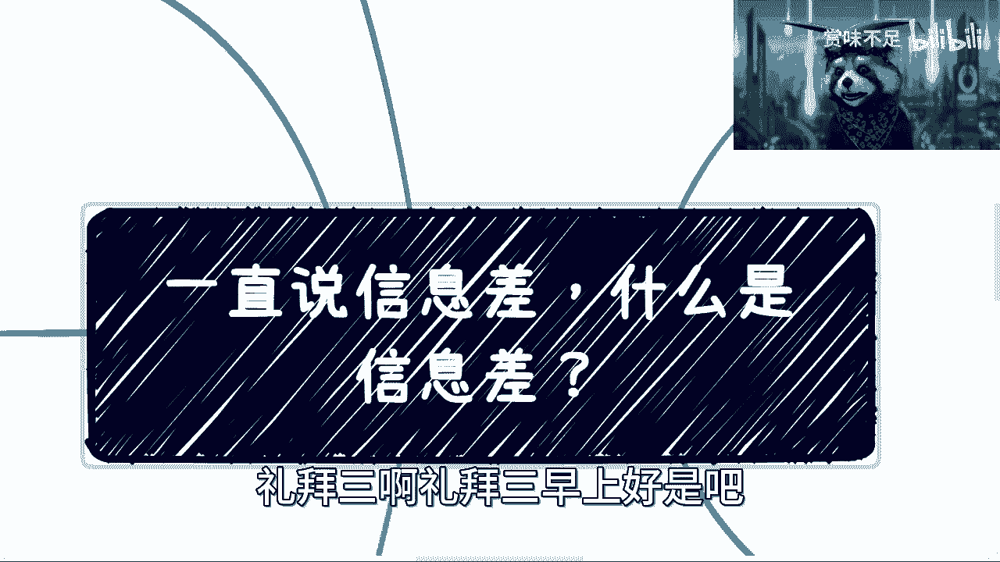
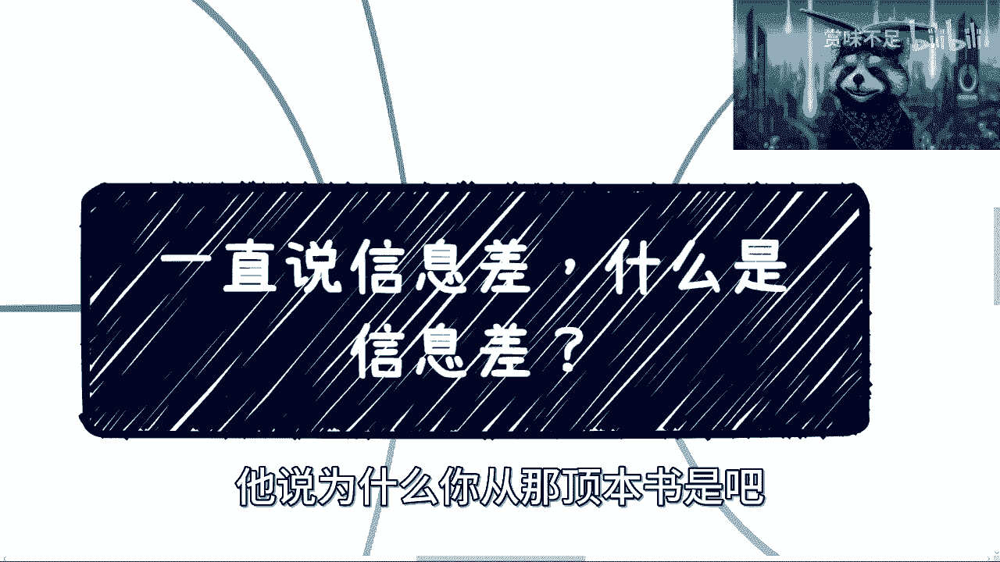
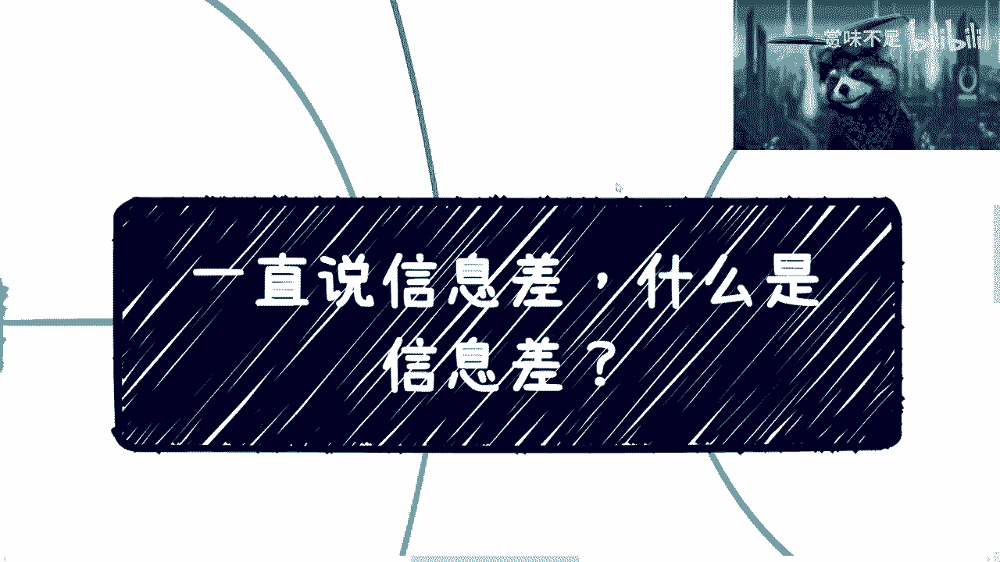
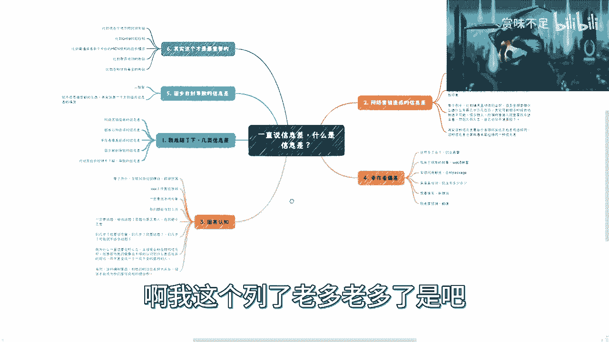
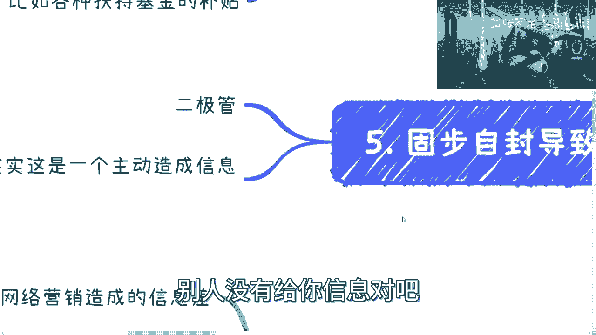
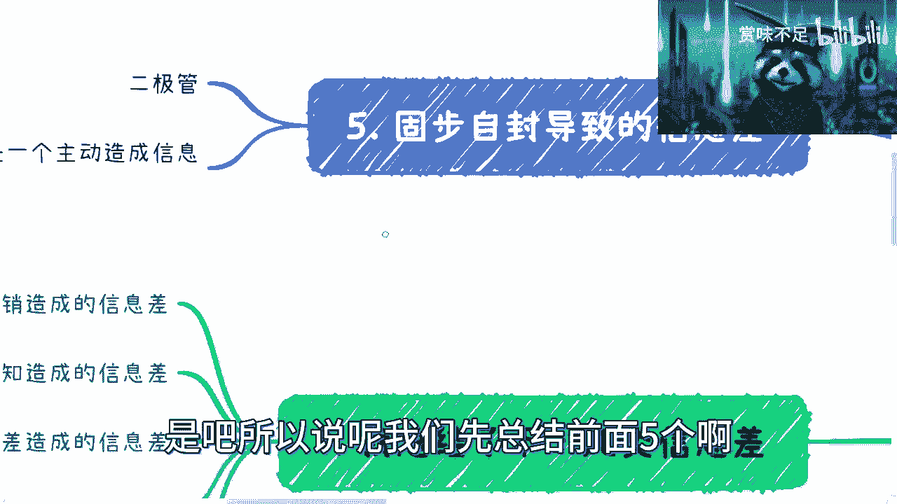
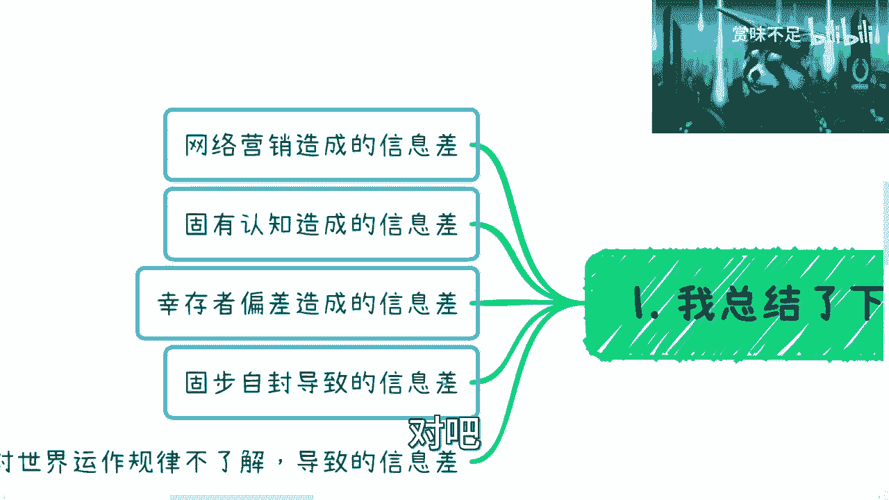
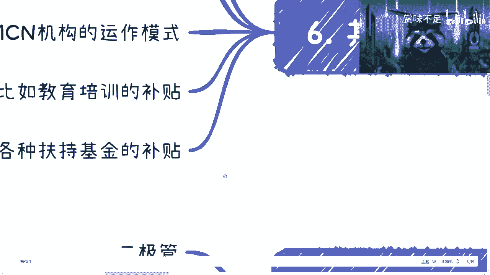
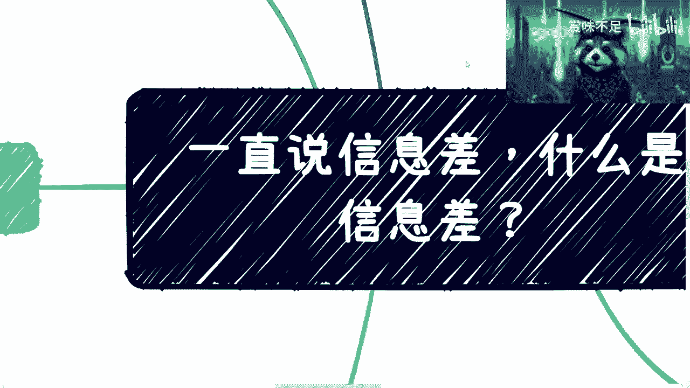

# 课程 P1：识别信息差 🧠 - 缩小信息差是唯一的出路

在本节课中，我们将要学习“信息差”的概念、其常见的几种表现形式，以及为什么识别并缩小信息差对于个人成长和职业发展至关重要。信息差，即信息的不对称，是影响我们决策、认知和人生轨迹的关键因素。

## 概述：什么是信息差？

信息差是指不同个体或群体之间在信息获取、理解和应用上存在的不对称现象。这种不对称会直接影响我们的判断、选择和人生规划。

## 信息差的六种主要类型

上一节我们介绍了信息差的基本概念，本节中我们来看看导致信息差的六种具体原因。理解这些类型，是克服它们的第一步。

以下是六种主要的信息差类型：

1.  **网络营销（后天PUA）**
    这种现象源于互联网上大量有目的性的信息轰炸。无论信息背后是资本还是舆论推动，其核心模式是通过重复曝光，潜移默化地影响甚至改变受众的认知和判断，形成一种“后天习得”的偏见。例如，铺天盖地的“创业暴富”内容，即使最初觉得不靠谱，长期接触后也可能让人信以为真。

2.  **固有认知（先天PUA）**
    这种信息差源于个人成长环境，如家庭、学校、早期社交圈所灌输的价值观。它是一种“先天形成”的思维定式，在个人建立独立判断体系前就已存在，且难以自我察觉。例如，“互联网岗位一定高薪”、“某些工作是铁饭碗”、“必须结婚才算正常人”等观念，往往未经批判就被接受。

3.  **幸存者偏差**
    这种偏差源于人们只看到经过某种筛选后的结果（幸存者），而忽略了被筛选掉的关键信息（沉默的大多数）。其核心逻辑是：**只关注少数成功案例，并错误地将其归因为普适规律**。例如，“我有个朋友”系列故事（创业暴富、超高薪资），常常让人误以为成功是容易复制的。

4.  **固步自封**
    这是指个人主动拒绝接受新信息、新观念，思维呈现“二极管”模式（非黑即白）。例如，听到“不适合考研”的建议，立刻跳到“那我就去摆地摊”的极端结论；或是对新事物、新方法抱有天然的排斥态度。这属于自我制造的信息差。

5.  **对世界运作逻辑的不了解**
    这是最重要的一种信息差，指不了解社会、经济、行业背后的真实规则和潜在机会。它导致无法识别高性价比的路径。例如，不知道各地存在多种**财政补贴、招投标包装、MCN机构运作模式、教育培训津贴、各种扶持基金**等。这些机会的**投入产出比（ROI）** 可能远高于常规工作，但门槛往往在于信息而非能力。
    *   **ROI公式**：`ROI = (收益 - 成本) / 成本`。我们应寻找的是**收益远高于成本**，尤其是**时间成本**的机会。

6.  **个人过往经历的束缚**
    过度沉浸于个人过去（尤其是失败或受限的经历），并以此束缚未来的选择和可能性。事实上，在个人取得足够成就之前，外界很少关心你的过去。重要的是未来规划和当前行动，而非被过去定义。

## 如何应对信息差？

上一节我们剖析了信息差的类型，本节中我们来看看如何从根本上应对它。

核心方法是：**主动扩大信息源，进行高质量的社会连接与沟通**。

即使最初接触的信息或人脉质量不高，也必须从“量”开始积累，才能逐步实现“质”的飞跃。目的就是不断修正错误信息，缩小信息差，确保战略方向正确。因为**在错误战略下的任何战术努力（加班、辛苦），其效用都趋近于零**。

## 总结与展望

本节课中我们一起学习了信息差的定义、六种主要类型及其影响。我们认识到，网络营销、固有认知、幸存者偏差、固步自封等都会严重扰乱个人认知与发展规划。而最关键的，在于了解世界的真实运作规则。

未来的十年将充满挑战，对信息的甄别和利用能力愈发重要。识别信息差，并主动通过持续学习、广泛交流和深度思考来缩小它，是做出明智决策、规划清晰人生路径的唯一出路。战略上的清晰，远胜于战术上的忙碌。