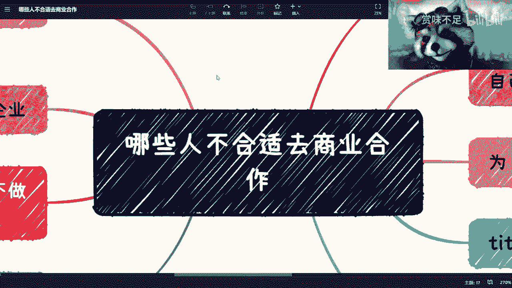
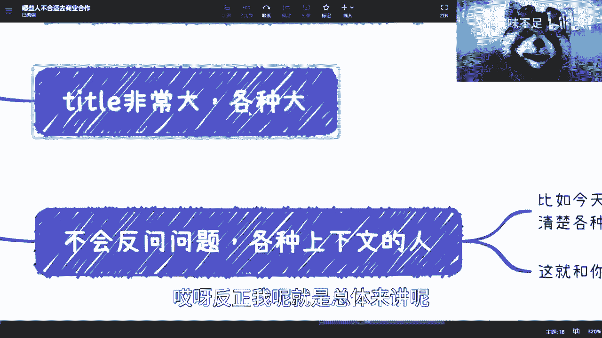

# 商业避坑指南 P1：识别不合适的商业合作行为 🚫

在本节课中，我们将学习如何识别在商业合作中应避免的几种行为模式。这些经验总结自实践中的教训，旨在帮助初学者规避常见风险，建立更健康、更有效的商业关系。

上一节我们介绍了课程目标，本节中我们来看看具体有哪些行为需要警惕。

## 1. 警惕“自来熟”式合作

商业合作需要建立在相互了解和信任的基础上。刚认识就急切提出各种合作方案的人，往往缺乏对合作本身的谨慎思考。靠谱的合作方会花时间评估双方是否匹配，而不是急于求成。

**核心逻辑**：`靠谱的合作 ≠ 即时的承诺`

## 2. 回避有财政危机的合作方

这里并非指不能与资源有限的人合作，而是要警惕那些正面临严重财务压力（如负债、拖欠房租）的个人或企业。财务困境会严重影响人的判断力和心态，导致合作过程充满焦虑和不稳定因素，极易将双方都带入困境。

**核心概念**：`财务压力 → 非理性决策 → 合作风险↑`

## 3. 谨慎对待“企业”形式

不要轻易为了合作而注册公司。在当下社会，优先考虑个人合作、个体工商户，或签订咨询、技术服务、兼职等协议。许多人对公司运营的认知不足，盲目成立公司可能带来法律、财务上的巨大风险，例如法人责任、公章管理等问题。

**行动建议**：
*   优先顺序：个人合作 > 个体工商户 > 专项协议 > 注册公司
*   核心原则：赚不到认知以外的钱，也承担不了认知以外的风险。

## 4. 识别“关系吹嘘者”

习惯性吹嘘自己“上面有人”、“各个部门都熟”的合作方需要警惕。这类人可能并非为了直接骗钱，但往往会浪费你的时间、套取方案，并且其承诺的项目极难落地。他们的核心价值在于虚构的关系网，而非实际能力。

**判断标准**：`承诺的可靠性 ∝ 可验证的事实依据`

## 5. 区分“人好”与“适合合作”

“好人”与“好的商业伙伴”是两个不同的维度。讨好型人格或过于强调“维护所有关系”的人，可能在商业决策中因人情而妥协，无法坚持原则。商业合作需要的是理性、契约精神和共同目标，而非无差别的好人缘。

**核心公式**：`人品优秀 ∩ 商业素养合格 = 潜在合作者`

## 6. 评估对方的商业思维

缺乏商业思维的表现包括：只讨论项目、技术，避谈如何盈利；无法为自己的服务合理定价（如开价1000元/小时，被还价到50元就立刻接受）；没有经过验证的空中楼阁式构想。与这类人合作如同“成年人过家家”，难以产生实际商业价值。

**关键问题**：
*   盈利模式是什么？
*   你的服务/产品市场价值是多少？
*   是否有数据或经验支撑你的构想？

## 7. 留意对方的提问深度

一个靠谱的潜在合作者，会像尽职调查一样，主动询问项目的背景、细节、目标等上下文信息。因为他的时间有价值，他需要足够的信息来做精准判断。如果对方对你所谈之事毫不深究，要么他本身不专业，要么他可能另有所图（如割韭菜）。

**类比**：这如同相亲时不问对方任何信息就决定结婚一样不可靠。

## 8. 反思“机会为何降临于我”

面对任何看似诱人的合作机会，都要保持清醒，问自己两个问题：
1.  为什么这个机会找到的是我，而不是别人？
2.  为什么是这种“合作机会”找到我，而不是彩票中奖？

这种反思有助于破除“当局者迷”的困境，避免因一时冲动而掉入陷阱。

**自检清单**：
*   机会的来源是否清晰？
*   我的不可替代性在哪里？
*   对方的急切程度是否合理？

---

本节课中我们一起学习了八种在商业合作中需要警惕的行为模式。总结来说，健康的商业合作应基于**理性评估**、**财务稳健**、**权责清晰**和**价值对等**。避免与那些**过于急切**、**缺乏商业常识**、**关系浮夸**或**自身处境不稳**的人进行深度绑定。希望这些经验能帮助你更明智地选择合作伙伴，少走弯路。

记住核心原则：**不要为了1%的不确定成功可能性，去冒99%的确定风险。**