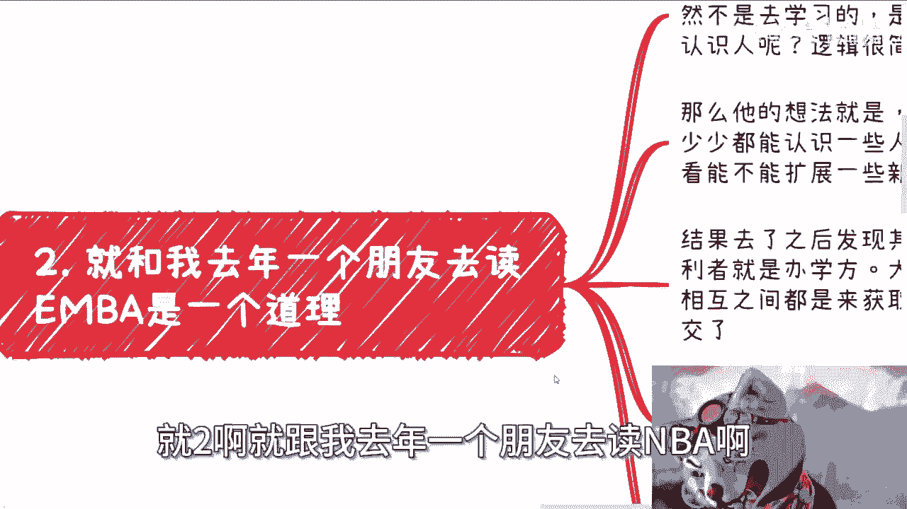

# 考去好学校是为了认识优秀的人-与社会接轨-真的笑到我了---P1---赏味不足---BV1SU421

## 概述
在本节课中，我们将深入探讨一个常见的观点：“考取好学校是为了认识优秀的人并与社会接轨”。我们将对这一观点进行拆解和分析，审视其背后的逻辑，并引导大家思考个人成长与外部环境之间的真实关系。

---

上一节我们概述了本节课的主题，本节中我们来看看这个观点的核心表述及其引发的初步质疑。

不少人声称，考到好的学校是为了去认识优秀的人，甚至是为了去与社会接轨。

这种话让我觉得非常可笑。首先，我要下一个结论：这种话说出来就是扯淡和装逼。说这种话的人，其目标去了这些学校或大厂，往往只是为了炫耀。

---

上一节我们指出了该观点可能存在的虚荣动机，本节中我们来具体分析“优秀的人”和“接轨”这两个模糊的概念。

没有别的，这种“认识优秀的人”和“与社会接轨”的说法非常空洞。

什么叫优秀的人？什么叫接轨？如果不懂，就不要乱说。我实在不知道这种人是哪来的。

例如，你说去考好的学校就能碰到优秀的人。那么，什么叫优秀的人？能很好地学习、考试就叫优秀的人吗？照这个说法，所有读书好、考试能考满分的人都叫优秀的人吗？这很奇怪。

---

上一节我们质疑了“优秀”的定义，本节中我们退一步，假设存在“优秀的人”，并探讨与之建立联系的实际意义。

我们退一万步来讲，就算存在你所说的“教育优秀的人”。那我继续问：你认识这些所谓的优秀的人，请问你能帮他干嘛？他们又能帮你干嘛？就算你们能合作，我再退两万步来讲，你就算能做，请问你们能做什么呢？你几乎什么都不知道。我敢打赌这些问题问出去，没人知道答案。你什么都不知道，就说“我考试就是为了去好的学校，去好的学校就是为了认识优秀的人”，这是什么鬼逻辑？

---

上一节我们讨论了联系的虚幻性，本节中我们承认概率差异，但质疑其与个人的关联。

有人说，去好的学校，碰见优秀的人的概率的确高。这点我认可。但我就问：这跟你有什么关系呢？人家优秀、觉悟高，真的优秀的人早就自己干自己的去了，为什么要带你呢？这很奇怪，对不对？你要说了，那我牛逼、我优秀。如果你优秀，你会说出上面这段话吗？

---

上一节我们分析了个人与概率的关系，本节中我们将探讨这种目标设定是自我思考的结果，还是外部灌输的产物。

所以说，本质上他看的是你在什么学校吗？如果你考上好的学校就是这个目的，那么请仔细想想：这是你自己想的，还是你父母灌输的？假设这是你讲的，你仔细想想上面这些问题。如果你想不清楚，那么你想想看你到底怎么个想法。

真的就是自欺欺人，这也蛮好玩的。

---

上一节我们引导了对目标来源的反思，本节中我们将此逻辑类比到其他常见人生选择上，揭示其普遍性。

你知道吗，这跟他们跟我说“考公”是一个道理。我就问他，你考公干嘛呢？他说想有个稳定的工作。那我说，你知道什么叫稳定吗？他不知道。还有人跟我说，想读个研。那我说读个研干嘛呢？他说为了未来能找到更好的工作。那我说，你读了研就能找到更好的工作吗？他说这好像也不一定。我觉得，如果说现在世界是个草台班子，那我觉得现在年轻人就他妈是个笑话。

---

上一节我们进行了类比，本节中我们通过一个具体的朋友案例，说明这种“抱团取暖”想法的现实困境。

就跟我去年一个朋友去读研是一个道理。他兴高采烈地去读了，目的也不是为了学习，而是去认识人。为什么要花钱认识人呢？逻辑很简单，因为自己没有。他的想法是：一个班级40多个人，自己多多少少都能认识一些人，讨论认识，看看能不能拓展一些新的商业机会。结果就跟那个笑话一样：你进了一个群，除了群主以外，剩下498个人都是托儿。结果去了发现，其实每个人都这么想的。那你想想，你说我想过去认识大佬，然后你会发现一个班级40多个人，都是这么想的。那最终得利方是谁？当然是办学方。他钱赚到了，你们来是什么目的，跟他有什么关系？大家都是抱着获取对方信息或抱对方大腿的目的来的，结果发现没有大腿给你们抱。然而还是那个道理，就算班级当中有那么一两个真的有积累、有关系、有事业的大佬，又怎么了呢？就因为你花了这点钱读了个书，大家就合作了？这大佬也太不值钱了。

---

上一节通过案例揭示了群体性动机的无效性，本节中我们回归主题，指出核心在于个人本身，而非平台光环。

所以，这跟你们去高校是一个道理。核心不在于你是什么地方，在于你自己。很多人去高校、去大厂，为了什么？为了一个名，为了嘴上说爽，为了过年的时候跟亲戚炫耀。但是然后呢？我就问，然后呢？就是你父母跟你这么讲，他是希望看到你考进去，看到你进去他就开心了。但是之后的困难呢？之后的人生呢？他关心吗？他也许关心，但是他关心不到。那我就问了，那这种事情做了干嘛呢？难道我们活着就只为了图一个虚名，完完全全图个壳子，为了别人的炫耀而活着？

---

上一节批判了为虚荣而活的倾向，本节中我们继续反驳“概率论”，并重点剖析“与社会接轨”这一说法的荒谬性。

有很多人说，去了高校、去了大厂，很多事情概率会高一点。但其实所谓的机会不还是跟你这个人有关系吗？跟你去哪，有什么直接关系？没有。

第三，还有就是说“与社会接轨”的。我跟你讲这个东西就更笑死我了。我倒是很感兴趣，你去了好的学校怎么就与社会接轨了？你去了不好的学校，怎么就不接轨了？我也不明白了。

---

上一节我们提出了对“接轨”的质疑，本节中我们尝试解读持该观点者的潜在逻辑，并予以驳斥。

我猜测他们的意思是：我去了好的学校，我做了好的项目，我能用好的学校就有更多的经费（我也不知道这个逻辑怎么出来的），就是说我能有更好的实验设备，更好的导师，能参加更多的竞赛，能发更多的论文。好，可以，没问题。还有些人觉得潜台词可能意思是：能抱更广的大腿。他也不好意思讲，然后说不定就能做项目融资，从而迎娶白富美。

我跟你们讲，同学们，我们在2024年，别把2010年的梦放到现在来做，明白没有？

---

上一节指出了梦想与时代的脱节，本节中我将为你们翻译一下所谓“接轨”在现实中的可能含义。

上面给你们讲的这些东西，我来给你们翻译一下什么叫接轨：能获取到更多在未来商业上根本没有任何卵用的证书跟名次；然后能够给更多看上去也许很牛逼的老师做工具人跟电池，然后被那些老师白嫖，从而帮助那些老师赚到更多的钱，帮助老师迎娶白富美。听得懂吗？

---

上一节揭示了“接轨”可能带来的反面效果，本节中我们进行总结，并指出真诚面对自己目标的重要性。

当然有人要说了，我们就是讲去好的学校看更多所谓的优秀的人，看他们怎么学习、怎么看人生的，就是想对接更牛逼的导师。我觉得没有问题，你们的目标一点都没有问题。但是就不要用什么“与社会接轨”这种鬼话去骗自己或者骗别人。你能接到个啥？我告诉你们，你们在高校做的所有东西，在商业上一文不值。当然有前提，我们不能一刀切。比如说有很多纯粹的学术研究有没有价值？有的，比如光刻机、航天航空，但这才多少比例？不要拿那些个例来讲东西。剩下的那些有什么价值？没有价值。

---

上一节我们区分了学术与商业价值，本节中我们深入探讨这种观念是如何被灌输，以及个人为何难以形成独立认知。

最后是什么？就是明明很多东西就是被灌输的，他还要非要说自己的。这就很秀。评论区也好，私信也罢，不知道多少人跟我说过了：我要考985/211，我要去清北，就是为了接触更优秀的人。多少人真的搞得清楚自己感兴趣是什么？多少人真的搞得清楚去了学校如何利用学校资源？或者说如何反过来利用导师的资源？当然也不可能搞清楚。为什么？因为毕竟九年制义务教育加一路教育过来，怎么可能搞得清楚呢？你们没有接受过任何对应的内容，怎么可能搞得清楚呢？能靠自我领悟吗？靠自我领悟，那我觉得真的就叫凤毛麟角了。

---

上一节分析了独立认知的困难，本节中我们指出伪装理想的危害，以及由此导致的人生迷茫。

那么既然不能自我领悟，那何必要装作自己的理想呢？好像考了一个好的学校，找到优秀的人做同学，就是自己的目标一样。或者说找到优秀的人做同学，好像这辈子就稳了一样。稳吗？你这辈子的稳是靠别人的，不是靠你自己的。就如同我之前说的，多少人在出学校前是为别人活，进入社会后，这个“别人”就不存在了，他就不知道为谁活了，从而开始迷茫，开始抑郁，开始怨天尤人。

---

上一节描述了脱离外部目标后的迷茫状态，本节中我们强调个人责任，指出无论对错，理念的接受主体是自己。

我就奇了怪了，咱不管之前你们很多人脑子里面的理念是对是错，对的理念是你们形成的，错的理念，不管是错误地接受别人的想法，还是说是被别人PUA，还是被你们父母的教导，我不关心是哪个东西。但是这错误的理念是不是也是你们自己接受的？所以说，不管对的还是错的，其实本质上还是自己的问题。那你怪别人干嘛呢？

---

上一节我们强调了个人责任，本节中我们说明讨论“应试教育”与“自己”这两个话题的深层目的。

所以说，我为什么前两天会跟你们来讲应试教育，我又为什么现在要跟你们讲自己？是因为讲应试教育本身，是为了让大家明白客观的情况、客观的环境以及它的弊端在什么地方。说自己的问题就在于，整个大环境我们改变不了，我们能改变的只有自己。我们每个人往前走要做到的，就是既要客观地、很通透地看到全局是什么样子，也要很客观地明白有哪些事情自己不行、自己有缺点、自己有短板要去补的。不是说一味地不顾大局去所谓的提升自己，怎么看书、学习自己什么、充实自己；也不是一味地不顾自己，就看外面，觉得外面这么垃圾的情况，我不好是有道理的。都没有用的。

---

## 总结
本节课中，我们一起深入剖析了“考好学校是为了认识优秀的人与社会接轨”这一流行观点。我们逐步拆解了其逻辑漏洞，包括对“优秀”定义的模糊、建立有效联系的虚幻性、目标来源的外部性，以及“接轨”说法的现实荒谬性。通过案例和类比，我们揭示了这种思维可能导致的自欺欺人和人生迷茫。最终，我们强调，在认清客观环境局限性的同时，真正的成长源于对自己负责，培养独立认知和判断能力，而不是盲目追逐外部标签或为他人的期望而活。