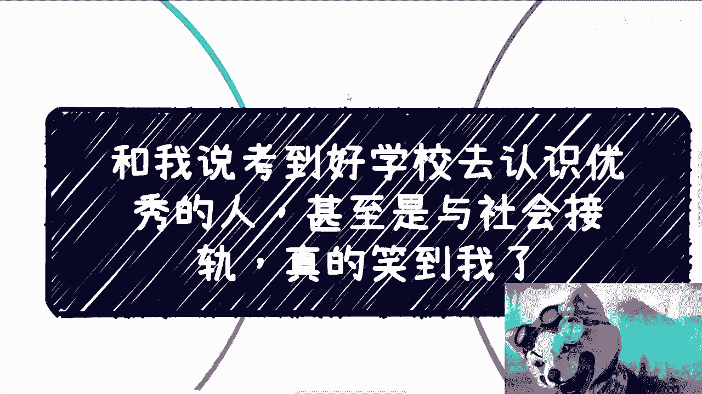
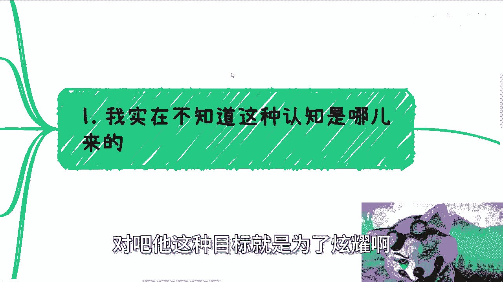
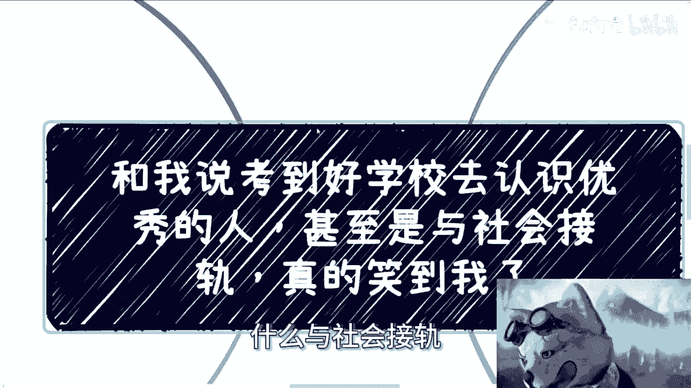
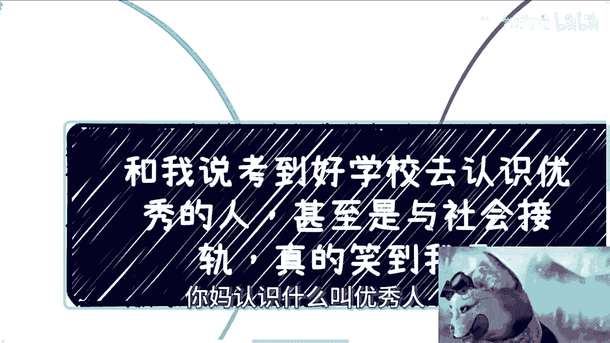
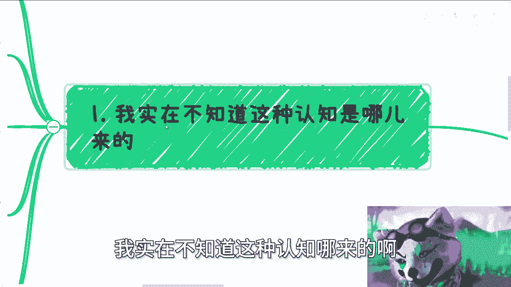
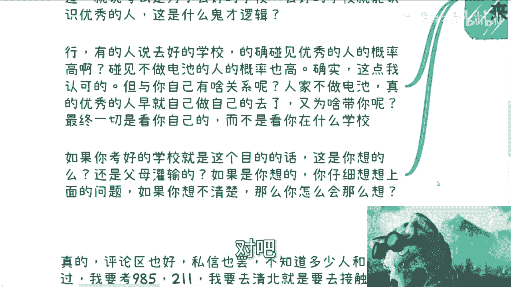
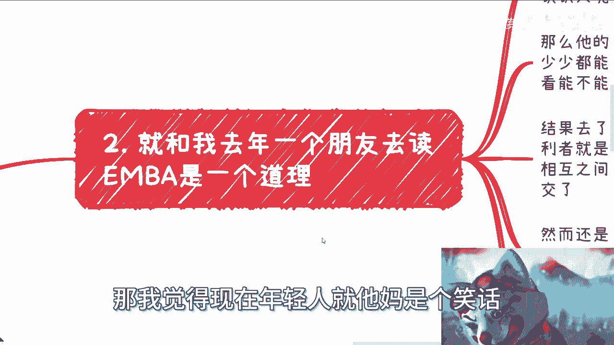
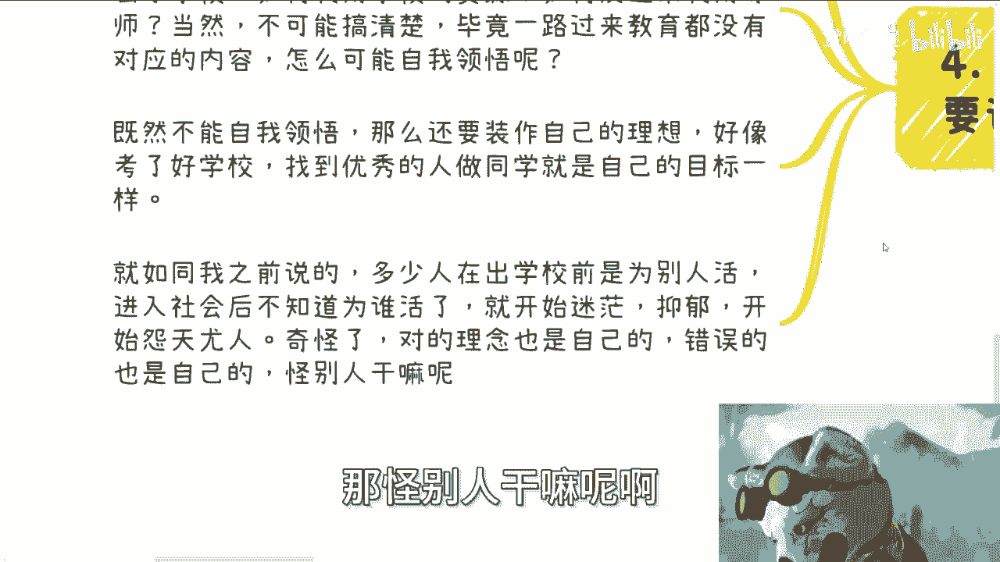
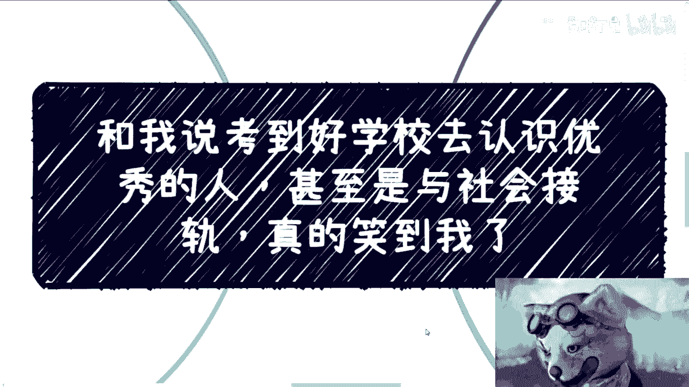
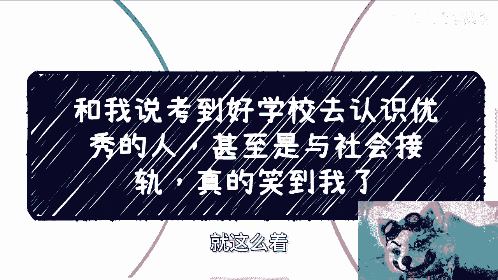

# 考去好学校是为了认识优秀的人，与社会接轨，真的笑到我了 - P1 - 赏味不足 - BV1SU421Z7Hw

啊大家好啊，这个今天哎今天礼拜几啊，今天还是礼拜一啊，我只是想把明天的路来嗯。

给你们讲个有趣的事啊，这两天这个朋友，这两天这个评论区有一个人是这么说的，但是现在就被我拉黑了，他说什么，他说啊，你作为一个聊天博主对吧，请你去换个麦啊，怎么样怎么样，他妈你妈才是聊天博主。

全家都是聊天博主啊，爱听不听我操滚对吧啊。

嗯我们今天说的这个主题啊，叫做这个不少人啊，其实跟我说考到好的学校啊，是要去认识优秀的人啊，甚至呢是去社会接轨啊。

我跟你讲这话真的是笑到我了吗，笑得我他妈牙都掉了啊，牙都掉了，就首先啊第一点啊，我实在啊，我这么说吧，我先下结论啊，就是这种话说出来就他妈扯淡啊，这种话说出来就是装逼啊，除了就是他的目标去了这些学校。

去了这些大厂对吧，他这种目标就是为了炫耀啊。

没有别的哎呀这种什么什么人是优秀的人，什么与社会接轨。

你妈懂个屁呀，很优秀的人还知道接轨呢，我就问嘛，他妈认识什么叫优秀的人。

什么叫接轨啊，懂不懂啊啊不懂的吗，他说个屁啊，对不对啊，我实在不知道这种人是哪来的啊。

你比如说你去考好的学校，你就能碰到优秀的人了啊，OK好那我就问你什么叫优秀的人啊，能很好的学习，很好的考试就叫优秀的人吗，啊这叫优秀的人了，那那你照照你这么个说法，那就是说所有的啊读书好的啊。

考试能考满分的都叫优秀的人啊是吗，哼奇了怪了好行，我们退1万步来讲，退1万步来讲，就算你说的这个教育优秀的人，那我继续问啊，你认识这些所谓的优秀的人，请问你能帮他干嘛呢，他们又能帮你干嘛呢，对吧好。

就算你们能合作，我他妈退再退2万步来讲，你就算能做，请问你们能做什么呢，啊啊你几乎什么都不知道，我敢打赌这些问题问出去谁知道对吧，哦你什么都不知道，你就说啊，我考试就是为了去好的学校。

去好的学校就要为了认识，又是有人，这他妈什么鬼逻辑啊，对吧行好，有的人说去好的学校呢，的确碰见优秀的人的概率高对吧，就跟很多人面试的时候说啊，我们要去面试这个呃，我们只要硕士的，不要本科跟专科的。

为什么，因为我们想碰到优秀的人，概率高对吧，好没问题没问题啊，好没问题好，碰见不做电池的人概率高对吧，的确啊，这点我也认可的好，但我就问这跟你有什么关系呢，哎奇了怪了，哎人家不做电池，人家觉悟高。

那真的优秀人早就自己干自己的去了，为啥带你呢，跟的有什么关系呢，那为什么奇了怪了，对不对，那这你你要说了，那那我牛逼啊，我优秀你优秀诶，那你优秀你你倒是你优秀，你会说出上面这段话吗，对不对。

啊所以说本质上他看你啊，他看的是你在什么学校吗，啊如果你考上好的学校，就是这个目的，那如果这是你想的啊，还是说是你父母灌输的啊，假设这个是你你讲的，你仔细想想上面这些问题，如果你想不清楚，那么你会怎么。

如果你想不清楚，那么你想想看你到底怎么个想法对吧。

真的就是自欺欺人，这好玩也是蛮好玩的。

你知道吗，就跟他们跟我说考公是一个道理，我就问他，你考公干嘛呢，我想有个稳定的，那我说你怎么教的，你知道什么叫稳定吗，不知道对吧，你要包括就是包括就是跟我说，哎我想读个研，那我说读个研干嘛呢。

哦为了未来能找到更好的工作，那我说你读了研就能找到更好的工作吗，哦这好像也不一定，我真的我觉得就就就我觉得啊，如果说现在世界是个草台班子，那我觉得现在年轻人就他妈是个笑话啊。

就二啊，就跟我去年一个朋友去读研。

别啊它是一个道理，我朋友当年这个兴高采烈地去读了啊，当然他目的是什么呢，当然也不是去为了学习的啊，是去认识人的，那为什么要去花钱认识人呢，简单逻辑很简单，因为自己没有呗，对吧啊。

那么他的想法就是呢一个班级40多个人啊，自己多多少少都能认识一些人，然后去讨论讨论认识认识，然后看看能不能拓展一些新的商业机会对吧，好结果呢就跟那个笑话一样，就说什么就说哎你今天进了一个群啊。

除了群主以外，剩下498个人都是托儿吧，结果去了发现其实每个人都这么想的，他妈奇了怪了对吧，那你想想啊，你说我想过去认识大佬啊，然后你会发现他妈的一个班级40多个人，他妈都是这么想的。

哎那结果最终得利方是谁啊，那当然是半学方了对吧，那他钱赚到了，你们你们来是什么目的，跟他有什么关系啊，对啊，你说大家都是抱着这个目的来的啊，那么发现其实相互之间也都是来这个，获取对方的信息。

或者说是来抱对方大腿的，那结果结果怎么办呢，没有大腿给你们抱对吧，然而还是那个道理啊，那就算班级当中有那么一两个真的有积累的，有关系的，有事业的大佬怎么了呢，哦就因为你花了这点钱读了个书，大家就合作了。

这大佬也太不值钱了是吧，所以啊这个就跟你们去高校是一个道理，核心不在于你是什么地方，在于你自己啊，很多人去高校去大厂，为了什么，为了一个名为了嘴上说爽啊，为了过年的时候马上过年了对吧。

为了过年的时候跟亲戚炫耀，但是然后呢我就问，然后呢对吧，就是你父母跟你这么讲，他是希望看到你就是考进去啊，看到你进去他就开心了，但是之后的困难呢，之后的人生呢他关心吗，他也许关心，但是他关心不到啊。

对不对，那我就问了，那那那这种事情做了干嘛呢，难道我们活着就是只为了图了一个虚，完完全就图个壳子啊，图图个图个，这个为别人的这个这个炫耀而活着啊对吧，那那我就说啊，有很多人说啊，去了这个高校。

去了大厂啊，这个很多事情概率会高一点，对不对，但其实所谓的机会不还是跟你有关吗对吧，但他就说跟你这个人有关系，跟你去哪，有他妈什么直接关系没，有没有啊，对吧啊，第三还有就是说跟社会接轨的。

我跟你讲这个东西就他妈更笑死我了啊，就是我倒是很感兴趣啊，你去了好的学校哎，怎么就与社会接轨了，唉你去了不好的学校，怎么他妈就不接轨了，我也不明白了，对不对，好，那怎么接轨哈。

我猜测啊他们的意思是这个意思啊，就是说我去了好的学校啊，我做了好的项目啊，我能够用，我能用我我好像好的学校就有更多的经费啊，我也不知道这个逻辑怎么出来的啊，就是他说我能我能有更好的实验设备啊。

我能更更更好的导师啊，能参加更多的竞赛啊，能发挥多的paper啊，好可以，没问题啊，没问题好，还有些人呢觉得潜台词可能意思就是说啊，能抱更广的大腿啊，他也不好意思讲，然后说不定就能做项目融资啊。

从而迎娶白富美对吧，好好好好好，我跟你们讲啊，同学们啊，我们在2024年啊，别把2010年的梦啊放到现在来做，明白没有啊，听得懂这句话什么意思吗，好然后我上面给你们讲的这些东西。

我来给你们翻译一下什么叫接轨啊，能获取到更多在未来商业上，根本TMD没有任何卵用的证书跟名次啊，然后能够给更多看上去，也许很牛逼的老师做工具人跟电池，然后被那些老师白嫖，从而帮助那些老师赚到更多的钱。

更多的钱帮助老师迎娶白富美，听得懂吗啊，听得懂吗，啊当然有人要说了啊，我们就是讲去好的学校看一些更优，看更多所谓的优秀的人对吧，更多这些人啊，他们怎么学习的，怎么看人生的怎么样对吧。

就是想对接更牛逼的导师，OK我觉得没有问题啊，你们的目标一点都没有问题，但是就不要用什么与社会接轨，这种鬼话去骗自己或者骗别人对吧，你能接到个啥啊，我告诉你们，你们他妈在高校做的所有东西。

在商业上一文不值对吧，我当然前提有的前提是什么，就去头去尾对吧，我们不能一刀切对吧，你比如说有很多纯粹的学术研究有没有价值，有的啊，你比如说光刻机啊，火航天航空有没有研究价值，有的，但这才多少比例啊。

啊不要拿那些个例来讲东西对吧，剩下的那些有什么价值啊，有P价值，好那么最后是什么，就是明明呢很多东西就是被灌输的，他他妈还要非要说自己的，我跟你讲，这就很秀啊，那就很秀啊，真的啊，评论区也好，私信也罢。

就是不知道多少人跟我说过了啊，我要考98521，我要去清北，就是为了接触更优秀的人啊，多少人我就问了多少的人，真的搞得清楚自己感兴趣是什么吗，真的搞得清楚去了学校如何利用学校资源吗。

或者说如何反过来利用导师的资源吗，当然也不可能搞清楚为什么，因为毕竟9年制义务教育加加一路，这个这个教育过来，怎么可能搞得清楚呢，你们没有接受过任何对应的内容，怎么可能搞得清楚呢，能靠自我领悟吗。

啊靠自我领悟，那我觉得真的就叫凤毛麟角了对吧，那么既然不能自我领悟，那何必要装作自己的理想呢对吧，好像考了一个好的学校，找到优秀的人做同学啊，就是自己的目标一样，或者说找到优秀的人做同学。

好像这辈子就稳了一样稳吗，哎我就奇了怪了，你这辈子的吻是靠别人的，不是靠你自己的啊，啊那么就如我就如同我之前说的，多少人在出学校前啊，他是为别人活，进入社会后，这个别人就不存在了。

他就不知道为谁活了对吧，从而开始迷茫，开始抑郁，开始怨天尤人，哎那我就奇了怪了啊，咱不管之前的这个你，你们你们很多人脑子里面的理念是对是错啊，这个对的理念也是你们形成的错的理念。

我不管是错误的接受别人的想法，还是说是被别人PUA，还是被你们父母的教导，我不关心是哪个东西，但是这错误的理念是不是也是你们自己接受的，对吧，所以说不管对的还是错的，其实本质上还是自己的问题。

那你给怪别人干嘛呢。

啊啊啊怪别人干嘛呢，对吧对吧。

所以说啊就是说我为什么前两天会跟你们来讲，应试教育，我又为什么现在要跟你们讲自己，是因为应试教育本，讲应试教育本身，是为了让大家明白客观的情况啊，客观的环境以及它的弊端在什么地方。

说自己的问题就在于说整个大环境，我们改变不了，我们能改变的只有自己，对吧哦，我们因为每个人往前走要做到的是什么，就是既要客观的很通透的看到全局是什么样子，也要很客观的明白有哪些事情自己是不行啊。

自己有缺点，自己有短板要去补的啊，不是说一味的不顾大局去去所谓的提升自己啊，怎么看书啊对吧，学习自己什么什么，充实自己，也不是一味的不顾自己，就看外面，我的外面这个吊样子对吧。

然后外面这种这么垃圾的情况对吧，我不好是有道理的，都没有用的。

明白吧，唉真的我也不知道，很多时候真的真的我刚刚为什么说，就觉得是个笑话，就是就是很多这个话说出来，你就会觉得匪夷所思，就是就是这哪里像一个本科硕士说出来的话，这哪里像一个20多岁的人说出来的话。

就哎叫什么叫离谱，他妈给离谱开门对吧，离谱到家里啊，唉呀行，就这么回事啊，嗯反正剩下的，反正大家要是有任何详细的问题好吧等等，这个在社会上或者在工作上，碰到一些具体的一些问题，你们总结出来。

我们在做咨询好吧，简单的话你们要是觉得有什么要问我的，你们就私信问我好了，就就就就OK。

