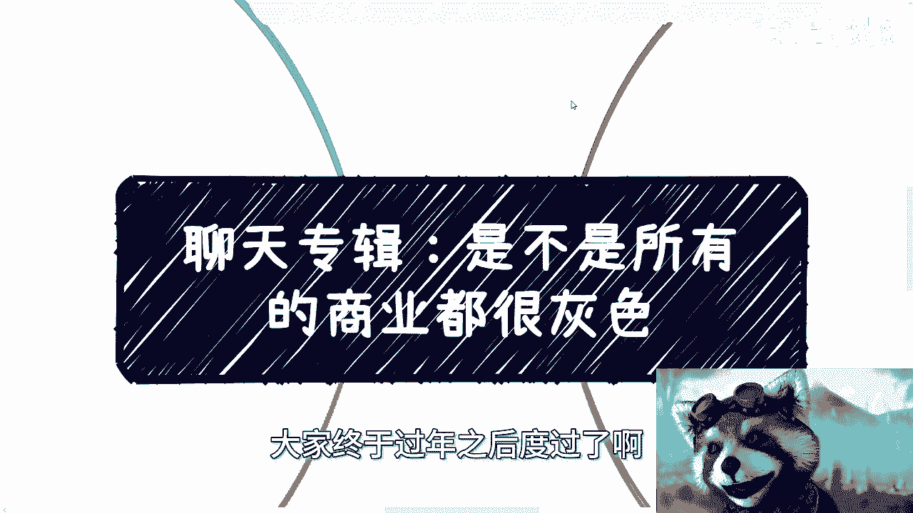
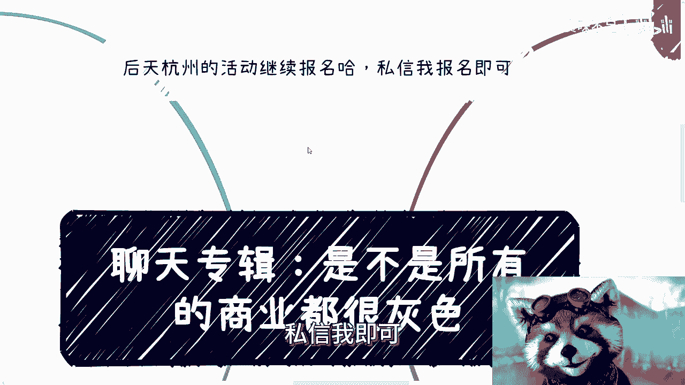
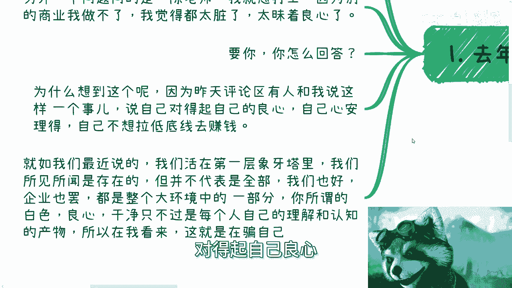
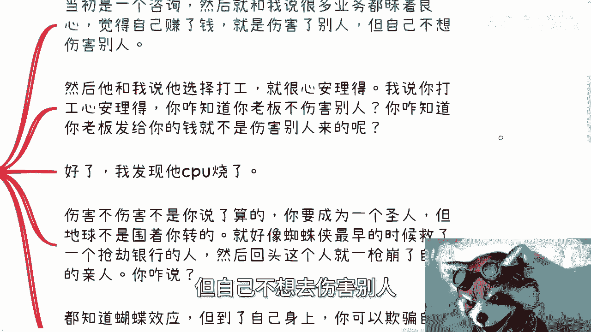
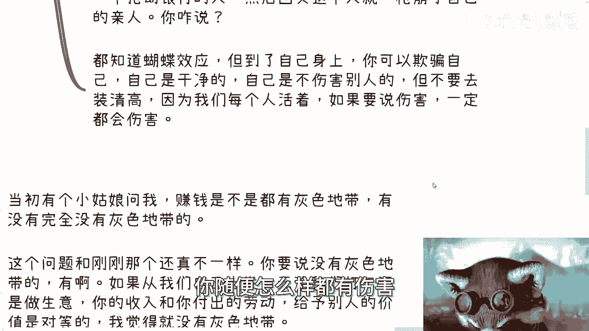
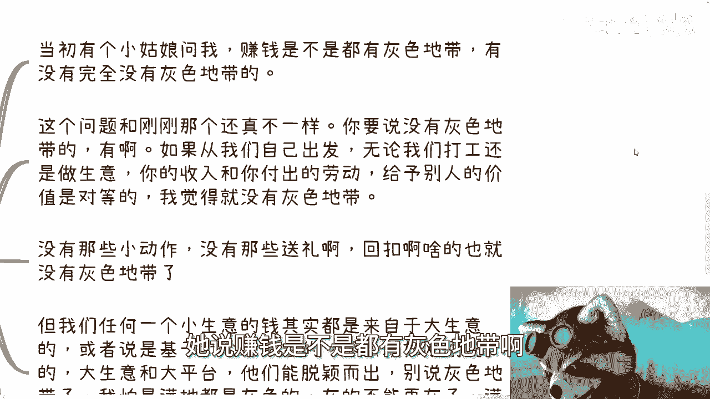
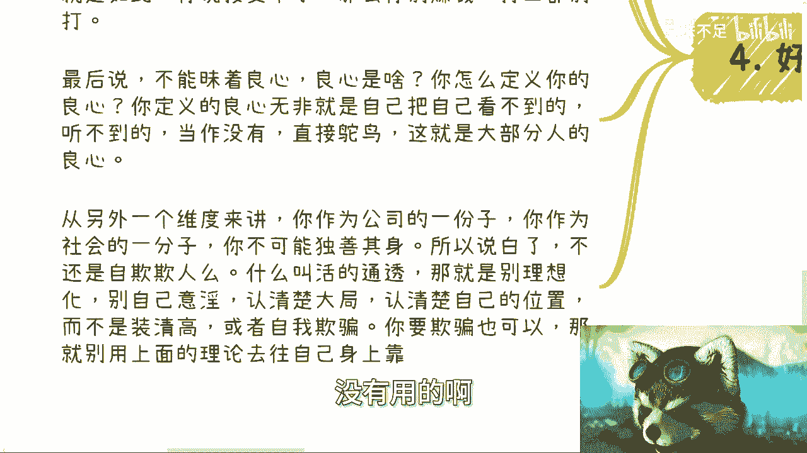

# 聊天专辑：是不是所有的商业都有灰色地带 - P1 - 赏味不足 - BV1cZ42127ao

好啊，我们继续来这么延续过年时候的聊天专辑啊。

嘶哎呀，今天终于到周五了是吧，虽然我不上班啊，但是还是庆祝一下，大家终于过年之后。

度过了比较艰苦的上班的时间啊，呃首先后天杭州的活动继续报名好吧，然后私信我的就报名私信我即可好吧。

然后今天这个聊天专辑呢讲的是说啊，就这个标题写的是。

是不是说所有的商业都是灰色的，但是呢这个主题并不仅限于此啊。

那么首先先说这么几个问题啊，去年有这么几个问题啊，也不是两个啊，一个说问我，他说陈老师是不是所有的商业都是灰色的啊，或者说都是这个叫什么啊，有这些有一些见不得人的地方啊，啊然后是不是有没有不灰色的啊。

白色干净的对吧。

那另外一个问题问的是陈老师啊，我就想打工，那我问他为什么，他说我去赚别的钱吧，就感觉是不是伤害了别人啊，因为我赚钱了，总有人亏钱啊，我说好好没问题啊，然后他说我就觉得太脏了啊，他还昧着良心啊。

好啊可以你看啊，你看啊，这两个问题要你怎么答，你们先想想看这两个问题怎么答啊，然后呢为什么想到这个呢，因为昨天微博的评论区啊，和我说这么一个事儿啊，他说呃他说自己呢对得起自己的良心。

自己心安理得啊，自己不想拉低底线啊，去赚钱，好好没问题啊，这假装我们三个问题都说了对吧，那么就如我们之前说的，我们大部分人活在第一层象牙塔里面，我们的所见所闻是不是真的是的，但是来自于网络。

网络代表着什么，代表着幸存者偏差啊，好那么我们也好，个人也好，企业也罢，在整个一个大环境里面，我们都是尘埃对吧好，那么你所谓的白色，你所谓的干净，你所谓的良心，你想想看啊。

他只不过是每个人自己的理解和认知的产物啊，为什么，因为你不可能独善其身，你活在这个世界上，你怎么独善其身，你只能围着世界转，世界不围着你转，对吧好，那么所以说我先说结论。

这个所有上面这些东西，你可以认为没有，你看不见。

听不到，但是不好意思对吧，这就是骗人的啊。

那么我们先说第二个问题，当初是一个咨询，然后就跟我说啊，很多业务都昧着良心赚自己赚的钱啊。

觉得自己赚了钱就是伤害了别人，但自己不想去伤害别人。

然后他就跟我说啊，他说我选择打工啊，就很心安理得，我说你打工觉得心安理得，你怎么就知道你老板的钱干净呢啊，你怎么就知道你老板不伤害别人了，怎么就知道你企业不伤害别人呢，啊我就问你。

我说我说但凡任何一个就人类社会上面啊，人类这个世界上面，你企业有活是怎么活的，都是踏着尸体活上来的，你以为怎么活的啊，怎么可能没有伤害。

怎么可能没有竞争呢，好我问了他之后，然后我发现他CPU烧了啊，他CPU烧了，可能他CPU本来就那个果仁这么大啊，那么伤害不伤害呢，我觉得不是你说了算的啊，就是你可以成为一个圣人啊。

你可以说啊这个自己独善其身，自己多么的高尚高级呃，那个清高对吧，怎么样子，但我刚刚说了，地球不是围着你转的，这就好像对吧，蜘蛛侠，蜘蛛侠最早最早的时候救了一个抢银行的人，而不是抢银行啊。

那个抢那个电影里面是那个抢那个叫什么，就拳击比赛那个地方对吧，抢去抢劫那个人，然后回头对吧，这那那那晚上还没过呢，当天晚上那人就一枪崩了，你自己的亲人，你咋说呢，你怎么说，是吧。

那么就是说所有人都知道蝴蝶蝴蝶效应，但是你到了自己身上呢，你可以欺骗自己，自己是干净的啊，自己是不伤害别人的，是你手不沾血就叫干净，你想想看成不成立对吧，你但但我觉得这样子，但是你不要去装清高。

你不要装的自己很干净，有什么意义呢，因为我们每个人活着，你活着就是一种伤害，你肯定有伤害，你随便怎么样都有伤害。

就这句话嗯好。

然后诶我这里竟然没没有标标，第三个啊好，然后再来说第一个啊。

那么当初有个小姑娘当时问我这么说的，她说赚钱是不是都有灰色地带啊。

有没有完全没有灰色地带的啊，那么这个问题跟刚刚那个难，他还真有点不一样啊，就是你要说没有灰色地带有的啊，不就是有这种干净的地方的，什么有呢，就是比如说你从我们自己出发，打比方你打工做生意。

你的收入跟你的付出的劳动是成正比的啊，给予别人的价值也是对等的，比如说我举个例子，你今天给别人去做知识付费，你就是点对点的啊，没有什么老板，你就是老板啊，你给别人提供一些服务，别人给你一笔钱。

我觉得这个东西可以你可以，这么理解我觉得没有问题啊，就是我觉得单纯从这个业务模式上面，他没有灰色地带没有问题的啊。

而且嗯比较单纯的商业模式里面，也没有一些小动作，没有什么送礼啊，没有什么回扣啊，什么都没有，存不存在存在的，但是你要再往外放一层，那又变成了刚刚那个问题，就是我们任何一个小生意的钱，其实都来自于大生意。

你做一个小齿轮都来自于大齿轮，那么或者说你基于一个大的平台，你就我们随便打，比方说你说你今天做知识变现，你要不要基于微信，你要不要基于小红书，要不要基于B站，要不要基于其他的一些平台，那么我就问。

就如刚刚所说的，大声音跟大平台，他们能脱颖而出，你别说灰色地带了，我他妈怕是觉得满地都是灰色的啊，都是黑的啊，你你黑灰的已经黑掉了，你满地图都是小动作，你你又能说什么呢，对吧，所以说我们看问题。

这就看你怎么看这个问题，你得看这个问题的角度，你不能说啊，我们就是那就还是那句话，就是说我们平时吐槽可不可以可以，你说你能不能站在道德制高点上，批判别人也可以，但是有一点不可以是什么。

就是你不能觉得哦别人好像很脏，我自己不脏，因为我没有做，不好意思，你做不做你都脏明白，所以说第四点就是最后一个。

那你说啊，其实就是跟很多那种咨询我的人是一样的，就是他们会这样跟我说，他说他说陈老师，我觉得我这个拉向底线呢拉不下来，然后呢很多这种商业模式呢，我三观也不接受，或者说我不能昧着良心啊，好那么问题来了。

我们从两个角度来讲这个问题，第一个角度，你的底线是什么，难道是不割韭菜吗，那我就问你这句话，你可以这么讲，那我就问你什么叫割，什么叫不割，你怎么定义割啊，你说三观接受不了好，那么世界的本质，商业的本质。

金融的本质，商业的本质，它本来就是这样子的，或者说本来很多时候你活在这个世界上，这个世界本身他就是三观接受不了的，你说你接受不了，那你别赚钱，你别打工，你什么都别干，你接受不了。

那么最后说你不能昧着良心，我就问我就问良心是什么，你给我定义一下什么叫良心，你定义的出来吗，你定义的良心无非是就像我刚刚说的，无非是把你自己看不到，听不到的感觉不到的，假装当做没有，假装跟你没有关系。

直接鸵鸟，这就是大部分人的良心，我们从另外一个角度来讲，你作为公司的一份子，你作为社会的一份子，你不可能独善其身啊，就是所以说白了不还是自欺欺人吗，什么叫活得通透，什么叫你要活得明白，那就是不要理想化。

不要自己意淫，认清楚大局，认清楚自己的位置，而不是装清高或者自我欺骗，你要欺骗可以，但是别用上面的理论，就是用上面那些什么哎呀好像我很干净，哎呀，我很有良心，这种理论往身上贴没有意义的，没有用的啊。

所以说所以说啊，就是说我觉得我告诉大家这个点啊，不是说让大家去反思。

没什么好反思的，而是说得要明白，这个世界不是非黑即白的啊，不是说啊今天一块地方特别干净，一块地方就是纯黑的，不存在的好吧，所以就像那期讲什么乐观悲观是一个道理，就是不要盲目的去理解一些事情。

不要盲目的去拉高自己，就是自我定位，因为为什么，因为你盲目拉高大概率你只会被骗，大概率，你只会让就是让自己陷入到那种Emo的，那个那个那个什么情绪当中，因为你会觉得你受到的冲击很大。

但是你有没有就是大部分情况，你有没有发现你受到冲击，很大的原因是因为你自己把期待拉的太高，你把整个整你，你你把整个就是虽然你不了解整个社会，但是你把整个社会幻想成一个怎么样，怎么样的一个状态。

然后你受到了冲击，然后你说爱陈老师，我心情不好，我情绪不好，我受不了，那他妈怪谁呢，对吧，啊所以说就是我们就说啊，不管我们看什么东西，你客观的去看待，你就会发现其实很多事情你不但格局很大啊。

你也不会受到太多的冲击，你的情绪是稳定的多好啊对吧，你也你也不，当然你守得住底线，你也不会去割别人，你也不会被割，有什么不好呢，好啊就这么着吧，啊嗯嗯杭州报名的，你继续报好吧，然后那个反正别的有什么的。

你们整理好问题。