# 聊天专辑 P1：内卷的恶性循环 🌀

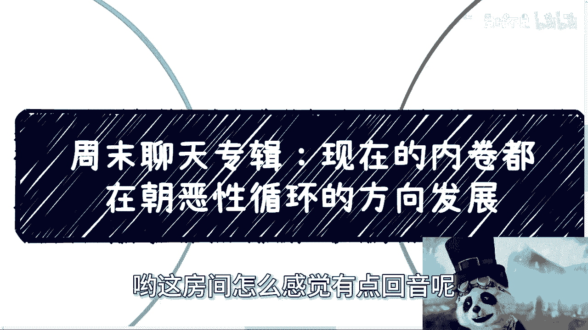

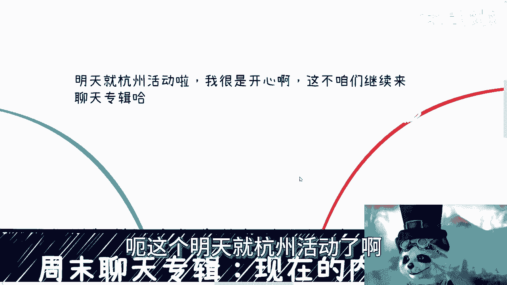

在本节课中，我们将探讨当前社会与职场中普遍存在的“内卷”现象，并分析其如何演变为一种恶性循环。我们将从商业、职场和个人发展等多个角度，理解这一现象的本质及其带来的负面影响。

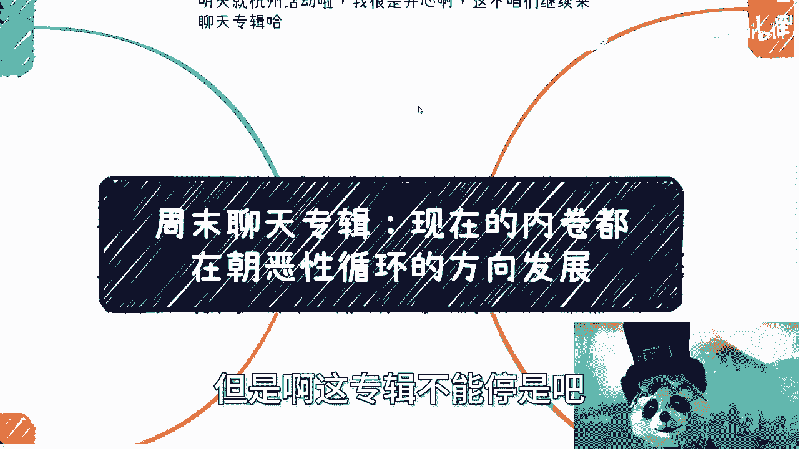

---

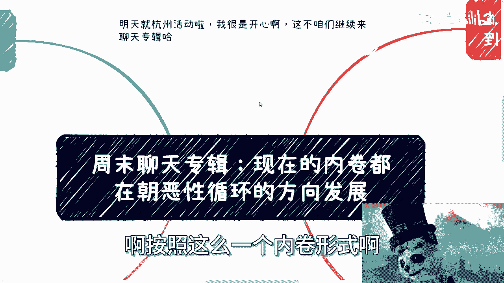

## 概述：内卷的现状与本质

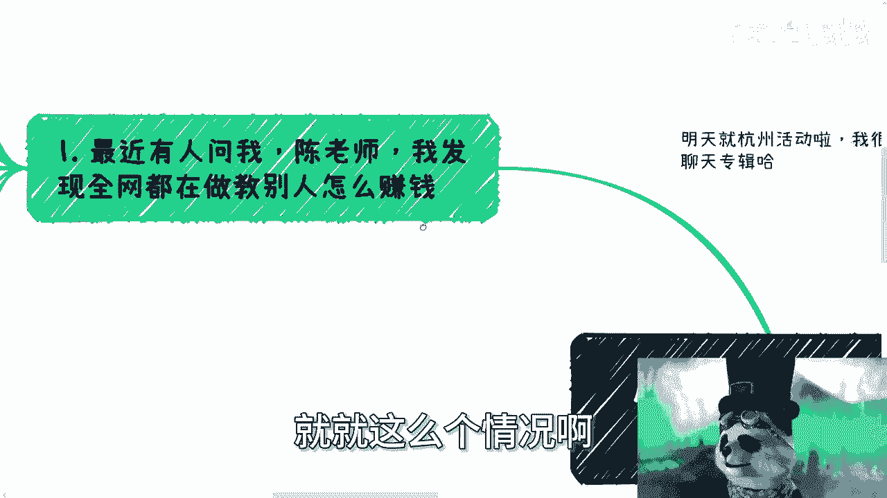

当前的内卷现象正朝着恶性循环的方向发展。按照这种形式继续发展，最终可能导致集体性的困境。

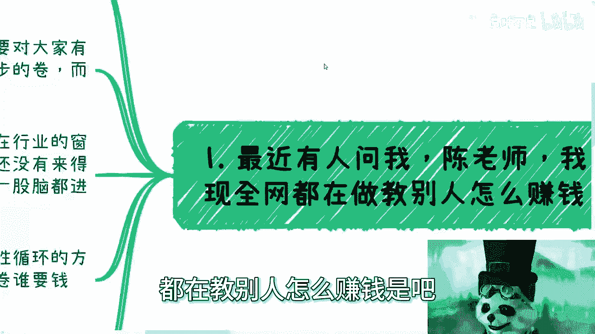

最近有人提出，发现全网都在教别人如何赚钱。这背后的逻辑是：教别人赚钱本身才能赚钱。在商业中，不必忌讳从事诸如“卖水”或“卖铲子”这类业务。因为一个商业项目本身能否成功未知，但在其发展过程中，提供基础设施或服务的环节往往是成功的。

---

## 一、 商业领域的恶性竞争

上一节我们提到了商业中的机会主义，本节中我们来看看这种心态如何引发恶性循环。

中国的部分从业者如同鲨鱼，只要闻到一丝血腥味便会全部围拢。只要看到某个领域能赚钱，便不顾一切地涌入。很多人会考虑自己是否懂行、是否有积累，但更多的人根本不关心这些。他们看到能赚钱就立刻跟上。

这种“卷”本身并非完全负面，但关键在于是“正向的卷”还是“负向的卷”。正向的卷能推动大家共同进步，负向的卷则可能将整个行业拖向毁灭。

例如，在与数据交易所交流时，对方提到现在行业的窗口周期越来越短。因为一个行业还没来得及起步、积累和发展，好的、坏的、优秀的、劣质的所有参与者便一股脑涌入。结果往往是一地鸡毛。

**行业周期公式**可以简化为：
```
传统健康周期 = 起步期 + 积累期 + 发展期 （约5-6年）
当前恶性周期 = 混乱涌入期 + 信誉崩坏期 （可能短至5-8个月）
```

原本需要五到六年发展周期的行业，现在可能连一年都没有，短短几个月就因恶性竞争和信誉问题而衰败。当大家都觉得行业里充满骗子时，这个行业便难以健康发展。

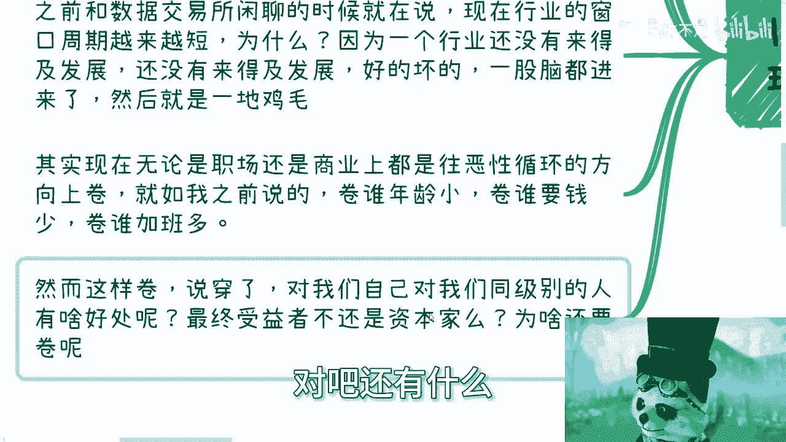

---

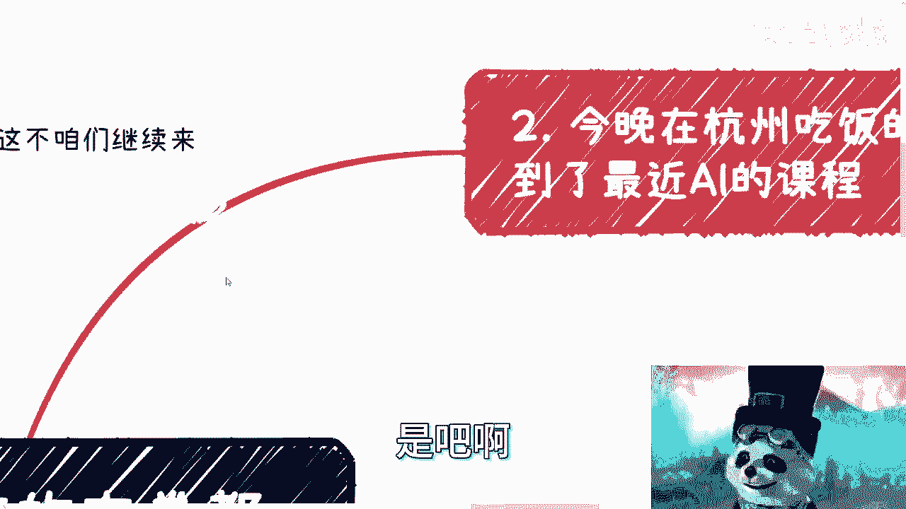

## 二、 职场内卷的扭曲形态

不仅在商业领域，职场中的内卷同样陷入了恶性循环。

以下是职场中几种常见的扭曲内卷方向：
*   **比谁年龄小**：追求更年轻的劳动力。
*   **比谁要钱少**：竞相压低薪资期望。
*   **比谁加班多**：将过度工作视为美德。
*   **比谁更“豁得出去”**：包括不顾体面或过度奉承。

这样内卷的结果是，对同级别的同事没有好处，对普通大众也没有好处。最终的受益者可能只有资本方，以及少数善于在这种环境中钻营的人。

---

## 三、 行业内的相互倾轧与“吃人血馒头”

除了直接竞争，行业内的相互攻击也成为恶性循环的一部分。

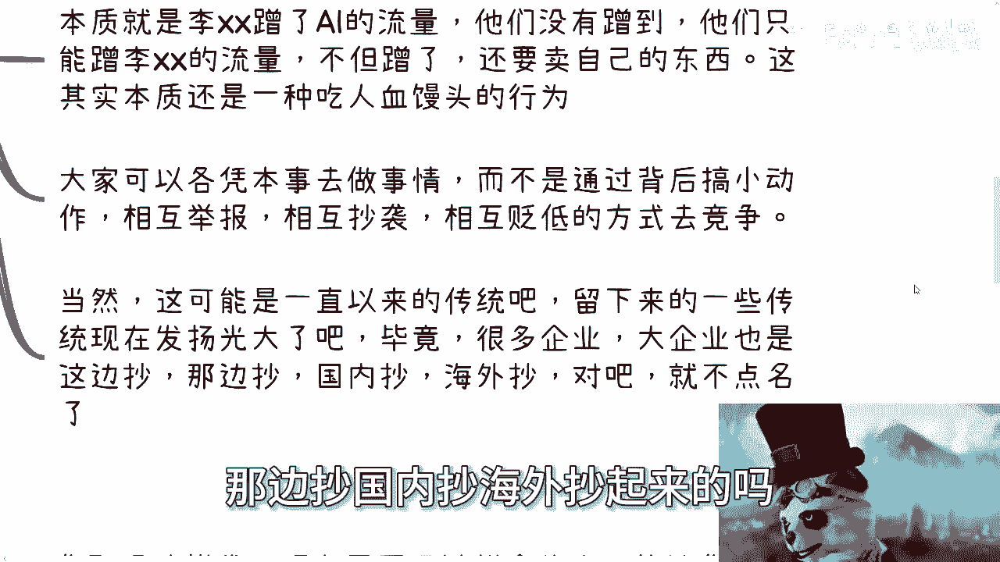

最近围绕AI课程出现的许多评价，实际上已演变为诋毁、抹黑和落井下石。评价本身是正常的，但问题在于，许多人在批评他人之后，紧接着便推销自己的同类课程。

其逻辑是：“某人不行了，那谁行呢？我行，所以你要买我的。” 这种行为本质上是：A蹭了主题的流量，B没有蹭到，于是B转而蹭A的流量（尤其是其负面流量），并借此推销自己。这与“吃人血馒头”的行为没有本质区别。

大家可以各凭本事竞争，但不应该通过背后搞小动作、相互举报、抄袭、蹭热度、贬低对手的方式来进行。然而，这某种程度上已成为一种“传统”，回顾很多大企业的发展史，也能看到类似模仿与竞争的影子。

---

## 四、 个人在恶性循环中的困境与风险

这种全方位的恶性内卷，最终让每个参与者都面临巨大压力。

在职场中拼命内卷，实际上是用个人的健康和时间去博弈。每个人的情况不同，一生的时间和健康是有限的。拼命之后能得到什么？谁能保证不会留下一身病痛？年轻时或许感觉不到，但后果最终需自己承担。

这就引出了“电池理论”：大部分人像电池，且是一次性电池，无法充电，耗尽即废。

在商业上也是如此，做什么都有人模仿，虽然可能不正面冲突，但背后小动作不断。其中，“举报”是一种需要特别警惕的风险。对于只想安稳工作的人，它可能很遥远；但对于任何想自己折腾点事情、需要露脸和宣传的人，在未来两三年内，很可能会亲身体验到“举报无处不在”。你需要防范竞争对手、合作伙伴，有时甚至要防范自己人。

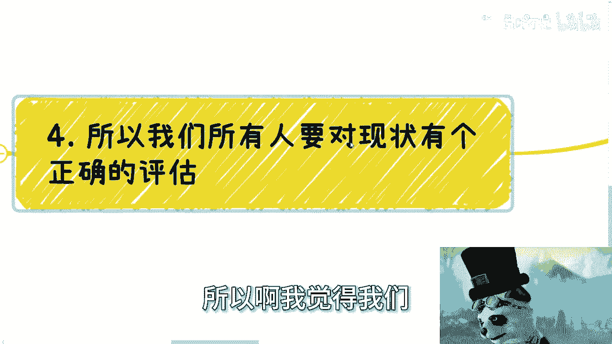

有小伙伴曾问，做面向消费者的业务（C端）是否比做企业（B端）或政府（G端）业务更容易。实际上，只要是为自己赚钱（而非打工），就没有绝对的难易之分。这不是解数学题，会或不会那么简单。C、B、G端各有各的难点和容易点。关键不在于难度，而在于**风险评估**。选择哪个领域，决定了你将在何种环境下生存。

---

## 五、 如何应对：评估现状与强化自身

面对这样的恶性循环，我们需要对现状有清醒的认识，并调整应对策略。

“狼来了”的故事喊多了，人们就会麻木。前几年总有人说“今年是最差的一年”，听多了就像老生常谈，被认为是贩卖焦虑。但现在，形势确实严峻，且尚未触底，公众也普遍焦虑。此时若再有人发出警告，可能反而没人相信了，因为大家已经“皮掉了”。

信或不信宏观判断，其实都无法改变大趋势。因此，更重要的不是盲目相信或不信，而是**不要套用过去的逻辑**。无论是父母建议考公，还是朋友推荐去大厂，或是某种创业赚钱的方法，同样的方式在不同的时代结果可能截然不同。

但有一种东西是共通的，那就是**背后赚钱的核心逻辑**。在当下，这对个人提出了更高的要求：社会需要的是**强大的执行力和自学能力**。

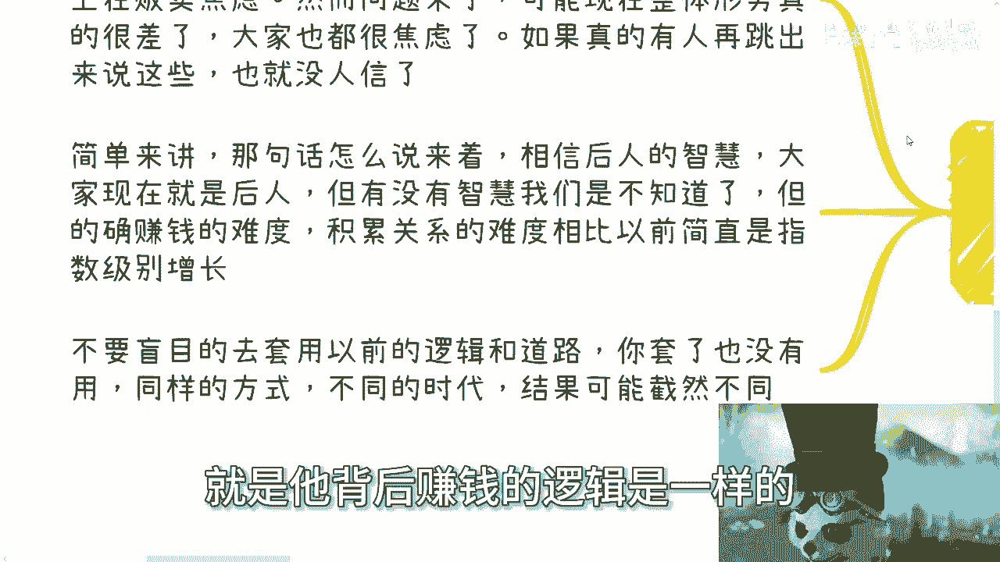

以下是评估自己能否适应并突破的关键点：
*   **强大的自驱力**：能否几年如一日地坚持、冲刺、探索？
*   **持续的热情**：能否保持专注，而非三天打鱼两天晒网？

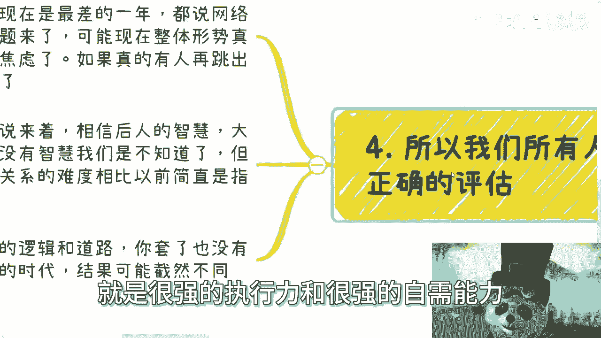

明确地说，无论当下热情多高，如果执行力与自驱力不足，很难取得成功或赚到钱。

---

## 总结与出路

本节课我们一起探讨了内卷如何演变为一场恶性循环。从商业的一拥而上到职场的不健康竞争，从行业的相互倾轧到个人面临的高压与风险，整个环境仿佛所有人都在抱团从一个高空坠落。

何时着地、何时爆炸未知，但大家都在其中。你是否要成为其中一份子？不参与内卷，并不等于能自动脱离这个循环。只有**逆流而上**，才真正有可能脱离恶性循环。如果只是顺着大潮流去卷，那么“没有一片雪花是无辜的”。

最终的出路在于：认清现状，放弃过时的路径依赖，评估自身风险承受能力，并极度强化个人的**执行力**与**自学能力**。在混乱中保持清醒，在洪流中尝试逆向而行，或许是打破循环的唯一可能。

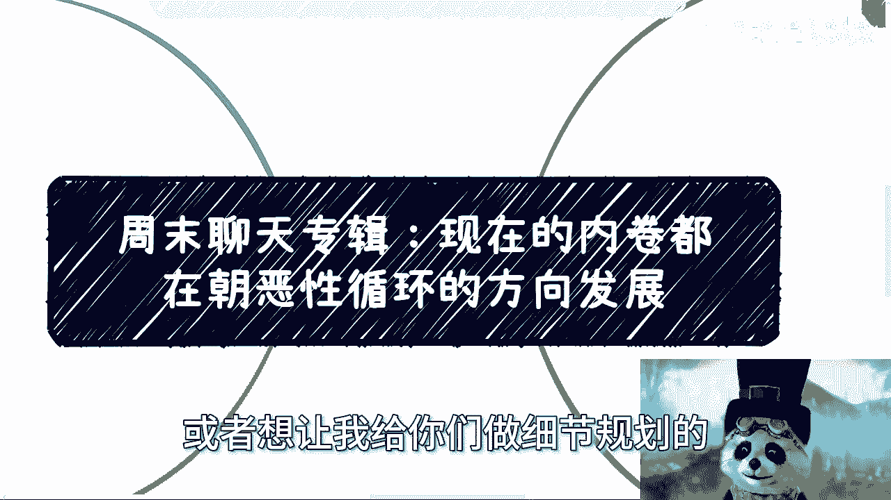

---
**课程预告**：后续将涉及商业、职业规划、合同、商业计划书、股权分配等更多具体问题的探讨。