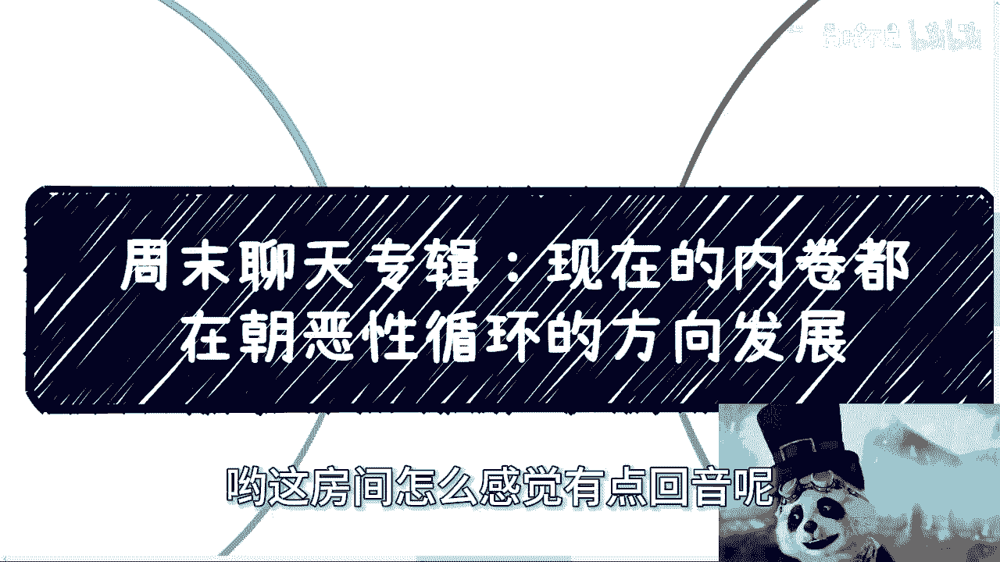
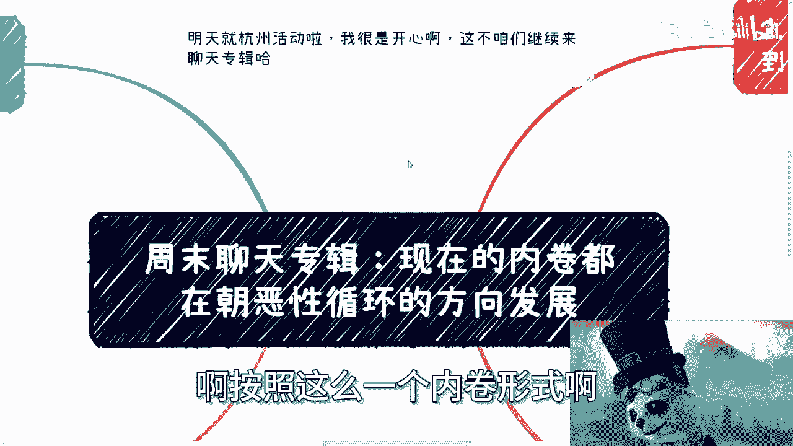
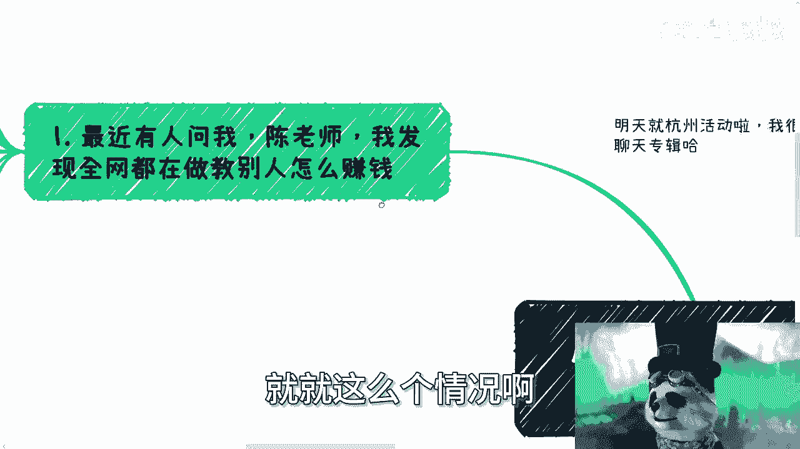
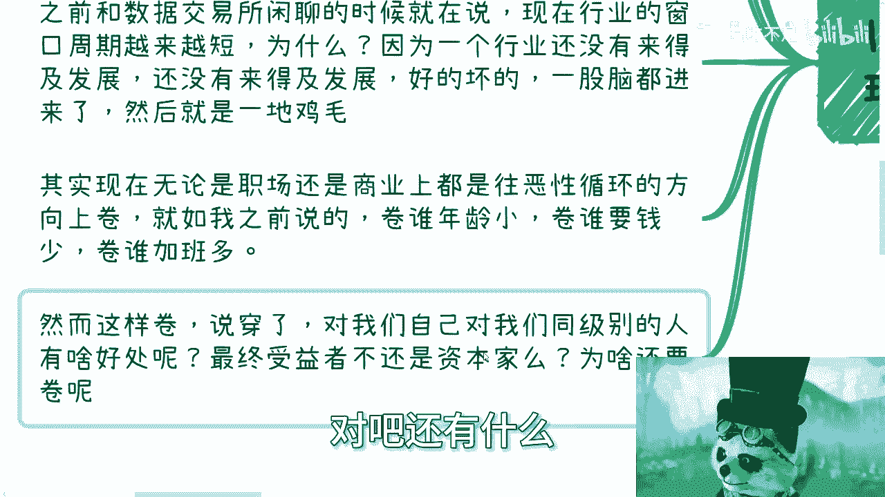

# 聊天专辑：现在的内卷都在朝着恶性循环的方向发展 - P1 - 赏味不足 - BV1bH4y1L757

哈喽大家好哟，这房间怎么感觉有点回音呢。

啊没事，就这么招牌啊，呃这个明天就杭州活动了啊。

我很开心啊，这不咱们继续来聊天专辑，虽然来活动了，但是专辑不能停是吧。

呃周末做一个聊天专辑啊，我发现周末其实看的人并不多啊，所以就是搞一个聊天专辑可以的，嗯这个主题叫什么叫做现在的内卷啊，都在朝着恶性循环的方向发展，我就这么说吧，按照这么一个内卷形式啊。

再往下走啊，就大家一起毁灭，我就跟你们讲，就这么个情况啊。

呃最近有人问我，他说陈老师啊，我发现全网都在教别人怎么赚钱是吧。

我觉得这东西不用我讲，你们也是这么觉得的是吧，我说对啊，为啥因为教别人赚钱才能赚钱对吧，你说你说为什么啊，我跟很多人说，我说在商业当中大家做不要去忌讳做一些，比如说卖水卖铲子，为什么。

因为本身一个商业能不能成功，我们不知道，但是在这个过程当中，卖水卖铲子的一定是成功的，对吧啊，那么我跟你讲，中国现在的这个人呢，他就跟鲨鱼是一样的，只要闻到一点血腥，全部围过来，什么意思。

就是他只要看到某一个东西能赚钱，啪不管了啊，什么我跟你讲，像你们啊，很多人跟我讲的时候说什么，哎呀，陈老师，我还关心一下自己懂不懂啊，我关心一下自己有没有积累，我跟你讲，他妈的人家那谁关心啊。

根本就不关心他妈的看到能赚钱好干上啊，我跟你讲，其实本身卷来讲我不排斥卷啊，但你卷你要对大家有用，卷的叫正向的卷，你卷的是大家得要去进步的卷，而不是说大家一起向毁灭的方向卷啊对吧，你之前跟比如说。

我之前跟那个数据交易所闲聊的时候，也在说，就塑胶所有人跟我说，他说现在行业的窗口周期越来越短，为什么，因为一个行业还没来得及发展，一个行行业，还有说我打错了，一个行业还没有来得及起步啊。

一个行业还没有来得及积累，一个行业还没来得及发展，你会发现好的坏的啊，悠悠的裂的一股脑的全部进来了，结果是什么一地鸡毛，那么你就会发现就是说本来一个行业，比如说啊本来一个行业发展，它是需要五到6年哦。

然后积累也是需要五到6年，然后大家在这里面，能能有五到6年的窗口期来赚钱，结果呢啪啊全部进来一股脑进来，然后搞得乌烟瘴气，你会发现它整个行业周期本来有五到6年的，现在他妈的一年都没有了，5~6个月。

7~8个月好了没了，为什么，因为大家觉得都是骗子，怎么搞怎么搞对啊，其实现在无论是职场还是商业上，都是在往恶性循环数的方向上面去卷，你就如我之前说的呃，企业里面卷什么卷，谁年龄小卷，谁要钱少。

卷谁加班多，卷卷谁不要脸，卷卷谁马屁拍的好，怎么办呢，没有办法，然而我跟你讲，这样卷说穿了，你们自己想想看，我之前就说过，我们要去想我们的敌人是谁，对吧，你对我们自己，对我们同级别的人有什么好处呢对吧。

你说对外来讲对老百姓有什么好处呢，最终受益者可能还是资本家，当然不仅仅只有资本家啊对吧，还有什么。

你们想想看，那为什么要去卷呢是吧。

然后第二你看今晚我在杭州吃饭的时候，还聊到最近这个AI的课程，你们会发现最近网络上出现了非常多评价，其实也不能叫评价，应该叫做诋毁，或者说啊那个抹黑啊，或者说就是过过过于就是怎么说呢，落井下石的啊。

就李某某的这个事情对吧，但我觉得是这样子的，你不管抹黑也好，怎么样也好，你要客观的评价，你评价也就评价了，但是你评我跟你们讲，我我我相信你们也看到了，就是很多人是这样子的，你评价就评价了，你评价了。

你别动不动就点击屏幕下方，然后一看的也是麦克的，对吧啊，然后我我还是那句话啊，我不是说麦克不好，就是说你们这些人的逻辑，就就他们这些人的逻辑，好像就是说李某某不行啊，李某某现在已经被央视已经批评了啊。

李某某卖的不行啊，教人不行，那谁行呢，我行啊，你要买我的啊，那么本质你们会发现他是什么，本质是李某某蹭了AI的流量，他们没有蹭到，他们只能蹭李某某的流量，而且不但蹭了呢，他还卖自己的东西，这都这种行为。

本质上跟一种吃人血馒头行为有什么区别呢，是吧，就咱就说啊，有啥事说啥事啊，政府说有问题好，可以有问题，法律如果说有问题好，也可以有问题，但是轮不到整个这个行业都像鲨鱼一样，有围过来，然后开始吃人血馒头。

你咬一口，我咬一口，我觉得大家可以各凭本事去做事情，大家可以各凭本事去赚钱，而不是说通过背后搞小动作，相互举报，相互抄袭，相互蹭热度，相互贬低的方式去竞竞争是吧，当然我跟你讲啊，这可能是一直以来的传统。

为什么，因为很简单，你们往前去看很多企业，很多大企业，这也不是这边抄，那边抄，国内抄海外抄起来的嘛。

对吧，我就不点名了对吧，就这么回事啊，好第三，今晚吃饭啊，开玩笑还在说说这样卷下去呢，大家都没有活路，为什么，因为你想啊，你智商这么卷，现在里面是不缺拼命的人，能让你拼命，这叫看得起你啊。

但是我们就话又说回来，每个人的情况不一样，每个人一生能有多少时间去跟你拼命，你拼命之后又能得到什么，谁能保证你拼命之后不生，不是留下一生的病呢是吧，你现在年轻，你不知道以后呢谁谁来负责。

还不是你自己负责吗，你就说我之前在拒绝电池这个专辑里面，为什么我要在电池这个专辑里面讲这么多啊，因为大部分人就是电池还他妈不能充电，还是一次性电池对吧，你商业上也是如此，你做啥抄啥，大家虽然不正面冲突。

但是永远是背后小动作无数，我为什么你们我这么跟你们讲啊，我为什么一直跟大家强调举报，很多人可能觉得不可思议，因为觉得这个事情离自己很遥远，我就这么跟你们讲，举报这个事情遥不遥远。

取决于你们到底想不想做事情，就是说你们但凡啊老老实实的做电池，什么都不做，OK问题不大，你们但凡想在外面折腾的，你们但凡想要去自己做点事情的，你自己说做做做看，我就跟你讲哦，两三年内一定会有分晓的。

为什么，因为你但凡想要做点事情，你是避不开要宣传的，你是避不开要露脸的对吧，你是避不开要去露锋芒的是吧，那只有到了那个时候，你就会发现什么叫举报无处不在你，我就这么说，你防竞争对手，防合作伙伴。

最后防不了自己人啊，之前有小伙伴私信问我，他说陈老师做C端是不是相对容易，做企业端跟政府端难度是不是相对高，我说你要这么想，其实只要你去做，只要你为了自己赚钱啊，不是为别人打工，没有什么难易度。

或者没有什么难度高和低的，因为这种难易度不是，我们说今天你去解一道数学题，你说我不会解，所以它难，你说我会解它就容易，不是的，你会发现哪这么简单呀，哪这么二极管呢啊，C也好，B也好，G也好。

各有各的难点，各有各的简单的地方，很正常，反过来你要评估的是风险，就是你为什么要选择C，为什么不选择B，为什么不选择G，或者说你反过来为什么不选C，这会决定你最后到底是在怎样的一，个环境下生存。

你明白吗，哦好那么第四点就是，所以啊，我觉得我们所有人得要对现状有个正确的评估。

你看啊很多时候狼来了喊多次了，自然性的人也就少了啊，你就如之前几年大家都说啊，现在是最差的一年对吧，怎么样怎么样，我靠这个这个话可能听的老茧都出来了是吧，都说网络上在贩卖焦虑，为什么。

因为以前的确在贩卖焦虑，那么问题来了，现在整个形势可以说已经非常不好了，而且还没有到底，而且你去看整个中国的老百姓也非常的焦虑，那如果这个时候有人再跳出来，比如说我比如说其他人在跳出来，说这些有人信吗。

其实就没人信了，为什么，因为大家皮掉了，大家已经被狼来了，喊多了啊，你简单来讲这句话，那句话怎么说来着呢，就要相信后人智慧，那你看吧，大家作为年轻人，大家就是后人啊，那你有没有有没有智慧，我是不知道啊。

但是的确赚赚钱的难度变高了，而且是指数级别增长了啊，赚钱难度变高，积累关系难度也变高了，这就是现状啊，你你说不好听点，你说什么贩卖焦虑也好啊，你说什么嗯，什么狼来了，喊多也好，或者最差一年也好。

这些都是宏观的，你就像我以前说，你信则你信也好，不信也好，又如何呢，你信或不信，大家信或不信，能改变你们自己吗，能改变大趋势吗，改变不了啊是吧，所以说我觉得是这样子，既然啊我们没有什么信和不信。

那么就不要盲目去套用以前的逻辑，比如说爱我父母叫我考公哎呀，这个我我我朋友，我同学叫我去大厂对吧，我怎么样怎么样，你套了也没有用啊，因为同包括创业也是一样的呃，那个赚钱也是一样的，你同样的方式。

不同的时代结果是截然不同的，只有一种东西是一样的，是什么，就是他背后赚钱的逻辑是一样的。

而现在大众要的是什么，就是很强的执行力和很强的自学能力啊。

我我跟每一个人其实都说我说你们怎么选啊，你们得要评估自己是不是有很强的自驱力，就是说能不能几年如一日的去盖，能不能几年如一日的去冲，能不能几年如一日的去闯，能不能几年如一日的能够，就是说啊保持这种热情。

而不是说三天打鱼，两天晒晒网，这种没有办法的啊，明确点说，不管你们现在抱有多大的热情，如果来说执行力不够，自自驱力不够，我不说成不成功，赚不到钱的啊，赚不到钱的，好吧嗯嗯我讲了多久了，行吧啊。

差不多好吧，我觉得我想讲的也讲了，就是这么个情况，就是反正我现在就是这种感觉，就是说所有人都在抱团，然后从一个高空坠落，什么时候着地，什么时候爆炸，我不知道，但是大家都有这种行为。

那你想想你要不要成为其中一份子，当然啊，有很多人说，那我不卷，是不是就不是一起容易分子，不是啊，我觉得你只有逆流而上，才真正的脱离这个恶性循环，或者说才真正的有脱离恶性循环的可能哦。

你但凡是顺着大流而顺着大潮流，或者说你去卷，没有一片雪花是无辜的，好吧，就这个样子，啊行吧，就这么着吧，啊嗯，明天就参加活动了好吧，就也不报名了，然后后面的话3月份我会在上海再办啊。

具体你们在看我动态好吧，然后剩下的话反正那个商业职业啊，就包括那个什么合同啊，什么商业计划书或者别的一些东西啊，股权分配等等等，反正大家就分不清楚的，或者想了解更多的啊。

或者想让我给你们做细节规划的好吧。

