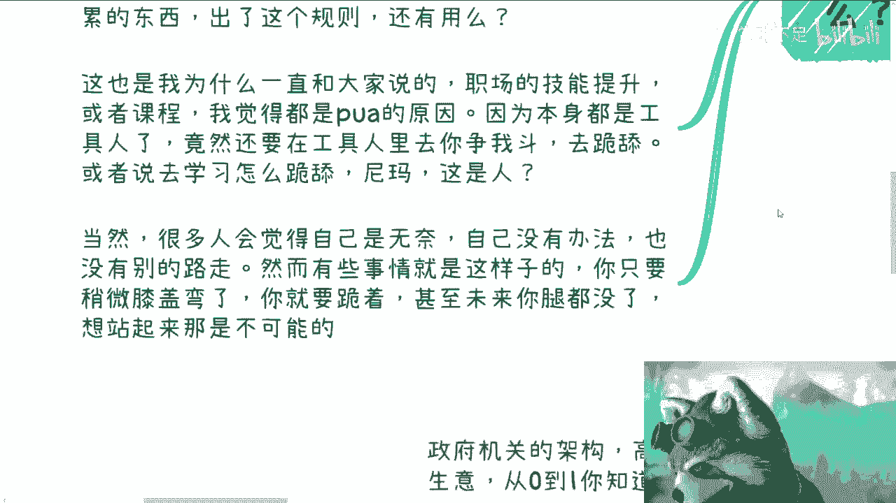

# 职场上的积累对商业几乎是毫无帮助的 - P1 - 赏味不足 - BV1rj411W7s3

哈喽大家好，今天今天还是礼拜四啊，但是呢你们会在礼拜五看到这个视频，为什么呢，因为礼拜五我去北京了，我就没空给你们搞嗯，这个事儿啊。

我其实应该以前说过，但是呢我发现还是要说一下啊，必须再说一下，这个很多人还是搞不明白啊，我跟你们讲了啊，就如我之前说的，这就是完全的两根独立的，完全不同的技能书和两个完全不同的经验值，你知道吗啊。

你不要不要再去幻想啊，就是说我们的这个发展是线性发展不可能的啊，你问你问我，我怎么得出这个结论的，对吧好，第一我两边我全部做过，第二我两边见过无数的人啊，呃我可以这么跟你们讲。

从十几岁的到他妈现在50多岁的，甚至还有60多岁的，我跟你们这么说，无论他的他的工作经验多强，无论他以前在什么样的公司，因为我看到我就这么说吧，我身边可能30多，40多，50多，60多的人。

他们以前的公司都是非常牛逼的啊，可以说都是都是那种，就是说很很就是在高速发展期的这种，比如说大厂或者外企或者怎么样，他们的能力我也都很认可，就是以我这种非常挑剔的人来讲，我也很认可。

但是我可以很负责任的跟你们讲，他们在商业上就他妈都是垃圾。

你知道吗，所以说在我看来他就是毫无帮助，就是你该涨的经验值还是要涨的，不要指望线性增长啊，首先啊我们先来看啊。

你职场上关心的是什么，晋升薪资既能提升你的KPI，跳槽业务划分对吧，业务划分就指的是事业部啊，然后你争我斗等等等，这些东西在我看来叫什么叫婴儿小儿科过家家，为什么，因为你关心的所有的东西。

你都是在一个公司体系下的，而这个公司体系里面的规则不是你定的，跟你没有任何关系对吧，而这个与此同时，你会发现公司也是你的保护状，以远离你，就是隔离你与社会的这么一个关系，那这样的话，就是说。

你既会不了解整个社会到底是怎么运作的，包括整个社会，你跟他如果要去未来做业务，你应该怎么做，同时当然了，好处是什么，你也会免于受到很多社会上来最多攻击啊，但是问题是你免于来自于这些工具。

并不代表它不存在，你不能就是说工作了10年之后，你说哦原来我这个我了解的时候会是这个样子，但其实外面不是这样子的，对吧哦，那么你在一个公司大体系下面，你无论身处什么岗位，你都是看不清任何的全貌的啊。

自然业务上也好，技术上也好，你都不可能了解全貌，那当然我在这个地方说这些，说这个这个这个这个结论啊，也是有一个前提的，这个前提就是说我们去头去尾，什么叫去头去尾，就是我们撇开那些非常精英的对吧。

我以前就说过，我相信非常精英的，他也不可能在B站看到我这个视频对吧，我们撇开非常静音的，我们撇开非常垃圾的对吧，那么剩下的中间的那90%，甚至甚至中间的95%，我们面临的就是这个问题。

就是我们在里面无论工作多少时间，你的经验值是不会涨到商业这个路线上的，你的技能树也不可能长在那棵树上对吧，你关心的问题跟你所面临的问题，都是因为你在一个公司的大框架下面，而在这个公司的设定规则下。

那么你想想看你积累出来的东西，出了这个规则还会有用吗对吧，我跟你讲，这就像什么，这就像我们以前说的哦，你今天再看看，你今天是在一个魔法少女的这个世界观下面，你你在那边练啊，苦练对吧。

然后什么搜搜集魔法卡牌是吧，透明卡牌，然后啪把你扔到七龙珠里面，你觉得靠谱啦，这是一个体系吧啦虽然后面崩坏了对吧，那咱们就这么个说法，这也是我为什么跟大家说说，职场的这个技能提升啊，或者课程。

我觉得都是PUA，为什么呢，因为在我看来，当然我不是说他们不好啊，是不是PUA你们自己去判断啊，因为在我看来本身大家已经是工具人了啊，那么职场的所谓的技能或者课程诶，诶他妈的无非就是教大家。

怎么在工具人里面变成更好的工具人，怎么工具人里面你去你争我斗，去跪舔，那我他妈就觉得这就那句话，那句话怎么说来着对吧，这个世界太过赛博，朋克都太过扭曲哦，我都已经是工具人，大家都已经是工具人了哦。

我们还要去拟真，我都斗什么东西呢，我也不明白有什么好斗的呢，啊这他妈是人呐对吧，那当然很多人说，那你这话说的不对啊，这个从古至今这么长时间，公司都这么运作过来，你说他不对，你说它不正确，那存在即合理。

你怎么能说它不正确呢，对不对，好，那我告诉你们为什么很简单，因为你要在公司里面晋升，你要在公司里面做事情，我觉得OK我也很认可哦，哦毕竟我也打工打了这么多年对吧，但是我为什么现在会跟你们讲不认可。

就是因为在整个公司体系内，已经没有任何客观的评价人的这种体系，或者说就是标准没有不存在，早就已经他妈被关系渗透，早就被所谓的跪舔渗透了，有什么用呢，是靠能力赢的吗，我就问嘛，是靠能力赢的吗。

你们自己扪心问问看是靠能力赢的吗，有多少人靠能力赢的，当然很多人会觉得自己是无奈啊，自己也没办法跟我说啊，陈老师啊，我们也没别的路走，然而你要明白，有些事情就是这样子的，你越是怎么觉得你越是膝盖弯了。

你越是往下跪，你未来腿都没有，你想站起来就再也不可能了，你知道吗。

这不是说你有没有办法的问题。

啊那照你这个说法，就是你说很多事情没有办法，我就屈服了啊，那照你这个说法，我随便举个例子，比如说你今天有一个商业机密对吧，签了保密合同的，然后呢你等到哪天你说哦我要饿死了，我没饭吃了，我就卖商业合同。

你觉得呢这是一个人吗，你你你要有底线啊对啊。

第二最大的疑问和最大的这个叫什么，很多人纠结一点，就是在于我如果做一些接触市场的，比如说marketing，比如说sales对吧。

呃这个BD啊，他说我做这些岗位行不行，那我就这么跟你们讲，我只能说比那些完全对内的什么产品经理，项目经理啊对吧，什么开发啊，测试啊，好啊，但是你要说好多少，不好意思，也就好那么一点，那句话怎么说来着。

就是你有点东西，但不多，这个属于什么概念，这属于是矮子里面拔高的，就是什么呢，就是有很多人就是昨天啊前天说学历也是，就是说还是回到那个问题，就是说就是你说学历高的，他是不是找到工作概率大。

对学历低的找到工作概率低，对不对对吧，你说公司要学历高的呃，这个是为了更好的更快的筛选人，对不对对，但问题是你所有讨论这些问题的前提，都是大家是一个工具人对吧，就是你已经开始臣服了，你已经是确定了。

就是老子就是个工具人啊，以后有没有工作，就是对方说了算，我反正就等死，这你都已经是这么一个前提了，那我还能说什么呢，那还有什么好讨论的呢对吧，所以我们我我就很不想跟跟这些评论的人讨论。

就是你已经是基于这个前提了，那我们是我跟你们这么说吧，我跟很多人咨询的人，我就会跟他们说，我说你们怎么看，我不关心啊，我说我的态度是什么，就是你要是给我一个给我一个选择，是我现在死还是30年后死。

那不好意思，那在我看来就是也不用30年吧，5年吧好吧，你就是我现在死和5年后死，那不好意思，我都不接受，为什么，因为我就不愿意接受这个结果，我就是要去突破这个结果的对吧，你非要来跟我讨论，哎。

那我们是不是做点事情，这就是延缓一下，比如说弄个6年死，你看看行不行，我他妈脑子有毛病，要么对不对啊，那么我们来看啊，因为你接触市场也好，做商务也好，接触客户也罢，整个逻辑就不同，为什么。

因为你由于在一家公司里面，你不会从0~1的去考虑，你也不知道客户真正要的是什么，因为你属于一个公司很多的前提铺垫，或者说准备公司其实很多人都帮你做掉了，或者说很多的部门都帮你做掉了。

你在这个公司的框架下面，你其实就是你既看不到全貌，你也很难有自己思考的东西，而就算你有自己思考的东西，你也是被限制在这个框架下面的对吧，那么包括就是说你加了对方的微信或者见过面，的确他是个优势。

没有毛病啊，但是在商言商，你未来这些优势是否能给你自己带来钱，或者业务，这还是要去看你到底有没有价值的，不会因为你长得好看，或者你跟对方照照过面对吧，就是加过微信哦，你说我未来会比那些产品经理。

没有加过微信的人，能够那这个更高概率的能够赚到钱，没有这个因果关系的，而不存在这个因果关系的啊，毕竟啊我跟你讲，这就跟面试是一个道理啊，因为有很多人他就是就是他没有换位思考。

就是说你觉得你比如说这个面试对你很重要，对吧是啊，没毛病啊，那是因为你对你来讲是第一次，但对面的hr对对面的面试的人呢，对面这个面试官呢他们已经皮掉了，你知道吗对吧，你就好像什么。

你就好像有很多人我就这么跟你讲吧，有很多人就是我回都不回就拉黑的，为什么，因为他们觉得他们好像很秀对吧，或者是他们觉得我好像第一次在你这边留言，但对我来讲是什么，我他妈已经看到几千次几万次了。

我他妈管你是谁啊，对不对，你就像最近有私信问我，哎，陈老师，你觉得这个东西怎么看，我直接就回复，我不怎么看，为什么我怎么看，我赚钱吗，不赚钱，那我不看有什么好看的，没有意义的呀。

第三很多人呢就像我说的啊。

想着线性的发展，我跟你讲没有意义的啊，你就像很多人觉得做一个工作，一个岗位一定是对对未来的业务，或者对未来发展有一定影响的，然后呢就一定也需要一定的财富积累，这句话其实没有错，我认可的，但是问题是什么。

问题是我就问啊，说出这句话的人，你们自己觉得影响有多大，你们知道吗，你们不知道对吧，你们只是自己在PUA，自己觉得哎这个岗位对未来是有影响的，有什么影响呢，你不知道有多少影响呢，你也不知道啊，这是我。

我后面肯定会单独再开一期的啊，就是每一次都是这种言论，就让我很无语，财富积累我就问嘛，为啥要财富积累，你积累了干嘛能积累多少财富啊，一个岗位对未来你说做发展有影响好，有什么影响，影响有多大。

就你毫无根据，都是用这种就是莫名其妙的逻辑，和莫名其妙的理论在PUA自己，我不知道怎么得出来的对吧，还是那句话啊，在打工和工具人的这个label，你选择什么，你选择什么方向，你选择什么岗位。

没有这么大的差别，去头去尾没有区别，知道吗啊，而差别真正大的是你自己在赚钱的这条路上，你的积累财富和你的工作带给你的经验帮助，可以说是微乎其微的，因为这两个技能树跟经验值不互通啊对吧，我随便举个例子。

比如说你积累了50万，比如说你做了是商务或者销售，那请问嘛你出来之后你真的知道你做什么，你出来之后你真的知道你怎么赚钱吗，你不知道啊，你觉得这钱你知道怎么用吗，我们就说不好听点，你送礼，你知道送给谁吗。

对啊，如果真的去积累经验，我跟你讲这两条线你就一开始就应该并行，而不是自己去PUA自己哦，我要先打工，一定要选个好的路，然后之后有方向之后有帮助我，那我还是个问题吗，有什么帮助，你真的知道吗。

你不知道啊，知道啥对吧，第四就是你想想看啊，你想想看政府机关架构高效运作，企业的合作，C端的生意，我说的这些东西从0~1你知道多少，你了解多少，这个东西跟工作时间有关系吗，你如果工作20年。

你就知道了吗对吧，然后由于岗位的不同，我们就说啊，你面临还有很多东西，网站备案，每个月的报税，发票类型，营业范围，公司合同合同合同，合作合同的这个类型，包括发票title，你了解多少。

这跟工作时间有关吗对吧，包括社会的尔虞我诈也好，跳单也好，白嫖也好，这些都是常态，甚至还有这种扣帽子的，可能有刑事诉讼，民事诉讼的帽子，你会分辨吗，这跟工作有关吗，对吧，也许你的工作啊。

我就说啊会接触以上或者商业中的冰山一角，比如说你是做财务或者法务的，或者说你原本就是做一些to g或者to be生意的，但是你自己真正去做，你想自己去赚钱，跟你在这家公司里面接触到这些东西。

他根本就他妈是两回事啊，我就跟你们讲，但凡你们自己真的做过的，你就会发现这两个经验值不互通啊，啊我就跟你们讲了，你不要再去幻想一些线性成长了，你们也不要再去看以前的很多人，为什么可以。

因为我早就跟你们讲了，以前因为有土壤，有机遇也有机会，也就是所谓的是那个天时地利人和，以后没有了呀，对吧，什么意思，就是如果你真的要去跟我一样有突破对吧，我不说最终能不能突破啊，我就说你就觉得我的。

老子我就不想做打工人，我就不想他妈受制于人对吧，如果你真的有这个想法，你一切的行为都是趁早，你知道吗，不要去幻想说哦。

我要在一家大厂，在一个外企积累几年没有用的。

一点用都没有，好吧，哎呀，行吧啊，就这么着吧，嗯我周四啊，帮你们把周五的做了啊，反正有什么你们有问题，反正再私信我吧好吧，小问题呢你们就直接说我肯定会回来，但问题呢那你们就整理好。

