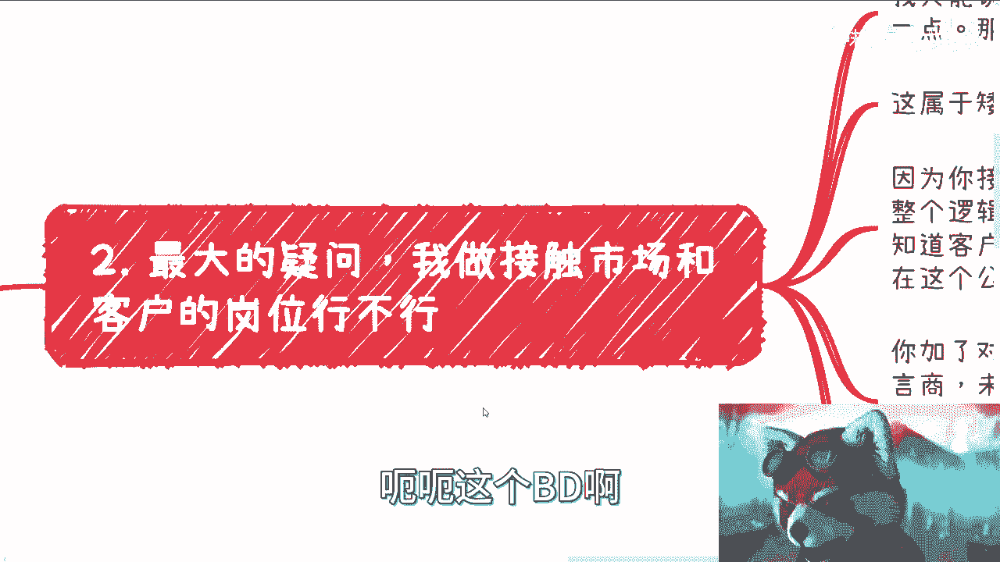
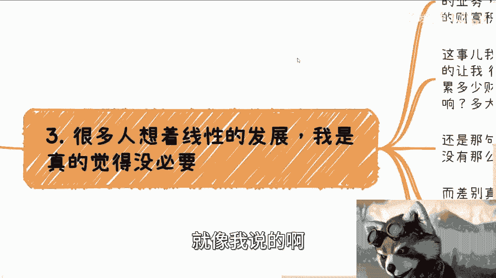

# 职场经验对商业几乎毫无帮助 - 课程 P1 🧠💼

在本节课中，我们将探讨一个核心观点：在职场中积累的经验和技能，对于独立开展商业活动或创业的帮助微乎其微。我们将分析职场与商业的本质区别，并解释为何两者属于不同的“技能树”和“经验值”体系。

---

## 核心论点：两条独立的路径 🛤️

我曾在职场和商业领域都有过亲身经历，也观察过无数从业者。一个明确的结论是：**职场经验与商业能力是两套完全独立、互不关联的技能体系**。

无论一个人的职场经验多么丰富，无论他曾效力于多么顶尖的公司（如高速发展期的大厂或外企），这些经验在商业领域往往价值有限。许多资深职场人士在商业上可能表现平平。

---

## 职场关注的焦点：体系内的游戏 🎮

上一节我们介绍了核心论点，本节中我们来看看职场环境本身的特点。在职场中，人们通常关心以下方面：

*   **晋升**与**薪资**
*   **技能提升**与**KPI**（关键绩效指标）
*   **跳槽**机会
*   部门间的**业务划分**与**竞争**

然而，所有这些都发生在一个预设的公司体系之内。这个体系的规则由公司制定，与你个人无关。公司体系如同一层“保护罩”，它既让你远离真实社会的复杂运作，也让你免于承受直接的市场冲击。

问题在于，长期处于这种保护下，你无法看清商业的全貌。无论身处技术还是业务岗位，你的视野都被限制在公司框架内。在这种规则下积累的经验，一旦脱离这个框架，其适用性将大打折扣。

这好比在一个“魔法少女”的规则世界里苦练技能，然后突然被扔进“七龙珠”的战斗力体系——两者根本不兼容。

---

## 职场技能提升的局限性：成为更好的“工具人”？🔧

基于上述背景，我认为许多职场技能培训课程在某种程度上是“PUA”。其核心往往是教导员工如何在既定体系内成为一名更高效的“工具人”，或者如何在内部竞争中胜出。

许多人认为“存在即合理”，公司体系自古如此运作。我认可在公司内遵循规则以求晋升和发展的做法。然而，当前公司体系内**缺乏客观评价个人的标准**。晋升和成功往往更多依赖于“关系”和“迎合”，而非纯粹的能力。

这不是有没有选择的问题，而是一个关乎底线和原则的问题。如果从一开始就抱着“我只能当工具人”的心态去妥协，未来将更难有站起来的可能。

---

## 接触市场的岗位是否有帮助？🤔

很多人会问，如果从事市场（Marketing）、销售（Sales）或商务拓展（BD）等接触外部的岗位，是否对商业更有帮助？

答案是：**比完全对内的岗位（如产品经理、开发、测试）稍好，但帮助有限**。这属于“矮子里面拔高个”。

原因在于，即使在这些岗位，你依然是在公司搭建好的平台上工作。许多前期铺垫和资源支持由其他部门完成，你很难经历从0到1的全过程，你的思考也受限于公司框架。

拥有客户联系方式或见过面，这算是一个优势。但在商业世界中，这并不直接等同于未来的收益。对方是否会与你合作，取决于你能否提供真正的价值，而非仅仅因为“认识”。这就像面试，对你而言是第一次，对面试官而言可能已是例行公事。

---

## 关于“线性发展”与“财富积累”的迷思 📈

许多人幻想存在一条“线性发展”路径：通过某个特定岗位积累经验和财富，从而自然过渡到成功的商业之路。

这种想法存在几个问题：

1.  **影响不明确**：你无法量化一个岗位对未来商业活动的具体影响有多大。
2.  **财富积累的目的模糊**：积累的财富数额有限，且你未必知道如何有效地将其用于商业启动。
3.  **技能不互通**：打工积累的经验值与独立赚钱所需的经验值属于不同体系，无法直接转换。

真正的路径应该是**尽早让两条线并行**：在完成本职工作的同时，开始尝试和探索独立的商业机会。而不是自我PUA，认为必须先在职场“选对路”积累足够资本再开始。

---

## 商业世界的真实面貌 🌐

那么，独立商业世界究竟包含什么？以下是你可能在职场中很少接触，但对商业至关重要的方面：

*   **从0到1的构建**：政府机关对接、高校合作、企业间合作、面向消费者（C端）的生意，你了解多少？
*   **基础运营实务**：网站备案、月度报税、发票类型、公司营业范围、各类合同拟定、发票抬头等。
*   **复杂市场环境**：社会中的尔虞我诈、客户跳单、被白嫖、甚至可能面临民事诉讼或刑事诉讼的风险，你懂得分辨和应对吗？

即使你的工作偶尔触及上述领域的冰山一角（例如你是法务、财务，或做To G/To B生意），但“在公司里接触”与“自己亲手去做”是两回事。两者的经验值**完全不互通**。

过去的成功者可能得益于特定的时代机遇（天时地利人和），但未来的环境已大不相同。如果你真心希望突破“打工人”的身份，不受制于人，那么行动的关键在于**趁早**，而非幻想在大厂或外企“积累几年”就能自然过渡。

---

## 总结与回顾 🎯

本节课我们一起学习了以下核心内容：

1.  **职场与商业属于不同体系**：在职场积累的技能和经验，对于独立经营商业帮助有限。
2.  **职场是规则内的游戏**：其关注点局限于公司内部体系，使人难以看清商业全貌。
3.  **接触市场的岗位帮助有限**：虽有一定优势，但仍在公司框架内，无法获得从0到1的完整经验。
4.  **摒弃“线性发展”幻想**：财富和岗位经验的积累，与商业成功之间没有直接的因果关系。
5.  **商业需要实战经验**：涉及从构想到运营、从合作到风控的全方位能力，这些无法从职场工作中直接获得。

关键在于，如果你有志于商业，应尽早开始并行探索和实践，而不是等待职场经验为你铺平道路。