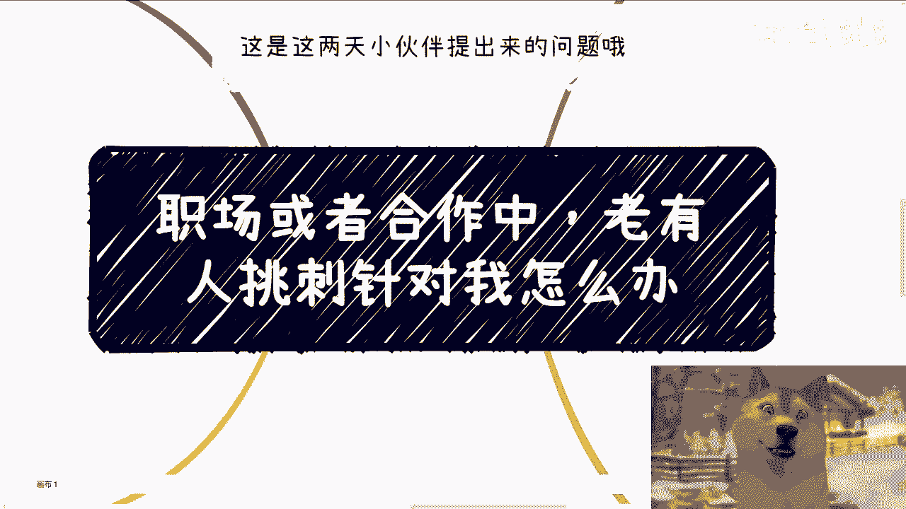
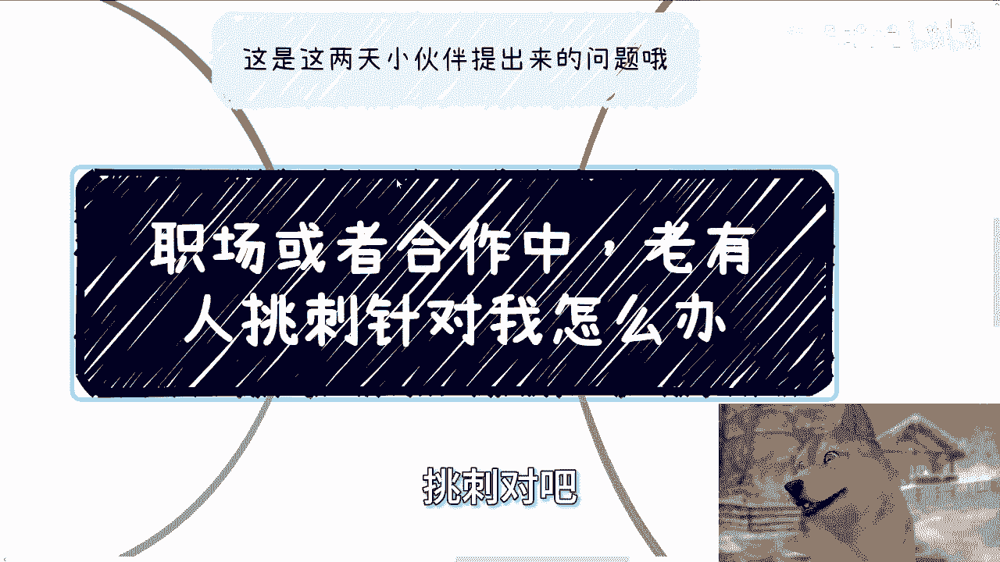
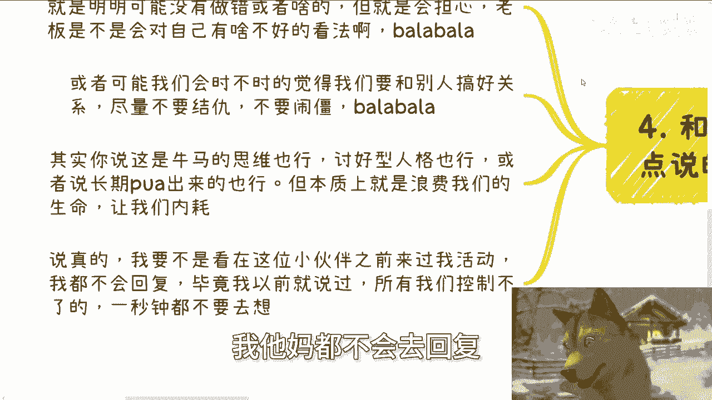
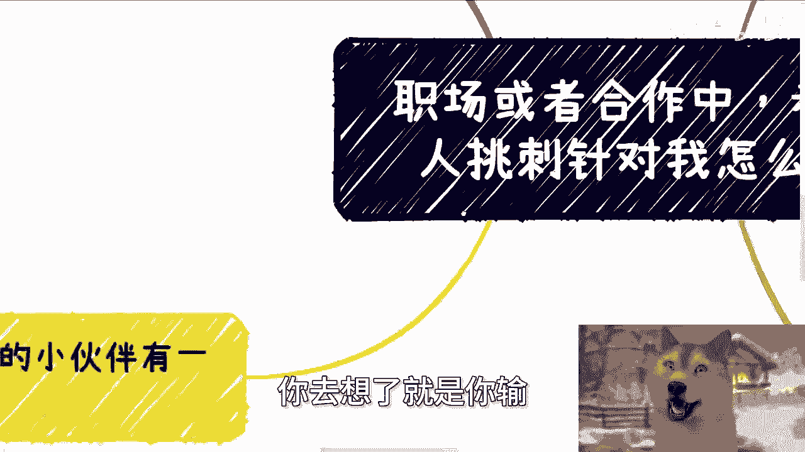
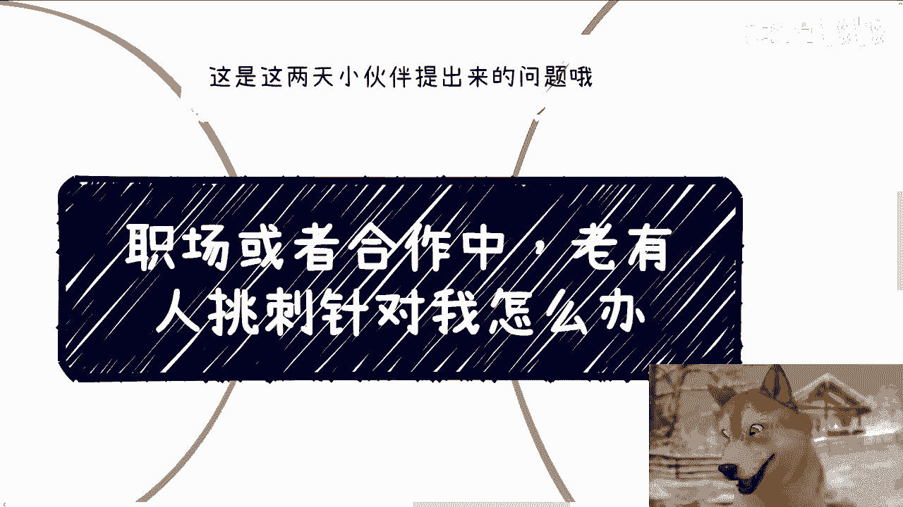

# 职场应对策略 01：如何处理他人的“挑刺”与针对？ 🛡️





在本节课中，我们将学习在职场或商业合作中，当遇到他人频繁“挑刺”或针对时，应如何调整心态并采取有效策略。核心在于建立正确的认知框架，避免无谓的内耗，并采取恰当的行动。

## 概述：接受“被针对”的普遍性

首先需要明确一个大前提：只要进入社会，无论是在职场还是其他地方，遇到针对你的人是无法避免的。人与人之间的相处本就如此。即使你什么都不做，也可能会有人针对你。

因此，心态至关重要。不要浪费时间纠结“他为什么针对我”。思考这个问题本身就是在消耗自己，对解决问题毫无帮助。这个世界有时缺乏逻辑，有人针对你可能毫无理由。与其纠结，不如将其视为无需在意的背景噪音。

**核心心态公式：**
```
纠结时间 > 0 → 你的损失
```
你的在意只会影响你自己，对对方毫无影响。

## 职场中的应对策略：明确立场与态度


上一节我们介绍了基本心态，本节中我们来看看在具体职场环境中该如何处理。

在职场中，大家本质上都是打工者，对方的攻击力通常有限，难以对你造成实质性重大损失。即使是领导，其根本目的也是完成工作。只要假设你自身的确没有原则性错误，那么建议采取明确态度。

我们的核心态度是：我们是来工作赚钱的，不是来伺候谁的。原则是“人不犯我，我不犯人”。如果有人针对你或给你穿小鞋，必须明确表明“我不是好欺负的”。

以下是具体的行动建议：

*   **公开沟通**：根据情况，在微信群、邮件、会议等场合进行沟通。
*   **表明底线**：清晰表达你的立场和感受，让对方知道其行为不被接受。
*   **无需过度担忧后果**：不要因为害怕被辞退而一味忍让。担心的事情不会因为你的担心而不发生。长期的忍让只会让你在任何地方都成为“软柿子”。

打工如同“缓刑”，暂时的忍让或许能保住短期工作，但无法解决根本问题。树立起明确的个人边界更为重要。

## 商业合作中的判断：聚焦利益与大局

在商业合作中，情况有所不同，需要更理性的判断。这里的核心是分析对方的角色和动机。

需要警惕的是，对你造成最大威胁的往往不是竞争对手，而是身边的合作伙伴。如果针对你的人是合伙人，你需要有清晰的判断力。

判断的关键在于：他的“挑刺”或针对，是否有利于项目发展或能否赚到更多钱？如果答案是肯定的，那么可以对事不对人，接受批评。如果答案是否定的，纯粹是人身攻击或内耗，那么你需要考虑尽快终止与这类合伙人的合作，因为这种项目很难成功。

成熟、不玻璃心的人懂得什么是“大局”。大局就是共同赚钱。对事不对人才是高效的做法。针对个人本身，对任何人都没有好处。

**核心逻辑代码：**
```python
def evaluate_criticism(criticism, from_partner):
    if is_beneficial_for_project(criticism): # 判断是否对项目有利
        return “接受，对事不对人”
    else:
        if from_partner:
            return “考虑终止合作”
        else:
            return “忽略，专注己事”
```

## 摆脱“讨好型”思维与内耗

和我讨论这个问题的小伙伴提到，自己因长期被PUA而有些“创伤后应激障碍”，总会担心他人看法，想要讨好所有人。

无论称之为“牛马思维”、“讨好型人格”还是“PTSD”，其本质都一样：这种思维只会影响你自己，导致浪费时间和自我内耗。

所有你无法控制的事情，都不值得花费一秒钟去思考。你花费的每一秒纠结，都是你的损失，因为这对你和对方都产生不了任何正面影响。



试着用更长远的眼光看问题。站在两三年后回望现在，这些让你困扰的事情可能都微不足道。



## 总结

本节课中我们一起学习了应对他人“挑刺”与针对的策略。

1.  **调整心态**：接受“被针对”的普遍性，停止纠结原因，避免自我消耗。
2.  **职场策略**：树立“为赚钱而非讨好”的态度，明确边界，敢于合理表达立场。
3.  **商业判断**：聚焦“大局”和共同利益，理性分析批评的实质，果断处理无效内耗。
4.  **自我成长**：识别并摆脱讨好型思维，拒绝内耗，把精力集中在可控和有益的事情上。



记住，你的时间和精力非常宝贵，请将它们投资在能够推动你前进的事情上。