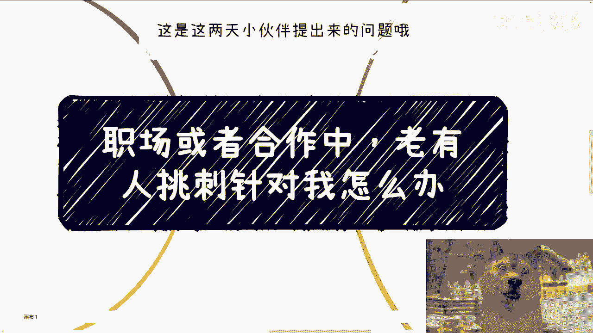
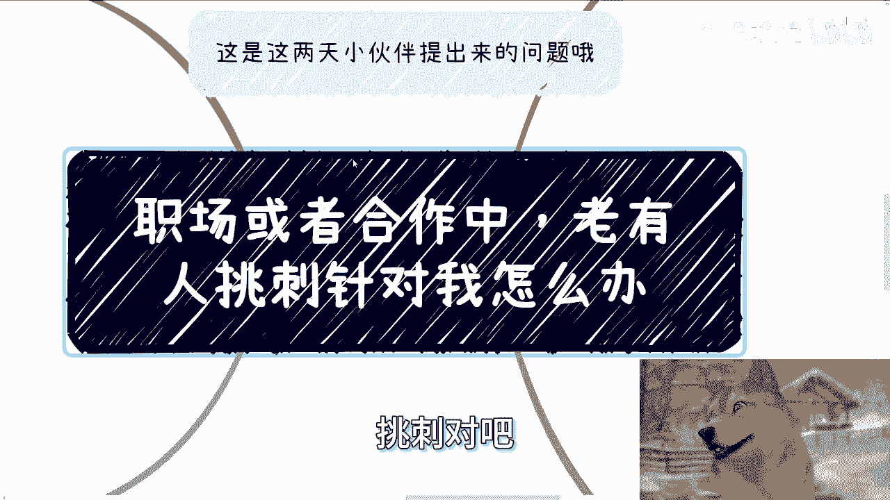
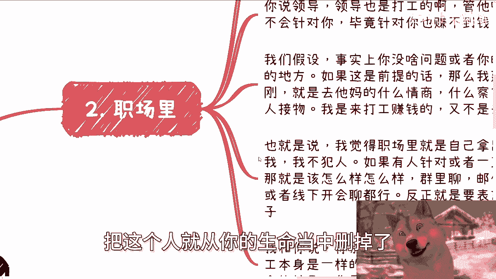
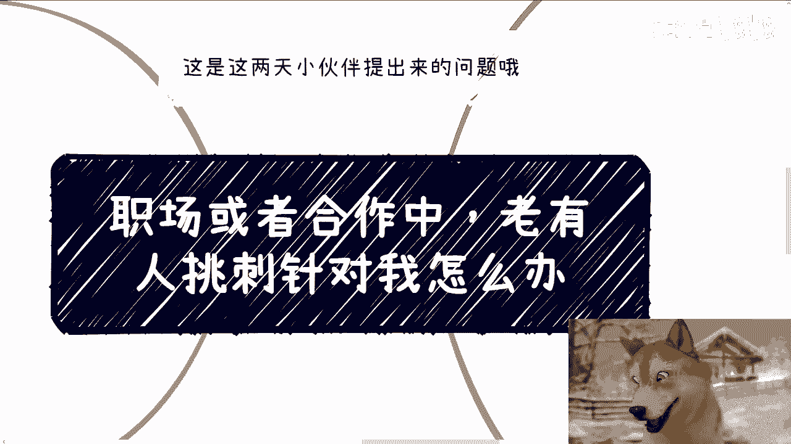

# 职场或者合作中，老有人挑刺针对我咋办 - P1 - 赏味不足 - BV1f4421Z7e3

好啊呃大家好，今天我们来讲的这个主题呢，是这两天小伙伴提出来的啊，他说职场啊或者这个商业合作当中啊，老有人挑刺儿啊，对我呃，挑刺儿对吧，或者说针对我啊。

怎么办啊，呃首先呢这有个大前提啊，还是那句话啊，大家记住，你只要进入社会，无论职场还是任何地方，针对你的人是不会耍的，为什么没有，为什么，你明白吗啊就是永远会存在，就是就是人与人之间他就是这个样子。

你只要活着对吧，那那怎么办呢，对不对，你甚至就是我跟你说，甚至哪怕你什么都不做，都会有人针对你对吧，所以我跟你讲，你们心态要好，就千万不要想着哎他为什么要针对我对吧，我跟你们讲。

尼玛你只要他妈想一秒钟就是他赢，你懂吗，你想啊，而且另外一方面就像我以前说的，你想的有用了没有用的呀，你你你你怎么滴啊，画个圈圈诅咒他，对不对，这这哎啊拿拿拿拿个小人扎针对吧，你搁这对吧。

我们科学一点啊，说白了啊，我跟你讲，这个世界已经非常颠了啊，有人针对你做任何事情，也许有理由，也许甚至他妈没有理由，也没有任何逻辑性对吧，虽然他可能不是个精神病，但是他妈你就当他是个精神病对吧。

所以你不要浪费时间，浪费生命去纠结问题，你跟一个你跟一个精神病人有什么好纠结的呢，对不对，而且你还要非要把你的智商降降到，跟他同一个水平线上去去纠结嘛，他妈吃饱了撑的嘛对吧，你就好像问我这个问题。

小伙伴啊，我其实也先回复了，我说你别在意啊，你哪怕在一秒钟啊，那么也是你输，对不对，因为因为对他也没影响，对你对你是有影响，反而对他没影响对吧哦，而且另外一方面啊。

我就我我我说实话就是这个这个小伙伴来问我，他来问我，就是他输你，甚至我还花时间去回复他，那么就是我输，对不对，那世界这么大哦，他在意我还我还跟着他一起去在意，那我们别活了啊。

没你你在意每个人你还怎么活啊对吧，你今天就算把这个人啊踢踢掉了对吧，把这个人就从你的生命当中删掉了对吧。

你跟他没有交集了，那他妈还会出现第二第三个人，第二我们一个个说在职场里，其实我是觉得啊，职场里呢大家反而不用这么费心，也不用去太去想这个事情，为什么，因为无论谁搞你，谁针对你，大家都是打工的呃。

他他也不会有太大的攻击力啊，对你也不会不会有太大的损失，你说比如说领导哎，领导也他妈是打工的，你管他呢，对不对，大老板绝对不会针对你，因为针对你，他赚不到钱啊，他有什么好针对你的呢，对不对啊。

我们假设啊，假设事实上你的确没什么问题，或者说你也的确没没做错什么，我们假设啊，那么如果这是为前提的话，那么我建议就是说你还是要去刚啊，就是去他妈的什么什么情商，什么察言观色，什么待人接物什么他妈的啊。

职职场什么各种话术，什么鸟毛玩意没用，我跟你讲都没用，我跟你讲，还是那句话，我们的态度是什么，就是我们是来打工，是来赚钱的，不是来伺候老佛爷的对吧，也就是说我觉得职场里面我们就得拿出态度，人不犯我。

我不犯人对吧，如果有人针对或者给你小鞋穿，那么该怎么样怎么样，就是就是比如说你该群里面聊就聊对吧，单聊就单聊邮件聊就聊邮件，聊微信聊，就微信聊或者线下开会群聊都可以啊，反正就是要表表明态度。

就是我不是好欺负的，我不是软柿子啊，而且我跟你讲，你别担心被辞退或者什么东西，为什么，因为你要担心的所有事情，你不会因为你担心而不发生啊，你要被辞退，早晚要被辞退对吧。

其实就这这就跟我一直跟你们说打工是一样的，都是判缓刑啊，你你说你软一点，你要一直忍让，可以呀，你可能能够在这半年一年里面保住你这工作，然后呢，后面呢你未来呢你人生不过来，后面啊，你只要是软柿子。

你只要不表态，不表明明确态度，你早晚也好，在哪也好，都要被捏，你明白吗，有什么区别呢啊第三我们比如说在商业上，商业上这事我觉得有点不同啊，就这事情呢你得看对方的角色，比如说那天在长沙，我就跟他们这么说。

我说别的当下可能都不是最重要的，最重要的是你们得记住一点，如果哪天有人举报你们，或者你们因为某些事情而得罪了一些人，那么这些人必然是你们身边的人，不会是你们的竞争对手，你明白吗啊一定是你们身边。

甚至是跟你很亲近的人啊，如果针对你的是你们的合伙人，因为很多呃我我假设啊，如果是你们的合伙人的话，因为很多项目可能有多个合伙人，其中呢每个合伙人都各怀鬼胎，这种情况是很多很多的。

那么这种时候你其实就需要有清晰的判断力，什么意思呢，就是说针对你没问题，比如说他今天喷你对吧，或者说在你身上挑刺没问题啊，但是是不是说针对你这个点有利于项目的发展，或者说能不能赚到更多钱，如果他针对你。

哪怕把你骂成狗对吧啊，哪怕对你进行人身攻击啊，那么这个事情能有项目的，的确有利于项目发展，或者能赚到很多钱，没问题啊，我觉得大家作为一个成熟的人，我不会往心里去的，但是如果不能，那么这种合伙人早点干掉。

或者说你就早点退出这种项目，因为有这种合伙人项目也不会做得好对吧，那其实社会上本身看人还是很容易的，因为什么呢，因为稍微成熟一点的人，不玻璃心的人，他就会明白什么是大局，什么是大局啊。

大局就是大家一起来赚钱的，就像我们刚说的打工，我就是来赚钱的，做商业我就是更来赚钱的，不是来谈感情的啊，那么也就是说这些明白大局的人，他会更清楚对事不对人，因为他对人没有用嘛，对不对，你今天对一个人。

你把这人骂死了，你把他骂的身败名裂，把他骂的退网了，自杀了，对你有什么好处呢，你搞得好像这种人在你生命当中不会再出现，第二个第三个一样没有用的呀，就是所有明白大局的人都会明白，你今天针对一个人。

不针对事，对你没有任何好处对吧，所以说你但凡你会发现这种很小格局的人，他也做不了什么大事啊，那么第四和我提这个问题的小伙伴呢，有一点我觉得他里面说的很对，就是他自认为他自己被PUA的太久。

就会有那种PTSD，就是明明可能没有做错或者没有发生什么，但是也会自己去担心哎呀，老板是不是会对自己有什么不好的看法啊，同事是同事，是不是对自己会有些偏见啊，或者怎么样子啊对吧。

或者说我们会时不时的觉得，我们要跟别人去搞好关系啊，尽量不要结仇啊对吧，不要闹僵啊，巴拉巴拉巴拉一大堆啊，其实你说这是牛马思维啊，我也觉得对你说这是个讨好型人格啊，也OK啊。

或者说你说这是长期PUA出来的，PTSD也行啊，但是我们不管理由是什么，我也不管他症状是什么，但是本质上这些思维就像我们刚刚说的，它既不会影响到别人，但是他只会影响我们自己浪费时间内耗，那所以说说真的。

我要不是看在啊这位小伙伴之前来过我活动，我他妈都不会去回复，因为毕竟我曾经就说过。

所有我们控制不了的事情，你一秒钟都不要去想，你去想了。

就是你输，对不对，就就像我们说的，你我们假设每个人都能活到100岁，你每天24小时时间是平等的，你花一秒钟在这上面，你不就输吗，对不对，因为你花了这个，你你花的这一秒钟对别人不产生影响。

对你也不产生任何正面的影响，那干嘛呢，我就不明白了呀，对吧啊好吧，所以我希望就是说大家反正就是说看事情，因为我今天回他呢，我是这么说的，我说如果你你站在和两三年后，你再反过来看这些事都不是事儿。

都他妈屁都不是懂吗啊行好，先这么着啊，然后就说呃呃这个职业发展啊，职业规划包括商业上的一些规划，商业上的一些发展分红啊，丰润啊啊啊期权啊，股份啊对吧，包括合同啊，商业计划书啊。

你们希望啊通过我的一些视角，能给你们一些更接地气的一些建议，或者说规划的话啊，包括让你们少走点弯路的话，那么你们可以整理好对应的问题跟个人背景，我们在可以来详细约咨询好吧。

