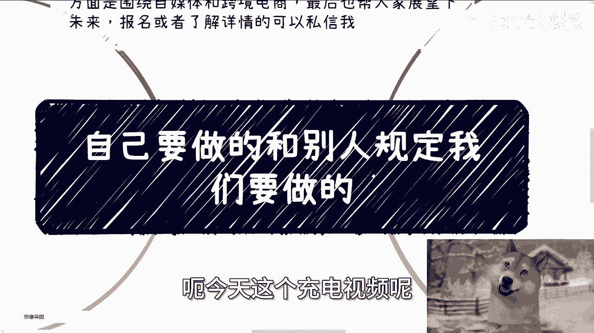
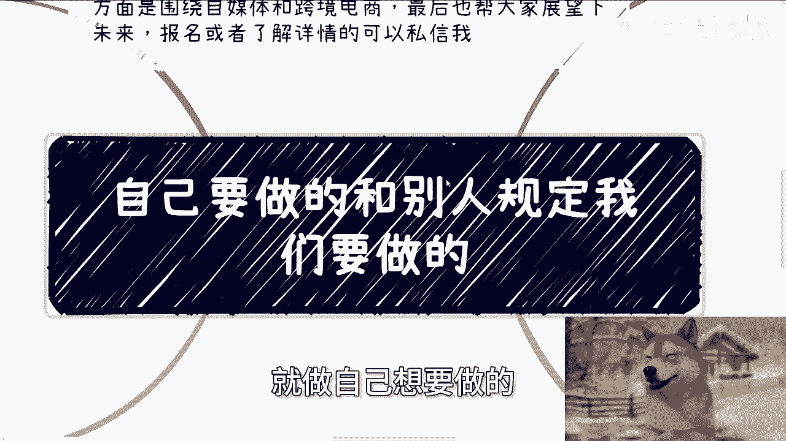
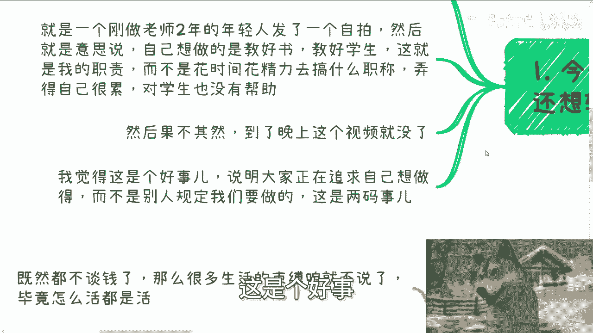
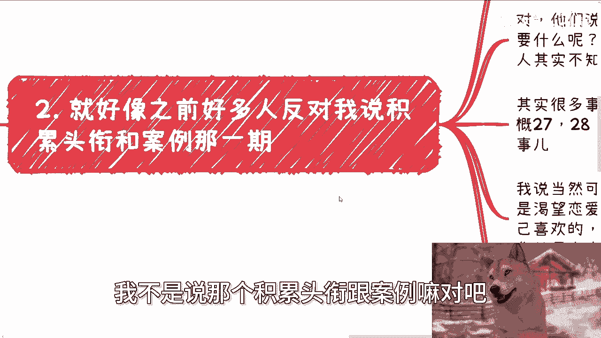
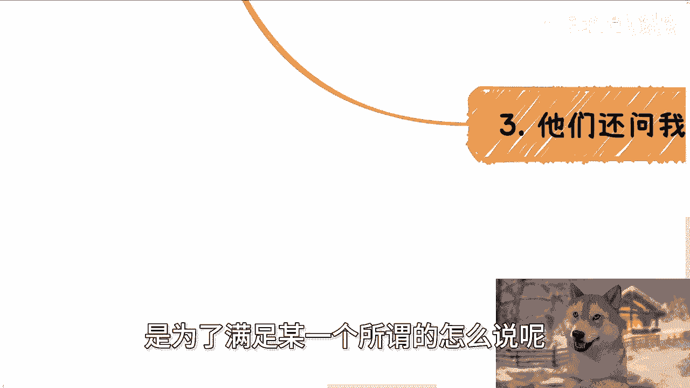
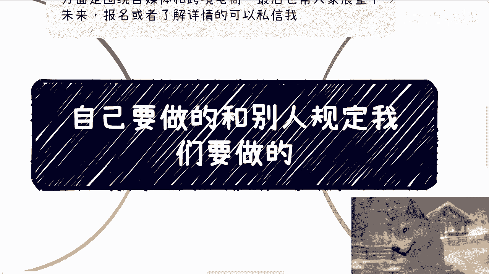
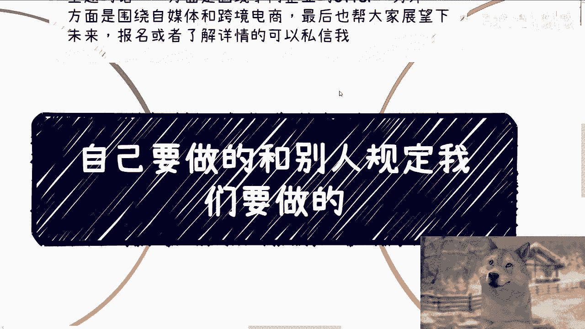

# 自己想做的别人规定要做的 - P1 - 赏味不足 - BV15E4m1d7CC

哦大家好嗯，今天这个充电视频呢。

呃其实我不是很想让特别人看到，我感觉他是不是会有点敏感或者怎么样的啊。

就是我们今天这个主题啊，我本来这个主题取的是就是一个老师怎么说呢，说了他评职称的一个事，但我后面还是改成了这个标题啊，这个自己想要做的跟别人规定我们要做的啊。

呃首先我先说一下下一期活动啊，8月25号好吧，8月25号本周日在西安是本周日吗，我看一下对，本周日在西安好吧，场地我已经定好了啊，位置在西安建筑科技大学这个李家村庄附近，那大概主题的话呢。

一个是围绕不同的那个写的offer呃，一个另外一个是围绕自媒体和跨境电商啊，最后也帮大家展望一下这个现状跟未来，好吧对对，然后报名或者了解详情的可以私信我啊，首先呢今天是这样子的。

今天早上看到了一个视频啊，晚上我本来还想发转发给这个小伙伴的，但后来发现就已经被删掉了。

嗯我大概说一下内容啊，这是一个刚做了两年的一个老师啊，然后就也是个年轻人嘛，发了个自拍，然后意思就是说自己呢想要做的就是教好书啊，教好学生啊，这就是我的职责，而不是说花精力花时间去评什么职称对吧。

弄得自己很累啊，花了太多的时间，本身对学生也没帮助额，然后果不其然呢，到了晚上这个视频就没了啊，我觉得这个是个好事啊，那我不不我说的这个事情是个好事，不是说这个视频没了是个好事啊，我觉得能说出这种事的。

这个发出这种声呢，这是个好事。

说明大家正在追求自己想要做的，而不是给别人规定我们要做的啊，那我觉得这个是两码事嗯。

第二呢这就好像之前有一期，我不是说那个积累头衔和案例嘛对吧。

然后很多人在这个评论区反对嘛，啊他反对的原因也很简单嘛，他观点嘛没有的啊，但是他们的意思就是说啊，不能什么都以钱为主，我都不能什么都以赚钱为为目标，去积累头衔跟案例对吧，我们还得要为了别的东西，对啊。

我这么说，他们说的没有错，但问题来了，切说这种话的人，我请我请问就他们自己到底想要什么呢，自己想要积累什么呢，大家知道吗对吧，我敢说其实大部分人不知道，他们只知道去反驳对方，获得获得满足感。

但是他们并不知道自己要要积累什么，其实很多时候都一样，你就好像前两天有一个小伙伴问我，二十七八岁问我啊，他说陈老师我能不能问一下恋恋爱结婚的事，我可以啊，我但是我说我说我说你等一下我给你个前提啊。

我说有两个大的前提，第一你是要真的，你内心是渴望谈恋爱跟结婚的同时，能够很果断的去寻求自己喜欢的，并且很果断的断舍离自己不喜欢的对吧，同时你要做这件事情，也不是你父母家庭这个这个这个希望的对吧。

不是说父母家庭强强迫于你的，或者说是是是是是他们想的对吧，我说这两者你要但凡都能满足，你就去谈对吧，但问题是能有几个人满足这种条件呢，太难了对吧，你想想看，在这当中啊，要么就是他自己要什么他不知道的。

他喜欢什么也不知道的，他不喜欢什么也不知道的，然后在这里面还有些就是优柔寡断的对吧，什么什么害人害己的对吧，然后还有一种嘛就是说啊可能碍于面子，碍于各种原因对吧，可能是呃父母这个逼迫他的对吧。

催他的或者家庭催他，他不愿意说对吧，反正就这种样子，我就跟他讲了，我说我说你反正就自己自自己自己判断，反正我也不想听你的，你说的这些这些话只有你自己知道，真的假的，反正我也不知道，对吧啊。

那么第三他们还还问我对吧，既得利益者是什么对吧，我我就很简单啊，规则制定者肯定就都是既得利益者，否则他为什么要这么定呢，对不对，当然啊，你说这一个一个事情，最早的时候是不是一定是这样子的，可能不是啊。

但是随着时间推移，慢慢就变味了，对不对，你说白了什么叫既得利益者，既得利益，既得利益者就是你劳动别人赚钱，这个别人就是既得利益者，你甭管他什么形式存在，你懂吗，就这么简单啊。

很多事情并不是人一出生就规定要做的，那具体是什么，我们这里由于敏感信息，我肯定没法明说，但是现在的确就有很多事情，可能他就是个规定，或者说可能就是潜移默化，大家都觉得啊默认就会去做的，但是你去问。

或者你去仔细想想看这事做的到底有什么用，不知道对不对，你会发现做这些事有的是个人，有的是企业，有的是高校，有的是各种组织，但是仔细想想，和这个我们这次说评职称的，这个老师说的是一样的。

做这些对我们自己有什么好处呢，到底是我们追求的还是别人规定我们去做的，如果你做这些东西是为了满足某一个所谓的。

怎么说呢，标准或者门槛的话，那你有没有想过，这个标准和门槛也是别人制定的，那为什么要去满足呢，我们活着到底是为了什么呢，对不对，那第四很多时候我们的确不是为了只为了钱啊。

但是往往更多的也不是为了我们自己，就是你可以不为了钱没问题。

但是你为了自己嘛也不见得啊，对不对，我也没有看到有多少人为自己活着，你要真的说，卧槽他妈的我我根本就不care那些有的没的对吧，我就是自己喜欢什么，自己感性什么，我就去追求，那OK啊，完全没问题啊。

双手双脚赞成啊，对不对，但是很多人不是这样，很多人就是上来就就在我这边嘛，跟我说，哎我们不能活着，只为了钱啊，然后一回头好，该该该考公考公，该考考编考编，该去那什么当牛马当牛马，那奇了怪了诶。

那奇了怪了哦，你天生喜欢还是怎么说，对不对，那么我就想问那些说啊，生活不是只有钱活着，不是只有钱的人，你们说的对，但你们的努力，你们正在做的事，为了谁呢对吧，我是说真正的为了谁，为了自己的能有几个对吧。

你其实你不为了钱，你你你仔细想想看，你没有钱，你就没有体验生活的资本，你就没有体验这个社会黑或者白的权利，你更别提什么体验生活了，你体验个屁呀啊，而你在做别的事情的时候，往往无非也是在为既得利益者。

或者还说自己的父母家庭在做，能有几个人为自己做的啊，能有几个人为自己做的，真的你多想想，我们去争去拼一些别人制定出来的规则，制定出来的东西真的意义大吗，OK那我们就这么说。

可能归根结底你还是会得出来意义都不大，而在意义都不大的里面，只有钱是最靠谱的，对不对，还有什么靠谱的，你仔细想想看，那当然也有人会说，那金钱权利地位也都是人类创造出来的，没有错。

但是我们只能说矮子里面拔高的。

因为我们没有这个能力置顶规则，那能怎么办呢，对不对。

所以我才一直跟你们讲，就是说就是说做，但凡你们要活的怎么说呢，活的有主导权一点，或者活的额自由开心一点，那其实无非就两种，要么就是你能够有很就是能能够有很好的性呃，很高性价比的赚钱的能力对吧。

要么就是你可以不care那些有的没的，所有东西都不在乎啊，你就你就一门一门心思对吧，就是就是就是一心一意的就是追求你想做的，一心一意的，就是就是就是就是追求追求你，你喜欢的，你感兴趣的。

完全不在意别人的眼光，完全不在意这些这个社会给你是套的那些束缚，那也没问题啊，但多少人做得到，那很多人都处于我刚刚说的，前者跟后者之间就摇摆不定的对吧，就我说的那种上不上下不下的。

就只正因为上不上下不下，所以才会焦虑，所以才会怎么说呢，困惑所以才会困扰，所以才会痛苦对吧，就因为这些原因嘛，啊当然啊我觉得这个这这个视频啊，就是我我，我倒没有说一定会有传达哪个方面的，这个观点啊。

我觉得更多的是反正大家可以自己去想对吧，因为一样的嘛，你说人生长嘛也长的短，门也短的对吧，那为自己活，虽然听上去很简单，但是能有几个人做得到对吧。

行啊，你就这么着吧，然后那个活动好吧，活动嗯25号本周日好吧，要报名或者了解详情的，继续私信我啊，然后剩下的话就直接规划啊，就你们主业工作上面啊，包括副业啊，包括跟别人一起合作啊对吧。

商业商业合作上面有哪些啊，比如说合同啊，商业计划书啊，白皮书啊对吧，分红丰润啊，反正有些呃各种各样的东西，这个不确定的啊，或者你们是呃觉得这里面有些风险的，那么你们希望通过我的一些认知。

给你们一些更接地气的建议或者规划啊，同时让你们少走点弯路的话，那么你们可以整理好对应的问题跟个人背景，好吧。

