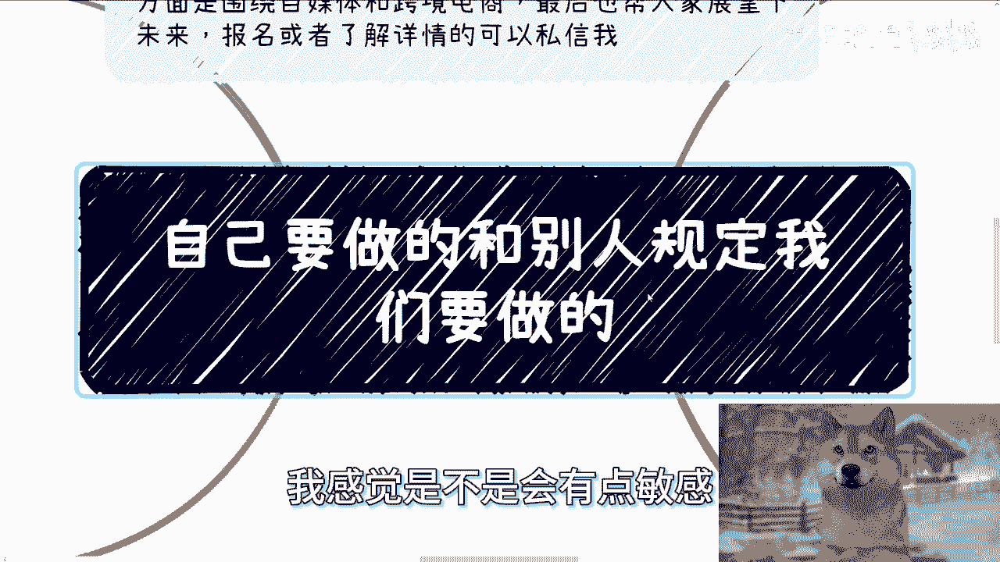
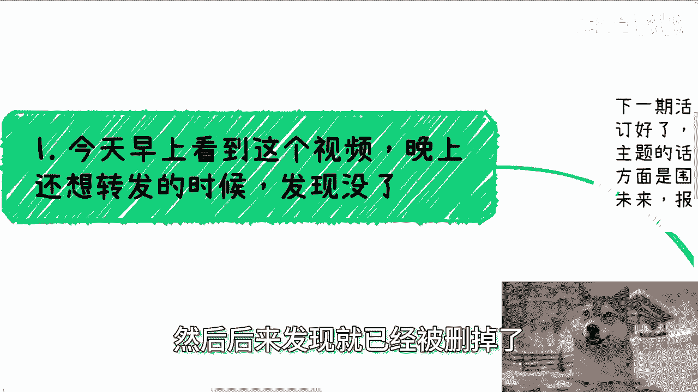
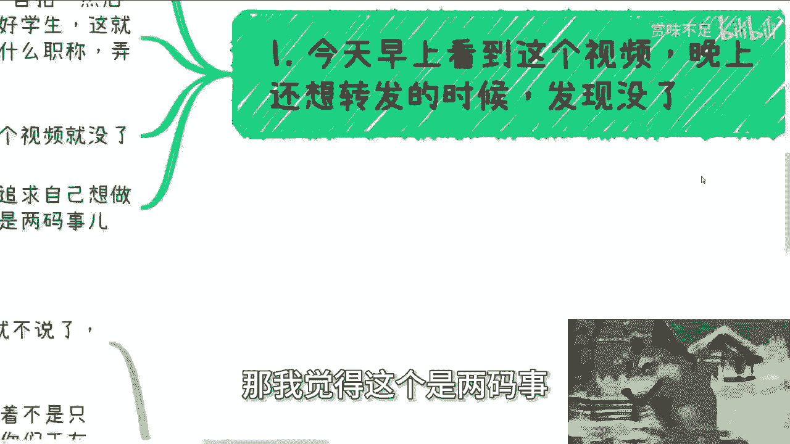
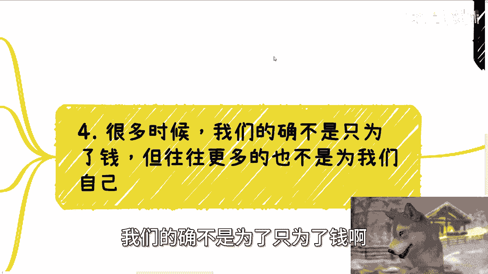
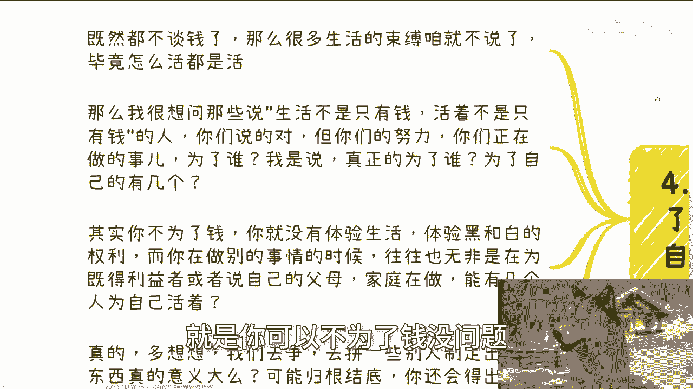
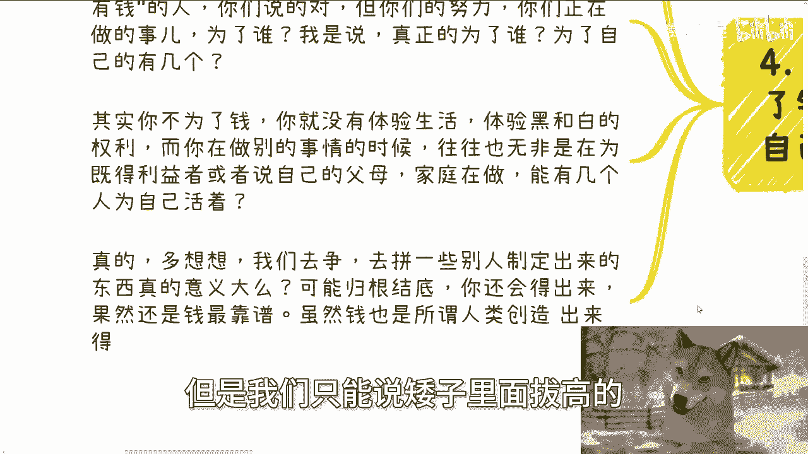
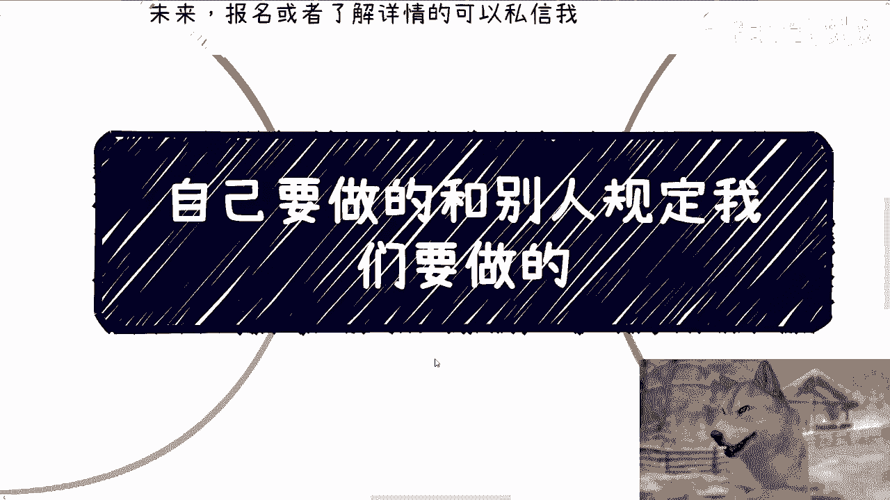

# 课程 P1：自己想做的 vs. 别人规定要做的 🧭




在本节课中，我们将探讨一个核心议题：如何区分并处理“自己想做的事”与“别人规定我们要做的事”。我们将通过一个教师评职称的案例，分析个人追求、社会规则与内在动机之间的关系，并思考如何在两者之间找到平衡。


---

## 概述：一则被删除的视频

今天早上，我看到一个视频。视频内容是一位刚工作两年的年轻教师的自拍。他表示，自己只想专注于教好书、教好学生，认为这才是教师的职责。他不想花费大量时间和精力去评职称，因为那让他很累，并且对学生没有直接帮助。到了晚上，这个视频就被删除了。



我认为这位教师能发出这样的声音，是一件好事。这说明有人开始追求“自己想做的事”，而不是盲目完成“别人规定要做的事”。这两者之间存在本质区别。

---

## 第一节：积累头衔与案例的争议


上一节我们看到了一个追求本心的例子，本节中我们来看看关于动机的常见争议。



之前我曾提到“积累头衔和案例”的重要性。很多人在评论区表示反对。他们的观点是：人生不能一切以赚钱为目标，我们还需要追求其他东西。


他们说的并没有错。但问题在于，说这些话的人，他们自己究竟想积累什么呢？我敢说，大部分人其实并不知道。他们只是在反驳他人中获得满足感，却不清楚自己真正想要什么。

这种现象非常普遍。例如，前两天有一位二十七八岁的朋友向我咨询恋爱结婚的事。我给了他两个前提：
1.  你内心是否真正渴望恋爱和结婚？
2.  你是否能果断地追求自己喜欢的，并果断地离开自己不喜欢的？同时，你做这件事不是迫于父母或家庭的压力。

能满足这两个条件的人太少了。很多人要么不知道自己想要什么、喜欢什么；要么优柔寡断；要么碍于面子或家庭压力而行动。最终，你的行动是为了自己，还是为了满足他人的期望？

---

## 第二节：规则、利益与“有用性”

在讨论了个人选择的困惑后，我们进一步思考：那些我们被要求做的事，究竟对谁有用？

很多事情并非人一出生就规定要做的。但由于信息敏感，我无法明说。现实中，确实存在许多被规定或默认必须做的事，无论是个人、企业、高校还是其他组织都在做。

但如果你仔细思考：做这些事到底有什么用？就像那位评职称的老师所质疑的——做这些对我们自己有什么好处？这究竟是我们追求的，还是别人规定我们去做的？

如果你做某事只是为了满足某个“标准”或“门槛”，那么你有没有想过，这个标准和门槛也是别人制定的。我们为什么要去满足它？我们活着到底是为了什么？

**核心公式**：
```
他人制定的规则 -> 你付出劳动 -> 他人获得利益（你可能是“他人”）
```

这里的“他人”可以指个人、组织或某种体系。**既得利益者**就是通过你的劳动而获利的一方。规则制定者往往就是既得利益者，否则他们不会这样制定规则。当然，最初可能并非如此，但随着时间的推移，很多事情就变味了。

---

## 第三节：不为钱，就为自己吗？


既然不是为了别人制定的规则，那么为了理想或自己可以吗？本节我们来剖析这个选择。



很多时候，我们的确不仅仅为了钱。但更多时候，也不是为了我们自己。你可以不为了钱，这没问题。但你真的是为自己而活吗？我并没有看到多少人是真正为自己活着的。



如果你真的能说：“我根本不在乎那些有的没的，我只追求自己喜欢和感兴趣的事，完全不在意别人的眼光和社会束缚。”那完全没问题，我双手赞成。

但很多人不是这样。他们一方面说“活着不能只为了钱”，一回头就去考公、考编、做着自己并不喜欢的工作。这很奇怪，难道你天生就喜欢这些吗？

我想问那些说“生活不是只有钱”的人：你们说的对，但你们正在做的努力，究竟是为了谁？真正为了自己的能有几个？

仔细想想，没有钱，你就没有体验生活的资本，更没有选择的权利。而你在做其他事时，往往也是在为既得利益者或自己的父母家庭付出，能有几个人真正为自己做事？

---

## 第四节：在现实中的选择策略

分析了理想与现实的冲突后，本节我们探讨在现实中可行的两种策略。





我们争抢的那些由别人制定规则的东西，意义真的很大吗？可能归根结底，意义都不大。而在这些意义不大的事物中，**钱是最靠谱的**。当然，金钱、权力、地位也都是人类创造的概念。但当我们没有能力制定规则时，只能“矮子里面拔高个”。

因此，我一直在讲：如果你想活得有主导权、更自由开心一点，无非两种路径：

以下是两种核心策略：
1.  **培养高性价比的赚钱能力**。这能让你在物质上获得自由，减少为生存而被迫接受“规定动作”的压力。
2.  **彻底不 care 外界规则与眼光**。一门心思追求自己真正喜欢和感兴趣的事，完全不在意社会束缚和他人评价。

但有多少人能做到呢？很多人都处于前者与后者之间，摇摆不定。正因为这种“上不上、下不下”的状态，才会产生焦虑、困惑和痛苦。

当然，这个视频并非要传达某个特定观点。更多的是引发大家自己的思考。人生说长也长，说短也短。“为自己而活”听上去很简单，但真正做到的人寥寥无几。

---


## 总结与后续安排

本节课中，我们一起探讨了“自己想做的”与“别人规定要做的”之间的张力。我们通过教师评职称的案例，分析了个人动机、社会规则与既得利益的关系，并指出了在现实中寻求自主权的两种路径：要么提升赚钱能力以获得选择空间，要么彻底无视外界评价追求本心。关键在于认清自己的真实需求，减少在两者间的摇摆与内耗。

最后，通知下一期活动：8月25日（本周日）在西安建筑科技大学李家村庄附近举办。主题将围绕不同的职业机会（Offer）、自媒体与跨境电商展开，并帮助大家展望现状与未来。报名或了解详情请私信。


此外，如果你在主业、副业、商业合作（如合同、商业计划书、分红等）方面需要规划，或觉得存在风险，希望获得更接地气的建议以少走弯路，可以整理好具体问题和你的个人背景，然后联系我。