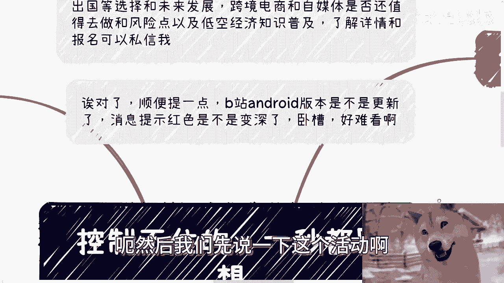
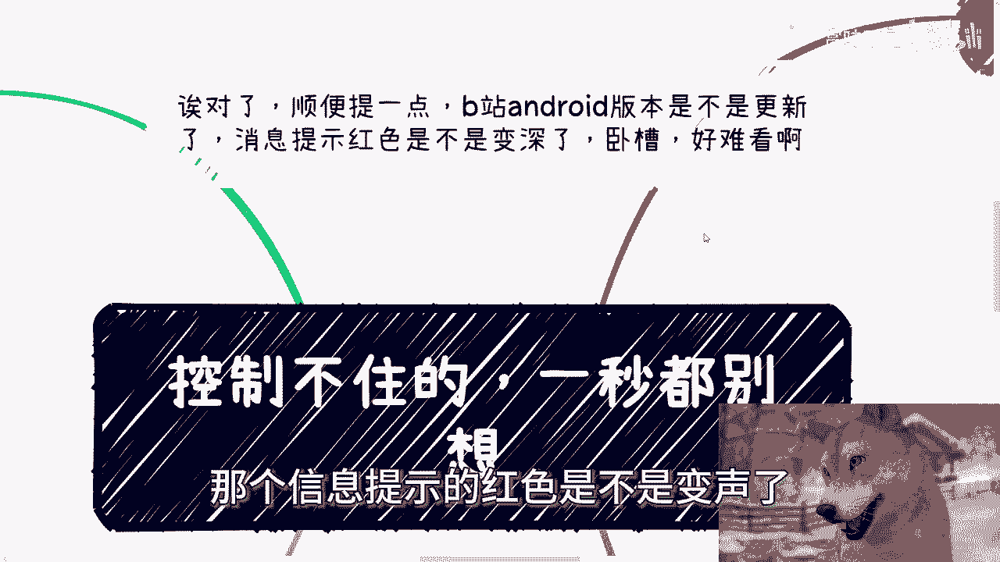
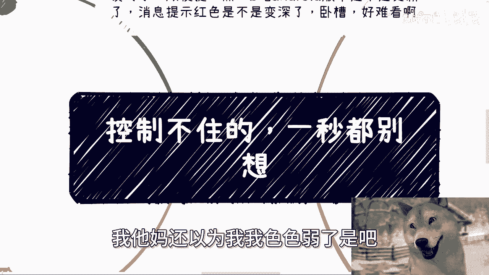
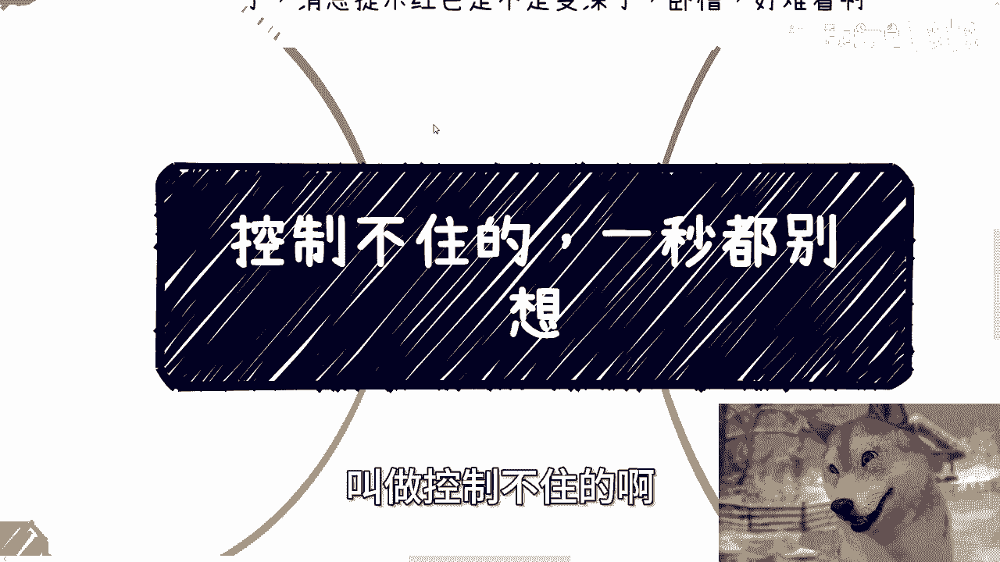
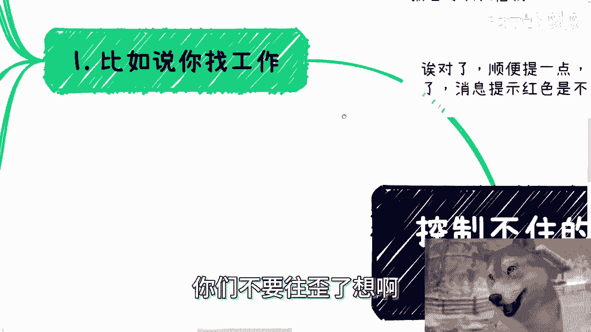
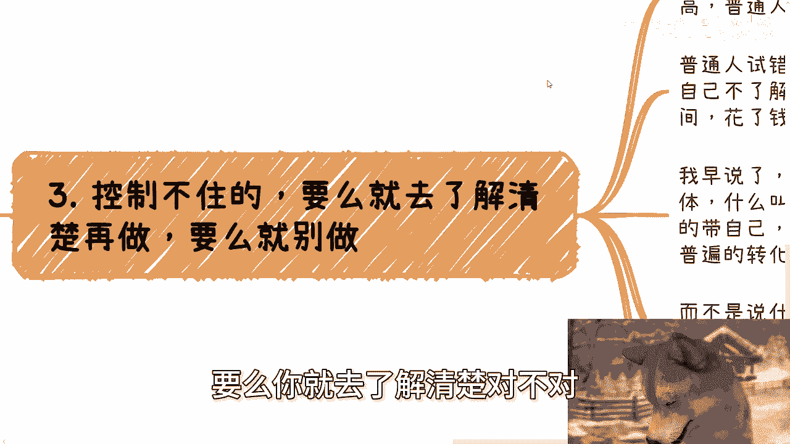
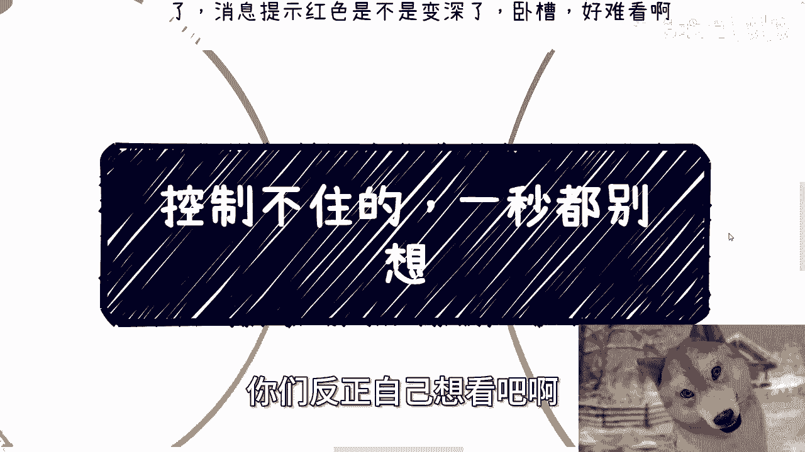
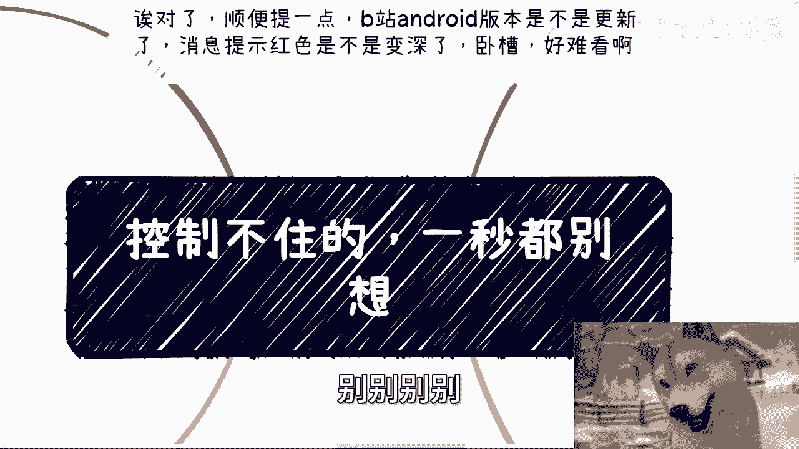

# 课程01：自己控制不了的，一秒都别浪费 🚫⏳



在本节课中，我们将要学习一个核心思维模式：如何识别并停止为那些你无法控制的事情浪费精力。我们将通过几个生活和工作中的常见场景，来剖析这种内耗思维的根源，并提供清晰的行动思路。

---





## 活动通知 📢





下周，即7月28日周日下午，将在东直门地铁站附近举办一场线下活动。

本次活动内容主要包括两方面：
1.  分析私企、国央企、外企以及出国发展的现状与未来趋势。
2.  探讨当前进入自媒体、跨境电商领域的可行性、风险点，并普及低空经济的相关知识。

了解详情或报名请私信。

---

## 核心主题：停止为不可控之事内耗

上一节我们预告了活动信息，本节中我们来看看本次课程的核心思想。许多人的焦虑与内耗，都源于试图掌控那些根本不在自己控制范围内的事情。

### 1. 关于工作与跳槽的幻想 💼

许多人找工作或跳槽时，追求“钱多、活少、离家近”或“更高薪、更稳定”。但你能控制这些结果吗？你不能。招聘的决策权在HR或CEO手中，你无法掌控。为此担忧，除了内耗，毫无益处。

有些人认为，通过跳槽可以“相对”找到更高薪、更稳定的工作。这种想法往往是自欺欺人。对于绝大多数普通人而言，这更像一场赌博。

所谓“好工作”的获得，通常只存在于两种绝对条件下：
*   **绝对的能力**：拥有深厚护城河的核心技术。
*   **绝对的关系**：拥有决定性的背景或人脉。

**公式：好工作 ≈ 绝对能力 || 绝对关系**

如果这两者都不具备，仅凭一份普通的履历去寻求掌控权，是不现实的。拉长时间线看，到35岁、40岁时，工作的“稳定”和“高薪”很少能单纯依靠个人能力维持。因此，与其幻想通过普通跳槽改变命运，不如思考如何构建自己的“绝对条件”。

### 2. 关于资质与风险的担忧 🛡️

以下是关于起步时缺乏资质或担心风险的常见问题与三个分析角度。

**问题**：“没有资质/学历/背景怎么办？”、“被人攻击或揭穿怎么办？”


**角度一：历史规律**
回顾任何行业的发展史，除了头部玩家，中下层的参与者起步时几乎都是“要啥没啥”。事情都是一边做一边补齐资源的。等待“集齐七龙珠”再开始，机会早已消失。过度担忧这些，并非先见之明，而是杞人忧天。



**角度二：利益核心**
所有合作本质由利益驱动。客户或合作伙伴真正关心的是：**你能否为他们带来价值（尤其是经济利益）**。其他都是次要的。这就好比玩即时战略游戏，无效操作（APM）再高也没用，核心是有效的策略和关键决策。

**代码类比：**
```python
# 无效关注 vs 有效关注
focus = ["资质证书", "学历背景", "他人评价"]  # 次要因素
core_focus = "能否为客户创造价值"  # 核心因素
if core_focus == True:
    print("合作基础成立")
```

**角度三：风险本质**
你是否认为，只要自己踏踏实实、认认真真做事，就不会遭遇攻击、造谣或风险？现实并非如此。网络上无端遭受造谣的人比比皆是。担心不可控的风险无济于事，这类似于“受害者有罪论”。

正确的做法不是幻想没有风险，而是去学习如何**应对和管理**风险。例如，学习如何取证、如何通过公证处固定证据。你控制不了坏事是否发生，但可以控制自己应对坏事的能力。

### 3. 关于“试错成本高”的误区 🔄

常有人说：“普通人试错成本太高。” 这句话本身是结果，而非原因。成本高的根本原因在于：许多人在“试错”时，根本不清楚自己在做什么。

正常人做事的逻辑是：先进行小范围验证和测算，再行动。
*   **以自媒体为例**：正常逻辑是先找到已有流量的中小V合作，或定位到精准受众社群，基于行业常见的转化率数据（如5%-10%）进行测算和规划。
*   **错误逻辑是**：什么都不了解，没有验证，就直接投入时间金钱开始做，美其名曰“试错”。失败后，则归咎于“普通人试错成本高”。

如果你经过努力寻找，依然找不到合作伙伴或验证途径，那可能说明你目前在此领域不具备优势或天赋。这时，选择不做或换个方向，是更理性的选择，而非硬着头皮上再去抱怨环境。

### 4. 思想上的自我设限与颠倒 🤯

许多人的思维模式与正常逻辑完全相反，这导致了持续的内耗和无力感。常见的模式有：
*   **不实践，只听说**：不亲自了解、观察、实践，仅凭道听途说就做出重大判断和决策。
*   **矛盾抱怨**：一边抱怨自己赚不到钱，一边默认赚到钱的人都是靠关系，同时抱怨自己没有关系。
*   **无视客观事实**：如同一个社交技能不足的人抱怨找不到对象，却从未真正积极地去寻找或提升自己。他们无视自身条件的客观事实，将结果归咎于外部环境。

更极端的情况是，当有人给出具体改进建议时（如“面试时语气稍谦虚些”），会直接用“我做不到，我就是这样的人”来拒绝改变。如果人生中的所有变量都被你设定为**不可更改的常量**，却又期望出现不同的结果，这本身就是不合理的逻辑。


**公式：期望的结果 ≠ (常量1 + 常量2 + ... + 常量N)**

每个人活在世上，并非一定要达到某种特定的成功。如果决定要“逼”自己一把，那就去改变那些**可以改变**的变量。如果既不想改变，又抱怨结果不如意，那不如坦然接受现状，停止自我折磨。

---

## 总结 📝

本节课我们一起学习了“停止为不可控之事内耗”的核心思维。
1.  在工作选择上，认清掌控权所在，停止为无法控制的结果焦虑，转而积累“绝对能力”或“绝对关系”。
2.  在行动起步时，接受“一边做一边补”是常态，关注创造价值的核心，并学习管理风险而非逃避风险。
3.  在“试错”过程中，强调基于验证和数据的理性行动，避免盲目投入后归咎于外部环境。
4.  在思维方式上，警惕自我设限和逻辑颠倒，分清哪些是能改变的变量并付诸行动，对于无法改变或不愿改变的部分，则坦然接纳。



记住，对于自己控制不了的事情，一秒都不要浪费。你的精力应该聚焦在那些通过努力可以影响和改变的事情上。

---



**附：咨询服务**  
如果你在工作、合作、副业中遇到股权分配、合同、商业计划书等问题，或需要接地气的职业规划、商业规划建议，欢迎整理好具体问题后咨询。