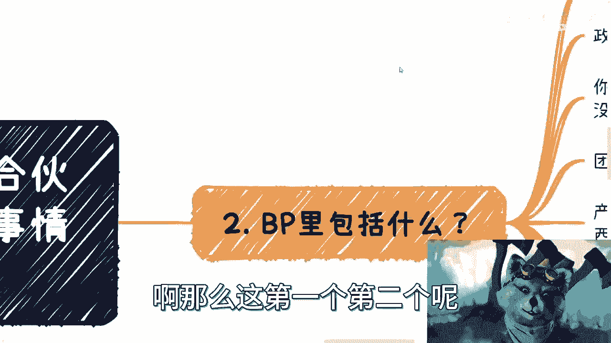
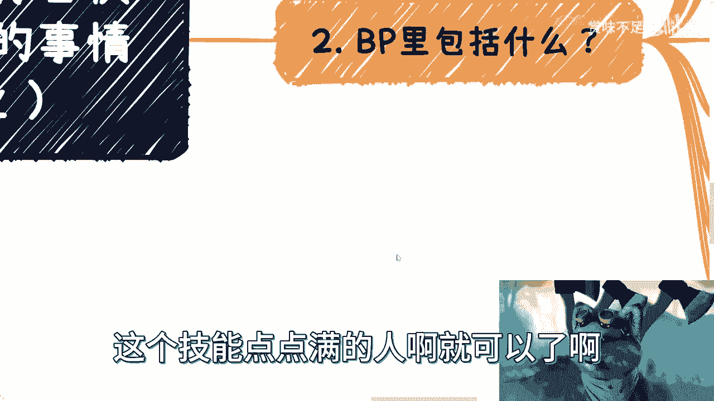

# 融资或者你合伙人融资，你必须要了解思考的问题 - P1 - 赏味不足 - BV1GN411a7EE

好，大家好啊。这个前两天啊啊对，先说一下这个前提的时候，今天我发了一个状态，对吧？然后就是说这个白嫖不白嫖的事情啊，我觉得是这样子的，很简单啊，就是这个欢迎大家有偿的啊来咨询，欢迎大家有偿的来合作啊。

随便怎么样都可以啊。这个白嫖这个事情在我这儿我是坚决抵制的啊。😊，那么首先这第一点。第二点呢，就是说这个呃前两天呢这个咨询当中啊，有小伙伴正啊提到了这个问题，我就想着说索性把它展开说一下，当然我也。

不可能说说的太详细啊，因为。这个东西真的展开，里面东西老多老多了啊。呃，本次内容呢是说融资啊，就比如说你毕业了，对吧？作为一个应届生啊，你说你。啊，或者作为一个打工人啊，你说你融资或者你合伙人融资啊。

你在这当中。要了解的事情跟一些问题啊。首先。

我觉得很多人理解错了一件事情是什么呢？就是觉得融资呢是因为现在没有启动资金缺钱了，所以去融资。但是你们想想看，你把屁股换一下啊，也就是说，如果你是个投资人，对方来跟你说，我操他妈的我缺钱了。

我缺启动资金了，你会投给他们，你肯定不会投嘛，对不对啊，这哪个傻逼会因为对方缺钱了投资嘛，对不对？没有的啊，所以你要记住啊，就不管怎么样啊，他都有他的这个原因啊，在这里面啊？😊。

好，那么我们首先一个个来说，哎呀，去。

啊，第一个啊，因为前两天呢有个小伙伴咨询啊，我觉得细节蛮多的。我先从大框架上面来说一下啊。嗯，第一呢就优先级最高的事情，就是所有的事情都放在第一点，就放在这一点是什么呢？就是你去了商业战场。

一定都要有据可依啊。当然这个剧是不是真的并不重要。😊，啊，我们说的是有据可依，也就是说对你来讲是能说服你的。对投资人来讲也是说服你的。哎，我跟你讲，这就跟你相亲是一样的对吧？他妈的别人看不看得上。

你不重要啊，你这个对象能不能看上你就就重要了啊，就可以了，对吧？所以说啊就是只要这个据对方是认可的啊，那就是落到实际上就是真的，否则一切都是假的。😊。

啊，记住啊，这是第一点。第二点呢就是BP啊，商业计划书里面到底包含什么？啊，第三呢怎么估值啊，第四呢，你要明白融资意味着什么啊。第五呢就是那个投资比例啊，那么同样的你在做这些事情当中呢，你一定要明白啊。

你自己的想法往往可能不一定是正确的啊，我不能说你完全不正确，我也不能说你完全正确，对不对？但是呢你一定要多去找创业者或者投资人一起看看这个项目。比如说啊你到时候在真正落地之前，你再来找我，对吧？

你把问题说一遍啊，你把大家再跟你一起判断一下，对吧？那这样的话，你的整个至少咱不说成功率啊，至少你被坑的比例会降低。😊。

啊，那么这第一个。啊，这不是第一个啊，这里才是第一个啊。那么优先级最高事情呢，就像我们刚刚说的啊，一切要落到实处。那什么意思呢？就比如说。😊。

哎呀呀呀呀呀呀呀对吧？就比如说你的估值，你的估值可以是虚的，而且大概率你的估值本来就是虚的对吧？但总有一个依据，那什么意思呢？依据是什么？就比如说你的竞品啊是不是啊？还是你你你你竞品这个估值多少啊。

你你背书是谁啊，对吧？你你牛逼是不是吹得好啊，对吧？还有你个人投资人是不是有不可告人的关系啊啊，这些都不重要啊，重要的是你总得有一个东西说服你自己，你总不可能告诉我说，哎，刘老师。

我觉得我的估值是一个亿，那他妈你觉得一个亿有卵用？😊，对不对啊？那你要是跟我说，哎，我估值我觉得100万，那他妈我就告诉你1000万低肯定是低了。但是你觉得1000万没有用啊，你觉得多少千万都没有用。

你得有个说法，你知道吗？啊你得有个说法，而且这个时候我跟跟你这么说，你得想好别人接下来问你什么，比如说我举个例子啊，比如说你今天跟我说啊，我依据是123456，我估值是5000吧？好。

那么我我可能就我不是为了刁难你，我不是为了chle你啊，我就是客观的问个问题，我说哎那你的那个竞品跟你数据差不多嘛，那为什么他估值只有2000万呢？那为什么他估值只有000万呢？你要想好，你要想清楚啊。

你总不能跟我说啊，他妈的别人是别人，我是我。😡，那可以啊，那你要足够牛逼啊，你不足够牛逼，你说这种话没有用的对吧？投资人不会屌你的，我跟你讲，投资人啊给你10到15分钟已经是很好了。😡，啊。

那么这第一点。第二点是投资额多少，对吧？行，好，那么不管多少，滴滴先做然后就比如说你你被调可以先做，对吧？钱到账合同先签，别逼逼。😊，对吧这些事情也是的，就是你你所有的事情就是说能行就行，不行，别拖。

你知道吗？啊，包括就是说你去拿投资，不是说你处于一个被动状态，不是说你就是弱势群体，你要主动的，你要迫使他们，你知道吧？你就说你你爱投不投，你不投，他妈的滚，对不吧？也就简单嘛，对吧？

就是这事情是这样子的，不是说你屌不屌，也不是说对方屌不屌，就是就是有事情沟通嘛，对吧？如果来说有事情不能沟通啊，大家又是拖着的，那还不如滚。😡。

你说对不对？有什么意思呢？对吧？这第二点。第三点我这么说啊，我就这么跟你们讲啊，我给那些小资方啊做顾问的也很多啊，我之前在21年给蚂蚁那边做了一些关于区块链的顾问，我也做了很长时间，对吧？

包括啊呃1819年的时候，我自己也是给中国十大天使投资做过路演。😊。

对，全部做过一遍，我一个做一个做过来，一场一场踏踏实实做下来的，就真的是硬刚刚过来的啊。所以我跟你们讲事情都是你得自己做过，你才明白这里面有什么坑。😡。

啊，包括那个英诺对吧？因诺他们老板妈的之前也聊了很久了。😊，呃，红山对吧？都有啊。你比如说所以说啊任何事情你都要记住，对吧？要有依据，对吧？你要有你要能说服自己，哪怕这个依据是假的。

你跟对方认可就可以了。但是你别就是属于那种就是毫无依据，然后就是我觉得这样子没有用的啊，他妈地球不是围着你转的。😡。

啊，那么这是第一个第二个呢就鼻P啊呃商业计划书我以前说过一遍啊，我在这个地方再说一遍啊。第一，你要有政策大方向宏观内容。也就告诉大家啊，目前当下整个大局是怎么样的，我不管你切任何一个小的市场。

比如说你说我就做外包人员的培训可不可以可以，但是你一上来政策一定要拉的是什么，就是好，习大大说过对吧？这个接下来职业教育，因为国务院你们翻嘛，上个月国务院刚刚发过文嘛，对吧？要大力支持职业技能发展。

职业这个学校教育没问题啊，你要高度拔的足够高，你知道吗？就是说白了你一定要把你做的事情跟足够高的高度先贴合，你这样的话才有一个很高的高起点，对吧？我们在商业上一直讲究什么高举高达，什么叫高举高大。

就是你做的事情是什么并不重要，但是你的格局要大，对吧？你今天做了一件很很很很很很小的事情，你格局如果不够大，那这个事情就很小你格局如果但凡大了O那么你。😊。

说明你未来可想象空间很大。

啊，那么这是第二点。那第三点，你要做什么，对吧？你要解决什么问题？对。😊，我跟你讲，一定要说清楚痛点啊，我以前记得我在某一个事频里面，我跟你们讲过，对吧？痛点有很多种，有的是老百姓的痛点。

有的是上面领导的痛点，我不管你是什么痛点，反正你一定要说出个痛点来，你他妈没有痛点，你他妈也得造出个痛点来，你知道吗？啊，你就说哎这个人像不像我，你说他不像我哎我觉得他就是我对？不重要啊。

反正就是你得造出个痛点来啊，第三团队介绍团队介绍什么意思，你要秀肌肉啊，那就回到我跟你们讲啊，对吧？你为什么要出去认识人啊，你为什么要东出去东搭西搭对？为什么出去这个三角九流认识啊。

你为什么要给自己套虚的t啊，对吧？你为什么要去各种各样的去参加活动啊，你的目标就是要去给你的团队增加各种各样的倍数，你明白吧？因为你要知道这些团队很多根本不是全职啊，很多团队都是兼职啊。

很多团队也都是给你站个台的，很多团队的人甚至他妈的是因为你付了他10万块钱，他就给给你站了个台罢了呀。😡，就是你要又秀肌肉啊。😡，啊，你别跑出来说啊啊这个人什么学校毕业的啊，这个人以前在什么工作工作啊。

那个人什么学校毕业的啊，那个人在什么厂里工作有卵用啊。😊，我跟你们讲呀，打工人都是标品，你拿出一堆标品来跟我说，哎，我这个团队有优势。😡，有什么有事？Can you can B的优势。对不了啊。

那再往下啊呃你要写清楚产品的技术架构。对我跟你讲这块是什么？就是你要开始说别人听不懂东西，越高端越好，怎么吹，怎么高端怎么吹。😊，你知道吗？啊，那当然最好合理的方式呢，哎你再配一些软著啊，配一些专利啊。

那不得了啊，效果八群啊，对吧？好。😊，那未来的预期呢就是说当然啊就是说啊由于你的产品行业啊，产品不同，行业不同，你写的呢可能也都不同。就是包括你未来的预期。那因为这个未来预期。我就这么说。

有的是比如说一些饼状图，对吧？就是一些。大数据图啊，daashboard有一些呢可能就是表格，你知道吧？很细的，比如说。😊，我Q一能有多少用户量啊，Q1赚多少钱？因为你由于行业不同，我说实话。

你能吹出来的牛逼不一样的。啊，你的颗粒度粗细也是不一样的。那么好，那么你包括你的融资比例，你要在BP里面写的很清楚，你的融资比例第一轮是多少，对吧？估值是多少？你的估值是怎么出来的？参考估值是什么。

对不对？那么你的合作伙伴又回到这个问题，继续秀肌肉，对吧？能把你的合作伙伴能拉上都拉上啊，对不对？这很简单，你比如说清华呃清华大学出版社，我操他妈跟我应该合作快十0年了，我现在做任何事情。

我第一时间去打电话给他们。我说来，我给你们免费搞，你们要不要搞啊，我只要你们给我挂个logo，就这么简单。😡，对不？就很而且是另外一件事情是什么？就是我也许有很多人不认识，但是他们的资源很多啊，对吧？

我每次都会跟他们说，我说那个谁我说那个谁主编，对吧？我说你们还有什么资源的，你帮我去推荐推荐对吧？帮我这个做个中介也好弄的呀，对？不是所有事情都得自己来的你懂吗？啊，然后呢，最后一点就是所有啊。

你把可以修肌肉的东西全部放进去，反正就是你一定要对告诉对方，你是一个猛男啊，你是一个这个这个这个很牛逼的啊，这个技能点点满的人啊，就可以了啊，不是点满的人啊，我就举个例子，点满的团队啊，点满的项目啊。

就这样子啊，好，这个是第二点啊。😡。

呃，第三点怎么估值？

啊，这也是那天跟我咨询的那个小伙伴呢，就是最最核心的那个问题点啊，呃怎么估值是这样子的。首先这个事儿啊跟你在的行业很有关系，哪怕我们说的不是实业啊，但是跟你每个行业也有不同的关系。

因为你不同行业不同领域不不同的垂直领域估值模型跟估值的模式都不一样的。当然你面对资方的这个不同也是不同的，也就是说你面对的是个土老板呢，还是面对的是个小基金呢，还是面对的是个国有资金呢，对吧？

你的估值模式肯定都不一样啊，对不对？你你你面对国有基金，那你肯定得弱势，我不是我说什么，对吧？你得放下放在放低姿态，因为你是跪舔的，就这么简单，你跟国有基金有什么好说的呢，对不对？

那你跟一些这个资基那个纯粹的基金方，基基金方或者说个人老板，那没问题，对吧？平起平坐，是不是啊那同样的你可以先做调研，对吧？比如说所在行业跟一般的创业这个项目估值大概是个什么范围，对你不能太妄自菲薄。

你也不能太这个。😊。

就是天马行空对吧？你说你说比如说这个行业对吧？这个呃第一轮估值差不多也就5000万到1个亿，对吧？你说我操他妈的我不管他，我上来就10个亿，那那你可能是3啊，那你可能是3对吧？啊，然后呢，就是估值。

你看什么领域啊，就是说首先你比如说电商，对吧？那你肯定跟你说和你怎么做对吧？你做什么领域，做什么行业有关系，对吧？你肯定得写出个表格，你就说我可能怎么选品啊，我可能接下来怎么GMV做到多少啊，对吧？

我整个的这个这个那个叫什么就是利润率做到多少啊，对吧等等等啊，如果你单纯的是个互联网产品的创业，那么你又不一样了，对吧？你可以可能就简单的你可能做一个这个。😊，叫什么就是这个这个这个这个饼状图，对吧？

或者说一个一个简单的估值就可以了啊。那记住估值这个东西呢，它并不是一个节点来做的，或者为了一个节点来做的。什么意思呢？就是说你如果要去做估值啊，你要考虑的是你的目的是什么？你知道吗？

你要考虑的是你这一轮估值结束了，你下一轮怎么弄，对吧？包括你下下轮怎么弄，包括你最终目的是什么，对吧？也就是说你到底是要做产品，还是纯粹的资本运作，还是说做产品同时做纯粹资本运作。

还是说你比如说我做两轮就要并购了。我做两轮就收购了，或者还是做到IPO还是我要跟跟国企混改，就你要把你的逻辑最终的逻辑想明白，你知道吧？哦，那么这些其实都会影响到你第一轮这个估值到底怎么去定啊。

那么在这个地方我得说一句啊，就是说但凡不是这样思考的，我就这么跟你讲，它一定对估就对融资跟商业是不了解的。那么也就是说如。😊，我这个人做主导，那么这个项目很有可能是不靠谱的。啊，这点我跟你们说的很清楚。

这种东西容不得一丝的马虎的，你知道吧？就说白了是什么？就是又回到那句话上面，要么你就是个纯粹老实人，你有很刚的实力，对吧？你老牛逼了，你知道吧？然后就说你能做就做不能做拉倒，要么就这样。

你要么就是一个纯忽悠，你知道吧？就是对整个的商业逻辑，对整个的忽悠逻辑了如指掌啊，就是都胸有成竹，而且以前运作过，那也没问题，但凡半桶水，我跟你讲，都他妈是没有什么好结果的啊，那么记住估值这个事呢。

一定程度上呢都是碰死耗子啊，就是你不是要去找不认可你的人，因为你找不认可你的人很容易啊，你要找到认可你的人啊，别管那些不认可你的人，当然还是我刚说那句话，你别太夸张对吧？你别那种什么拿出来一个鼻P。

我他妈看了两分钟就感觉我操这鼻他妈的什么东西都没有，然后你上来就开口，我估计要一个意义，那你滚吧。😡。

啊，那你要么就跟我说，你是某某某市长儿子儿子，那也行啊，也不是不行，对吧？那但凡不是这样子，你就自娱自乐啊，你就别别别搞搞的有的没的，别别出来这个弄笑话啊。😡，好吧，那么这个是3。

啊，44呢就是说你要明白啊，你要明白，就是说融资意味着什么啊。

呃，就像我一开始说的，既然融资并不是只为了解决缺钱和启动资金，那么融资也有它的目的性啊。你比如说投资本身都是有目的性的，你融资也有你的目的性，但大家各取所需罢了。

你比如说就像我们刚刚说的投资你可能是因为他想很快的退出，他想未来去因为你的背景，你的资源，你的产品，你的你的各种各样的东西，可能让他觉得哎你是有未来发展的对吧？

或者说让他觉得这些东西在未来是叫做叫做嗯可有东西有依靠有这么一个牌可以出去打的，而不是说当然我在这地方说的依靠或者什么，不是你的技术，你的技术没什么卵用的啊，就比如就像我刚刚说的。

你可能是某某市的儿子啊，市场的儿子，那没问题啊，你比如说那个你跟卫建委对吧？战略合作啊，然后卫建委说啊，这个就是我孵化的项目，那也没问题，对吧？比如说科伟经信委对吧？就各个方面团委也可以啊，对吧？

就是你这些东西是资方一看就懂啊，他是有价值的，你别来跟我谈技术。😊。

技术没有任何价值啊，就这么简单，你要不是LK99，这种别他妈来逼逼。😡，对啊，那么呃当然话一说回来，你的目你的目的呢可能也有你的目的，就是你融资啊，并不是只为了钱。你可能为了说哎我希望这个资方，对吧？

你比如璎诺啊、红山啊，对吧？或者其他的。😊，什间调。哎呀哎呀。妈的找不到了算了。😡，对吧就是你可能希望的是他们给你来做背书啊，你说真的投你多少钱呢也不是那么重要，对吧？那么我觉得大家各取所需呃。

各取所需嘛，对不对？那达到你的目标就可以了嘛。你会通过这些背书来获取更多的资源，对不对？😊。

那第五点，投资比例。

啊，投资比例这边呢是这样子的啊，比如说投资这个神。就像我刚刚说的呃，并购收购呃，领头个人投资混改VIE。😊，很多很多。啊，模式多的是啊，那投资比例这个事呢，我们来举个例子啊，比如说今天有个项目，对吧？

估值是X，第一轮融资额是Y。😊。

那么这个时候的整个的比例呃整个的比例其实是那个呃X分之X分之Y嘛，对吧？那么比如说啊这个时候有个机构说Y我都要了。好，那么我们怎么来看待这件事情很简单。首先我们来问几个问题啊。

第一个问题是机构这个机构除了Y还能给我们什么，如果不能，那么我们是不是要让出Y分X分之Y这么多的比例出去，对吧？我不管这Y是多少，对吧？这是第一点，第二点是这个X分之Y的比例本质上其实是种约束啊。

你不要觉得你是项目方，我跟你讲，你但凡有资方进来，你他妈资方就是爸爸啊，你他妈就是个蛋啊，你就是个蛋那么Y分之X的比例本质上是种约束，也就是说Y的比例但凡越大一方面机构的话语权也大啊。

另外一方面你要明白，那么也就是说后面的参与者的这些人的难度也会越高啊，那么也就是说。😊。

呃，不管啊我不管这个我I。过来垄断的这个人到底是国企央企啊，还是说什么大机构，还是说什么个人，还是什么基金方，这不重要，重要的是你都要考虑好啊，这个Y给出去之后，你要考虑个后面的路到底怎么走。😡。

对吧你比如说你比如说你就问他，你说哎那这个Y比例这么高，万一后面的融资方进不愿意进来怎么办呢？因为Y的比例但凡很高，对于后面的资方来讲，其实就是一个就散发出一个信号，就是他妈的老子是来接盘了。

但问题是老子为什么要来接盘？😡，对吧你得想好这个问题，你别一上来就感觉到，我操有人投资了，我操老牛逼了，对吧？那对对方他妈的钱还没到账呢，你就感觉我操老牛逼了，有啥用啊，没用的。😡，啊，要理性。

你知道吗？一定要理性。😡，啊，就说白了啊说白了就是这些所有东西啊都是套路，你知道吧？都是套路，你一定不要让自己把这个就是就是自己把自己套进去，你知道吧？你要冷静，同时你要明白这都是套路啊。

那就看谁套得动谁，你知道吧？啊，那么所以一般来讲啊，比较合理的是什么，你要么对吧？这个Y。😡。

就是个大机构，同时你们双方就达成一个不可告人的秘密，对吧？就比如说你说好，5年后啊，你就是要并购我的，或者你就是要这个收购我的。😊，然后很简单啊，5年内我们双方一起想办法烘托估值价。

我们想办法把把整个股价做上去。😊，不就好了吗？我操这这事情我觉很我就我跟你讲很常见啊，有什么啦？😡，对不啦？就我们两个就做庄嘛，呃然后我们就就一起来搞嘛，搞了之后，我们也吸引这个投资人进来嘛。

大家共赢嘛，对不吧？只不过我们两个是最大的赢家嘛，又有什么问题了，又没问题了，你能把我怎么滴啊？😡，是啦啊，然后呃对吧？那当然就是说你要是这种回购或并购呃，收购或者并购也就算了，对吧？

你但凡不是收购或并购，那么你玩的这个比例，最好是平均或者说给予多方多个资方。因为这样的话，你能做到一定的制衡。因为往往一般是这样子的，你会拉，你会找一家牛逼的对吧？

有一定背书的叫做高举又回到我们说的高举高打的这么一个高度，对吧？可能投个1%给你啊，那么剩下你可能还要9%或者4%，你要问谁要呢？你就拿这个背书到外面去叫，你就别切问他们咬了，你知道吧？就简单来讲。

就是说我其实只要个背书，你投个1万块钱也可以，无所谓啊，那那这种事情其实水下有很多种操作方式。😡。

你知道吗？因为很多东西并不是我们表面看到这个样子啊，但是这个你一定要明白你你你要这笔钱的目的是什么？很多人醉翁之意是不在酒的。😡。

哦。好吧，那么。

那么呃最后我总结一下啊，就回到这个问题上面了，就是说你们就记住一点啊，就是说。你这个项目的投资，你得为自己项目负责，投资人其实也会为这个项目负责。而最终说到底，你要为这笔钱负责。

而投资人也会为他投的这笔钱负责。那么你就想想看啊，就是说不管里面的逻辑多么不合理啊，那么你。😡，跟投资人怎么赚钱，你得想明白，就你们两方到底怎么赚钱啊。第二方面是这个投资人到底要怎么退出。

他的退出机制是什么？😡，那到底是二级市场退出呢？一级市场退出呢，还是怎么个退出呢？对不对啊？第二就是说。😊，啊，第三就是说后面的投资人为什么要进来？我们吸引别人的点在哪里？啊，就是他进来的核心目的。

或者我们有哪些牌可以让对方进来。我跟你说，你跟投资人一旦他投资，或者你们开始谈这件事情，你们两个就是一根一条绳上的蚂蚱，你知道吧？没什么区别的，该谈谈该聊聊啊，不吃这些事情不聊透的。我跟你讲。😡。

一定都是一地一地鸡毛啊，你不用看了啊，就是大家要一起赚钱呢，就是诚意都摆好，把所有事情聊透。但凡我跟你讲，你脑子不清楚的，或者他脑子不清楚的，那么你们就别聊了。

因为你们双方但凡只要有个脑子不清楚的这个是这个合作是执行不下去的，到最后只会就是说大家闹闹的矛盾，或者说就看撕逼，没什么意思的懂吗？啊，那么这个事情呢，我顺便最后再提一句啊，融不融资也是一样的。

你们找商业合作伙伴也是一样的。你们要去找的是脑子清楚的啊，不要去找脑子脑子不清楚的，也不要试图企图去想说我能不能利用他，不好意思，你没这个能力，他也没这个价值啊，就这么简单。😡，好吧，行吧。

那就这么着吧啊，那个有什么想法的啊，有什么牌怎么打的，你们就私信我，好吧。😊，走咨询。