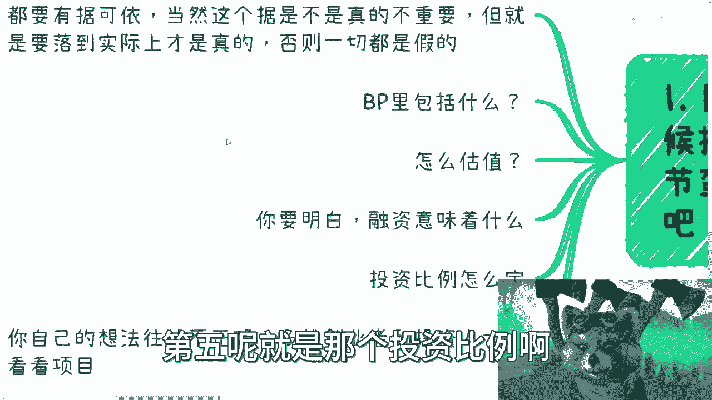
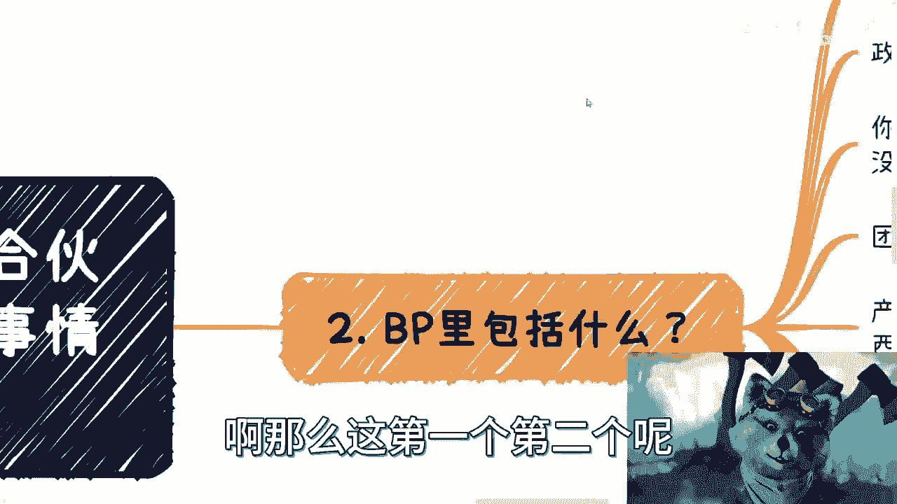
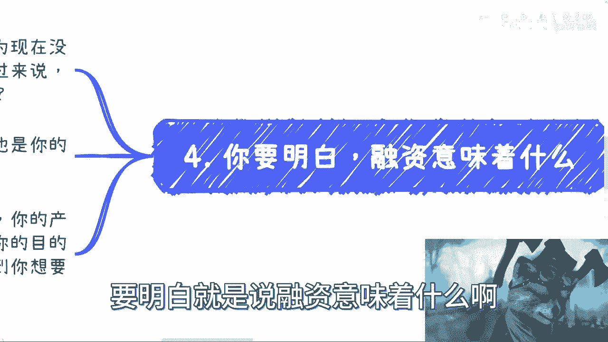

# 融资或者你合伙人融资-你必须要了解思考的问题---P1---赏味不足---BV1GN411a7EE_

在本节课中，我们将学习关于融资的核心知识。无论你是应届毕业生、职场人士还是创业者，当你或你的合伙人考虑融资时，必须清楚了解以下五个关键问题。我们将逐一拆解，帮助你建立清晰的认知框架。

## 一、 核心理念：一切要有据可依 📝

上一节我们概述了课程内容，本节中我们来看看融资的首要原则。

融资的首要原则是：商业战场上的一切都必须有据可依。这个“据”对你而言是能说服自己的，对投资人而言是能说服他们的。这就像相亲，对方是否认可你的理由才是关键。只要双方认可，这个依据在商业上就是成立的。

**核心公式**：`商业可信度 = 双方认可的依据`

## 二、 商业计划书（BP）的核心要素 📄

理解了融资的基本理念后，我们来看看如何通过商业计划书来呈现你的项目。

一份合格的商业计划书需要包含多个层次的内容，目的是全方位展示项目的价值和潜力。

以下是商业计划书必须包含的核心模块：

1.  **政策与宏观背景**：将你的项目与国家大政方针、行业发展趋势相结合，拔高项目起点，展示宏大格局。
2.  **要解决的问题与痛点**：清晰阐述你要解决的市场痛点。无论是用户痛点还是行业痛点，必须明确，甚至需要创造性地定义痛点。
3.  **团队介绍与实力展示**：充分展示团队背景、经验和资源。目的是“秀肌肉”，利用一切可能的人脉、头衔和过往经历来增强团队可信度。
4.  **产品与技术架构**：描述产品的技术实现，使用专业、高端的术语。配合软件著作权、专利等资质，效果更佳。
5.  **未来预期与财务规划**：根据行业特性，展示未来用户增长、收入预测等数据。可以使用图表、仪表盘或详细表格。
6.  **融资需求与估值依据**：明确写出本轮融资的金额、估值以及估值参考依据。
7.  **合作伙伴与资源**：列出所有能为你背书的合作伙伴，充分利用外部资源为项目增信。

## 三、 如何确定公司估值 🧮

制作好商业计划书后，下一个核心问题就是如何为你的公司定价，即估值。

估值并非随意设定，它受行业、领域、资方类型等多种因素影响。你需要进行市场调研，了解同类项目的估值范围，避免妄自菲薄或天马行空。

更重要的是，估值是一个系统性思考的起点。你需要明确：
*   本轮融资的目的？
*   为下一轮融资预留多少空间？
*   最终目标是产品上市、被并购还是IPO？

**核心提示**：估值一定程度上是寻找“认可你的人”。你的任务是说服认可你的人，而不是去纠结不认可你的人。但前提是你的估值要有基本依据，不能脱离实际。

## 四、 融资的真正目的 🤝

很多人误以为融资只是因为缺启动资金。本节我们来澄清融资的多元目的。

融资和投资是双向选择，各取所需。投资人的目的可能是快速退出、获取你的背景资源，或是将你的项目作为其投资组合中的一张“牌”。

同样，你融资的目的也不应仅仅是钱，可能还包括：
*   **获取背书**：引入知名投资机构（如红杉、英诺）为其品牌背书。
*   **获取资源**：借助投资方的网络、渠道等资源助力发展。
*   **战略协同**：与在某些领域有专长的资方进行深度绑定。

**核心观点**：技术本身在早期融资中价值有限，除非是颠覆性技术。投资人更看重的是团队、资源、背景等能快速产生协同效应的要素。

## 五、 投资比例与股权结构 ⚖️

明确了融资目的，我们最后来探讨一个关键的数字游戏：投资比例。

假设项目估值为 **X**，本轮融资额为 **Y**，那么出让的股权比例就是 **Y / X**。

当有机构想全额认购 **Y** 时，你需要冷静思考：

以下是需要考虑的关键问题：

*   **资源置换**：机构除了钱，还能带来什么额外价值？是否值得出让这么多股权？
*   **控制权与约束**：出让比例越大，资方话语权越大，对你后续经营的约束也越强。
*   **后续融资**：过高的单一资方持股比例，会给后续投资人发出“接盘”信号，增加后续融资难度。

合理的做法通常有两种：
1.  **与单一资方深度绑定**：双方达成明确共识（如未来并购），共同推动估值增长。
2.  **分散引入多方资方**：引入一家有背书的机构占小股（如1%），再利用其背书去吸引其他资金，形成制衡。

**核心原则**：投资比例是套路，也是艺术。你需要想清楚这笔钱的目的，并规划好资方进入后的权力结构和退出路径。

## 总结与核心建议 💡

本节课中我们一起学习了融资的五个核心问题。

最后总结三点核心建议：
1.  **共同赚钱**：你和投资人是利益共同体，必须想清楚双方如何一起赚钱。
2.  **明确退出**：必须明确投资人的退出机制是什么（上市、并购、回购等）。
3.  **保持清醒**：只与“脑子清楚”的合作伙伴或投资人合作。融资前把所有问题聊透，避免未来产生纠纷。

融资是一场需要理性、规划和策略的游戏。希望本课程能帮助你建立起对融资的基本认知框架。