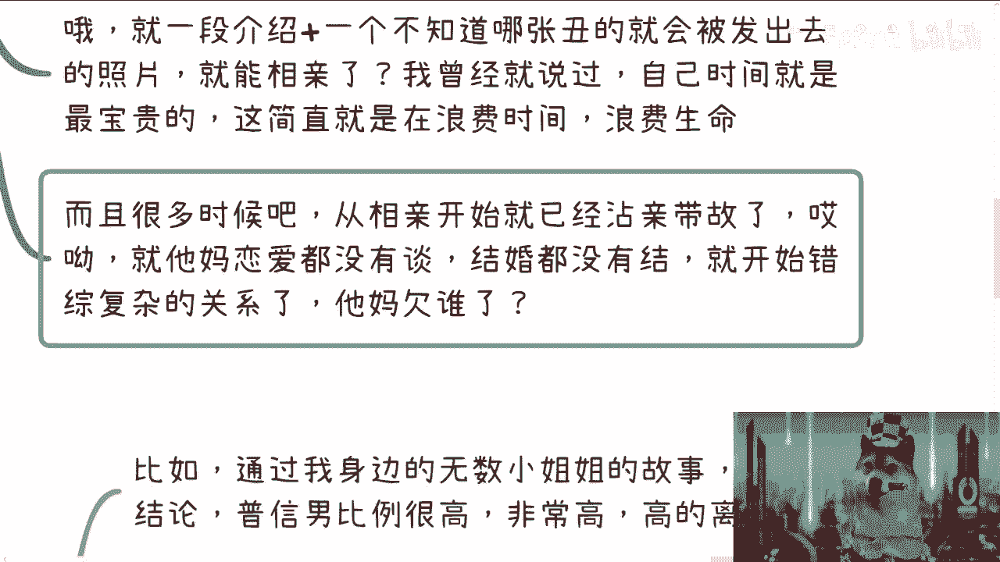

# 课程名称：情感与社交分析 - 第1课：关于相亲的理性探讨 🧐

在本节课中，我们将要学习如何理性看待“相亲”这一社会现象。我们将分析一对一相亲与公开社交活动的区别，探讨其背后的个人自主权与社会压力问题，并总结出更健康、更主动的社交态度。

***

## 我的基本态度 🤔

上一节我们概述了课程主题，本节中我们来看看我对相亲这件事的基本态度。

我认为相亲这件事不能一概否定。最大的前提是，你需要清楚自己喜欢什么样的人。例如，你需要明白什么特质能打动自己，自己有什么样的喜好和倾向。如果自己不清楚，就需要通过日常社交或结识新朋友来探索。不能在一笔糊涂账的情况下就去参与各种相亲活动。

***

## 支持公开社交活动 🎉

在明确了自我认知的重要性后，我们来看看哪些社交形式是值得鼓励的。

我赞同参加一些公开的社交或相亲活动。例如海归聚会、行业酒会或大型相亲会等。我以前也组织过类似游轮聚会这样的活动，我认为这类公开场合的社交是积极的。

以下是公开社交活动的优点：
*   **降低目的性**：你不必抱着强烈的相亲目的前去，可以将其视为扩展社交圈的机会。
*   **自然接触**：在群体活动中，人们更容易展现自然状态，便于相互了解。
*   **自主选择**：你有充分的观察和选择空间，主动权掌握在自己手中。

***

## 坚决反对一对一相亲局 🚫

上一节我们介绍了值得鼓励的公开社交，本节中我们来看看需要警惕的另一种形式。

我坚决不赞同传统的一对一相亲局。无论介绍人是谁，我的态度都很明确。

***

### 反对理由分析

以下是我反对一对一相亲的几个核心原因：

**1. 丧失个人主动权与尊严**
从个人价值观出发，参与一对一相亲常意味着你并不清楚自己真正想要什么，就像一件物品被推来推去。这缺乏对自身时间和选择的尊重。把寻找伴侣的主控权完全交给他人，是对自己的不尊重。

**2. 关系始于复杂与“不洁”**
从相亲开始，双方的关系往往就不再单纯。在恋爱甚至见面之前，就已经掺杂了介绍人的人情、家庭期望等错综复杂的因素，让关系从一开始就背负压力。

**3. 本质是一种模糊的交易**
许多人声称婚姻不是交易，但转身就去参与明码标价式的相亲，这本身就是一种矛盾。相亲往往将人物化，进行条件比对，其交易属性比自由恋爱更为直接。

**4. 参与者质量参差不齐**
一个现实是，流入相亲市场的人，可能存在某些普遍性问题。当然，这不能以偏概全，但确实是需要考量的基本盘。

***

### 常见问题举例

让我们通过一些具体例子，来看看一对一相亲中可能出现的扭曲现象。

**关于男性参与者：**
普信（普通且自信）的比例异常高。这种自信可能体现在各方面，例如仅仅因为性别或一份稳定的工作（如公务员）就产生优越感。有些人甚至会将明显的缺点当作优点来展示。基本的社交礼仪也常常缺失。

**关于女性参与者：**
女性中也存在普通却自信的现象，但这常源于家庭或社会的长期规训。例如，认为无理取闹、要求对方单方面付出（请客、买礼物）是理所当然的。有些人会带着居高临下的态度，像面试官一样审视对方。

**双方共有的烦人行为：**
*   **急于求成**：初次见面就急于推进关系，安排看电影、吃饭等活动，显得非常猴急。
*   **缺乏边界感**：相亲结束后，若对方无意，仍会不停发送“在吗？”“吃了吗？”等消息进行骚扰。
*   **伪装与压力**：在相亲设定的框架和压力下，双方都容易伪装，难以展现真实自我。

***

## 核心倡议与总结 📝

在分析了各种现象之后，我们来总结本节课的核心观点。

我倡议：拒绝点对点的相亲，从你我他开始做起。接受一对一相亲，在某种程度上意味着你接受了被绑架和被动安排，主动放弃了对个人生活的掌控权。

**健康的替代方案是：**
将“寻找伴侣”融入更广泛的“拓展社交圈”目标中。多参与公开、多元的社交活动，在自然的状态下认识更多人。关键在于想清楚自己的需求，不要被家庭、亲戚或社会压力所绑架。脸皮厚一点，为自己负责，尊重自己的感受和选择。

**公式化总结：**
`健康的社交 = 清晰的自我认知 + 主动的公开社交 - 被动的相亲安排`

本节课中我们一起学习了如何理性看待相亲。我们区分了公开社交的益处与一对一相亲的弊端，强调了保持个人主动权和在自然状态下认识他人的重要性。希望你能建立更健康、更自主的社交观念。