# 行业采访第一课：Web3行业现状实录 🎙️

在本节课中，我们将通过一位资深从业者“张优秀”的分享，了解Web3行业的真实面貌、发展历程、从业契机以及给新人的建议。课程内容将涵盖对Web3概念的解读、行业演变、不同背景的入行路径以及必备的实践学习方法。

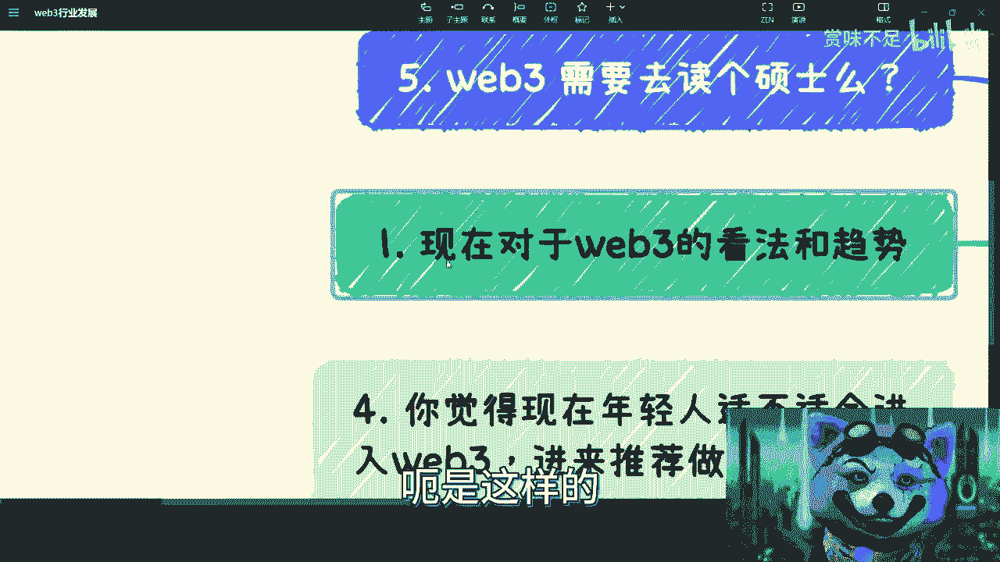

## 概述：什么是Web3？ 🌐

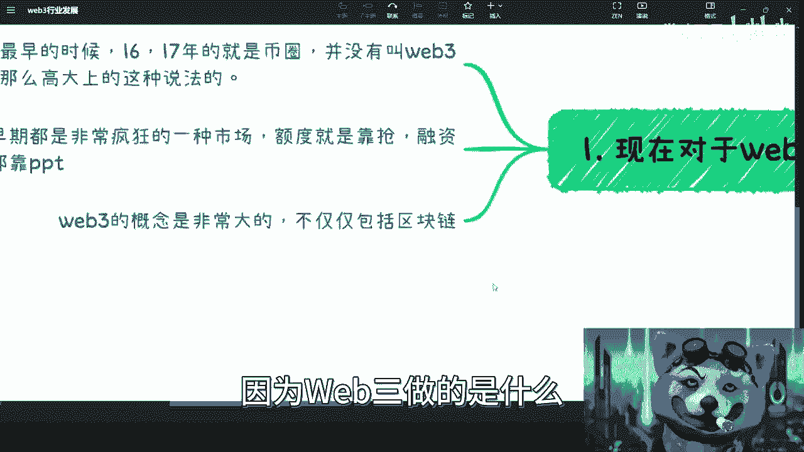

Web3是一个宏大的概念，它不仅仅指区块链技术。Web3旨在建立一个由软件和数据驱动的社会，其核心是让用户真正拥有数据的所有权。这与当前Web2时代平台掌控用户数据的模式有本质区别。

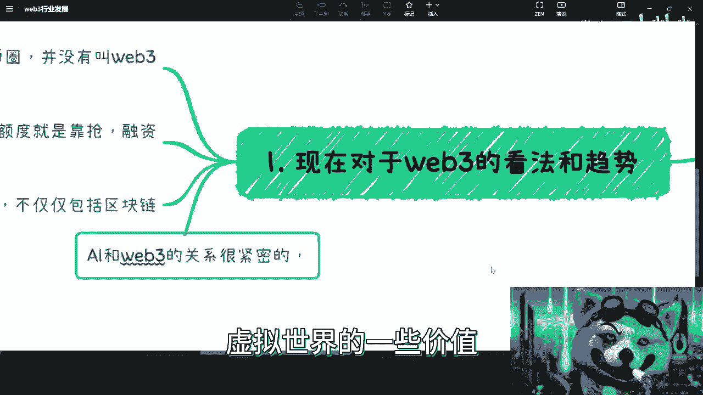

最初，这个领域并没有“Web3”这样高大上的词汇，它起源于比特币和早期的加密货币圈子。那个阶段市场非常疯狂，存在许多乱象。

## Web3的演变与现状 📈

上一节我们概述了Web3的宏大愿景，本节中我们来看看它的具体发展历程。

Web3的概念是随着越来越多人进入行业、整体从业者素质提升而逐渐形成的。许多开发者被比特币的**去中心化**理念吸引，开始在以太坊等区块链生态中做贡献。

关于Web3与AI的结合，这是一个被广泛讨论的方向。Web3构建虚拟世界的价值体系，而AI需要数据。理论上，Web3能为AI提供高质量、权属清晰的数据源。但两者的结合路径需要很长时间的磨合，绝非当前市场上一些简单炒作“AI+Web3”概念的项目所能代表。

## 如何进入Web3行业？ 🚪

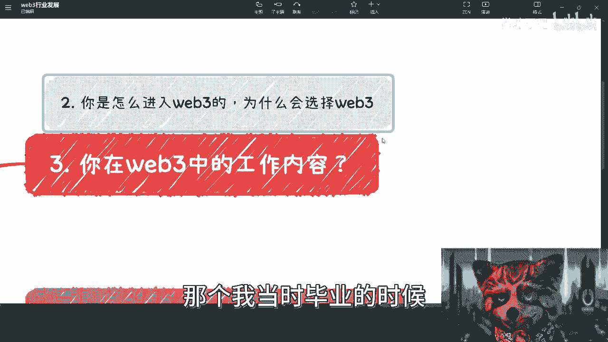

了解了行业背景后，你可能想知道如何进入这个领域。无论是作为主业还是副业，首先需要找到自己的方向。

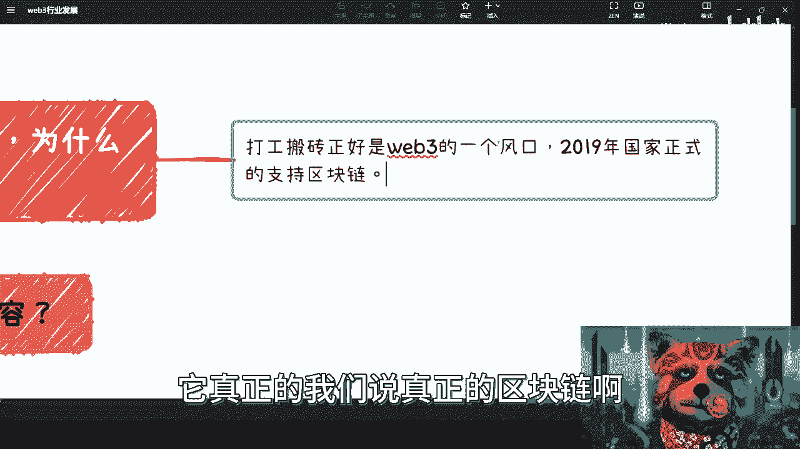

以下是不同专业背景可以切入Web3的方向：

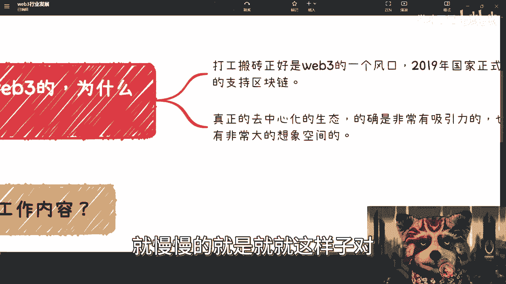

*   **计算机/技术背景**：如果你精通Rust、Java等语言，可以从事区块链开发。成为链上真实用户后，可以对项目进行交互、研究，甚至将优化想法通过开源项目实现。
*   **金融/经济背景**：可以深入研究项目的**经济模型**，或者分析宏观经济对加密货币市场的影响。
*   **设计背景**：UI/UX设计在Web3中需求很大，包括网站、去中心化应用（DApp）的界面设计等。
*   **语言/翻译背景**：非常吃香。许多项目团队在海外，需要与全球社区沟通，专业的翻译和跨文化交流能力至关重要。

目前行业存在较大的信息差，许多传统领域的技能在Web3中不仅有用，而且竞争可能相对不那么激烈。

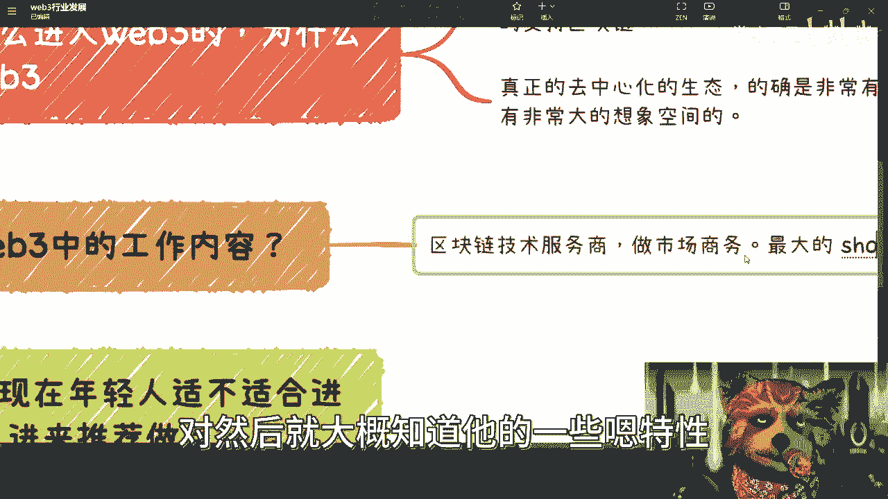

## 从业者故事：契机与选择 ✨

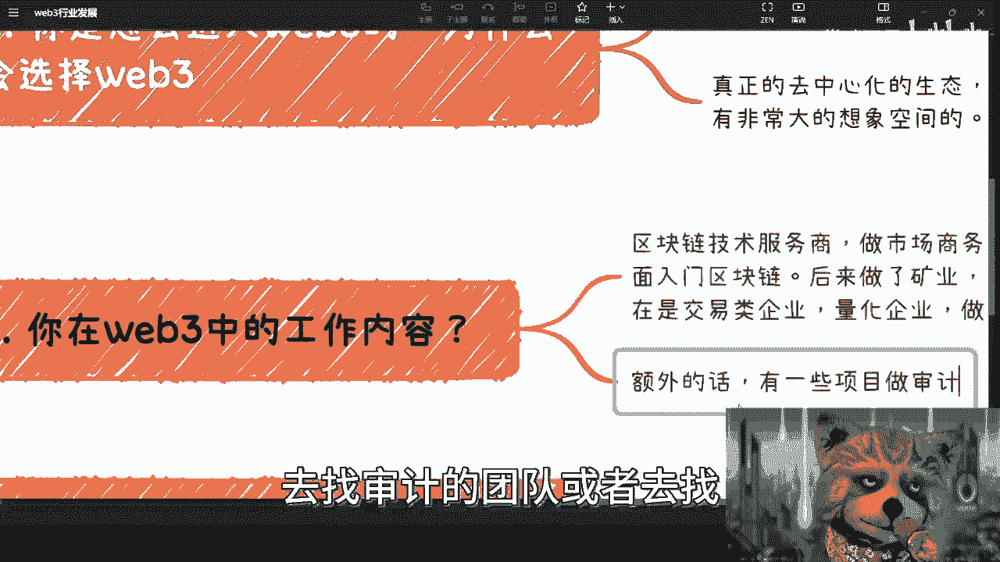

理论方向很多，但具体如何踏入这个行业呢？让我们听听分享者的亲身经历。

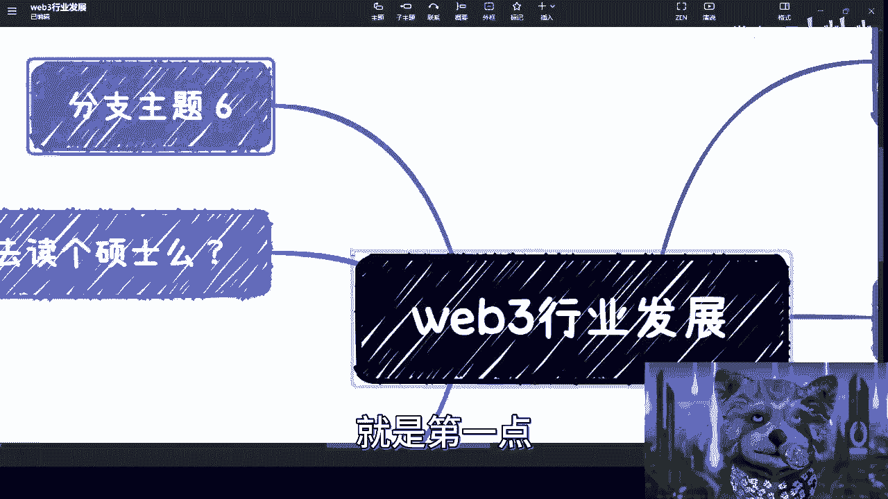

分享者毕业于金融专业，并非科班出身。进入Web3的契机是2019年，当时互联网行业竞争已非常激烈。而恰逢区块链技术被正式提及，其代表的**去中心化**理念和巨大的想象空间形成了吸引力。

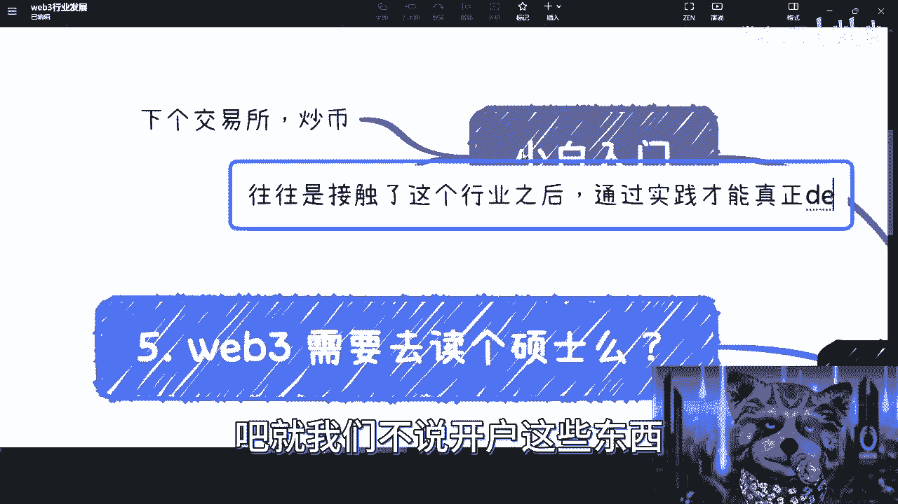

分享者的工作经历是一个典型的“从理论到实践”的学习过程：
1.  最初在一家区块链技术服务公司做市场商务，借此从零开始学习了区块链的基础知识和技术特性。
2.  随后进入加密货币“矿业”领域，仍从事商务相关工作。
3.  目前在一家交易公司（涉及量化套利）从事运营工作，同时利用行业人脉为项目牵线搭桥，对接审计、运营等资源。

## 给新人的学习与实践指南 🧭

明确了方向，也看到了他人的路径，新人具体该如何开始呢？本节将提供关键的学习思路。

对于想进入行业的人，首要驱动力往往是财富效应，这很正常。学习过程应该是动态和实践导向的，而非仅仅学习理论。

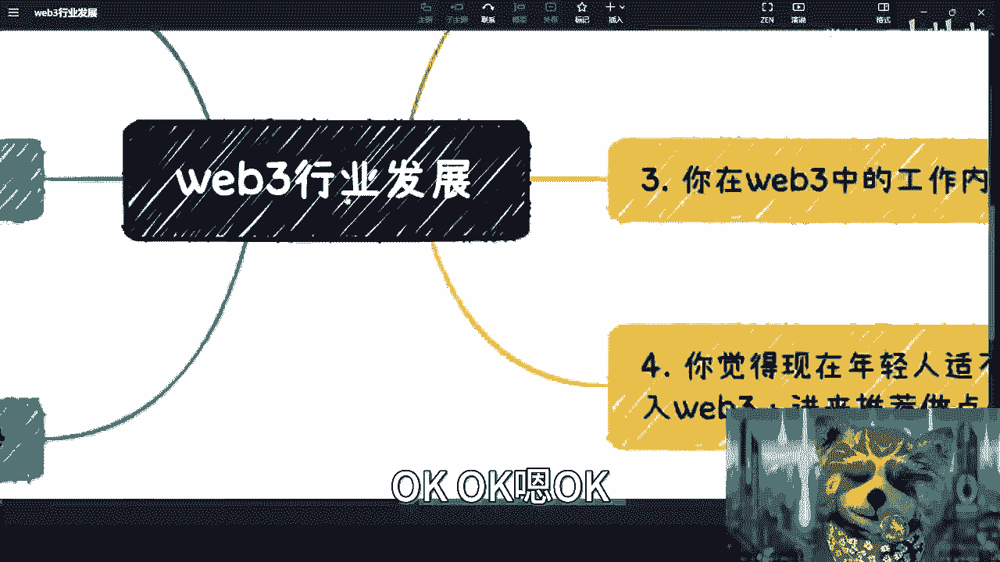

以下是建议的实践学习路径：

1.  **从交易开始**：注册交易所，尝试交易。这会引出一系列问题：买什么币？于是你需要学习加密货币的分类（如**Layer 1公链代币**、**Layer 2扩容方案**）、共识机制（如**PoW工作量证明**、**PoS权益证明**）等概念。
2.  **深入探索生态**：在研究具体项目（如某个Layer 2）时，你会接触到其生态内的DeFi、NFT等项目。要参与这些，你就需要学习使用钱包（如MetaMask）。
3.  **掌握核心工具**：使用钱包涉及助记词、Gas费、跨链转账等实操知识。这个过程就像一棵树，主干是“参与”，沿途会自然生长出许多必须学习的“枝干”（知识点）。

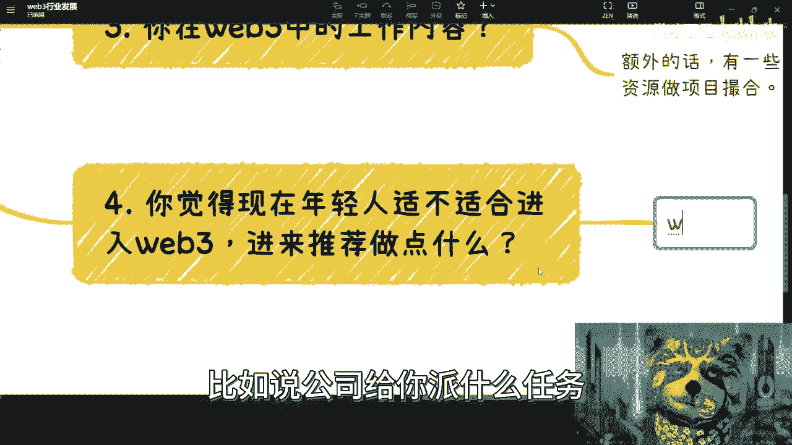

**核心建议是：一定要动手实践。** 仅仅观看教程或阅读资料远远不够。许多付费课程可能只提供理论，甚至讲师本人都缺乏实战经验。在Web3领域，“交学费”（指通过实践亏损或犯错来学习）在某种程度上是不可避免的。

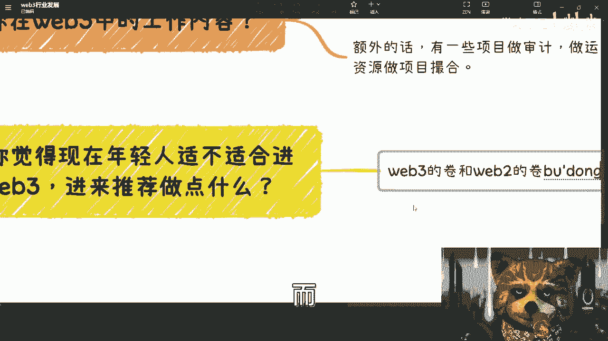

## 关于行业现状的理性认知 ⚖️

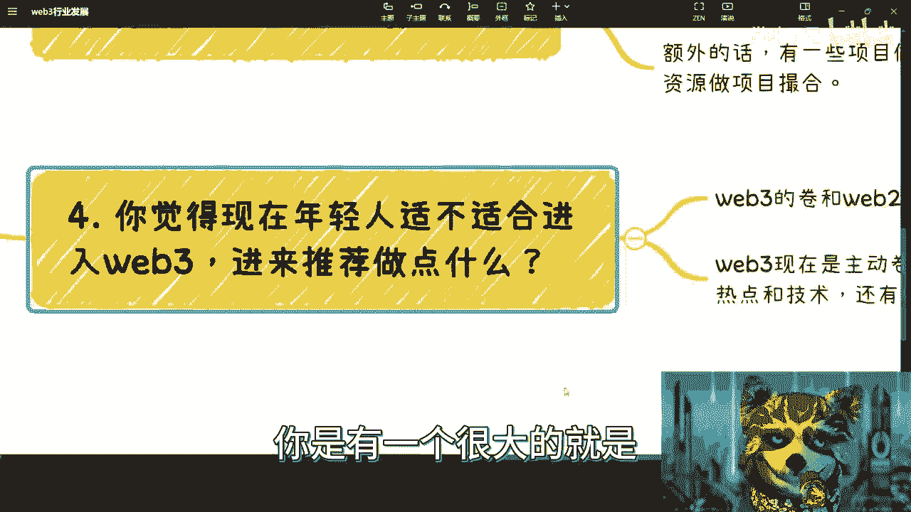

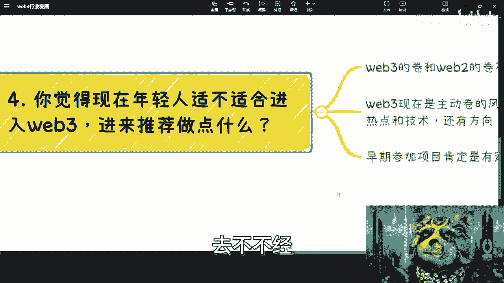

最后，我们需要对Web3行业建立一个理性的认知，避免盲目乐观。

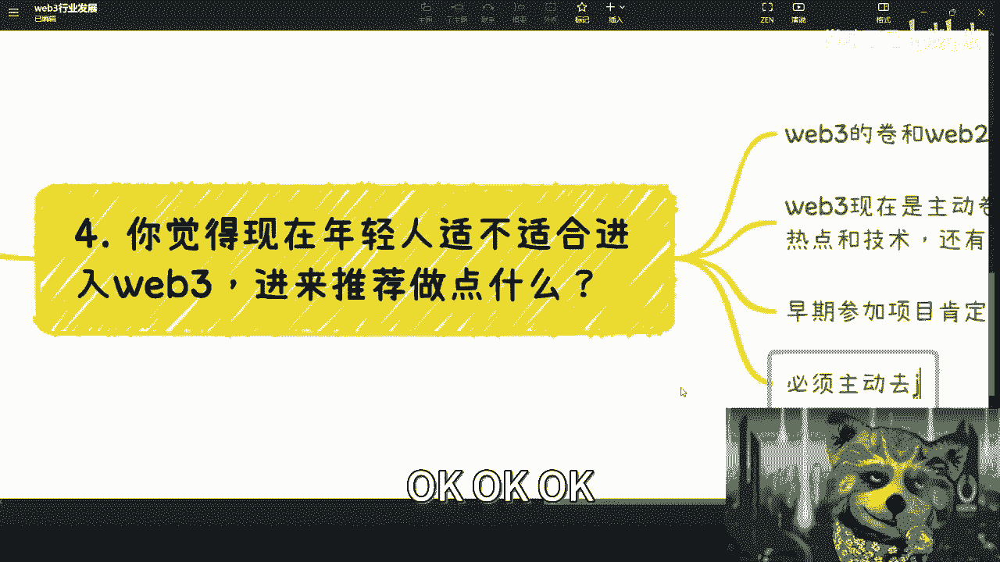

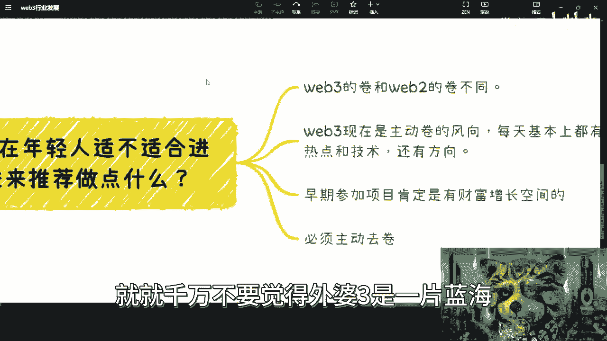

许多人因为Web2领域太“卷”而转向Web3，认为这里是蓝海。但实际情况是，Web3可能更“卷”，而且是一种“主动的卷”。

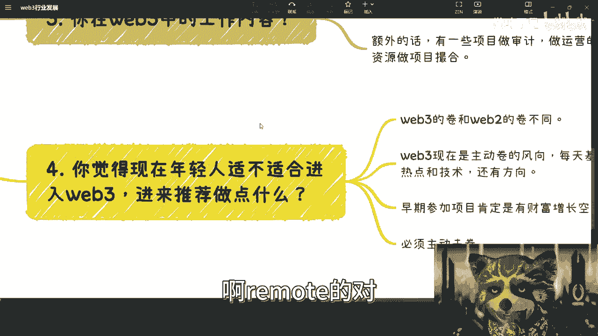

*   **市场不休眠**：加密货币市场7x24小时运转，新技术、新项目层出不穷。
*   **机会驱动**：为了发现早期项目机会，从业者需要主动地、持续地从各种渠道（如Twitter、Discord）获取信息、研究项目。这并非公司安排的KPI，而是自我驱动的过程。
*   **远程工作**：Web3领域远程工作机会较多，通常通过Twitter、专业招聘媒体或Discord/Telegram等社群渠道寻找。

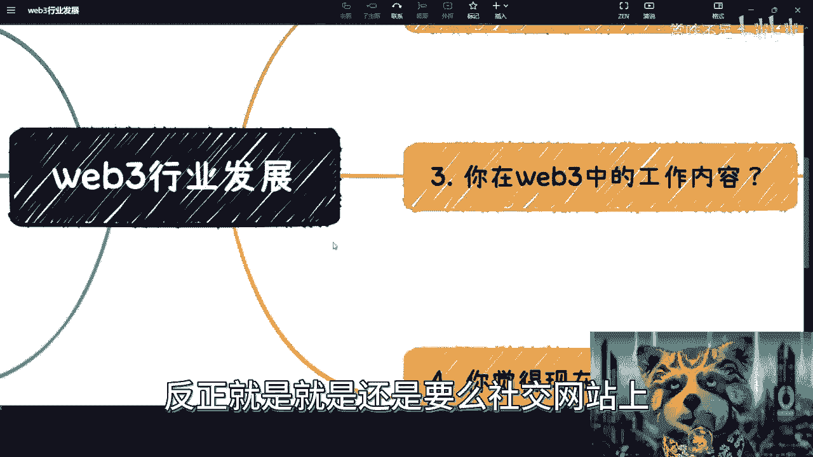

因此，千万不要抱着“Web3很轻松”的心态进入，否则会大失所望。提升自身技能和认知才是关键。

## 常见问题解答 ❓

针对大家普遍关心的问题，分享者也给出了自己的看法。

*   **有必要攻读区块链硕士吗？**
    *   如果经济条件允许，且以提升知识和眼界为目的，攻读硕士是可行的。
    *   但需要警惕过于宽泛的“Web3”专业，这可能像本科的“金融学”一样，什么都学但不精。建议选择更精深的细分方向，如通证经济模型、密码学等。
    *   如果只是为了逃避就业压力而“混学历”，则需谨慎，因为两年后仍要面对就业市场。

*   **一定要出国才能做Web3吗？**
    *   不一定。如果是参与投资、交易、社区建设等，在国内也可以进行。
    *   如果是在项目方全职工作，出国可能机会更多、环境更友好。但这不是绝对前提。

## 总结 📝

本节课中，我们一起学习了Web3行业的现状与入行指南。我们了解到Web3是一个围绕数据所有权和去中心化的宏大愿景，其发展经历了从混乱到逐步规范的历程。进入Web3需要结合自身背景找到切入点，并坚持**实践为主、理论为辅**的学习方法。同时，要对行业的“高要求、快节奏”有清醒认识，避免盲目跟风。无论是深造还是直接就业，提升自身硬实力才是立足之本。