# 行业采访第一弹——web3行业现状实录~ - P1 - 赏味不足 - BV1MP411i7uF

好啊，这个大家好，对吧？就是之前我跟大家说过啊，就是会啊陆续找一些这个各个行业里面的啊这些这个一线的从业人员跟大家这做一些分享啊，那么呃我们很荣幸的，就是我找了一大圈，对吧？然后都安排好了啊。

然后还有这个美国啊，然后现在还有一些在这个AWS的这个小伙伴，然后我都陆续的跟他们约好了。嗯，咱们时间上最啊凑得上的，就是咱们现在这个维博3啊行业这个待了时间也比较长的一名小韭菜是吧？

然后这个张优秀同学啊，这个我先说一下，就是虽然咱们这个张优秀同学没有露脸，对吧？但是不得不说啊，这个是我见过最帅的小姐姐啊，没有质疑。😊，嗯嗯嗯嗯打个招打个招呼打个招呼，大家好大家好。

非常荣幸能够做客这个赏总的这个直播间。然后给大家去聊一下关于web3的一些嗯一些内容吧。其实也是我就是很多东西是的我自己的想法，自己的一些思考。然后也希望能和大家去多多沟通，然后讨论。😊，好的好的好的。

我之前就跟张优秀聊的，反正就是碰过了嘛，就基本上就碰了这么几个主题啊。然后就大家也可以看到啊呃我觉得按照就是我这边编的顺序嘛，反正我们一个人来说啊，就是呃首先因为大家这个区块链啊，we博3啊。

然后听到反正也比较多啊。那从这个呃因你看我属于隔岸观火，就是这个从从这个呃就个在这个行业里面的啊这么一个小韭菜，就是就是你可以说说看，比如说这个对于 web博3的这个看法，还有就目前整个未来的这个方向。

因为最近。😊。

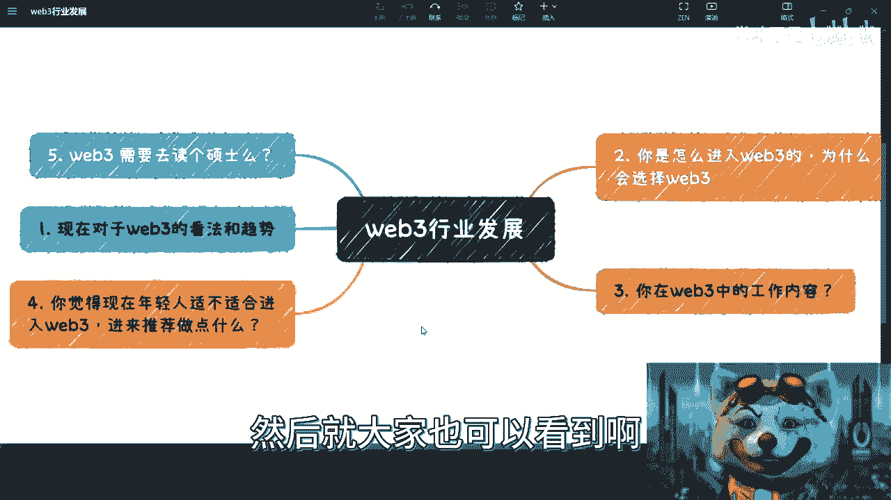

最近啊其实就是这个学生啊，包括其他人啊，就实要进Y部3人还是蛮多的。所以说就是他们可能就正好我们可以跟他家他们说一下，就真实的这些情况。嗯嗯嗯了解了解。嗯，是这样的那我就按照我的一些理解去说了啊。

对对对对，就是那最开始呢其实。

就是一个很单纯的一个臂权。他是没有像最开始像1617年的时候，他是没有像出来web3这种比较高大上的词汇的。然后呢，其实这个圈子也是非常的嗯就是嗯比较比较疯狂，然后嗯也是有很多乱象嘛。

然后大家大家应该也知道，就是那一段时间比较火的这个人物就像是嗯薛满子老师，对吧？然后李笑来老师都都得叫老师嗯，这个市场当时是非常疯狂的，就是我们说的一些IU啊那种事情，嗯，就是额度全是靠抢的。

然后基本上就靠PPT去融资的，对不对？

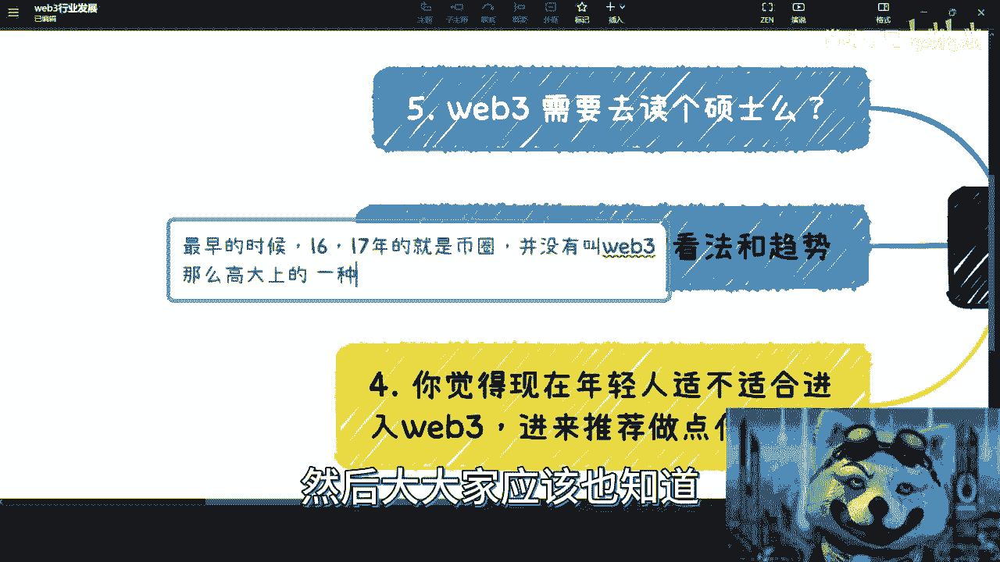

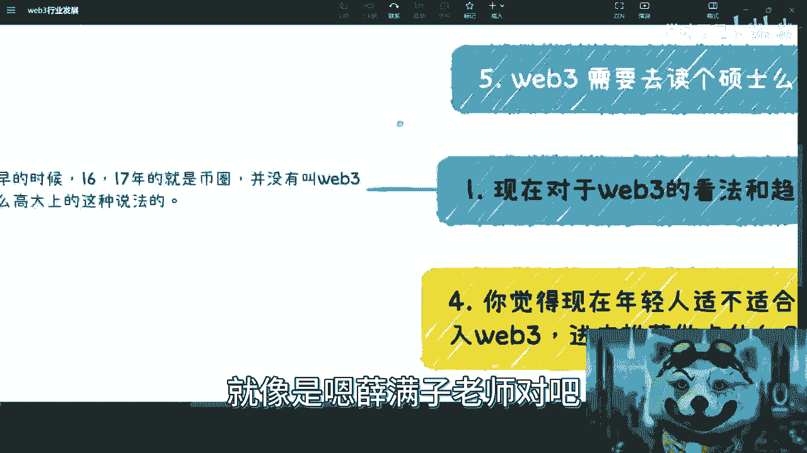

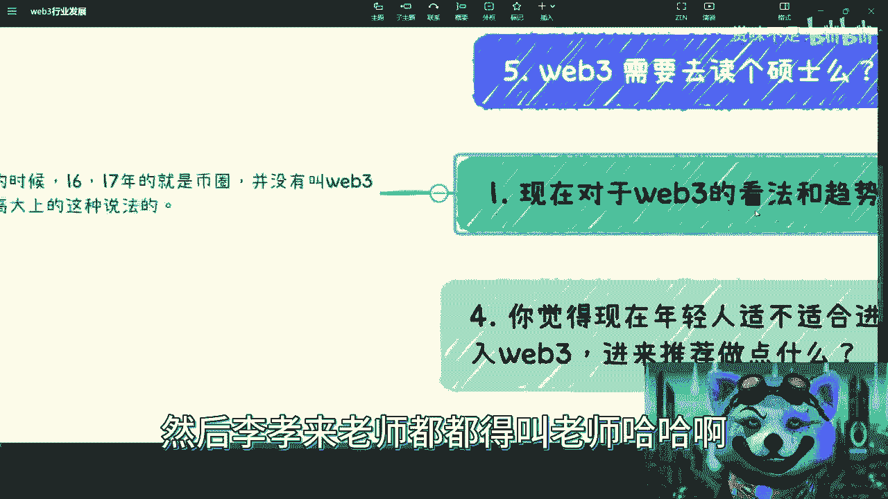

嗯ん。然后后面呢嗯随着进入这个市场，就进入这个行业的人可能慢慢变多。然后整个的行业的素质也有在提升。然后也很很多的开发者去嗯就是被比特币比被比特币它的一个区中心化的概念所吸引。然后嗯想要去包括像微神嗯。

想要去在这个嗯嗯就是以太坊的生态，或者说嗯区块链其他的生态去做一些贡献。然后才慢慢形成了这个外部3这个概念。但其实嗯怎么讲，其实我一直是觉得啊外部三的概念是非常大的，它不应该是仅仅包括区块链。

嗯其实我们说嗯大家都觉得外部3和这个嗯。大家都觉得这个web3和AI嘛，AI大家都觉得能够在就呃AI加外3可能是一个很大的方向。嗯，关于这点，我是觉得嗯AI和外部3的关系是非常紧密的。

因为we部3做的是什么？外部3做的是建立一个由软件和数据来驱动的社会。

就相当于他是把我们所要认知到的虚拟世界的价值嗯。就是他给我们带来了一些虚拟世界的一些价值。然后并且我们是可以真正拥有这些数据的，就是所有权的。但是嗯。

的确他是能够和AI去做一个结合吧。就是说但是他这但是绝对不是说我们目前所看到的是AI加外部三概念的一些项目，绝对不是这个。嗯，他这个结合的路，我觉得是要磨合蛮长的一段时间的。对。不对。嗯。嗯嗯。

O ok好，那就是这么一个情况。因为嗯就是我大概这就是一个阶段的时候，就是说一个对于we3的一个我的一些认知。对，这样子嗯嗯嗯ok那那你比如说他们他们现在这些人就就大家都很关心说那我不管啊。

就现在说呃我是这个呃我是这个叫什么就是刚毕业的也好，或者这个找工作也好，或者背辞了也好，那我要我就准备比如说副业来做we3，或者我就准备all in web3呢这这个你觉得就就是怎么个看法的？

嗯其all in web3是什么时候出来的这个口号呢？我觉得是应该是大概在去年的时候，对，应该是在去年的时候，那段时间是伴随着一个什么情况呢？就很多的年轻人，就是嗯嗯包括从海外留学回来的。

因为可能在海外的一些朋友，一些学生，他去接触。😊，接触的会更多。对，因为我们也知道很多项目的创始人也好，就是都是那几个名校嘛，就是培外3人才培养基地的感觉。对对对，嗯。

然后的确他们的高学历高水平能够给他们在这个就是能够赋予他们一些独到的认知。这样然后嗯。后面呢就是呃那段时间就很多国外毕业回来说我们要all in web3，包括嗯国内的毕业生也是叫啊we3是趋势。

是大趋势，是下一代互联网，对不对？然后大家叫all in web3，但是实际上想一下，你all in web3，你是做什么呢？因为我刚刚说的we3它是一个很大的概念。

或者说它是all in crypto。也是也是有的嘛，就all in crypto all all in web3，它其实这两个都是一个蛮大的一个赛道。就你要去all in梭哈。

我们说梭哈嗯all in，然后去哪怕是做副业，就是你要有一个方向嘛。嗯就比如说你是计算机类的对吗？你精通这个rast语言，然后java语言，然后精通计算机语言，然后你可能去想要去做开发，或者说你可能。

但是就是你去嗯比如说啊打个比方，你去呃涉足区块链行业加密行业，然后你成为了链上真实的链上的用户。我不是说你只是说炒炒币啊。你真正的去用钱包在每个项目上做交互。你可能觉得这个项目嗯。

你认为是有可改进的空间的，或者说是有优化可优化的地方的那你可以从通过你的一些技术嘛，计算机技术，然后你可能会嗯做一些小的一些嗯。可能会做一些小项目去开源到getbook上，这也是一个很好的方向嘛。

然后另外一方面，那如果你是可能是你是学嗯。金融类的嘛，经济类嘛，这是一个大类嘛。那可能你会在这个行业去研究什么呢？去研究项目的一些经济模型是有的。

包括你们知道现在区块链其实受嗯比较影响区块链的有很多的因素嘛，包括宏观经济也会有一定影响。你可能从这方面去切入。然后嗯如果说你是嗯还有一种啊，就是比如说我学的是设计。

我学的是翻译这种就可能就是比较小众的呃也不算小也不是说小众啊，就是可能我学的是设计，我学的是翻译，那可能你觉得我去外部三做什么，其实外部三他在他再去嗯就是比如说他新其实都是从外部二去一步步升级过来的。

嗯嗯嗯，那翻译能做什么，其实翻译很吃香的，就比如说我学翻译，我英语翻译或者说嗯对英语翻译，然后其实很吃香。因为现在很多关系呃，很多的项目都是国外。并且我们需要去跟国外的一些项目包做一些线上的沟通。

或者说线下的沟通。但嗯现在GPT可以解决一些东西，但是一些crypto native或者english native会更加的嗯，就是我们交流就交流起来可能会更加的容易一些。对。然后UI的话，那也很多啊。

对不对？呃，UI的话它可以做网站设计这种有都非常多的。嗯嗯，OO所以所以我觉得这一块啊，其实我是这个最近跟他们聊下来呢，我是感觉哦就是这一块信息差是蛮大的。因为因为其实之前呃就是聊的时候呢，其实蛮多的。

就是说哎我可能是做设计的，我是做呃也不叫做翻译啊，他其实就是比如说英文专业，你知道吧？就就这种就是就他他就会觉得那我出来干什么，你知道吧？然后出来呃这边也很卷，那边也很卷。

然后但是但是你你你看嘛就是从这个你刚刚说的，比如说我博3这种啊或者怎么样，其实很多地方还是就是很有用的，而且其实根本没有这么卷，但是哎就大家可能不知道啊，就是。😊。

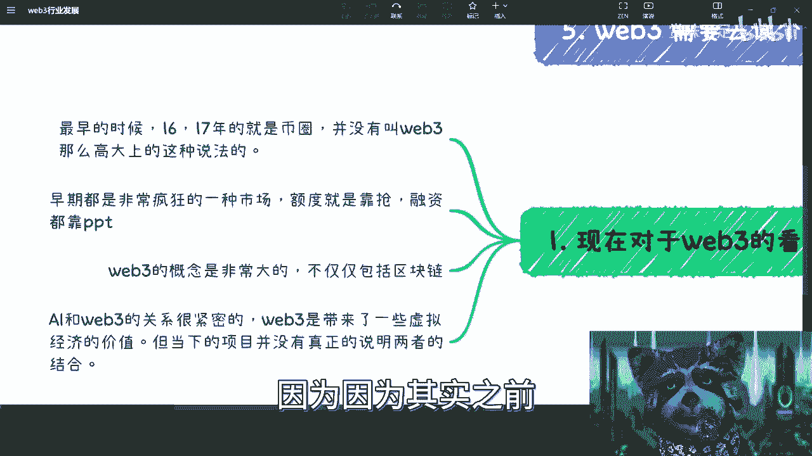

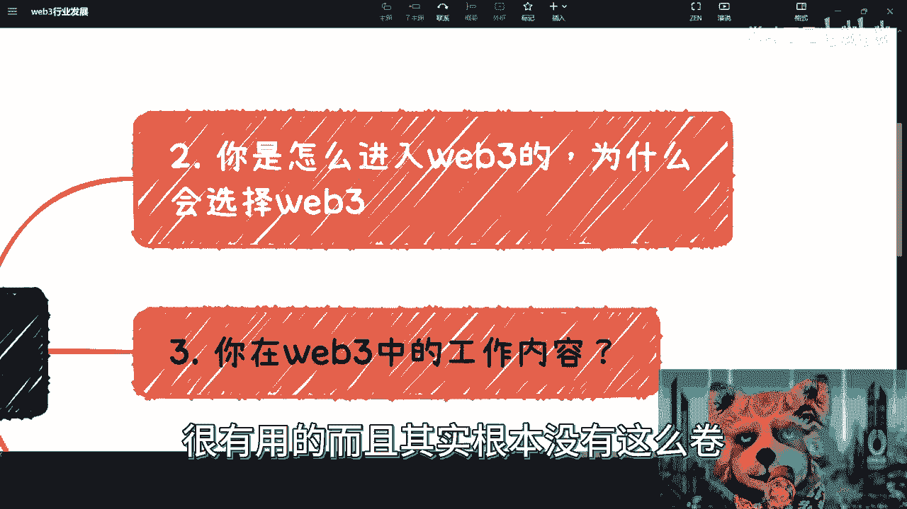

嗯嗯，对对对。

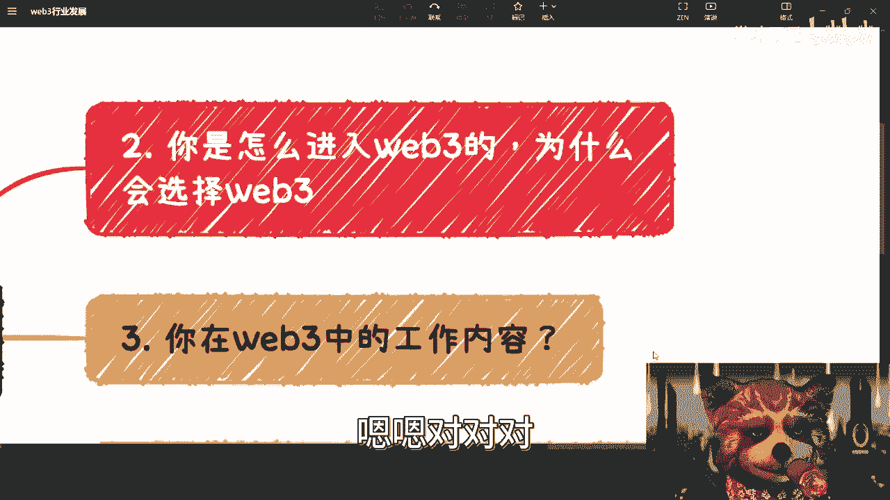

OK那那这个呃OK那我们到第二个吧，第二个就是简单来讲啊，就是说你当时啊咱就这么说吧，就是说呃理论上来讲啊，就是你毕业的时候肯定不是这个we3或者Crypto的这个专业嘛，对吧？啊，那么对。

那这个专业肯定在不对口的，也不是非常对口的情况下面吧，就是是什么契机呃，做we3的。然后为什么就会选择we3。😊。

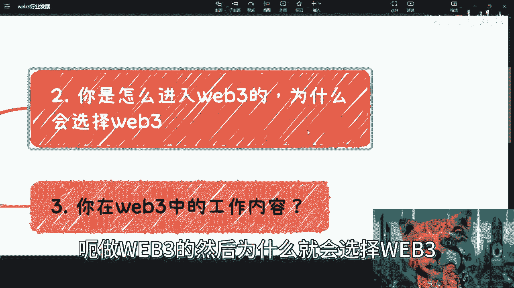

呃，其实是这样的，那个我当时毕业的时候，刚巧就是我去真正的去进入社会做打。我们说打工，对吧？打工搬专的时候呢，是一个刚好是一个风口。就是当年19年的时候，记得是19年的时候。

我们的大大习大大嗯在这个乌镇互联网会议上面就把区块链这个词真正的在一些正式的场合去提出来了。

嗯，那一段时间就是大家都啊是就是因为那段时间陷入一个什么瓶颈呢？就是互联网其实已经很卷了。嗯就互联网这几年其实一直都是处在一个shop泡沫的一个状态。互联网其实已经很卷了。我学的呢是偏经济金融类的。

我是学金融类的。然后那当时的互联网很准。然后互联网金融类已经就是在末期了，就是已经不行了。嗯，但是其实大家都知道，就是说这这块是比较容易来钱。就说说白了嘛。

大家都是要就是大家为什么大家为什么去选择这些风口老街的行业，其实都是为了赚赚钱嗯。那嗯再去然后我再去看的时候呢，我就看到了这个区块链。当时我是很懵逼的，就是我是非常我是真的是从零就直接蹦进来了。

就是当时我连比特币是什么，我都不知道哦哦，我知我只知道比特币是什么，就是也是嗯比特币的一个财富效应。我才了解到了他。然后那段那时候其实对区块链这个是完全没有概念的，就包括它的特性，它什么去中心化啊嗯。

共同账本记账这些完全不知道的对。OK嗯，然后嗯就是当时就觉得这个东西它确实非常就是它是有一定吸引力的。然后它所塑造了一个区中心化的概念。它是真正的我们说真正的区块链啊。

就是去塑造了一个打造一个区中心化的概念。它的确嗯我们它是有非常大的想象空间的。

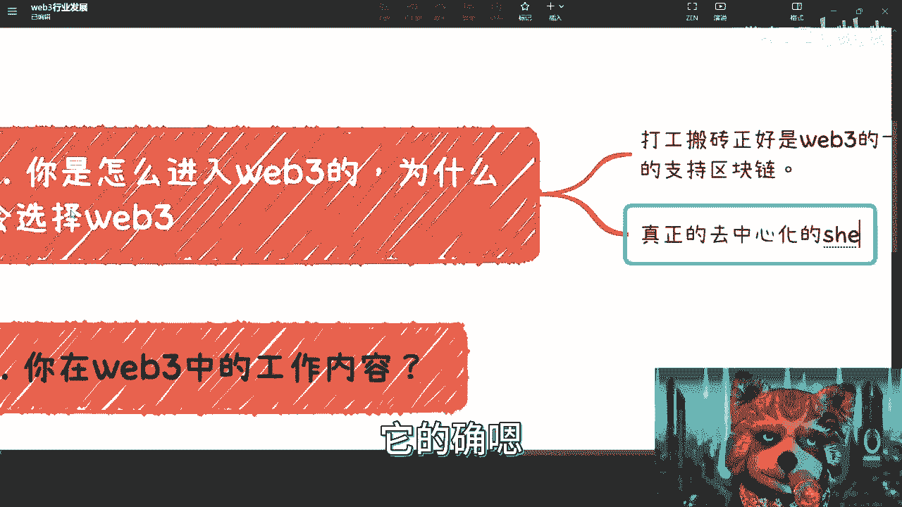

这点非常的也其实也也算是吸引我的。然后后面就就进入了这个行业。然后在这个行业里面，反正也是不能说摸爬滚打吧。就是反正也了解了挺多的，就从区块链这个切入口嘛，从技术这方面的切切入口去嗯看。

然后去慢慢的去变成了就是链上的用户去看各种协议，然后去玩FT也好，然后去玩define也好，就慢慢的就是就就这样子，对，嗯，OO那那就是正好回到这个就是这个工作内容，就是我觉得这个呃两两个吧。

因为我刚刚想了一下嘛，一个就是说呃就是现在比如说哦或者来说你从业之后到现在比如说这个当中，你在 web3的一个工作内容是什么，对吧？然后我觉得这是第一个。

然后第二个就是说呃我觉得很多人他就不管他是做什么翻译啊，或者做别的东西，他进来，他觉得就是我对这个东西可能也是。

一窍不通嘛，对吧？我也不知道啊，那从你的角度来讲，你觉得比如说这大家进来之后有哪些东西就就有哪些东西，他是必须要去比如说学习的，或者是去去实践的这这么一个东西。嗯嗯，嗯，O就是先那我就先从我这边说啊。

对对对，呃我这边的话，其实进入这个行业最开始的时候嘛，我们是做我们公司是做技术开发的，就是帮就是有很多人想要去进，就有很多公司啊想要做转型啊或者怎么样。我们是为他提供技术服务的，就是区块链技术服务商。

然后在这个公司里，我是做了一个就是类似于像商务嘛，我们我们我是做市场商务这类的，然后去发掘一些新的就是客户机会嘛。然后但是这一块其实这家公司给我最大的一个收获，就是我真的我真的了解区块链，就是我我从。

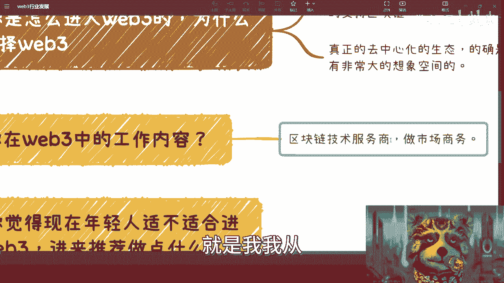

就是嗯啥也不懂，慢慢懂了。对，然后就大概知道它的一些嗯特性。然后它的一些分类。然后一些嗯包括一些主流的token也是这个阶段去接触的。然后嗯后面呢是从这边我就去做了矿业对。

要矿业矿业里面其实也是在做商务的这个角色。嗯OK然后到后面现在的话就是我会嗯我们就我主业其实就是也你说它是外部三，它也外部3。但是你要说他外部2呢，它也是外部2，就是他是一个交易类的公司。

就是嗯我们是做量化套利的，就是套利。这种交易类的公司做交易的公司。然后其实那你知道其实交易的品种，我们的标标的有很多的，我们可以交易是个货币，我们也可以交易，就是嗯期货股票这种也都有。对。

然后我这在这里边我是做了一个运营。对，类似部。

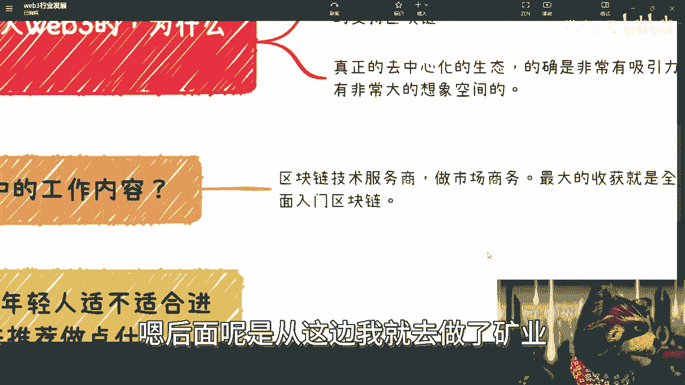

运营的一个东西。然后我自己额外的话，其实我这边会有一些其他的部分。就比如说嗯有一些嗯项目可能会要去做审计，去找审计的团队，或者去找嗯运营的团队，就大概就是利用利用一下这几年。

反正在这个圈子里面认识的这些人嘛，就做一个大概业务牵线这样子。对，嗯，然后呃后面一个方面是问题是啊就是如果嗯一个就是一个刚毕业的学生，或者说一个爱好者，他想进入这个也进入这个行业需要了解的是什么。对对。

那第一点你要明确的是就是第一点，其实我觉得这分分两类吧。第一个就是他看到了这个财富效应。嗯，那么他想去赚钱。

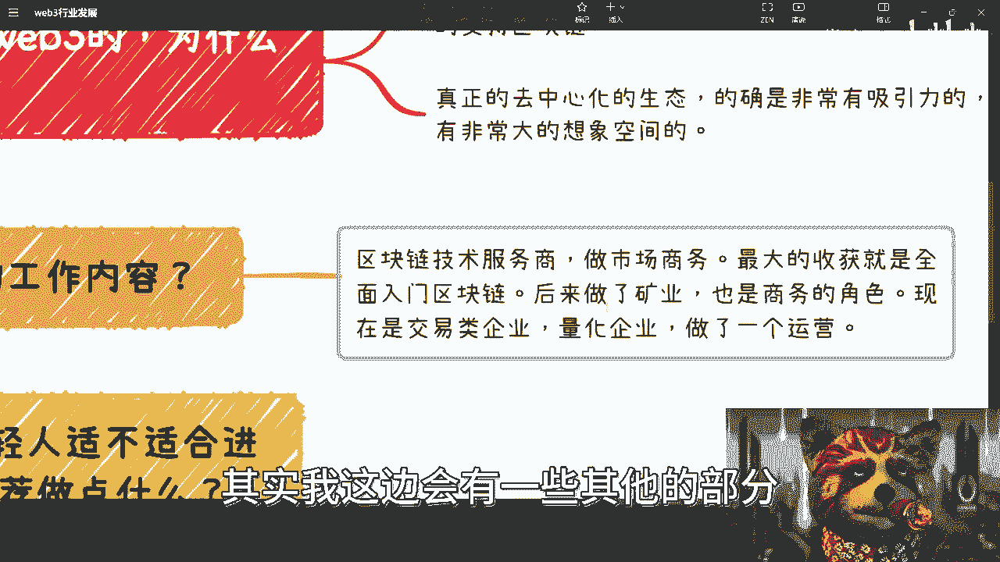

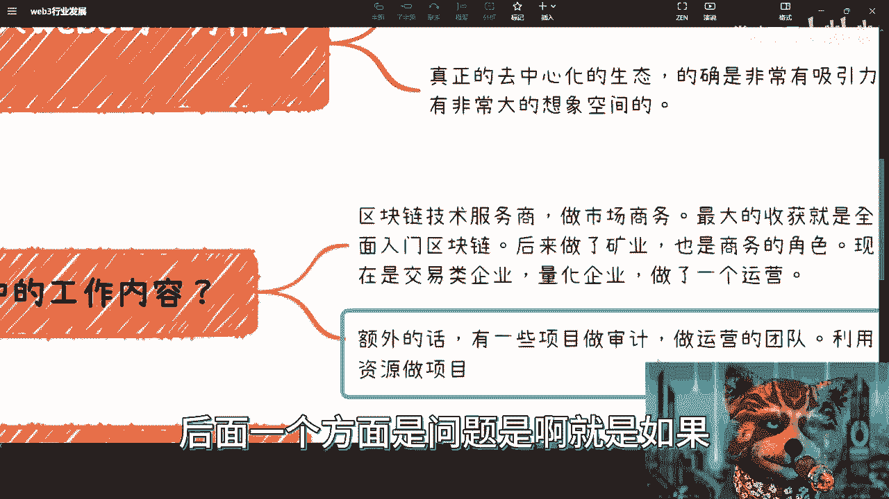

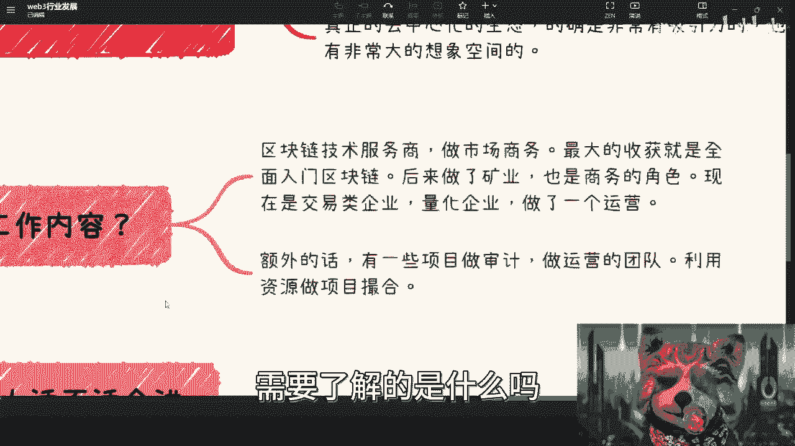

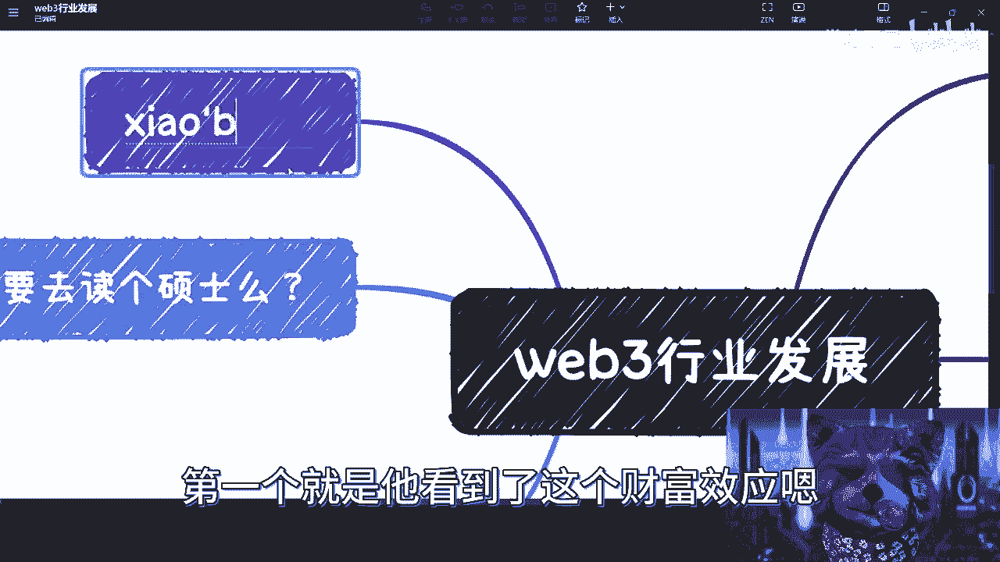

这是很正常的事情。然后那可能第一他去做的事情是什么呢？那下个下个下个那个交易所，对吧？炒币对对吧？嗯嗯但其实现在想想也不算也不算两点吧。

就是肯定都是因为这个财富效应才使得他有这种想法的对我觉得很少你去问一个人嗯，你进入外部商是因为什么我信仰对吧？我觉得很少的，就呃因为我去接触那么多人啊，其实真正的BTC maxnax是很少的嗯。

他们认为的是O比特币他就是就是我们说的比特币信仰者嘛，对其实比较少的，大家其实看他价格波动大，就是嗯利益为主嘛，利益为主导，这是很正常的事情。然后那可能他们就会说回到刚刚那个话题啊，就是我们。😊。

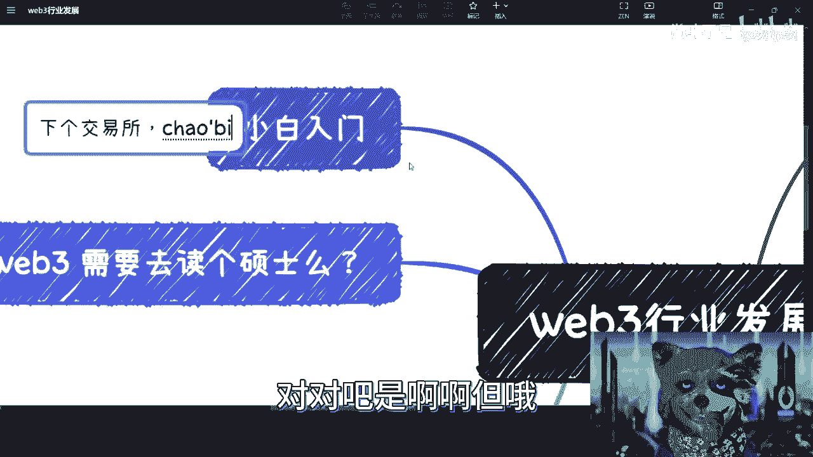

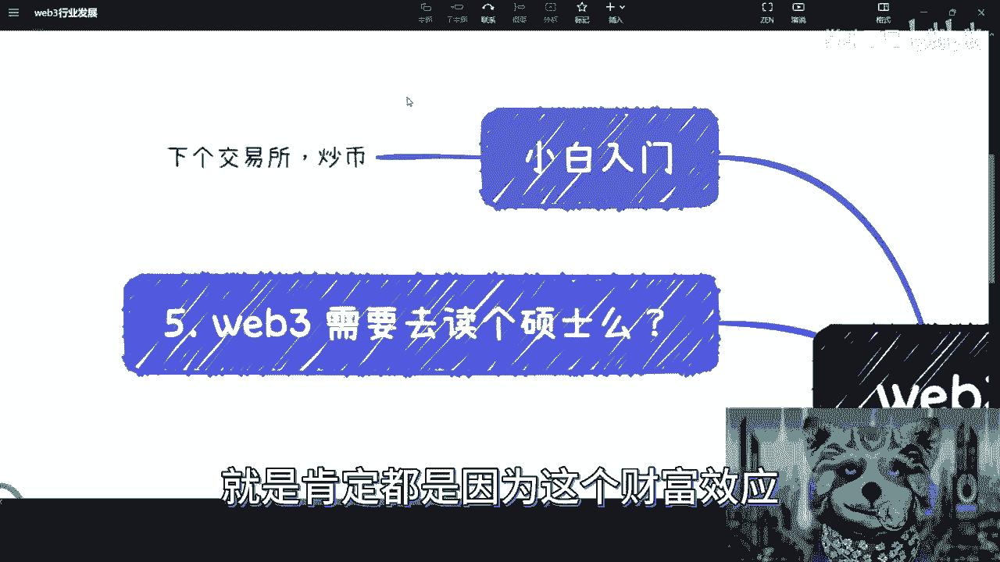

交易所炒币，对吧？其实你炒了炒，你会发现什么呢？就是其实你做的其实嗯这个东西啊嗯你要去学习哪些东西，很难给你做一个规划的。嗯，其实往往是就是嗯往往是你真正的去接触的这个东西。那你接触了一步一步。

他自己会有一个道路的。嗯嗯嗯嗯就是嗯就是我们就是说他自己会有一个道路，就比如说我接触了嗯，我要炒币，那可能第一个问题又来了，对吧？就我们不说开户这些东西啊，第一个问题就来了，那我去选择什么币中炒。对。

那么那。

这时候你可能就要去去google去百度呃不是百百度可能不加就去google就去查资料了，对不对？那数字货币的这些加密货币的分类，对吧？就我们至少我要看一下前一版的币种嘛，那除了比特币。

那什么叫什么叫呃L一就L一类的token，就我们说 one就是公链的token那什么是L2对吧？现在L2也出来了。那什么是扩容对吧？以太款扩容概念那什么是什么叫mi对吧？

就前段时间那个悲伤挖那个蛙那还有就是呃什么是POS什么是POW其实这些这些概念就会慢慢的就是说你必须要去就不然我炒我为什么炒，我不能看它涨了，我就买对吧？就我我我炒币我肯定是要有理由有根据的。

我不能说我看到这个待币它涨了涨了10个点，我追高，对吧？对这做交易不就最忌讳的就是居高杀跌嘛对吧对对。😊，然后呃这是一点。那第二点，你可能慢慢的在这个过程中。

比如说我刚刚说提到了呃看到了L2了解L2扩容的概念，那可能你就会接触到，我就直接打比方啊，那可能就会接触到bit那你再去看bit或者的生态的时候，你可能就会发现哎他这个生态里面有很多的项目。嗯。

它可能是d的项目，它也可能是的这种项目就有很多。那你就可能就是说哎这个项目上面我能去做点什么。因为d项目它往往是一个它是一个乐高它是一个金融乐高我是一直觉得这个它就是一个金融乐高游戏他可以把你的资金做最大的使用效率。

然后那你怎么去接触defi呢？defi是练成的东西，它不是说交易所，你买个I币就行了。那你可能就需要工具。那你可能比如说最常见的，我们可能就要用ok呃那个m mask这种钱包。然后那钱包呢又来了。

那钱包第一点你可能就需要助句词。对吧对这次啊当然对吧？当然现在OKOK处理个OKX处理个外森钱包，它是不需要词导入的。它是MPC技术，其实还蛮新的对然后那那其这样子你就会慢慢的去说哎我用完钱包之后。

那钱包我去做交互的时候，我可能就会涉及到涉及到概，对吗？然后最开始用钱包的时候，那我可定还涉及到一个从交易所把我的需要的带币提出来，然后包括一些地址可能就这就是你再去细分化去了解的过程了。

就我们说我们去学习一个东西嘛。它有就像是一个数一样，它有一个主干线，啊那你在这个主干线慢慢走的过程中，你可能就会有各种的各种的支干线去加进来。

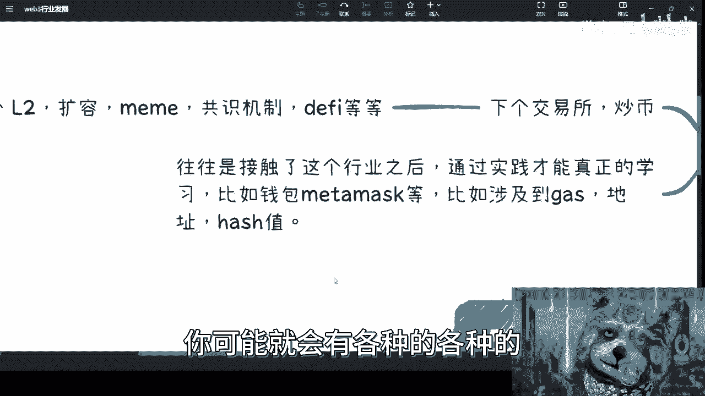

对对O ok ok嗯O所以我觉得所以我觉得本质上是那个嘛，就是说本质上就是说我们这个很多人就是会觉得说啊我们这个有有很多的叫什么视频啊，或者资料或者去看。但其实反正就是他他得先去干，干了之对干了之后。

他总会总归慢慢慢慢才会去摸索嘛，是吧？没错没错，就是其实这样的，我们总说其实只上得来终觉浅嘛，对吧？其实这个课程是O的，就是他们涉及的一个些课程就就非就是像教学大纲一样，他们会有一部分。

比如说每一部分要学习什么，然后甚至于可能更细一点的那其实这种课程你自己在网上找也有很多的，就你没必要我说你花个18882888去报课去学让我有点有点什么呢？

让我有点觉得嗯就是让我有点觉着这个钱怎么这么好挣的，就是。😊。

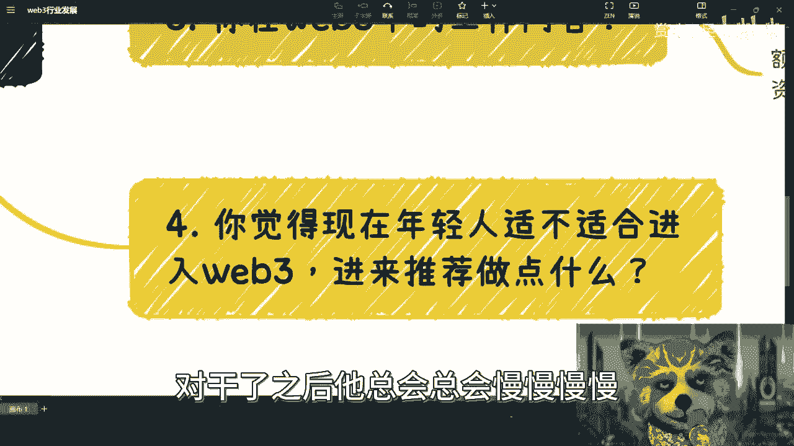

他你去你要明白的是你去上这种理论的课，它永远只是一种理论知识的灌输。甚至你甚甚至教你的那些老师，他自己。说句不好听的，就很多很多这种啊，他可能自己连自己的就自己都没去做过这种deide销户啊，或者这种。

他就敢堂而皇之的来给你讲讲课，就挺离谱的。我想去强调一点，就是你嗯你去理论的学习知识。嗯可以你可以在自己学习的过程中中么摸索，对吗？你也可以就是按照嗯比如说你嗯网上找一些资料，他会有一个大纲。

然后自己慢慢的去学也是可以的。但是我想去强调就是理论归理论，你一定要去做。对对对对对你一定要去做。

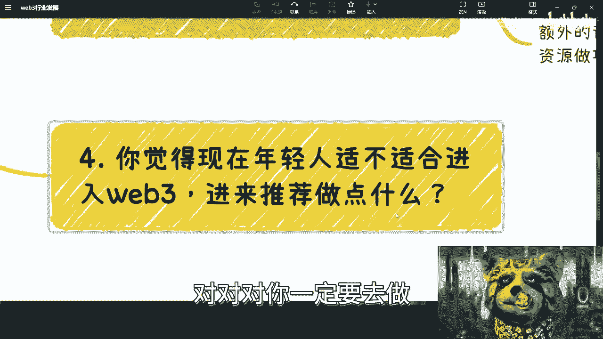

不然的话你就很难理解他的这个嗯就是交互啊也好，这种项目他这种逻辑的。OKO是我们开玩笑说嘛，我们是开玩笑，嗯，我们炒币有时候开玩笑说嘛，先上车的也就没毛，但只是开玩笑，但是确实你需要先去做。

你不能老看你看其实很多时候不管用的。对对，反正反正Y博3这边还是那句话嘛，就是我跟大家聊的时候，我也一直跟他们说一句话，就是就是就这么说吧。就是说其实很多人进来，他其实是怕说白了，他其实赚钱嘛是想赚的。

但是也怕亏钱嘛，对吧？但是但是我觉得就我们行业的人应该也都懂嘛，反正就是这个你就算天王老子来了，你进来你也得交学费，你说是吧？对对对，就是。😊，这没办法的事情。OKOK那呃。😊，哎。

那这个我觉得就是刚刚那个问题嘛，对吧？就是说他那个新人进来之后推荐最吧？对，就其实我们不是说年销人，其实现在呃很多大家去来这个行业是因为什么？因为外博尔真的太卷了。是的是的，你你也知道的就。😊。

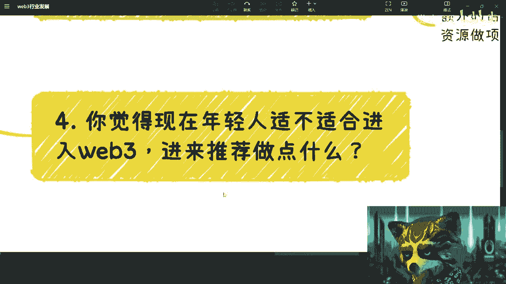

互联网裁源对吗？就对，就外边真的太卷了。当然你你可能觉着w部3是一片蓝海，对吗？嗯还是现在还算蓝海。嗯但是你进来你可能你可能有种感觉，就是外部3其实更卷。😊，是的是的是的。

就是我们嗯就是而且它的这种卷啊，它不是很多的这种卷啊。我说外b3的卷啊，它不是比如说公司给你派什么任务。

就是被动的卷了。而w3它有一种主动卷的风向，你知道吗？就是。

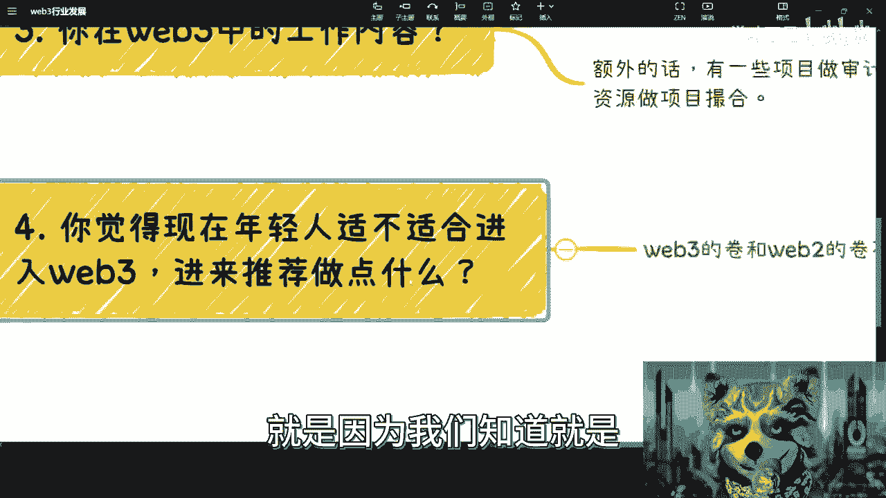

因为我们知道就是区块链就是炒币的市场，它是7乘24小时乘365天不不间断的对吗？对，然后这个而且新的技术其实是大批量大批量的出现的。就是我们说我们进来我们做我们做区块链做加密货币。对？我们进入这个市场。

因为我们觉得这个市场机会多，没错，它的。

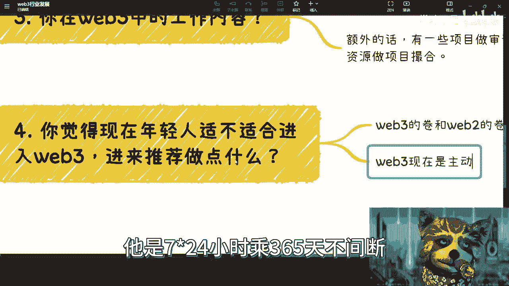

赚钱效应是因为呃有那么一点是就是他的机会其实真的很多。你如果在一个早期的阶段去发现这个项目，然后你去参与。那第一是嗯我们说就你你可能有福报，对吗？第二，你在早期的阶段参与项目的话。

你是有一个很大的就是就是财富增长空间的嗯，但是但是你你发现怎么发现呢，你肯定第一你要么就是我们说句不好听的对吗？那有的可能是靠关系，对吗？那大部分的人是需要去找的呀，去你要去你你要去各种就是消息渠道。

你获得消息的渠道，你去找这些项目啊，所以这是一个主动的卷的过程。就没有人给你安排这个KPI就没有人说你一定要完成某种KPI但是你是要自己设立一个目标。

就是你会每天的去去不不经就是不经意间不由自主的去去做这些事情。

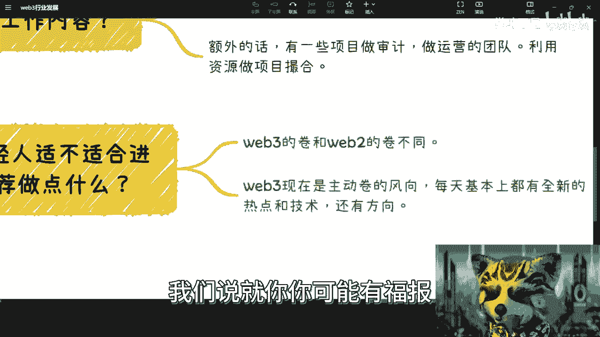

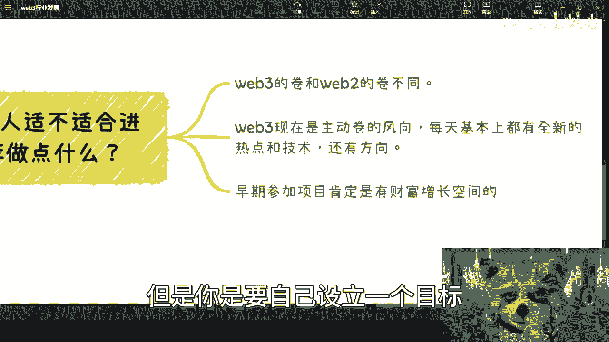

是这样的，O ok ok。

那我觉得还是有都挺卷的，其实都挺卷的，都挺卷的。啊不要觉得嗯说包括现在。很多你想要区块链就做这些的公司，他可能因为现在自从特别是从疫情之后嘛，大家有一种分布式办公的概念。

可能大家就觉得哎也不用早九晚五也不用上班打卡。嗯这些嗯对，确实不用。但是可能有的时候这种上班打卡的模式就是这种形式化的东西啊。要要更好一点啊，可能就是你要看哪个人都理解不用吧。对。

就以就千万不要觉得外部3是一片懒喊，没有那么卷，你才进才进。你这样你这样你抱有这个心态，你会大失责我。那我觉得大部分人还还还还是这样还是这样认为的，毕竟他们对这个内部情况不了解。😊。

对对对。OK哎，对，说到这个，就是我顺便提问一句啊，就是就是呃现在we3这边remote的工作多不多？😊，嗯，不少的。不少对O那那这种嗯一一般他们怎么找的到到disord telegram上面找嘛？

witter上remooteremo的对呃，对他呃是这样的。你一般是呃会有推特的消息员，然后现在也有很多他有很多其实有一些做类似就媒体类的，他会有这块将会把一些项目的需求放进来。嗯嗯放上去。

然后你可以去做一个自己你先自己去做一个匹配嘛，对吧？对对对，OK反正反正就是就是还是要么社交网站上，要么就那个那个叫什么，就是就是那几个社群的工具里面，反正就很对对对对，没错，OK ok。😊。

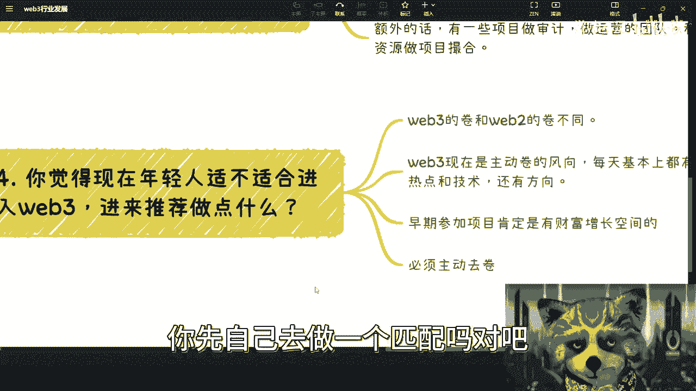

OK我想想啊，那。😊，嗯。OK那就这么说，就是说呃。😊，前两天因为因为就是也不要前两天吧，就最近吧，因为整个we2都很卷。然后web3呢其实多多少少吧，就是大家还是还还是比较关心的。

而且就是就是还是从大众来讲，我觉得就是他毕竟还是个增量市场嘛，对吧？而且我从我角度呢，我也觉得算一个增量市场吧。然后那这个当中我觉得呃有我我这边因为列了一个，然后我其实想了一下，除了这个以外。

还有一个是什么呢？就是关于出出国的问题，你知道吧？就是说就是说有两个啊，一个就是说因为现在有一些小伙伴他是想要去做web3的，然后呢他就问他说哎我比如说这个我看到打个比方，比如说呃港中大啊。

或者说这个复旦啊，或者或者说迪拜的某些这个学校啊，他有这个这个brolock的硕士的专业，他说我要去做we3，或者我觉得就像你刚刚说的，就是我要去到we里面赚钱。

那就是他说我要不要去这个卷一个这个叫什么block的硕士出来。😊，你觉得这个有没有必要？嗯。首先我觉得啊如果说是读硕士肯定是就是在你条件允许的情况下啊，就是你自己的经济条件可以 afford这个情况下。

其实是可以的，就是就是你自己经济条件允许，你可以去读硕士。因为毕竟你的毕竟这个学历的提升肯定是有用的。我不是说我说鼓励大家就是逃避。当然这这完全不是说我要去读书，因为我要逃避现实，肯定不是这样的。

只是说你从你自己自己出发，自己出发的话，嗯，提高你自身的一个知识水平，然后提高你的眼界，这是OK的。嗯呃另外一点就是其实我嗯就是呃另外一点就是专业性的硕士，就我们说区区块呃外部三课程是吧？

嗯专业性的这种硕士。其实我觉得嗯你要是做专业性的这种硕士就是去学这个其实会很泛。明白饭的意思。就是因为我也说，其实这个方向是非常大的，就这一块这个行业的方向是非常大的。你在我对于我而言啊。

如果我要去读个嗯再去提升一下自己的学历，提升一下自己的对于事物的了解的一些水平，去读硕士的话，我可能会往更精的方向去选择啊，泛很泛的去读一个外部三概念。像这有点像什么呢？

这有点像就是这个外部三专业这么一个设立啊，有点像。嗯，我记得大学的时候有一个读有一个什么专业，金融专业对，就是大学的金融问念就啥都学，就啥你都会学一点，但是都不精。嗯，而我觉得如果要做硕士就去读硕的话。

一定是要更精。而不是说你可能大学就已经很泛了。你大学学的东西可能就已经很泛了。那你嗯当然我我了解可能大学的时候，你自己其实很多人自己大学的时候也没有想好自己规划，对吗？那嗯或者说大学毕业了。

或者说你已经工作了两年了，两三年了。然后你再去做学历提升的时候，你肯定就不是当时那的心态了，你肯定是我要更精，我要在哪个方面更精。比如说我喜欢我喜欢经济，我喜欢金融，我喜欢金就是说def啊。

就可能这里边经济模型的设计，哎，我觉得有意思，那我可能会学技术，就是呃那个精工。这方向的或者说你喜欢研究宏观，那么那可能就是经济学嘛，经济学那可能就研究宏观就是真的是做一个学术。对。

而不是说就是真的就是现在因为我正好恰好啊这个我这个前两天的时候，因为我我跟尚总，我跟你不是也私下分享过这个那这种对对对，也嘛，对吧？其实现在很多的学生去读硕士，就是就是说说话这这这句话说出来可能扎心啊。

但确实是这样，就是为了拖啊，我觉得这两年太卷了。那你看失业率那么高，千年就业率就业情况那么不好，对不对？那我多多硕，那。嗯你你要想一下孩子，就是说你读完硕两年之后呃，读个专硕好，我混个学历。

而且很多的他的这个。甚至是读个本校的硕士，就是非非双一流的那种学校嘛。就是那你肯定大家考硕肯定都往上一步就更进阶嘛。嗯那可能就是随便照个大学就读个硕士。混个两年混个两年，那你出来不还得这样吗？嗯嗯。

你不还得走面对面对这个情况嘛？是的呀，对对对，就是如果真的是为了混时间，这种我觉得真的没必要。但是如果真的是想要去做自己的能力提升，这个是okK的。我这个这个是要鼓励的，对不对？嗯嗯。

OKOK然后那其实这些就是大众还有个最直接的点，就在于说他觉得我不出国，我在国内能不能做。No啊。为什么一定要出国才能做？OK啊，你你是说你是说什么样的形式呢？你你是要你你可能这个比如说可能人在项目方。

那肯定还是要出国比较好，对不对？那你肯定打个工。对啊，打工，那你打工或者说自己参与的话，其实国内也可以做。嗯嗯嗯对对对，我们不做割韭菜的事情，我们行的什么那个呃深圳不派也子席啊，嗯嗯，嗯，OKOK。

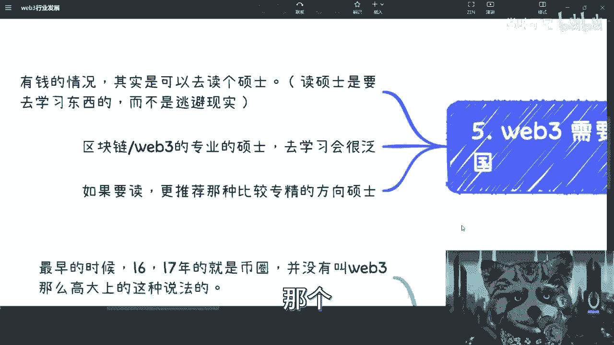

嗯，行呀行呀，我觉得差不多吧，我想了一下，大现在如果大家进来的话，关于这些东西哦，然后嗯其他的可能到时候看吧，到时候到时候看看，就是说这个大家有什么什么就是那些就更具体的意见或者。对对对对对。

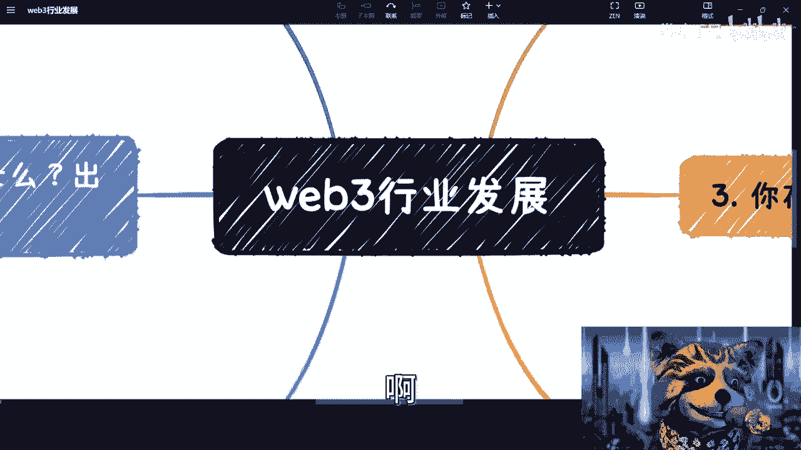

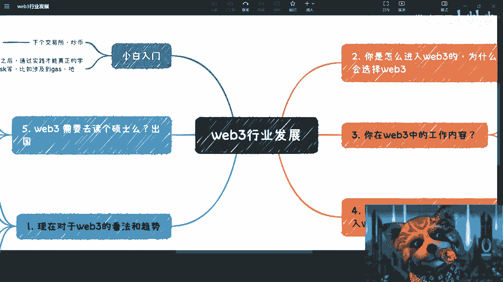

OK呀O呀，其他的这个张优秀同学有啥补充的吗？😊，嗯，我这边大概反正我也是这个意思嘛，就看大家下面会就是说留言会有什么问题，我们再去做主一的解答了。因为。就相当于我要要做一个互，我们要有一个互动嘛。

对吗？我想了解什么呢？okK而不是说我巴拉巴拉巴拉巴巴说那么多，可能一点没精准到你想了解，就是他想了的了解的这个事情。对。OKO行呀行呀，那那我觉得要不先这么着。然后回头这样子嘛。

回头就是我其实我是这么想的，回头反正看大家这个这个评论区的内容。然后呢如果来说啊到时候有些内容，我是觉得打个比方，就是说在这个呃这个政治敏感度啊，包括其他各个方面都允许的条件之下。

正我们可以回头再根据他们的东西，反正再再再弄个一期，或者弄个这个这个什么形式的都行啊。嗯可以可以行行行那O啊，那那那我觉得大差不差。嗯这个好，然后还是很感谢我们张优秀同学啊。

这个那对就就就真的是最帅的小姐姐没有质疑。真的我凭良心摸主的打一个赛博朋对赛博朋真的是哎呀帅的不行谢绍，那先这么着，那我们就跟大家说就好祝大家这个假期愉快。😊，对，假期愉快，拜拜。好的，拜拜。😔。

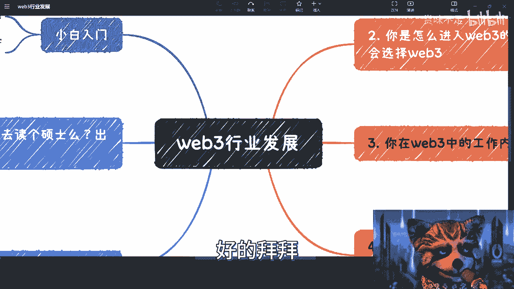