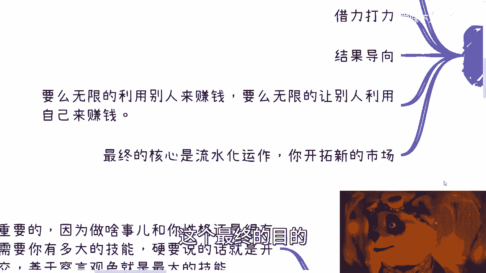

# 课程：普通人如何切入商业领域 - P1 🧭

在本节课中，我们将探讨一个综合性问题：作为没有特殊背景的普通人，如何开始接触并切入商业领域。我们将分析几个核心问题，并提供一套循序渐进的行动框架。

---

## 概述：切入商业的本质

切入商业领域并非一个孤立的事件，而是一个需要长期积累、循序渐进的过程。商业的本质涉及关系、人脉和项目，这些都需要时间去构建。因此，切忌眼高手低或安于现状，这两种态度都可能导致最终一无所获。

上一节我们概述了切入商业的长期性，本节中我们来看看具体的起始步骤。

## 第一步：从简单可控的事情开始 🚀

不要一开始就设定宏大目标，例如想做自媒体、带货或大型项目。这些对于初学者而言门槛过高。正确的做法是从最简单、最没有门槛、同时你能完全控制的事情入手。

以下是你可以尝试的几个方向：
*   **举办小型活动**：例如组织一场相亲活动。
*   **尝试直接变现的直播**。
*   **制作并销售低价课程**：例如制作一个两小时的课程，定价20元。

关键不在于项目大小，而在于**认真执行并走完整个流程**。你需要思考并实践每一个环节。

以下是创建一个低价课程可能需要考虑的环节：
1.  **课程大纲**：`课程主题 -> 分节内容 -> 案例设计`
2.  **个人与课程包装**：如何介绍自己和课程亮点。
3.  **工具与平台**：选择千聊、小鹅通、慕课、网易云课堂还是腾讯课堂。
4.  **宣传渠道**：是利用网络媒体免费宣传，还是在某个平台进行付费推广。

只有亲身经历整个流程，你才能理解商业运作的基本逻辑。敷衍了事不会带来任何进步。

## 第二步：在行动中完善与积累 🤝

当你通过一个小项目（比如课程或活动）赚到第一笔钱（即使是100元），这并非终点。这笔收入的意义在于验证了“有人愿意为此付费”的可能性。

接下来，你需要不断完善整个流程，包括文案、海报、视频宣传等。这种打磨不能闭门造车，必须通过**寻找合作伙伴**来完成。

> 合作的基础是认真与互利。如果你以敷衍的态度发起合作（不谈分润、不签合同），那么合作伙伴也会以同样的态度回应，最终难以成事。

因此，你必须先认真对待自己所做的事情。同时，这件事应该能**短平快地看到效果或赚到钱**，而不是将所有希望寄托在一条需要长期积累（如做两三年自媒体）且沉没成本过高的路径上。

如果你觉得自己没有内容或资源，可以尝试**组织合作**：让A出内容、B出人、C出资源，你负责协调与分润，大家共同尝试一些新项目。不要一开始就担心找不到人，总会有人愿意尝试。关键在于主动去寻找，而不是空想。

对于已有商业经验的人而言，合作目的性很强。他们会衡量投入产出比。如果你没有成功案例，又不是熟人介绍，合作很难达成。因此，你需要从小事做起，积累自己的第一个案例。

## 第三步：避免两种极端心态 ⚖️

在商业实践中，需要警惕两种心态：

1.  **切忌眼高手低**：不要只羡慕网络上成功的案例。那些都是不确定的未来。我们应该关注当下，从小事做起，哪怕先赚点蝇头小利或亏点小钱（例如几百元），关键是先行动起来，然后思考复盘。
2.  **切忌停滞不前**：不要因为某个模式赚到了一些钱（比如每月几千几万）就满足。在商业世界，**没有一个赚钱模式可以经久不衰**。市场竞争激烈，必须不断精进和迭代。

> 这就好比地上有一块钱，你不屑于捡，但总会有人去捡。如果你能找到在每个地方都捡到一块钱的规律，积少成多，也是可观的收入。但前提是，你不能看不起这一块钱，也不能捡到一次后就停下来。

## 第四步：明确商业关系方向 🔄

你需要思考未来商业框架中的核心关系：是**你主动找人合作**，还是打造吸引力**让别人来找你**。这取决于你的个人定位。

*   **定位为“资源池”/组局者**：适合气场强、善于沟通连接的人。核心问题是：你找别人，别人为什么理你？你需要想清楚：谁出钱？产品是什么？你为什么能帮别人赚钱？你现在有什么？你的客户是政府、企业、企业家还是大众？通过倒推逻辑，缺什么补什么。
*   **定位为“个人品牌”/被寻找者**：需要建立知名度。途径有两种：一是通过N层人脉关系被推荐；二是在网络上大量留下痕迹，便于被搜索到，比如打造某个领域的专家形象。

许多机构或协会拥有“私域流量”，即他们维护的一个内部生态。你可以选择连接这些现有池子。连接时，你需要准备一个“产品包”（PDF/PPT），清晰介绍你的产品、优势、团队、公司和过往案例。仅靠口头描述很难获得合作。

## 第五步：确定你的赚钱对象 💰

你的客户是谁，决定了你的策略。

*   **赚C端（大众）的钱**：你必须有自己的鲜明特色或“人设”。在众多竞争者中，如果你平平无奇，就像沙滩上的一粒沙子，无法被看见。你需要通过独特的风格、包装或宣传方式来突出自己。
*   **赚B端（企业）的钱**：
    *   **走咨询培训路线**：需要知名度、头衔和企业认可的资质。通常需要引荐机构或合作机构，因为企业倾向于与熟人合作。
    *   **走供应商/项目制路线**：需要找到关键决策人或信息渠道。即使一开始项目很小甚至免费，也要先跑通合作流程，建立案例。
*   **赚企业家（个人）的钱**：方向可以往高端大会、私董会、领导力培训、风水玄学等领域靠拢。

不要纠结于自己沟通能力不行、性格软弱等缺点。在商业起步阶段，**包装自己**和**主动展示价值**比现有的性格短板更重要。你可以告诉A你有订单，告诉B你有供应商资源。如果自己做不到，可以寻找互补的合作伙伴。重要的是先让项目跑起来。

## 第六步：盘点与发挥自身优势 🎯

你的性格特质本身就是重要的优势。硬技能（如学历）在商业起步阶段并非最关键。

以下是更重要的软性优势：
*   **开朗、善于社交**
*   **善于察言观色**
*   **逻辑清晰，能一针见血地表达**

商业世界中，时间宝贵，越往上走，对方越没有耐心听冗长混乱的陈述。如果你具备这些特质，就去发挥它们赚钱。如果不具备，为了赚钱和发展，你需要**有意识地自我改变**。

如果实在无法改变，可以寻找合作伙伴进行分工（例如你负责后端，伙伴负责前端沟通）。但需注意，长期而言，这种模式可能使你处于被动，且在利益面前容易产生分歧。

## 总结与核心策略 🧠

本节课我们一起学习了普通人切入商业领域的系统方法。我们来总结一下核心策略：

1.  **无中生有**：如果不知道做什么，就自己创造一个微小项目（品牌、活动、平台），但核心是**必须设计盈利环节**，并认真走完全流程。
2.  **借力打力**：自己没有资源，就去寻找并连接拥有资源的公司或个人（大、中、小公司乃至个体户），通过合作整合资源。
3.  **结果导向**：一定要以赚钱和流程闭环为目标，避免长期做毫无积累的“杂牌军”式零活。
4.  **核心路径**：要么**无限利用别人的资源**来赚钱，要么**找到让别人利用你的价值**（资源、关系、软技能等）来赚钱。
5.  **终极目标**：商业的最终目的是提高**投入产出比**。你需要将一件事做到能自动化赚钱，然后抽身去开拓新市场。你的业务要么向垂直深度挖掘，要么向横向广度扩展。

> 商业公式：`最终目标 = 自动化收入流 + 开拓新市场`

商业更重要的是**摸索模式**和**积累人脉关系**，具体做什么项目反而可以灵活调整。要有勇气推翻重来，不断迭代。

最后强调：以上讨论均基于你在拥有**稳定主业**的前提下，如何拓展副业并使其更正规化，最终目标是让副业收入超过主业。不支持盲目全职创业。

如果你对职业规划或如何利用现有资源有疑问，建议整理好个人背景资料，进行系统分析。现在，最重要的是：**先干起来**。