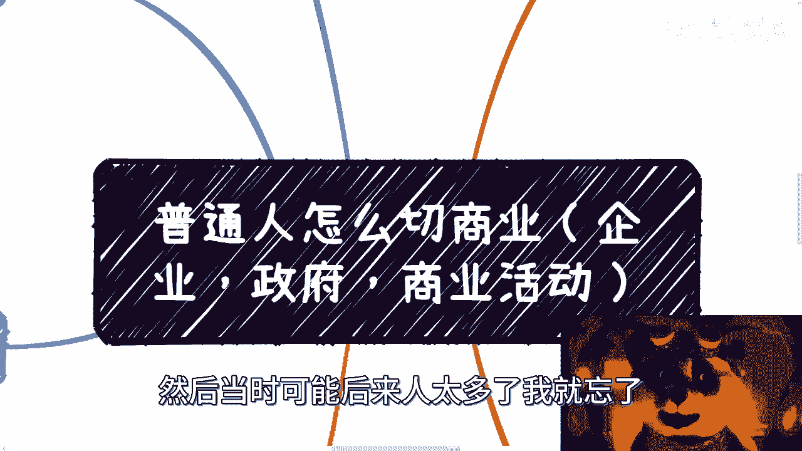
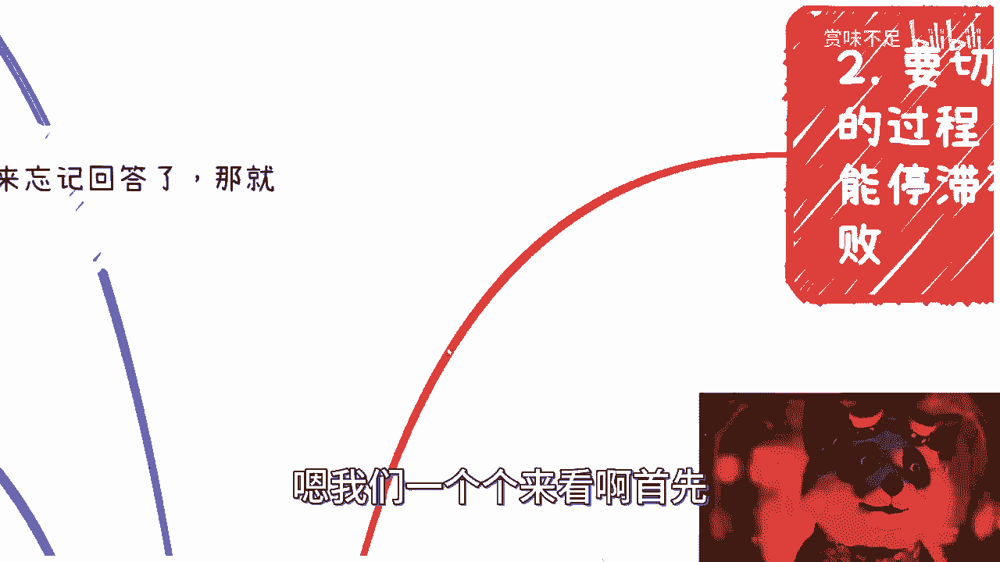
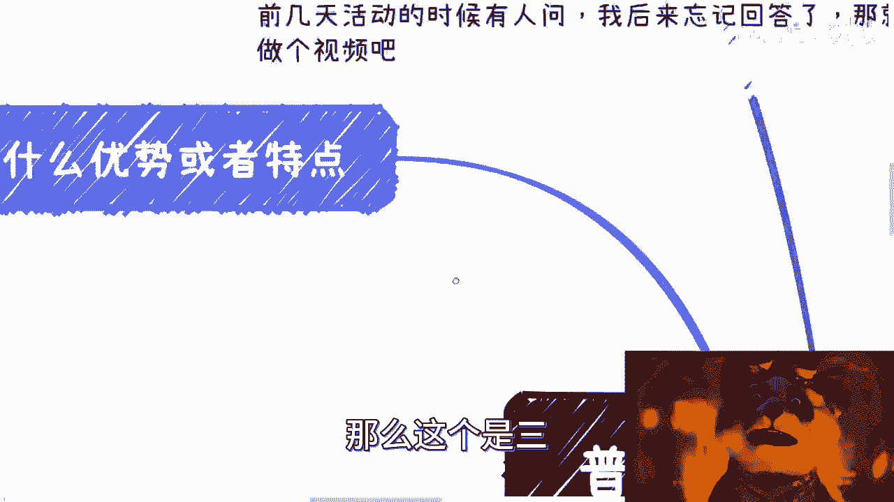

# 补档：普通人怎么切商业 - P1 - 赏味不足 - BV1Hc411c7fm

Hello，大家好啊，这个前两天呢这个活动啊，线下的时候有小伙伴问我这么一个问题，然后当时可能后来人太多了。

我就忘了啊，正好我就在这个视频里面，就是给大家做个视频吧。

就是说一下这个问题啊，嗯这个问题呢其实我觉得也是综合性的，那综合性的我差不多总结了一下啊，就是普通人怎么切商业是吧。

包括这个企业啊，政府啊，商业活动啊这些东西啊，首先呢企业商业呢我觉得是这么几个问题。

你们看啊，第一就到底是你找人还是人找你对吧，就这个商业合作是你去找别人合作呢，还是别人找你合作对吧，这是第一点，第二点啊，你要不要用个公司去做对吧，第三点就是说你到底是给企业做呢啊，就是你的客户啊。

这到底是企业呢还是政府呢，还是普罗大众对吧，好包括企业家啊，那么第四呢就是说你赚的是谁的钱对吧，第五呢就是说你现在到底有哪些优势或者特点，那对大部分人来讲呢，就就说嘛他说那我现在没什么特点啊。

我也没什么优势，对吧好，那么呃说个结论嘛，就是要切商业，首先它不是一个点的事情，它是一个长期的啊，循序渐进的过程，那不是说打打个比方，不是说哎咱们咱们明天切商业了好，我就开始商业做动作了，不是你知道吗。

就商业你说到最后它本质上是有关系啊，有人脉，有项目有什么东西，但这个东西它是一次一个一个一个东西，它是要去积累的啊，包括就是说你说哎为什么别人不吊我对吧，这个别人凭什么跟我合作。

这样子就很多东西他都是慢慢慢慢去积累的啊，所以说呢在这个过程当中啊，首先千万不要眼高手低，也千万不要就是安于现状啊，也不叫停滞不前，就安于现状啊，你我跟你讲，你但凡选择任何一个，你都会就是就是就是。

就是最后可能就是竹篮打水一场空啊，都有可能是这样子嗯，我们一个个来看啊，首先我先说最后一个就是要切商业。

就要循序渐进，对吧啊，嗯你看啊，首先呢你别一上来啊，就说你说我还想做什么做什么啊，这些都是后话啊，包括就是说你说我一上来就想做自媒体啊，我一上来就想跟别人一样做什么带货啊对吧。

我我一上来就想做什么东西啊，这没有用啊，你就从最简单的最没有门槛的去做，因为你没有东西啊对吧，你要跟我说，你今天有直接关系，有直接怎么样，那你就直接去干对吧，那你从你能你你从最简单的没有门槛的同时。

又从你能控制的去做，比如说你办一个活动，比如说你做一个相亲对吧，比如说你做一个做点，做做一个直播，而且这个直播是直接变现对吧，比如说你今天做一做一个课对吧，你说我就做个什么两个小时课。

然后卖个20块钱对吧，那你就去做，你看看效果，但是啊这个地方我得说一嘴，就是说做，那你就认真点做啊，别就是到时候说啊，吕老师说的什么，弄个两个小时课，我就去卖来了，然后你就是什么毫无章法的对吧。

弄了两个小时课，然后朋友圈去买，没有用的，你知道吗，就是你该走的流程还是要走，你该用的工具还是要用老师，我给你打个比方，比如说你要做两个小时课，对吧好，那你想好课纲是什么，你自己到底怎么包装。

你自己这个课怎么包装对吧，海报怎么做对吧，你平台用的是什么，用千聊呢，还是用小额通呢对吧，还是用用用用用慕课，还是用些别的，还是放到网易云课堂呢，还是腾讯云课堂呢对吧，那你怎么宣传呃。

你是通过网络媒体的免费宣传呢，还是说你可能这个用某一个平台的这个，付费去宣传对吧，你都得要去试，你做了你才有了解，你才会对整个的流程得明白对吧，你什么都没有，你说哎我今天就做了对吧，然后就洒洒水。

这种就是就是非常不负责任的去做，那你这样做人不会有进展，就不会有进步的对吧啊，那么这第一个第二个呢就是说做事情呢，你比如说你要做个活动对吧，你做了个自媒体，或者你来了个课程，也许啊我就说你赚钱了，赚了。

比如说100块钱和200块钱，但这个东西没有用，为什么呢，因为你这件事情只是让你知道哦，可能是有人来买的对吧，那买了之后呢，可能对于你的服务不满意，他可能还要退款对吧，或者怎么样子啊。

但是呢你得要去知道，你怎么把整个流程去完善好，包括我这边说的这个文案啊对吧，海报啊啊这个这个视频啊宣传啊对吧，你得不停的打磨，而且这个打磨呢不是说闭门造车，你要不停的找合作方，然后找不停的合作伙伴。

不停的去找一些各种各样的人对吧，然后去积累你自己的关系对吧，不是说啊，大家就就就就非常那种就是忽悠一下啊，就说哎你看啊，我比如说你跟我说，吕小新帮我宣传，我说好的，我来帮你宣传一下，没问题的啊。

然后好了，我也什么都不干，对不对，为什么，因为你这么说，本质上你就没有跟我谈过分润，你也没有跟我谈，你也你也没有跟我签合同对吧，那么所有的事情就很简单啊，那你洒洒水，我也洒洒水对吧。

所以说本质上是你得先认真地对待你做的事情，但是你做的这件事情一定要短平快的去赚钱，或者短平快的去看到效果，而不是说就是现在很多人就跟我说啊，我要去做个自媒体对吧，我要积累对吧，积累两三年之后对吧。

那你可不可以可以啊，但是除了这条路，你你还是得要找一些别的，就是短平快能赚钱的路，因为你单靠这条路去走呃，沉没成本太高对吧好，那你比如说你自己什么都不会没有关系，你只要别人合作。

你让ABCDEFG给出内容，出人啊，出什么都行啊对吧，出礼仪小姐对吧，出什么呃，会会务管理对吧，出什么市场都可以，你随便你只要有本事就让别人给出啊，你只负责分润对吧，那大家一起来拼一下，做一些事情。

当然啊，就是你们不要一开始没有做的时候，就去担心说啊，我要是找不到人怎么办啊，我要是怎么样怎么办，对吧，嗯就没有关系的对吧，你找我，我肯定跟你说，我没空对吧，但你知道别人总有人可以产出东西吧。

比如说总有人可以给你产出课程吧，总有人可以给你给你露脸吧，总有人可以给你去一起尝试做直播嘛，或者做那个播客吧，做什么东西，总有人愿意一起变形变形试试看的，你知道吗，你要去找你的合作伙伴。

而不是说一开始就想着说哎，我去找找谁谁谁谁对吧，但是你要明白，对于大部分已经做过商业的人来讲，他的目的性是很强的，你知道吧，你找我就是一样的，我我要去衡量啊对吧，比如说我现在一天，我去做一个这个叫什么。

政府或者企业的商业咨询，我能赚多少钱对吧，那我来衡量你能给我带多少钱对吧，那你要是跟我说，哎呀这个吕老师，我这个东西这个变现能力也不知道的对吧，都活动后面是问号的，那我凭什么跟你合作。

我他妈做过来做慈善的，对不了啊，而且我跟你讲，就是我们其实是有叫什么就不成文的，这个想法的是什么呢，就是但凡你你自己没有成功案例，但凡我们没有合作过，我不会就是说哦或者说但凡不是说我的呃。

熟悉的合作方介绍给我的，我我一般不会合作，而且不是我的问题，其他人也会这样子，我跟你们讲，为什么，因为这样的话没风险啊，我何必去冒这个风险呢，对吧，你又不是说给我带几个亿，是不是啊。

那么同样的就是千万别眼高手低，就看着网络上呢，比如说大家貌似都很牛逼对吧，做了很多事情，我知道啊，大家也很向往对吧，对普通人来讲都很羡慕啊，这也没毛病，但是对于大部分人来讲啊。

这些你们所向往的东西和牛逼的东西都是未来，而且这都是不确定的未来，因为不知道大家能不能达到这个未来，对不对，那我们要做的就是做当下，从小事情开始做起，你哪怕亏点小钱，比如说你亏个几百块。

你别跟我说亏几万块啊，你比如说亏个几百块钱对吧，比如说呃你就赚了几十块钱，蝇头小利都可以，你先做起来再说，你知道吗，你先把这件事情做了，然后去思考，去复盘啊，不要老是停留在想着，就是说，我要赚大钱啊。

没有用的啊，那么当然我说过啊，做商业要么躺，要么也对吧，因为你要知道你任何过程只要是模棱两可，优柔寡断的这个过程啊，在当下这个时代没有用的，你就跟去公司排队卷是一个道理，就是你不做，你做的慢。

那总有人做，总有人做的比你快对吧，你再小的利润不赚，总有人会去赚，为什么，因为人太多了，因为大家压力都很大。

你知道吗，就这就好像什么你知道吗，这就好像你今天看到路上有个一块钱，你不稀得捡，那没关系啊，所有人会剪的，对不对，一个道理啊，但是很多时候你要知道，就是这一块钱很有可能你找到规律。

你在每条路都能找到这一块钱，那你积少成多，那你也是赚对一个道理啊，但是不要去就是说眼高手低。

或者就是说呃停滞不前。

停滞不前的意思是什么呢，就是说你今天做了一些事情，你觉得蛮好的啊，也赚钱了对吧，比如说可能一个月赚个几千块，赚个小几万，你也蛮开心的，但是你要知道在商业层面啊，你不需必须不断的精进，因为没有你们做过。

你们就知道了，没有一个赚钱模式是经久不衰的，甚至不是说不要说经久不衰吧，没有一个赚钱模式是什么能够玩呃，这个稳定的持续几几个月甚至几年对吧，怎么样子，不可能的，你当中都在不停的变呢对吧。

你要是商业这么容易做。

那大家也不至于在商业战场上面，就打得你死我活对吧，没有必要的。

那你去问问那些大企业，那些国企，央企每一年这个里面做营销的对吧。

做销售的压力多大对吧，现在外面竞争多激烈啊，对不对好，那么第三个呢就是说你找人还是人找你对吧。

你比如说啊你要做商业没问题，一开始你就要想好，未来到底是大框架到底是怎么样，我不说详细的啊，就是那个模棱就是模棱两可的这种大框架，你比如说你到底是个什么角色，因为有的人能说会道，就是有的人这种气场很强。

我跟他们沟通下来就会感觉我就跟他们讲，我说你不适合做这种具体的业务哦，你就适合传局，你知道吗，你就是个把自己做成了资源池，你知道吗，那有这种人呢啊，你到底是什么角色，当然你也可以跟我一样。

就是既做成一个资源池，也做成一个个体个人的品牌也可以的对吧，然后让让别人去找你，但是你你要对自你要对自己定位清楚，你知道吗，呃那么这个时候就有人说了，他说那我有没有可能从一开始就定位好，我既做个人品牌。

又做资源池，我跟你讲不可能的，我我跟你讲不可能的，这种东西都是机缘巧合，顺其自然，天时地利人和的，你要一开始就定位你，比如说跟我现在一样，你说我想做一个资源池，同时又做个人品牌，我跟你讲你就会很难。

为什么啊，因为做个人品牌跟做自延迟，这个当中虚虚实实哦，同时就是说呃有野的有不野的，对于大部分人完全没接触过的人来讲，你们分不清楚的对吧，你你你而且你分裂不开来了，就是你没法这么清楚的分清楚哪些事实。

哪些是虚，你也没法去分清楚什么场合到底应该以，什么场合应该不野，你不知道啊，你知道吗，你只能指望说在你的成长过程当中啊，有一些契机能够既做成这样，又做成这样啊，那么如果你一开始说我定位就做资源池。

那么资源啊，那么问题来了，就是你找别人，别人为啥吊你对吧，那么好，那么我们来反推一下，对不对，好，那么问题又来了，你怎么帮别人赚钱，那么你就要搞清楚，比如说谁出钱啊对吧，产品是什么啊。

为什么你能够帮助别人赚钱啊，那你现在手上还有哪些东西呢，对不对，那么就回到我们另外一个问题，就是你到底是赚政府的钱还是赚企业的钱，还赚企业家的钱，还赚老百姓的钱，你得一步一步去倒推，把你的逻辑倒推清楚。

你知道吗，然后缺什么就补什么啊，那么再比如说人找你对吧，那么很简单，你就需要有知名度，什么叫知名度，要么就是N度人脉关系，人家能找到你啊，我不是说网上，就是比如说今天有个这个省省市区的企业对吧。

或者怎么样子要做一些东西对吧，那么他可以通过一些关系介绍关系，介绍关系介绍关系，然后一层一层找到你对吧，要么你就是在网络上多可可能多的搜到你，那么可能多的搜到你，怎么弄呢，你要么就是多留痕迹。

比如说你说你就相当于是你可以理解为，你自己在网上造势对吧，你说啊我今天就是某某某品牌，我就专门讲什么东西的啊，这也可以啊，那么无非就这几种可能性啊，那么很多时候呢你会发现有人。

比如说有机构或者有协会都是自带流量的，我跟你讲，为什么叫自带流量，是因为他们呃以前积累下来的私域流量，维护的特别好，什么叫私域流量呢，就说白了就是他们自己造了一个象牙塔啊，里面圈了一些人或者机构啊。

然后呢这里面的人工机构呢，就是因为基本盘都这样嘛，他们的消息很闭塞啊，那么剩下来的呢，就是说这个呃机构或者协会或者个人呢，他是会不停的往里面去喂粮食，那所谓喂粮食，就是说我会不停的往里面。

比如说做培训也会跟他们说，哎我会给给你们不停的带来一些商机对吧，大家看看有没有合作机会对吧，那么其实在里面你就会发现它是一个自循环啊，那么说的好听一点呢，叫做私域流量，说的不好听点呢，就是韭菜池子啊。

那么不管是什么啊，那么你需要的就是如果你自己不养韭菜池子，那么你需要的就是去连接更多的这样的机构，你知道吧，好那么同样的就是你连接的时候也是一样的，你得有所谓的产品包哦。

所谓产品包就是你要有一个PDF或者有一个PPT，来介绍你到底有什么产品，你到底有什么优势，你团队是什么，你公司是什么，对吧，你以前做过哪些案例，这总归要有的啊，呃完全靠嘴说，我跟你讲，没人会合作的啊。

那么这个是三。

啊那么四就是你赚的是谁的钱对吧，那么你一个来了，比如说你说我想赚赚C端的钱，我就告诉你啊，中国你要赚钱赚钱必须演啊，你不也不可能的啊，不要讲了啊，没事没没有希望了，对不对，你就拿张雪峰来讲。

张雪峰的这种风格本身其实就是一种野的风格，你知道吗啊就是他的表述，他的直播，他的各个方面其实就是一种野啊，大家不是说也就一定说要去这个红线蹦迪，不是的，你们知道吗，就我就说嘛，就是他这种风格我让你们做。

你们能做吗，你们做不了啊，为什么，因为你们也不起来了，对不对啊，那么C端凭啥会来，你说你长得好看吗，还是因为你学历高，还是因为啥，因为啥都没用，我跟你讲，为什么，因为你和14亿人是一样的，你也不长角啊。

你知道吗，所以你必须也什么叫必须也，就是你要么你的风格也，要么你包装也，要么你吹的也对吧，你总归得要演啊，你不也不起来，你就是这个海沙滩上的一粒沙子，有什么区别呢，凭什么人家会来了，对不对啊。

那这是第一点，第二点是你想赚B端对吧，比如说企业啊，那么你要看什么切入点，比如说你说我想走咨询培训啊，那么你就必须要有知名度，你就必须有title，你就必须要有企业喜欢的那些虚的东西，你不能没有。

我跟你讲就这么简单，你你说我很牛逼，没有用啊，谁你啊，你很牛逼，你吹牛逼吗，后来对不对，你管你牛逼，反正case不是你的，就这么简单，而且你需要引荐机构合作机构哎为什么，因为人家只会找熟人合作。

你是谁啊，Nobody，谁认识你啊，不认识对了，没有用的，我跟你讲，千万千万千万千万不要觉得自己牛逼，没有用的啊，你牛逼牛逼不是你说了算的，是别人说了算的啊，然后呢你也可以选择走供应商或者项目制啊。

那么这个时候呢就是你要找到对的人，就说白了你要找到你能够获取这个信息的，或者能帮你做上报的，能帮你做合作的这么一个人啊，这个人不一定是一个很牛逼的人，他可能就是下面干活，但是你得找对他哦。

那么你同样的还有找，还要找到符合你的方向对吧，比如说你做基因疗医疗的，做金融的，做什么东西啊，你得找到方向啊，那么唉呀呀呀呀呀，完了对吧，那么就是说你需要一个黑色去做，再小的，哪怕一开始免费的。

你也得做，因为你要先把合合作跑起来，你知道吧啊那么你才能后面才能成长啊，那么同样的你想赚企业家的钱，那么就往那种大会啊，私董会啊，培训啊，领导力啊，风水啊，玄学啊上面套啊，否则你能赚企业加钱啊。

没办法赚的呀，对不对，往上面套啊啊然后呢就说不要再去纠结啊，就说哎呀我好像沟通能力不行对吧，我好像自己呃这个有点这个软软弱弱对吧，我可能有点这个叫什么，就是优柔寡断对吧，然后怎么样怎么样，你不要去想啊。

这不重要啊，这不重要，你就是nobody点，别人为啥跟你合作，那么你包装只要你包装就不是nobody了对吧，你不包装别人也会包装，你不吹牛，别人也会吹牛对吧，你跟A说你有单子。

你跟B说你有供应商不就好了吗，你你还是那句话，你要做不了，OK那你就别做，商业结束了啊对吧，那那那哪里有一条路是百分之百能走的，没有的呀，对不对啊，那么总有人会合作的啊。

总有人就是愿意大家拿出点东西合作的，重要的是你得先跑起来对吧，你不是nobody嘛，对不对，你要说你有资源。

那也不用这样做了，对不对啊，那么第五个就是你现在有什么优势或者特点。

我跟你讲啊，其实这个很重要，因为做啥事他跟你性格很有关系，我跟你说，不需要你有多大的技能，就是你为什么不重要啊，你什么学历，什么学校更不重要啊，阴阳说重要的是什么呢，就是你是不是开朗，你是不是善于社交。

你是不是善于察院干涉，这就是最大的技能对吧，你是不是逻辑性很清楚，因为你逻辑不清楚，在商业上面是最大的这个忌讳，你知道吧，因为因为这样的话就是说你越往上走，他们的时间是越宝贵的啊。

你越不能表直接直击痛点的，一针见血的描述你的问题，或者说描述你的需求，或者说来阐述你的能力，那就完了，别人没有，不过我不会给你第二次机会的啊，所以说其实你要么就有啊，那么有这些能力，那么你就去赚钱。

你要么就可以做自我改变，让自己有起来对吧，你说我可能以前不太这个社交，我社恐对吧，或者怎么样子，那为了赚钱啊，为了这个自己能给自己打工对吧好，那么你说我我愿意改变，那也可以啊，那么实在如果没有。

你就找小伙小伙伴给你分工，对啊，你说我我我做后端，然后你做前端啊，我躲在后面啊，你你你你你你去这个与大众沟通，那么这种事情呢我跟你讲时间短没问题，时间长了你也有，你很大概率，我就说商业上面。

很大概率会处于一定的被动状态，因为人这个生物呢就这样子的啊，当没有赚钱的时候呢，大家都是你好我好大家好，当看到一些蝇头小利的时候呢，大家都很积极，当看到利润高的时候呢，我跟你讲。

大概率只剩下季度眼红举报分裂结束啊，哎呀人就这样子啊，人就这样子，你们但凡做人啊，早早早晚都会碰到这样子的一个情况，所以我给你们总结一下啊，就是商业这件事情对普通人来讲啊，无中生有对吧。

就是你不知道做什么没关系，那你自己先搞一个啊，你说我搞个品牌，搞个品牌，搞个平台，搞个活动，什么都可以搞啊，但是呢一定要赚钱啊，怎么做，你们自己想怎么做，你们自己想都可以，怎么也怎么来啊，很简单。

那么这是第一个，第二个呢就是借力打力对吧，你说我没有没关系啊，那你去找找各种公司啊，大公司找不了，找中型公司，中型公司找不了找小公司，小公司找不了找找个体户，对不啦，借力打力啊对吧，就总有人有点东西啊。

你跟他聊下来，你发现诶这个人我可以这个东西我可以用的，哎你能不能下次借我用一下对吧，就是这个资源或者怎么样子，人家都愿意的呀，有什么不愿意，对不对，你都是从野蛮生长开始做的呀。

啊你一开始做商业什么都不懂，就正规做，我跟你讲不太可能的啊，不太可能的啊，那么同样的就是结果导向就是你一定要赚钱，你一定要把整个的流程走完啊，不要去做那种就是就是很杂牌军的啊，不是很杂牌军嘛。

就是很那种就是就就是就是啊，就非常不正规的那种，就是就是赚赚外快可以的，但是你不能把它当成一个长期的一个，一个一个东西，因为这是没有积累的对吧好，所以说核心呢，就说你要么就无限利用别人来赚钱。

要么就无限的让别人利用自己，来自己来赚钱对吧，当然啊也不是只有这两个，也有别的对吧，这个你说我可以通过自己的能力啊，去知识变现或者怎么样啊，但我觉得如果这样你能直接变现呢。

你就不在整个的这个普通人基本盘里面，因为我觉得真正的普通人基本盘，应该是可能没什么东西的哦，他你要让他自己变性，他变不了现的，所以你要么就是想办法利用别人，要么就让别人利用你自己啊，就这么简单。

当然利用你不是说要利用你的能力，可能是你有什么资源，别人可以利用，也有可能是你有什么关系，别人可以利用，也有可能是你这个人除了硬技能以外，有些软技能别人利用都有可能啊，不管怎么样。

你得找到让别人利用你的价值，对不对，那么最终商业化做到后面核心是什么，就是你一定要把一件事情做到能够自动化赚钱，同时你人抽出来去扩展新的市场，这才叫真正的本质啊，这才叫说啊，就是我们说那个这个做商业。

这个最终的目的就是提高你的投入产出比嘛。

对吧，否则你说你去做一个商业哦，做了一前两年积累。

我觉得没问题啊，你说你做个商业做了好多好多年，56年七八年对吧，10年到最后人家问你哎，你一年赚多少钱啊对吧，你说啊我一年可能利润就二十三十万，那我那你还不如打个工，何必呢对吧，就是所谓商业。

你手上的东西啊，你一定要这么想，要么垂直深度挖掘深度，要么就横向挖掘广度，你既如果没有深度，也没有广度，那这个东西就是就是你可以考虑的是什么，就是如果它利润率高，你就留着，如果利润利润率低。

那可能你未来还得改风向，你知道吗，这也是为什么我之前视频里面跟你们说的，就是你如果真的做商商业，你不但要演，你还要勇于就是推翻重重来，因为商业这个东西啊，它其实更多的是你得摸索它的模式。

跟你积累人脉关系，这个事情的核心做什么其实不重要，因为今天你可以做这个，也是这些模式，也是这些人的人际关系，明年你可以做那个，但其实也是这些模式，也是这些人际关系，重要的是把这种东西积累下来。

而不是说你做什么很重要，做什么不是那么重要，好吧行行，那就说这么多吧，啊这个希望大家能够能够理解一点，那不理解我觉得也没关系，就是先干就好了好吧，先干啊啊这个地方我再强调一下啊，我从来不跟你们。

我从来不支持大家创业的啊，啊就是这些都是你有一个主业的情况下，面在想办法拓展拓展自己的副业，想办法把自己的副业能够做的更正规，想办法把让自己的副业收入能超过主页，这个是我们的最终目标啊，最终目标好吧行。

那大家反正有这个职业规划啊，或者有就就就是对未来这个职业发展，或者说自我积累可能不清楚的，或者手上有什么牌，不知道怎么打的好吧，你们整理好word啊，整理好个人背景。

