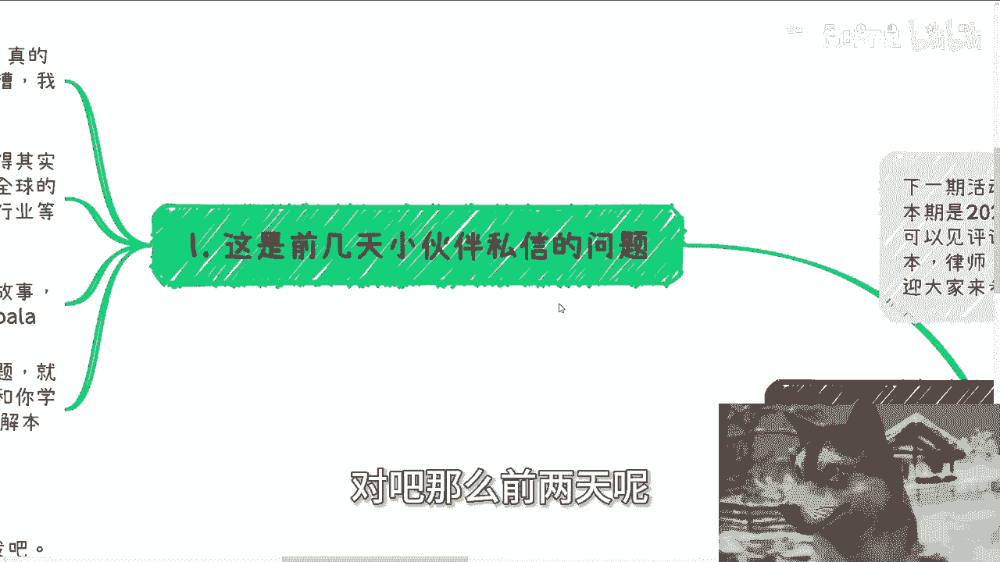
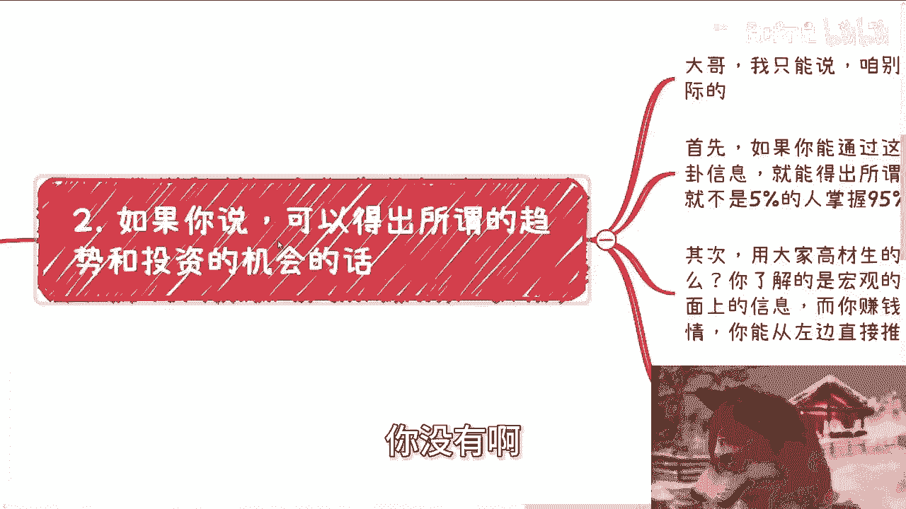
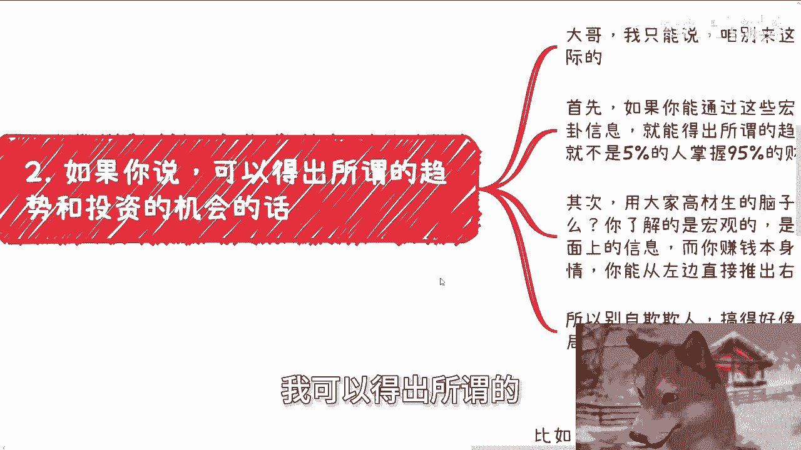
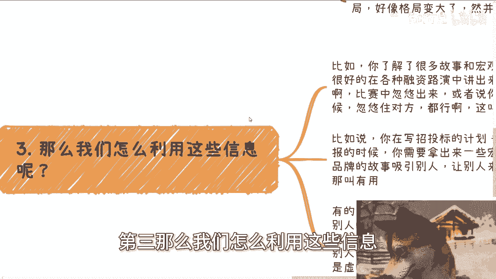
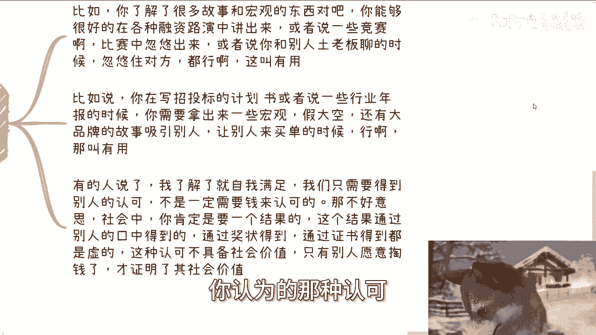
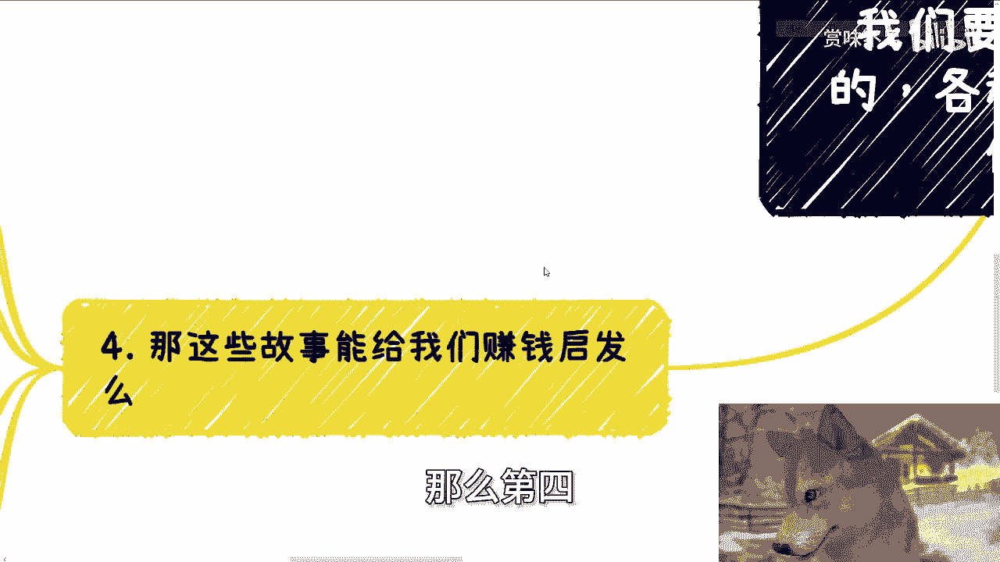

# 要不要了解宏观-全球-各种品牌的商业故事-和我们的关系是什么----P1---赏味不足---BV1S

在本节课中，我们将探讨一个常见问题：普通人是否有必要花费大量精力去了解宏观趋势、全球动态以及知名品牌的商业故事。我们将分析这类信息的本质、价值，并探讨如何将其与个人实际目标相结合。

## 概述

视频源于一位观众的提问，主题是探讨了解宏观商业故事、全球趋势与个人发展的关系。主讲人观察到，当前商业财经内容虽然丰富，但同质化严重，且往往以“大格局”叙事为主。他认为，关键在于如何将这些信息转化为个人价值。

## 信息过载与同质化现象

上一节我们介绍了课程的主题，本节中我们来看看当前商业财经内容的现状。

在浏览主流平台的商业财经频道后，我发现内容种类繁多。这些内容常常给人一种“立即成功”的错觉。

然而，这些内容背后逻辑相似，信息也大同小异。无论是全球金融变化、行业发展趋势，还是大品牌（如蜜雪冰城、万达）的创业故事与八卦，其叙事方式通常都是宏观的、数据化的。

## 核心问题：信息与变现的脱节

了解了信息环境后，我们需要面对核心问题：了解这些信息的目的是什么？

从本质上看，了解宏观政策、学习专业技术与了解商业故事逻辑相同。但核心问题在于，你能否将了解的知识**变现**。

我们生活在一个互联的“地球Online”游戏中，而非单机版。仅仅拥有知识而不懂得将其转化为实际价值，知识本身就无法带来自由。

以下是几个需要警惕的思维误区：

*   **误区一：为博学而博学。** 如果仅满足于“知道很多”，却无法变现，那么了解这些信息并不能带来实质性的改变。
*   **误区二：幻想推导出投资机会。** 认为能从公开、宏观的信息中直接推导出具体的赚钱趋势和投资机会，这种想法缺乏逻辑。因为：
    *   **公式：** 公开的宏观信息 ≠ 私有的落地细节
    *   如果此路可行，财富就不会高度集中在少数人手中。
    *   赚钱依赖于水下不为人知的细节，无法从水面上的公开信息直接推导。
*   **误区三：追求虚幻的格局与认可。** 感觉了解这些信息后“格局变大”，或仅满足于获得他人口头认可，这并非有效的正反馈。在社会中，最核心的正反馈衡量标准是**金钱**，它代表了你的产出具备了社会价值与商业价值。

## 如何有效利用宏观信息

既然盲目了解存在问题，那么这些信息究竟有何用处？

宏观信息、品牌故事在特定场景下是有用的。关键在于主动地、有目的地“利用”它们，而不是被动地“消费”。

以下是几个有效的利用场景：

*   **用于沟通与展示：** 在融资路演、商业竞赛或与潜在投资人沟通时，运用这些故事和宏观视角可以增强说服力，塑造专业形象。
*   **用于文案与报告：** 在撰写商业计划书、招投标文件或行业年报时，引用宏观趋势和品牌案例能使内容更具吸引力和可信度。
*   **用于创造价值：** 信息的价值不取决于其本身，而取决于你能否通过加工和转化，使其产生新的价值。这才是需要培养的核心能力。

## 商业故事的启发与局限

上一节我们讨论了信息的利用，本节中我们来看看这些商业故事能否直接带来赚钱的启发。

直接从中获得可操作的赚钱启发的可能性很低。主要原因如下：

1.  **幸存者偏差与时代变迁：** 许多成功故事是特定历史条件（天时、地利、人和）下的产物，具有偶然性。时代变化极快，过去的路径很难简单复制。
2.  **规模与模式错配：** 大量故事讲述的是大企业、重资产模式，与普通人轻资产、高性价比的赚钱路径关联度低。过度关注可能只会带来“爽文”般的情绪满足，而非实际指导。

因此，最大的“启发”可能仅仅是让你“感觉”受到了启发。我们必须认识到：**所有的历史都由其独特的背景（上下文）塑造，可供参考，但绝不能直接照搬结论作为当前行动的依据。**

## 总结与行动建议

本节课中我们一起学习了如何理性看待宏观商业信息。

总结来说，了解宏观故事和全球趋势本身不是目的。关键在于你是否有能力将其**转化**为对自身发展（如职业规划、商业规划、副业、融资等）有实际帮助的要素。

盲目消费信息无益，有目的地利用信息才是关键。如果你希望将这些宏观视角与个人接地气的规划相结合，少走弯路，那么梳理清楚自己的具体问题和个人背景是寻求有效建议的第一步。

---

**下期活动预告：** 2024年第二期数字经济大会将于9月8日在上海举行。现场将邀请资本律师、创业者等嘉宾。详情请见评论区报名链接。