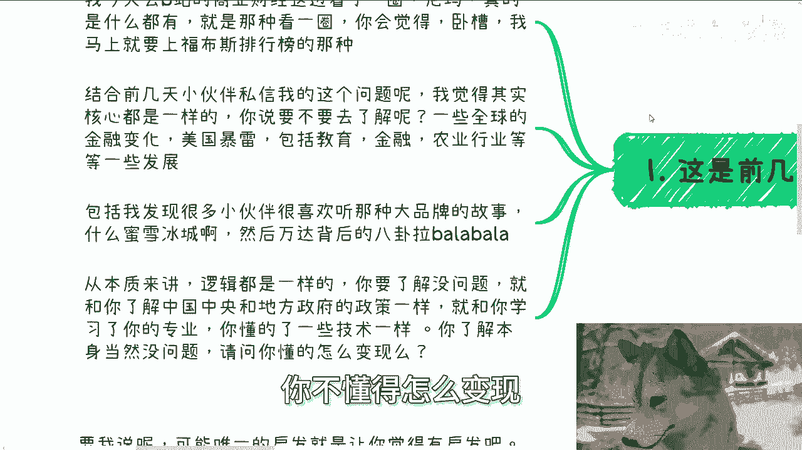
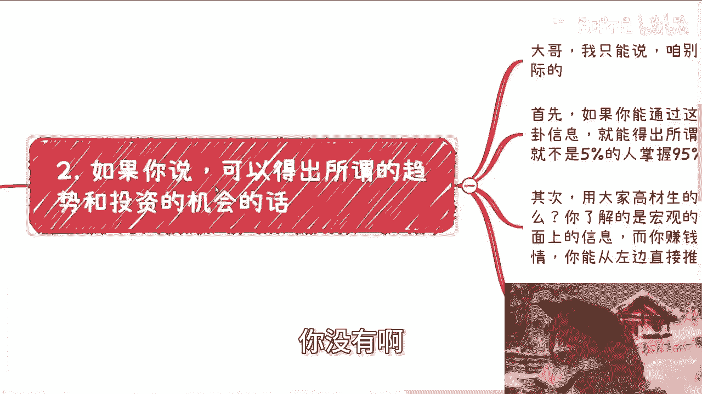
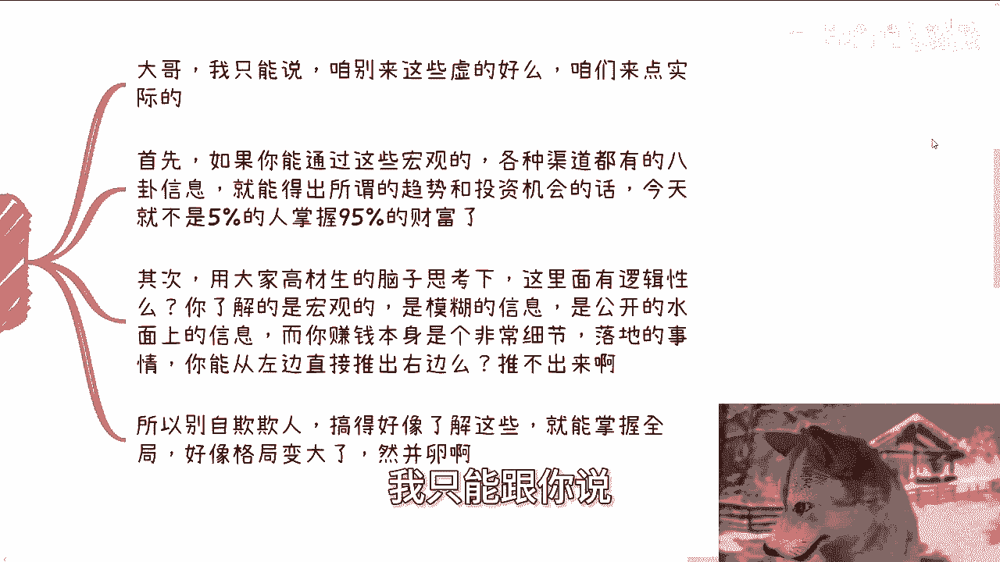
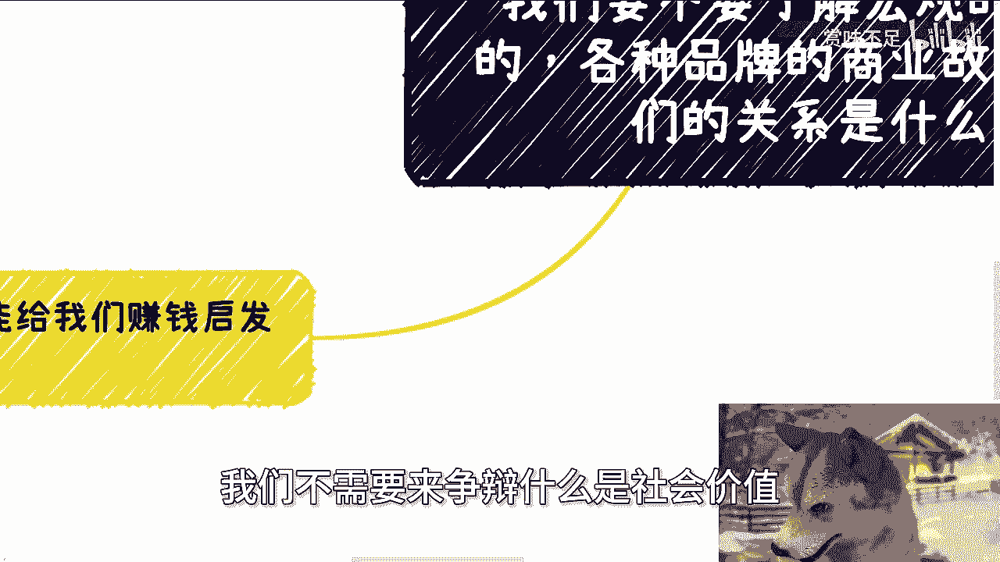
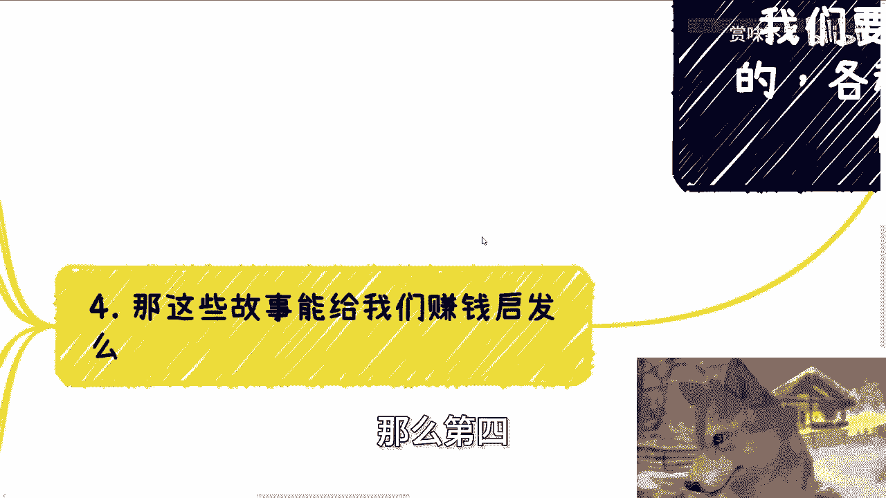

# 要不要了解宏观、全球、各种品牌的商业故事，和我们的关系是什么？ - P1 - 赏味不足 - BV1SQpceiEKA

啊大家好啊，本来这个视频应该录的很早，但今天因为这个事情，那个事情你就又拖到了这么晚啊，我本来想着妈的八九点就可以发了是吧，呃首先下期活动已经定了啊，9月8号在上海啊。

本期是2024年第二期的这个数字经济大会，好吧，详细的话呢可以见评论区额报名链接啊，然后本次呢现场也邀请了资本律师啊，还有我的一些创业的伙伴，大家过来也可以多认识认识啊。

呃今天我们这个主题呢叫做我们要不要啊，了解宏观的全球的啊，各种大品牌的商业故事啊，包括一些呃各个国家的一些趋势啊，和我们的关系有是什么对吧，那么前两天呢有小伙伴私信也问了这个问题啊。

我觉得啊也可以啊，可以说一下，我今天去B站的这个商业财经这个频道啊，我大概看了一圈啊，就我觉得真的什么都有啊，就是那种看一圈吧，你会觉得卧槽他妈的，我马上就得像上福布斯排行榜的那种感觉啊。

呃但是话又说回来，你就是我还是那种感觉，就是说虽然你可能会觉得各种各样的内容都有，但是它背后其实都是通稿呃，也不叫通稿吧，就内容其实都大差不差啊，那么结合前两天小伙伴私信我的这个问题呢。

我觉得其实核心都一样，就是你说要不要去了解呢，你包括一些全球的金融变化，美国暴雷，包括教育金融农业对吧等各种各样的发展额，基本上这些数据都是以这种数据啊，图表啊，包括就是比较宏观的啊。

呃所谓高举高打大格局的一种叙事方式啊，嗯包括我发现很多小伙伴也很喜欢听那种，大品牌的故事，包括什么蜜雪冰城啊，股民啊对吧，就其他的啊，包括什么万达背后的八卦啦等等等啊，呃我个人的态度啊是这样子。

就从本质上来讲，逻辑都是一样的，什么意思呢，就是你要了解没问题，就跟你要了解中国，中央跟地方政府的各各种政策都没问题，就跟你学习了你的专业，你要去掌握一些技术一样也都没问题，但是问题在哪。

问题是你要懂得怎么变现，对不对，就咱就这么说，你是在一个或就是就地球online游戏，你不是一个单机版游戏，你今天了解了很多东西，你觉得哎我很博学的吧，我很牛逼，那这是你的事情，你没有办法去变现。

你不懂得怎么变现。

你去看这些东西干嘛呢，我不明白干嘛呢，你自由了吗，你没有啊。

对吧啊，第二如果你说你说哎，我可以得出所谓的一些趋势跟投资的机会的话。

那我只想跟你说，大哥哦，我只能跟你说。

咱不要来这些虚的，咱来点实的好不好，首先啊，你如果能通过这些所谓的宏观的各种渠道的，这种信息上，数据上也好，八卦也好，就能得出你口中所谓的趋势跟投资机会的话，那么今天就不是5%的人，掌握95%的财富了。

明白吗啊其次用大家高材生对吧，用大家这个未来人才栋梁的脑子思考一下，这里面有逻辑性吗，哦你了解的是宏观的，是模糊的，信息是公开的，我们叫做冰山水面上的信息，而你赚钱本身是一个非常细节落地的。

一个冰山水下的信息，你能从左边直接推出右边吧，你推得出来吗，你推不出来啊，对不对，所以你不要自欺欺人，搞得好像哎呀，我了解这些就能掌握全局了，好像格局变大了。

然并卵嘛，对不对啊，第三那么我们怎么利用这些信息。

对不对，好，你说有没有用有用的，比如说你了解了很多故事，更宏观的东西，你能够很好的在各种融资路演当中讲出来，或者说在一些竞赛啊，比赛当中忽悠出来，或者说你和别人土老板聊的时候，能够忽悠住对方。

让别人投资都行啊，我觉得这就叫有用啊，是吧啊，比如说你在写招投标的计划书，或者是一些行业的年报的时候，你是可以拿出来这种所谓的宏观的假大空的，还是大品牌的故事，吸引别人，让别人来买单，可以啊。

我觉得这也叫有用啊对吧，那有的人要说了，我了解就是自我满足，我们只需要得到别人的认呃，我们只不需要别人得到别人呃。

那个或者是这么说吧，就是他说我了解就是自我满足，我们只需要得到别人的认可啊，或者我身边朋友的认可，不是说一定要需要钱来认可的，那我就告诉你，不好意思，整个社会当中，你肯定是需要有一个正反馈的结果。

对不对，而这个正反馈的结果在这个社会当中，唯一的衡量标准就是钱啊，这个结果如果你要通过别人口中得到，或者通过奖状得到，或者通过证书得到，都是虚的，为什么，因为地球不围着你转，就这么简单对吧。

也就是说你你认为的那种认可。

它不具备社会价值，它不具备商业价值，只有别人愿意掏钱了，那才代表着你拥有社会价值，对吧，嗯我们不需要，我们不需要来争辩什么是社会价值。

你明白吗，好那么第四。

那这些故事能给我们带来赚钱的启发吗，对吧，也有人问这个问题啊，那要我说啊，无可能啊，唯一的启发就是让你觉得有启发，你明白吗，因为本质上不可能有什么启发，两大原因，第一个很多故事都太老了，都是以前的事。

现在时代变化太快了，很多机会都是一瞬间的，天时地利人和，也就是我们一直所说的幸存者偏差，我们去了解可以，但本身能带给带给我们什么呢，带给不了什么东西啊对吧，第二另外一个就是很多故事都是大品牌。

大企业重资产的，和我们有什么关系呢，我早说了，我们要做的就是赚钱，就是高性价比的赚钱，又不是说啊我们一步迈的太大，扯到蛋对吧，又不是说开多大公司赚几个亿，你听这些故事除了让你爽，有那种爽文主角的感觉。

你还还有什么呢，除了让你满足你的八卦之心，还能有什么呢，对不对，我都不知道你们能从中得到什么东西，得到情绪满足没了啊，所以我才说最大的启发就是让你觉得有启发，觉得貌似自己有了进步，跨越了阶层。

巴拉巴拉没了呀，但无非都是你觉得对不对啊，所以说我在这个地方，我觉得有一个结论啊，我得我们得说一下，就是你们要记住一点，所有的历史，所有的过去他都不是照搬的，都是由当年的上下文。

当时的各种各样的情况造成的，我们可以参考，但是绝对不可能从里面得出某些结论，而甚至会说啊，我得到这些结论能够成为我们投资，或者成为我们做某些事情依据，不存在的，因为社会变化太快了，这个跟国家没关系。

整个全球变化都太快了对吧，那就像我一直说的，就是说你了解这些东西，你得把它变化出来，你得让他有叫做就是不管这些宏观的东西，全球的品牌的商业故事本身有没有价值，你要能让它变得有价值，那就是你的本事。

那你要去了解是有用的，那否则你了解他干嘛啊，我我我我我我每天看看相声不香吗，看看脱口秀不香吗，对不对，好吧啊行好，就这么着啊，然后呃大会好吧，9月8号啊，报名的话，评论区继续报名。

然后剩下的话就是呃职业规划，商业规划啊，嗯工作上面啊，副业上面啊，股权股份啊，融资啊，估值啊等各种各样的东西啊，你们要是觉得呃，这个希望通过跟我的一些沟通啊，能够给你们一些更接地气的建议或者规划。

同时让你们少走点弯路的话，那么你们可以整理好对应的问题和个人背景，好吧。