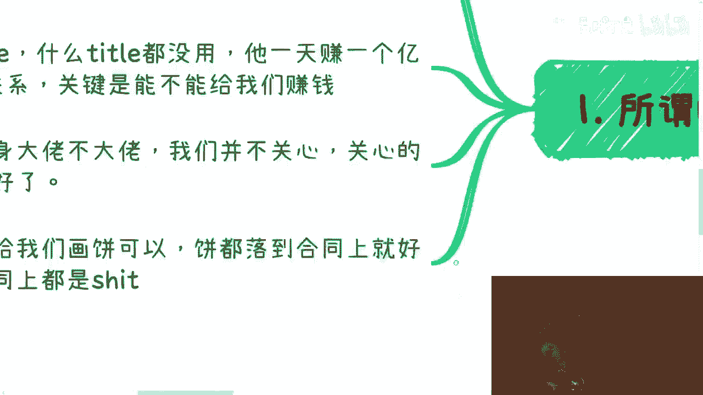
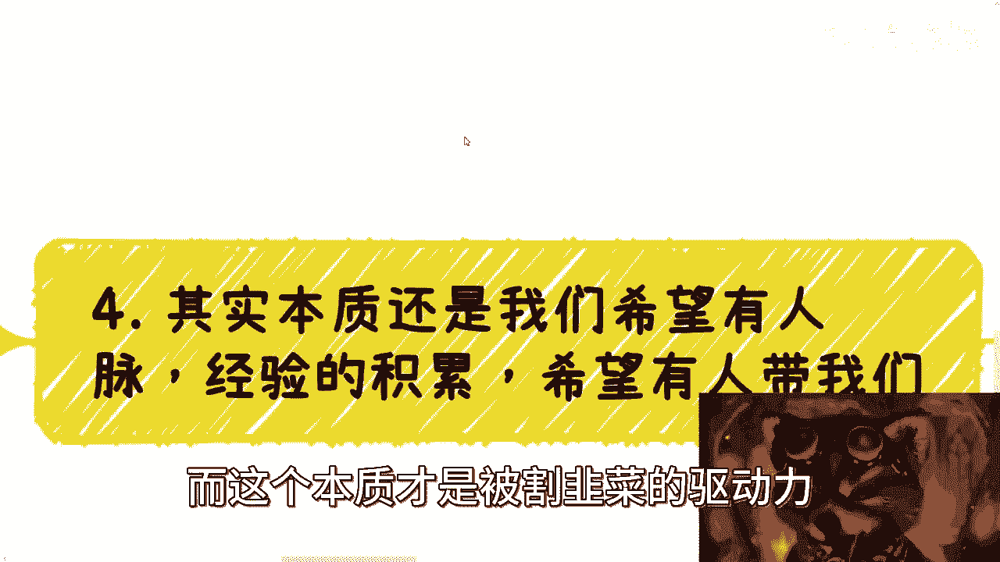
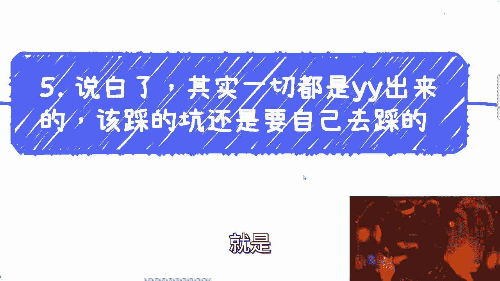
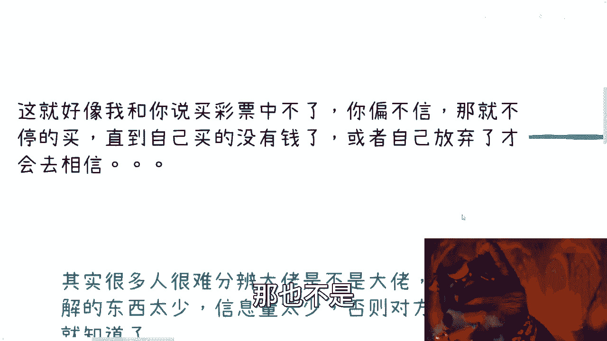
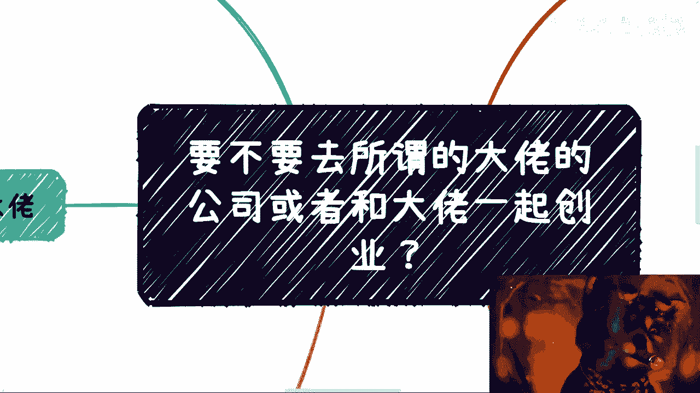

# 要不要去所谓的大佬公司或者和大佬一起创业？ - P1 - 赏味不足 - BV1c8411m7RV

哈喽大家好，这个昨天的直播实在是很不开心，嘿嘿是吧啊，我不行就叛逆，我就我就还是想用这个小小熊猫，然后就换个背景是吧啊，说正事啊，就是其实很多小伙伴啊，他面临也有会有这么一个问题啊，他就说我毕业了对吧。

或者做一段做了一段时间工作，他说我要不要这个跟所谓的大佬啊，去所谓的大佬的公司或者跟大佬一起创业，嗯而且呢这种机会其实蛮多的，但是呢这个当中还是那句话，就是我可以这么说，我虽然不能一棒子打死。

但是我就说你们眼中的大佬，99。99%对我来讲都是垃圾，而且另外一方面就是说，这个垃圾主要体现在两部分，第一部分是呃他是不是大佬，我不关心，反正他不可能给你，或者也不可能给我带来钱对吧。

那我觉得这第一个那他妈就是垃圾对吧，那第二就是说我觉得呃，大部分的应届生或者大部分的学生能碰到大佬，也基本上也都是装的啊，也没什么真材实料，所以基本上呢是这么个情况啊，当然这个问题呢。

我觉得我为什么会拿出来说一下呢，因为嗯我会给大家就细分说一下啊，就说归说啊，大家信不信是大家的事。

而且我个人是觉得大部分人可能也不信，非要就是那种这个撞到南墙啊，撞一下才愿意。

这也正常啊，首先我们来看啊，所谓的大佬是不是大佬对吧。

很多人很难分辨这个大佬是不是，主要原因是呢了解的东西太少，就信息量太少，因为你想嘛你要是懂得多对吧，你对于很多东西很了解对吧，那否则那个对方其实一吹逼你也就知道了对吧，包括就是说你说我们打个比方啊。

比如说你们今天啊这个也都做过了政，政府的一些东西，做过了企业一些东西啊，做过了一些招投标，做过一些其他东西，那我但凡对吧，这个吹逼啊，那你们可能一下子就听出来了啊，这个陈老师压根就没做过对吧啊。

那这是一种，那不要去看title啊，要什么title都没有用，而且另外一方面他一天赚几个亿，赚赚赚几千万，跟我们也没关系，因为关键是什么呢，他能不能给我们赚钱对吧，关键是他的一些资源。

他愿不愿意拿出来分享对吧，这个是核心，而且title这个东西啊，我得在这个地方说一下啊，就是我们一直说对吧，这个中国有这个叫什么文字上的艺术对吧，你会发现很多时候呢你看上去好像很牛逼。

但是他那种title呢确实很不正规，或者来说呢有非常多的擦边的嫌疑对吧，所以说呢就是就是很多这种title，你去看它没有用啊，没什么好看的，而且就像我说的，由于大家这个认知比较少嘛对吧，了解比较少嘛。

那可能对于很多东西啊也没办法分辨真假对吧，那这个是第二个，第三个呢就是说本质上呢，我觉得那是不是大佬呢，我觉得根本就不重要，你说他今天title是一个开头都没有对吧，还是说打出来四五张纸。

四五张纸的这种title跟我们没有关系啊对吧，我觉得我们核心点就是关心我们自己就好了，你就想什么意思呢，就是说你说我今天去跟大佬，去大佬公司打工对吧，或者跟大佬一起创业，有没有问题，没有问题啊。

我觉得没有问题，有问题的是什么，有问题的，是你跟大佬的公司或者这个合作没有去，就是谈明白你能得到什么对吧，我跟你讲这个事情，很多人是这样子的，他就跟那种追星是一样的，你知道吗，哎就觉得哎呀。

我好我我我去这个大佬公司工作了，我老牛逼了对吧，我能跟他合作，我老牛逼了啊，就跟那些追星的时候，哎我我追个星，我去见他一面，我就觉得好老牛逼了，但问题是没有用啊对吧，就你要是个恋爱脑，那你就去对吧。

你要觉得我就是想赚钱的，那没有必要被这种有的没的，这个怎么说呢，浪费时间嘛对吧，我早就跟你们说过，我的三观，我的三观就是我不管你是谁对吧，我毕业时候就这样子的，你一个教我，我跟你们这么说吧。

我毕业的时候那些教授呃什么上什么课对吧，我在下面就是参加一些活动嘛，然后在下面听听的呢，就感觉就说哎呀你除了纸上纸上谈兵，根本没有任何实践的，然后我就指着他们鼻子骂我，不管对不对，我管你是谁啊。

我又不关心他，对不对啊，所以呢我觉得大佬给我们画饼可以，你饼画呗对吧，但是你饼画了，有本事落到合同上了，你不落到合同上都是，对不对，那你有什么好换的是吧。

所以我觉得核心是什么呢，就是你说要不要去或者怎么样，这随意啊，你爱去就去，不爱去拉倒对吧，但是不管这个你只要去了，你得保障自己的利益啊，你不能说因为他是大佬，他就能压榨你，这没有因果关系的嘛，对不对啊。

那么我们一个来说啊，那么你说你要去了对吧，那么这个时候呢你首先要告诉你自己，你觉得他是大佬，你已经输了啊，因为你觉得他你他是朋友，你也输了对吧，因为本质上来讲，你对大佬，我对大佬来讲都是个工具人。

你知道吗，就包括就是说本身，我们都是有这种上下层级关系的，或者说都有这种就落差的，那么你自己如果这么觉得，那么你就是工具人啊，那么工具人就是随时可替换的。

你为什么觉得你不可替换的，没有道理的，对不对啊，那么来说要不要去。

我跟你讲，这个要看你要什么呀，如果你说你要吃他的大饼，那你就去对吧，吃不吃得到，你就你自己负责对吧，你也别后悔对吧，如果你说你想过去攀关系的，我跟你讲，那你就算了，为什么，因为本质上来讲。

你真的去了这种公司，你会发现你是忙成狗的，你以前所有的计划，所有的规划你根本没有空去搞的，你知道吗，因为你但凡去了这种，你成为上下级之后，所谓的大佬只会帮你把你往死里压榨，这就是所谓的大佬，很简单的啊。

无论之前谈的多么好，无论之前多么和蔼可亲，我跟你讲一定是这样子的，没办法，商业就是这个样子对吧，那你过去判关系，我昨天直播的时候我也说了，我说我说你要这么想的对吧，你能力好，那么市场上总有能力比你好。

你跪舔的好，那市场上总有人跪舔的比你好的对吧，那你关系好，职场上总有人关系比较好的对吧，你关系再好再好，那那你还比不过他亲戚对吧，就是说你一层一层往上套，你总归是有可能性套不过别人对吧。

那么你说你是攀关系，那你有什么自信攀得上，这是什么关系呢，对不对，就是就算这个大佬有真材实料，有真的关系，那跟你有什么关系呢，对不对啊，那么同样的你说哎呀，我跟这个大佬以前认识的对吧，我不去。

好像对不起人家对吧，好像我就怕这个关系破裂了对吧，我就问了，你跟他有什么关系，所有的关系其实都是你YY出来的，可能对方就不care啊，对方认识人这么多，在哪里跟你想的这样子呢对吧，那你就对吧。

你你说哎我觉得我跟他是关系很好的，是个朋友关系，谁认可啊对吧，如果你想就是维护关系的，我觉得最好的方式就是你别去，为什么，因为距离产生美，朦胧产生美对吧，就大家还能相互合作，大家还有一定的这个叫什么。

就是呃想象空间对吧，你一旦去打工了，我跟你讲，那关系就不是进步，而是退步以及质变，什么意思呢，你一旦去打工了，我不管啊，你是一个管理者还是一个打工人对吧，你跟他一定就是个上下级关系。

我不管这当中存隔几层，反正就是上下级关系，那你以后其实永远都是一种上下级关系，我就跟你说，你你没办法的，你明白吗，就是最好就是大家要有一个评级的商业合作，而不是说你去打工啊，所以说呢就是说有一种情况呢。

我是很推荐大家去的是什么呢，你吃可以啊，你想好相互利用嘛，对不对，那比如说那比如说他是大佬，没问题啊，那你去啊，那么你利用你在大佬公司的身份出去社交，你就说哎我在某某人公司啊，我靠我现在跟他共事。

你又拿他出去社交啊，拿他出去打牌啊，拿他出去积累啊，他要不愿意，那还做什么东西不要做了，这说明他根本就不尊重你，对不对，就这么简单啊，然后出去谈成任何case，你要跟他谈好对吧，在合同里面说好。

你说哎通过我这边拿到的啊，我要提成，我不管我是不是销售，我反正要提成对吧，因为我去的又不是什么大公司对吧，我既然愿意跟大佬一起做对吧，愿意做这种小公司，那我就要灵活一点，我不但要我的package。

我还要我的package，加加加加加，这个提成这么低了呢，对不对，他好意思拒绝你吗，那按照你这个逻辑，哎呀大家都是熟人，大家都认识的，哎呀这个大佬会拒绝你吗，不会的呀，那他但凡拒绝你。

那是你说的朋友们呢，也不是呀，对不对，不就这么回事吗，啊但凡你要好好进去工作的，那我就跟你讲了，去哪不是去啊，哪哪都是大佬啊，你进你进个，你进个什么什么C叉团队也都是大佬对吧。

何必去你一个跟你所谓熟悉的那个大佬那边的，没有意义的，你知道吧，因为因为我发现很多小伙伴在私信里面，会跟我说，他说哎我这边有个朋友啊，他很牛逼的对吧，怎么样怎么样怎么样，就是就是我啊。

就是我这么跟你讲吧，你觉得他很牛逼，或者他是大佬没问题，我觉得你要让他证明出来对吧，不是说说没有用的，对不了，你说你你怎么牛逼呢，你是以前做过什么事情，还是说是是是是啊，什么公司的股东。

还是说是有什么什么证书，有什么东西证明你要有证明的呀，对不对，不上来，我发现所有人跟我描述都是模棱两可的，就是哎呀我们这个这个某某某对吧，做做什么电竞的某某某，做体育的某某做什么，那是什么关系呢。

对不了啊。

你比如说跟体育总局是什么关系对吧，跟魏魏魏建伟是什么关系对吧，你要有关系，直接说出来的，他不能是一种很朦胧的东西啊，对不对啊。

然后呢你要说大佬对吧，我跟你讲啊，就是哪怕你们我因为我现在受众，我就说啊，大部分可能18岁到22岁的对吧。

我就说你们现在就算18岁，只要你想，你现在就可以成为大佬，不有什么难度呢，对不对啊，咱们就这么说，很多正规的啊正经的含金量很高的东西，你要弄你的确很难啊，你不要说你应届生，你可能到28岁。

你要弄到也很难，但是很多微商啊活动啊，title其实都是自创的，你去看你知道吗，就一般我们有两种比较合适的方式，比如说啊到一些小公司啊，或者你朋友的公司，你去挂一些title，挂顾问啊，挂咨询啊。

挂经理啊都可以啊，你想你想怎么挂怎么挂的，对吧，那有什么难度呢，对吧，那我觉得这是第一个，第二个是什么呢，嗯就是还有一种就是自己自创的，就比如说什么，你说你说我今天唱了一个什么群英会对吧。

啊叫什么叉叉会对吧，各种会，那你穿呗，你你你我说直白一点，你创业之后会是有公司对应呢，还是有人背书呢，还是有里面有多少人呢，你在跟我介绍的时候，你觉得我会知道吗，啊或者我会去深究嘛，啊你跟我说哎。

我现在是什么什么某某某会的创始人对吧，哎呀怎么样怎么样，一一套操作猛如虎，然后操作完了，你说我来问你，哎我说那个那个会县有多少人啊对吧，那你跟我说哎200人2000人2万人怎么滴来啊。

我我我我还去考验考证一下，不可能的呀，你说对不对啊，那这样你岂不是也可以多一个或者多N个，创始人的抬头吗，那谁知道你是什么东西，这玩意儿是个什么玩意儿呢，对不对啊，至于项目或者历史经验这种东西。

更没有人去考证啊，啊说白了就是什么，你骗我，你骗就是真正的人家做过商业东西的人，的确骗不了，但你骗骗应届生还是很容易的对吧，你让那些你让这些人啊给你打打工对吧，或者让你白嫖白嫖，那不是很容易的嘛对吧。

那你不就是他们眼中大佬了吗，对不对，没区别的啊。

那这个是然后第四个呢，我觉得本质是什么呢，本质就是我们所有的人啊，就是老百姓都希望有人脉。

有经验的积累，都希望有人带我们，这个其实才是最终的本质，而这个本质才是被割韭菜的驱动力。

你知道吗，那你比如说其实这个想法每个人都有对吧，很正常啊，包括我早年蹭项目也是这个逻辑对吧，但经过了很多的肯，说白了啊，就是那咱就这么说，说白了我们所有想的东西，也仅仅仅仅限在我们所想没有用的。

你知道吗，就一个就是说我们蹭可以，但是呢你千万别入职，你就以合作的形式去做，因为入职之后你的所有性质都变了啊，我还是那句话，不管多牛逼的大佬，不管多和蔼可亲的大佬，不管多跟你关系多好的大佬。

你录制之后一切的东西都只会变啊，那么另外一个就是说真的就是真的你做了积累，你是真的做这个积累不了啥，因为为什么，因为你从大佬的角度，就像我们刚刚说的非亲非故对吧，关系也不是最铁的。

那人家为啥会给你核心的资源，更何况这个人是不是大佬，你也不知道，对不对啊，如果你真的要学习，你比如说啊大家说我要去学习项目谈判啊，项目沟通啊，项目怎么执行的，怎么跑的啊对吧，你以合作形式就可以了呀。

对不对，就是今天打个比方，有一个很很大的项目，你切了里面的很小的一部分，但是你正因为切了很小一部分，你可以跟这些人认识，对不对，那么你就厚脸皮，你就跟他们说，你说哎你们下次这个谈项目的时候啊。

这个项目跟客户见面的时候啊，或者说跟客户吃饭的时候，你叫我一起对吧啊，钱我可以自己A对吧，或者怎么样啊，我想对项目多了解了解也可以呀，对不对，你一切都是从浅到深的啊，但是你别指望说啊，这个谁谁谁啊。

你以后谈项目，我跟你一起去对吧，或者怎么样子，这种不太可能的啊，你要么就是说以以合作者，以合作事去做是可以的啊，那么我们话又说回来啊。

就是说说白了啊，其实一切都是我们自己YY出来的，因为大部分的人啊在毕业前也好，毕业后也好，其实对整个东西不了解，就像我说的，就是说对对方的title啊对吧，对项目执行啊。

对项目的里面的一些细节啊是一概不知的，包括合同是一概不知的，就说白了别人说什么是什么啊，然后你们又觉得他是个大佬，所以你们会有会有所谓的滤镜，会有所谓的光环，但没有用，你知道吗，就是就是你该踩的坑。

其实还是自己会去踩，就包括我现在跟你们讲的，其实大部分人其实讲的也没有用啊，这就好像我跟你说，你买彩票中不了，你偏不信，那你就不停的买啊，直到自己买了没有钱了，或者自己这个实在是自己也感觉啊。

我肯定中不了，那才会去相信，其实大部分人是这样子的对吧，所以说呢就是就是他没有办法判断啊，而且呢就怎么说呢，就是嗯这种东西都是辩证的，因为你不能说只有正规的，比如说什么啊。

高校里面或者政府单位里面出来才算大佬对吧，你说他这个在一些下沉市场对吧，用用一些非常野路的方式赚了很多钱，你说他不是大佬嘛，那也不是对吧。

所以说只不过呢就是说每个人啊，他都有自己的一套叫做商业模式。

商业的这个赚钱的方式，但是他对于我们来讲，是不是就像我们刚刚说的不重要，重要的是它到底能给我们带来什么，而这些东西能不能落到合同上，对不对，所以说这个我觉得是最大关键点啊，你就像你就像回头打个比方对吧。

你跟我说啊，驴老师我们合作数字经济可以的呀，对不对，那然后你就跟我说，哎驴老师啊，下次你去给政府上课时候带我一起去对吧，我说啊好的好，然后等我下次去了，我就一个人去，我不带你去，怎么滴了呢，对不了。

就很多时候就是很多时候事情都是这样子的啊，所以说呢就是你得你得一开始就说好，而且呢说好就是说你说哎，那我们得要落在合同上都要或者或者怎么样子，就不是说你较真，你知道吗。

而是说这种东西商业层面就是得较真的，就是一白纸黑字落在那边的，否则就是搞得人家好像跟你开玩笑一样的，不是的呀，就而且你要明白啊，就是你一定要自己去认真，你别指望别人认真，你知道吗。

就是你自己是怎么样的定位，你得自己摆正，你指望别人帮你摆正，那是不可能的呀，对不了啊，呃我顺便这边提一点，就像我们前两天我跟一个小伙伴谈，那个升职加薪的事情是一样的，我说你有很多东西对吧，你想升职。

你想加薪，你就去谈，而且你要谈呢，你得做好方案，你告诉老板，为什么你想升职加薪，你升职加薪之后对公司有什么好处，有什么帮助，你有什么方案，有什么未来的计划，你得全部列出来对吧，但是这个事你得提啊。

哦你说我不提，我就等老板哪天开窍，老老老老板哪天老板哪天如果开窍来给你加薪，那我估计这公司就离倒闭也不远了，你知道吗，所以都一样的道理啊，所有事情自己去摆正位置，自己去要你想要的东西。

不要就是一上来就是那种啊，哇这个人牛逼啊，这个人怎么样啊，我要跟他合作啊，怎么样子，然后自己要什么呢啊一律不管没有用的啊，真的没有用，好吧嗯行。

那就这么着吧啊，然后大家反正有什么啊资源啊，有什么牌的或者有什么想法的啊，包括未来的职业规划啊，有什么呃比较迷茫的地方啊，或者来说比较，就完全不清楚自己怎么走的啊，那么你就整理好。

最好是比较详细的问题介绍，就问题的list，然后背景介绍，然后所在城市啊，然后自己的一些兴趣爱好等等等，反正都详细一点啊，然后你可以私信我，我们可以约个时间来做咨询。

