# 要不要去所谓的大佬公司或者和大佬一起创业----P1---赏味不足---BV1c8411m7RV_n

在本节课中，我们将探讨一个常见的职业选择问题：是否应该加入所谓“大佬”的公司或与其共同创业。我们将分析“大佬”的真实性、合作的核心利益，并提供清晰的决策框架，帮助你保护自身权益，做出明智选择。

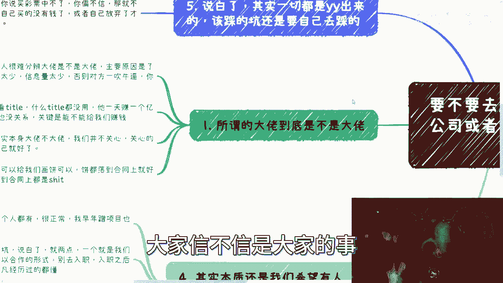

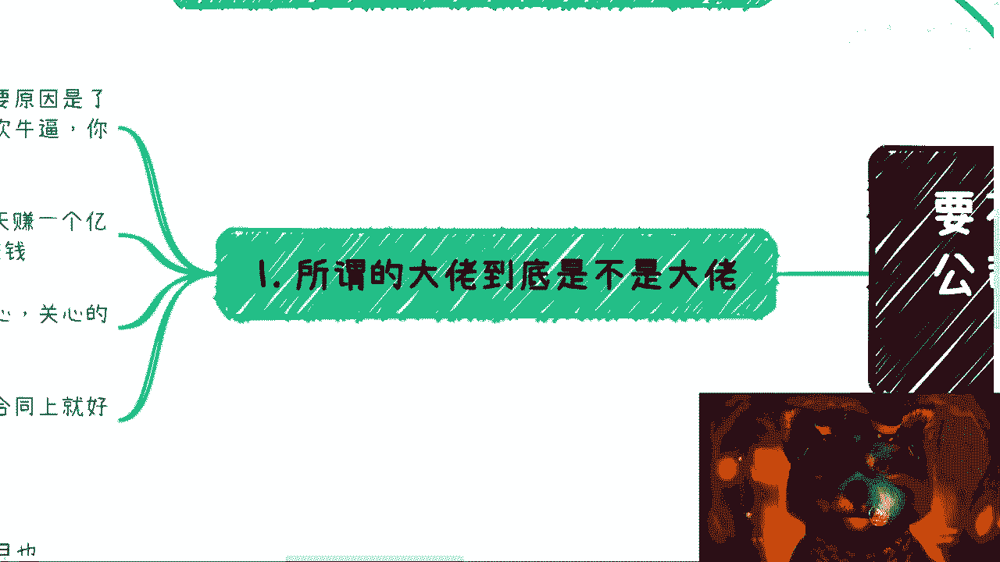

---

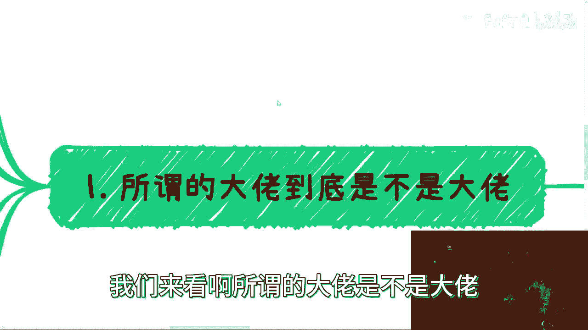

## 如何辨别“大佬”的真伪？🔍

上一节我们提出了核心问题，本节中我们来看看如何判断你遇到的“大佬”是否名副其实。许多人难以分辨，主要原因在于自身信息量不足，了解的东西太少。

以下是几个关键的辨别要点：

*   **不要迷信Title**：头衔本身没有意义。中国的文字艺术可能导致头衔听起来很厉害，但可能并不正规或存在擦边嫌疑。对方一天赚多少钱也与你无关。
*   **考察实质内容**：由于认知有限，你可能无法分辨对方言论的真假。关键在于，他过去的成就、资源或关系是否有**具体、可验证的证明**，而不是模糊的描述。
*   **核心在于“你能得到什么”**：他是不是大佬根本不重要。重要的是，他能否给你带来实际利益（如金钱、资源），以及是否愿意分享这些利益。这需要**落实到合同上**。

---

## 是否应该加入？权衡利弊的天平⚖️

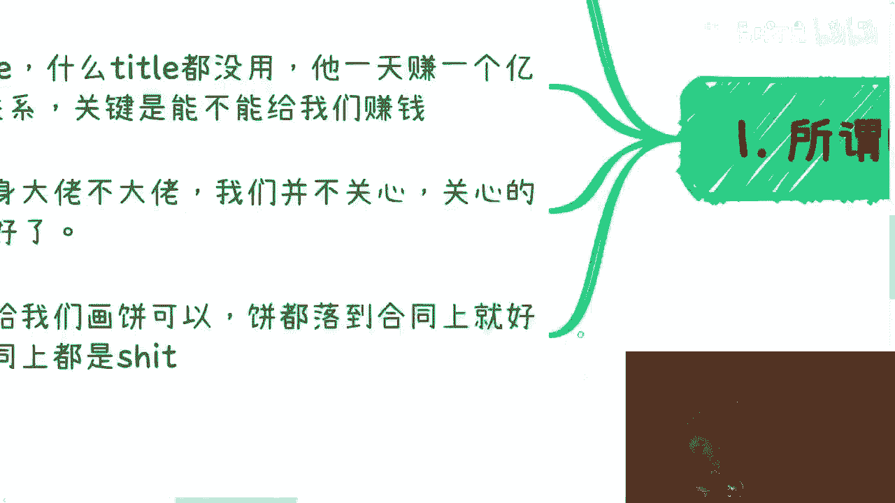

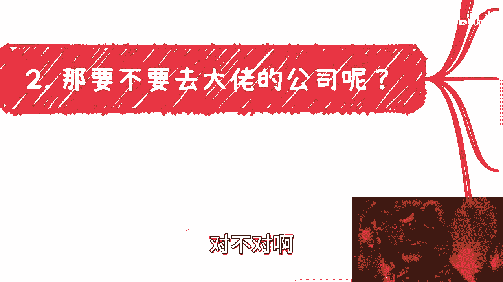

上一节我们介绍了如何辨别大佬，本节中我们来看看是否应该加入其公司或项目。这个决定完全取决于你想要什么。

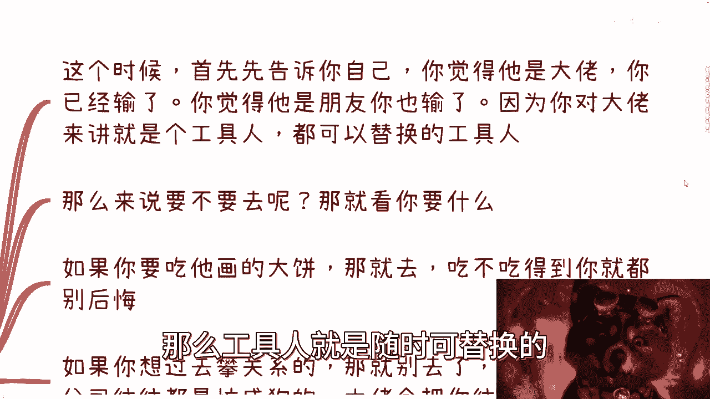

以下是几种常见动机及其分析：

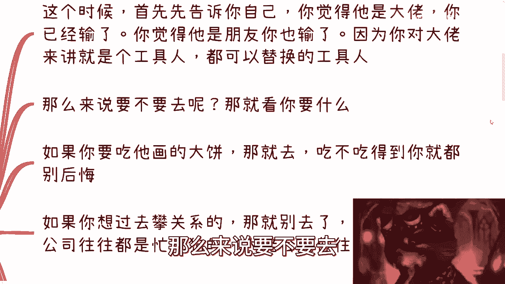

*   **动机一：想吃“大饼”**。你可以去，但能否吃到要自己负责，不要后悔。画饼可以，但必须有本事把承诺**落到合同上**。
*   **动机二：想去“攀关系”**。这很难成功。一旦成为上下级，你只会被压榨得很忙，无暇经营关系。市场上永远有比你能力更强、更会跪舔、关系更硬的人。真正的“关系”往往是你一厢情愿的想象。
*   **动机三：怕不去会破坏关系**。最好的维护关系的方式是**保持距离，以平等身份进行商业合作**。一旦入职，关系就会质变为上下级，很难再回到平等的合作状态。

---

## 如果决定加入，如何保障自身利益？🛡️

上一节我们分析了不同动机的利弊，如果你经过权衡仍决定加入，本节将告诉你如何最大限度地保障自己的利益。核心思路是：进行一场**相互利用**的公平合作。

以下是保障利益的具体行动清单：

*   **利用身份进行外部社交**：你可以利用“在某某大佬公司工作”的身份出去积累人脉、谈合作。如果对方连这个都不允许，说明他根本不尊重你。
*   **明确谈好利益分配**：任何通过你带来的业务或资源，都必须在合同中明确你的**提成或收益**。既然选择加入小公司或创业项目，就要追求灵活和更高的回报。
*   **摆正自己的位置**：不要有“追星”心态。在商业关系中，你们是合作者。你需要主动争取和明确自己应得的部分，不要指望对方主动为你考虑。公式可以概括为：**你的收益 = 明确写入合同的条款**。

---

## “大佬”Title的制造与幻觉🏭

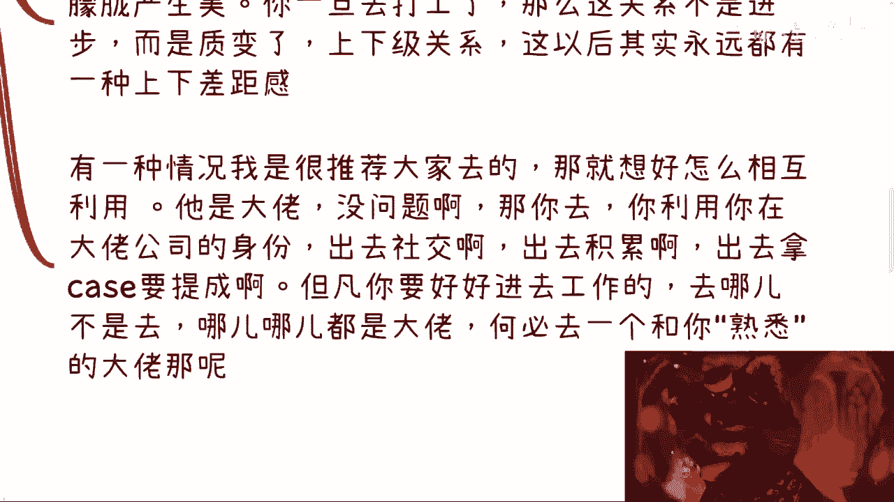

上一节我们探讨了如何保障利益，本节中我们来解构“大佬”Title本身，你会发现它可能并没有那么神秘和高不可攀。许多你仰望的“大佬”，其Title可能也是制造出来的。

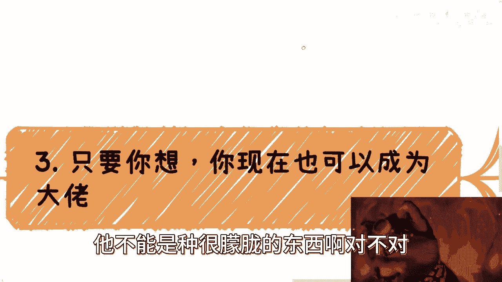

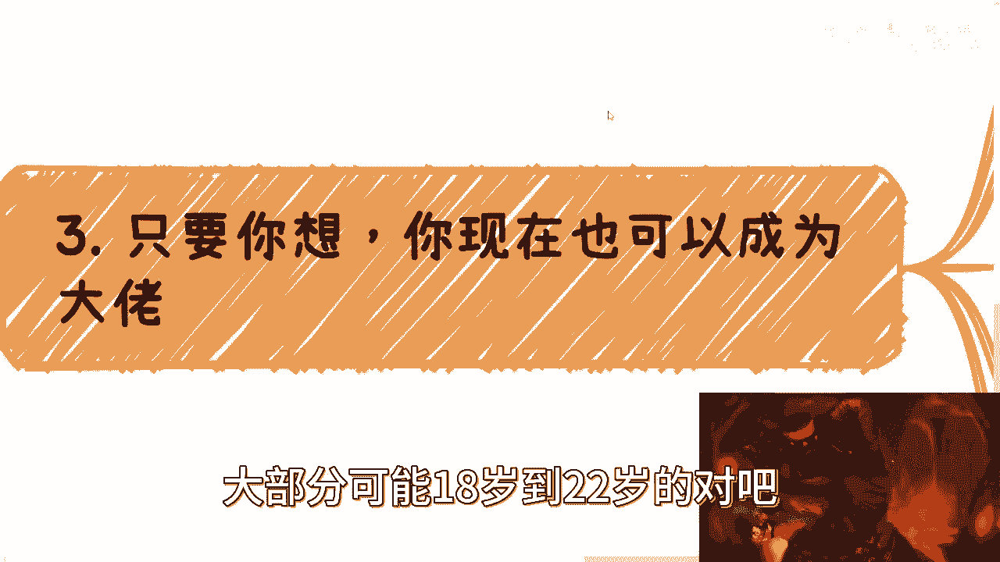

以下是两种常见的“Title制造”方式：

*   **挂靠小公司或朋友公司**：你可以轻易地在一些小公司挂上“顾问”、“咨询”、“经理”等头衔。这几乎没有难度。
*   **自创组织或头衔**：例如，创建一个“XX精英会”并自封创始人。只要描述得煞有介事，很少有人会去深究其真实成员数量或影响力。`（代码示例：你的Title = “自创组织名” + “创始人”）`

这些方式很容易骗到信息不对称的应届生或新手，从而让你成为他们眼中的“大佬”。因此，不要被华丽的Title唬住。

---

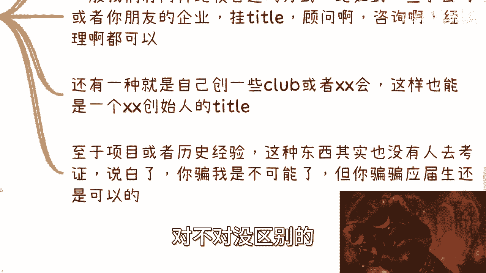

## 问题的本质与正确“蹭经验”方式🎯

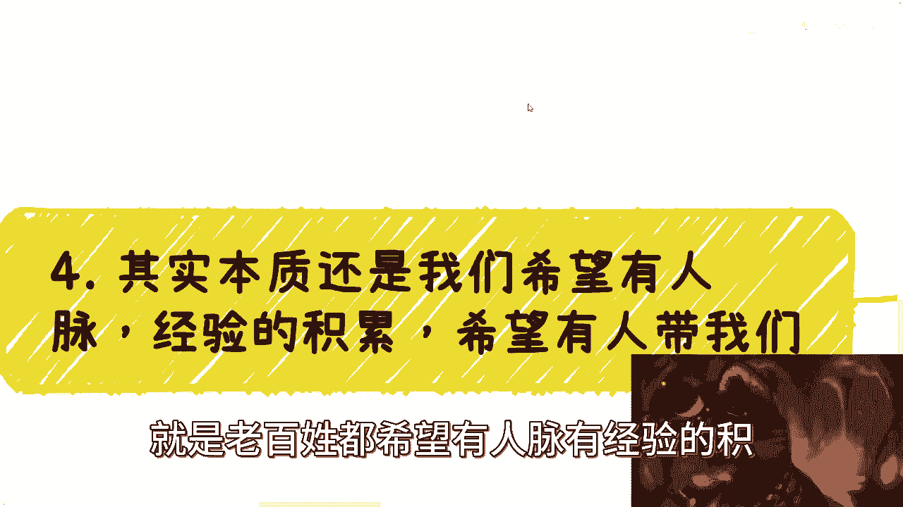

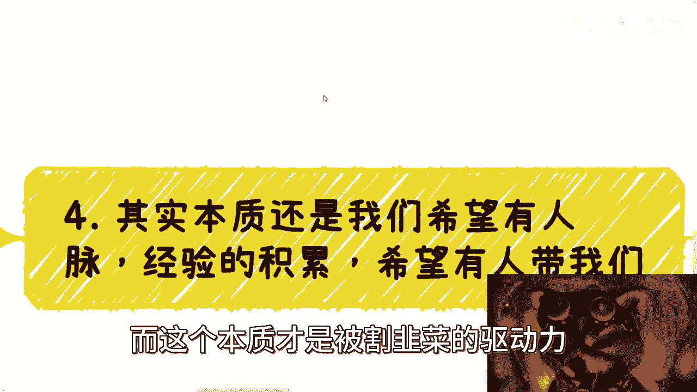

上一节我们揭示了Title的幻觉，本节我们来探讨这种选择背后的本质驱动力，以及更优的替代方案。我们渴望人脉、经验和有人带领，这是正常的，但也最容易被利用。

问题的本质是：**我们都希望积累人脉和经验，害怕错过机会，这种焦虑成为了被割韭菜的驱动力。**

与其冒险入职，不如考虑以下更安全有效的“蹭经验”方式：

*   **以合作者身份参与**：通过承接大项目中的一小部分，以合作方而非雇员的形式介入。这样可以保持平等的地位。
*   **主动请求学习机会**：在合作基础上，厚着脸皮请求旁听项目会议、客户谈判或饭局，并主动承担自己的费用（如餐费A）。`（行动公式：你的学习机会 = 主动提出请求 + 承担相应成本）`
*   **一切从浅入深**：不要指望一步登天，直接接触核心。通过具体的合作点滴积累信任和见识。

记住，入职意味着关系性质的彻底改变，而合作则能更好地保护你的独立性和利益。

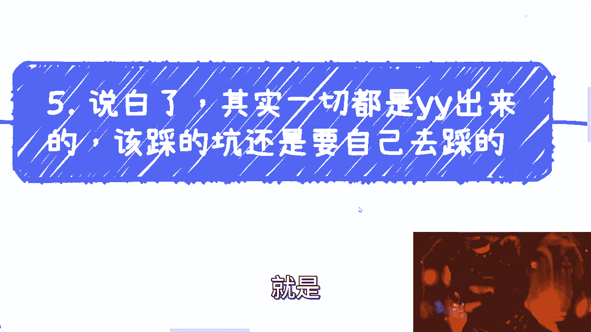

---

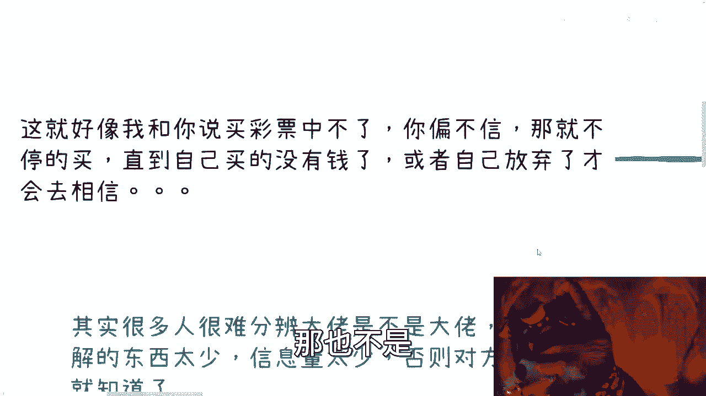

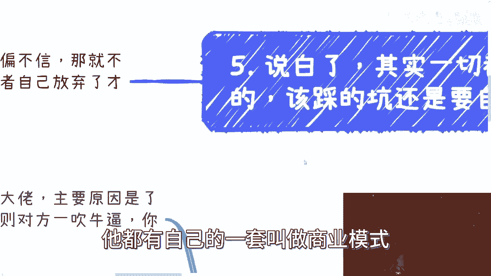

## 总结与行动指南📝

本节课中，我们一起学习了关于是否加入“大佬”公司或项目的全面分析。核心观点总结如下：

1.  **“大佬”光环多属幻觉**：不要被Title和模糊的吹嘘所迷惑，关注**可验证的实质**和**你能得到的实际利益**。
2.  **决策取决于你的目标**：想清楚你是去“吃饼”、“攀关系”还是“怕伤感情”。除了第一种（且需合同保障），其他动机成功率很低且副作用大。
3.  **保障利益是底线**：如果决定加入，必须将**收益分配、资源使用权限等关键条款明确写入合同**。利用其平台为自己积累资源。
4.  **平等合作优于上下级雇佣**：以合作者身份参与项目，是更安全、更能保护关系且能有效学习的方式。
5.  **主动摆正位置**：在商业世界中，要自己主动争取和明确权益，不要寄希望于对方的良心或觉悟。

最终，一切商业关系的基石是**白纸黑字的合同**和**清晰的利益交换**。放下对“大佬”的滤镜，以务实、自我保护的心态去评估每一个机会，你才能做出最有利于自己职业发展的选择。

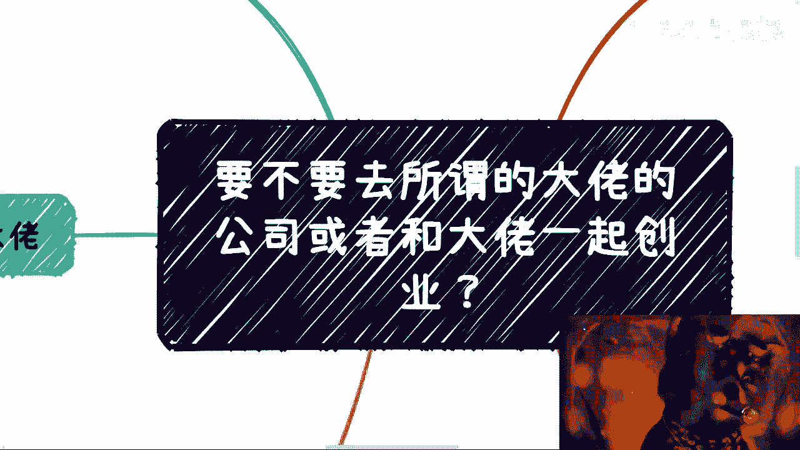

---

如果你有具体的职业规划问题、资源对接需求，或对未来发展感到迷茫，可以整理好详细的问题列表、个人背景介绍、所在城市、兴趣爱好等信息，通过私信与我预约咨询时间。