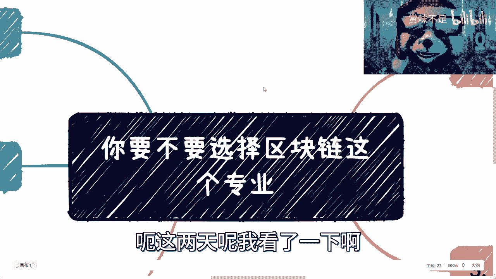
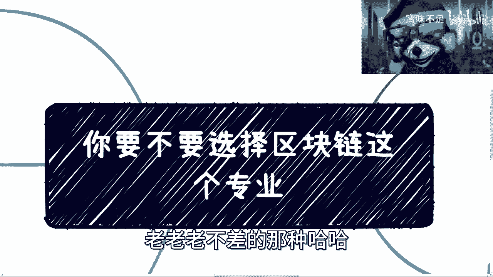
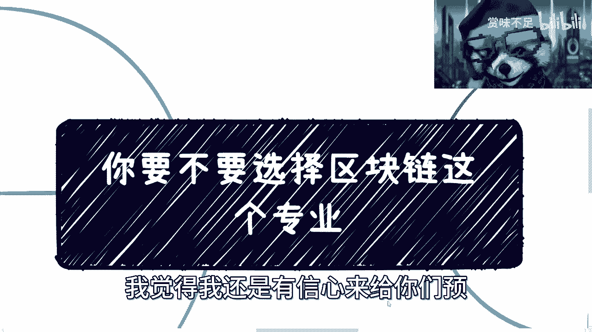
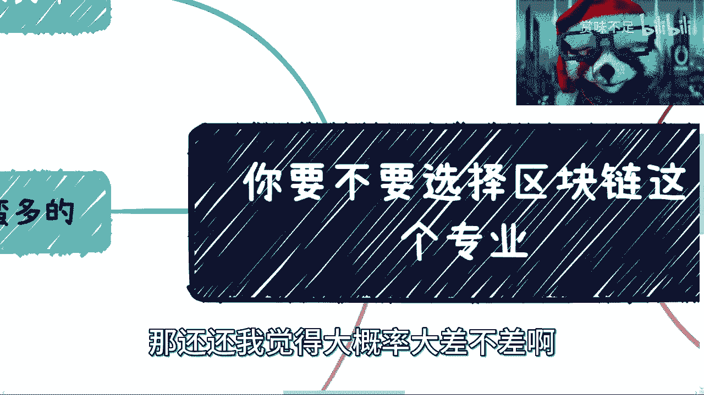
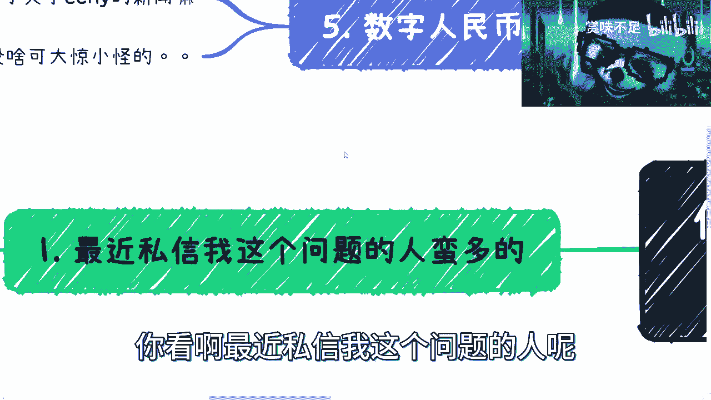
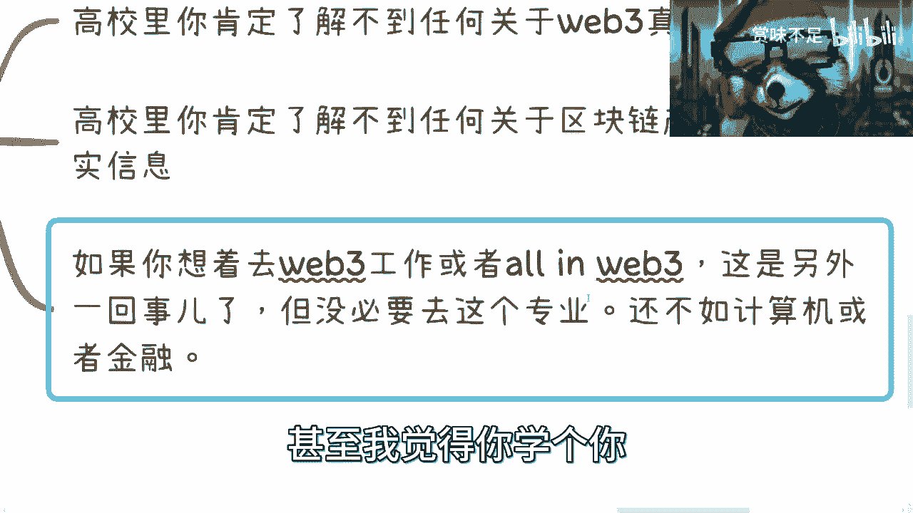
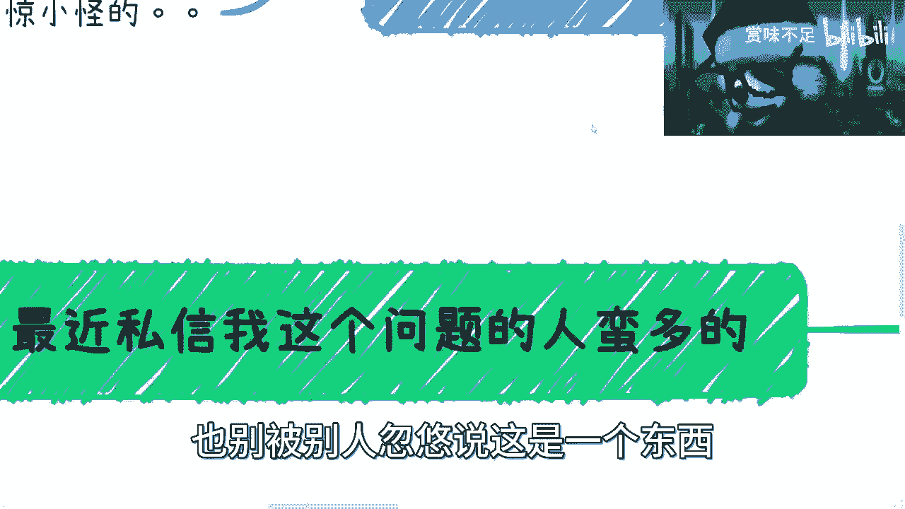

# 要不要选区块链这个专业---P1---赏味不足---BV1WV4y1o7BX

在本节课中，我们将分析选择“区块链”作为大学专业的前景与风险。我们将基于行业现状、未来四年发展趋势以及就业市场情况，为你提供清晰的判断依据。

---

## 概述：当前的专业选择误区

最近，许多面临选专业的同学提出了关于区块链专业的问题。这里存在一些普遍的误区。本节将首先给出核心结论。

**核心结论**：对于大多数人，**不赞同**选择区块链专业。无论是为了学习知识，还是为了未来找工作，这个选择的风险都极高。

---

## 第一部分：未来四年的行业趋势预测 🔮

上一节我们给出了核心结论，本节中我们来看看支撑这个结论的第一个事实依据：未来四年的行业发展趋势。

我认为未来四年，国内区块链行业的发展路径是清晰可预测的。

1.  **行业推进方向**：国内行业将继续由**寡头企业**主导，推进**联盟链**技术。他们会进行开源、开发跨链协议，并推动与实体产业的结合。
    *   **公式/业务方向**：`区块链 + 产业`，例如农业、金融、医疗等领域。目前主要以**数据**和**资产**的数字化应用为主。

2.  **发展周期判断**：从国家制定方向，到技术下沉至各省市、产业，再到汇报成果，这个周期至少需要2-3年。考虑到新技术迭代和资源分配，整个进程拉长到4年是比较合理的。因此，4年内行业格局不会有颠覆性改变。

---

## 第二部分：教育与培训的现状 🏫

了解了行业趋势后，我们来看看与之相关的教育和培训领域将如何变化。

未来的区块链教育将呈现新的特点，不会以独立的专业形式突出。

1.  **教育模式转变**：区块链教育将**融入各行各业**，而不再作为独立的、以区块链为主体的专业进行培训。技术落地会成为各行业培训的一部分。
2.  **标准制定**：各地方、团体、国家及国际层面会陆续推出相关标准。这些标准很可能不是单纯的“区块链标准”，而是与各行业结合的“技术赋能”标准。
3.  **高校专业现状**：高校的“区块链专业”在4年内大概率仍是**拼凑型专业**，课程内容相对于快速发展的产业会**严重滞后**。学生需要补充的知识领域（如计算机、通信、金融）非常多且复杂。
    *   **核心判断**：`99%` 的学生在学完四年后，仍然不会真正理解区块链产业。

---

## 第三部分：区块链、Web3与高校信息的割裂 🌐

上一节我们讨论了教育的局限性，本节重点在于澄清一个关键概念：你在学校能学到的，与真实世界是脱节的。

必须明确：**区块链（国内产业）、Web3（全球概念）、互联网3.0** 是三个不同的东西。高校教育无法提供其中任何一个领域的真实信息。

以下是具体分析：

1.  **信息真实性**：你在高校里了解不到关于Web3的真实信息，也了解不到国内区块链产业的真实情况。你看到的信息，只是被允许传播的信息。
2.  **专业与目标错位**：如果你的目标是进入Web3领域或All in Web3，那么选择区块链专业是**完全错误**的。这个专业与Web3几乎没有关系。
    *   **更优选择**：学习**计算机科学**、**金融**，甚至**法律**，都比选择区块链专业更有用。

---

## 第四部分：四年后的就业市场分析 💼

明确了概念和教育的局限后，我们面临最现实的问题：毕业后的工作在哪里？

基于区块链作为“数字经济基础建设”的定位，可以清晰地预测4年后的就业市场。

1.  **岗位来源误区**：许多同学选择新专业，是认为会有“全民创业”浪潮，从而产生大量公司和岗位。这种想法在未来的经济环境下**不可能实现**。
2.  **岗位数量逻辑**：没有大量新公司，就不会开设大量新岗位。作为基础设施，其相关岗位将是集中且有限的，无法容纳大规模毕业生。
3.  **最终结论**：4年后，区块链专业毕业生将面临**极难找到对口工作**的局面。如果届时出现该专业毕业生“供不应求”的情况，那将是极小概率事件。

---

## 第五部分：关于热点新闻的理性看待 📰

我们常常被新闻热点影响判断，例如“数字人民币发工资”这类消息。对此应有清醒认识。

以下是看待此类新闻的正确方式：

1.  **新闻的滞后性**：新闻爆出时，该项目往往已进行多年，并非刚刚启动。
2.  **信息的片面性**：你第一次看到，不代表它是第一次发生。
3.  **与个人的关联性**：这类基础设施的推进，与普通人的直接关联很小。思考“如何切入”为时过早，更需要的是长期铺垫和积累。

当前的经济下行趋势尚未见底。普通人能够为未来做准备、积累资源的“窗口期”可能只有两三年。

---

## 总结与最终建议 ✅

本节课我们一起学习了区块链专业的现状与未来。我们来总结一下核心观点和最终建议。

**核心复盘**：
*   行业趋势可预测，4年内是渐进式发展，非爆发式增长。
*   高校教育严重滞后，且与真实的区块链产业、Web3领域割裂。
*   就业市场岗位有限，无法支撑大规模毕业生。
*   对待热点新闻需理性，关注长期积累而非短期切入。

**最终建议**：
如果你仍然坚持选择或已经选择了这个专业，必须遵循以下路径：
1.  **放弃幻想**：彻底放弃“混四年文凭就能找到好工作”的幻想。
2.  **主动深入行业**：从大一开始，就必须主动接触真实行业，建立人脉，了解实际需求。
3.  **明确个人定位**：尽早思考并尝试自己的方向，是做技术服务、咨询、解决方案还是其他，并为之积累技能和经验。
4.  **把握窗口期**：认识到当前是为数不多的准备期，积极行动，否则机会来临时将无法抓住。

未来的机会属于那些能**独立获取信息、深入行业、并提前做好准备的极少数人**，而非仅仅拥有一纸文凭的毕业生。