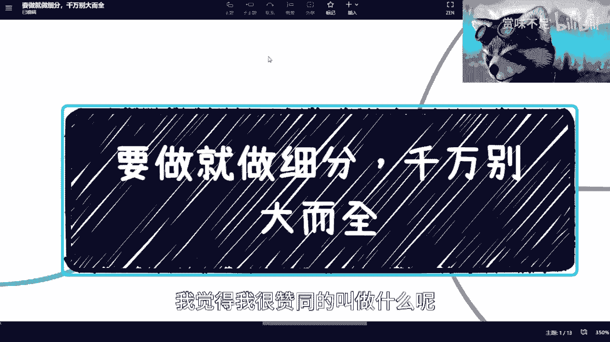
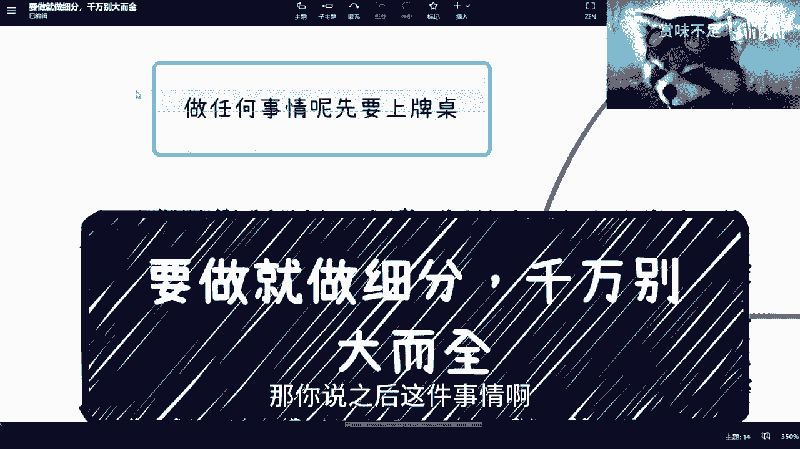
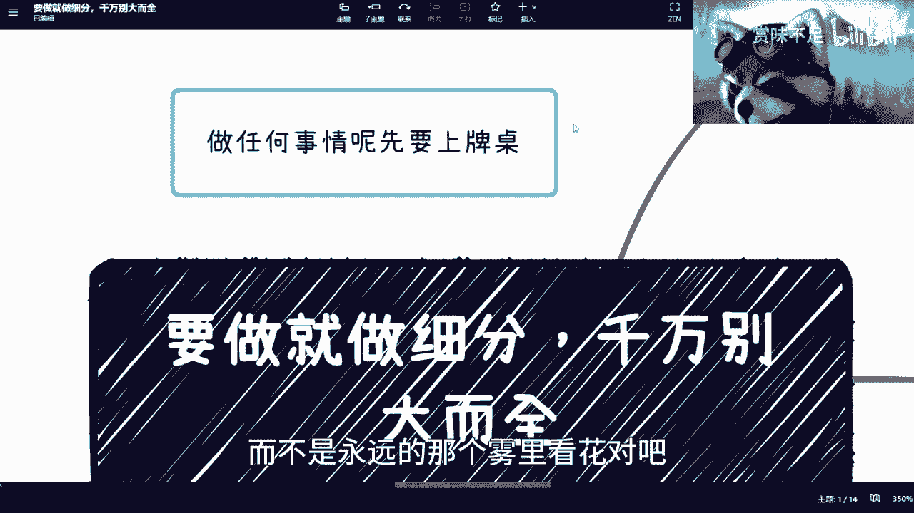
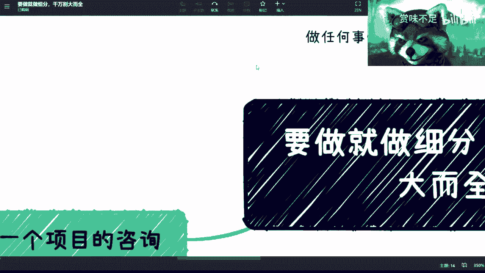
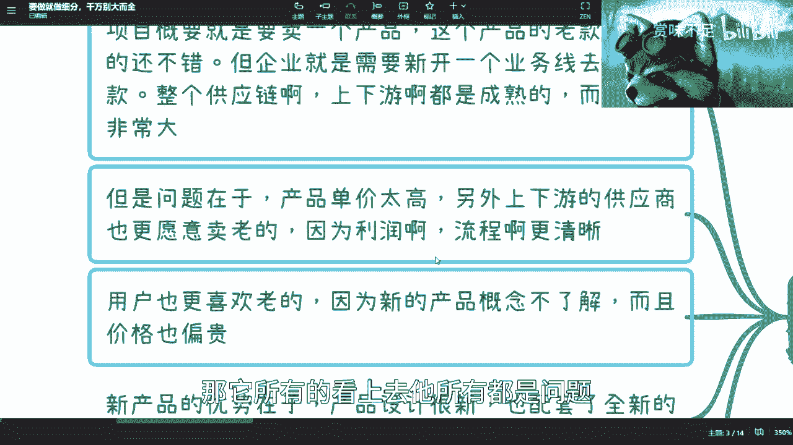
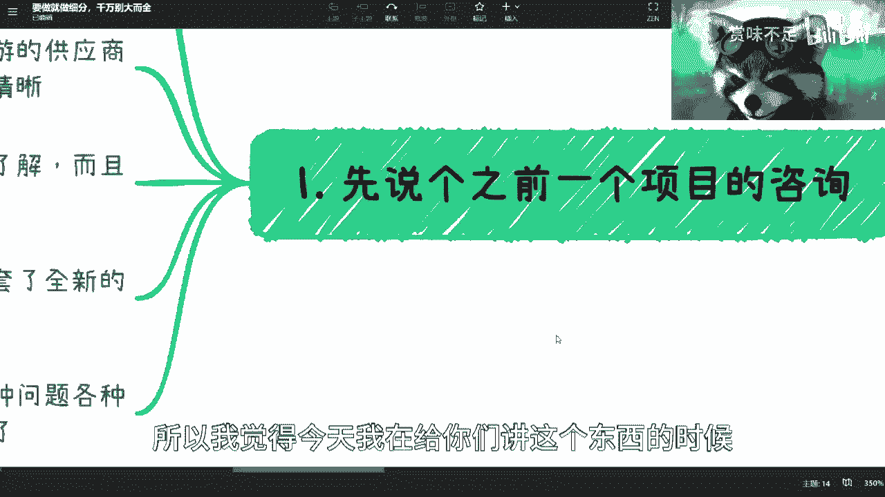
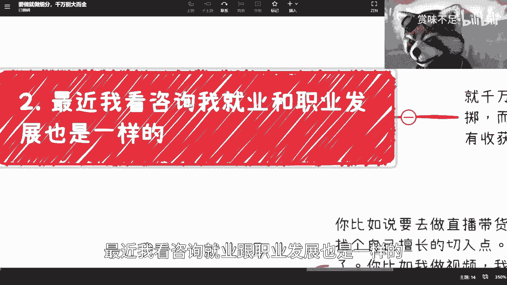
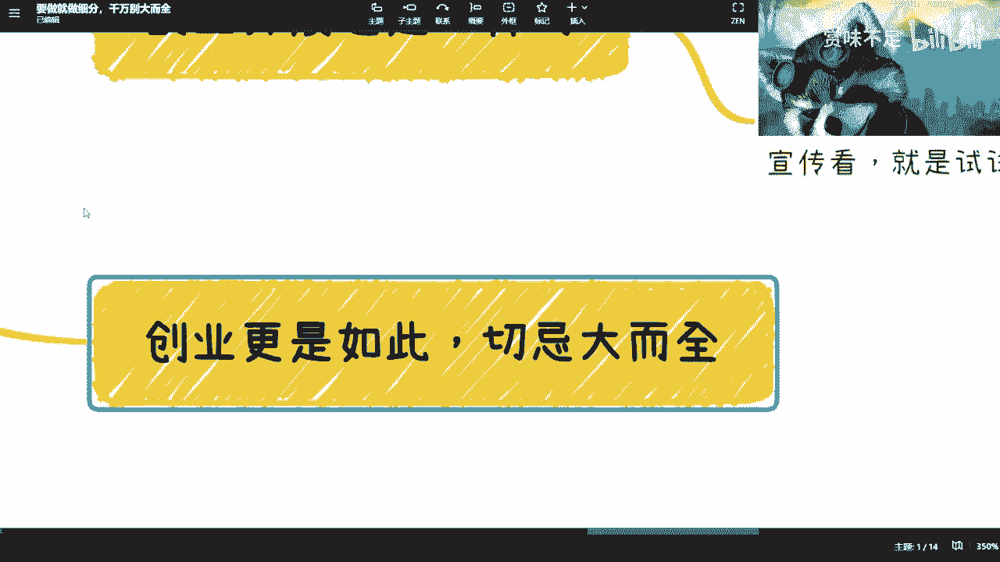

# 要做就做细分千万别大而全 - P1 - 赏味不足 - BV16o4y1H7s3

本质上是什么意思呢，本质上就是说你就是我知道对吧，就所有的事情，比如说你很想赚钱对吧，你很想找到一份工作，你很想怎么样怎么样，但是呢你不能去，就是说活在楚门的世界里面对吧。

也就是说你今天想要达到这个目标没有问题啊，但是你得你得，你得就是说遵循这个世界的发展规律对吧，你不能说哦，我今天就想去月球对吧，我不管我今天反正就是想去，那肯定是做不了的对吧。

所以说呢我跟你们说啊，你做所有的东西，你千万几千万千万记住就是什么呢。

就是你不能既要又要对吧，你也不能就说我我做任何东西呢，我就一下子要吃成个胖子对吧，因为因为我们客观点讲，你们也好，我也好，大家没有这个能力，就是是吧，那我说实话，比如说在我刚毕业的时候。

我还是通过了一些。

比如说啊这个这个你说活动也好啊，或者咨询也好，培训也好啊，包括我自己却能在外面闯也好，我还是吃过一定的红利的对吧，就说直白点，我是赚到过钱的，但是相对你们来讲，你们现在是很困难的，这点我有一说一啊。

我要是你们我在我在你们这个时间里毕业。

我觉得对吧，我我可能也只能躺平了对吧，那我跟你们说啊，就本质上是什么呢，就是要做呢，你们一定要去找一个细分领域，找一个切入点，不管这个切入点再再小，你知道吧，包括前两周。

就是有一些小伙伴跟我谈创业的时候，也是就是就是你把所有的事情想的很清楚，没有用，你知道吧，就一呢你别觉得你想的很清楚，你很牛逼，你是很牛逼，但没有用，你知道吗，就是就是你展现出了很强的能力，但是没有用。

你明白吧，就没有用的结论，这什么意思呢，就是你赚不到钱，而且而且你想的这些东西呢，可能跟事实差距比较大对吧，第二点呢，就是说你也别觉得做一个很细分的东西，好像还很low或者很怎么样，其实不是你。

你不用考虑这么多，因为你要的是什么呢，就是我跟你们说啊，那个罗老师对吧，就罗永浩啊，罗老师之前讲过一句话呢。

我觉得我很赞同的叫做什么呢，叫做叫做哎我我在这里分享给你们，叫做做任何事情啊，先要上牌桌对吧。

什么叫先要上牌桌呢，其实很简单对吧，你你我给你们举个例子。

这就好像啊，其实这2年也有很多人吧，就是跟我说啊，陈老师啊，我们这个呃比如说你出去做咨询对吧，你到政府这边做培训对吧，你怎么样怎么样，他说我们可以跟你一起去吧对吧，我们也不要钱对吧，就免费去对吧。

其实我知道他们什么意思，就是很简单嘛，就是说你要的是我的这份关系，你要的是我的这份做事情的流程的，一个一个一个整体的一个框架对吧，就是说你要学习的其实并不是说这一次我去，比如说某个政府对吧。

他给你多少钱，并不是，而是说他们想要学习的是整个的一个流程啊，整个的一个模式，那么这个呢就是我们说的他要先上牌桌，至于你说赚不赚钱，并不知道，因为什么叫上牌桌，上牌桌的意思就是说你已经在这个领域里面了。

然后这个领域的风吹草动，你都是知道的，你也会比一般的人，大部分的小伙伴能够先看到商机，那当然你说能不能把握这个商机，咱就不去说他，但是你能够比大部分的人能够看得早啊，看得远，那么这样子的话。

你就已经上牌桌了。

那你说之后这件事情啊，你说我能不能赚钱，我到底找哪个切入点，我那个怎么样，其实这是后话，这个你得看天时地利人和，对不对，但是现在其实按我了解的就是，大部分的小伙伴呢其实都是没有上牌桌的。

就不管你们做任何的东西，你们都是没有上牌桌的啊，一定要明白这一点，就是你们那当然了，就是说你们也千万别觉得好像啊，我做什么事情上牌桌，我跟你们讲啊，你们一定是要两只手。

两只脚全身心的投入到某一个细分领域，你们才可能上排除，而且投入进去之后呢，你们一定要去就是做一些事情啊，我们我们那个最简单的例子来讲，就比如说你今天要去这个摆摊对吧，你说我要做个什么煎饼摊对吧。

或者这个什么凉粉摊对吧，好，你去做了很多工作，你去做了很多对比，你去做了很多的攻克，但是你始终没有摆出第一个弹，那如果说你没有摆出第一个弹的情况下，你其实就是没有上牌桌的对吧，就当你摆出几个碳。

你去赚到了第一份钱，不管接下来做的好不好，你才算上了排除啊，那么这个时候呢就是说你上了牌桌之后，你就会发现很多的新的事情，比如说什么呢，比如说你摆摊了之后，有有是不是会有城管呢对吧。

会不会有有什么潜规则啊对吧，大家是怎么做的对吧，你才会去了解更多东西，而不是永远的那个雾里看花对吧。

所以其实这个点是最重要的。

那么你看啊，我之前咨询过一个项目，我跟你们分享一下，是这样子的，这个项目概要呢就是要卖一个产品，这个产品呢它其实我这么这么跟你讲，因为敏感信息对吧，我不能把品牌告诉你们，这个产品呢我跟你们讲。

全球都很牛逼啊，老款难卖的很好，但企业呢就是需要新开一个业务线，去卖它的新款，他呢自己都有整个供应链啊，当然包括也也也有可能是他的这个合作方，都有整个供应链上下游呢都很成熟，而且企业很牛逼啊。

那么你们想想看看，你们很多人可能会觉得卧槽他妈的，我要是有这么一个牛逼的企业，我早就起飞了是吧，但其实并不尽然，为什么呢，因为他们在推新产品的时候发现了很多问题，什么问题呢。

就是他们的新产品呢单价可能过高，而且上下游供应商也更愿意卖老的，为什么呢，因为老的利润啊，流程啊更清晰，大家也更了解，包括一些话术啊对吧，营销的手段啊，也就更更知道，所以说从品牌角度来讲呢。

他想推一个新的东西很难啊，嗯第三呢就是说从用户角度呢，也更喜欢老的对吧，因为新的产品概念不了解，而且价格也偏贵，就是这个时候你们就会发现，哪怕是一家如此牛逼的企业，他们想要去推一个新的东西。

其实也很难啊，而且也很难，那还有一个呢就是说它新的产品优势在于，那产品设计很新啊，配套了全新的这个教学课程和那个售后服务啊，也没毛病，这个时候呢你就会发现有个点是什么呢。

就是这个项目方跟我直接说是两个小时，说了两个小时之后呢，就是把所有他们能想到的问题，能想到解决方案全部说了一遍，我其实就很懵，你知道吗，因为你让我在这个你一直在说的情况下面对吧，就是而且是这种现象。

在面对面的两个小时，你要不停的说，我还要去理解你对吧，我还要去就说就说帮你去归类，我还得去想你到底问题在什么地方，我跟你们说这个事情就很像面试，就是什么呢，就是我在做这种咨询，或者这个叫什么培训的时候。

我就不停的要去告诉我自己，就是你千万不能给被对方带偏，因为你看这个项目方就是的，他就是说他会把各种各样他们能想得到，比如说他们可能不能有四五十人，他们把四五十人头脑风暴的结果对吧。

就是他们能想到所有的问题跟我讲，然后把他们所有能想到解决问题，而解决方案也跟我讲，那这个时候就说我没有办法的，就是就是我无可避免的去，必须要去接受他的信息对吧，因为我不接受他的信息。

我是没法给他去做这个咨询的，但是我接受他的咨询那个信息的时候呢，我就很尴尬，因为我很容易被他们的所有的问题，跟所有的解决方案带偏，因为我但凡去follow他的问题，或者去follow他的解决方案。

那么其实对他们来讲，他找我干嘛呢，对吧哦，我找你来对吧，我付你钱，你跟我说嗯，这个解决方案不错，但他们有卵用啊是吧，所以说呢就是而且你要这么想，他们既然会找我来，意味着什么，意味着他们对现在所有的问题。

跟所有的解决方案肯定不满意啊，但凡有一个反应，他都找我来干嘛的，对不对，所以说呢这个时候就是我跟你们讲，就是你所有所有的事情啊，你们在沟通的时候就是一定要记住，不能被对方带跑对吧，所以我跟你们讲。

最终我跟他们是这么说的，我说我想了半天哦，我觉得你们的问题跟解决方案，其实本质上都没有问题，但是你们的这个最大的问题是在于，我认为啊，我说你们最大的问题是在于切入点，整个一开始切入点就不对，为什么。

因为他们的受众为什么会面临这么多问题，为什么会面临这么多解决方式，因为他们的受众是整个用户面，就比如说他们用户在全球可能有，比如说11用户，但这个用户他们希望，他们希望这个产品售卖的用户是整个面。

那这个事情就是你既要又要啊对吧，那当然你企业大对吧，你家大业大，你要既要又要也没问题，但是你现在推一个新的产品线，他要的是什么，他要的是突破，他要的是今年的销售额，他要的是kpi对吧。

他不会跟你来来来扯什么啊，你到底面也好点也好，我不关心对企业，只关心的是销售额对吧，那么这个时候呢我就跟他们说，我说我说在我的认知里面，我认为你们这件事情如果要做，只有你首先要改变一个点是什么呢。

就是我说既然里面的东西对吧，价格单品高，设计新，而且你们老款又是全球知名的对吧，再加上还有全新的教学课程和售后服务，那其实本质上你们要的什么，你们相当于是为了就是你们的受众，比如说孩子啊，父母啊对吧。

老人啊对吧，那我说这个时候你会发现你从这个点切入，你其实这些问题和解决方案就没有了，你根本就不需要这些问题，也不需要这些这些方案，因为你但凡针对高净直径，就比如说做了一定的包装对吧，做了一定的营销。

那其实你所你的单价，你所有的劣势其实跟你的受众是完全match的，就是完全匹配的，那你的劣势也就不存在了，你就没有必要再去为你的劣势，再去为你的这些这个问题再去苦恼了对吧，同样的你看这个地方。

你说呃上下游供应商更愿意卖老的，利润流程更清晰，没问题啊，那你就去卖老的，如果要去买，跟老家就不冲突对吧，而且你老的利润流程你还是怎么走，该怎么走怎么走，你新的你就直接去找一些这个针对性的用户。

再去做一定的这个那个叫什么分润比例啊，或者流程，那不就好了嘛，对吧，你所有问题都不是问题，但是你会发现他一开始只要把问，把这个面切入点切的不准。

那它所有都看上去，他所有都是问题，你们明白这个点了，所以我觉得今天我在给你们讲这个东西的时候。

我突然就想到这个案例，大概是去年吧。

疫情的时候，我大概下半年给别人做的，第二呢我跟你们说啊，最近我看咨询就业跟职业发展也是一样的。

就是还是那句话，就是你们千万不要所有的东西都要，就是我跟你们说去切一个点的时候，并不是说你们要去赌博对吧，有很多人觉得啊这个就是孤注一掷对吧，就是赌赌了，但是呢其实你从任何一个角度来讲。

你活着每一天不就是在赌嘛对吧，你你每天在纠结说，我到底要不要从细节角度切入这个点切入进去，我的优缺点是什么，那个节点切入进去，我的优缺点是什么，那你永远不要切啊对吧，但是咱不说你切入哪个点的有没有问题。

但是我们都知道一点，你切一个面肯定切不动的，你随便怎么切都切不动，你也切不动，我也切不动对吧，所以说呢你会发现，就是说你必须找到一个细小的点扎进去了对吧，就我跟你说了，你整个人沉进去了，你才会有收获。

你否则一开始谁能切得动对吧，你不要说我们了，你随便去找找自己，找阿里，他们要去找一个新的业务线，他也是先从点开始切的，那里有从面开始切的，没有的，你知道吧，我跟你们讲副业也是一样的。

你比如说你说我们举个例子，你比如说你说你要去做直播带货对吧，那你可以先做直播，你也可以先做带货，你不能跟我说，你一上来就直播带货，对不对，第二就是说你直播也得找个擅长的切入点，吧对吧，而且我跟你们说。

千万不要硬着，就是很多人就是说哎我觉得这个行业也好啊，这个东西赚钱对吧，这个东西干嘛对吧，你你他就去硬找，你知道吧，就是虽然你好像呃也也不是说不会不会做，但是你并不是特别擅长这种就别做了。

我跟你们讲这种做不长的，你就比如说我我去做视频，你们去看好了，我早就说了，我说我属于全网对吧，这个成本最低，我就负责扯淡对吧，我也我也不剪辑了，你们看到没有，我就加个字幕，连字幕都都不修改对吧。

我我我我也不会对吧，我非要去学别人花里胡哨干嘛呢，你说我学不会吗，我靠就以我的这个做咨询培训的学习能力，我能学不会吗，但我去学它干嘛呢对吧，因为这我不擅长的，就是我今天逼我直接去学了，学了两三天。

学了一周啊，觉得这个视频好像做的有点东西啊，然后呢我能坚持1年吗，我能坚持2年吗，不可能我跟你们明说，我不可能，你们也不可能，你知道吗，就是说本质上你们要去发挥你们的长处，而不是去把你们的短板。

或者把你们不擅长的东西硬要去放大，这个不不合适啊，然后你说带货带货也是一样的，你一开始可以不做直播带货，而是说你比如说打个比方，你比如说用快团团或者拼多多，你直接开个品对吧，你开个屏。

然后你通过你已经有的资源去宣传看看，去试试市场，你比如说你开个快团团去拼多多去开个屏，你一个月之后打个比方，你卖出去了1000分，那我觉得你对于这个品的掌握是有一定这个bug，就一定感觉的对吧。

你说你开了半个月，一个人都没有，那你去开个毛直播带货对吧，你不要开直播带货了，你看什么带货都没用对吧，你到月球，月球上开都没用，你知道吗，就是这个东西，就是说你需要有一个很小的切入点，先去试试场。

创业我跟你讲更是如此，就是呃，你们会听到有很多人跟你们吹的天花乱坠啊，就是啊我们这个什么前无古人，后无来者对吧，我们要打败谁谁谁谁谁，然后我们现在有很多很多东西，我跟你们说，很多东西是这样子的。

很多东西呢它是有一定的框框和前提条件的，很多人给你们吹或者自大，是因为它对于整个框框并不了解，你知道吗，就好像今天你去做任何一个行业，任何一个细分领域，你都会发现。

为什么你就你会发现很多事情可能不是很合理，或者没有人做，为什么没有人做，他是真的是没有人想到，还是技术不能实现，往往都不是，他可能是因为用户依赖，用户其实没有需求，这个需求是你yy出来的。

二呢可能是因为法律法规的框架它不允许对吧，三呢就是说很有可能比如说行业里面有，就是的的确有人做，但是呢他比较垄断，你可能不知道对吧，他可能可能可能有人做，你只是不知道，所以说呢就是很多时候你去切一个面。

你连点可能都可能都很难想清楚，你去切一个面更不可能啊，而且你也你你你就像之前有人咨询我的时候，他打算打个比方，打算投入三五十万，我说你这个点就你想出来的这个方案，不是三五十万，你后面再加两个零。

你可能都不够，你知道吧，所以说呢就是就是你去做一件事情的时候，你把后面所有细节想全了没有用，因为我说不好听点，就是你没有这个能力去想圈，我也没有，你也没这个预知未来的方式去把它想全，我也没有。

所以为什么你一定要去想这么全呢，没有意义啊对吧，你还不如说你就先切一个点，能保证这个点能不能就先去验证，这个点能不能赚钱对吧，你选专业是一样的对吧，你说我就选这个专业了对吧，我不纠结了，没问题啊。

但你选了这个专业之后，你得里面找到个细分的点啊，你不能跟我说，你今天学计算机，选金融对吧，选那个土木，你就以后啊，我问你什么方向，计算机方向，那计算机方向他妈的多了，计算机方向叫什么方向对吧。

你比如说你现在问我，你说陈老师，你做咨询培训对吧，你总会有你总会有方向吧对吧，我也会跟你讲是有方向的，我我就是以区块链为主的对吧，然后数字经济为辅，就就这么简单结束了，我不可能跟你说，哎我跟你说。

我就数字经济方向，卧槽他妈数字经济方向里面多了，你讲什么东西啊对吧，而且而且关键是什么，你们觉得我讲什么东西并不重要，重要的是我的客户点，要明白陈老师擅长点在什么地方哦，人家问你爱陈老师。

你给我个方案啊，以后有什么东西，我想得到你啪我人过去数字经济，卧槽，对方一看就懵了，他以后就算有机会，他能想到你，他想不到你的，对不了，他肯定想知道啊，某某哎这个王老师对吧，什么张老师对吧。

人家都有都有擅长点的，哎就你陈老师什么写出来数字经济鬼，他妈知道这是个什么东西，没有用的，你知道吧啊。

啊所以反正就是就一样了啊。

就一个点，我跟你讲这个就跟什么啊，这就我最后补充一点，这个就跟你打游戏一样，你你你今天打一个游戏对吧，你一个人物对吧，里面有个十个技能书，我就这么问你吧，你是十个竞争数，每个技能数点两个呢。

还是一个技能数点，到底先把一个技能书点穿了，你肯定一个技能是点穿啊，你说是不是对不了你，否则怎么发展了，没法发展的啊，啊我我有十个技能全部点一遍，全部l v e好了。

