# 课程01：聚焦细分领域，避免大而全 🎯

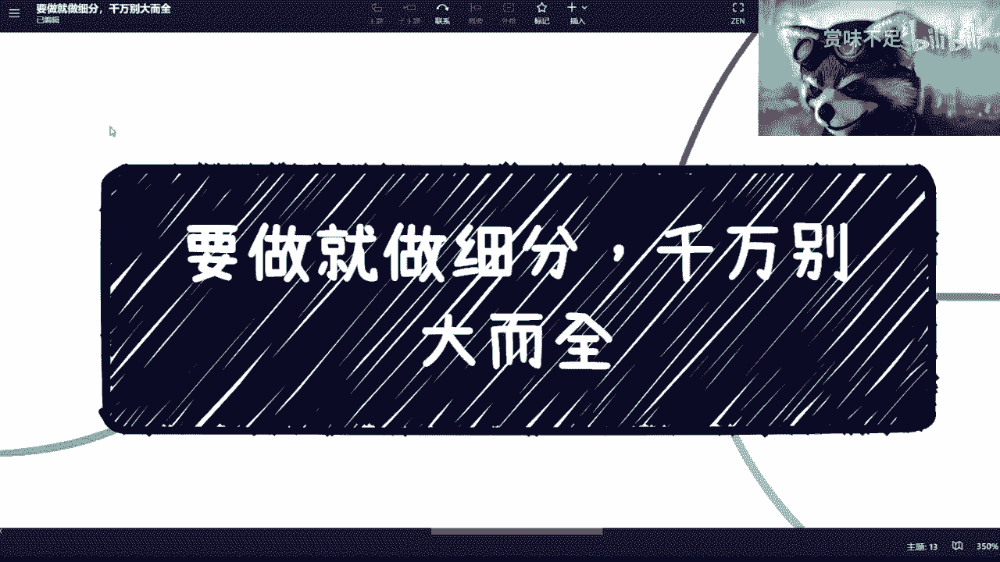

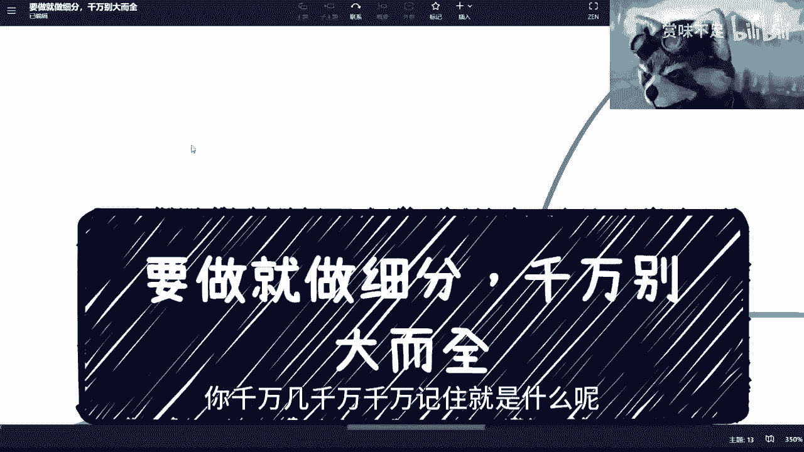

在本节课中，我们将探讨一个核心原则：无论目标是赚钱、找工作还是创业，都应避免追求“大而全”，而应专注于一个具体的细分领域。我们将通过概念解释、案例分析和实践建议，帮助你理解并应用这一策略。

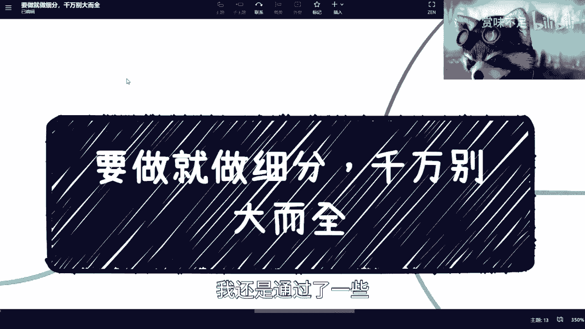

## 理解核心原则：遵循客观规律

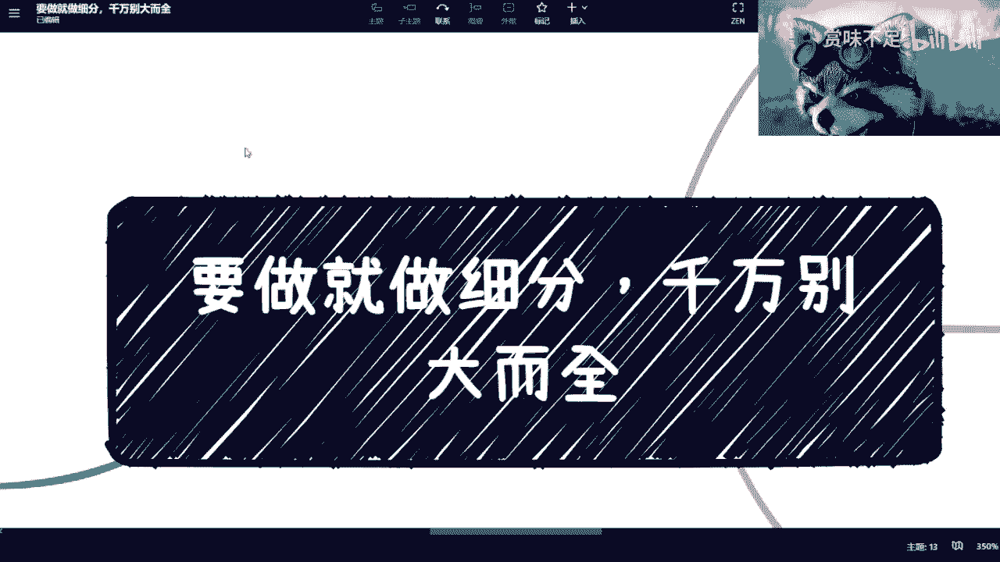

上一节我们介绍了课程主题，本节中我们来看看其本质含义。

所有目标的实现，都必须遵循客观世界的发展规律。你不能脱离现实条件空想。例如，你不能无视科学规律，今天就想去月球。这无法实现。

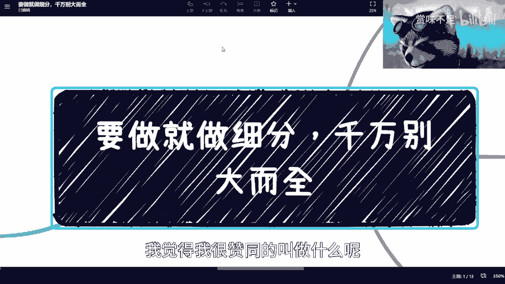

因此，做任何事情，千万要记住一个核心原则：**你不能既要又要**。你也不能指望一口吃成胖子。客观地说，无论是你还是我，都没有这种全能的能力。

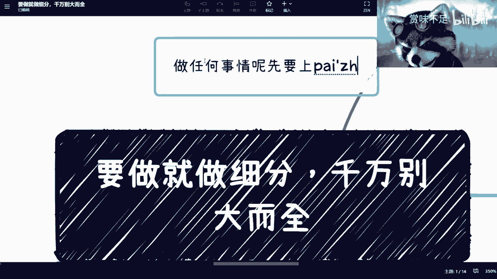

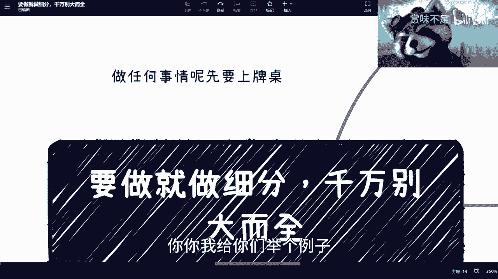

## 为何必须选择细分领域？🔍

理解了基本原则后，我们来看看为什么必须做出选择。

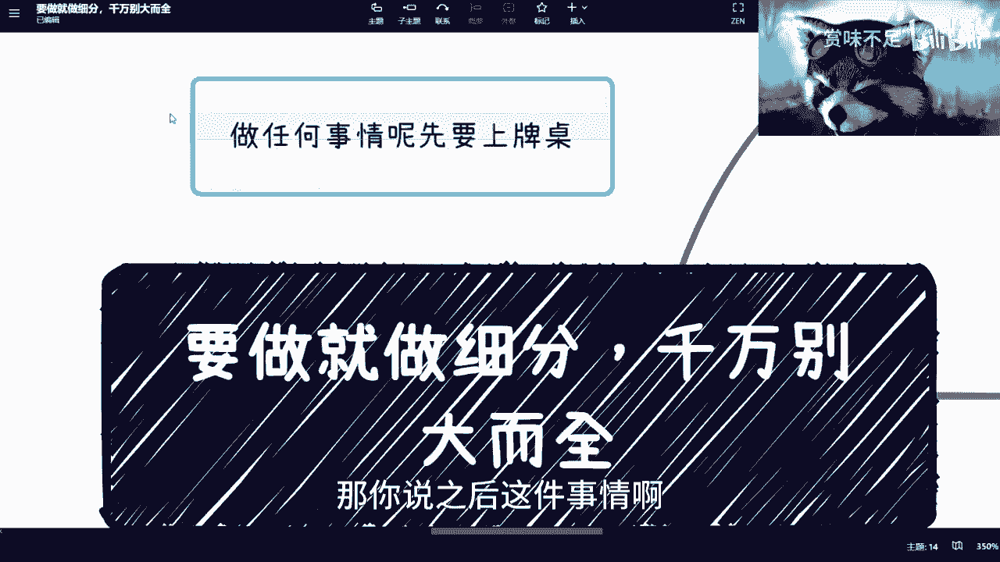

当前的环境充满挑战。即便有人曾凭借机遇（如活动、咨询、培训）获得过红利，但对于现在的许多人来说，起步非常困难。在这种情况下，本质的解决方案是：**必须找到一个细分领域作为切入点**。

这个切入点可以非常小，但这至关重要。以下是两个关键原因：

1.  **想得清楚不等于能做成**：你把所有事情都想得很清楚，展现出很强的能力，但这可能没用。结论就是赚不到钱，而且你的设想可能与现实差距很大。
2.  **细分不等于低端**：不要觉得做一个很细分的东西就很低级。你不需要考虑这么多，因为你的首要目标不是表面的“高大上”。

那么，首要目标是什么？罗永浩老师有一句话说得很好：**做任何事情，先要上牌桌**。

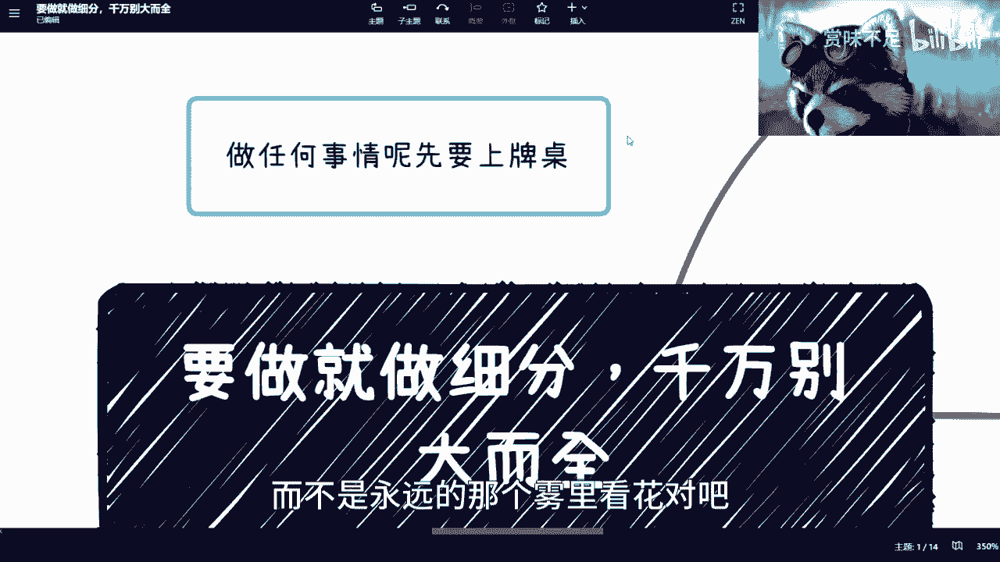

## 核心行动：“上牌桌” 🃏

上一节我们提到了“上牌桌”的概念，本节我们来详细解读它。

“上牌桌”意味着你已经进入了一个具体的领域，能够感知这个领域的动态，并比圈外人更早地发现机会。至于能否把握机会，那是后话，但“上牌桌”是获得机会的前提。

目前，大多数人都没有“上牌桌”。无论做什么，都停留在外围观察。你必须全身心投入某个细分领域，才可能“上牌桌”。而且，投入后必须付诸实际行动。

以下是“上牌桌”的一个简单例子：

> 假设你想摆摊卖煎饼。你做了很多准备工作：市场对比、技术攻克。但如果你始终没有摆出第一个摊，你就没有“上牌桌”。只有当你真正摆出摊，赚到第一笔钱（无论多少），你才算“上牌桌”。此后，你才会真正接触到城管、行业潜规则等实际问题，而不是永远雾里看花。

所以，“上牌桌”并开始行动，是最重要的一步。

## 案例分析：大企业的细分困境 💼

理解了“上牌桌”后，我们通过一个真实咨询案例，看看大企业是如何因切入点过大而陷入困境的。

我曾咨询过一个项目：一家全球知名的企业，拥有成熟供应链，想要推出一款全新的高价产品。他们具备所有优势：全新设计、配套课程、售后服务。

很多人会想：拥有如此强大的企业背景，推新品岂不是轻而易举？但事实并非如此。他们遇到了三大问题：

1.  **产品单价过高**。
2.  **上下游供应商更愿意卖利润清晰、流程熟悉的老产品**。
3.  **用户因不了解新概念且觉得价格贵，更偏爱老产品**。

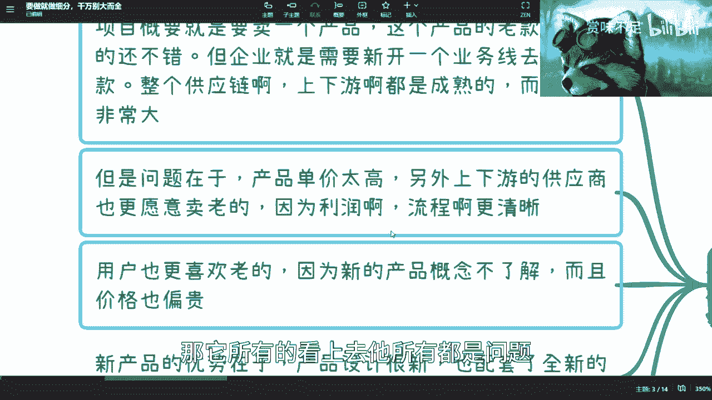

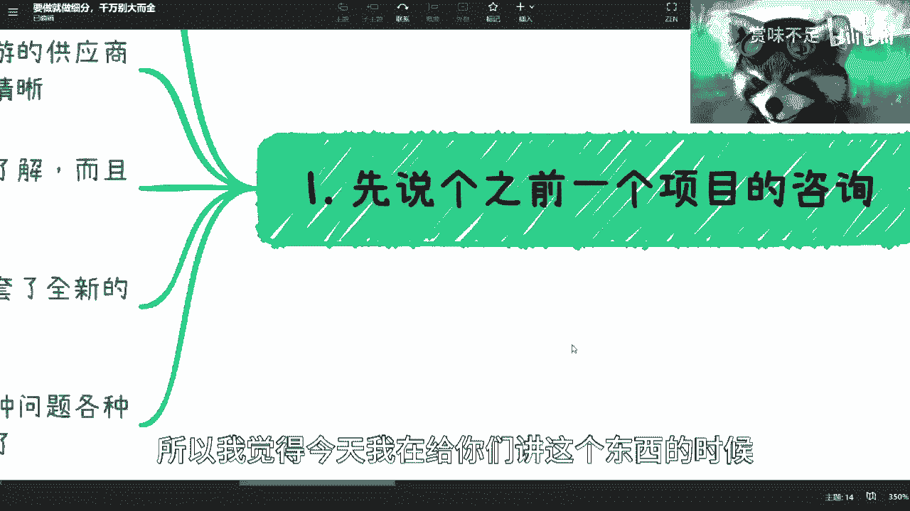

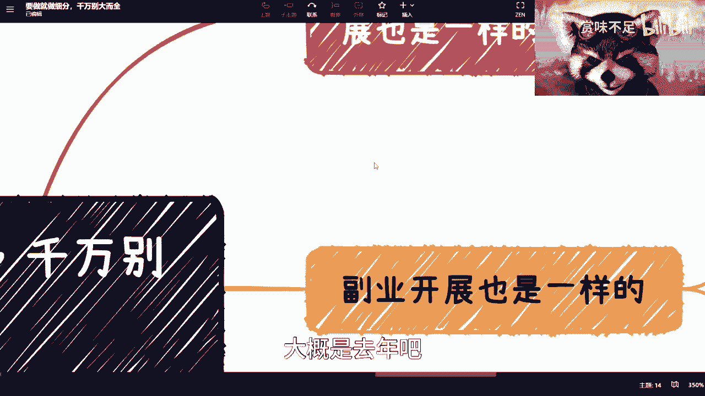

项目方与我进行了两小时会议，将他们能想到的所有问题和解决方案都罗列了出来。这很像一场面试，咨询师必须警惕不被对方海量的信息带偏，因为对方来找你，正说明他们对现有的问题和方案都不满意。

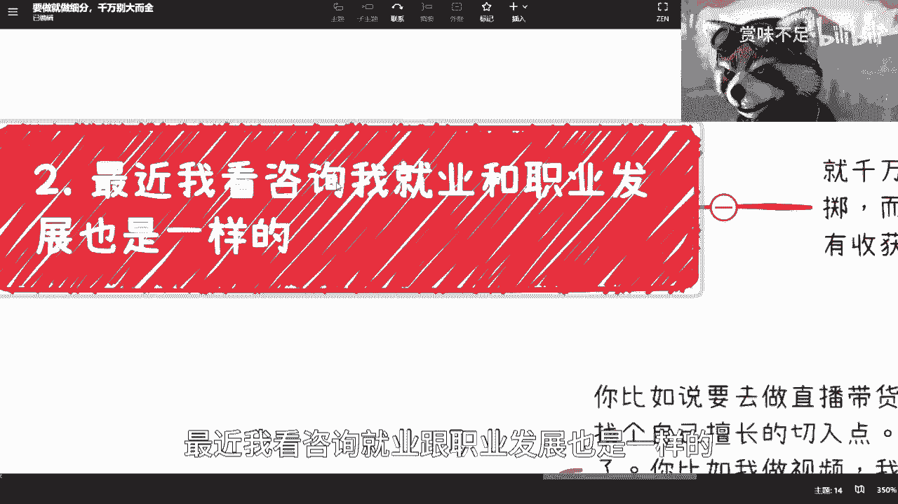

我的核心建议是：**你们最大的问题在于初始切入点不对**。他们希望新品面向全部老用户（一个“面”），这导致了所有复杂问题。

我提出的解决方案是：**改变切入点，聚焦细分人群**。既然新品具有设计新、配套服务好、单价高的特点，就应该针对“高净值人群”进行精准营销和包装。对于这部分受众，价格高不再是劣势，而是与价值匹配的特点。同时，让原有供应链继续卖老产品，两者并不冲突。

这个案例说明：**当切入点是一个“面”时，所有事情都看起来是问题；当切入点是一个精准的“点”时，许多问题就自然消失了。**

## 实践指南：如何在各领域应用？🚀

通过案例我们看到了聚焦细分的力量，现在我们来将其应用到各个具体场景中。

以下是针对不同领域的实践建议：

**1. 就业与职业发展**
*   **核心**：不要什么都想要。选择一个细分方向切入不是赌博，因为犹豫不决、什么都不选才是最大的风险。从“面”开始你切不动，必须找到一个“点”扎进去。
*   **举例**：学计算机，不能只说“计算机方向”。要明确是前端开发、数据分析，还是人工智能算法。

**2. 发展副业**
*   **核心**：分解动作，从最小可行性点开始测试。
*   **举例**：想做直播带货，不应一上来就同时做“直播”和“带货”。
    *   可以先尝试“带货”：在快团团或拼多多上选一个品，利用现有资源宣传，测试一个月能卖出多少。如果一份都卖不出，说明选品或渠道有问题，这时开直播也无济于事。
    *   也可以先尝试“直播”：找一个你擅长且能持续输出的细分话题（如游戏攻略、美妆教程），坚持直播，积累粉丝和镜头感。

**3. 创业**
*   **核心**：警惕“宏大叙事”，许多看似空白的市场，可能受限于用户真实需求、法律法规或已有垄断者。
*   **建议**：不要试图一开始就想清所有细节（你也做不到）。首先应验证核心点是否能赚钱。一个需要3000万预算的方案，与你只有30万启动资金的事实不符，就应调整或放弃。

**4. 发挥长处，而非弥补短板**
*   **核心**：选择切入点时，应基于你擅长或热爱的领域，而不是盲目追逐“热门”。
*   **举例**：我做视频，就发挥“能说”的长处，只做最基础的剪辑加字幕。如果强迫自己去学复杂的特效，可能坚持不了一周，更别说一年。这不适合我。

## 总结与最终类比 🎮

本节课中，我们一起学习了“聚焦细分，避免大而全”的核心策略。

我们首先明确了做事需遵循客观规律，不能“既要又要”。接着，我们指出了选择细分领域切入的必要性，并引入了“上牌桌”这一关键概念——即通过实际行动真正进入一个领域。然后，通过一个大企业的案例，我们看到了错误切入点如何引发一系列问题，而聚焦细分则能化解矛盾。最后，我们提供了在职业、副业、创业中应用这一策略的具体方法。

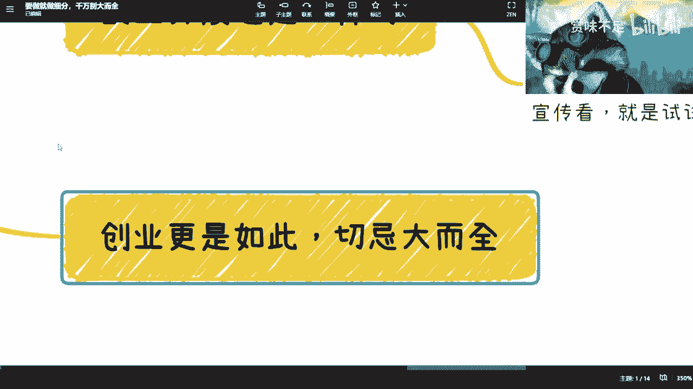

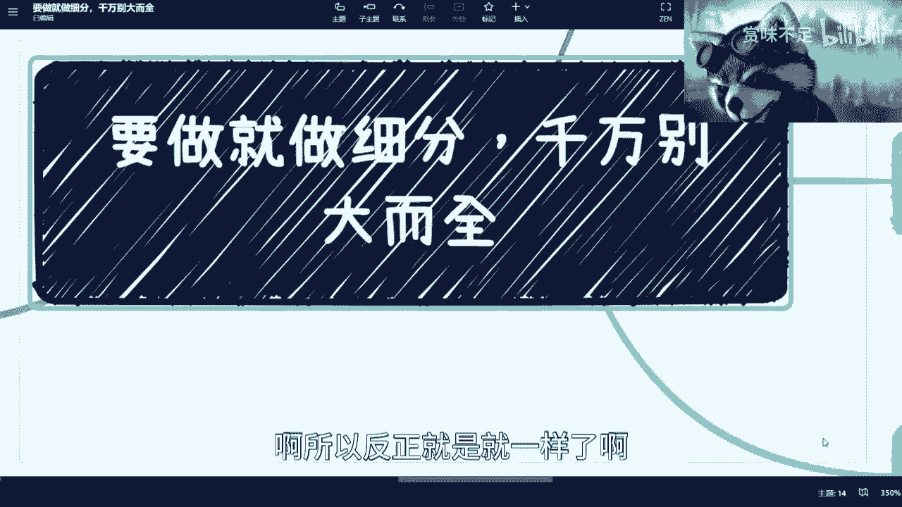

最后，用一个简单的类比来总结：这就像玩一个角色扮演游戏。你有一个角色和十个技能树。你是选择在每个技能树上都点两下，还是集中所有资源，先把一个技能树点满？显然是后者。只有将一个技能（细分领域）钻研到极致，你才能获得强大的竞争力，否则只会一事无成。

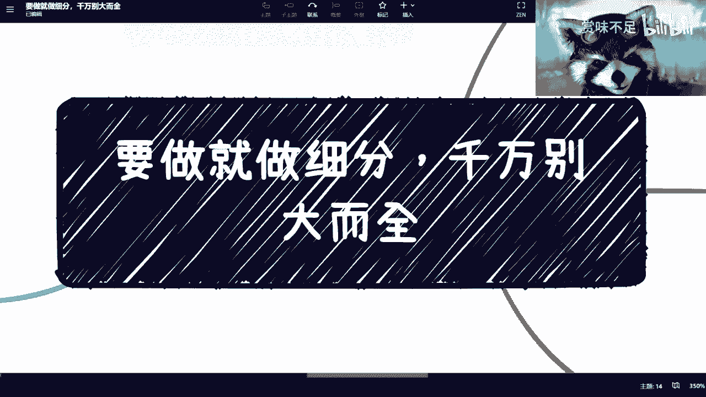

**核心公式：成功 = 找准细分点 + 全身心投入 + 实际行动“上牌桌”**