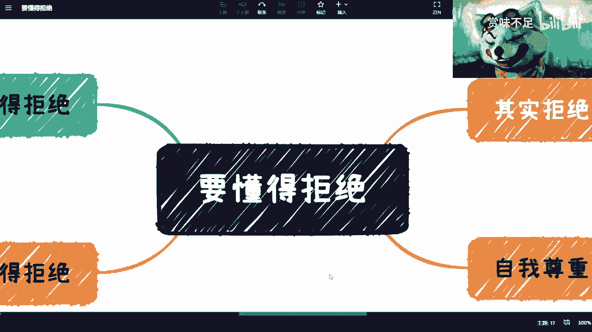
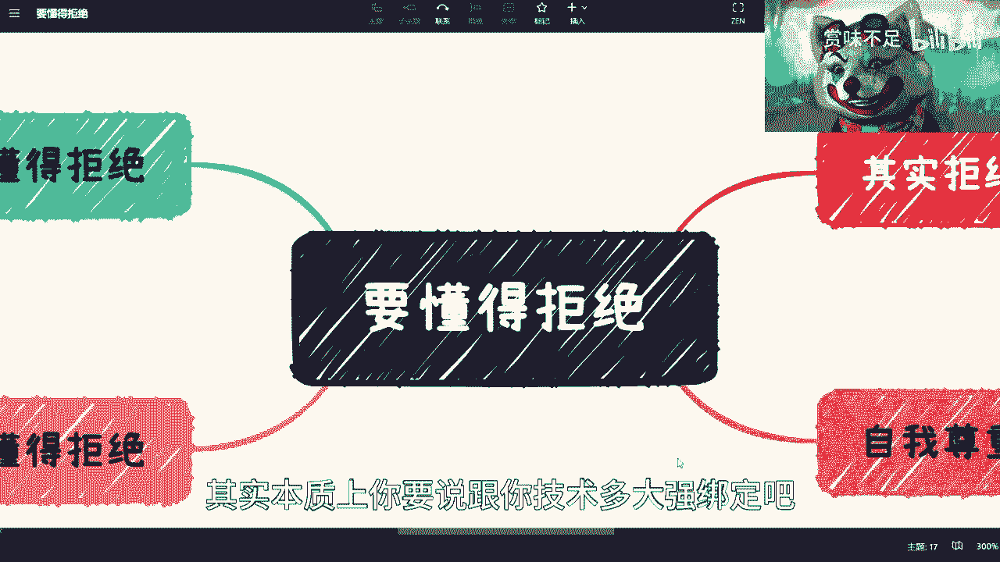
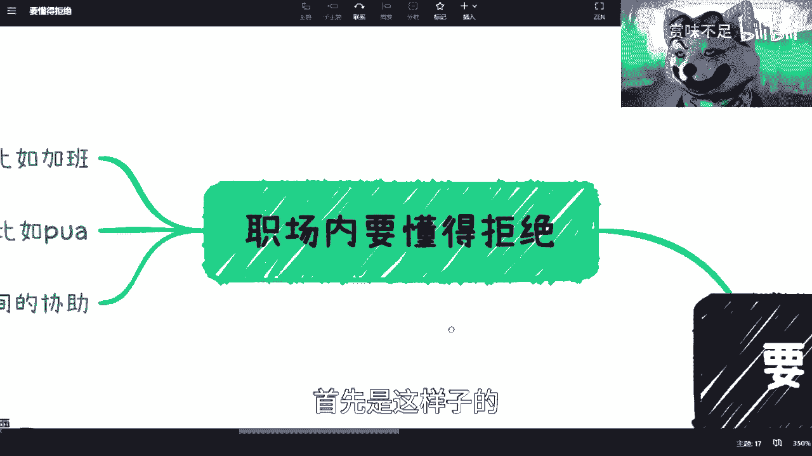
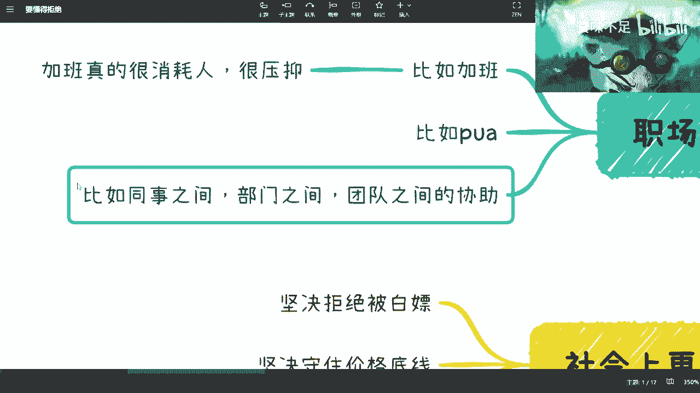
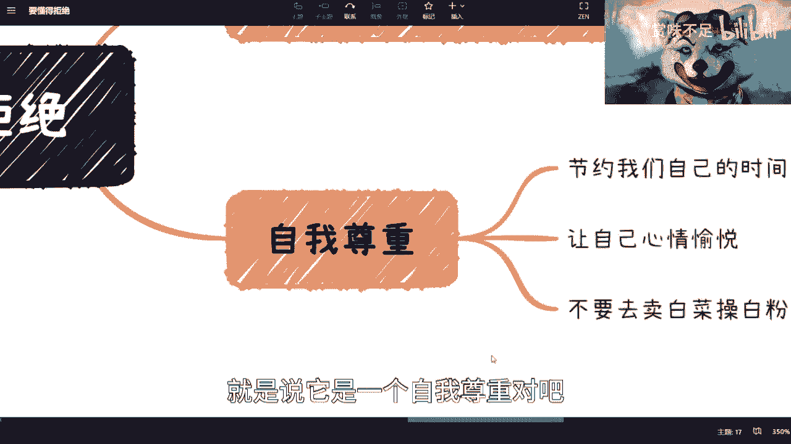
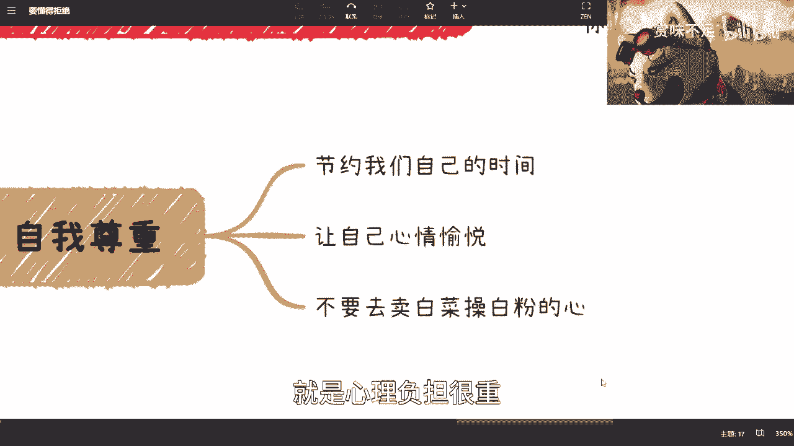
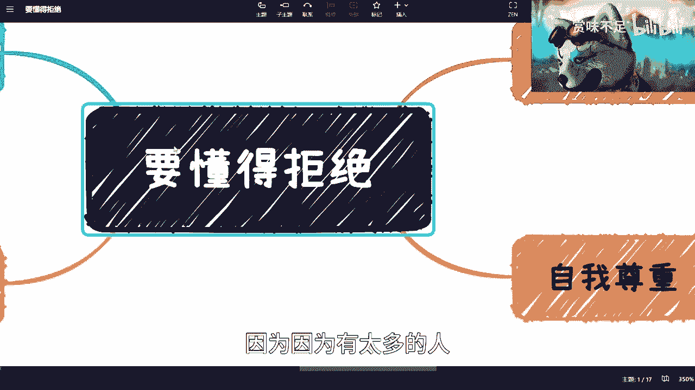
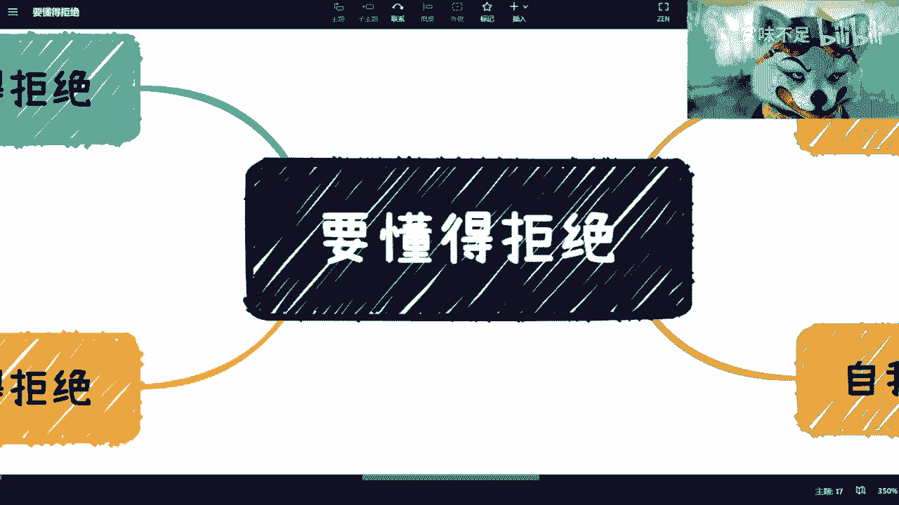

# 要提升效率先要学会拒绝 - P1 - 赏味不足 - BV1xs4y1n7gD

好好欢迎大家来到哥谭市，啊对啊。

串场了串场了。

这个很感谢大家关注这么一个合集啊，然后我写其实这个合集也写了，就是窗口期之前的，就失业之前的窗口期，其实我看了一下，就失业本身不是问题啊，问题是大家怎么能去赚更多的钱，怎么提升自己的这个呃价值对吧。

和核心竞争力，所以说呃提升核心竞争力和价值呢，其实本质上你要说跟你技术多大强绑定吧。

其实也不见得它是一个综合能力，所以说我想了一下，把所有能拆开来的东西就全部拆了出来，啊那么这次呢讲了一下这个内容啊。

就是拒绝这个事呢，呃涉及到刚方方面面对吧，我其实也很不懂啊，我以前也不是，我现在其实也是不太懂。

然后就这个让自己吃很多亏啊，首先是这样子的。

我们说职场内呢你要懂得对吧，那比如说啊你说我最近我这个疫情之后啊，我朋友呢就一直跟我说加班啊，然后呢这个我组的一些聚会也没来，然后就跟我说加班，加的呢就是人非常的压抑对吧。

就简单来讲就是你问他你为啥加班，我也不知道对吧，你这个加班了是做什么，是说原本的工作没做完还是怎么样，他也不知道对吧，那么这个事情就是比较尴尬的啊，然后我觉得这个呢其实是可以拒绝的，因为为什么呢，因为。

还是那句话嘛，就是说你你一直去消耗，其实消耗的是你自己时间对吧，但是也有很多人说嘛，他说哎呀，那我现在找工作难找对吧，那我可能这个这个也没有，只只能叫什么呃，逆来顺受是吧，或者怎么样。

但其实我跟你们说啊，就是所有的事情，所有的问题你要放长远去看，就是就什么意思啊，就比如说你今天面临一个问题，你一直在加班啊，然后呢浪费时间浪费了，比如说半年1年对吧，这么一个时间好。

但是呢你又不愿意出去啊，寻找更合适的地方，而且你会默认对吧，非常难找，你可能找不到对吧哈，这件事情没有问题啊，没有问题，但是比如说你现在是30岁啊，做了3年之后，你发现33岁的时候呢。

你还是面临这个问题对吧，就我加班很严重啊，我已经加不动了对吧，我身体不好啊等等等等等，然后我很压抑对吧，精神上都受到了极大的创伤对吧，那问题在于哪里，你就会发现这个问题。

你但凡不去不去提升你的这个竞争力，不去走出去看更多的东西，这个问题是解决不了的，你指望这个行业帮你解决，这是不可能的对吧，那么其实本质上就是说你无限的在拖延时间，这个问题最终爆发的时间点。

但是他最终还是会爆发，你知道吗，所以说这个事我觉得是最大的问题，倒不是说啊这个陈老师非要这个叫什么呃，建议你们说啊，要辞职对吧，要出去干对吧，要要换工作并不是，但是你们得要去想办法解决这个问题。

当然解决这个问题的方式很多很多，就是我这个合集里面为什么要讲这么多，也是为了帮助大家去能够明白，就是说靠单靠一条主线的主业是不够的，对吧好，那你比如说第二个p a，p u a就更不要说了对吧。

有些p u a是p u a，你的这个啊这个能力有些pua呢是p u a，说这个职场的一些性骚扰对吧，那我觉得这种就更不要手软了对吧，就就该怎么样怎么样啊，第三个呢就是说你同事之间，部门之间。

团队之间的协作呃，这种呢其实也是一样的，就是说你你不管是做什么，你都有所谓的轻重缓急对吧，你都有所所有的这个优先级，那如果来说在你自己的这个事情里面，都还没有解决的情况下，你就不要再去啊。

说啊这个这个帮助同事啊，部门啊或者团队之间对吧，而且我跟你们说，我知道我跟大部分人也聊过啊，大部分人情况，不是说他不是说他知不知道自己事情，比如说做不完啊，他知道很多事情都做不完。

而且他也知道他就算这个不帮别人做，他自己的事情可能都要加班，但他为什么还要帮助人家呢，是因为他不好意思拒绝对吧，或者说他就不愿意不不这个dna里面刻着，我不能说不好说不。

我就感觉哎呀好像得罪人家了或者怎么样了。

不存在啊，我希望你们明白，不存在啊，这是第一点，第二点呢，社会让你们更要懂得拒绝啊。

就是我们说坚决拒绝被白嫖对吧，就是这个白嫖指的是什么呢，就是idea，比如说比如说solution对吧，就是你的观点啊，你的一些解决方案啊，就是你积累过的东西对吧，你就像我为什么跟你们说。

你们要有实际的问题，你来找我咨询对吧，因为什么，因为很简单，我不想被别人白嫖对吧，我愿意被白嫖的，就比如说我现在做视频给你们看，那你只能说这些东西，我觉得对你们来讲是有价值的。

但是对你们来讲没有那么大的价值，没有touch到我的核心对吧，那你想如果来说，我们要去聊一些更有价值的东西，那么我就希望你们去咨询，对对就这样子，因为我不愿意被白嫖，如果我愿意白嫖，被白嫖。

说明我自己就觉得我没有什么价值，对不对，那我觉得这是第一点，第二点是什么呢，你得坚守价格的底线，什么意思呢，就是说呃我举个例子，就比如说你觉得你的月薪是1万块钱，或者是8000块钱，或者是2万块钱。

对吧好，那你出去谈很简单，就是我就觉得我值这个价格，那当然你得你得客观的评价你，你不能说啊，我什么都不会，我的没，我要月薪10万，那就扯淡了是吧，但是呢你得坚守这个价格。

你不能因为对方比如说是一个title比你高啊，然后社会地位比你高，或者这个公司里面的面试官啊，然后就是什么什么呃，就是吓唬了你两句，然后你就说啊，那那那那也关系不大啊，我我我8000 6000也行啊。

5000也行对吧，那其实说白了不是对方不尊重你，还是你自己不尊重你自己啊，这第二点第三点呢谈恋爱就更是了，我跟你说就是哎呀这种事情，那我这边先提一点，就是你你要当心极端人格啊，就是你但凡觉得这人不合适。

或者说不管是不是恋爱啊，就是合作也是一样的，你觉得这人不合适啊，你觉得可能这人啊，会会会会会有小心思扣你钱对吧，或者怎么样怎么样，你你就你就拒绝，你就说咱们不合作怎么了呢，把地球上这么多人怎么了。

那我非要跟你合作呀，啊我还得非得跟你谈呢。

啊对吧，所以说呢我跟你们讲啊，其实拒绝本身呢它不是一件事情，这个事情倒不重要，重要的是你得传传达给对方一个态度。

因为我跟你说啊，中国现在这个人啊啊这个价值观扭曲的太多啊，就是有很多人就会觉得什么呢，哎呀口是心非，对吧啊，你说的说的是一套，做的是一套，我都不知道怎么来的价值观，你知道吗，就是我跟你们说啊。

什么喝酒啦对吧，日常合作啦对吧，什么什么什么谈恋爱了对吧，都一样的，就是你表达出来没有用，因为有很多人也跟我说，他说我说过了呀对吧，我有微信说过了呀，当面也说过了呀，怎么样了呀，我说说过有什么用呢。

你得行动啊对吧，我给你们举个例子啊，我以前有个合作方啊，是这个样子，我当时是做什么呢，做这个国家的这个人才证书啊，我就跟他讲啊，我说这个证书啊，考试啊，比如说考试500块钱啊。

培训是4000块钱哎就这么个价格啊，你要是人多一点呢，咱们再谈个优惠价，就这么简单嘛对吧，然后我就跟他说，我说我呃给你两个月，你能落地吗，比如说你招一个20个人的班对吧，你能不能落落，我们再来往后谈。

你现在别来跟我哔哔什么什么公司啊，股份啊，期权啊，我什么都不要，对不对，好，然后然后呢就经过了两次沟通啊，他是这么跟我讲的，他说陈老师啊，我发现啊，这个这个市面上做这个证书的人蛮多的啊，不止你一个。

我说是啊，很正常啊，哪个东西我垄断了是吧啊，然后呢他就跟我讲，他说哎陈老师，你知道还有另外一个整数啊，那个整数呢也是什么什么，这个这个这个部门发的啊，哎他考试只要200块钱诶，他培训只要500。

你知道我怎么回他的吗，我说那你去你去合作，那你去找他合作，你跟我讲干嘛呢，你要跟我合作，你就是合作，别跟我逼逼这些事儿，对不对，我就挂电话了，你知道吧，就是说你得跟他去表达清楚，别去绕来绕去，绕来绕去。

对大家都没有好处，对不对啊，那我可以告诉你们，其实事实结果是什么，结果就是说他也他就觉得ok啊，就是我觉得就是他可能觉得我说的也没有错，就没有意义啊，对不对，就是我就告诉你我的价值。

我这个东西做就这个样子，你跟我说别人，你那你去跟别人合作，跟我有蛋关系，是不是啊，然后我觉得这是一点。

那我觉得呢核心呢你这个拒绝不拒绝，就像我说的，就是说他是一个自我尊重对吧。

也就是说你你会发现你拒绝了，其实你在节约自己的时间对吧，这是第一个，第二个呢你会让你心情愉悦，为什么，因为我跟你们讲，很多人哎呀，你们不跟我讲，我都知道你们拒绝不拒绝是不拒绝的对吧，然后要做老好人。

但是你们其实心里不开心的对吧，其实就这个样子，而且很多人还不开心，还还还还不觉得是就是说那个叫什么。

不觉得是不懂得拒绝拒绝的问题，哎呀还觉得哎呀，怎么怎么好像自己最近不开心对吧，你自己一直没成长是吧，怎么样子啊，第三个呢就是不要去卖白菜，就是说，每每个人啊，在你人生每个阶段去做适合你的事情。

我们一直说就说你做一个事，去做那些你跳一跳够得到的对吧，你总不能说啊，你现在数理化都还没学好，我跟你说来造火箭是吧，这个就不不现实，而且就是说越是越越过你们的能力去做，要求你们的时候，其实你们就会对吧。

就是心理负担很重。

你知道吗，精神压力也很大，你知道吗，所以说其实我觉得，就是你得就是所有的这个过程当中啊，因为你们在就是说找副业也好，找多条这种生存道路也好，过程当中，其实商业我们一直说商业闭环对吧，商业闭环过程当中。

你就要去懂得拒绝。

因为因为有太多的人，太多的这种因素，太多的声音，你但凡不懂得拒绝，那就那其实怎么说呢，就是就是你不能怪别人，你最终只能怪你自己啊啊然后我最后提一点嘛，然后有有人咨询我的时候也提啊，他说他说哎呀。

我也知道，但我改不掉，他说陈老师你有什么办法了，我还真是想了半天啊，然后我就跟他说，我说呃我给你个最终的结论是什么，就是不是所有事情都有办法的，我说这个事情唯一的办法是什么，就是你只能通过不停的踩坑。

不停的去受伤，不停的痛对吧，然后你才会改变自己，那你说为什么你现在还没有改变呢，是因为你的痛还没有触及到你根本的利益，或者根本的叫做叫做关心的点，因为每个人关心的点不一样嘛，对吧啊。

我说他没有触及到你灵魂，触及到你灵魂，你怎么会改，那当然了，这个就像这个，就像就说每个人去去突破自我一样的，你说人人都能突破吗，不一定啊，但是你真的要突破，那你就必须对吧，就是，就是得得要自我改变对吧。

你不能自我暗示，一直说哎我改变不了，我就这么个人对吧，我这性格刻在dna里面了，那那那那怎么办对吧好吧好吧行。

