# 课程 P1：提升效率，从学会拒绝开始 🚫

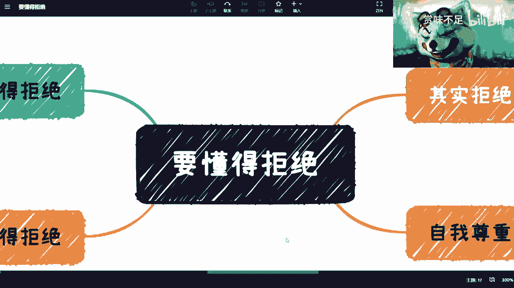

在本节课中，我们将探讨一个常被忽视但至关重要的效率提升技巧：学会拒绝。很多人效率低下、身心俱疲，并非因为能力不足，而是因为不懂得或不敢于拒绝。我们将从职场、社会交往等多个维度，分析拒绝的重要性、具体场景以及如何实践。

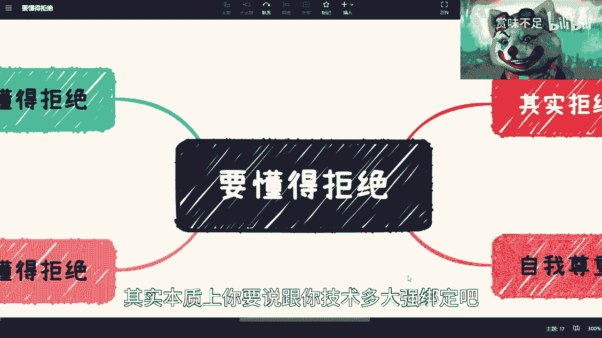

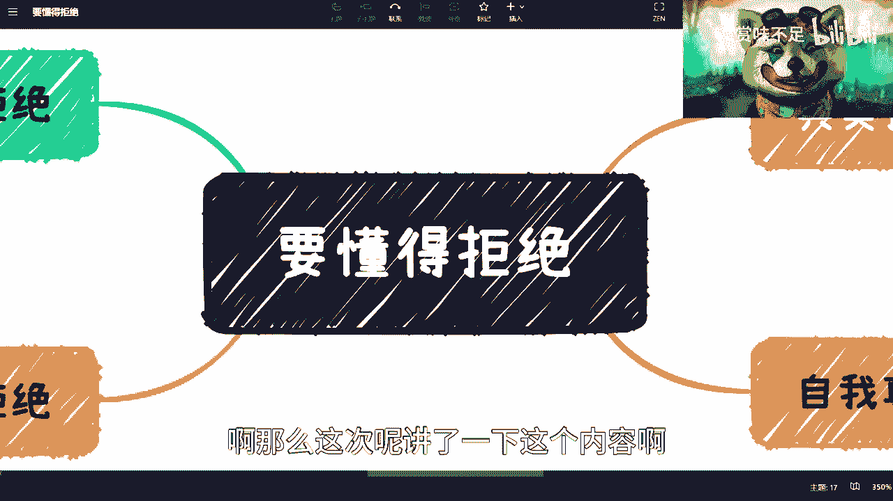

---

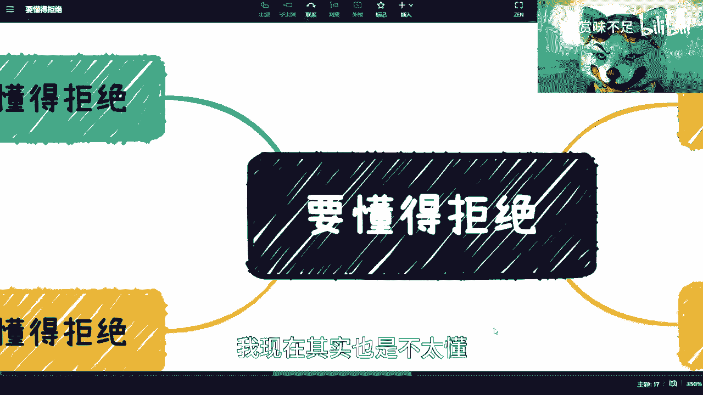

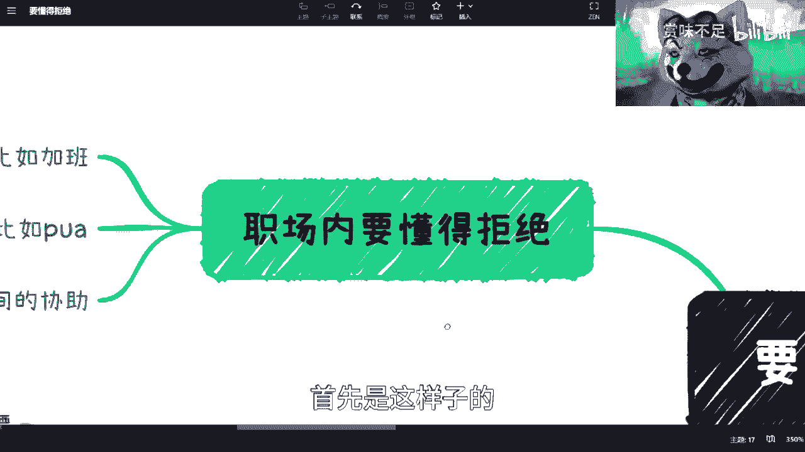

## 概述：为什么拒绝如此重要？

提升个人价值和核心竞争力，并不仅仅依赖于技术能力，它是一个综合能力的体现。本课程旨在拆解这些综合能力，而“学会拒绝”是其中关键的一环。不懂得拒绝，会导致时间被无意义消耗，个人成长停滞，甚至损害身心健康。长远来看，拖延问题只会让它在未来以更严重的形式爆发。

---

## 一、 职场中的拒绝

上一节我们概述了拒绝的普遍重要性，本节中我们来看看在职场这一具体环境中，有哪些情况需要我们勇敢地说“不”。

在职场中，你需要懂得区分任务的轻重缓急，并保护自己的时间和精力。

以下是三个常见的需要拒绝的职场场景：

1.  **无意义的加班**：如果加班并非因为本职工作未完成，而是源于低效、管理混乱或形式主义，这本质上是时间的浪费。长期消耗自己并不能解决问题，反而会拖延职业发展的根本矛盾。公式可以表示为：`无意义加班 = 时间消耗 + 成长停滞`。
2.  **职场PUA**：无论是贬低你的能力，还是进行其他形式的压迫（如职场性骚扰），都必须坚决拒绝。这关乎个人尊严和合法权益。
3.  **过度协作**：当自己的核心任务尚未完成时，应优先处理自己的事项。许多人帮助他人并非出于本意，而是因为“不好意思拒绝”。但这会打乱自己的节奏，导致都需要加班完成。请记住，优先完成份内工作是专业的表现。

---

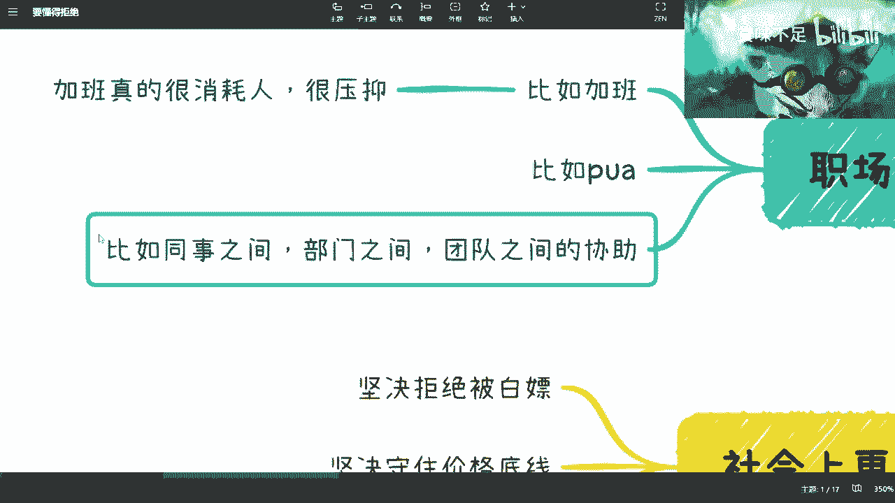

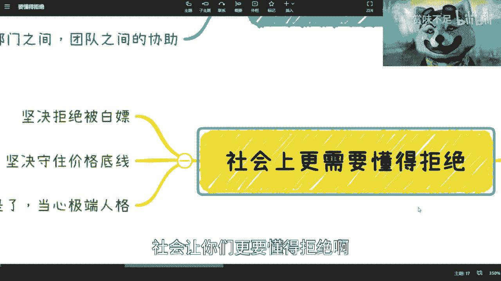

## 二、 社会交往中的拒绝

在职场之外，社会交往中也充满了需要划清界限的时刻。懂得拒绝，是保护个人价值和利益的重要手段。

在社会交往中，你需要坚决维护自己的知识、时间和价值底线。

以下是三个社会交往中需要警惕并拒绝的情况：

1.  **拒绝被“白嫖”**：你的观点（idea）、解决方案（solution）和经验积累都具有价值。免费提供核心价值，意味着你默认它没有价值。就像本课程提供通用知识，但深度咨询需要付费，这是对专业价值的尊重。
2.  **坚守价格底线**：无论是谈薪资还是项目报价，都需要基于对自身能力的客观评估，坚守合理的价格区间。不要因为对方地位高或施加压力就轻易妥协。自我妥协的公式是：`妥协 = 对方的不尊重 + 自我的不尊重`。
3.  **拒绝不合适的合作关系**：这包括恋爱、商业合作等任何关系。如果察觉到对方人品不佳、合作条件苛刻或单纯感觉不合适，应果断拒绝。世界上有无数潜在的合作者，不必困于一段消耗你的关系。

---

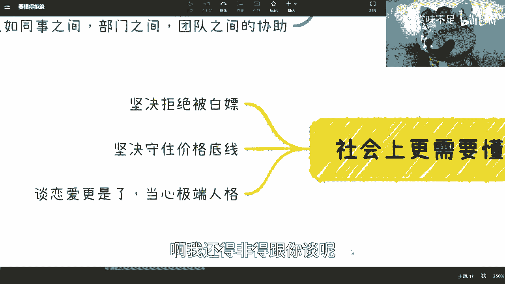

## 三、 如何有效拒绝：态度与行动

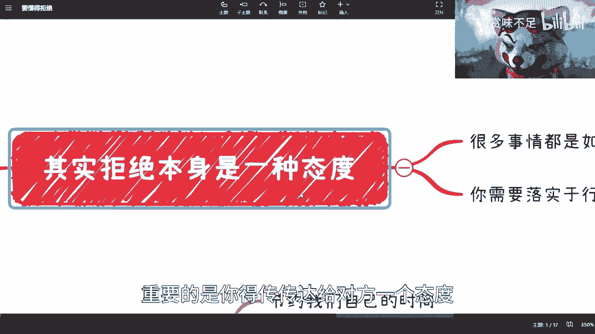

知道了在哪些场合需要拒绝，接下来我们探讨如何有效地表达拒绝。关键在于，拒绝不仅仅是一句话，更是一种态度的传达。

有效的拒绝需要清晰、坚定的态度，并辅以相应的行动。

以下是有效拒绝的核心要点：

1.  **态度明确，避免绕弯**：中国文化中有时推崇“委婉”，但在原则问题上，模棱两可只会带来更多麻烦。直接、清晰地表达你的立场和底线。例如，当合作方试图压价并提及竞争对手时，可以明确回复：“如果你认为他们的方案更好，请去与他们合作。我的条件和价值就是这样。”
2.  **用行动支持言语**：很多人说过“不”，但行为上却依然妥协。这会让对方认为你的拒绝只是口头说说。真正的拒绝是言行合一的，让对方明确感受到你的边界不可逾越。

---

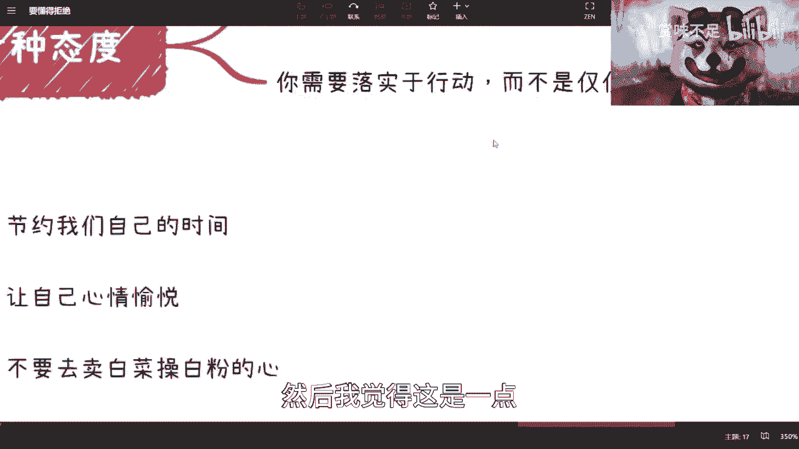

## 四、 学会拒绝带来的核心好处

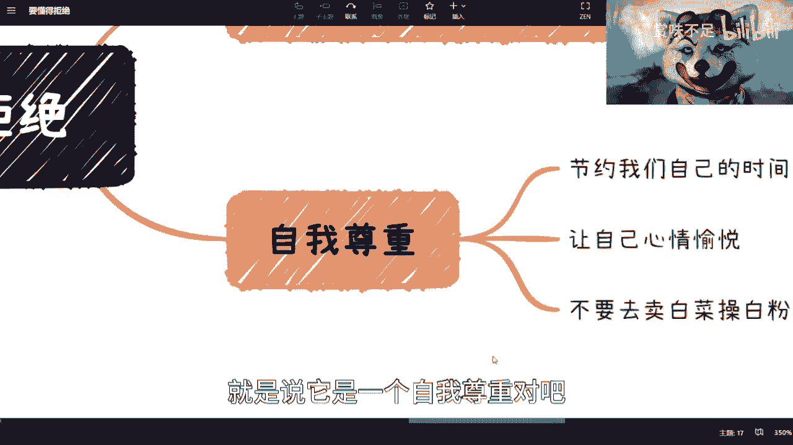

我们了解了拒绝的场景和方法，那么，学会拒绝究竟能为我们带来哪些实实在在的好处呢？

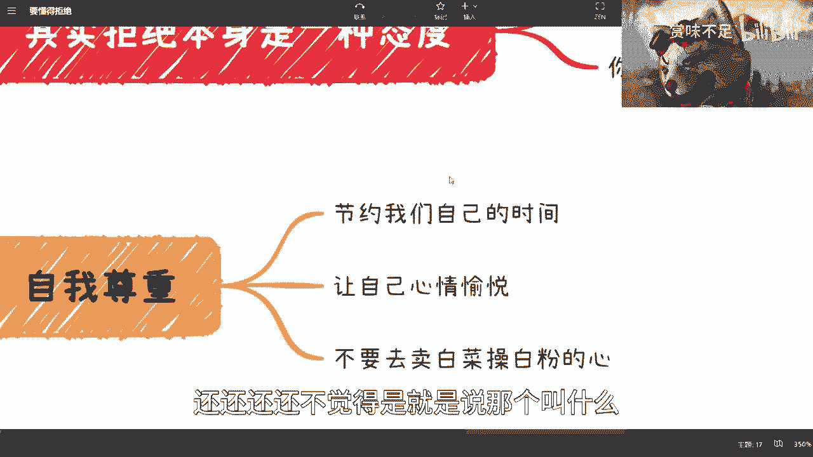

学会拒绝的本质是自我尊重，它能为你带来多重积极改变。

以下是学会拒绝的三个核心好处：

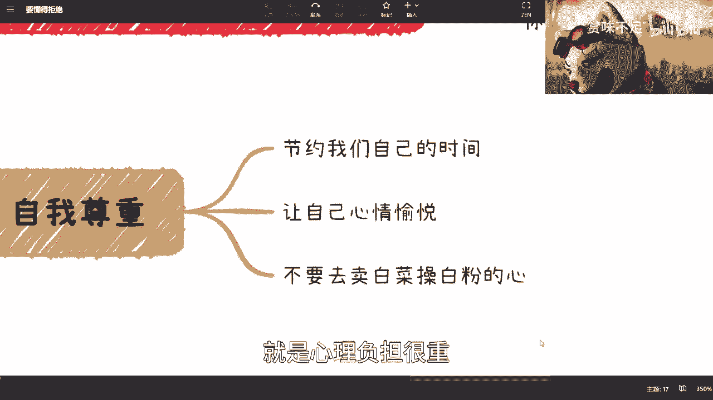

1.  **节约宝贵时间**：时间是最大的不可再生资源。拒绝无意义的事务，就是将时间投资于个人成长和重要事项上。`拒绝 = 为重要事务分配时间`。
2.  **获得心情愉悦**：勉强答应做“老好人”往往内心积压不满，导致情绪低落。勇敢拒绝后，你会因为维护了自我意愿而感到轻松和愉悦。
3.  **聚焦能力范围，避免透支**：每个人都应做“跳一跳能够到”的事情。拒绝那些远超自身当前能力、会带来巨大精神压力的请求，是保护自己、稳步成长的关键。这避免了“卖白菜操卖白粉的心”的窘境。

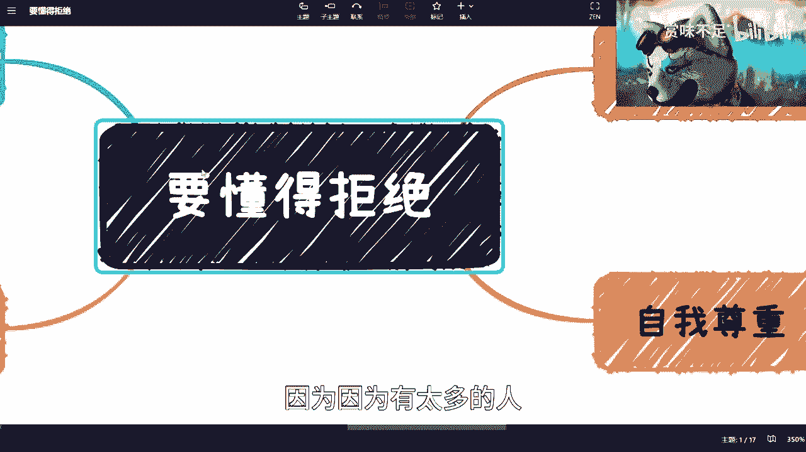

---

## 总结与最后的建议

本节课中，我们一起学习了“学会拒绝”这门提升效率与价值的必修课。我们从职场、社会交往等场景分析了为何要拒绝，探讨了如何有效拒绝，并总结了拒绝带来的核心好处。

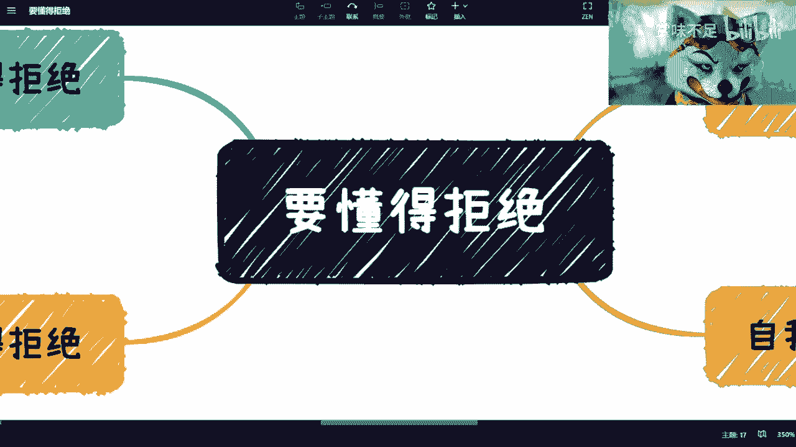

最后，面对“我知道但改不掉”的困惑，必须认清一个现实：**改变往往源于深刻的教训**。如果至今仍未改变，可能是因为痛苦尚未触及灵魂深处或根本利益。唯一的办法，就是在经历中不断反思、感受痛苦，并最终下定决心捍卫自己的边界。自我暗示“无法改变”只会让困境持续。改变，从下一次勇敢地说“不”开始。