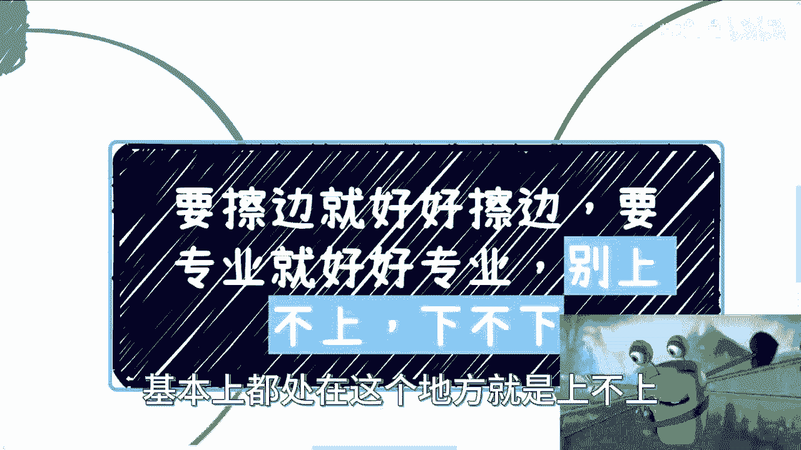

# 课程：业务定位与商业策略 🎯 - P1

## 概述
在本节课中，我们将探讨一个在创业或开展业务时常见的困境：如何清晰地定位自己的业务，并选择与之匹配的商业策略。我们将分析“擦边”业务与正规业务的运作逻辑，并讨论如何避免陷入“上不上下不下”的尴尬境地，从而建立可持续的商业模式。

---

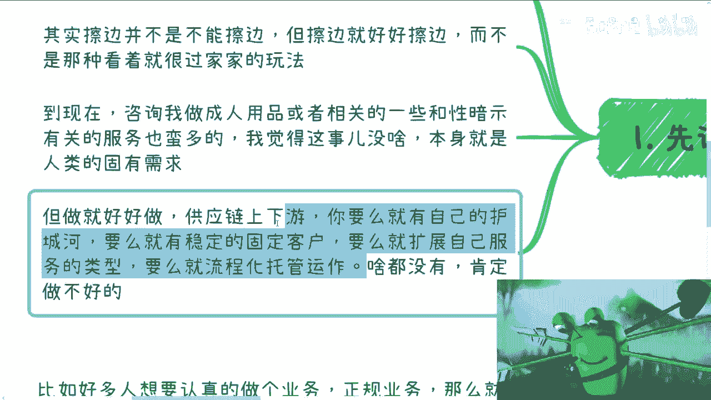

## 业务现状：普遍的“上不上下不下”状态
在与许多人交流后，我发现大家在赚钱这件事上，普遍处于一种“上不上下不下”的状态。这种状态意味着，业务既没有明确的“擦边”特色以获取特定流量和利润，也没有建立起正规、专业的壁垒以谋求长远发展。

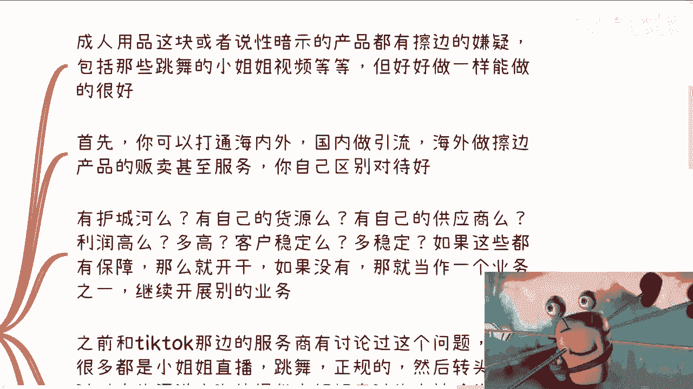

无论是从事成人用品这类带有“擦边”性质的行业，还是在教育、电商等其他领域，许多人都面临着类似的定位模糊问题。

---

## 第一部分：关于“擦边”业务 🎭
上一节我们介绍了普遍的定位困境，本节中我们来看看如何处理“擦边”业务。

“擦边”业务并非不能做。许多平台都存在不同程度的擦边内容，例如与性暗示相关的直播或舞蹈。关键在于，如果你决定涉足这类业务，就必须彻底想清楚并执行到位，而不是半心半意地尝试。

以下是做好“擦边”业务需要考虑的核心要素：

*   **供应链与护城河**：你需要审视自己是否拥有**供应链上下游**的优势或独特的**护城河**。这包括稳定的货源、有竞争力的价格、固定的客户群或能扩展服务类型的合作伙伴。
*   **公司化与合规化**：你必须考虑如何**合法、合规**地运营。这涉及到公司注册、财务开票、业务备案等一系列公司化运作。即使在监管相对宽松的海外市场，也需要进行相应的登记。
*   **市场与策略选择**：
    *   **国内策略**：如果国内平台监管严格，可以考虑通过MCN分销、KOL带货或与线下成人用品店合作（如放置易拉宝广告）等方式进行。
    *   **海外策略**：可以考虑将引流与交易环节分离，例如在国内引流，在海外进行产品或服务（如售卖相关衣物）的交易。
*   **业务定位**：你需要清醒地评估这项业务。如果缺乏护城河，同质化竞争严重，那么它可能不适合作为核心项目来投入大量精力。可以将其视为一个补充现金流的业务，而非寄予厚望的主营项目。

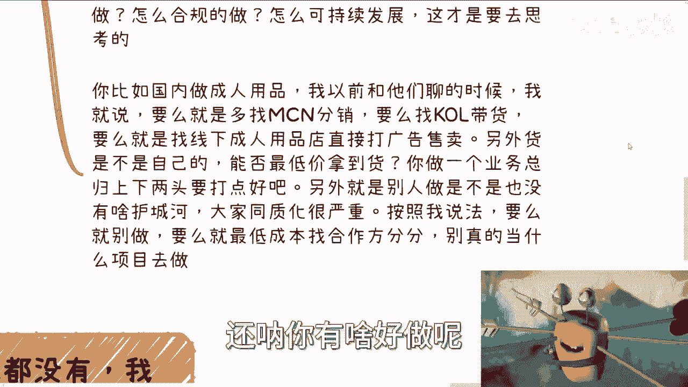

**核心公式**：可持续的擦边业务 ≈ **稳定供应链** + **合规化运作** + **清晰市场策略**

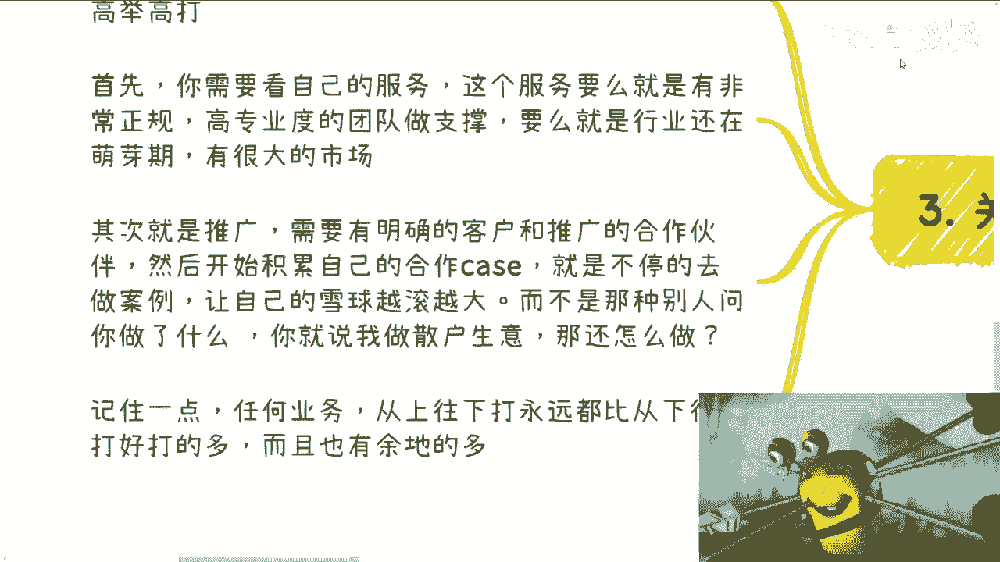

如果上述条件大多不具备，那么这项业务的商业逻辑本身可能就不闭环，难以持续发展。

---

## 第二部分：关于正规业务 🏢
处理完“擦边”业务的思路，我们转向另一个方向：如何运作正规业务。

对于正规业务，建议采取“高举高打”的策略。这意味着从高起点入手，建立专业形象。

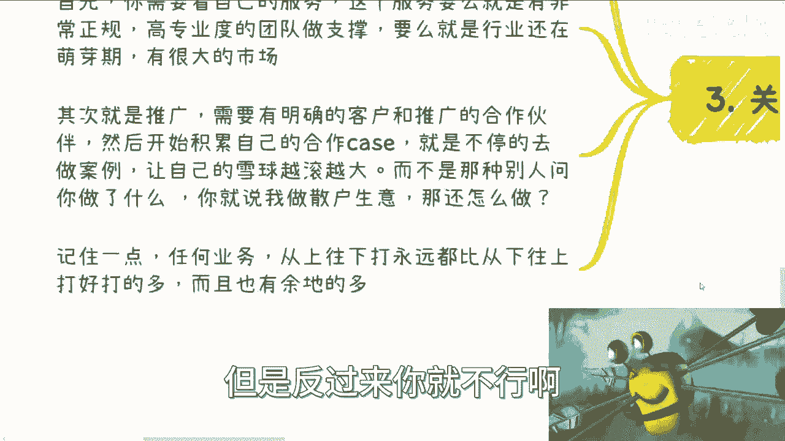

以下是运作正规业务的两个关键前提：

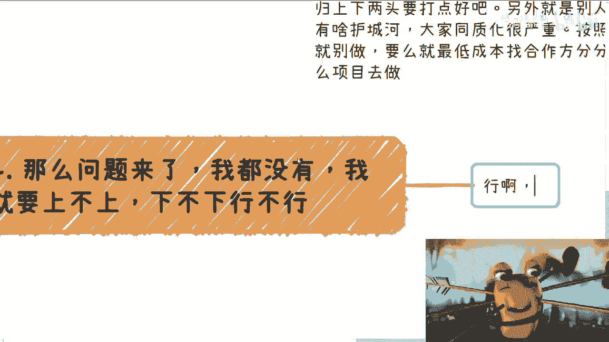

1.  **高专业度或大市场**：你的业务要么具备极高的专业壁垒（例如拥有国家级研究院、科委等背书），要么身处一个处于萌芽期、拥有巨大潜力的蓝海市场。
2.  **明确的推广路径**：你需要有清晰的客户画像和推广渠道，并持续积累成功的合作案例。这些案例是你“滚雪球”的基础，能为你带来更大的合作机会。

**核心策略**：**从上往下打** 优于 **从下往上打**。
*   **从上往下打**：例如，先争取到团委等高层级机构的背书，然后向下拓展到工信厅、农业厅，再到地方基层、大型企业、中小企业，最后到散户。这个路径拥有充足的调整余地和下沉空间。
*   **从下往上打**：从散户或底层市场做起，想向上突破到政府、国企等高端客户会非常困难，一旦受阻就难以继续。

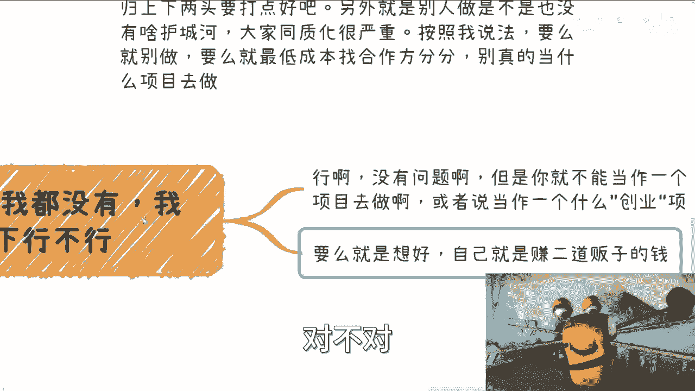

因此，在商业世界中，拥有高起点的标签和案例，更容易整合资源，实现长远发展。

---

## 第三部分：如果目前“什么都没有”怎么办？🤔
了解了两种路径后，可能有人会问：如果我目前就是处于“上不上下不下”的状态，没有护城河，也没有高起点资源，该怎么办？

答案是可以做，但必须调整预期和定位。

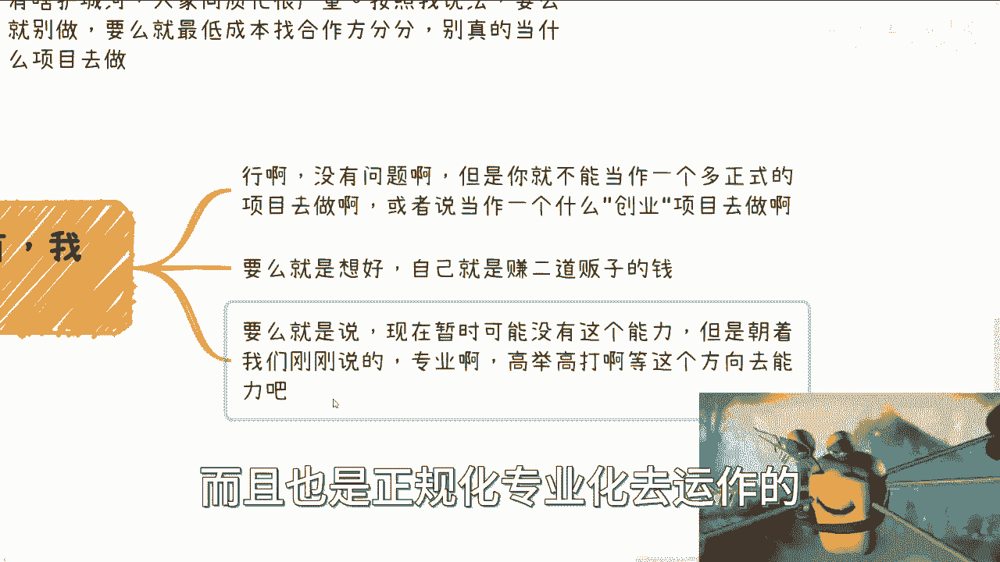

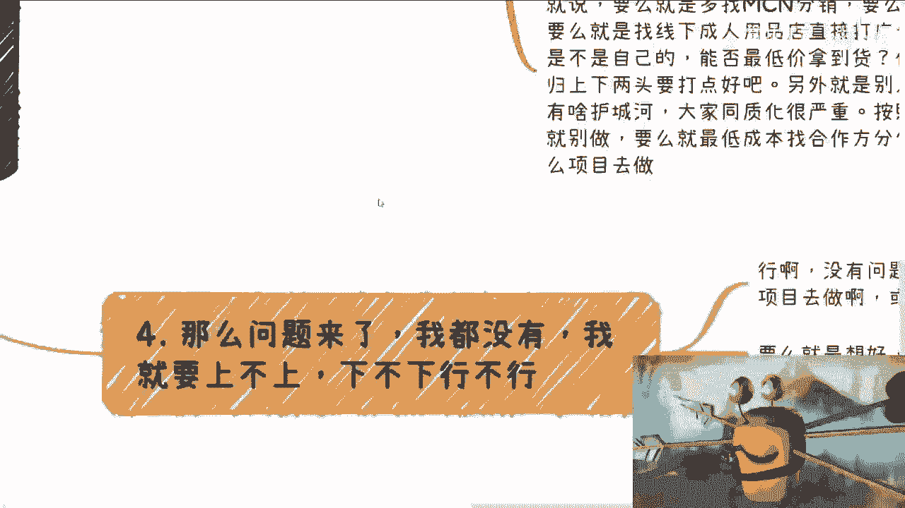

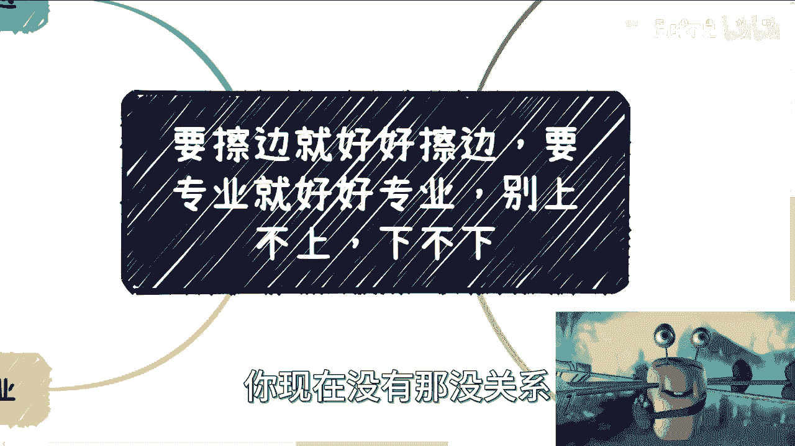

以下是给处于此阶段者的建议：

*   **接受“二道贩子”的定位**：如果既无上游资源也无下游壁垒，那么本质上就是一个“二道贩子”。可以接受这个定位，同时铺设多个分销渠道来赚取差价，但不要将其视为一个可以积累核心竞争力的正式项目。
*   **设定明确的发展方向**：更重要的是，必须为自己设定一个清晰的发展方向。问自己：我未来是想走向 **专业化/高举高打**，还是建立自己的 **护城河**？
*   **主动积累资源**：朝着设定的方向，主动去寻找和积累所需的资源、背书和标签（例如注册公司、积累案例、寻求权威合作）。在具备这些之前，可以将现有业务视为获取现金流的过渡手段。
*   **区分定位与业务**：赚钱的业务本身没有高低之分，但**业务的定位**有。一个模糊、低端的定位会让你难以接触和积累高端资源，从而限制发展天花板。观察成功的自媒体或企业，其背后通常都有公司化运作、专业标签和多元业务线作为支撑。

**关键认知**：在商业逻辑不闭环、无法可持续发展的阶段，不宜投入过多期望和资源。应明确将其定义为过渡性现金流业务，同时全力为未来的正式项目积累资本。

---

## 总结
本节课我们一起学习了如何为业务进行清晰定位并制定相应策略。

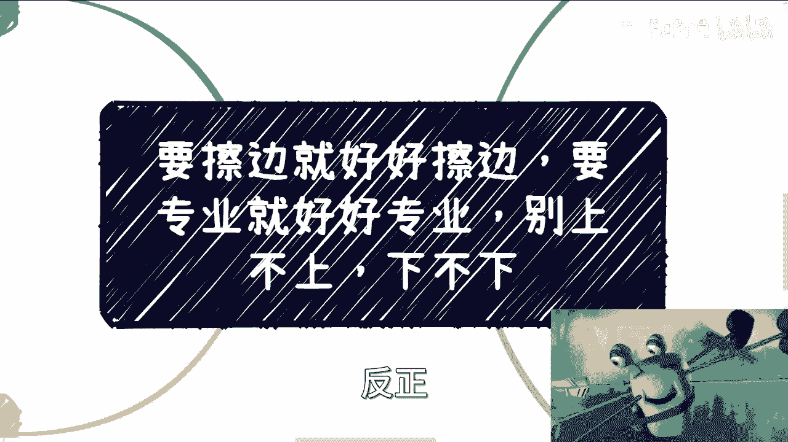

1.  **对于“擦边”业务**：要做就要做得彻底，必须解决供应链、合规化和市场策略问题，否则其商业逻辑难以闭环。
2.  **对于正规业务**：应采取“高举高打”策略，建立专业背书并积累案例，利用“从上往下打”的优势拓展市场。
3.  **对于当前“一无所有”的状态**：可以暂时以“二道贩子”模式获取现金流，但务必明确未来的发展方向（专业化或建立护城河），并主动积累所需的关键资源和标签，为转型做好准备。

核心在于，对自己手上的业务要有清醒的“定位”：它是主要项目还是次要补充？是认真投入还是浅尝辄止？想清楚这个问题，才能合理分配资源，避免在无法持续的事情上过度纠结，从而更有效地走向可持续的商业成功。