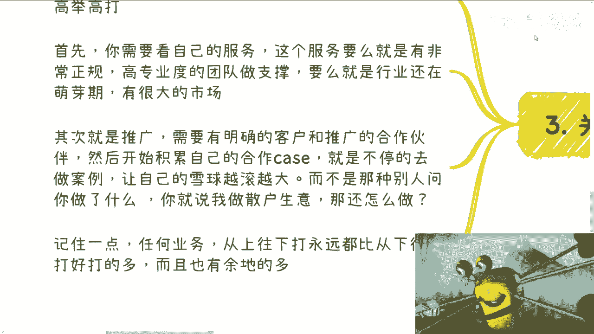
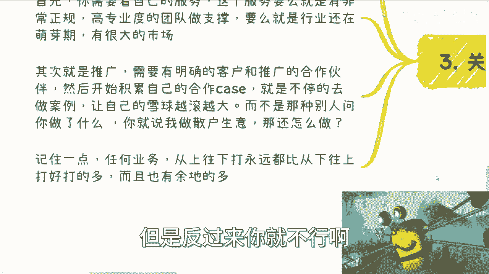
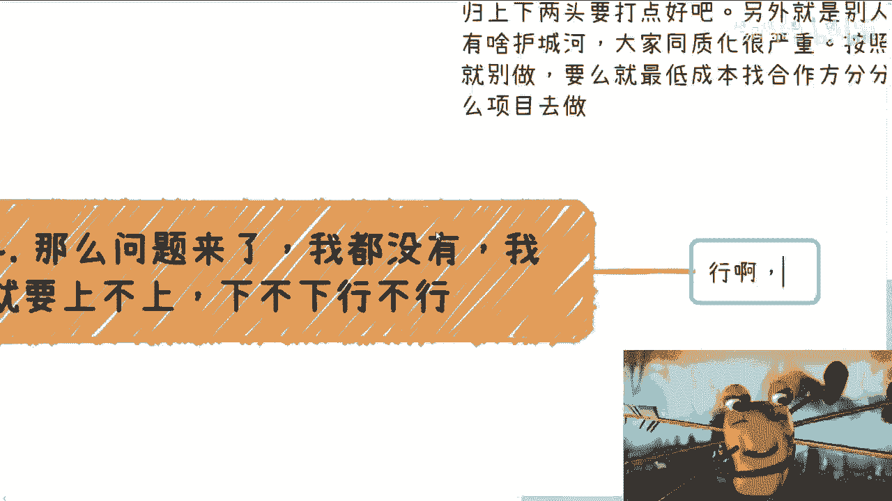
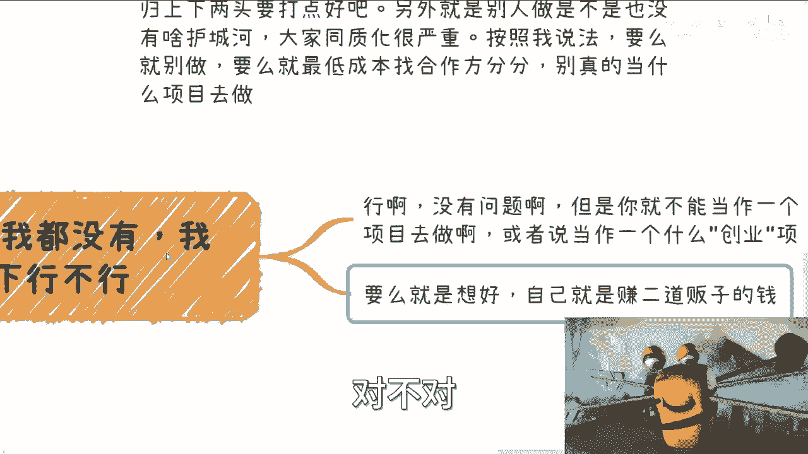
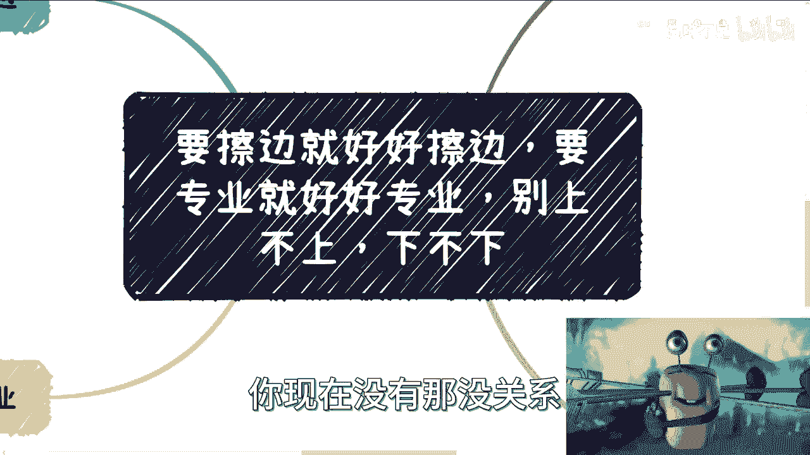

# 要擦边就好好擦边，要正规就好好正规，别上不上下不下 - P1 - 赏味不足 - BV1P94y1h7K7

啊大家好啊，国庆节继续啊，还没放完，哎呀不过对我来讲每天都放是吧，无所谓啊，呃首先啊我先说一下啊，就是大家呢对于赚钱这个事啊，呃都处基本上我聊下来了，基本上都处在这个地方。

就是上不上下不下这个状态就是什么意思呢，就是说啊这个跟我聊的呢，也有一些做这种成人用品的啊，然后呢也有那种就是说像就是在什么教育啊，或者在其他的电商上面去做的啊，呃先说擦边是吧，先说擦边啊。

对对我知道大家很感兴趣，擦边对吧，其实擦边呢他并不是不能擦边对吧，你现在很多平台都擦边，他直播擦边程度不一样对吧，你在我看来，所有的跟性暗示相关的那种都算擦边对吧，小姐姐跳舞也是擦边了，有啥区别呢对吧。

但是呢我觉得是这样子的，你要去做相关的产品啊，我不管你做什么对吧，你说你要做成人用品，还是说做一些别的一些周边也好对吧，你擦边你就好好擦，你不是说你做那就做那种跟过家家一样的做法。

就是那种就是说啊我倒卖一下物品对吧，或者怎么样，因为今天有个小伙伴来问我这个问题啊，我突然就想起来，就觉得因为之前咨询我的人当中也有蛮多，其实是唉不能说蛮多吧，就十个里面有那么两三个对吧。

这个跟我说要做成人用品的啊，嗯咳咳咳，我觉得这个事没啥，他本身就是人为固有需求对吧，但是我觉得做呢你就得做做好，什么叫做做好呢，就是你供应链上下游对吧，你要你看看你有没有自己的护城河。

就我为什么说很多人他上不上下不下，也就是说你要去看你不管做什么，你有没有你的护城河，你有没有稳定的固定客户对吧，你你有没有合作伙伴，去帮你扩展自己的服务类型，要么就是说你托管吧，你说这些什么都不做。

然后就说我我还问我还问我说你公司有没有啊，对吧，这怎么走啊。

票怎么开呀，对吧哦你说你啥都没有，你肯定做不好的，你怎么做呢，对不对啊，那么我们先来说怎么擦边啊，首先呢，我觉得成人用品这块或者性暗示的产品呢，它都存在这种擦边的嫌疑。

但是呢也可以做啊，首先呢你比如说我们随便打个比方，你可以打通海内外对吧，就说你分开来，比如说国内做引流对吧，然后国内做引流之后呢，你比如说呃海外去做一些，比如说擦边的这个产品，产品的售卖啊。

或者说甚至是服务，这个看似在什么国家对吧，你自己区别对待好，你自己做好这个归类啊，你说你就像我们刚问的，你说你有没有这个护城河对吧，你有没有自己的货源对吧，你有没有对应的供应商，利润高不高对吧。

然后就是这个客户稳定不稳定对吧，以及东稳定，那如果来说这些相对来讲都是有保障的，那么你就做，但如果没有，那你就当做一个业务之一，就是这个业务就留着，你就你就当它是一个现金流，你也别指望说我在这个地方。

这个做多大多大对吧，然后你就去去去拓展别的业务就结了嘛对吧，我之前在上半年吧，我跟那个TIKTOK那边的服务商，有讨论过这个问题，就其实他们有很多的这个账号，她都是小姐姐直播对吧，跳舞就正规的不擦边啊。

然后呢，他转头就是说通过对应的一些渠道到去海外，就提供一些小姐姐穿过的衣服啊，穿过的叉叉叉啊对吧，那那经营售卖能赚钱吗，那肯定能啊对吧，你说利润高不高，我也可以说高啊对吧，你说客户稳不稳定。

我说我个人觉得也稳定啊对吧，当然能啦，但是问题是你得想好啊，这事在什么地方做啊对吧，你在你你在国内做好做吗，那肯定不好做对吧，你你包括我说的公司怎么做啊，怎么合法的做啊对吧，你怎么怎么合规的做啊。

怎么开票啊对啊，怎么很好的做备案啊，但是你不要以为海外不备案对吧，海外海外只不过它可能不叫备案，他比如说登记对吧，或者其他的对吧，你怎么可持续发展，你怎么去做公司化运作，这个事你要去你要去思考的。

你知道吗啊，你比如说国内做成人用品之前，我也跟他们讨论过对吧，就我说你要么就都去找，直接就简单一点，比如说你就去找MC分销，你要么找KOL带货，你要么就是找线下的成人用品商店直接打广告。

比如说呃直接帮你做分销售卖啊，打那种，比如说易拉宝啊对吧，这些啊，就是你要是觉得比如说国内的这个网络，或者说平台上面，他对这个东西打击比较大对吧，或者说这个封的比较多，那你就在海外做嘛对吧。

那你索性要么就别做嘛，对不对，你不能说我既要又要的啊，另外呢你要去看你货是不是自己的，能否最低价拿到货，你做一个业务对吧，就是说你上下两头，两头你总归有一头得打点好吧对吧，另外就是说如果今天你做了。

你去看你的业务，别人是不是也能做对吧，如果大家同质化非常严重，那按照我的说法，你要么就别做，没什么好做的，因为你按我的想法，就是这种东西就别做对吧，你要么就这个东西就是你也没什么成本，就是最低成本的。

就放在那边，放在那边，就就合作方分销分分分分掉就结束了，别别别当什么项目去做哦，但做到最后还说哎呀，我好像投入很高对吧，我好像赚不到钱，这个东西本来它的商业逻辑就不闭环啊，有啥好做的。

对不对，那么第三个是吧，关于专业啊，你比如说很多人他说我认真想做个业务对吧，正规业务啊，他说我我就跟你说，你就高举高打，为什么呢，因为首先啊你需要自己看你这个业务，你业务要么就是有非常正规的对吧。

什么中科院啊，什么什么什么什么国家国家级研究院啊对吧，金这个金鑫伟啊对吧，科委啊对吧，团委啊对吧，你要么就高专业度的，你要么就说这个行业还在萌芽期，有很大的市场，是不是。

那这是那个一个大前提，其次就是推广对吧，你比如说需要有明确的客户和推广的这个，合作伙伴，然后你需要积累自己的合作case，也就是说你需要不停的去积累案例啊，就说你要让自己的雪球越滚越大，你想想看啊。

我不管你今天做的是一个专业性的东西，还是做一个这个擦边的东西，那你别人问你，你总不能跟别人说，哎我就做做散户生意对吧，我比如说我就做个直播间啊，然后接下来就是有流量我就做。

那你说这种东西谁会跟你合作对吧，包括你说比如说你去做教育对吧，或者你做那个那个那个直播电商啊，做医疗啊，你你你别人来问你，你说你想把你的合作方扩大，你想往政府往企业端去做，往国央企去做，往党媒央媒去做。

或者你做一个做一个什么数字数字化改造对吧，数字化服务对吧，那人家总会问你以前案例的哦，你说我以前案例啊，你看啊，我这个这个全部都是低脂低打对吧，都是都是散户，怎么合作，你跟我讲啊，所以我跟你们说啊。

就是说商业这个东西记住啊，不管你做什么任何的业务，从上往下打，永远都是比从下往上打好打得多，而且也会有很大的余地，什么意思呢，就是说你从下往上打，打不动，那就真的打不动，你从上往下打，你打不动。

你还能往下沉，你懂吗，就是说你从上往下打的时候，因为它是一个阶梯嘛，它就类似于一个金字塔嘛对吧，因为你从下往上打的时候，你说我从金金字塔底层往上去砸，往上去打，都是从下往上，我打不动啊。

但是从上往下打不一样，你就比如说我今天从团委背书对吧，好我我往那个工信厅农业厅打好，你说我打不动，那没关系啊，我再往下降一级呗对吧，到地方的这种，比如说什么什么什么什么基层公务员去打对吧，那我再打不动。

那也没关系啊，我再往大公司去打，大公司打不动，我再往中小型公司打，我再打不动，我往散户打对吧，就说你会有很多的余地，但是反过来你就不行。

所以呢当然这个过节啊，大家谅解一点，我做这个脑图做的粗糙了一点，哈哈那么问题来了，有很多人要问他说那吕老师我都没有，我就要上不上下不下行不行行啊，那你看我打给你们看啊，行啊，没问题啊对啊。

但是但是你你就不能当做一个就是什么，就就多正式的项目去做，对啊，或者说就是就当做一个什么什么什么，什么什么创业项目去做，这就没有意义了对吧，因为你本来你说我上不上下不下是什么意思。

就是我既没有上游的东西，我也没有下游的东西，我也没有护城河，那你其实无论做什么业务，你都是个二道贩子，那你二道贩子你就做呗，你你要我说你做二道贩子，你就手上他妈的铺十个二道贩子渠道，你就一辆学生结束了。

而不是说我今天做二道贩子，然后我就去把这个东西甚至当一个业务做，我还指望我有什么积累，没有啊对吧，你要么就是什么，你要么就是就是想好啊，自己就是赚二道贩子的钱，对不对。

然后你要么是什么，要么就是说哎现在暂时可能没有这个能力对吧，但是呢要朝着我们刚刚说的对吧，专业啊啊高举高打对吧，然后比如说但这个方向去努力吧对吧，也就是说你要么就是就是找到自己的护城河。

你要么就能够高举高打，就在这个过程当中慢慢慢慢去寻找对应的资源，去让自己从一个没有的状态到有的状态，那么你说我接下来比如说注册公司啊，我专业化的运作啊等等等，那这个东西不管成还是不成。

它最终都是能够有一个很大的一个，一个发展前景，同时也就是说也是给你宝贵的一个经验啊，同时你跟别人介绍之后，别人也会明白，就是你是一个做做生意的人，你是一个真正懂得商业化的人。

而不是说别人问下来你做什么呢，哎我做自媒体的，你做自媒体什么东西啊，我就我就说个散户的，你们想想看这玩意你怎么跟别人合作，就是就是就是我以前一直说的，就是你做一个东西也有，也就赚钱。

没有low不low之分，但是你的定位是有low不low之分的对吧，你这么一个定位，你坑我说你怎么去积累更高的资源，你怎么往上走，难啊对吧，你那你真的去看那些做做做做得好的，几百万粉丝的那种。

真的我们说很做的很好的自媒体，你你不要单纯从它的内容去看，你从他背后的商业逻辑去看，他背后也有公司，他背后也有title，他背后也有，就是我们说也有案例，也有所谓的身上有很多的标签。

这些东西就是他高举高打的这个这个叫什么，就是方向啊对吧，没有见到过有几个有多少个那种，就是几百万粉丝的，然后他他做商业化，就是说哎我纯粹就是收割C端的，有吗，有的，但是走不长啊，你知道吗，走不长啊。

就是或者说大家以为他纯粹收割C端，但其实他除了这条线以外，它还有别的更多的业务线，而且也是正规化专业化运作的。

只不过大家不知道，你懂吗。

啊所以说呢我觉得就是这个事儿啊，这个事儿啊，我不管你们做什么啊，就是我们说的就是你你现在没有。

那没关系，但是你得有一个有一个有一个叫什么，就是呃就是发展的方向，一个重点发展的方向，而这个方向上面到底你需要哪些资源，需要哪些背书对吧，或者需要哪些标签，你得自己去找，努力往身上贴。

然后你再把这东西当成个项目，在这之前你就当成一个过家家的，能够给你带来一定现金流的东西，不要去想着说哎呀，这个东西我能不能当成一个项目，能不能可持续发展，能不能怎么样都不能，因为从商业逻辑上来讲。

它就是不闭环的，你知道吗，就整个的这个逻辑，它本身就不可持续发展，就他甚至连快钱都算算不上，好吧，所以我希望就是说大家在做东西的时候呢，就是对这对自己手上的业务啊，他得有个定位，我们我们得有个定位对吧。

就是说这个东西我就是那你用我的话来讲，这个东西到底是我做呢还是不做呢，我做呢还是认真做呢，还是说是洒洒水做呢对吧，还有一出没一出做呢还是怎么样子呢对吧，其实是这个道理，你就像很多人就是我这么说吧。

我之前有个合伙人找我做那个直播电商，说我在义乌对吧，开了个直播间，让我帮他找一些货源，说可以啊啊我说你分我多少钱都可以啊，我也不是很要求这个东西对吧，但是你说我付出多少时间呢，我我就是有一出门一出。

比如说我今天找到一个合作方合作伙伴对吧，但是他是跟我在数字经济上的合作伙伴，我可能会问一句，我说哎你有没有什么货源啊对吧，有没有什么什么，比如小零食啊对吧，或者说什么手办啊，什么东西啊，货源有没有啊。

有没有跟我们合作一下，没有就算了对吧，我就属于那种有一搭没一搭搭一嘴的，那也可以啊，是哦但是你要说我指望着这东西吃饭，那他妈的不得了了啊，那我开始跟他说了，哎呦是不是哎呀，我们这里有什么竞争力啊对吧。

我们接下来怎么运营啊对吧，然后你应该给我多少钱，你就给我10%啊，那太少了，怎么样怎么样怎么样，你想想看你，你每天就是纠结在这种事情上面，但是你真正最终能赚多少钱呢，你都不知道。

你要说明天有1万个人买单，那也就算了，明天甚至十个人都没有，你说你每天纠结在这种事情上面，还怎么赚钱，对不对啊，行，那就这么着吧好吧，反正这个好像啊对。

还有还有那个直播有没有放上来吧，我明天吧，明天我把那个直播放上来，好吧行，那就这么着吧好吧，大家反正有啥这个需求的，因为国庆嘛好吧，有什么需求的，自己整理整理，然后未来呃对于手上牌不知道怎么打的啊对吧。

对于自己这个业务上面不知道怎么做的啊，啊对啊，关于这个业务上面是这样子的啊，你们要有问题，你们就直接问啊，不要跟我绕圈子啊，就直接问啊，然后就说你要是觉得要咨询就咨询，你要不要咨询，你就简单的私信我。

我都回答，我不会不回答好吧，但是不要跟我绕圈子，不要用那种假大空的东西，就你要就直直击主题就可以了，好吧行，那就这么着吧。

