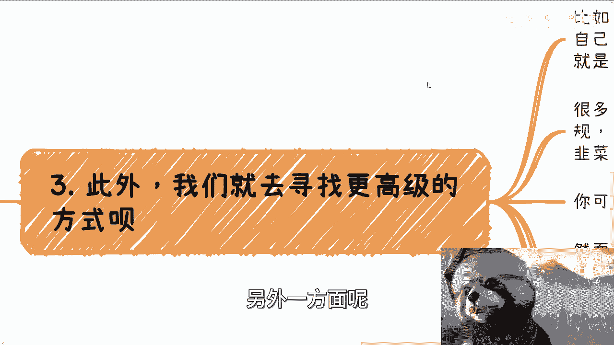

# 课程01：如何面对“看不上”的行为与个人成长 🧭

在本节课中，我们将探讨一个常见的生活与职场困境：当我们看不上某些行为或做法时，应该如何应对。我们将通过一个具体的故事，分析背后的心理与行为逻辑，并学习如何将注意力从“看不惯”转移到“自我成长”上，从而避免无谓的内耗，实现良性发展。

---

## 故事引入：关于“商业化”的争议

上一节我们介绍了课程的主题，本节中我们来看看一个真实的故事，它揭示了“看不上”行为背后的复杂心态。

曾经有一个合作团队，其中成员A极度看不惯任何商业化行为，认为所有以赚钱为目的的行为都是“割韭菜”。与此同时，团队中的成员B在商业化方面做得相当成功。

A对B的意见很大，并非源于直接的矛盾，而是A持续通过向他人打小报告、进行言语贬低（PUA）等方式，指责B的商业思维不正、人品不佳。

不久后，B离开了团队。紧接着，A自己却开始大力推行商业化，其做法甚至比B更为激进。回过头看，A当初激烈反对B的根本原因，很可能是因为B的存在妨碍了A自己去实施商业化。A通过贬低B，来为自己的后续行为铺路。

---

## 核心原则：看不惯，就别做

这类事情本质上并不少见。它反映了一个做人的基本标准或三观问题。

如果你真的看不上、看不惯某些事情，最直接的选择就是坚持不去做。既然你都看不起它了，为什么还要去做呢？这需要贯彻一致的勇气。

以下是贯彻这一原则的几个要点：

*   **言行一致**：就像故事中的A，如果认为“赚钱即割韭菜”，那就应有骨气坚持不赚这份钱。
*   **长期坚持**：个人理念需要经得起时间考验。例如，有人十年前认为“上班无解”、“卷不过别人”，十年后若境遇改变却开始鼓吹加班，这便是理念的崩塌。真正的理念不应因时而变。
*   **超越“酸葡萄”心理**：很多时候，人们贬低一件事，并非真的看不起，而是因为自己做不到，心生嫉妒（“酸”）。这种贬低除了发泄情绪，对自身成长毫无益处。

---

## 正确做法：专注自我，提升段位

上一节我们明确了“看不惯就别做”的原则，本节中我们来看看，当遇到自己看不上但又广泛存在的事情时，除了“不做”，更积极的应对策略是什么。

核心策略是：将注意力从“评价他人”转移到“发展自我”上。过度关注和贬低他人，对自己是一种巨大的内耗。

以下是具体的行动建议：

*   **避免低级斗争**：如果未来遇到类似A那样通过贬低他人来达成目的的人，最好的方式是不要理睬。与之纠缠只会消耗自己的精力，陷入无意义的“低级战争”。
*   **用行动代替批评**：如果认为别人做得不好，你有两种建设性的选择：一是去改变现状；二是亲自下场，做得比他更好，进行良性竞争。单纯的贬低与抱怨无异，没有实际意义。
*   **寻找更高阶的路径**：当你看到某个领域存在“劣币驱逐良币”（例如，正规做事赚得少，割韭菜反而赚得多）时，心里不平衡是正常的。但关键在于明白：**在任何领域，都存在利润高低不同的切入点和商业模式**。你的任务不是抱怨，而是去发现或开创那个更适合自己、更高级的盈利模式。
    *   **公式**：`可行路径 = 当前领域 × (多种商业模式 + 差异化切入点)`
*   **保持商业定力**：不用过分纠结业务是否在“风口”，也不用纠结“站着赚钱”还是“跪着赚钱”这种抽象概念。市场变化极快，“三十年河东，三十年河西”的周期已大大缩短。
    *   **核心是**：`赚钱是王道`。如果你觉得别人“跪着”，那你就努力找到“站着”赚钱的方法。如果暂时找不到，就承认现实，但持续探索。更何况，“站”与“跪”的标准因人而异，无需陷入概念之争。

---

## 行动指南：聚焦自身，持续修炼

基于以上分析，我们可以总结出一套清晰的行动指南，帮助大家在复杂环境中保持专注。

无论在学校、公司还是社会，我们总会遇到各种人际摩擦和价值观冲突。你无法控制别人的言行，唯一能控制的是自己的焦点和行为。

以下是你可以立即开始实践的步骤：

1.  **明确个人目标**：清晰定义你短期和长期想要达成的目标。将“超越某个你看不上的人”作为一个具体、积极的阶段性目标。
2.  **制定成长计划**：聚焦于自己每个月、每个季度需要学习什么、提升哪些技能。将时间投资于自我增值。
3.  **消化情绪，停止内耗**：允许自己有嫉妒、厌恶等情绪，但设定一个消化时限（例如半小时）。之后，坚决将注意力拉回到个人行动计划上。
4.  **坚守商业伦理底线**：可以借鉴，但不要完全抄袭；可以商业包装，但不要欺骗终端消费者（C端老百姓）。帮助客户真正落地、获得价值，才是长久之计。
5.  **简化关注圈**：减少对“竞争对手在做什么”的过度关心。除非是为了学习或策略分析，否则过多关注只会分散你的精力。修炼好内功是关键。

---

## 总结与鼓励

本节课中，我们一起学习了如何理性面对“看不上”的行为。

我们从“A与B的故事”出发，指出了“言行不一”和“酸葡萄心理”的问题。随后，我们确立了“看不惯就别做”的底线原则，并提出了更积极的应对策略：**停止无谓的贬低与内耗，将精力专注于自我提升与寻找更高阶的解决方案**。

记住核心公式：`个人成长 > 评价他人`。你的核心任务是通过持续学习和实践，找到属于自己的、可持续的成长与盈利路径。

即使不能立刻完全做到，也希望你能有意识地朝这个方向努力。修炼好自己，便是应对一切外界纷扰最有效的方法。